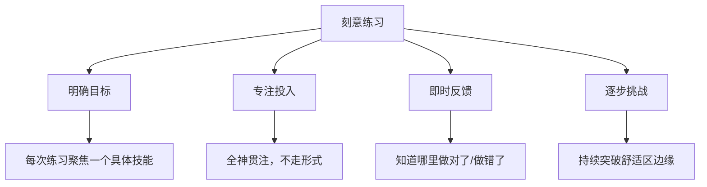
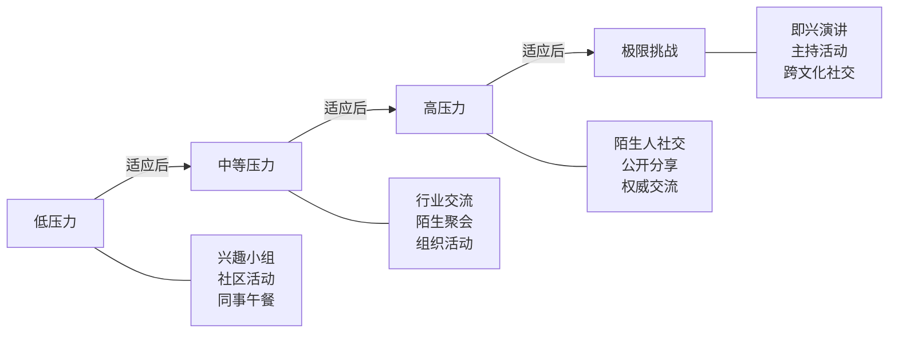

# 4.5 练习方法：从理论到实践的系统训练

掌握日常聊天的技巧不能仅靠阅读和理解，更需要通过持续、系统的练习将知识转化为能力。认知心理学家安德斯·埃里克森（K. Anders Ericsson）在研究了各领域顶尖高手后指出：**卓越表现的核心不是天赋，而是"刻意练习"（Deliberate Practice）**。聊天能力同样遵循这一规律——它不是"多聊就会了"那么简单，而是需要有目标、有反馈、有挑战的系统训练。

本节将从刻意练习的科学原理出发，提供一套完整的练习方案：每日微练习培养基本功、每周主题练习突破特定技能、阶段性评估确保方向正确，并解答练习过程中最常见的困惑。

---

## 一、练习的科学基础：为什么"多聊"不等于"会聊"

### 1.1 刻意练习的四个核心要素

很多人的社交练习停留在"舒适区重复"——每天和固定的人聊固定的话题，感觉在练习，实际上没有进步。真正有效的练习必须包含四个要素：

**明确目标**：不是"今天多聊天"，而是"今天练习用开放性问题延续话题至少3个回合"。模糊的目标无法衡量，无法改进。

**专注投入**：边刷手机边和人说话不叫练习。练习时需要全身心投入，观察对方的反应，思考自己的回应，觉察自己的情绪。

**即时反馈**：聊完后立刻复盘——对方的表情变化是什么？对话是变热了还是变冷了？哪个瞬间气氛有了转折？没有反馈的练习就像蒙着眼睛投篮。

**逐步挑战**：总是和同一类人聊同一个话题，能力会停滞。需要不断尝试新场景、新对象、新话题，让练习难度始终略高于当前水平。

### 1.2 技能习得的五个阶段

根据德雷福斯兄弟（Dreyfus & Dreyfus）的技能习得模型，聊天能力的提升经历五个阶段：

| 阶段 | 特征 | 典型表现 | 练习重点 |
|------|------|----------|----------|
| **新手** | 依赖规则，僵硬执行 | 严格按照"开场-提问-回应"的模板聊天，一遇到意外就慌 | 记住基本规则，在安全环境中反复练习 |
| **高级新手** | 开始识别情境 | 能区分"和领导聊天"与"和朋友聊天"的不同，但切换还不够灵活 | 在不同场景间切换练习，建立"情境-策略"的对应关系 |
| **胜任者** | 能主动规划 | 能根据对方特点选择聊天策略，开始有自己的风格 | 练习策略选择和灵活应变 |
| **精通者** | 直觉判断 | 能瞬间感知氛围变化，做出恰当回应，不需要刻意思考 | 在复杂场景中磨炼直觉 |
| **专家** | 浑然一体 | 聊天成为本能，能教别人，能创造新的聊天方式 | 传授经验，探索更高层次的社交艺术 |

大多数人在"高级新手"到"胜任者"之间停滞，因为这个阶段需要从"执行规则"转变为"自主判断"，而这恰恰是最难的练习——你需要在真实社交中承担风险，犯错，然后从错误中学习。

### 1.3 习惯回路：让练习自动化

根据查尔斯·杜希格（Charles Duhigg）在《习惯的力量》中提出的"暗示-惯常行为-奖赏"回路，要让聊天练习成为日常习惯，需要设计好这三个环节：

| 环节 | 作用 | 实操设计 |
|------|------|----------|
| **暗示（Cue）** | 触发练习行为 | 绑定到已有习惯：每天出门前看一眼"今日练习目标"卡片 |
| **惯常行为（Routine）** | 执行练习 | 出门后主动和遇到的第一个人说一句话 |
| **奖赏（Reward）** | 强化行为 | 每次练习后在日历上打勾，连续7天给自己一个奖励 |

BJ Fogg 的"微习惯"理论进一步建议：**开始时把目标设得足够小，小到不可能失败**。不要一开始要求自己"每天深度聊天30分钟"，而是"每天和一个人说一句话"。当这个行为成为习惯后再逐步升级。

---

## 二、每日练习：培养聊天的基本功

每日练习是整个训练体系的基石。每天投入30-40分钟，分为四个模块：观察、实践、积累、复盘。这四个模块对应能力提升的四个维度：感知力、执行力、储备量、反思力。

### 2.1 每日观察练习（10分钟）

**练习目标：** 培养对社交环境和人际互动的敏锐观察力。观察是聊天的前置技能——你观察到的细节越多，能抓住的话题线索就越多。

**为什么观察比开口更重要：** 大多数"不知道聊什么"的人，问题不在嘴上，而在眼睛上。他们没有注意到对方换了新发型、办公桌上多了盆绿植、朋友圈发了一条旅行动态。观察力是聊天素材的源头。

**练习方法：**
- 每天选择一个公共场所（咖啡厅、地铁、公园、食堂等），用10分钟时间观察周围人的互动方式
- 采用"三层观察法"：先看整体场景，再聚焦具体互动，最后捕捉细节
- 在手机备忘录中记录至少三个有趣的观察点

**三层观察法详解：**

| 层次 | 观察内容 | 具体示例 |
|------|----------|----------|
| **宏观层** | 整体氛围和场景特征 | 这家咖啡厅的顾客以年轻白领为主，大家都在用电脑，很安静 |
| **中观层** | 两个人之间的互动模式 | 那对情侣在讨论旅行计划，男方在手机上查机票，女方在翻攻略 |
| **微观层** | 具体的语言和非语言细节 | 他们在讨论价格时，女方皱了一下眉，男方立刻说"这个预算可以" |

**观察记录模板：**
日期：____
地点：____
场景氛围：____（整体感觉，如"安静专注"/"热闹轻松"）
观察对象：____（描述外在特征，不记录隐私信息）
开场方式：____（他们怎么开始说话的？谁先开口？说了什么？）
话题类型：____（闲聊/工作/情感/计划/八卦/争论）
互动特点：____（谁说得多？谁在主导？气氛如何变化？）
非语言信号：____（表情、手势、身体朝向、眼神接触频率）
转折点：____（有没有某个瞬间气氛明显变化？因为什么？）
我的启发：____（这个观察给我什么启示？我可以在什么场景中运用？）

**进阶练习：预测与验证**
当你观察到一组人开始聊天时，尝试预测对话的走向：
- 他们可能会聊什么话题？
- 对话大概会持续多久？
- 氛围会变好还是变差？

然后继续观察验证你的预测是否准确。这个练习能显著提升你的社交直觉。

### 2.2 每日一聊练习（5-15分钟）

**练习目标：** 增加日常聊天的实践量，降低社交焦虑，将观察转化为行动。

**为什么从"非必要"交流对象开始：** 和必须交流的人（同事、家人）聊天不算练习，因为你有不得不聊的压力，而且对方对你的"容错率"高。和陌生人或半熟人聊天才是真正的练习——没有退路，但也没有后果，失败了不丢面子。

**练习方法：**
- 每天至少与一个"非必要"交流对象进行一次简短的聊天
- "非必要"交流对象包括：便利店店员、保安、快递员、出租车司机、邻居、其他部门的同事、健身房的陌生人等
- 聊天内容可以很简单：问候、天气、环境观察、共同经历

**练习梯度（循序渐进）：**

| 阶段 | 时间 | 目标 | 具体任务 |
|------|------|------|----------|
| 第1周 | 1-2分钟 | 自然开启话题 | 每天和一个陌生人说一句非功能性的话（不只是"谢谢"） |
| 第2周 | 2-3分钟 | 延续话题1-2个回合 | 对方回应后，再追问或补充一句 |
| 第3周 | 3-5分钟 | 完成完整的简短对话 | 从开场到自然结束，不冷场不尬聊 |
| 第4周 | 5-15分钟 | 有深度的轻松聊天 | 聊出有趣的内容，双方都感到愉快 |
| 第5-8周 | 15-30分钟 | 和不同类型的人都能聊 | 主动挑战不同年龄、职业、性格的人 |

**每日一聊记录：**
日期：____
对象：____（角色，如"咖啡店店员"）
开场话术：____（你说了什么来开启话题？）
对方反应：____（积极/平淡/抗拒？具体表现？）
持续时间：____
话题流转：____（从A话题到B话题到C话题……）
气氛评分：____（1-10分，10分=非常愉快）
我的感受：____（紧张/放松/兴奋/尴尬？）
做得好的地方：____
可以改进的地方：____

**"破冰话术"实战库：**

| 场景 | 话术示例 | 适用说明 |
|------|----------|----------|
| 便利店/超市 | "这个新品你试过吗？味道怎么样？" | 利用共同环境发起话题 |
| 电梯/走廊 | "今天这天气真是……" | 经典安全牌，配合表情和语气 |
| 排队等待 | "你也经常来这家吗？有什么推荐的？" | 寻求建议是最低压力的开场 |
| 健身房 | "你这个动作做得好标准，练了多久了？" | 真诚的赞美+好奇的提问 |
| 咖啡厅 | "你这个看起来不错，是什么？" | 点单时自然引出 |
| 通勤路上 | "这趟车/这条路最近是不是特别堵？" | 共同经历引发共鸣 |

### 2.3 每日素材积累（10分钟）

**练习目标：** 丰富社交货币储备，解决"没话说"的问题。聊天本质上是信息交换——你的信息储备越丰富，能聊的话题就越多。

**为什么需要刻意积累素材：** 很多人觉得自己"没什么有趣的事可说"，其实不是没有，而是没有经过加工。你今天看到的一条新闻、读到的一个观点、经历的一件小事，都是聊天素材，但你需要把它们从"原始信息"加工成"可分享的故事"。

**素材加工三步法：**
1. **记录原始信息**：今天看到/听到/读到了什么？
2. **加工为个人版本**：用自己的话重新表达，加上自己的看法和感受
3. **标注使用场景**：这个素材适合什么场合、和谁聊、怎么引入？

**每日素材积累模板：**
日期：____
素材来源：____（新闻/社交媒体/播客/书籍/朋友分享/个人经历）
原始内容：____（一句话概括）
我的看法：____（你怎么看这件事？为什么？）
个人关联：____（这件事和你的经历/兴趣有什么联系？）
适用场景：____（职场闲聊/朋友聚会/约会/家庭聚餐）
引入方式：____（怎么自然地聊到这个话题？）

**高质量素材来源清单：**

| 类别 | 来源 | 适合人群 | 素材特点 |
|------|------|----------|----------|
| **时事新闻** | 新闻App头条、人民日报微博 | 所有人 | 时效性强，容易引发讨论 |
| **科技前沿** | 36氪、少数派、Hacker News | 科技爱好者/职场人士 | 有话题深度，显得有见识 |
| **生活趣味** | 小红书热门、抖音神评论 | 年轻人 | 轻松有趣，适合破冰 |
| **文化深度** | 看理想、单读、播客节目 | 文艺青年 | 有品味，适合深度交流 |
| **行业动态** | 行业公众号、LinkedIn | 职场人士 | 展现专业度，适合行业社交 |
| **冷知识** | 果壳、知乎热榜 | 所有人 | 有趣有料，适合聊天调味 |

**素材转化示例：**

原始信息："科学家发现人类每天做出约35000个有意识的决策"
↓ 加工
个人版本："今天看到一个有意思的研究——我们每天竟然要做3万多个有意识的决策，
难怪下班后会觉得脑子不转了，光是中午吃什么就已经用掉不少额度了。"
↓ 标注场景
适用场景：同事午饭选择困难时、朋友抱怨工作累时
引入方式："说到选择困难，我今天看到个数据还挺有意思的……"

### 2.4 每日复盘练习（5分钟）

**练习目标：** 通过反思加速学习进程。埃里克森的研究表明，没有反思的练习只是重复，有反思的练习才是进步。

**复盘的科学原理：** 神经科学研究发现，当你回顾一段经历并进行分析时，大脑会重新激活相关的神经通路，相当于"再练一遍"。而且复盘时你能以旁观者的视角审视自己，发现练习中没有意识到的问题。

**三问复盘法：**
- **成功回顾**：今天最成功的一次聊天是什么？成功的关键因素是什么？
- **问题诊断**：今天最不理想的一次互动是什么？卡在了哪个环节？
- **明日规划**：明天我想尝试什么新技巧？在哪次互动中尝试？

**复盘日记模板：**
日期：____

✅ 今日最佳互动：
  对象：____
  场景：____
  做对了什么：____
  对方的积极反应：____
  为什么这个互动成功了：____

⚠️ 今日最需改进的互动：
  对象：____
  场景：____
  问题出在哪里：____
  当时我的感受：____
  如果重来一次，我会怎么做：____

📝 明日计划：
  重点练习的技能：____
  计划使用的具体话术/技巧：____
  目标练习对象和场景：____

📊 今日统计：
  主动发起的对话次数：____
  平均对话时长：____
  使用新技巧的次数：____

**录音复盘法（强烈推荐）：**

这是最被低估的练习方法。用手机录音功能记录一次真实对话（在合法且对方知情的前提下），然后回放分析：

| 分析维度 | 关注内容 | 常见发现 |
|----------|----------|----------|
| **语速** | 是否太快/太慢？紧张时有没有加速？ | 大多数人紧张时语速会加快30-50% |
| **语调** | 是否太平？有没有抑扬顿挫？ | 很多人说话像念稿，缺乏情绪起伏 |
| **口头禅** | "然后""就是""对吧""嗯"出现频率 | 口头禅过多会显得不自信 |
| **停顿** | 有没有适当的停顿？停顿时在做什么？ | 好的停顿比填满沉默更有力量 |
| **提问质量** | 问题是否开放？是否深入？ | 大多数人问的问题太封闭，对方只能答"是/不是" |
| **倾听信号** | 有没有回应对方的内容？还是只等自己说话？ | "嗯嗯"不算真正的倾听回应 |

**录音分析模板：**
录音日期：____
对话对象：____
对话时长：____
对话主题：____

语速评估：____（太快/适中/太慢）
语调评估：____（平淡/有起伏/过于夸张）
口头禅统计：____（列出出现频率最高的3个）
有效停顿次数：____
无效填充词次数：____

提问分析：
  开放性问题数量：____
  封闭性问题数量：____
  最好的一个问题：____
  最需要改进的一个问题：____

倾听表现：
  是否回应了对方的核心观点：____
  有没有打断对方：____
  有没有错过对方给出的话题线索：____

整体评分：____（1-10分）
最大的一个改进点：____

---

## 三、每周练习：系统提升聊天能力

每日练习是"练基本功"，每周练习则是"练专项技能"。每周聚焦一个特定技能，在所有社交互动中有意识地练习，周末进行总结评估。

### 3.1 每周主题练习

**练习目标：** 针对特定聊天技能进行集中训练，实现单点突破。

**练习方法：**
- 每周选择一个特定的聊天技能作为练习重点
- 在这一周的所有社交互动中，有意识地练习这个技能
- 每天记录练习情况，周末进行总结和评估

**12周进阶练习计划：**

| 周次 | 练习重点 | 每日具体任务 | 验收标准 |
|------|----------|-------------|----------|
| 第1周 | 开启话题 | 每天成功开启3次以上非功能性对话 | 能在30秒内自然地和陌生人开始聊天 |
| 第2周 | 延续话题 | 每次对话至少延续3个回合，不让话掉地上 | 对话不再"一问一答"，有来有回 |
| 第3周 | 提问技巧 | 每天至少问5个开放性问题（为什么/怎么样/什么感受） | 提问不再只是"是不是""好不好" |
| 第4周 | 倾听技巧 | 每次对话至少复述一次对方的核心观点 | 对方能感受到"你在认真听" |
| 第5周 | 赞美技巧 | 每天给出3个具体、真诚的赞美 | 赞美不再是"你好厉害"，而是"你这个方案的数据分析部分做得很严谨" |
| 第6周 | 幽默技巧 | 每天尝试1次自嘲或轻松的玩笑 | 幽默不尴尬，能引发对方自然的笑 |
| 第7周 | 话题转换 | 每天至少进行2次自然的话题转换 | 对方不会感觉到"话题怎么突然变了" |
| 第8周 | 非语言沟通 | 有意识地观察和调整自己的表情、手势、身体朝向 | 录像检查：眼神接触率提升，肢体语言更开放 |
| 第9周 | 结束对话 | 每天练习在合适时机优雅地结束1次对话 | 结束时双方都感到愉快，不尴尬 |
| 第10周 | 薄弱场景 | 选择最让你焦虑的场景集中练习 | 该场景的焦虑评分降低至少2分 |
| 第11周 | 综合运用 | 在一次完整对话中灵活运用多种技巧 | 能自然切换不同技巧，不机械 |
| 第12周 | 复习巩固 | 回顾所有技能，找出仍需加强的短板 | 制定下一阶段的个性化练习计划 |

**每周主题练习记录表：**
本周主题：____
起止日期：____ 至 ____

周一：____（练习情况、效果、反思）
周二：____
周三：____
周四：____
周五：____
周六：____
周日：____

本周总结：
  练习次数：____
  成功次数：____
  最大的进步：____
  仍需改进的：____
  下周重点：____

### 3.2 每周社交实践

**练习目标：** 在真实社交场景中检验和巩固学到的技巧。"纸上得来终觉浅"，再好的理论也需要在真实的人际互动中锤炼。

**梯度社交实践体系：**

| 压力等级 | 实践类型 | 具体建议 | 练习目标 |
|----------|----------|----------|----------|
| **低压力** | 兴趣小组（读书会、运动俱乐部、烹饪班） | 选择一个自己感兴趣的领域，参加线下活动 | 在共同话题的基础上练习社交 |
| **低压力** | 同事午餐 | 每周至少和不同部门的同事吃一次饭 | 扩大社交圈，练习跨话题聊天 |
| **中压力** | 行业交流活动 | 参加行业沙龙、技术分享会 | 练习"有目的的社交"，学习在半正式场合聊天 |
| **中压力** | 朋友聚会（有陌生人） | 主动参加有不认识的人的聚会 | 练习快速破冰和融入已有对话 |
| **中压力** | 组织小型聚会 | 邀请3-5个来自不同圈子的朋友一起活动 | 练习"主持人"角色——介绍、串联、照顾 |
| **高压力** | 陌生人社交活动 | 参加社交类App组织的线下活动 | 练习在完全陌生的环境中快速建立连接 |
| **高压力** | 公开分享 | 在读书会/分享会上做5分钟的发言 | 练习在众人面前表达，管理紧张感 |
| **极限挑战** | 即兴演讲 | 参加Toastmasters或类似活动 | 在完全没有准备的情况下组织语言 |

**每周社交实践记录：**
本周实践：____
活动类型：____（低/中/高/极限）
活动名称/地点：____
参加人数：____
我认识的人数：____

练习目标：____
实际表现：____

具体对话记录：
  对话1：对象____，话题____，时长____，感受____
  对话2：对象____，话题____，时长____，感受____

做得最好的地方：____
最需要改进的地方：____
下次实践的调整：____

### 3.3 每周案例分析

**练习目标：** 通过拆解真实案例加深对聊天技巧的理解，培养"社交分析"能力。

**为什么案例分析有效：** 当你分析别人的对话时，你没有社交压力，可以冷静地思考"哪里做得好、哪里有问题、如果是我会怎么做"。这种"旁观者视角"能帮你建立评判标准，而这个标准反过来会指导你自己的实践。

**案例来源：**
- 自己的亲身经历（最佳来源，因为有第一手感受）
- 观察到的他人互动
- 影视剧中的对话片段（注意：影视剧经过编剧加工，不完全等于现实，但可以学习技巧）
- 播客/访谈节目中的对话

**案例分析模板：**
案例编号：____
日期：____
来源：____（亲身经历/观察/影视/其他）

【场景描述】
地点：____
参与者：____（人数、关系、各自角色）
话题：____
时长：____

【关键片段回放】
开场：____
转折点1：____
转折点2：____
高潮/低谷：____
结尾：____

【技巧拆解】
使用了哪些技巧：____
哪个技巧用得最巧妙：____
哪个地方处理得不够好：____

【理论对照】
这个案例体现了哪个聊天原理：____
如果用本书的理论来分析，问题出在哪里：____

【我的方案】
如果是我在这个场景中，我会：____

【核心教训】
这个案例教会我最重要的一点：____

### 3.4 每周技能反馈

**练习目标：** 通过外部视角发现自己看不到的问题。自我评估有盲区，他人反馈能帮你校准。

**获取有效反馈的方法：**

不是所有的反馈都有价值。"你聊天挺好的"这种反馈没有信息量。你需要引导对方给出具体的、可操作的反馈。

**反馈获取三步法：**
1. **选对人**：选择一个观察力强、说话诚实、和你关系足够好不会敷衍你的人
2. **问对问题**：用具体的问题引导，而不是笼统地问"我聊得怎么样"
3. **听对态度**：防御心理会让你听不进去，先说"谢谢你告诉我"再分析

**反馈问卷（可发给信任的朋友）：**
1. 这周和我聊天时，你觉得最舒服的一个瞬间是什么？（具体描述一下）
2. 有没有哪个瞬间让你觉得不太自在或想换个话题？
3. 我在聊天中最大的优点是什么？（举个具体例子）
4. 你觉得我在哪个方面可以提升？（给出具体建议，比如"可以多问一些
   开放性问题"而不是"可以更有趣一点"）
5. 如果用1-10分评价这周和我聊天的整体体验，你会打几分？
6. 你觉得我在不同的聊天场景中表现是否一致？哪个场景最好/最差？

**反馈分析表：**
反馈日期：____
反馈人：____
反馈人与我的关系：____
反馈内容摘要：____

正面反馈：
  1. ____
  2. ____
  3. ____

改进建议：
  1. ____
  2. ____
  3. ____

与我的自我评估对比：
  一致的地方：____
  我没想到的地方：____
  我不完全同意的地方（为什么）：____

基于反馈的下周行动计划：
  1. ____
  2. ____
  3. ____

---

## 四、AI辅助练习：科技赋能社交训练

在人工智能时代，练习社交技能有了全新的工具。AI可以作为你的"安全练习伙伴"——没有社交压力，随时可用，不会评判你。

### 4.1 AI对话模拟练习

**练习方法：** 使用AI聊天工具（如ChatGPT、Claude等）进行对话模拟练习。关键是要给AI设定具体的角色和场景，而不是泛泛地聊天。

**高效Prompt模板：**
请你扮演[角色]，我们在[场景]中偶遇。你的性格是[性格描述]。
我想练习[具体技能，如"用开放性问题延续话题"]。
请你正常和我聊天，但在我结束对话后，请给我详细的反馈：
1. 我哪里做得好？
2. 哪里可以改进？
3. 你注意到我的什么模式或习惯？

**模拟场景示例：**

| 场景 | AI角色设定 | 练习重点 |
|------|-----------|----------|
| 咖啡厅偶遇 | "你是一个30岁的自由摄影师，性格开朗，喜欢旅行" | 快速破冰、寻找共同话题 |
| 行业交流会 | "你是一个资深的产品经理，比较严肃但很专业" | 专业话题切入、展示价值 |
| 朋友聚会 | "你是我朋友带来的新朋友，性格内向但很有想法" | 照顾不同性格的人、引导发言 |
| 同事午餐 | "你是隔壁部门的技术主管，最近压力很大" | 倾听、共情、适度回应 |

### 4.2 录音转文字分析

**练习方法：** 用手机录下真实对话，使用语音转文字工具（讯飞听见、飞书妙记、微信自带的语音转文字等）生成文字稿，然后用AI分析。

**AI分析Prompt：**
以下是一段真实的对话记录。请从聊天技巧的角度分析：
1. 双方的提问质量（开放性vs封闭性）
2. 话题延续能力（有没有让话题自然流动）
3. 倾听表现（有没有回应对方的核心内容）
4. 语气和节奏（有没有适当的停顿和情绪表达）
5. 最大的改进空间在哪里？

对话内容：
[粘贴对话文字稿]

### 4.3 聊天素材AI生成

**练习方法：** 当你需要为特定场景准备聊天素材时，可以让AI帮你生成备选话题和话术。

**Prompt示例：**
我明天要参加一个[场景描述]，参加的人主要是[人群描述]。
我是一个[你的简要描述]。
请帮我：
1. 列出5个适合这个场景的聊天话题
2. 每个话题给出3种不同的开场方式
3. 预判对方可能的回应，以及如何延续
4. 标注每个话题的风险等级（安全/中等/敏感）

---

## 五、阶段性评估与调整

### 5.1 月度自我评估

每月进行一次全面的自我评估，检视自己的进步情况，调整练习方向。

**八维度评估表：**

| 维度 | 评估问题 | 月初评分 | 月末评分 | 变化 |
|------|----------|----------|----------|------|
| 开启话题 | 我能在30秒内自然地与陌生人开启对话吗？ | __/10 | __/10 | __ |
| 延续话题 | 我能让对话持续流动而不冷场吗？ | __/10 | __/10 | __ |
| 倾听能力 | 我能准确理解对方在说什么、需要什么吗？ | __/10 | __/10 | __ |
| 幽默能力 | 我能在合适的时机使用幽默且不尴尬吗？ | __/10 | __/10 | __ |
| 赞美能力 | 我能给出真诚、具体、不谄媚的赞美吗？ | __/10 | __/10 | __ |
| 场景适应 | 我能在不同场景中灵活调整聊天风格吗？ | __/10 | __/10 | __ |
| 情绪管理 | 我在社交场合中的焦虑程度是否在下降？ | __/10 | __/10 | __ |
| 整体信心 | 我对自己的聊天能力有信心吗？ | __/10 | __/10 | __ |

**月度总结模板：**
评估月份：____

本月最大进步：____
本月最需改进：____
本月最满意的一次社交经历：____
本月最需要反思的一次社交经历：____

练习数据统计：
  每日练习完成率：____%
  每周实践次数：____
  新尝试的社交场景：____
  获取的外部反馈数量：____

下月练习重点：____
下月目标：
  1. ____
  2. ____
  3. ____

### 5.2 季度目标设定

每三个月设定一个新的学习目标，保持持续进步。每个季度的目标应该有明确的方向和可衡量的指标。

| 季度 | 主题 | 核心目标 | 具体指标 |
|------|------|----------|----------|
| **第一季度** | 夯实基础 | 能在任何场合自然地开启和维持基本对话 | ①能和陌生人聊5分钟以上 ②掌握至少5种开场方式 ③每周至少3次非必要社交 |
| **第二季度** | 技巧精进 | 掌握高级聊天技巧，形成个人风格 | ①能自然使用幽默和赞美 ②能在不同人群中调整聊天风格 ③至少参加10次社交活动 |
| **第三季度** | 场景突破 | 能在高压力场合保持从容 | ①能在20人以上场合发言 ②能和权威人士自然交流 ③能处理聊天中的分歧和尴尬 |
| **第四季度** | 自然流畅 | 聊天成为本能，享受社交过程 | ①不再需要刻意思考该说什么 ②能教别人聊天技巧 ③社交成为生活乐趣而非负担 |

### 5.3 进阶练习方向

当你掌握了基本的聊天技巧后，可以向以下五个方向进阶，每个方向都代表聊天能力的一个新维度：

**深度对话能力：** 学会将闲聊自然地过渡到有深度的对话。当对方说"最近工作挺忙的"，你可以停留在"是啊，大家都忙"的表面，也可以深入到"忙的时候你一般怎么给自己充电？"——后者能让你们建立更真实的连接。练习方法：每次聊天至少尝试一次"深挖"，从对方的回答中找到可以继续深入的点。

**群体聊天能力：** 多人对话和一对一完全不同——你需要同时关注多个人的反应，把握发言时机，照顾到沉默的人，避免一个人垄断话题。练习方法：在群体聊天中有意识地做三件事——①在某人说完后给予回应，②邀请沉默的人发言，③在话题冷却时引入新话题。

**跨文化沟通能力：** 不同文化背景的人有不同的聊天习惯——北方人可能更直接，南方人可能更含蓄；理工科的人可能更注重逻辑，文科生可能更注重感受。练习方法：主动和不同背景的人聊天，观察并适应他们的沟通风格，而不是用自己的标准要求对方。

**线上聊天能力：** 微信、社交媒体等平台上的聊天有自己的规则——缺少非语言信号，回复节奏不同，表情包承担了大量情绪表达的功能。练习方法：记录线上聊天中的"神回复"和"尬聊"案例，分析差异在哪里，学习在线上环境中用文字传递情绪和态度。

**冲突化解能力：** 聊天中出现观点分歧是正常的，关键是如何优雅地处理——既不放弃自己的立场，也不伤害关系。练习方法：学习"认可-好奇-分享"的分歧处理框架——先认可对方有这个想法的权利，然后好奇地询问原因，最后用"我的感受是……"而非"你错了"来表达自己的观点。

---

## 六、练习中的常见问题与解决方案

### Q1：我性格内向，也能成为聊天高手吗？

**A：** 当然可以，但路径不同。内向和外向不是能力的限制，而是能量的来源不同。外向的人通过社交获取能量，内向的人在社交中消耗能量。这意味着：

- **你的练习节奏应该更温和**：不需要像外向的人一样每天参加大量社交活动，质量比数量更重要
- **你有天然优势**：内向的人通常更善于倾听、观察和深度思考——这些都是聊天中的稀缺品质
- **关键是找到"充电方式"**：在高强度社交后给自己安排独处时间恢复能量，而不是硬撑

内向者专属练习建议：每次社交活动后给自己30分钟独处时间；优先选择一对一或小团体社交（3-4人），避免一开始就挑战大型社交场合；利用你的倾听优势，做"提问者"而非"表达者"。

### Q2：练习过程中总是失败怎么办？

**A：** 首先要重新定义"失败"。在社交练习中，只有两种真正的失败：①完全放弃练习，②从不反思。其他的"尴尬""冷场""说错话"都是练习的一部分。

**处理失败的四步法：**
1. **允许自己不舒服**：尴尬是正常的生理反应，不是你有问题
2. **提取具体教训**：不是"我太菜了"，而是"下次在转换话题时可以更自然地过渡"
3. **降低难度继续**：如果连续失败，说明当前难度太高，退回舒适区边缘重新练
4. **记录进步轨迹**：回看3个月前的自己，你会发现进步比你想象的大

### Q3：如何克服社交焦虑？

**A：** 社交焦虑是进化遗留的生存本能——在远古时代，被群体排斥等于死亡。所以你的大脑把"社交风险"当成了"生死威胁"，反应过度了。

**渐进式暴露法：**

| 阶段 | 练习内容 | 焦虑等级 | 每阶段持续时间 |
|------|----------|----------|----------------|
| 1 | 对着镜子练习微笑和打招呼 | 1-2/10 | 3-5天 |
| 2 | 和家人/亲密朋友练习主动聊天 | 2-3/10 | 1周 |
| 3 | 和服务人员（店员、外卖员）简短交流 | 3-4/10 | 1-2周 |
| 4 | 和同事/同学进行非工作话题聊天 | 4-5/10 | 1-2周 |
| 5 | 和半熟人（邻居、朋友的朋友）聊天 | 5-6/10 | 2周 |
| 6 | 参加有陌生人的小型社交活动 | 6-7/10 | 2-3周 |
| 7 | 在陌生人群中主动发起对话 | 7-8/10 | 3-4周 |
| 8 | 在公开场合发言或分享 | 8-9/10 | 持续挑战 |

**关键原则：** 每个阶段都要练习到焦虑明显下降后再进入下一阶段。如果焦虑超过7/10且持续不降，退回上一阶段。如果焦虑严重影响日常生活（如无法出门、无法工作），请寻求专业心理咨询——这不丢人，这是对自己负责。

**即时减压技巧：**
- **4-7-8呼吸法**：吸气4秒，屏息7秒，呼气8秒。在社交前做3轮，能快速降低心率
- **认知重构**：把"他们会觉得我很奇怪"替换为"大多数人更关注自己，不会太在意我的表现"
- **关注外部**：焦虑时你关注的是"我表现得怎么样"，试着把注意力转移到"对方在说什么"

### Q4：练习多久才能看到效果？

**A：** 这取决于你的起点、练习质量和投入时间。根据行为心理学研究，一个新习惯的养成平均需要66天（而非流行的"21天"说法）。聊天能力的提升大致遵循以下时间线：

| 时间线 | 你会感受到的变化 |
|--------|------------------|
| **1-2周** | 开始有意识地观察社交互动，比以前注意到更多细节 |
| **3-4周** | 开始在低压力场景中主动聊天，焦虑感有所下降 |
| **2-3个月** | 身边的人开始注意到你的变化，主动社交变得更自然 |
| **4-6个月** | 聊天技巧开始内化为直觉，不再需要刻意思考 |
| **6-12个月** | 在大多数社交场景中感到自然和自信 |
| **1年以上** | 聊天成为你的核心能力之一，可以开始教别人 |

**重要提醒：** 进步不是线性的，你会经历平台期（感觉怎么练都没进步）和退步期（压力大时社交能力倒退）。这都是正常的。平台期往往是能力在暗中积累的信号——就像竹子在地下的前几年都在长根系，一旦破土就飞速生长。

### Q5：如何保持练习的动力？

**A：** 动力衰减是所有自我提升计划面临的最大挑战。以下是经过验证的策略：

**① 最小阻力原则**：把练习的启动成本降到最低。不要设计复杂的练习流程，最好是一出门就能做的——比如"今天对第一个人微笑"。越简单越容易坚持。

**② 社交压力法**：找一个"练习搭档"，互相监督和鼓励。人更容易辜负自己，但不太容易辜负朋友。约好每周互相汇报练习情况。

**③ 进步可视化**：用日历打卡、练习日志、评分曲线等方式让进步变得可见。当你看到自己从3分涨到6分，那种成就感本身就是最好的动力。

**④ 奖励机制**：每完成一周的练习计划，给自己一个小奖励。每完成一个月，给自己一个大奖励。把社交进步和生活中的积极体验关联起来。

**⑤ 回顾初心**：当你想放弃时，回忆一下当初为什么要练习聊天。是因为孤独？是因为职业发展需要？是因为想成为更好的自己？把初心写在纸上，贴在每天能看到的地方。

### Q6：练习时遇到"社交倦怠"怎么办？

**A：** 社交倦怠（Social Fatigue）是真实的——不是懒，不是矫情，是你的社交能量真的耗尽了。尤其是内向的人更容易经历。

**处理方法：**
- **主动休息**：给自己1-2天的"社交假期"，不主动找人聊天，只维持必要的交流
- **降低练习强度**：从"每天必须聊"降为"每天观察即可"，保持习惯的连续性但减轻执行负担
- **切换社交类型**：如果文字聊天让你疲惫，试试面对面交流；如果一对一让你疲惫，试试小团体
- **做点和社交无关的事**：运动、阅读、做手工——这些活动能帮你恢复心理能量

倦怠不是失败，是你需要调整节奏的信号。

---

## 七、练习效果追踪系统

### 7.1 个人进步追踪表

建立一个系统化的追踪机制，让你的进步变得可量化、可回顾。

**每日追踪卡片：**
日期：____  星期____

📝 练习完成情况：
  □ 观察练习（10分钟）
  □ 每日一聊（5-15分钟）
  □ 素材积累（10分钟）
  □ 复盘练习（5分钟）

💬 今日社交统计：
  主动发起的对话：____次
  总对话时长：____分钟
  使用新技巧的次数：____次
  感觉良好的互动：____次
  需要反思的互动：____次

😊 今日社交心情：____（1-10分）
📌 一句话总结今天：____

**月度追踪仪表盘：**
月份：____

练习数据：
  练习天数：____/30
  总对话次数：____
  参加社交活动次数：____
  收集外部反馈次数：____

能力评分变化：
  开启话题：____→____（变化____）
  延续话题：____→____（变化____）
  倾听能力：____→____（变化____）
  幽默能力：____→____（变化____）
  赞美能力：____→____（变化____）
  场景适应：____→____（变化____）
  情绪管理：____→____（变化____）
  整体信心：____→____（变化____）

本月最大的突破：____
本月仍需努力的方向：____
下月的核心目标：____

### 7.2 社交能量管理

每个人的社交能量是有限的，学会管理能量比"死练"更重要。

**社交能量自测表：**

| 场景 | 能量消耗（1-5） | 恢复时间 | 优化策略 |
|------|----------------|----------|----------|
| 和亲密朋友聊天 | __ | __ | __ |
| 和同事闲聊 | __ | __ | __ |
| 和陌生人破冰 | __ | __ | __ |
| 参加聚会（3-5人） | __ | __ | __ |
| 参加大型活动（10人+） | __ | __ | __ |
| 公开发言 | __ | __ | __ |
| 线上聊天（微信等） | __ | __ | __ |

**基于能量的练习安排：**
- 在你精力最旺盛的时段安排高难度练习（如和陌生人聊天、参加社交活动）
- 在精力一般时段安排中等难度练习（如和熟人深聊）
- 在精力低谷时段安排低难度练习（如观察、素材积累、复盘）
- 每周安排1-2天的"社交休息日"

---

## 本节小结

日常聊天能力的提升需要系统的练习，核心框架是：

**理论基础（WHY）：** 刻意练习四要素——明确目标、专注投入、即时反馈、逐步挑战。技能习得五阶段——从依赖规则的新手到浑然一体的专家。习惯回路设计——暗示、惯常行为、奖赏。

**每日四练（WHAT）：** 观察练习培养感知力，每日一聊提升执行力，素材积累增加储备量，复盘练习强化反思力。每天30-40分钟，雷打不动。

**每周精进（HOW）：** 12周主题练习覆盖聊天全技能，梯度社交实践从低压力到极限挑战，案例分析培养社交分析能力，外部反馈校准自我认知。

**阶段评估（CHECK）：** 月度八维度评估追踪进步，季度目标设定保持方向，五个进阶方向持续突破。AI辅助工具降低练习门槛。

记住三个关键心态：
1. **进步是非线性的**——不要因为短期看不到变化就放弃，也不要因为遇到平台期就焦虑
2. **质量比数量重要**——一次有意识的练习胜过十次无意识的重复
3. **享受过程**——当你开始享受与人交流的过程，而不是把它当作任务，你就已经成功了

在下一节中，我们将对本章的核心内容进行总结，并提供一份实用的行动指南。
