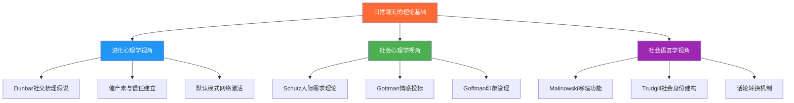
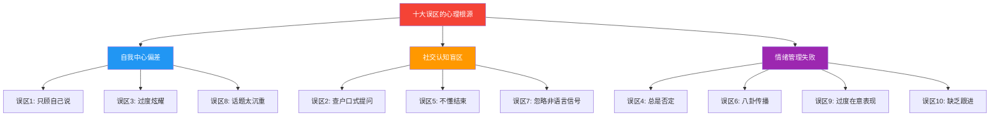
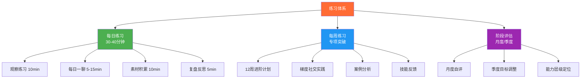

# 4.6 本章小结

本章从理论根基到实操技巧，从场景应用到误区纠正，系统构建了日常聊天的完整知识体系。小结不是简单复述，而是将分散的知识点编织成一张可操作的能力网络——帮你回答三个问题：**我学了什么？我还缺什么？我下一步该做什么？**

---

## 一、核心知识体系回顾

### 1.1 理论层：理解闲聊的底层逻辑

本章开篇即确立了一个关键认知转折：**闲聊不是"没话找话"，而是人类进化出的核心社交机制。** 这一认知是所有技巧提升的前提——如果你骨子里觉得闲聊是浪费时间，你永远不会认真练习它。

**核心理论要点：**

| 理论 | 核心观点 | 对实践的启示 |
|------|---------|-------------|
| Dunbar社交梳理假说 | 语言（尤其是闲聊）取代了灵长类的毛发梳理功能，是维护社交关系的核心工具 | 闲聊是"关系维护"行为，不是浪费时间 |
| Schutz人际需求理论 | 闲聊同时满足包容需求、控制需求和情感需求 | 聊天不只是传递信息，更是确认归属、建立影响、表达关心 |
| Gottman情感投标理论 | 日常闲聊是"情感投标"，伴侣是否"转向"这些投标是预测关系质量的最强指标 | "今天怎么样？"这种看似随意的问候，承载着巨大的情感价值 |
| Malinowski寒暄功能 | 语言的寒暄功能不是传递信息，而是建立社交氛围和联结感 | 闲聊的内容不重要，重要的是"聊"这个行为本身 |
| 峰终定律 | 人们对对话的记忆取决于高峰时刻和结束时刻 | 在高点结束对话，比聊到词穷再收场效果好十倍 |

**社交货币的五种类型**是闲聊的"弹药库"：

- **故事货币**：你的亲身经历和见闻——最有价值的聊天素材，因为每个人的经历都是独一无二的
- **知识货币**：你掌握的有用信息和见解——让聊天有"干货"，而非纯粹的闲扯
- **幽默货币**：你的笑点和幽默感——让对话轻松愉快，降低社交距离
- **情感货币**：你能够共情和表达的能力——让对方感到被理解、被关心
- **连接货币**：你认识的人和能牵线搭桥的能力——社交网络的节点价值

**话题选择的四大原则**——安全性、相关性、开放性、趣味性——不是四个独立的标准，而是一个筛选漏斗：先排除不安全的话题，再挑与场景相关的，从中选出能展开讨论的，最后挑最有趣的那个。

### 1.2 技能层：掌握话题管理的完整能力链

本章的技能核心是**话题管理能力链**——从开启到延续，从转换到收尾，形成一个完整的闭环。大多数人的问题不是"一个技巧都不会"，而是"链条中某个环节断裂"。

**五大核心技能速查表：**

| 技能 | 方法数量 | 核心原则 | 最常见的失败原因 |
|------|---------|---------|-----------------|
| 开启话题 | 5种 | 降低双方心理门槛，创造舒适的对话起点 | 开场太突兀、太正式、太私人 |
| 延续话题 | 6种 | 让对方感到被倾听、被理解、被重视 | 只等自己说、不追问细节、回应太敷衍 |
| 转换话题 | 5种 | 保持对话的自然流畅，不让人感觉"话题怎么突然变了" | 生硬跳转、不加过渡、忽略当前话题的收尾 |
| 幽默运用 | 5种 | 善意为本、时机恰当、自然流露 | 自以为好笑、踩别人痛点、不合时宜 |
| 赞美技巧 | 4种高级 | 具体、真诚、关注努力、及时、场合合适 | 太笼统、太夸张、太刻意、不看场合 |

**开启话题的五种方法**及其适用场景：

| 方法 | 核心动作 | 最佳场景 | 难度 |
|------|---------|---------|------|
| 环境观察法 | 从共同所处的环境中提取话题线索 | 任何有共同环境的场景（电梯、排队、咖啡厅） | ★☆☆ |
| 共同经历法 | 基于双方共同经历的事件开启话题 | 同事、同学、同一活动中的人 | ★☆☆ |
| 真诚赞美法 | 对对方的某个具体特征表达真诚赞美 | 对方有明显可赞美的点（新发型、好作品） | ★★☆ |
| 求助请教法 | 向对方请教一个对方擅长领域的问题 | 对方是某个领域的专家或行家 | ★★☆ |
| 直接自我介绍法 | 大方地自我介绍，表达想认识的意愿 | 聚会、活动等社交场合 | ★★★ |

**延续话题的六种技巧**——这是大多数人最薄弱的环节：

1. **追问细节法**：对方说"我去了日本"，你问"去了哪些城市？最喜欢哪里？"——每个回答都是新的话题分支
2. **感受回应法**：不只关注事实，更关注对方的情绪——"听起来你那次经历特别难忘"
3. **联想延伸法**：从对方的话题联想到相关的经历或话题——"你说的这家店，让我想起另一家……"
4. **共同经历法**：找到双方的共同经历来共鸣——"我也去过那里！你有没有看到……"
5. **观点交流法**：对对方提到的话题分享自己的看法——"你对这件事怎么看？我觉得……"
6. **幽默回应法**：用轻松幽默的方式回应，让对话气氛更活跃——"哈哈，你这经历可以写本书了"

### 1.3 策略层：幽默与赞美的高级运用

**幽默的底层心理学机制**——理解"为什么好笑"比"怎么搞笑"更重要：

- **不协调理论**：幽默源于预期与结果的不一致——铺垫引导一个方向，包袱突然转向
- **良性违背理论**：幽默产生于"违背"（违反常规）+ "良性"（无害）的交集
- **释放理论**：幽默通过社会可接受的方式释放被压抑的心理能量

马丁的四种幽默风格中，**亲和型**和**自我增强型**是健康的幽默方式，而**攻击型**和**自我贬低型**则会损害人际关系和个人心理健康。在日常聊天中，应以亲和型为主——用幽默来拉近距离，而不是拉开差距。

**赞美的黄金法则：**

| 法则 | 说明 | 错误示例 | 正确示例 |
|------|------|---------|---------|
| 具体 | 说清楚你赞美的是什么 | "你好厉害" | "你这个方案的数据分析部分做得很严谨" |
| 真诚 | 发自内心，不夸张 | "你是我见过最帅的人" | "你今天这个搭配很有品味" |
| 关注努力 | 赞美过程而非结果 | "你真聪明" | "看得出你花了很多时间准备" |
| 及时 | 看到就说，不要憋着 | 事后才说"你上次做得不错" | 当场说"这个想法太棒了" |
| 合场合 | 考虑场合和关系 | 在大会上当众赞美领导 | 私下真诚地表达认可 |

高级赞美技巧：**背后赞美**（通过第三方传递）、**请教式赞美**（"你这方面经验多，你怎么做到的？"）、**对比式赞美**（"比我之前见过的做法好太多了"）、**细节式赞美**（聚焦一个具体细节而非笼统评价）。

### 1.4 场景层：八大实战场景的关键洞察

本章通过八个真实场景展示了技巧的灵活应用。每个场景的核心挑战和应对策略总结如下：

| 场景 | 核心挑战 | 关键策略 | 最需要的一句话 |
|------|---------|---------|--------------|
| 初次见面 | 双方都不确定对方的"社交参数" | 环境观察+自我暴露降低门槛 | "你好，我是XX，你是怎么认识主人的？" |
| 同事闲聊 | 工作关系的边界感 | 轻话题为主，避免涉及敏感的工作评价 | "最近有发现什么好吃的外卖吗？" |
| 朋友聚会 | 有熟有生，需要兼顾 | 做"桥梁"，把不同的人连接起来 | "XX你也认识？你们怎么认识的？" |
| 相亲场合 | 目的性强，压力大 | 把"面试"变成"聊天"，从眼前事物入手 | "你点的这个看起来不错，经常来这家吗？" |
| 微信群聊 | 缺乏非语言信号，容易误读 | 善用表情包调节气氛，适时@具体的人 | "哈哈这个我也遇到过！" |
| 电梯偶遇 | 时间极短（30秒-2分钟） | 简短寒暄+一个轻松话题即可 | "今天挺早的/今天这天气……" |
| 排队等候 | 共同经历是天然话题 | 利用等待的共同体验破冰 | "这队排得真够长的，你等多久了？" |
| 邻居碰面 | 低头不见抬头见，需要长期维护 | 持续的轻互动，不过度热情也不冷漠 | "出去啊？今天天气不错~" |

---

## 二、十大误区的深层逻辑

误区部分不是简单的"不要做XX"列表，而是揭示了**为什么聪明人会犯这些错误**——因为每个误区背后都有一个"看似合理但实际有害"的心理逻辑。

**误区的分级识别与纠正速查表：**

| 误区 | 核心问题 | 入门纠正 | 进阶纠正 | 精通纠正 |
|------|---------|---------|---------|---------|
| 只顾自己说 | 倾听时间不足 | 80/20法则，让对方说80% | 情绪标注+隐含需求捕捉 | 映射式倾听+记住并回访 |
| 查户口式提问 | 封闭式问题过多 | "一问一答一分享"原则 | 话题树思维 | 自我暴露引导法 |
| 过度炫耀 | "我"的频率太高 | 控制"我"的频率 | 赋能型分享替代炫耀 | 让别人在你帮助下变强 |
| 总是否定 | 否定开场白 | 消灭"不对/你错了" | 先跟后带 | 苏格拉底式提问 |
| 不懂结束 | 忽略峰终定律 | 识别结束信号 | 准备三种结束模板 | 悬念式结束 |
| 八卦传播 | 信息防火墙缺失 | 不传播他人私事 | 成为八卦终结者 | 正向信息传播 |
| 忽略非语言 | 只听内容不看信号 | 每2分钟观察一次 | 实时调频 | 微表情直觉 |
| 话题太沉重 | 正负情绪比失衡 | 准备轻话题清单 | 升降机技巧 | 氛围建筑师 |
| 过度在意表现 | 社交焦虑 | 关注对方而非自己 | 接受不完美 | 把注意力从"我"移到"我们" |
| 缺乏跟进 | 关系维护断裂 | 记住关键信息 | 主动跟进和关心 | 系统化的关系维护习惯 |

**关键纠正原则：** 同时改善太多习惯会顾此失彼。先通读全文，用自查清单定位最突出的2-3个误区，集中精力纠正，等新习惯稳固后再处理下一个。

---

## 三、练习体系的核心架构

本章的练习方法基于**刻意练习理论**（Ericsson）和**习惯回路理论**（Duhigg），构建了一个从微习惯到精通的完整训练路径。

**技能习得的五个阶段**（德雷福斯模型）：

| 阶段 | 特征 | 表现 | 你需要做的 |
|------|------|------|-----------|
| 新手 | 依赖规则，僵硬执行 | 按模板聊天，遇到意外就慌 | 记住基本规则，在安全环境中反复练习 |
| 高级新手 | 开始识别情境 | 能区分不同场景的聊天方式 | 在不同场景间切换练习 |
| 胜任者 | 能主动规划 | 根据对方特点选择策略 | 练习策略选择和灵活应变 |
| 精通者 | 直觉判断 | 瞬间感知氛围变化 | 在复杂场景中磨炼直觉 |
| 专家 | 浑然一体 | 聊天成为本能 | 传授经验，探索更高层次 |

大多数人在"高级新手"到"胜任者"之间停滞，因为这个阶段需要从"执行规则"转变为"自主判断"——你需要在真实社交中承担风险、犯错、然后从错误中学习。

---

## 四、本章知识体系的完整图谱

将本章所有内容整合为一张知识地图，帮助你建立全局视野：

```mermaid
graph TD
    ROOT["第四章 日常聊天"] --> THEORY["理论基础"]
    ROOT --> SKILL["核心技巧"]
    ROOT --> CASE["实战案例"]
    ROOT --> TRAP["常见误区"]
    ROOT --> DRILL["练习方法"]
    
    THEORY --> T1["闲聊的进化根源"]
    THEORY --> T2["社交货币五类型"]
    THEORY --> T3["话题选择四原则"]
    THEORY --> T4["聊天节奏四维度"]
    
    SKILL --> S1["开启话题 5法"]
    SKILL --> S2["延续话题 6法"]
    SKILL --> S3["转换话题 5法"]
    SKILL --> S4["幽默技巧 5类"]
    SKILL --> S5["赞美技巧 4高级"]
    
    CASE --> C1["初次见面"]
    CASE --> C2["同事闲聊"]
    CASE --> C3["朋友聚会"]
    CASE --> C4["相亲场合"]
    CASE --> C5["微信群聊"]
    CASE --> C6["电梯偶遇"]
    CASE --> C7["排队等候"]
    CASE --> C8["邻居碰面"]
    
    TRAP --> TR1["只顾自己说"]
    TRAP --> TR2["查户口提问"]
    TRAP --> TR3["过度炫耀"]
    TRAP --> TR4["总是否定"]
    TRAP --> TR5["不懂结束"]
    TRAP --> TR6["八卦传播"]
    TRAP --> TR7["忽略非语言"]
    TRAP --> TR8["话题太沉"]
    TRAP --> TR9["过度紧张"]
    TRAP --> TR10["缺乏跟进"]
    
    DRILL --> D1["每日四模块"]
    DRILL --> D2["12周进阶计划"]
    DRILL --> D3["梯度社交实践"]
    DRILL --> D4["AI辅助练习"]
    
    style ROOT fill:#FF6B35,color:white
    style THEORY fill:#2196F3,color:white
    style SKILL fill:#4CAF50,color:white
    style CASE fill:#FF9800,color:white
    style TRAP fill:#F44336,color:white
    style DRILL fill:#9C27B0,color:white
```

---

## 五、能力自检清单

学习完成后，用以下清单检验自己的掌握程度。每个条目用"能/不能/部分能"自评：

### 理论理解

- [ ] 能用自己的话解释"为什么人类需要闲聊"（不只是背概念，而是真正理解）
- [ ] 能说出社交货币的五种类型，并列举每种至少2个自己的例子
- [ ] 能解释话题选择的四大原则，并判断一个给定话题是否合适
- [ ] 能说明聊天节奏的四个维度，以及如何调节每个维度

### 技能掌握

- [ ] 能在30秒内用至少2种方法自然开启话题
- [ ] 能让一次对话持续5分钟以上而不冷场
- [ ] 能在对话中自然转换话题，对方不会感觉突兀
- [ ] 能在合适时机使用自嘲式幽默，且不尴尬
- [ ] 能给出具体、真诚的赞美，而非笼统的"你好厉害"
- [ ] 能识别对话的结束信号，并优雅收场

### 误区规避

- [ ] 能在对话中保持60%-70%的倾听比例
- [ ] 能用开放式问题替代封闭式问题
- [ ] 能控制"我"的频率，不把每个话题拉回自己身上
- [ ] 能在想否定对方时使用"先跟后带"技巧
- [ ] 能识别对方的非语言信号（面对面和线上都算）

### 练习执行

- [ ] 有固定的每日观察练习习惯
- [ ] 每天至少进行一次"非必要"聊天
- [ ] 有社交素材积累的习惯（记录、加工、标注场景）
- [ ] 每次重要对话后有复盘的习惯

---

## 六、行动指南：从今天开始

### 今天就能做的三件事

**第一，完成一次"每日一聊"。** 选择一个你平时不会主动交流的人——便利店店员、保安、邻居、其他部门的同事——进行一次1-2分钟的友好对话。不需要准备完美的话术，一句"今天天气不错"就够了。关键是**迈出第一步**，打破"我不会聊天"的心理惯性。

**第二，记录一次社交观察。** 在公共场所（地铁、食堂、咖啡厅）花10分钟观察他人的互动，用三层观察法记录：整体氛围→具体互动→细节信号。这个练习能快速提升你的社交敏锐度，让你发现过去忽略的话题线索。

**第三，准备三个"万能话题"。** 提前准备三个你可以在大多数场合使用的话题，用自己的话加工成"可分享的版本"：

话题1：最近看的一部电影/剧 → 你的感受 + 推荐理由
话题2：最近发现的一家好店 → 具体推荐 + 你的体验
话题3：最近看到的一条有趣的新闻 → 你的看法 + 可以引发讨论的角度

### 本周的挑战

| 挑战 | 具体要求 | 验收标准 |
|------|---------|---------|
| 每日一聊 | 每天至少与一个"非必要"交流对象聊天 | 7天完成≥5次 |
| 真诚赞美 | 给出至少5个具体、真诚的赞美 | 每个赞美都有具体细节 |
| 幽默尝试 | 尝试在对话中使用1次自嘲式幽默 | 对方有自然的笑或轻松反应 |
| 社交复盘 | 周末进行一次完整的社交复盘 | 用三问复盘法，写下至少3条洞察 |

### 本月的目标

一个月后，你应该能够达成以下四个里程碑：

**里程碑一：开口不再恐惧。** 在大多数场合能自然地开启话题，不再出现"假装看手机"的逃避行为。焦虑评分从当前水平降低至少2分（10分制）。

**里程碑二：对话不再冷场。** 让一次对话持续5分钟以上而不尴尬。掌握至少3种延续话题的技巧，能在话题枯竭时自然切换。

**里程碑三：聊天有质量。** 不再只是"一问一答"的机械交流，而是有来有回、有笑有料的轻松对话。能在合适时机使用幽默和赞美。

**里程碑四：形成练习习惯。** 每日四模块（观察、聊天、积累、复盘）成为日常习惯，不再需要刻意提醒自己去做。

---

## 七、从日常聊天到深度对话

日常聊天是沟通能力金字塔的底座，但它不是终点。本章所学的技能是后续所有高级沟通能力的基础：

| 能力层级 | 对应章节 | 对日常聊天能力的依赖 |
|---------|---------|-------------------|
| 日常聊天 | 本章（第4章） | — |
| 深度对话 | 第5章 | 需要话题延续能力作为基础，才能从闲聊自然过渡到深度交流 |
| 说服与谈判 | 第6章 | 需要建立信任的能力，而信任始于日常聊天中的真诚互动 |
| 冲突处理 | 第7章 | 需要倾听和共情能力，这些在日常聊天中就已经开始培养 |
| 公众表达 | 后续章节 | 需要话题组织和节奏把控能力，这些在聊天中反复锤炼 |

一个连基本寒暄都做不好的人，很难在更高级的沟通场景中表现出色。反过来，当你的日常聊天能力达到"自然流露"的水平时，你会发现深度对话、说服谈判、冲突处理等高级技能的学习也会更加顺畅。

---

## 八、给不同起点读者的针对性建议

### 如果你是"基础层"读者（自测主要选A/B）

**你的核心问题：** 社交焦虑 + 缺乏开口的勇气

**建议路径：**
1. 先不急学技巧，用2周时间专门做"每日一聊"练习——每天和一个陌生人说一句话
2. 目标设得足够小：不是"聊5分钟"，而是"说一句非功能性的话"
3. 记录每次练习后的感受变化——你会发现焦虑在递减
4. 2周后再开始学习本章的核心技巧

### 如果你是"技能层"读者（自测主要选C）

**你的核心问题：** 会一些技巧但不够系统，对话经常在某个环节卡住

**建议路径：**
1. 用本章的能力自检清单，找到你的"断裂环节"（是开场？延续？转换？结束？）
2. 用12周进阶计划，每周突破一个技能
3. 重点练习"延续话题"——这是大多数人最薄弱的环节
4. 开始做录音复盘，发现自己的盲区

### 如果你是"策略层"及以上读者（自测主要选D）

**你的核心问题：** 基本功扎实，但想从"会聊天"升级为"聊天高手"

**建议路径：**
1. 重点关注幽默和赞美的高级运用
2. 练习"氛围建筑师"能力——主动塑造对话的氛围
3. 挑战高难度社交场景（陌生人聚会、公开分享、跨文化社交）
4. 开始教别人——教学是最好的学习

---

**下一章预告：** 第五章将探讨"深度对话"的艺术——如何将日常聊天升级为有深度、有价值的深度交流，建立更加深厚的人际关系。你将学到如何从"聊得开心"进化到"聊得有深度"，从"社交表面"深入到"心灵层面"。
