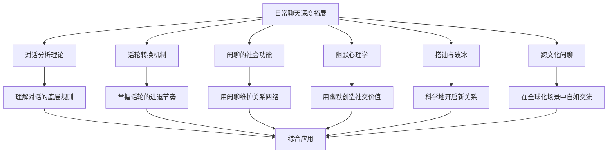

# 日常聊天：深度拓展

## 引言

前六节我们掌握了日常聊天的核心技巧和实战方法。本章将从六个专业领域对日常聊天进行深层探索——对话分析理论、话轮转换机制、闲聊的社会功能、幽默心理学、搭讪与破冰的科学方法、跨文化闲聊规范——并为每个理论附上可直接迁移到日常场景的实操框架。

读完本章，你将获得三样东西：

1. **底层原理**：理解日常聊天为什么"有效"，而不只是"怎么做"
2. **诊断工具**：能够分析一段对话的结构，找到改善空间
3. **迁移能力**：把学术发现转化为具体可执行的聊天策略



***

## 一、对话分析理论：Sacks/Schegloff的贡献

### 1.1 对话分析的起源与发展

**民族方法学背景**

对话分析（Conversation Analysis, CA）起源于社会学家哈维·萨克斯（Harvey Sacks）与伊曼纽尔·谢格洛夫（Emanuel Schegloff）、盖尔·杰斐逊（Gail Jefferson）在1960年代的合作研究。对话分析根植于阿尔弗雷德·舒茨（Alfred Schutz）的现象学社会学和哈罗德·加芬克尔（Harold Garfinkel）的民族方法学（Ethnomethodology）传统。

民族方法学关注的核心问题是：普通人在日常生活中如何组织和理解他们的社会互动？对话分析将这一问题具体化为：人们在对话中如何系统地组织他们的行为，使之对彼此而言是可理解的？

**对话分析的方法论**

对话分析具有独特的研究方法论：

1. **自然数据**：CA坚持使用自然发生的对话录音/录像数据，而非实验数据或研究者编造的例句。
2. **细致转写**：CA使用一套详细的转写符号系统来记录对话的各个方面，包括停顿、重叠、语调变化等。
3. **归纳分析**：CA采用归纳而非演绎的方法，从数据中发现规律，而不是从理论假设出发。
4. **参与者取向**：CA关注的不是研究者认为重要的内容，而是参与者自己在互动中展现出来的理解和取向。

> **实操启示**：对话分析的方法论本身就是一种观察力训练。下次参加聚会时，尝试"像研究者一样"观察两段对话——注意谁在什么时候开始说话、停顿了多久、谁打断了谁。这种观察会让你对聊天的底层结构产生全新的敏感度。

### 1.2 会话的基本组织结构

**相邻对（Adjacency Pairs）**

谢格洛夫和萨克斯提出的"相邻对"概念是对话分析中最基本的发现之一。相邻对是指两个相互关联的会话行为序列：

- **第一部分**（First Pair Part）：如提问、邀请、请求、问候等
- **第二部分**（Second Pair Part）：如回答、接受/拒绝、回应等

相邻对的特点包括：
- 两个部分之间存在期望的关联性
- 第一部分的出现创造了对第二部分的期待
- 第二部分的缺失会被注意到并可能被解释

常见的相邻对类型：

| 第一部分 | 第二部分（优先） | 第二部分（非优先） | 场景示例 |
|---------|----------------|------------------|---------|
| 问候 | 问候 | — | "你好" → "你好" |
| 提问 | 回答 | 拒绝回答 | "吃了吗？" → "吃了" |
| 邀请 | 接受 | 拒绝 | "周末一起吃饭？" → "好啊" / "不好意思..." |
| 请求 | 同意 | 拒绝 | "能帮个忙吗？" → "没问题" / "这..." |
| 评价 | 同意 | 不同意 | "这电影真好看" → "确实" / "我觉得一般" |
| 抱怨 | 道歉/辩解 | 否认 | "你怎么又迟到了" → "抱歉堵车了" |

**实操应用：相邻对的日常运用**

理解相邻对可以帮助你更好地掌控聊天节奏：

- **主动发出第一部分**：不知道聊什么时，发出一个"第一部分"（提问、评价、邀请），对方自然会产生回应的义务。比如在电梯里遇到同事，一句"今天天气不错"就是一个评价型第一部分，对方几乎一定会接话。
- **识别对方的第一部分**：当别人向你发出提问、邀请或评价时，他们正在期待你的"第二部分"。不回应（即使是无意的）会被解读为冷淡或敌意。
- **非优先回应的处理**：当你需要拒绝邀请时，记得使用延迟+前置解释+弱化表达的组合，而不是直接说"不"。比如："周末啊……（延迟）我看看日程……（前置解释）可能不太凑巧，下次一定（弱化表达）"。

**优先组织（Preference Organization）**

对话分析发现，相邻对的第二部分存在"优先"（preferred）和"非优先"（dispreferred）的区分。例如：

- 邀请的优先回应是接受，非优先回应是拒绝
- 请求的优先回应是同意，非优先回应是拒绝
- 评价的优先回应是同意，非优先回应是不同意

重要的是，"优先"和"非优先"指的是结构上的特征，而非心理上的偏好。非优先的回应通常具有以下特征：

- **延迟**：在回应前有较长的停顿
- **前置解释**：在给出非优先回应之前，先提供解释或理由
- **弱化表达**：使用间接、含蓄的方式表达
- **标记词**：使用"嗯"、"那个"等犹豫标记

> **实操框架：如何优雅地说"不"**
>
> 对话分析告诉我们，直接的拒绝在社交结构中是"高成本"的。以下是一个经过验证的拒绝模板：
>
> 1. **停顿**（0.5-1秒）——不要立刻回答
> 2. **正面回应**（"听起来不错"、"谢谢你想到我"）
> 3. **转折词**（"不过"、"只是"、"可惜"）
> 4. **具体理由**（越具体越可信，但不需要过度解释）
> 5. **替代方案**（"下次一定"、"下周可以吗？"）
>
> 示例：
> - "周末聚餐啊……听起来不错，不过这周我已经有安排了，下周我请你？"
> - "这个项目……嗯，谢谢你的信任，只是我手头这个月排满了，我帮你问问小李？"

### 1.3 修复机制（Repair）

**什么是修复**

修复是指对话参与者在互动过程中处理各种理解问题和表达问题的机制。修复可以是针对自己话语的（自我修复），也可以是针对他人话语的（他人修复）。

**修复的类型**

- **自我启动的自我修复**：说话者在对方介入之前就发现自己话语中的问题并进行修复
- **他人启动的自我修复**：听者提出理解问题，由说话者进行修复
- **自我启动的他人修复**：说话者请求听者帮助修复
- **他人启动的他人修复**：听者主动"纠正"说话者的话语

**修复的偏好结构**

研究发现，修复机制也存在偏好结构：
- 自我修复比他人修复更受偏好
- 他人启动的修复比直接的他人修复更受偏好
- 这种偏好结构反映了对说话者"权利"的尊重

**实操应用：日常对话中的修复策略**

修复机制在日常聊天中的应用非常广泛：

- **说错话时的补救**：当你意识到自己说错了什么（比如叫错名字、用错词），立即自我修复比等别人纠正要好得多。"昨天我和小——老王聊了一下"比被别人纠正"那不是小李吗"要体面得多。
- **听不懂时的提问方式**：直接说"你说的什么意思？"可能让对方觉得被质疑。更符合修复偏好的方式是："你是说……（用自己的理解复述）？"——这是"他人启动的自我修复"，把修复的主动权交还给说话者。
- **纠正他人时的委婉方式**：当你发现对方说错了什么，不要直接纠正（"你说错了"），而是用"确认"的方式引导对方自我修复。比如："等等，你说的是周三还是周四来着？"

### 1.4 故事讲述（Storytelling）

**故事讲述的组织**

在日常对话中，故事讲述是一种常见的活动。萨克斯对故事讲述的组织进行了深入分析：

1. **故事前序列**（Pre-story）：通过某种方式表明接下来要讲故事（"你知道昨天发生了什么吗？"）
2. **故事引子**（Story Entry）：正式开始讲述故事
3. **故事主体**：故事的核心内容
4. **故事结束**：通过特定的语言和非语言信号标记故事的结束
5. **故事后序列**（Post-story）：听者对故事的回应，如评价、追问、分享类似经历等

**故事的接收**

听者如何回应故事是对话分析关注的重要问题。故事讲述者期望听者做出适当的回应，包括：
- 表达情感反应（如"天哪！"、"太好了！"）
- 提出后续问题
- 分享类似的经历
- 对故事中的人物或事件做出评价

**实操框架：如何讲好一个日常故事**

基于对话分析的发现，一个好的日常故事应该具备以下要素：

| 要素 | 说明 | 示例 |
|-----|------|------|
| 钩子 | 故事前序列，吸引注意力 | "你绝对想不到今天发生了什么" |
| 场景 | 快速建立时间、地点、人物 | "中午在公司楼下那家面馆" |
| 冲突 | 故事的核心张力 | "排了半小时队，结果到我的时候说卖完了" |
| 转折 | 意外的发展 | "正要走的时候，老板追出来" |
| 收尾 | 明确的结束信号 | "所以今天中午白赚了一碗面" |
| 留白 | 给听者回应的空间 | （停顿，等待反应） |

> **常见错误**：很多人讲故事时缺乏"钩子"和"留白"——直接开始讲，讲完也没有给听者回应的空间。结果是听者不知道该听还是该接话，故事的效果大打折扣。

***

## 二、话轮转换机制

### 2.1 萨克斯、谢格洛夫和杰斐逊的话轮转换模型

**基本规则**

1974年，萨克斯、谢格洛夫和杰斐逊发表了关于话轮转换组织的开创性论文，提出了以下基本规则：

**规则一**：在任何话轮的初始过渡相关位置（Transition Relevance Place, TRP）：
- (a) 如果当前说话者选择了下一个说话者，被选择的人有权利也有义务继续说话
- (b) 如果当前说话者没有选择下一个说话者，其他参与者可以自我选择，先说话者先得
- (c) 如果以上两种情况都没有发生，当前说话者可以（但不是必须）继续说话

**规则二**：在规则一(c)适用的情况下，上述规则在下一个过渡相关位置再次适用，并且可以在每一个后续的过渡相关位置反复适用，直到话轮转换发生。

### 2.2 过渡相关位置（TRP）

**什么是TRP**

过渡相关位置是指话轮转换可以合法发生的位置。TRP通常出现在：

- 句子或话轮的语法完整处
- 语调完成处（如降调）
- 某些特定的语言标记处（如"对吧？"、"你知道吗？"）

**TRP的信号**

当前说话者可以通过以下方式标记TRP：
- 语调的完成（下降的语调）
- 语法的完成
- 直接的眼神接触
- 手势的停止
- 音量的降低

> **实操应用：识别TRP，把握接话时机**
>
> 在日常聊天中，识别TRP是"不打断别人"和"不冷场"的关键：
> - 当对方说完一个完整的句子，语调下降，并看向你——这就是TRP，你应该接话了
> - 当对方语调上扬，句子还没说完——这不是TRP，此时接话会被视为打断
> - 当对方使用"嗯……"并放慢语速——这可能是TRP，也可能是在思考，观察2秒再决定

### 2.3 话轮构建单位（TCU）

**什么是TCU**

话轮构建单位（Turn Constructional Unit, TCU）是构建话轮的基本语言单位。一个话轮可能包含一个或多个TCU。

TCU可以是：
- 一个完整的句子
- 一个句子片段
- 一个独立的词
- 一个非语言的声音或手势

### 2.4 话轮保持与话轮索取

**话轮保持策略**

说话者可以使用多种策略来保持话轮：
- **延续标记**：使用"而且"、"然后"等连接词
- **语调延续**：使用升调或平调来标记话轮尚未完成
- **填充停顿**：使用"嗯"、"那个"等填充词来表示还在思考
- **加快语速**：在接近TRP时加快语速
- **不完整的语法结构**：使用从句等不完整的语法结构

**话轮索取策略**

听者可以使用多种策略来索取话轮：
- **举手**：在面对面交流中，举手是常见的信号
- **清嗓子**：发出声音以引起注意
- **前置话轮**：在当前说话者完成之前就开始说话（与重叠不同，这是有意的话轮索取）
- **称呼**：使用对方的名字或称呼来引起注意
- **非语言信号**：张嘴、深吸气、身体前倾等

**实操应用：话轮管理的日常技巧**

| 目标 | 策略 | 具体做法 |
|------|------|---------|
| 想插话但不打断 | TRP抢占 | 在对方语调下降的瞬间，用"对对对"或"说到这个"开头 |
| 说太久想交出话轮 | 话轮释放信号 | 降低语速、语调下降、看向对方、做出"你来说"的手势 |
| 话题跑偏想拉回来 | 话题锚定 | "对，你刚才说的那个……"把话轮拉回之前的主题 |
| 多人聊天中想发言 | 序列标记 | "我有一个想法"、"补充一点"——提前宣告你要说话 |

### 2.5 重叠与沉默

**重叠（Overlap）**

重叠是指两个或多个参与者同时说话的情况。重叠可能发生在：
- 过渡相关位置：两个人同时开始说话
- 非过渡相关位置：一个人试图打断另一个人

重叠通常很快就会被解决——一方会停止说话，让另一方继续。

**沉默（Silence）**

在对话分析中，沉默不是简单的"没有说话"，而是具有特定社会意义的行为：

- **话轮内沉默**：在说话者的话轮内部发生的沉默，可能表示思考或犹豫
- **话轮间沉默**：在当前说话者结束和下一个说话者开始之间的沉默
- **间隙**（Gap）：话轮之间的短暂沉默（通常不到1秒）
- **显著沉默**（Notable Silence）：超过预期时间的沉默，会被参与者注意到

> **实操应用：沉默的社交含义与应对**
>
> 在中国文化中，沉默的含义比西方更加复杂：
>
> | 沉默类型 | 可能含义 | 应对策略 |
> |---------|---------|---------|
> | 回答前的停顿（1-3秒） | 在认真思考你的问题 | 不要催促，等待 |
> | 话题结束后的沉默 | 该换话题了 | 主动引入新话题 |
> | 你提出邀请后的沉默 | 可能在犹豫怎么拒绝 | 给对方台阶："不急，你想想" |
> | 被批评后的沉默 | 不同意但不想冲突 | 不要追问"你同意吗" |
> | 多人聊天中的沉默 | 被边缘化或不感兴趣 | 主动把话轮交给TA |

### 2.6 数字时代的话轮转换

**即时通讯中的话轮转换**

即时通讯（如微信、WhatsApp）中的话轮转换与面对面交流有很大不同：

- 没有传统意义上的TRP，因为每条消息都是一个独立的"话轮"
- 回应时间的变化具有重要意义（快速回应 vs. 延迟回应）
- 重叠发送（对方还没说完就发送回应）是常见现象
- "正在输入……"提示创造了新的等待机制

**数字话轮的特殊规则**

| 现象 | 社交含义 | 应对建议 |
|------|---------|---------|
| 秒回 | 高兴趣、高投入 | 积极回应，保持节奏 |
| 已读不回 | 可能忙/不感兴趣/在生气 | 不要连续追问，给对方空间 |
| 长时间后回复 | 优先级较低或真的忙 | 不要过度解读，正常继续 |
| 语音消息替代文字 | 更亲密或更懒 | 根据关系亲疏判断 |
| 只回复表情包 | 话题可以结束了 | 不要强行延续 |
| 发了又撤回 | 说错了或犹豫了 | 不要追问撤回了什么 |

**社交媒体中的话轮**

社交媒体（如微博、Twitter）中的话轮转换更加复杂：
- 一对多的沟通模式改变了话轮的组织
- 点赞、转发等非语言回应成为新的话轮形式
- 对话可能跨越很长时间和多个参与者

***

## 三、闲聊的社会功能（Phatic Communication）

### 3.1 马林诺夫斯基的寒暄功能

**寒暄功能的定义**

波兰裔英国人类学家布罗尼斯拉夫·马林诺夫斯基（Bronisław Malinowski）在1923年首次提出了"寒暄功能"（phatic function）的概念。他观察到，特罗布里恩群岛的居民之间的许多对话并非为了传递信息，而是为了维持社交联系。

马林诺夫斯基写道："语言的寒暄功能……不是为了传递思想或知识，而是为了建立一种社交氛围……一种通过纯粹的交流行为而产生的联结感。"

**寒暄沟通的特征**

寒暄沟通（phatic communication）具有以下特征：

1. **内容无关紧要**：寒暄的话语（如"你好吗？"、"今天天气真好"）不需要承载实质性的信息。
2. **社交功能优先**：寒暄的目的是建立、维持或确认社交联系。
3. **仪式化**：寒暄通常遵循固定的模式和脚本。
4. **低认知负荷**：寒暄不需要深度的思考和分析。
5. **高社交价值**：尽管内容简单，寒暄对社交关系的维护至关重要。

> **关键洞察**：很多人鄙视寒暄，觉得"说这些有什么用"。但马林诺夫斯基的研究告诉我们，寒暄的价值不在内容，而在功能——它是在说"我看到你了，我愿意和你保持连接"。拒绝寒暄，在社交意义上等于拒绝连接。

### 3.2 闲聊的社会功能

**建立和维护社交网络**

闲聊是建立和维护社交网络的重要工具。通过日常的闲聊，人们可以：
- 建立初步的社交联系
- 保持与现有关系的联结
- 了解他人的近况和变化
- 分享共同的社交空间

**社会地位的协商**

闲聊也是协商和确认社会地位的场所。在闲聊中，人们通过以下方式展现和协商地位：
- 话题选择（谁有权选择话题）
- 话轮分配（谁说话更多）
- 知识展示（展示自己的知识和经验）
- 幽默使用（幽默能力与社会地位相关）

**信息交换与社会学习**

尽管闲聊的主要目的不是信息传递，但它确实承载着重要的信息交换功能：
- 了解社区中的最新动态
- 获取关于他人的社交信息
- 学习社会规范和期望
- 获取实用的建议和推荐

**情感调节与社会支持**

闲聊可以提供即时的情感支持和调节：
- 日常的压力释放
- 情感的共鸣和验证
- 归属感的确认
- 孤独感的缓解

**实操应用：如何有意识地利用闲聊的功能**

| 你的目标 | 闲聊策略 | 具体做法 |
|---------|---------|---------|
| 认识新朋友 | 建立联系功能 | 在共同场景中主动发起寒暄，连续3次后升级为"认识的人" |
| 维护老朋友 | 维护联结功能 | 每周花10分钟给3个朋友发消息，不为任何目的，就是"想到你了" |
| 融入新群体 | 社会学习功能 | 先观察群体的聊天风格和话题偏好，模仿他们的节奏 |
| 获取信息 | 信息交换功能 | 通过闲聊自然地引入问题，而不是直接问 |
| 缓解压力 | 情感调节功能 | 找一个信任的人，不需要解决问题，只是"说说" |

### 3.3 闲聊的结构分析

**开场阶段**

闲聊的开场通常遵循一定的仪式化模式：
- 问候语（"你好"、"最近怎么样？"）
- 社交性询问（"最近忙不忙？"、"家里都好吗？"）
- 共同话题的引入（天气、时事、共同经历等）

**主体阶段**

闲聊的主体通常涉及多个轻松的话题，话题之间的转换相对自由和随意。主要特征包括：
- 话题的跳跃性
- 观点的一致性（避免争议）
- 情感的积极偏向
- 个人经历的分享

**结束阶段**

闲聊的结束也需要一定的仪式：
- 预告结束（"好了，我该走了"）
- 总结或概括（"总之，很高兴能聊聊"）
- 社交性结束语（"保重"、"下次再聊"）
- 告别

> **实操框架：闲聊的"三段式"节奏**
>
> 一段高质量的闲聊遵循以下节奏：
>
> ```mermaid
> graph LR
>     A[开场: 寒暄+试探] --> B[主体: 2-3个话题]
>     B --> C[收尾: 预告+展望]
>     A --> A1[问候/环境观察/共同点]
>     B --> B1[轮流分享/互相回应/情感共鸣]
>     C --> C1[预告离开/总结感受/下次约定]
> ```
>
> **开场的3个安全切入点**：
> 1. 环境观察——"这地方不错"/"今天好热"
> 2. 共同经历——"你也来参加这个活动？"
> 3. 对方身上的话题——"你这个包挺好看的"
>
> **主体的维持技巧**：
> - 每个话题不要超过3分钟
> - 用"说到这个……"自然过渡到新话题
> - 留意对方的表情和回应热度，及时调整
>
> **收尾的信号识别**：
> - 对方开始看手机/手表
> - 回应变得简短（"嗯"、"对"）
> - 话题自然说完，出现短暂沉默
> - 对方说"那……"或"好了……"

### 3.4 闲聊能力的社会重要性

**社交货币**

闲聊能力是一种重要的"社交货币"。善于闲聊的人通常：
- 拥有更广泛的社交网络
- 在社交场合中更受欢迎
- 更容易建立新的关系
- 在职场中更容易获得机会

**社会融入的工具**

对于新加入某个群体或社区的人来说，闲聊能力是融入的重要工具。通过参与群体中的日常闲聊，新成员可以：
- 了解群体的规范和文化
- 建立与其他成员的联系
- 展示自己的社交能力
- 获得群体的接纳

***

## 四、幽默的心理学

### 4.1 幽默的主要理论

**不协调理论（Incongruity Theory）**

不协调理论认为，幽默源于我们对事物的预期与实际结果之间的不一致。当一个笑话的"铺垫"引导我们朝某个方向思考，而"包袱"却突然转向一个完全不同的方向时，这种不协调就会产生幽默效果。

例如：
- "我跟我的健身教练说我想变得更有弹性。他说：'你怎么不试试信用卡？'"
- 这个笑话的幽默在于"弹性"这个词的双重含义——身体的柔韧性和信用卡额度的灵活——之间的不协调。

**释放理论（Relief Theory）**

弗洛伊德提出的释放理论认为，幽默是一种释放被压抑的心理能量（特别是与性和攻击性相关的能量）的方式。笑话通过社会可接受的方式表达那些通常被压抑的想法和欲望。

**优越理论（Superiority Theory）**

优越理论可以追溯到柏拉图和亚里士多德，认为幽默源于我们对他人不幸或缺陷的优越感。当我们看到别人犯错、摔倒或出丑时，我们可能会发笑，因为这让我们感到自己比他们"更好"。

**良性违背理论（Benign Violation Theory）**

这是近年来一个较为综合的幽默理论，认为幽默产生于三种条件的交集：
1. 某种情况被感知为一种"违背"（违反规范、期望或规则）
2. 这种违背被感知为"良性"（无害的或可接受的）
3. 这两种感知同时存在

> **实操应用：良性违背理论的日常运用**
>
> 理解了良性违背理论，你就能"制造"幽默：
>
> **公式：预期 + 适度违背 = 幽默**
>
> - **语言双关**：利用词语的多义性制造"违背"——"我的钱包和我的头发一样，都在变薄"
> - **夸张**：把正常情况推到荒谬的极端——"等外卖等了这么久，我都快进化出光合作用了"
> - **自嘲**：轻微"违背"自己的形象——"我做饭的水平，连我家猫都嫌弃"
> - **反转**：把对方的预期反转——对方问"你周末干嘛了？"，你说"研究了一下量子力学……其实是看了一天短视频"
>
> **注意**：幽默的"违背"必须是良性的。涉及以下领域的玩笑要慎重：外貌、身材、疾病、家庭、收入、种族、宗教。

### 4.2 幽默的社会功能

**社交润滑剂**

幽默在社交互动中起着润滑剂的作用：
- 缓解紧张气氛
- 打破社交僵局
- 建立共同的快乐体验
- 降低社交焦虑

**群体凝聚力**

共同的幽默感是群体凝聚力的重要来源：
- 分享笑话和幽默创造"内部人"的感觉
- 幽默可以强化群体规范和价值观
- 共同的笑可以增强群体的情感联结

**社会控制**

幽默也可以用作社会控制的工具：
- 通过讽刺和嘲讽来批评不当行为
- 使用幽默来温和地表达不满
- 通过幽默来维护社会等级和规范

**权力与幽默**

研究表明，幽默的使用与社会地位和权力密切相关：
- 地位较高的人通常拥有更多的"幽默自由"
- 幽默可以被用作提升或维护地位的策略
- 对上级的幽默需要更加谨慎

### 4.3 幽默风格的个体差异

**马丁的幽默风格问卷**

心理学家罗德·马丁（Rod Martin）发展了幽默风格问卷（Humor Styles Questionnaire, HSQ），将幽默风格分为四种类型：

1. **亲和型幽默**（Affiliative Humor）：使用幽默来增强人际关系，如讲笑话、说俏皮话来娱乐他人
2. **自我增强型幽默**（Self-enhancing Humor）：以幽默的态度看待生活中的困难和压力
3. **攻击型幽默**（Aggressive Humor）：使用幽默来批评、嘲讽或贬低他人
4. **自我贬低型幽默**（Self-defeating Humor）：通过贬低自己来取悦他人

前两种被认为是健康的幽默风格，而后两种则可能对人际关系和个人心理健康产生负面影响。

**自测：你的幽默风格是什么？**

问自己以下问题：

| 问题 | 对应风格 |
|------|---------|
| 我经常讲笑话让大家开心 | 亲和型 |
| 遇到倒霉事，我能很快找到好笑的角度 | 自我增强型 |
| 我会用开玩笑的方式指出别人的缺点 | 攻击型 |
| 我经常拿自己开玩笑来让别人喜欢我 | 自我贬低型 |

> **进阶建议**：
> - 亲和型幽默是最安全的社交幽默，适合大多数场景
> - 自我增强型幽默是心理韧性的体现，建议培养
> - 攻击型幽默在亲密朋友间可以偶尔使用，但在职场和陌生人面前要克制
> - 自我贬低型幽默偶尔使用可以显得接地气，但过度使用会损害自我形象和他人对你的尊重

### 4.4 幽默与文化

**文化对幽默的影响**

不同文化对幽默有不同的态度和偏好：
- **直接幽默文化**（如美国、英国）：接受直接的笑话和讽刺
- **含蓄幽默文化**（如日本、中国）：更偏好含蓄、间接的幽默
- **禁忌差异**：不同文化对什么可以被拿来开玩笑有不同的界限

**中国式幽默的特点**

中国式幽默有其独特的文化基因：

| 幽默类型 | 特点 | 示例 |
|---------|------|------|
| 成语/歇后语谐音 | 利用汉语的同音字制造双关 | "骑驴看唱本——走着瞧" |
| 反讽/正话反说 | 表面夸奖实际批评，或反过来 | "你可真是个人才啊"（语境决定含义） |
| 自嘲式幽默 | 贬低自己以示谦虚和亲和 | "我这水平，只能教幼儿园" |
| 段子/包袱 | 有铺垫有反转的完整笑话 | 网络段子、相声小品结构 |
| 冷幽默 | 一本正经地说出荒谬的内容 | "我没有拖延症，我只是把deadline当作一种建议" |

**跨文化幽默的挑战**

在跨文化情境中使用幽默需要特别谨慎：
- 语言翻译可能导致幽默失效
- 文化背景的差异可能导致误读
- 攻击型幽默在某些文化中可能严重冒犯他人
- 笑话的时间和场合在不同文化中可能不同

> **安全指南：跨文化场景中的幽默使用**
>
> 1. **先观察后模仿**：看当地人怎么开玩笑，再决定自己的风格
> 2. **从自嘲开始**：自嘲是全球通用的安全幽默
> 3. **避免需要文化背景的笑话**：谐音梗、历史典故、地域梗在跨文化场景中容易失效
> 4. **观察反应，及时调整**：如果对方没有笑，不要解释笑话，自然过渡到下一个话题
> 5. **宁可不幽默也不要冒犯**：在不确定的场景中，真诚比幽默更重要

***

## 五、搭讪与破冰的科学方法

### 5.1 社交开场的心理学

**第一印象的形成**

心理学研究表明，人们在见面的最初几秒内就会形成对他人的重要印象。这些第一印象一旦形成，就会对后续的互动产生持续的影响。

影响第一印象的关键因素：
- **外表吸引力**：在最初的几秒内影响最大
- **非语言信号**：微笑、眼神接触、开放的身体姿态
- **声音特征**：语调、语速、音量
- **相似性感知**：与自己的相似程度

**接近焦虑**

接近陌生人时的焦虑（approach anxiety）是许多人面临的主要障碍。这种焦虑可能源于：
- 对被拒绝的恐惧
- 对社交评价的担忧
- 缺乏社交自信
- 过去的负面社交经历

> **实操框架：克服接近焦虑的"3-5-10法则"**
>
> 1. **3秒规则**：看到想交流的人，3秒内开口。时间越长，焦虑越大，开口的概率越低。
> 2. **5次练习**：给自己设定每周5次"主动打招呼"的练习目标，对象可以是邻居、店员、同事——不一定要深度交流，只是开口。
> 3. **10秒目标**：你的第一次搭讪只需要持续10秒就算成功。问一个问题，得到回答，说声谢谢，走开。降低目标，降低压力。
>
> **认知重构**：把"搭讪"重新定义为"发出一个友好的信号"。你不是在"求别人和你聊天"，而是在"给对方一个社交机会"。

### 5.2 科学支持的破冰方法

**情境开场法**

情境开场法是指利用当前环境中的共同元素来开始对话。这种方法的优势在于：
- 自然、不突兀
- 提供了共同的对话基础
- 不会让对方感到被"搭讪"

例子：
- 在咖啡店："你点的那个看起来很好喝，是什么？"
- 在书店："你在看的那本书我也很感兴趣，你看过作者的其他作品吗？"
- 在活动上："这个活动的组织真不错，你是怎么知道这个活动的？"

**自我表露法**

适度的自我表露可以帮助建立信任和亲密感。在破冰时，适度地分享一些个人信息可以：
- 表明自己的诚意和开放性
- 邀请对方也进行类似的分享
- 建立共同的人性基础

**幽默开场法**

幽默是一种强大的破冰工具，但需要注意：
- 幽默应该是轻松、无害的
- 避免可能冒犯对方的幽默
- 自嘲式的幽默通常比较安全
- 观察对方的反应并调整策略

**好奇心驱动法**

表达对对方的真诚好奇心是一种有效的破冰方式：
- 提出开放性的问题
- 对对方的回答表现出真正的兴趣
- 追问细节以显示关注
- 避免审问式的连续提问

**实操应用：不同场景的破冰脚本**

| 场景 | 开场白 | 后续跟进 | 注意事项 |
|------|--------|---------|---------|
| 公司茶水间 | "你也喜欢喝这个？" | "你是哪个部门的？" | 保持轻松，不要追问太私人的问题 |
| 健身房 | "你这个动作做得好标准，练了多久了？" | "我刚开始练，有什么建议吗？" | 不要在别人组间休息时打断 |
| 家长会 | "你家孩子也在这班？" | "孩子们适应得怎么样？" | 避免比较孩子的成绩 |
| 行业会议 | "你对刚才那个演讲怎么看？" | "你是做什么方向的？" | 准备好自己的"电梯演讲" |
| 邻居碰面 | "你也住这栋楼？" | "住了多久了？觉得怎么样？" | 不要第一次就聊太深入 |
| 排队等候 | "今天人好多啊" | "你也是来办XX的？" | 观察对方是否想聊天 |

### 5.3 维持对话的技巧

**FORD方法**

FORD是一种帮助维持对话的话题框架：
- **F（Family）**：家庭——"你家里有兄弟姐妹吗？"
- **O（Occupation）**：职业——"你是做什么工作的？"
- **R（Recreation）**：休闲——"平时有什么爱好？"
- **D（Dreams）**：梦想——"如果不用考虑现实，你最想做什么？"

> **FORD方法的进阶运用**
>
> FORD不是四个独立的话题，而是一个由浅入深的对话路径：
>
> 1. **从O（职业）开始**——最安全，适合陌生人
> 2. **过渡到R（休闲）**——找到共同兴趣点
> 3. **适时引入F（家庭）**——关系升温后自然过渡
> 4. **在合适时机探讨D（梦想）**——深度对话的入口
>
> **关键技巧**：
> - 每个话题停留2-3分钟，不要在一个话题上追问太多
> - 找到共同点后可以深入，找不到就自然过渡
> - 用"你呢？"把话轮交给对方，避免变成单方面提问

**深度对话的路径**

从表面的闲聊转向更深层次的对话需要一定的技巧：
1. 从一般性话题开始
2. 寻找共同点或共同兴趣
3. 逐步深入，分享更多个人的想法和经历
4. 注意对方的回应，确保他们也愿意深入

**"36个问题"的启示**

心理学家Arthur Aron的研究发现，通过一系列逐渐深入的问题，两个陌生人可以在45分钟内建立显著的亲密感。以下是基于这个研究改编的日常版问题序列：

| 深度层级 | 示例问题 | 适用场景 |
|---------|---------|---------|
| 表层 | "你最近在追什么剧？" | 任何场景 |
| 中层 | "你觉得什么事情是被高估的？" | 聊了一段时间后 |
| 深层 | "你人生中最感激的一个人是谁？" | 关系较近的朋友 |

### 5.4 数字时代的搭讪与破冰

**线上社交的开场**

在线上社交平台（如LinkedIn、社交App等）上，破冰面临独特的挑战：
- 缺乏面对面的非语言信号
- 信息过载导致注意力稀缺
- 虚假信息和不信任感

有效的线上开场策略：
- **个性化**：表明你了解对方的个人资料或内容
- **价值提供**：提供有用的信息或建议
- **共同连接**：提及共同的朋友或兴趣
- **简洁明了**：在信息过载的环境中，简洁是关键

**微信聊天的破冰技巧**

在中国的社交环境中，微信是最主要的社交平台。微信破冰有其独特的规则：

| 场景 | 好的做法 | 避免的做法 |
|------|---------|-----------|
| 加好友后第一次聊天 | 先自我介绍+说明如何认识的 | 直接发"在吗？" |
| 朋友圈互动 | 对具体内容发表评论 | 只点赞不说话 |
| 群聊中搭话 | 回应别人的话题，自然加入 | 突然发广告或自说自话 |
| 久未联系的朋友 | "看到XX想起你了，最近怎么样？" | 直接发需求或借钱 |
| 工作关系社交 | 先聊几句工作相关再过渡 | 一上来就聊私人话题 |

**从线上到线下的过渡**

成功地将线上联系转化为线下关系需要注意：
- 选择合适的时间提出见面
- 提议具体的活动和时间
- 保持轻松和非正式的语气
- 选择安全、公开的见面地点

> **从线上到线下的过渡模板**
>
> 第一步：线上建立共同兴趣
> "你也在关注XX？我最近刚看了……"
>
> 第二步：创造线下机会
> "下周六有个XX活动，你有兴趣一起吗？"
>
> 第三步：确认细节
> "那我们约在XX，下午2点？"
>
> **注意**：不要在第一次线上聊天就提出见面。至少聊2-3次，确认双方都有兴趣后再提议。

***

## 六、不同文化中的闲聊规范

### 6.1 北美文化中的闲聊

**美国式闲聊的特点**

美国式闲聊通常具有以下特征：
- **热情友好**：美国人通常以热情、友好的态度对待陌生人
- **直接但表面**：闲聊通常直接切入话题，但内容相对表面
- **积极偏向**：倾向于保持积极、乐观的语气
- **个人化**：可能涉及一些个人话题（如工作、爱好）
- **短暂性**：美国式闲聊通常较短，不拖沓

**常见话题**
- 天气（"Beautiful day, isn't it?"）
- 工作（"What do you do?"）
- 体育（特别是当地球队）
- 娱乐和流行文化
- 旅行经历

**需要注意的文化细节**
- 美国人的"How are you?"是寒暄，不需要真实回答你的健康状况
- 美国人习惯保持微笑和眼神接触，这不代表他们和你特别亲近
- 美国式闲聊结束后说"Let's hang out sometime"可能是客气话，不一定是真正的邀请

### 6.2 东亚文化中的闲聊

**中国式闲聊的特点**

中国式闲聊通常具有以下特征：
- **关系导向**：闲聊的目的是建立和维护"关系"（guanxi）
- **关心私人生活**：可能会询问年龄、婚姻状况、收入等在西方被视为隐私的话题
- **间接含蓄**：可能不会直接表达真实想法
- **礼仪性**：遵循一定的社交礼仪
- **持续性**：可能持续较长时间

**中国式闲聊的场景差异**

| 场景 | 闲聊风格 | 典型话题 | 注意事项 |
|------|---------|---------|---------|
| 亲戚聚会 | 直接、关心 | 工作、收入、婚恋、孩子 | 被问到隐私问题时可以模糊回答 |
| 同事之间 | 适度、含蓄 | 工作、八卦、饮食 | 不要传播未经证实的八卦 |
| 邻里之间 | 热情、家常 | 菜价、天气、孩子教育 | 保持适当距离，不要过度介入 |
| 商务场合 | 礼貌、间接 | 行业动态、共同认识的人 | 先建立关系再谈业务 |
| 网络社交 | 活跃、随意 | 热点事件、兴趣爱好 | 注意网络言论的边界 |

**日本式闲聊的特点**

日本式闲聊具有独特的文化特征：
- **季节性问候**：日本人非常重视季节性的问候语
- **谦逊性**：自我贬低和谦逊是日本式闲聊的重要特征
- **"读空气"**：需要敏锐地感知社交氛围，避免说出不适当的话
- **间接性**：避免直接表达不同意见

**韩国式闲聊的特点**

韩国式闲聊受到儒家文化的深刻影响：
- **年龄等级**：对年长者使用敬语
- **关心家庭**：询问家庭情况是常见的闲聊话题
- **食物文化**：食物是重要的闲聊话题
- **酒桌文化**：在饮酒场合，闲聊规则可能有所不同

### 6.3 欧洲文化中的闲聊

**英国式闲聊的特点**

英国式闲聊以其独特的风格著称：
- **天气话题**：英国人以讨论天气闻名，这是最常见的破冰话题
- **含蓄的幽默**：自嘲和讽刺是英国式闲聊的重要元素
- **礼貌但保持距离**：英国人通常礼貌但保持一定的社交距离
- **阶级意识**：语言使用可能反映社会阶级

**法国式闲聊的特点**

法国式闲聊具有以下特征：
- **知识性**：法国人欣赏知识性和文化性的对话
- **辩论精神**：表达不同意见被视为正常且受欢迎
- **正式性**：初次见面时可能比较正式
- **美食与美酒**：食物和葡萄酒是重要的闲聊话题

**德国式闲聊的特点**

德国式闲聊通常具有以下特征：
- **直接性**：德国人通常比较直接
- **实质性**：德国人可能更喜欢有实质内容的对话，而非纯粹的寒暄
- **准时性**：时间观念很强
- **隐私尊重**：不太会主动询问私人话题

### 6.4 拉丁美洲文化中的闲聊

**拉丁美洲式闲聊的特点**

拉丁美洲文化中的闲聊通常具有以下特征：
- **身体接触频繁**：拥抱、亲吻面颊是常见的问候方式
- **热情奔放**：情感表达丰富
- **家庭重要性**：家庭话题是闲聊的核心
- **时间弹性**：对准时的期望不如北欧文化严格

### 6.5 阿拉伯文化中的闲聊

**阿拉伯式闲聊的特点**

阿拉伯文化中的闲聊通常具有以下特征：
- **长问候**：问候阶段可能持续较长时间
- **健康与家庭**：询问对方及其家人的健康是重要的礼节
- **赞美与祝福**：频繁使用赞美和祝福语
- **避免直接拒绝**：在表达不同意见或拒绝时通常会比较委婉
- **宗教因素**：可能涉及宗教相关的问候和表达

### 6.6 跨文化闲聊的实用建议

**基本原则**

1. **保持开放和好奇**：对不同的闲聊风格保持开放的态度
2. **观察和模仿**：注意当地人的闲聊方式，尝试模仿
3. **避免敏感话题**：在不熟悉的文化中，避免政治、宗教等敏感话题
4. **尊重差异**：不要用自己的文化标准来评判他人的闲聊方式
5. **展现真诚**：无论在什么文化中，真诚的态度都是最重要的

**常见跨文化误区**

- 在低语境文化中使用过于含蓄的表达
- 在高语境文化中过于直接
- 忽视不同文化中身体接触的规范
- 误读沉默的文化含义
- 使用可能在其他文化中具有冒犯性的手势

**高语境 vs 低语境文化的闲聊对照表**

| 维度 | 高语境文化（中日韩等） | 低语境文化（美德北欧等） |
|------|---------------------|----------------------|
| 表达方式 | 含蓄、间接、暗示 | 直接、明确、坦率 |
| 沉默含义 | 可能表示尊重或不同意 | 通常只是没有话说 |
| 拒绝方式 | "我考虑一下"/"可能不太方便" | "不，谢谢" |
| 称赞回应 | 否认（"哪里哪里"） | 接受（"谢谢"） |
| 闲聊目的 | 建立关系、试探态度 | 填充时间、表达友好 |
| 话题偏好 | 个人生活、关系 | 天气、体育、娱乐 |

***

## 七、深度实践：从理论到日常应用

### 7.1 对话分析的日常训练法

**录音回听练习**

找一段你参与的对话录音（可以是电话会议、朋友聊天），尝试用对话分析的视角回听：

1. **标记TRP**：在哪些位置话轮发生了转换？这些位置有什么特征？
2. **识别相邻对**：哪些对话片段构成了"提问-回答"或"邀请-接受"的结构？
3. **观察修复**：有没有人说错话？他们是怎么修复的？
4. **分析沉默**：沉默出现在什么位置？持续了多久？有什么含义？

**观察练习**

在公共场合（咖啡店、地铁、公园）观察他人的对话：

1. 注意话轮转换的时机
2. 观察非语言信号（手势、表情、身体姿态）
3. 识别对话中的优先/非优先结构
4. 注意对话的开场和结束方式

### 7.2 幽默能力的刻意练习

**每日幽默练习**

| 周次 | 练习内容 | 目标 |
|------|---------|------|
| 第1周 | 每天收集1个你觉得好笑的段子，分析它为什么好笑 | 培养幽默敏感度 |
| 第2周 | 每天尝试用"反转"造1个句子 | 练习不协调理论的应用 |
| 第3周 | 在3次日常对话中尝试自嘲 | 练习安全的幽默方式 |
| 第4周 | 在2次对话中尝试情境幽默 | 练习即时幽默的能力 |

**幽默的"安全清单"**

在开玩笑之前，快速检查以下几点：

- [ ] 这个玩笑是否涉及对方的外貌/身材/疾病/家庭？
- [ ] 这个玩笑是否涉及敏感的社会话题？
- [ ] 如果别人这样开我的玩笑，我会不会不舒服？
- [ ] 在场的人中有没有可能被冒犯的？
- [ ] 对方之前有没有表现出不喜欢这类玩笑？

如果任何一项答案是"是"或"不确定"，就不要开这个玩笑。

### 7.3 闲聊能力的系统提升

**30天闲聊挑战**

| 阶段 | 天数 | 每日任务 | 难度 |
|------|------|---------|------|
| 入门 | 1-10 | 每天主动和1个陌生人打招呼（店员、邻居、同事） | ★ |
| 进阶 | 11-20 | 每天发起1段至少持续1分钟的闲聊 | ★★ |
| 挑战 | 21-30 | 每天在1个不熟悉的社交场景中主动发起对话 | ★★★ |

**闲聊能力自评表**

每周末回顾本周的闲聊经历，给以下维度打分（1-5分）：

| 维度 | 自评 | 本周表现最好的一次 |
|------|------|-----------------|
| 主动发起对话的频率 | /5 | |
| 话题的丰富度 | /5 | |
| 倾听和回应的质量 | /5 | |
| 幽默的使用 | /5 | |
| 对话的深度 | /5 | |
| 结束对话的自然度 | /5 | |

***

## 八、常见误区与纠正策略

### 8.1 理论认知误区

| 误区 | 真相 | 纠正方法 |
|------|------|---------|
| "闲聊是浪费时间" | 闲聊是维护社交网络的必要投资 | 每周安排固定的"社交时间"，就像安排工作一样 |
| "幽默感是天生的" | 幽默是可以学习和训练的技能 | 从分析别人的幽默开始，逐步练习 |
| "聊天要有目的" | 无目的的闲聊本身就是目的 | 享受对话过程，而不是追求结果 |
| "我性格内向，不擅长聊天" | 内向不等于不善社交，只是社交消耗更多能量 | 选择小范围、深度的聊天方式 |
| "打破沉默很尴尬" | 沉默才尴尬，打破沉默是在做好事 | 把"打破沉默"重新定义为"帮助大家" |

### 8.2 实操行为误区

| 误区 | 为什么是错的 | 正确做法 |
|------|------------|---------|
| 连续提问（"查户口"） | 让对方感觉被审问 | 每问一个问题，先分享自己的相关经历 |
| 只聊自己 | 对方会觉得你自恋 | 遵循"说两句问一句"的节奏 |
| 过早深入私人话题 | 让对方不舒服 | 从表面话题开始，逐步加深 |
| 对方不感兴趣还继续 | 损害对方对你的印象 | 学会识别"想结束"的信号并优雅退出 |
| 用贬低别人来搞笑 | 可能伤害他人和自己的形象 | 用自嘲或情境幽默替代 |
| 总是同意对方 | 显得没有主见 | 适当表达不同观点，但用温和的方式 |

### 8.3 数字社交误区

| 误区 | 后果 | 正确做法 |
|------|------|---------|
| 发"在吗？"然后等回复 | 让人焦虑，效率低下 | 直接说事情 |
| 群发节日祝福 | 毫无诚意，适得其发 | 只给重要的人发个性化的祝福 |
| 朋友圈只点赞不评论 | 互动质量低 | 对具体内容发表简短评论 |
| 语音消息轰炸 | 对方可能不方便听 | 先问"方便听语音吗？" |
| 深夜发消息 | 可能打扰对方休息 | 如果必须发，加上"不用现在回复" |

***

## 本章小结

通过以上八个维度的深度探索，我们可以得出关于日常聊天的几个重要结论：

1. **闲聊并非"无用"**：对话分析研究表明，即使是看似琐碎的日常聊天也遵循着精密的社会组织规则。每一个停顿、每一次话轮转换、每一个修复行为都有其结构性的意义。

2. **话轮转换是高度组织化的**：看似自然流畅的对话实际上遵循着复杂的规则和机制。掌握这些规则，你就能更自如地控制对话的节奏——知道什么时候该说、什么时候该听、什么时候该让出话轮。

3. **闲聊具有重要的社会功能**：它是建立和维护社交关系、协商社会地位、交换信息和提供情感支持的重要工具。拒绝闲聊，在社交意义上等于拒绝连接。

4. **幽默是一种复杂的社交技能**：它涉及认知、情感和社会等多个层面，不同的幽默风格对人际关系有不同的影响。亲和型和自我增强型幽默是社交中最安全、最有价值的风格。

5. **搭讪和破冰是可以学习的技能**：科学研究提供了多种有效的策略和方法。情境开场法、好奇心驱动法、FORD框架——这些都是可以立即使用的工具。

6. **文化差异深刻影响闲聊规范**：理解不同文化中的闲聊规范是跨文化交际的重要前提。高语境文化和低语境文化在表达方式、沉默含义、拒绝方式上存在系统性差异。

7. **理论可以转化为实践**：对话分析、话轮转换、幽默心理学——这些学术理论都有直接的日常应用价值。关键是把知识转化为可执行的策略和持续的练习。

**一句话总结**：日常聊天是我们社交生活的基础。通过理解其深层的组织结构和社会功能，我们可以更加自信、更加有效地参与各种社交互动。而这种能力的提升，不需要天赋，只需要理解原理、掌握方法、持续练习。

***

## 延伸阅读

**对话分析**
1. Sacks, H.《讲座》——对话分析的原始讲义
2. Schegloff, E. A.《对话中的序列组织》——对话分析的核心教材
3. Jefferson, G.《对话分析笔记》——对话分析方法论的重要参考
4. Sidnell, J. & Stivers, T.《对话分析手册》——当代对话分析的综合参考

**闲聊与寒暄**
5. Malinowski, B. "The Problem of Meaning in Primitive Languages" — 寒暄功能的原始论述
6. Coupland, J.《小 talk》——当代闲聊研究的综合教材
7. Dunbar, R.《闲聊、梳毛与语言的进化》——从进化角度看闲聊的功能

**幽默心理学**
8. Martin, R. A.《幽默心理学》——幽默研究的综合教材
9. McGraw, P. & Warner, J.《幽默代码》——良性违背理论的通俗解读
10. Fox, K.《观看英国人》——英国社交文化的有趣分析

**跨文化交际**
11. Hall, E. T.《超越文化》——高语境/低语境文化的经典论述
12. Hofstede, G.《文化的维度》——跨文化差异的系统框架
13. Meyer, E.《文化地图》——当代跨文化交际的实用指南

**实用社交技能**
14. Carnegie, D.《人性的弱点》——经典社交技能指南
15. Goulston, M.《只需倾听》——沟通与倾听的实用技巧
16. Aron, A. et al. "The Experimental Generation of Interpersonal Closeness" — "36个问题"的原始研究论文
