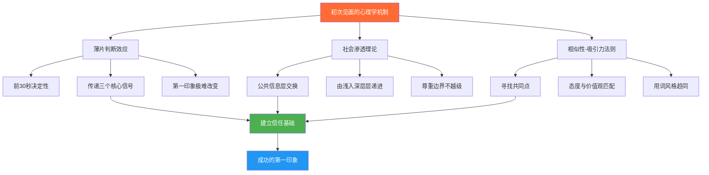
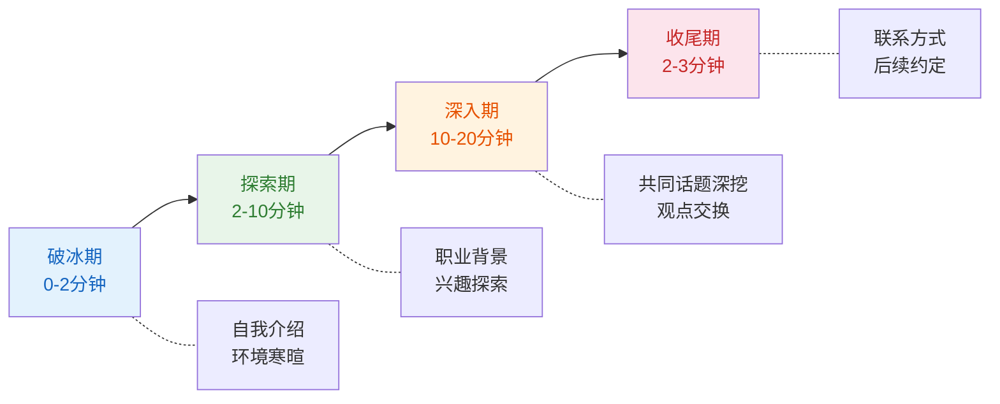

## 场景一：初次见面

初次见面是所有社交场景中最具挑战性的一种——双方互不了解，没有共同经历，对话的每一步都需要在未知中探索。然而，初次见面也是最具回报价值的场景：一次成功的初次对话，可能为你打开一扇通往新友谊、新合作、甚至新人生方向的大门。

本节将从心理学机制出发，系统拆解初次见面场景中的每一个关键环节，覆盖职场社交、行业活动、朋友介绍、旅途偶遇四种典型情境，提供可直接复用的对话框架和应变策略。

### 一、初次见面的心理学机制

#### 1.1 第一印象的"薄片判断"效应

心理学家 Nalini Ambady 和 Robert Rosenthal 在1993年提出了"薄片判断"（Thin-Slicing）理论：人们在接触的最初几秒钟内就会形成对他人相对稳定的第一印象，且这种印象在后续互动中极难改变。他们的实验表明，仅观看30秒的无声教学视频，学生对教师的评价与学期末的整体评价高度一致。

这意味着初次见面的前30秒至2分钟是决定性的。你不需要在这么短的时间里展示全部优点，但你需要在这段时间里传递三个核心信号：

| 核心信号 | 传递方式 | 神经机制 |
|---------|---------|---------|
| **我没有敌意** | 微笑、开放的身体姿态、柔和的语调 | 对方杏仁核降低警觉水平，催产素开始释放 |
| **我值得交往** | 自信但不自大的自我介绍、得体的着装 | 对方前额叶皮层进行社会价值评估 |
| **我对你感兴趣** | 眼神接触、点头、追问对方的信息 | 对方奖赏回路激活，产生社交愉悦感 |

#### 1.2 社会渗透理论与"洋葱模型"

心理学家 Irwin Altman 和 Dalmas Taylor 提出的社会渗透理论（Social Penetration Theory）用"剥洋葱"比喻人际关系的发展过程：由外到内，从浅层的公开信息逐步深入到核心的私密信息。

初次见面对应的是洋葱的最外层——**公共信息层**。在这个阶段，适合交换的信息包括：

- 姓名、职业、来自哪里
- 当前场合的共同体验
- 普遍性的兴趣爱好（运动、美食、旅行等）

不适合在这个阶段涉及的信息包括：
- 收入、房产、婚姻状况等个人隐私
- 政治观点、宗教信仰等敏感话题
- 过于深入的个人经历分享

#### 1.3 相似性-吸引力法则

社会心理学中有一条被反复验证的规律：人们倾向于喜欢与自己相似的人。Robert Byrne 的相似性-吸引力范式（Similarity-Attraction Paradigm）研究表明，态度、价值观、背景乃至用词风格的相似性都会显著增加人际吸引力。

在初次见面中，这意味着最有效的策略不是"展示自己有多优秀"，而是"找到与对方的共同点"。共同点可以是同乡、同校、同行业、同爱好，甚至是对当前环境的同一种感受（"今天这个交通真是太堵了"）。

### 二、初次见面的完整对话框架

初次见面的对话并非随机闲聊，它有清晰的阶段结构。掌握这个结构，你就能在任何初次见面场景中保持从容。

#### 2.1 四阶段模型

| 阶段 | 时长 | 核心任务 | 典型话术 | 心理目标 |
|------|------|---------|---------|---------|
| **破冰期** | 0-2分钟 | 打破沉默，建立基本连接 | "你好，我叫XX，做XX的" | 降低双方戒备，传递友好信号 |
| **探索期** | 2-10分钟 | 寻找共同点，发现对方兴趣 | "你也是第一次来吗？""你平时做什么？" | 建立"我们有共同点"的感觉 |
| **深入期** | 10-20分钟 | 围绕发现的共同点展开讨论 | "你也喜欢XX？那你有没有试过……" | 产生"聊得来"的感觉 |
| **收尾期** | 最后2-3分钟 | 留下联系方式，为后续互动铺垫 | "加个微信吧，回头分享给你" | 将一次性对话转化为持续关系 |

#### 2.2 自我介绍的黄金公式

初次见面的第一句话往往就是自我介绍。一个好的自我介绍不是背诵名片，而是一个精心设计的"对话钩子"——它应该包含足够的信息让对方有话可接，同时留下适当的好奇空间。

**黄金公式：名字 + 身份标签 + 连接钩子**

| 要素 | 作用 | 示例 |
|------|------|------|
| **名字** | 提供基本称呼 | "我叫陈明" |
| **身份标签** | 让对方快速定位你 | "做产品设计的" |
| **连接钩子** | 给对方接话的切入点 | "你也是第一次来参加这个活动吗？" |

**对比示例：**

- 差："你好，我是陈明。"（太短，对方不知道怎么接）
- 差："你好，我是陈明，毕业于XX大学，在XX公司担任高级产品设计师，负责XX产品线的整体规划，之前还在XX公司工作过……"（太长，像在念简历）
- 好："你好，我叫陈明，做产品设计的。你也是第一次来参加这个活动吗？"（简洁、有信息量、有接话点）

### 三、子场景深度拆解

#### 3.1 子场景A：行业交流活动

**场景设定：** 你参加一个行业交流活动，在签到处遇到了一位同样独自前来的参与者。你们互相点头示意，现在需要开启一段对话。

**完整对话示范：**

**你：** "你好，我叫陈明，做产品设计的。你也是第一次来参加这个活动吗？"

**对方：** "你好，我叫李薇，做市场营销的。我之前参加过一次，感觉还不错，这次又来了。"

**你：** "市场营销啊，那我们工作中交集应该挺多的。你觉得上次活动最大的收获是什么？"

**对方：** "最大的收获可能是认识了一些同行，后来还合作了一个项目。你做产品设计的话，是在哪个行业？"

**你：** "主要是互联网产品，最近在做一款教育类的App。说到这个，最近教育行业变化挺大的，你们市场端应该感受更明显吧？"

**对方：** "确实，政策变化对我们影响挺大的，获客方式都要调整。你们产品端是怎么应对的？"

**你：** "我们更多转向了内容驱动的策略，做了很多免费的教育内容来获取用户信任。你们市场营销上有没有类似的尝试？"

**对方：** "有的，内容营销确实是现在的大趋势。我最近在研究短视频获客，效果还挺好的。"

**你：** "短视频获客？这个方向我挺感兴趣的。活动结束后方便加个微信吗？回头可以详细聊聊，说不定有合作的机会。"

**对方：** "好啊，等会儿我扫你。"

**逐轮技巧解析：**

| 轮次 | 你说的话 | 使用的技巧 | 效果分析 |
|------|---------|-----------|---------|
| 第1轮 | "你好，我叫陈明……" | **直接自我介绍法** + **封闭式确认问题** | 简洁明了降低心理门槛，"第一次来吗"是封闭式问题，对方容易回答 |
| 第2轮 | "你觉得上次活动最大的收获是什么？" | **追问细节法** + **开放性问题** | 让对方分享经历，表达对她的重视 |
| 第3轮 | "你们市场端应该感受更明显吧？" | **行业关联法** + **角色代入** | 从共同的行业背景切入，让对方以专业身份参与讨论 |
| 第4轮 | "你们市场营销上有没有类似的尝试？" | **双向交流法** | 不只是自己说，也邀请对方分享，保持对话平衡 |
| 第5轮 | "活动结束后方便加个微信吗？" | **自然收尾法** + **未来锚定** | 不突兀地建立后续联系，"详细聊聊"给了加微信的合理理由 |

**进阶变体——应对"社恐型"对方：**

有些初次见面的对象明显紧张或不善言辞。这时你需要承担更多的"对话引导者"角色：

- 多用封闭式问题（"你是做技术的吧？"比"你是做什么的？"更容易回答）
- 多分享自己的经历来降低对方压力（"我第一次来这种活动也挺紧张的"）
- 利用环境元素制造话题（"今天这个场地挺大的""这个签到流程挺高效"）
- 不要因为对方话少就放弃——很多人需要3-5分钟才能"热起来"

#### 3.2 子场景B：朋友介绍的社交场合

**场景设定：** 你的朋友小张带你参加他的生日聚会，在场有很多你不认识的人。小张把你介绍给他的大学同学小李后就去招呼其他人了。

**对话示范：**

**小张：** "小李，这是我同事陈明。陈明，这是我大学同学小李，做建筑设计的。"

**你：** "小李你好，建筑设计！那你们天天和图纸打交道吧？我做产品设计的，虽然领域不同，但设计思维应该有共通的地方。"

**小李：** "是的，用户体验在建筑设计里也越来越重要了。你主要做哪方面的设计？"

**你：** "主要是App和网页的交互设计。对了，你是小张的大学同学？你们是学建筑的吗？"

**小李：** "对，我们是同班同学，现在还在同一个设计院。你是小张的同事？你们怎么认识的？"

**你：** "去年公司年会上分到同一桌，发现都喜欢打篮球，后来就成了球友。你打篮球吗？"

**小李：** "偶尔打，但更喜欢踢足球。你踢吗？"

**你：** "足球不太行，但我看球！你是哪个队的球迷？"

**逐轮技巧解析：**

| 轮次 | 核心技巧 | 详细说明 |
|------|---------|---------|
| 第1轮 | **第三方引入法** | 利用小张的介绍作为自然开场，不需要自己想话题 |
| 第2轮 | **共同点锚定法** | "设计思维有共通之处"主动建立连接 |
| 第3轮 | **反向提问法** | 不只回答问题，也向对方提问，保持对话双向流动 |
| 第4轮 | **关联延伸法** | 从共同爱好（篮球/足球）自然延伸 |
| 第5轮 | **兴趣匹配法** | "我看球"降低了门槛，表示愿意进入对方的领域 |

**朋友介绍场景的特殊优势：**

- 有共同的朋友作为"信任背书"，降低了双方的戒备
- 可以通过共同朋友找话题（"你是怎么认识小张的？"）
- 聚会氛围本身提供了大量可观察的话题素材

#### 3.3 子场景C：旅途中的偶遇

**场景设定：** 你在高铁上，邻座是一位年龄相仿的乘客。列车启动后，你们都放下了手机，空气有些安静。

**对话示范：**

**你：** "你好，你也是到终点站吗？"（看着对方的车票或行李）

**对方：** "是的，去出差。你呢？"

**你：** "我也是出差，去参加一个行业会议。你经常出差吗？"

**对方：** "还挺频繁的，基本上每个月都要跑两三个城市。"

**你：** "那挺辛苦的。我以前也经常出差，后来换了个岗位就好多了。你一般出差会利用路上的时间做什么？"

**对方：** "看看书或者补补觉。你呢？"

**你：** "我一般会听播客，最近在听一个讲商业案例的，挺有意思的。你有没有什么好书推荐？"

**对方：** "我最近在看《纳瓦尔宝典》，讲财富和幸福的，挺有启发。"

**你：** "那本书我听说过，一直没来得及看。回头我也找来看看。你是在哪个行业工作？"

**旅途场景的特殊考量：**

| 因素 | 应对策略 |
|------|---------|
| 对方可能不想被打扰 | 先观察信号：如果对方戴耳机、闭眼、专注工作，不要打扰 |
| 可能有较长的共处时间 | 不急于深入，可以慢慢聊，中间允许自然的沉默 |
| 对方身份未知 | 从环境和共同体验切入，不急于询问职业等个人信息 |
| 可能需要中途结束 | 对方可能要睡觉或工作，准备好优雅地结束对话 |

**优雅结束旅途对话的话术：**

- "不好意思，我先处理一下工作邮件。"（暗示需要安静）
- "我先眯一会儿，到站了互相提醒一下？"（友好地暂停对话）
- "聊得挺开心的，加个微信吧，有缘再聊。"（如果聊得好，建立联系）

#### 3.4 子场景D：商务会议前的等待

**场景设定：** 你提前到达一个商务会议的会场，在等候区遇到了其他提前到场的参会者。

**对话示范：**

**你：** "你好，我叫陈明，XX公司的。你是来参加今天的产品发布会的吗？"

**对方：** "你好，我是李薇，YY科技的。对，来看看你们公司的新产品。"

**你：** "YY科技！你们的XX产品我在用，体验挺好的。你负责哪一块？"

**对方：** "我负责市场推广。你呢？是产品团队的？"

**你：** "对，我是产品设计负责人。你们市场端对我们这个品类有什么看法？很想听听外部视角。"

**商务场景的关键原则：**

- 名片或微信二维码准备好，方便交换
- 不要急于推销自己的产品或服务
- 多问对方的行业见解，展示好奇心和学习态度
- 避免涉及竞品的负面评价
- 会议开始后自然结束对话，不需要强行收尾

### 四、初次见面的核心技巧工具箱

#### 4.1 话题选择的"SAFE"法则

初次见面时，话题选择至关重要。使用"SAFE"法则来判断一个话题是否适合：

| 字母 | 含义 | 适合的话题示例 | 不适合的话题示例 |
|------|------|---------------|----------------|
| **S** | Shared（共同的） | 当前活动、天气、交通 | 只有你个人经历的事情 |
| **A** | Appropriate（得体的） | 行业动态、兴趣爱好 | 收入、年龄、婚姻状况 |
| **F** | Fun（有趣的） | 旅行经历、美食推荐 | 抱怨、吐槽、负面情绪 |
| **E** | Easy（轻松的） | 影视作品、体育赛事 | 政治立场、宗教信仰 |

#### 4.2 "2-1"提问法则

在初次见面中，提问是推动对话的主要动力。"2-1"法则指的是：每提出2个问题后，分享1段自己的信息。

**为什么是2-1而不是1-1？**

- 初次见面时，人们对自己的话题更感兴趣，多问少说能快速建立好感
- 但如果你只问不说，对方会感觉被"审问"，所以每隔2个问题分享一段自己的经历
- 这种节奏让对方感到你既感兴趣又不咄咄逼人

**示例：**

问题1："你是做什么行业的？" （提问）
问题2："你们行业最近有什么新趋势？" （提问）
分享1："我们行业最近也在经历类似的变化，主要是……" （分享）
问题3："你平时工作之余喜欢做什么？" （提问）
问题4："你是怎么开始对摄影感兴趣的？" （提问）
分享2："我之前也试过摄影，不过拍出来的照片总是……" （分享）

#### 4.3 倾听与回应的"三级反馈"模型

初次见面中，你如何回应对方说的话，比你说什么更重要。心理学家 Carl Rogers 强调"积极倾听"（Active Listening）在建立关系中的核心作用。

| 反馈级别 | 方式 | 示例 | 效果 |
|---------|------|------|------|
| **第一级：确认性反馈** | 简短的语言确认 | "嗯""是的""确实" | 让对方知道你在听 |
| **第二级：复述性反馈** | 用自己的话复述对方的要点 | "所以你的意思是……" | 让对方感到被理解 |
| **第三级：共情性反馈** | 表达对对方感受的理解 | "听起来那段经历对你影响挺大的" | 让对方感到被理解且被尊重 |

初次见面时，以第一级和第二级为主，第三级要谨慎使用——过早的情感共鸣可能让对方感到不适。

#### 4.4 身体语言的"SOFT"原则

初次见面中，你的身体语言传递的信息量远超你的话语。"SOFT"原则帮助你用身体语言传递友好和开放：

| 字母 | 含义 | 具体做法 | 常见错误 |
|------|------|---------|---------|
| **S** | Smile（微笑） | 自然的微笑，嘴角微微上扬 | 僵硬的假笑、全程不笑 |
| **O** | Open（开放） | 双臂自然下垂或做手势，身体微微朝向对方 | 双臂交叉抱胸、身体后仰 |
| **F** | Forward（前倾） | 身体微微前倾，表示兴趣 | 靠在椅背上、身体后仰 |
| **T** | Touch（接触） | 握手时适度有力，保持1-2秒 | 软绵无力的握手、握太久 |

**眼神接触的黄金比例：**

研究建议，在对话中保持60%-70%时间的眼神接触是最理想的。低于50%会显得不自信或不感兴趣，高于80%会显得有压迫感。具体操作方式是：在对方说话时看着对方的眼睛，在你自己思考措辞时可以短暂移开目光。

### 五、初次见面的常见错误与纠正

#### 5.1 十大常见错误

| 错误 | 表现 | 为什么是错的 | 纠正方法 |
|------|------|-------------|---------|
| **自我介绍过长** | 背诵简历式自我介绍 | 对方注意力有限，长篇介绍会让对方走神 | 控制在15秒以内，只说姓名+职业+一个钩子 |
| **审问式提问** | 连续问3个以上问题 | 对方感觉被盘问，产生防御心理 | 遵循"2-1"法则，穿插自己的分享 |
| **过早深入私人话题** | 第一次见面就问收入/婚恋 | 侵犯对方心理边界，引起不适 | 保持在SAFE话题范围内 |
| **只聊自己** | 对方说什么都绕回自己身上 | 对方感觉不被重视 | 多追问对方的细节，少抢话 |
| **虚假赞美** | "你今天好漂亮啊"（泛泛而谈） | 缺乏诚意，对方能感觉到 | 赞美要具体："你这个耳环的设计很独特" |
| **消极肢体语言** | 双臂交叉、眼神飘忽、身体后仰 | 传递不感兴趣或防御的信号 | 保持SOFT原则 |
| **不停看手机** | 对话中频繁看手机 | 传递"你比手机无聊"的信号 | 手机调静音放进口袋 |
| **过度表现** | 不断吹嘘自己的成就 | 让对方感觉你在炫耀 | 保持谦逊，多让对方说 |
| **忽略对方信号** | 对方明显不想继续某个话题还在说 | 对方感到不舒服 | 观察对方表情和回应，及时转换话题 |
| **突然消失** | 聊到一半不告而别 | 让对方感觉被忽视 | 离开前礼貌告辞，表达感谢 |

#### 5.2 错误恢复策略

即使犯了错误也不必慌张。以下是几种常见错误的即时恢复方法：

**犯了"审问式提问"错误后的恢复：**
"不好意思，我问得太多了。其实我自己……"（转向分享自己的经历）

**说了不合适的话题后的恢复：**
"哎呀，这个话题有点沉重了。对了，你刚才说你是做XX的，能多说说吗？"

**发现自己一直在说自己的恢复：**
"我说太多了，不好意思。你呢？你对这个怎么看？"

### 六、初次见面后的跟进策略

初次见面的真正价值不在于那几分钟的对话，而在于能否将这次相遇转化为持续的关系。

#### 6.1 "24小时法则"

在初次见面后的24小时内发送一条跟进消息。研究表明，24小时内是巩固第一印象的最佳窗口期——对方对你的记忆还很清晰，但已经过了"刚分开"的尴尬期。

**跟进消息模板：**

"你好，我是昨天在XX活动上认识的陈明。和你聊了XX话题很有收获，
回头把你说的那本书/那个链接/那个餐厅找来看看/试试。保持联系！"

**跟进消息的三个要素：**

| 要素 | 作用 | 示例 |
|------|------|------|
| **身份提醒** | 帮助对方回忆你是谁 | "昨天在XX活动上认识的陈明" |
| **对话延续** | 表示你认真听了 | "你说的那本书我找了" |
| **开放结尾** | 为后续互动留空间 | "保持联系" |

#### 6.2 从"认识"到"熟悉"的路径

初次见面只是关系的起点。从"认识"到"熟悉"需要至少3-5次有意义的互动：

**每次互动的"价值锚"：**

不要为了联系而联系，每次互动都应提供某种价值：
- 分享对方可能感兴趣的文章/活动信息
- 在对方需要帮助时伸出援手
- 介绍可能对对方有帮助的人脉
- 对对方的成就表示真诚的祝贺

### 七、进阶技巧：高段位初次见面策略

#### 7.1 "社交枢纽"角色

在大型社交场合中，如果你能同时认识多个人并介绍他们相互认识，你就扮演了"社交枢纽"（Social Hub）的角色。这种角色能大幅提升你的社交影响力。

**操作方式：**
"李薇，我刚认识了一位做技术架构的朋友，你们聊得来。
王明，这是李薇，做市场营销的，你们可以聊聊技术在营销中的应用。"

#### 7.2 "故事记忆法"

人们更容易记住故事而非事实。在初次见面中，用一个简短的故事来介绍自己，比罗列事实更容易被记住。

**对比：**
- 事实版："我是做产品设计的，在XX公司工作了5年。"
- 故事版："我是做产品设计的。说起来挺有意思，我大学学的是机械工程，实习的时候偶然接触了用户界面设计，发现比画零件图纸有趣多了，就转行了。"

故事版包含了冲突（专业不对口）、转折（偶然接触）、结果（转行），更容易被大脑编码和记住。

#### 7.3 "记忆锚点"技术

初次见面时，主动为对方创造一个记忆锚点——一个独特的、容易记住的标签。

**示例：**
- "我就是那个每天早上在朋友圈发跑步记录的陈明。"
- "我有个外号叫'咖啡地图'，因为我到一个城市第一件事就是找好喝的咖啡。"
- "我是XX公司那个养了三只猫的产品经理。"

这些锚点不是自吹自擂，而是帮助对方在众多新认识的人中快速记住你。

### 八、总结与自检清单

#### 8.1 初次见面成功的关键指标

完成一次初次见面后，用以下清单自检：

- [ ] 对方知道你的名字和职业
- [ ] 你至少找到了一个与对方的共同点
- [ ] 对方至少分享了一段个人经历或观点
- [ ] 你没有连续问超过2个问题
- [ ] 你全程保持了开放的身体语言
- [ ] 你观察了对方的反应并适时调整话题
- [ ] 你留下了后续联系的方式或约定
- [ ] 你在24小时内发送了跟进消息

#### 8.2 不同水平的对照标准

| 水平 | 表现 | 下一步提升方向 |
|------|------|---------------|
| **入门级** | 能完成基本的自我介绍和简单寒暄 | 学习"SAFE"话题法则，准备好3-5个开场话术 |
| **初级** | 能维持5分钟以上的对话 | 练习"2-1"提问法，学会追问细节 |
| **中级** | 能找到共同点并自然深入 | 学习"三级反馈"模型，提升倾听质量 |
| **高级** | 能灵活应对各种初次见面场景 | 练习"故事记忆法"和"社交枢纽"角色 |
| **精通** | 每次初次见面都能建立有价值的连接 | 发展个人风格，形成独特的社交魅力 |

初次见面是社交能力的试金石。它考验的不是你会多少话术，而是你能否在未知中保持真诚、在短暂中创造连接。记住：最好的初次见面不是你说了多么精彩的话，而是对方在离开时觉得"和这个人聊天很舒服"。

***

