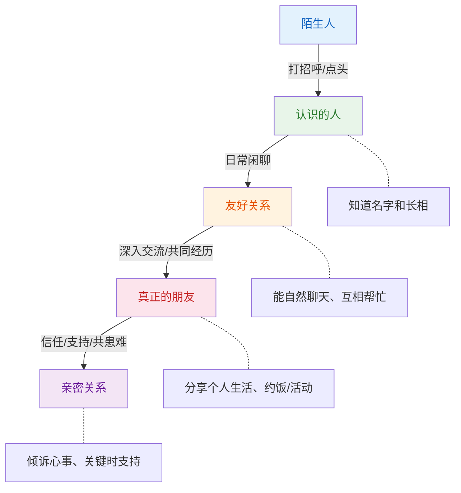
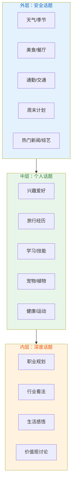
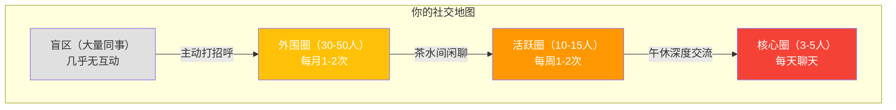

## 场景二：同事闲聊

同事闲聊是日常生活中发生频率最高的社交场景——你每周至少有五天、每天至少八小时与同事共处。这种高频接触使得同事闲聊的质量直接影响你的职场幸福感、团队协作效率和职业发展机会。然而，同事闲聊又是一种极度微妙的社交形式：它既不像初次见面那样有明确的"破冰"预期，也不像朋友聚会那样可以畅所欲言；它游走在"公事公办"与"推心置腹"之间的灰色地带，需要你精准地把握分寸。

本节将从职场关系的心理学机制出发，系统拆解同事闲聊的核心策略，覆盖茶水间偶遇、午休时间、工位邻座、会议等待、加班陪伴五种典型子场景，提供可直接复用的对话框架、话题清单和雷区地图。

### 一、同事闲聊的心理学机制

#### 1.1 "弱关系"理论与职场闲聊的价值

美国社会学家 Mark Granovetter 在1973年提出了"弱关系的力量"（The Strength of Weak Ties）理论。他发现，人们获得工作机会、行业信息等关键资源时，帮助最大的往往不是亲密的"强关系"（家人、密友），而是那些"点头之交"的"弱关系"——因为他们接触到的信息圈与你不同，能为你带来全新的机会。

同事关系天然处于"弱关系"与"中等关系"之间的光谱上。你与隔壁部门的小王可能每周只见几次面，聊几句天气和午饭，但正是这些看似无意义的闲聊，在维系这条关系纽带。心理学研究表明，维持一条"弱关系"只需要极低的成本——每周一到两次、每次一到两分钟的互动就足够了。同事闲聊恰好提供了这种低成本、高频率的维护机制。

| 关系类型 | 互动频率 | 深度 | 信息多样性 | 职场价值 |
|---------|---------|------|-----------|---------|
| **强关系**（直属上司、搭档） | 每天多次 | 深 | 低（同质化） | 任务协调、直接支持 |
| **中等关系**（同部门同事） | 每天1-2次 | 中 | 中 | 团队协作、情感支持 |
| **弱关系**（隔壁部门、跨团队） | 每周1-2次 | 浅 | 高（异质化） | 信息获取、机会发现 |
| **潜在关系**（点头之交） | 偶尔 | 极浅 | 极高 | 未来可能性 |

#### 1.2 "接触效应"与熟悉感的建立

心理学家 Robert Zajonc 在1968年提出的"纯粹接触效应"（Mere Exposure Effect）揭示了一个反直觉的规律：仅仅是反复接触某个刺激物（包括人），就会增加对其的好感度。这意味着同事之间每天的短暂闲聊——哪怕只是"早啊""今天挺热的"——都在无形中积累双方的好感度。

神经科学对此的解释是：反复接触会降低大脑对某个刺激的处理难度（加工流畅性），而高加工流畅性会引发积极的情感反应。换句话说，你的声音、面孔、说话方式对同事来说越"熟悉"，他们就越倾向于对你产生好感。

这对同事闲聊的启示是：**频率比深度更重要**。每天花30秒和隔壁桌的同事打个招呼、聊两句天气，比每周一次长谈半小时更有效地建立关系。

#### 1.3 "关系升级阶梯"理论

心理学家用"关系升级阶梯"（Relationship Escalation Ladder）来描述人际关系从陌生到亲密的发展过程。同事关系通常停留在"功能性关系"和"友好关系"两个层级之间，闲聊是推动关系从低层级向高层级移动的唯一低成本途径：

大多数同事关系在B→C的阶段就需要闲聊来维持。如果你希望某条同事关系升级到D（真正的朋友），你需要在闲聊中逐步引入更深层的话题——这将在后文的"话题分层"部分详细讨论。

#### 1.4 "印象管理"理论在同事闲聊中的应用

社会学家 Erving Goffman 的"印象管理"理论指出，人们在社交中始终在进行"表演"来管理他人对自己的印象。在同事闲聊中，这种"表演"尤为微妙——因为你需要在同一批观众面前长期"表演"，任何不一致的表现都会被察觉。

同事闲聊中的印象管理需要做到三个平衡：

| 维度 | 一端 | 另一端 | 平衡点 |
|------|------|--------|--------|
| **亲和力** | 过于冷淡（拒人千里） | 过于热情（让人警惕） | 友好但有边界 |
| **专业性** | 只谈工作（无趣） | 只聊八卦（不专业） | 以闲聊展现全面的自己 |
| **真诚度** | 过于完美（假） | 过于真实（不加筛选） | 真诚但有选择 |

### 二、同事闲聊的"三层话题"模型

同事闲聊最大的挑战是话题选择——说什么既不显得刻意，又不会踩到雷区。我提出一个"三层话题"模型来帮你系统地管理同事闲聊的话题：

**使用原则：**

- **外层话题**：适用于所有同事，尤其是不太熟的——茶水间偶遇、电梯里的30秒
- **中层话题**：适用于已经聊过多次、有一定了解的同事——午休时间、工位闲聊
- **内层话题**：适用于关系较好、有信任基础的同事——加班时的深入交流
- **升级规则**：只有当你在外层话题中获得了积极回应（对方主动延伸、提问、分享），才考虑尝试中层话题。不要"越级"

**话题选择的"SAFE"检查清单**（与初次见面通用，但同事场景有特殊考量）：

| 检查项 | 含义 | 同事场景的特殊应用 |
|--------|------|-------------------|
| **S** — Shared（共同的） | 找共同体验 | 同事天然共享工作环境、公司文化、行业动态 |
| **A** — Appropriate（得体的） | 不越界 | 同事间的边界比朋友更严格，注意职级差异 |
| **F** — Fun（有趣的） | 轻松愉快 | 避免抱怨型话题，保持积极基调 |
| **E** — Easy（轻松的） | 无压力 | 不要给对方"必须回应"的压力 |

### 三、子场景深度拆解

#### 3.1 子场景A：茶水间偶遇

**场景设定：** 午休时间，你在茶水间遇到了隔壁部门的同事小王。你们平时见面会打招呼，但没有深入交流过。你正在接水，小王在泡咖啡。

**完整对话示范：**

**你：** "小王，今天中午吃什么了？我看你从外面回来的。"

**小王：** "去了楼下新开的那家面馆，味道还行。你呢？"

**你：** "我带的饭，昨天做的红烧排骨，今天热一下。说到楼下，你有没有发现最近那条街开了好几家新店？"

**小王：** "是啊，感觉变化挺快的。上次那家奶茶店好像关门了，换成了一家咖啡店。"

**你：** "对对对，那家咖啡店我进去过一次，环境还不错。你平时喝咖啡吗？"

**小王：** "喝啊，每天不喝一杯感觉提不起精神。你有没有什么好喝的咖啡推荐？"

**你：** "我最近发现了一个小众品牌，性价比特别高，改天带一包给你尝尝。"

**逐轮技巧解析：**

| 轮次 | 你说的话 | 使用的技巧 | 心理学原理 | 效果分析 |
|------|---------|-----------|-----------|---------|
| 第1轮 | "今天中午吃什么了？" | **环境观察法** + **低风险问题** | 利用共同物理环境（茶水间+午餐时间）作为话题锚点 | 午饭是最安全的话题之一，几乎不会被拒绝 |
| 第2轮 | "那条街开了好几家新店" | **联想延伸法** | 从午餐话题自然延伸到周围环境变化 | 不停留在单一话题，展示思维活跃 |
| 第3轮 | "那家咖啡店我进去过一次" | **共同经历法** + **自我暴露** | 分享自己的经历，建立"我们也有关联"的感觉 | 从信息交换升级为经验分享 |
| 第4轮 | "你平时喝咖啡吗？" | **兴趣探索法** | 试探对方的兴趣领域，为后续深入做准备 | 如果对方感兴趣，话题可以继续扩展 |
| 第5轮 | "改天带一包给你尝尝" | **未来锚定法** + **社交投资** | 为未来互动创造一个自然的切入点 | 既展示了友好，又为下次交流埋下伏笔 |

**关键技巧拆解——"环境观察法"：**

茶水间偶遇的特点是：双方都在进行日常行为（接水、泡咖啡、热饭），没有明确的社交预期。这时候，"环境观察法"是最自然的开场方式——你不需要绞尽脑汁想话题，只需要说出你们共同看到、听到或正在做的事情。

**环境观察法的三个层次：**

| 层次 | 观察对象 | 话术模板 | 示例 |
|------|---------|---------|------|
| **物理环境** | 当前空间的事物 | "你有没有注意到……" | "你有没有注意到茶水间新换了咖啡机？" |
| **行为观察** | 对方正在做的事情 | "我看你在……" | "我看你在泡茶，这是什么茶？闻着挺香的。" |
| **时间情境** | 当前时间节点的特征 | "今天/最近……" | "今天这天气，下午肯定犯困。" |

**茶水间闲聊的特殊规则：**

- **时间控制在2-3分钟以内**：茶水间是来来往往的公共空间，长时间逗留聊天会显得不务正业
- **保持"可退出"的姿态**：不要背对门、不要挡住路，让双方都随时可以自然离开
- **留意第三人加入**：茶水间容易遇到第三个人，这时候可以自然地扩大对话圈，或者礼貌退出

#### 3.2 子场景B：午休时间的深度闲聊

**场景设定：** 午休时间，你和同部门的同事小李一起在公司楼下散步消食。你们已经共事一年多，关系不错但还没有到朋友的程度。你们有15-20分钟的时间。

**对话示范：**

**你：** "今天食堂那个红烧肉做得不错，你尝了没？"

**小李：** "尝了，确实比上周好多了。不过我还是更喜欢外面那家湘菜馆。"

**你：** "湘菜馆？哪个？我只知道楼下那条街的。"

**小李：** "不是楼下，是地铁站旁边那个巷子里的，叫'湘当有味'，他们家的小炒肉一绝。"

**你：** "湘当有味！我好像在外卖平台上看到过，评分挺高的。你喜欢吃辣的？"

**小李：** "对啊，我是湖南人嘛，无辣不欢。你呢？"

**你：** "我是浙江人，以前不太能吃辣，后来大学室友是四川人，硬是把我练出来了。你是湖南哪里的？"

**小李：** "长沙的，大学毕业后来的这边。你去过长沙吗？"

**你：** "去年国庆去了一趟，橘子洲头、岳麓山都去了，还在太平街吃了好多小吃。你们长沙人是不是每天都要嗦粉？"

**小李：** "哈哈，差不多！早上起来嗦一碗粉，一天才算开始。你们浙江有什么好吃的？"

**你：** "杭帮菜偏甜，像西湖醋鱼、东坡肉，外地人可能吃不太惯。不过浙江的海鲜是真的好，特别是舟山的带鱼。"

**小李：** "说到海鲜，你有没有发现公司附近新开了一家日料？上次路过看到的。"

**你：** "看到了！上周和朋友去过一次，三文鱼还挺新鲜的。下次部门聚餐可以考虑去那里。"

**逐轮技巧解析：**

| 轮次 | 核心技巧 | 详细说明 |
|------|---------|---------|
| 第1轮 | **共享体验法** | 利用共同的午餐经历开场，不需要任何铺垫 |
| 第2-3轮 | **追问细节法** | 对"湘菜馆"追问具体信息，表达对对方话题的兴趣 |
| 第4轮 | **身份探索法** | 从美食延伸到籍贯，自然地了解对方背景 |
| 第5-6轮 | **双向分享法** | 不只追问对方，也主动分享自己的经历，保持对话平衡 |
| 第7轮 | **文化好奇心** | "你们长沙人是不是每天都要嗦粉"用好奇而非评判的态度了解对方文化 |
| 第8-9轮 | **回旋镖技巧** | 对方问你浙江美食，你认真回答后自然引出新话题（海鲜→日料） |
| 第10轮 | **团队关联法** | "下次部门聚餐可以考虑"将闲聊与工作场景关联，增加实用性 |

**午休闲聊与茶水间闲聊的关键差异：**

| 维度 | 茶水间偶遇 | 午休深度闲聊 |
|------|-----------|-------------|
| **时长** | 2-3分钟 | 15-20分钟 |
| **话题深度** | 外层（安全话题）为主 | 可以进入中层（个人话题） |
| **互动模式** | 快速交换信息 | 深入交流、分享经历 |
| **关系目标** | 维护弱关系 | 推动关系升级 |
| **后续价值** | 增加熟悉感 | 建立信任基础 |

#### 3.3 子场景C：工位邻座的日常闲聊

**场景设定：** 你和小赵的工位相邻。你们每天都要见面，已经比较熟悉。下午三点多，你们都从工作中短暂抽离，有了几分钟的空闲。

**对话示范：**

**小赵：** "哎，你昨天晚上看那个比赛了吗？"

**你：** "看了看了！最后那个绝杀太精彩了，我当时都从沙发上跳起来了。"

**小赵：** "我也是！我老婆被我吓了一跳，问我怎么了。你平时经常看球吗？"

**你：** "看啊，基本上每周都看。不过最近太忙了，错过了好几场。你是哪个队的粉丝？"

**小赵：** "湖人，从科比时代就开始看了。你呢？"

**你：** "我更偏勇士一些，库里的三分球太有观赏性了。不过科比确实是一代传奇。对了，你打球吗？"

**小赵：** "大学的时候经常打，工作以后就少了。上次打球还是去年团建的时候。"

**你：** "团建那个篮球赛我记得！你那个三分球投得挺准的。要不我们周末约几个人打一场？"

**小赵：** "好啊，公司楼下那个篮球场周末应该开放的。我去问问老刘他们打不打。"

**逐轮技巧解析：**

| 轮次 | 核心技巧 | 效果分析 |
|------|---------|---------|
| 第1轮 | **热情回应法** | 用具体细节（"从沙发上跳起来"）展示你的投入感，而非简单的"看了" |
| 第2轮 | **自我暴露法** | "最近太忙错过好几场"适度暴露自己的生活，增加亲近感 |
| 第3轮 | **共同语言法** | 讨论各自支持的球队，即使不同也能找到共鸣（都是篮球迷） |
| 第4轮 | **回忆锚定法** | 提到团建中的具体表现，让对方感到被关注和记住 |
| 第5轮 | **行动升级法** | 从聊球升级到约球，将线上闲聊转化为线下社交活动 |

**工位闲聊的特殊规则：**

工位邻座是所有同事闲聊中最微妙的场景——你们离得太近，聊多了影响工作，不聊又显得冷漠。掌握以下规则至关重要：

| 规则 | 说明 | 违反后果 |
|------|------|---------|
| **"三秒启动"规则** | 闲聊前先观察对方状态，如果对方戴耳机或专注屏幕，不要打扰 | 打断对方工作会招致反感 |
| **"5-2-5"节奏法** | 5分钟闲聊→2小时各自工作→有空再聊5分钟 | 持续聊天影响双方效率 |
| **"话题留白"技巧** | 不一次性聊完所有话题，留一些到下次 | 保持新鲜感，避免"尬聊" |
| **"耳机信号"尊重** | 对方戴耳机=请勿打扰，摘耳机=可以聊天 | 尊重对方的工作节奏 |

#### 3.4 子场景D：会议前的等待时间

**场景设定：** 你提前5分钟到达会议室，发现只有一位其他部门的同事老张在。你们互相认识但不熟。其他参会者还没到。

**对话示范：**

**你：** "老张，今天这个会是关于什么的？我看邮件标题是Q3复盘？"

**老张：** "应该是，我们部门上周刚做完Q3的数据整理，今天来汇报。你们部门Q3怎么样？"

**你：** "总体还不错，有几个项目提前完成了。不过9月那段时间确实加了不少班。你们呢？"

**老张：** "我们也是，Q3推了两个新产品，忙得脚不沾地。不过好在数据还可以，领导还算满意。"

**你：** "新产品上线那段时间确实最辛苦。你们推的是哪个方向的？"

**老张：** "一个是智能客服的升级版，另一个是数据分析平台的新模块。"

**你：** "智能客服？这个方向挺热门的。你们用了大模型技术吗？"

**老张：** "用了，接入了一个开源的LLM做底层，效果还可以。你们技术部门有在关注这块吗？"

**你：** "有的，我们也在评估几个方案。回头这个会结束后，我们可以聊聊，互相分享一下经验。"

**会议等待闲聊的特殊价值：**

会议等待时间的闲聊有一个独特优势——你们马上要进入正式的工作讨论，这时候的闲聊起到了"社交预热"的作用。研究表明，在正式会议前进行2-3分钟的非正式交流，能够显著提升会议中的协作质量和信息共享意愿（这是因为短暂的闲聊激活了社交脑区，降低了后续正式交流中的心理防御）。

**会议等待闲聊的四条黄金法则：**

| 法则 | 说明 | 示例 |
|------|------|------|
| **关联会议** | 从会议主题自然切入 | "今天这个会是关于什么的？" |
| **展示专业** | 闲聊中适度展示专业见解 | "智能客服方向挺热门的，你们用了大模型吗？" |
| **建立联盟** | 找到跨部门合作的可能性 | "回头我们可以聊聊，互相分享经验" |
| **适可而止** | 人到齐后自然转入正式讨论 | 其他人到场后微笑点头，自然结束闲聊 |

#### 3.5 子场景E：加班时的陪伴式闲聊

**场景设定：** 晚上八点，你和同事小陈都在加班赶项目。你们已经连续工作了几个小时，都有些疲惫。办公室里只剩下你们两个人。

**对话示范：**

**你：** "小陈，都八点了，你吃晚饭了吗？"

**小陈：** "还没呢，准备先把这段代码写完再说。你呢？"

**你：** "我也还没。要不我们一起点个外卖？我看到楼下那家黄焖鸡在做满减。"

**小陈：** "行啊，你看看有什么好吃的，我也凑一份。"

**你：** "好，我来点。对了，你那个模块进度怎么样了？我看你今天一直在写。"

**小陈：** "差不多了，就剩一个接口没调通。有点卡在数据格式上了。"

**你：** "数据格式？我之前也遇到过类似的问题，当时是一个字段的类型不一致导致的。你看看是不是同样的情况。"

**小陈：** "有可能，我待会儿看看。谢了啊。你这边怎么样？"

**你：** "还行，文档写得差不多了。说实话，这个项目的节奏确实有点赶。不过好在团队配合还不错。"

**小陈：** "是啊，大家都挺拼的。等这个项目上线了，应该能轻松一阵。"

**你：** "到时候咱们部门聚个餐庆祝一下。你有什么想吃的？"

**小陈：** "火锅！好久没吃了。"

**你：** "没问题，我知道一家特别好的火锅店，回头我把链接发群里。"

**加班闲聊的特殊价值与规则：**

加班时的闲聊与其他场景有本质区别——它不是"社交需要"，而是"情感支持"。在高压的工作环境中，一句"你吃晚饭了吗？"传递的不是对食物的关心，而是"我不是一个人在战斗"的信号。心理学中的"共同命运效应"（Common Fate Effect）表明，当人们处于共同的困境中时（如一起加班），彼此的亲近感会显著提升。

| 价值维度 | 具体表现 |
|---------|---------|
| **情绪支持** | 减轻加班的孤独感和焦虑感 |
| **信息交换** | 了解对方的工作进度，发现协作机会 |
| **关系深化** | 共同经历困难是关系升级的催化剂 |
| **团队建设** | 加班中的互助行为增强团队凝聚力 |

**加班闲聊的三条铁律：**

1. **先关心人，再聊工作**：开口第一句应该是关心对方的状态（"吃了吗？""累不累？"），而不是问进度
2. **不抱怨，但可以共情**："这个项目确实挺赶的"是共情，"公司太压榨了"是抱怨——前者建立连接，后者传播负能量
3. **给对方空间**：如果对方明显不想聊天（戴着耳机、表情严肃），尊重对方的状态，不要强迫互动

### 四、同事闲聊的核心技巧工具箱

#### 4.1 "彩虹话题库"——同事闲聊的万能话题清单

以下是一份经过验证的同事闲聊话题库，按安全性从高到低排列。你可以在不知道聊什么的时候直接从这个清单中选取：

| 安全等级 | 话题类别 | 具体话术示例 | 适用时机 |
|---------|---------|-------------|---------|
| ★★★★★ | **天气/季节** | "今天外面好热啊""最近降温了，你穿够了吗？" | 任何时候，万能开场 |
| ★★★★★ | **美食/餐厅** | "中午吃了什么？""附近有没有好吃的推荐？" | 饭点前后 |
| ★★★★★ | **通勤/交通** | "今天地铁人多吗？""你开车来还是坐地铁？" | 早上到岗时 |
| ★★★★ | **周末/假期** | "周末有什么安排？""假期去哪玩了？" | 周五下午或节前 |
| ★★★★ | **热门新闻/综艺** | "你看那个XX节目了吗？""今天热搜那个新闻好搞笑" | 午休时间 |
| ★★★★ | **运动/健身** | "你平时运动吗？""最近在减肥吗？" | 对方有运动习惯时 |
| ★★★ | **兴趣爱好** | "你平时喜欢做什么？""你这个手办好好看" | 已经聊过几次之后 |
| ★★★ | **宠物/植物** | "你养猫了吗？""你桌上这盆绿萝养得真好" | 看到相关线索时 |
| ★★ | **行业动态** | "你看到XX公司的新闻了吗？""最近行业变化挺大的" | 对方是同行时 |
| ★ | **职业发展** | "你当初是怎么进入这个行业的？""你觉得这个方向有前景吗？" | 关系较好时 |

#### 4.2 "3F倾听法"——让同事觉得你是个好聊天对象

很多人认为聊天能力 = 说话能力，但真正的聊天高手都明白：**倾听才是聊天的核心技能**。同事闲聊中的倾听可以用"3F法"来系统化：

| 层级 | 英文 | 含义 | 操作方式 | 示例 |
|------|------|------|---------|------|
| **第一层** | Facts（事实） | 听到对方说了什么事实 | 复述或确认关键信息 | "所以你是说你们部门有4个人同时在做这个项目？" |
| **第二层** | Feelings（感受） | 感受到对方的情绪 | 回应对方的情感状态 | "听起来你对这个结果挺满意的。" |
| **第三层** | Focus（意图） | 理解对方为什么说这些 | 回应对方的潜在需求 | "你是想看看我们部门有没有类似的经验可以参考？" |

在同事闲聊中，以第一层和第二层为主，第三层要在关系较好时才使用——过早"看穿"对方会让同事感到不安全。

#### 4.3 "话题接力"技巧——如何让对话不断线

同事闲聊最常见的"死法"是：一方说完一件事，另一方"嗯"一声，然后空气安静了。避免这种情况的关键技巧是"话题接力"——在对方的话题基础上，自然地"接"出新话题。

**话题接力的五种模式：**

| 模式 | 机制 | 示例 |
|------|------|------|
| **关键词延伸** | 抓住对方话中的关键词，展开讨论 | 对方："周末去了趟宜家。" → 你："宜家！你买了什么？我上次去逛了三小时出不来。" |
| **经验嫁接** | 分享自己类似的经历 | 对方："最近在学做饭。" → 你："我也是！上周尝试做了一次糖醋排骨，结果糊了。你学的什么菜？" |
| **观点碰撞** | 对同一话题给出不同视角 | 对方："远程办公效率更高。" → 你："确实有道理，不过我觉得远程对自律性要求挺高的。你觉得呢？" |
| **联想跳跃** | 从当前话题联想到相关但不同的主题 | 对方："最近在看一部韩剧。" → 你："说到韩剧，你有没有去过韩国？我去年去了首尔，感觉和韩剧里差别挺大的。" |
| **反向提问** | 把对方的问题反问回去 | 对方："你周末干嘛了？" → 你："去了趟公园。你呢？你的周末一般怎么过？" |

#### 4.4 "温度计"模型——判断同事关系的亲密程度

在同事闲聊中，准确判断你和对方的关系"温度"至关重要。聊得太"浅"会显得冷漠，聊得太"深"会让人不舒服。以下是判断关系温度的四个指标：

| 温度区间 | 指标表现 | 适合的话题层级 | 互动建议 |
|---------|---------|--------------|---------|
| **冰冷**（0-20℃） | 只在必要时交流，从不闲聊 | 无（需要先破冰） | 先从打招呼和微笑开始 |
| **微温**（20-40℃） | 偶尔打招呼，简短寒暄 | 外层话题 | 每次多聊一两句，慢慢升温 |
| **温暖**（40-60℃） | 能自然聊天，偶尔开玩笑 | 外层+中层话题 | 可以分享个人兴趣，寻找共同点 |
| **火热**（60-80℃） | 经常聊天，互相关心，可能约饭 | 外层+中层+部分内层 | 可以讨论职业规划、行业看法 |
| **沸腾**（80-100℃） | 成为朋友，工作外也有联系 | 所有层级 | 关系已经超越同事 |

**关键原则：** 对方的"温度"决定你的"温度"。如果对方只在20℃（偶尔打招呼），你突然跳到60℃（聊个人生活），对方会感到突兀和不安。让关系自然升温，不要人为加热。

### 五、同事闲聊的雷区地图

同事闲聊有一些特定的"地雷"，踩到一次可能就毁掉你精心维护的关系。以下是经过大量案例验证的高频雷区：

#### 5.1 绝对禁区——碰了就炸

| 雷区 | 为什么危险 | 真实案例 | 正确做法 |
|------|-----------|---------|---------|
| **薪资收入** | 引发攀比、嫉妒、不公平感 | "你工资多少？"→对方要么尴尬要么愤怒 | 永远不问，即使对方主动提也只回应"差不多" |
| **领导评价** | 你不知道谁和领导什么关系 | "领导是不是对你有意见？"→传到领导耳朵里 | 对领导只说正面或中性评价 |
| **人事变动** | 信息不对称，容易引起恐慌 | "听说要裁员了？"→引发团队焦虑 | 不传播未证实的人事信息 |
| **同事八卦** | 你永远不知道谁和谁是什么关系 | "你觉得XX和YY什么关系？"→被当事人知道 | 不参与关于同事的八卦讨论 |
| **政治/宗教** | 观点对立，破坏和谐 | "你投了谁的票？"→引发激烈争论 | 完全回避，即使对方先提也不要接 |

#### 5.2 高危区——需要极度谨慎

| 雷区 | 风险等级 | 正确处理方式 |
|------|---------|-------------|
| **催婚/催生** | 🔴 高 | 不主动提，即使对方单身也不要介绍对象 |
| **身材/外貌评价** | 🔴 高 | 不评价，即使"你瘦了"也可能踩雷 |
| **学历/学校** | 🟡 中 | 不主动问，避免学历歧视的暗示 |
| **年龄** | 🟡 中 | 不猜年龄，不问年龄，尤其是女性同事 |
| **购房/车** | 🟡 中 | 不比较，不在经济话题上深入 |

#### 5.3 常见错误模式

| 错误模式 | 表现 | 为什么是错的 | 纠正方法 |
|---------|------|-------------|---------|
| **八卦传话机** | 总是传播别人的八卦来开启话题 | 破坏信任，别人也会担心你传他们的八卦 | 用共同体验或环境话题开场 |
| **抱怨黑洞** | 一开口就是抱怨工作、领导、公司 | 传播负能量，让人想远离你 | 保持积极基调，抱怨放在心里 |
| **审问模式** | 连续问5个以上问题不分享自己 | 让人感觉被盘问 | 遵循"2-1"法则，每2个问题分享1段自己 |
| **越界关心** | 问太私人的问题（恋爱、生育计划） | 侵犯隐私边界 | 保持在对方主动分享的范围内 |
| **政治正确警察** | 随时纠正别人的观点和用词 | 破坏轻松氛围 | 闲聊不是辩论赛，允许不同的声音 |
| **话题终结者** | 对每件事都只回"嗯""哦""是吧" | 让对方无法继续 | 用追问或联想来延续话题 |

#### 5.4 职级差异的特殊注意事项

同事闲聊中，职级差异是一个必须考虑的因素。和上司聊天与和同级聊天、和下属聊天有着截然不同的规则：

| 场景 | 核心原则 | 应该做的 | 不应该做的 |
|------|---------|---------|-----------|
| **和上司闲聊** | 尊重但不谄媚，专业但不拘谨 | 展示对工作的热情、分享行业见解 | 不抱怨同事、不邀功、不过于私人 |
| **和平级闲聊** | 平等、真诚、互相尊重 | 自然分享、寻找共同点、适度幽默 | 不炫耀、不攀比、不八卦 |
| **和下属闲聊** | 亲和但保持边界 | 关心对方状态、给予鼓励 | 不打探隐私、不做道德说教 |

### 六、同事闲聊的进阶策略

#### 6.1 "社交地图"策略——有意识地扩大你的职场关系网

不要只和最熟的同事闲聊。有意识地绘制你的"社交地图"，识别那些你还没有建立关系的同事，并主动创造互动机会：

**操作方法：**

1. 每周选择1-2个"外围圈"或"盲区"的同事，主动创造互动机会
2. 在茶水间、电梯、走廊遇到时，主动打招呼并多聊一两句
3. 利用共同的项目、活动、培训等机会加深了解
4. 记住对方的名字和一些基本信息，下次见面时提起

#### 6.2 "闲聊-工作"桥接技巧——从聊天到协作

同事闲聊的终极价值不在于聊天本身，而在于它为工作协作铺设的道路。当闲聊中发现与对方的工作有交集时，可以自然地桥接到工作话题：

**桥接话术模板：**

闲聊中发现线索 → 表达兴趣 → 桥接到工作 → 未来行动

示例：
"你们部门最近在做智能客服？（发现线索）
  这个方向挺有意思的。（表达兴趣）
  我们部门也在评估几个AI方案，（桥接到工作）
  回头有空我们可以聊聊，互相分享一下经验。"（未来行动）

#### 6.3 "闲聊投资回报"思维——每一次闲聊都是一次社交投资

把同事闲聊看作"社交投资"，你需要思考：这次互动投入了什么（时间、精力、信息），收获了什么（好感度、信息、机会）。这不意味着你要功利地计算每一次对话，而是要有意识地确保闲聊是"正收益"的。

| 投入 | 收获 | 投资回报率 |
|------|------|-----------|
| 30秒打招呼 | 增加熟悉感，维持弱关系 | 极高（几乎零成本） |
| 3分钟茶水间聊天 | 了解对方近况，增加好感 | 高（低成本高回报） |
| 15分钟午休深度聊天 | 建立信任，发现共同点 | 中等（需要投入时间） |
| 加班时的陪伴式聊天 | 深化关系，建立战友情 | 高（情感价值大） |

### 七、同事闲聊的自检清单

完成一次同事闲聊后，用以下清单自检你的表现：

**基础项（合格线）：**
- [ ] 我没有触碰任何禁区话题（薪资、领导评价、人事变动、八卦）
- [ ] 我的闲聊时间控制在合理范围内（茶水间2-3分钟，午休15-20分钟）
- [ ] 我没有只聊自己，而是给对方足够的表达空间
- [ ] 我观察了对方的反应，及时调整了话题或结束对话

**进阶项（良好线）：**
- [ ] 我使用了至少一种话题延续技巧（追问细节、联想延伸、感受回应）
- [ ] 我找到了与对方的至少一个共同点或共同兴趣
- [ ] 我的闲聊为未来的互动埋下了伏笔（"改天""下次""回头"）
- [ ] 我让对方感到被倾听和被尊重

**高级项（优秀线）：**
- [ ] 我通过闲聊发现了可以桥接到工作的协作机会
- [ ] 我有意识地扩大了社交地图（与不太熟的同事进行了互动）
- [ ] 我的闲聊提升了对方对我的好感度（对方主动延续话题或约定后续互动）
- [ ] 我在闲聊中展现了真实的自己，而非刻意的"社交人设"

### 八、不同水平的对照标准

| 水平 | 典型表现 | 下一步提升方向 |
|------|---------|---------------|
| **入门级** | 只和最熟的1-2个同事聊天，遇到其他同事假装没看到 | 学习"环境观察法"，每天主动和1个不熟的同事打招呼 |
| **初级** | 能和同事打招呼寒暄，但几句话就冷场 | 背熟"彩虹话题库"，练习"话题接力"技巧 |
| **中级** | 能和多数同事自然聊天，偶尔找到共同话题 | 学习"3F倾听法"，练习从闲聊中发现共同兴趣 |
| **高级** | 闲聊自然流畅，能在不同职级的同事间灵活切换 | 运用"社交地图"策略，有意识地扩大关系网 |
| **精通** | 每次闲聊都能让对方感到愉悦，自然地桥接到工作协作 | 发展个人风格，成为团队中的"社交枢纽" |

同事闲聊是职场社交的基础能力，它不需要你口若悬河、妙语连珠，只需要你真诚、有分寸、持续地投入。记住：**最好的同事闲聊不是你说了多么精彩的话，而是对方在离开时觉得"和这个人聊天很舒服，下次还想聊"**。每天花5分钟和不同的同事闲聊几句，三个月后你会发现你的职场关系网比你想象的要大得多。

***
