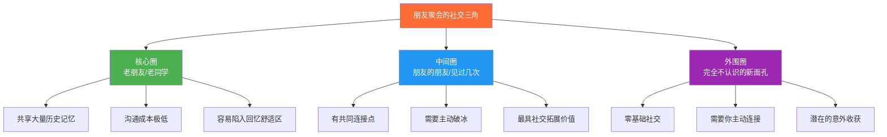
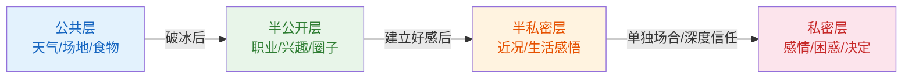
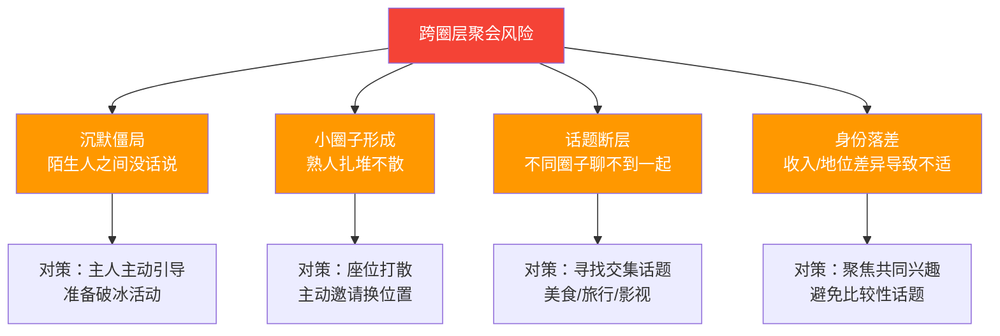
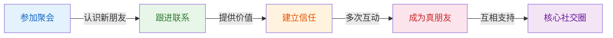

## 场景三：朋友聚会

朋友聚会是日常社交中频率最高、情感浓度最深的场景之一。与初次见面的"从零开始"不同，朋友聚会自带社交资本——你和在场的至少一部分人有共同的历史、共同的朋友、共同的记忆。但正是这种"熟悉感"，让很多人放松了社交意识，忽略了聚会上最核心的挑战：**如何在熟人圈中融入新人、在旧关系中创造新价值、在轻松氛围中完成高质量的社交连接。**

本节将从朋友聚会的社交动力学出发，系统拆解不同子场景中的对话策略、角色定位和关系推进方法，覆盖老同学聚会、同事下班聚餐、跨圈层朋友混搭聚会、婚礼/生日等庆祝型聚会四大典型情境。

### 一、朋友聚会的社交动力学

#### 1.1 "社交三角"结构

朋友聚会中的人际关系并非均匀分布，而是呈现出一种"社交三角"结构。理解这个结构，是你在聚会中找到自己位置的前提。

| 圈层 | 占比（典型聚会） | 你的对话策略 | 常见陷阱 |
|------|-----------------|-------------|---------|
| **核心圈** | 40%-60% | 适度叙旧，分享近况新动态 | 只和老朋友聊天，忽略其他人 |
| **中间圈** | 20%-40% | 通过共同朋友找话题，快速建立连接 | 假装熟悉或过度客套 |
| **外围圈** | 10%-20% | 主动自我介绍，利用环境话题破冰 | 完全无视，让对方被冷落 |

#### 1.2 聚会中的"连接者"角色

社会学家 Mark Granovetter 在其经典论文《弱关系的力量》中指出：在社交网络中，那些能够连接不同圈子的人——即"桥梁型"节点——往往拥有最大的信息优势和社交影响力。朋友聚会正是发挥"连接者"角色的最佳场景。

**连接者的核心能力：**

- **观察力**：快速判断在场人员的关系结构，识别"落单者"
- **共情力**：理解不同人的社交需求（有人想认识新朋友，有人只想安静待着）
- **介绍力**：能够用一两句话为两个人建立有意义的连接
- **控场力**：在适当的时候把话题从"老朋友专属"扩展到"大家都能参与"

**连接者的实操话术：**

场景：你发现角落里有一个不太熟的朋友独自喝饮料

你："小王，来来来，我给你介绍个人。这是张伟，做运营的，
特别厉害。张伟，小王是我们大学同学，做技术的，你们俩
聊聊技术运营协作，肯定有共鸣。"

这段话看似简单，实际上包含了三个关键动作：主动走近（打破孤独感）、双向介绍并附带赞美（让双方都有面子）、给出话题方向（降低接话难度）。

#### 1.3 社会渗透理论在聚会中的应用

在"初次见面"场景中我们提到过 Altman 和 Taylor 的社会渗透理论。朋友聚会的独特之处在于：**同一个空间里存在不同深度的关系，你需要灵活切换"洋葱层次"。**

| 交流层次 | 适用对象 | 话题示例 | 语言风格 |
|---------|---------|---------|---------|
| **公共层**（最外层） | 完全不认识的人 | 天气、聚会场地、食物 | 礼貌、轻松 |
| **半公开层** | 朋友的朋友 | 职业、兴趣、如何认识共同朋友 | 友好、好奇 |
| **半私密层** | 普通朋友 | 近况、工作变化、生活感悟 | 真诚、适度深入 |
| **私密层**（最内层） | 好朋友/老同学 | 感情状况、内心困惑、重大决定 | 信任、坦诚 |

**关键原则：不要在公共场合过度暴露私密层内容。** 聚会的社交属性意味着对话可能被旁人听到或打断。如果你和老朋友想聊私密话题，可以找个安静的角落，或者约定另外单独见面。

### 二、完整对话框架：朋友聚会的四阶段模型

朋友聚会的对话并非随意漫谈。无论聚会形式如何，你的社交行为都可以划分为四个阶段：

| 阶段 | 时长占比 | 核心任务 | 典型行为 | 心理目标 |
|------|---------|---------|---------|---------|
| **到达期** | 前15% | 寒暄、观察、定位 | 和最近的人打招呼，快速扫视全场 | 降低焦虑，建立存在感 |
| **升温期** | 15%-40% | 扩大社交面、发现话题线索 | 和不同的人简短交流，找到"热话题" | 建立多条社交连接 |
| **深化期** | 40%-75% | 围绕感兴趣的点深入交谈 | 和聊得来的人坐下来好好聊 | 产生"聊得来"的感觉 |
| **收尾期** | 最后25% | 加强印象、建立后续连接 | 交换联系方式、约定下次见面 | 将聚会社交转化为持续关系 |

### 三、子场景深度拆解

#### 3.1 子场景A：老同学聚会

**场景设定：** 你参加了一个大学同学的毕业五周年聚会在场的有熟悉的老同学也有不太认识的朋友带来的新面孔。聚餐开始前大家在包间里自由交流。

**对话示范：**

**你（走向不太认识的人）：** "嗨，我是陈明，小李的大学同学。你是怎么认识小李的？"

**新朋友：** "我叫张伟，是小李的同事。听说你们大学时候的故事特别多？"

**你：** "哈哈，确实不少。小李大学时候可是我们班的'社交达人'，什么活动都少不了他。你跟他共事多久了？"

**张伟：** "三年了。他在公司也是这样，特别活跃。你们大学学的什么专业？"

**你：** "计算机，不过我现在做产品设计，算是半转行了。你呢？也是技术岗吗？"

**张伟：** "我做运营的。产品和运营配合特别多，以后可以多交流。"

**你：** "太好了，我正想找一个运营的朋友聊聊，最近有个项目在用户增长方面遇到了一些瓶颈。改天约个饭？"

**逐轮技巧解析：**

| 轮次 | 你的话 | 使用的技巧 | 效果分析 |
|------|-------|-----------|---------|
| 第1轮 | "嗨，我是陈明……" | **共同朋友引入法** + **开放式问题** | 以共同朋友为桥梁降低陌生感，"怎么认识的"是开放式问题，对方容易展开 |
| 第2轮 | "小李大学时候可是社交达人" | **赞美第三方活跃气氛** | 赞美共同朋友既有趣又不尴尬，"社交达人"的标签让张伟能接话 |
| 第3轮 | "你跟他共事多久了" | **追问细节法** | 表达对对方的兴趣，推动对话深入 |
| 第4轮 | "计算机，不过现在做产品设计" | **身份介绍+转折钩子** | "半转行"是一个故事性元素，容易引发追问 |
| 第5轮 | "改天约个饭" | **未来锚定法** | 将一次性社交转化为长期关系的可能性 |

**老同学聚会的特殊优势：**

- 共同的历史记忆是天然的话题金矿
- "当年的故事"自带情感温度，容易拉近距离
- 有共同朋友作为信任背书，社交成本低

**老同学聚会的特殊风险：**

| 风险 | 表现 | 应对策略 |
|------|------|---------|
| **回忆陷阱** | 只聊"当年勇"，忽略当下 | 每段回忆之后接一个当下话题："对了，你现在在做什么？" |
| **比较陷阱** | 不自觉地比较收入、职位、生活 | 把话题从"结果"转向"过程"：聊经历而非成就 |
| **小圈子陷阱** | 只和最好的几个朋友扎堆 | 强制自己在聚会前半段和不太熟的同学交流 |
| **过度饮酒** | 喝多了失态或说出不该说的话 | 给自己设定饮酒上限，用"以茶代酒"化解劝酒 |

**进阶话术——从回忆转向当下的过渡技巧：**

"还记得大三那次通宵赶项目吗？那时候觉得天塌了，现在回头看
其实挺有意思的。说起来，你后来一直在做技术吗？有没有想过
换方向？"

这个话术的结构是：**回忆钩子 → 时间跨度感 → 当下话题**。它让老朋友的对话从过去自然过渡到现在，避免了聚会变成"怀旧大会"。

#### 3.2 子场景B：同事下班聚餐

**场景设定：** 部门组织了一次周五下班聚餐有你熟悉的同事也有其他部门你不太认识的人。领导也在场。这种场景混合了职场关系和私人社交，界限感非常重要。

**对话示范：**

**你（对旁边不太熟的同事）：** "你好，我是产品部的陈明。你是哪个部门的？"

**同事：** "我是市场部的李薇，上个月刚调过来。"

**你：** "市场部！那我们以后合作应该挺多的。新部门适应得怎么样？"

**李薇：** "还在磨合中，团队氛围挺好的，就是业务线和之前不太一样。"

**你：** "理解，换了环境都需要时间。你之前是做什么方向的？"

**李薇：** "之前做品牌传播，现在转到效果营销了，思路完全不一样。"

**你：** "效果营销确实和品牌传播差别挺大的，一个是短期ROI，一个是长期心智。不过我觉得你的品牌传播经验做效果营销反而有优势，很多效果营销的人太追求数据，忽略了品牌的力量。"

**李薇：** "真的！我来了之后就发现了，很多投放创意太硬了，完全没有品牌调性。"

**同事下班聚餐的特殊规则：**

| 规则 | 具体要求 | 原因 |
|------|---------|------|
| **不聊薪资** | 绝对不要在聚餐中讨论工资、奖金、股权 | 薪资是职场最敏感的话题，一旦公开比较会破坏同事关系 |
| **不八卦同事** | 不参与背后议论不在场的同事 | 隔墙有耳，今天你议论别人，明天别人议论你 |
| **领导在场时** | 保持正常社交节奏，不要刻意讨好也不要刻意回避 | 过度讨好让人反感，刻意回避显得不成熟 |
| **跨部门交流** | 主动和不认识的同事建立连接 | 这是拓展职场人脉的绝佳机会 |
| **饮酒分寸** | 比领导少喝一点，比新同事多喝一点 | 展示分寸感和社交智慧 |

**如何在领导面前展现社交能力（而非拍马屁）：**

差："王总，您今天真帅！"（空洞的讨好）

好："王总，上次您提到的那个用户增长策略，我回去仔细想了，
确实有几个点我之前没想到。今天正好市场部的同事也在，
要不我们聊聊？"（展示思考力+连接力）

#### 3.3 子场景C：跨圈层朋友混搭聚会

**场景设定：** 你组织了一次聚会把来自不同圈子的朋友聚在一起——有大学同学、有工作后认识的朋友、有运动认识的伙伴。这些人之间大多互不认识，你需要同时扮演主人、连接者和气氛维护者三重角色。

**这是朋友聚会中最具挑战性的场景，也是最能锻炼社交能力的场景。**

**聚会前的准备清单：**

| 准备事项 | 具体做法 | 目的 |
|---------|---------|------|
| **了解参与者** | 提前确认每个人的职业、兴趣、性格 | 为后续"配对介绍"做准备 |
| **设计话题线索** | 为每对可能坐在一起的人准备1-2个共同话题 | 避免冷场 |
| **安排座位** | 把性格互补或有共同话题的人安排在附近 | 降低社交摩擦 |
| **准备破冰活动** | 简单的自我介绍游戏或互动环节 | 帮助陌生人快速破冰 |
| **控制人数** | 6-12人为最佳，超过15人容易分裂成小圈子 | 保持整体互动性 |

**聚会中的连接者操作指南：**

第一步：自我介绍轮（前10分钟）
"大家可能互相不太熟悉，我们先简单介绍一下自己？
从我开始——我是陈明，做产品设计的，是小李的大学同学。
今天把大家聚在一起，希望你们也能互相认识。"

第二步：寻找连接点（观察+搭桥）
发现A和B都提到了喜欢跑步：
"等一下，老王你刚才说你也跑步？小刘是跑马拉松的，
你们俩可以聊聊。小刘跑过几个全马了？"

第三步：制造共同体验（15-20分钟后）
"来来来，我们玩个小游戏——每个人说一个自己最尴尬的
出差经历，投票选出最离谱的那个，输了的请喝酒。"

**跨圈层聚会的风险管理：**

#### 3.4 子场景D：婚礼/生日等庆祝型聚会

**场景设定：** 你被邀请参加一个朋友的婚礼。你和新郎/新娘是好朋友，但在场的大多数人你不认识。你需要在庆祝氛围中完成基本的社交礼仪。

**庆祝型聚会的社交节奏与普通聚会有本质区别：**

| 维度 | 普通聚会 | 庆祝型聚会 |
|------|---------|-----------|
| **社交主角** | 所有参与者 | 主人公（寿星/新人） |
| **你的角色** | 平等参与者 | 祝福者+旁观者 |
| **话题重心** | 自由选择 | 围绕主人公展开 |
| **社交范围** | 尽量广 | 适度即可，不喧宾夺主 |
| **持续时间** | 灵活 | 跟随流程走 |

**婚宴桌上的高效社交策略：**

场景：你被安排在一张大部分不认识的桌子上

第一步：和邻座打招呼
"你好，我是陈明，新郎的大学同学。你是？"

第二步：通过新人找话题
"你是什么时候认识新郎/新娘的？"

第三步：自然延伸
"他们俩是怎么认识的你知道吗？我只知道个大概……"

第四步：延伸到个人
"你是做什么工作的？" → "你们那边有没有类似的趣事？"

第五步：适度收尾
"聊得挺开心的，加个微信吧。"

**婚宴社交的禁忌清单：**

- 不要过多谈论自己的婚礼/感情，这是新人的主场
- 不要追问来宾和新人的关系细节（尤其是前任相关的敏感信息）
- 不要在宴席上讨论份子钱的多少
- 不要喝得比新人还嗨
- 不要抢新人的风头（尤其是单身的人不要在婚礼上成为焦点）

### 四、朋友聚会的核心技巧工具箱

#### 4.1 "三段式"叙旧话术

和老朋友叙旧是聚会的核心环节，但"叙旧"不等于"翻旧账"。高效的叙旧应该包含三个部分：

| 段落 | 内容 | 示例 | 时长 |
|------|------|------|------|
| **回忆锚** | 提起一个共同记忆 | "还记得那次期末考试前通宵复习吗" | 30秒 |
| **转折桥** | 从过去连接到现在 | "那时候觉得毕业遥遥无期，现在一晃都五年了" | 10秒 |
| **当下题** | 引入当下的新话题 | "你现在还在做设计吗？有没有想过创业？" | 开启新对话 |

**为什么不能只叙旧？**

心理学中的"玫瑰色回忆偏差"（Rosy Retrospection）告诉我们：人们倾向于美化过去的记忆。如果聚会全程都在回忆"那时候多好"，容易产生一种"现在不如过去"的失落感，反而破坏聚会的愉快氛围。

#### 4.2 "话题接力"技巧

聚会中经常出现话题中断的尴尬时刻。"话题接力"指的是从当前话题中提取关键词，自然地过渡到新话题：

当前话题："最近工作太忙了，加班到十一二点是常态。"
         ↓ 提取关键词：工作、加班
话题接力1："说到加班，你有没有试过番茄工作法？我最近在用，
          效率确实提高了。"（从问题转向解决方案）
话题接力2："加班多的话，那周末有时间出去玩吗？上周我去爬了
          一次山，特别解压。"（从工作转向休闲）
话题接力3："那你同事也都这么忙吗？你们团队氛围怎么样？"
          （从个人转向团队，扩大话题参与面）

#### 4.3 "能量匹配"原则

聚会中不同的人处于不同的"社交能量"状态。有人刚下班很疲惫，有人精力充沛想high。有效的社交者会调整自己的能量来匹配对方：

| 对方能量状态 | 你的匹配策略 | 话术示例 |
|------------|------------|---------|
| **高能量**（兴奋、健谈） | 跟上节奏，积极回应 | "哈哈太逗了！然后呢？" |
| **中能量**（正常、平和） | 保持稳定的对话节奏 | "嗯，你说得有道理。我之前也遇到过类似的情况……" |
| **低能量**（疲惫、沉默） | 降低压力，不强迫参与 | "今天辛苦了，先喝口水休息一下。" |
| **社交焦虑**（紧张、不安） | 主动引导，多给支持 | "没事，慢慢来。你是做什么工作的？" |

#### 4.4 "故事炸弹"——聚会中的社交货币

在聚会这种轻松场景中，一个好故事比十个观点更有价值。提前准备2-3个"社交故事"，在适当的时候抛出，能瞬间提升你的社交吸引力。

**社交故事的结构：**

框架：情境（15%）→ 冲突/意外（40%）→ 转折（25%）→ 结果/感悟（20%）

示例：
"上个月我去出差，打车去酒店。结果司机师傅特别健谈，
一路给我讲他的人生故事——原来他以前是个上市公司CFO，
辞职出来开出租了。我问他后悔吗，他说'以前每天焦虑到
失眠，现在每天倒头就睡'。（停顿）你说，到底什么才叫
成功？"

**"故事炸弹"的投放时机：**

- 话题冷场时：用故事重新点燃对话
- 大家都在抱怨时：用故事提供新视角
- 气氛过于平淡时：用故事的意外转折制造惊喜
- 需要建立个人形象时：故事比自夸更有说服力

### 五、朋友聚会的常见错误与纠正

#### 5.1 八大常见错误

| 错误 | 表现 | 为什么是错的 | 纠正方法 |
|------|------|-------------|---------|
| **只和老朋友扎堆** | 整场聚会只和2-3个熟人聊天 | 错过了拓展人脉的机会，也让新来的人被冷落 | 给自己设目标：至少和3个不太熟的人聊5分钟以上 |
| **话题永远是过去** | 反复讲大学时的故事 | 新来的人插不上话，老朋友也听腻了 | 每段回忆后接一个当下话题 |
| **过度展示成就** | 不断提起自己的升职、收入、买房 | 制造比较压力，让其他人不舒服 | 分享过程和经历，而非结果和数字 |
| **全程当"透明人"** | 从头到尾不说话，或者只玩手机 | 让朋友觉得你不给面子，也浪费了社交机会 | 至少主动发起3次对话 |
| **过度饮酒** | 喝多了开始胡言乱语或失态 | 破坏自己形象，给朋友添麻烦 | 给自己设上限，用"以茶代酒"应对劝酒 |
| **八卦传播** | 在聚会上讨论不在场的人的私事 | 信息会传到当事人耳中，破坏信任 | 只聊在场的人和公开信息 |
| **抢话/独占话语权** | 别人还没说完就插嘴，或者一个人说个不停 | 让其他人失去参与感 | 练习"2-1"法则：2次倾听回应配1次主动分享 |
| **忽略"落单者"** | 只看到和自己聊得来的人 | 每个被冷落的人都是社交机会的浪费 | 学会观察全场，主动走近独自待着的人 |

#### 5.2 错误恢复策略

**发现自己一直只和老朋友聊天后的恢复：**

"不好意思，光顾着和你们叙旧了。我去打个招呼，
认识一下其他人。"（自然起身，走向不认识的人）

**说了过于炫耀的话之后的恢复：**

"哎，说这些有的没的，其实也是运气好。
你最近怎么样？上次听你说在准备考试，考得怎么样？"

**发现自己一直在回忆过去之后的恢复：**

"哈哈，老了老了，就知道回忆过去。说点正经的，
你们现在都在忙什么？有没有什么新鲜事？"

**酒后说了不该说的话之后的处理：**

第二天发消息："不好意思昨天喝多了，说了些胡话，
你别放在心上。下次聚会我控制一下量。"
（真诚道歉 + 自我反思 + 承诺改进）

### 六、不同性格类型的应对策略

朋友聚会上你会遇到各种性格的人。根据 MBTI 或 DISC 行为模型的简化版本，不同类型的人需要不同的社交策略：

| 性格类型 | 特征表现 | 你的社交策略 | 话题建议 |
|---------|---------|------------|---------|
| **外向主导型** | 话多、主动、声音大 | 倾听为主，适时回应，不要抢话 | 让他们发挥，你做倾听者和提问者 |
| **内向观察型** | 安静、观察、不主动开口 | 主动搭话，用封闭式问题降低压力 | 一对一交流，聊深度话题而非群体八卦 |
| **幽默活跃型** | 爱开玩笑、气氛担当 | 积极配合，适当捧哏 | 可以聊趣事、段子、生活中的荒诞经历 |
| **务实分析型** | 注重逻辑、不太擅长闲聊 | 聊有深度的话题，避免过于随意 | 行业趋势、技术发展、有信息量的内容 |
| **社交焦虑型** | 紧张、不自在、总想走 | 温和引导，不强迫参与 | 简单安全的话题，给予足够的回应和肯定 |

### 七、聚会后的跟进策略

#### 7.1 "48小时法则"

朋友聚会后的跟进比初次见面可以稍慢一些——你有48小时的窗口期。跟进的目的不是"维护关系"（这听起来太功利），而是"延续对话"。

**跟进消息模板：**

对新认识的朋友：
"昨天聚会聊得挺开心的。你推荐的那个播客我去听了，
确实挺有意思的。下次有机会一起吃个饭？"

对老朋友（有新发现的）：
"昨天才知道你在准备创业，挺佩服你的勇气。
我有个朋友之前做过类似的，要不要我帮你介绍一下？"

对聚会的组织者：
"昨天聚会太棒了，认识了好几个有趣的人。
下次我来组织，你负责出人就行哈哈。"

#### 7.2 从"一次性聚会"到"持续社交圈"的转变

真正有价值的社交不是参加无数次聚会，而是通过聚会建立一个可持续的社交圈。

**持续提供价值的方式：**

- 看到对方可能感兴趣的文章/活动，随手转发
- 对方发了朋友圈动态，真诚地评论或点赞
- 节假日发送个性化的祝福（不是群发模板）
- 当对方需要帮助时，主动伸出援手
- 介绍可能互相帮助的人给对方认识

### 八、进阶技巧：高段位聚会社交策略

#### 8.1 "社交拼图"思维

每次聚会都是你社交网络的一块拼图。高段位的社交者不会把每次聚会看作独立事件，而是看作构建社交网络的一个环节。

**操作方法：**

聚会前思考：
- 这次聚会上有谁是我上次聚会认识的？（巩固关系）
- 有谁是我一直想认识但没机会的？（重点突破）
- 我能为在场的谁和谁做连接？（创造价值）

聚会后记录：
- 今天新认识了谁？有什么特征容易记住？
- 和谁聊了什么有价值的内容？需要跟进吗？
- 有什么信息需要分享给其他朋友？

#### 8.2 "社交能量管理"

聚会不是马拉松，不需要全程保持高能量。聪明的社交者会像管理体力一样管理社交能量：

| 聚会阶段 | 能量分配 | 具体行为 |
|---------|---------|---------|
| **前20%** | 中等投入 | 寒暄、观察、找位置 |
| **20%-50%** | 高投入 | 主动社交、扩大圈子、深度交流 |
| **50%-80%** | 中等投入 | 维持已有对话、享受氛围 |
| **最后20%** | 低投入 | 收尾、交换联系方式、告别 |

#### 8.3 "意外收获"心态

最好的聚会社交往往不是你计划中的。保持开放心态，允许自己被"意外"带入新的话题、新的人际关系、新的认知领域。

你本来只是去参加一个同学聚会，结果：
- 认识了同学的同事，聊出了一个合作机会
- 发现隔壁桌是你一直想认识的行业前辈
- 和一个陌生人聊出了一个创业idea

这些"意外"恰恰是线下聚会无法被线上社交替代的核心价值。

### 九、总结与自检清单

#### 9.1 朋友聚会成功的自检指标

完成一次朋友聚会后，用以下清单自检：

- [ ] 我至少和3个不太熟的人进行了有意义的对话
- [ ] 我帮助了至少1对陌生人建立了连接
- [ ] 我在叙旧的同时也聊了当下的新话题
- [ ] 我没有过度饮酒或做出不当行为
- [ ] 我关注了"落单者"，没有让任何人被冷落
- [ ] 我在聚会后48小时内发送了跟进消息
- [ ] 我从聚会中至少获得了一个有价值的社交连接

#### 9.2 不同水平的对照标准

| 水平 | 表现 | 下一步提升方向 |
|------|------|---------------|
| **入门级** | 能参加聚会，和认识的人聊天 | 给自己设目标：每次聚会至少认识1个新人 |
| **初级** | 能和新人破冰并维持简单对话 | 学习"话题接力"技巧，让对话自然流动 |
| **中级** | 能主动扮演连接者，介绍不同的人认识 | 学习"能量匹配"原则，适应不同性格的人 |
| **高级** | 能在跨圈层聚会中游刃有余，制造共同体验 | 发展"社交拼图"思维，构建持续的社交网络 |
| **精通** | 每次聚会都能创造超出预期的社交价值 | 形成独特的个人社交风格，成为圈子里的"关键人物" |

#### 9.3 一句话总结

朋友聚会的本质不是"聚在一起回忆过去"，而是**在已有的信任基础上，通过当下的互动，为未来的关系创造新的可能性。** 最好的聚会参与者不是话最多的那个人，而是让在场每个人都觉得"今天来对了"的那个人。

***
