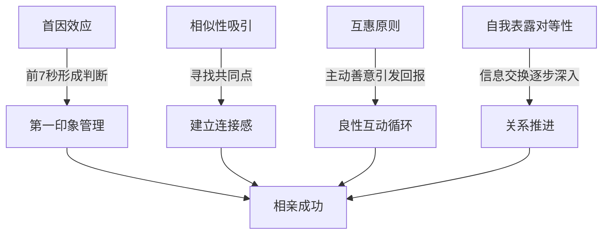
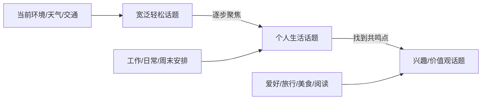
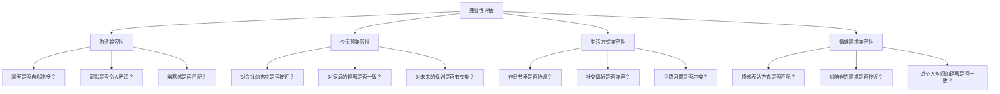

## 场景四：相亲场合

相亲是中国社会中一种历史悠久且持续活跃的社交形式。不同于自然相识的浪漫关系，相亲从一开始就被赋予了明确的"评估与被评估"属性，双方都带着预期和标准进入对话。这种特殊性决定了相亲场合的聊天既需要展现真实的自我，又需要掌握精准的节奏控制——既要推进了解，又不能显得急切；既要展示价值，又不能显得炫耀。

本节将从心理学原理出发，系统拆解相亲聊天的完整流程，覆盖从见面前的准备到后续跟进的全链条。

### 相亲聊天的心理学基础

#### 相亲场景的特殊性

相亲与普通社交有三个根本性差异：

**第一，预设框架不同。** 普通社交中，两个人可能从陌生人发展为朋友再发展为恋人，关系的升级是渐进的。而相亲从第一秒开始，双方就在心中进行"这个人是否适合作为伴侣"的评估。这种预设会让双方都更紧张，也更敏感于对方的每一个信号。

**第二，信息不对称更明显。** 介绍人通常会提前传递一些基本信息（年龄、职业、学历、家庭背景），这意味着双方在见面前就已经有了初步印象。聊天中需要注意：你传递的信息要与介绍人的描述一致，否则会引发不信任感。

**第三，社会评价压力更大。** 相亲失败不仅是两个人的事，还可能牵涉介绍人的面子、家里的期望。这种压力可能导致两种极端：一种是过度紧张导致表达失常，另一种是过度表演导致失真。

#### 影响相亲成功的核心心理机制

**首因效应（Primacy Effect）：** 心理学研究表明，人们对一个人的判断在见面的前7秒就基本形成。在相亲场景中，你的外在形象、表情、肢体语言在开口说话之前就已经在传递大量信息。因此，见面的第一印象管理比说什么话更重要。

**相似性吸引（Similarity-Attraction）：** 人们倾向于喜欢与自己相似的人。这不是要求你伪装成对方的样子，而是在聊天中主动寻找真实存在的共同点（价值观、兴趣、生活方式），并将其放大呈现。

**互惠原则（Reciprocity Principle）：** 当你对对方表示真诚的兴趣和善意时，对方倾向于回报同样的态度。主动问问题、认真倾听、给予积极反馈，这些行为会自然地激活对方的互惠本能。

**自我表露的对等性（Self-Disclosure Reciprocity）：** 研究表明，当一方进行适度的自我表露时，另一方也会倾向于表露同等级别的个人信息。这是相亲聊天中逐步深入的核心动力——你先分享一点，对方跟着分享一点，关系就在这种对等交换中自然推进。

### 见面前的准备工作

#### 信息收集与预期管理

在见面前，通过介绍人了解以下信息是必要的：

| 信息维度 | 了解目的 | 聊天应用 |
|---------|---------|---------|
| 基本职业 | 了解其生活节奏和社交圈 | 避免问已知信息，用"听说你是做XX的，一定很忙吧"代替"你是做什么的" |
| 兴趣爱好 | 寻找共同话题的切入点 | 提前准备2-3个相关话题 |
| 相亲经历 | 判断其心态（新手vs老手） | 新手要多引导，老手可能更务实 |
| 家庭情况 | 了解基本背景 | 除非对方主动提及，否则不要在第一次见面时深入 |
| 介意的雷点 | 提前规避 | 有明确偏好的人，触雷=出局 |

#### 心态调整

相亲中最容易犯的心态错误是"求职心态"——把自己放在被审视的位置，过度紧张地想要表现好。正确的应该是"交朋友心态"——我来认识一个新的人，聊得来就继续，聊不来也没关系。这种松弛感反而会让你表现得更自然、更有吸引力。

具体的心理建设方法：

- **降低预期但不降低标准。** 不要抱着"这次一定要成功"的心态，而是"来认识一个新的人"。但同时，你要清楚自己的底线和真正看重的品质。
- **接受不确定性。** 第一次见面不完美是正常的。你不需要在90分钟内让对方爱上你，只需要让对方觉得"这个人还不错，可以再接触看看"。
- **准备好最坏情况的应对。** 如果聊天冷场怎么办？如果对方明确表示不合适怎么办？提前想好应对方案，心理上就不会慌。

#### 外在准备

外在形象是首因效应的物质载体：

- **着装原则：** 干净整洁 > 时尚潮流。相亲不是时装秀，但邋遢是绝对的减分项。选择得体、舒适、符合场景的着装（咖啡厅见面对应smart casual）。
- **气味管理：** 清洁的身体气味比香水更重要。如果有口臭问题，提前嚼口香糖或使用漱口水。
- **时间管理：** 提前10-15分钟到达，既显示诚意，又有时间调整状态。迟到是相亲中的致命伤。

### 第一阶段：破冰（0-15分钟）

#### 开场白设计

开场白的核心目标是：打破陌生感，建立初步的舒适区。

**推荐策略一：环境切入法**

从当下的环境入手是最自然的破冰方式：

> "这家店你还满意吗？我之前看评价说他们的甜品不错，但咖啡一般般，所以特意提前来确认了一下——手冲确实还可以。"

这个开场白做了几件事：
1. 表达了你对这次见面的重视（特意提前来确认）
2. 展示了你的细心和考虑周到
3. 给出了一个轻松的话题（咖啡/甜品评价）
4. 没有给对方太大压力

**推荐策略二：适度赞美+话题转移法**

> "你好，我是陈明。你比照片上好看，我刚才差点不敢认——你是经常来这一带吗？附近有什么好吃的可以推荐吗？"

这个开场白的关键在于：赞美之后立刻转移话题，不给对方回应赞美的压力。如果对方停在赞美上，可能会感到尴尬或不知道怎么回应。

**推荐策略三：轻松自嘲法**

> "你好，我提前坦白——我有点紧张，因为我上一次相亲还是三年前的事。你看起来比我淡定多了。"

适度暴露自己的紧张感反而会让对方放下防备，因为这传递了真诚的信号。

**避免的开场方式：**

- ❌ 过度正式："您好，很高兴认识您，我是XXX，在XX公司工作。"——太像面试了。
- ❌ 过度油腻："哇，今天见到真人比照片还美十倍！"——过度赞美会适得其反。
- ❌ 沉默等待：双方都等着对方先开口，导致尴尬的冷场。
- ❌ 直奔主题："你对另一半有什么要求？"——太直接，缺乏铺垫。

#### 前15分钟的聊天框架

前15分钟的目标是完成"破冰→初步了解→建立舒适感"的三步过渡。推荐使用"漏斗式"话题推进：

**话题一：当前环境（2-3分钟）**
- "你过来方便吗？路上堵车吗？"
- "你之前来过这边吗？这一带最近开了好几家新店。"
- "今天天气真不错/真热/下雨了——你平时出门多吗？"

**话题二：日常生活（5-8分钟）**
- "你平时周末一般怎么安排？"
- "你上班的地方离这里远吗？每天通勤多久？"
- "最近有没有追什么剧/看什么电影？"

**话题三：兴趣爱好（5-8分钟）**
- "你平时有运动的习惯吗？"
- "你喜欢旅行吗？最近去过什么地方？"
- "你是一个喜欢热闹的人还是比较享受独处？"

### 第二阶段：深入了解（15-45分钟）

#### 深度话题的选择与推进

度过破冰期后，聊天应该从表面信息逐步过渡到更深层的了解。这个阶段的核心是"自然推进"——话题之间的过渡要流畅，不能跳跃。

**推荐话题递进路线：**

| 层级 | 话题类型 | 示例 | 目的 |
|-----|---------|------|------|
| 第一层 | 工作与事业 | "你当初为什么选择这个行业？" | 了解对方的价值取向和职业态度 |
| 第二层 | 生活方式 | "你觉得理想的一天应该是什么样的？" | 了解对方的日常节奏和生活追求 |
| 第三层 | 价值观初探 | "你觉得什么对你来说是最重要的？" | 了解对方的核心价值观 |
| 第四层 | 情感与关系观 | "你认为两个人在一起最重要的是什么？" | 了解对方对亲密关系的理解 |

#### 提问的艺术

相亲中的提问不是审讯，而是引导对方表达的方式。好的提问应该满足三个条件：**开放性**（不能用"是/否"回答）、**轻松性**（不涉及隐私敏感区）、**引导性**（能引发对方的思考和表达）。

**对比示例：**

- ❌ "你是做什么工作的？" → ✅ "你平时工作忙吗？一般几点下班？"（更生活化）
- ❌ "你有房吗？" → ✅ "你现在住哪个区？那边生活方便吗？"（间接了解）
- ❌ "你对婚姻怎么看？" → ✅ "你身边有结婚的朋友吗？你觉得他们的婚后生活怎么样？"（通过第三方引出观点）
- ❌ "你父母是做什么的？" → ✅ "你是跟家人一起住还是自己住？"（自然过渡到家庭话题）

**追问的技巧：**

当对方给出一个回答时，不要急着跳到下一个话题。用追问来展示你的倾听和兴趣：

> 对方："我最近在学瑜伽。"
>
> ❌ 一般回应："哦，挺好的。那你平时还做什么运动？"（急于换话题）
>
> ✅ 深度回应："真的？你是去健身房还是在家练？我之前试过一次，发现平衡感太差了，有些动作完全做不到。"（延伸话题+自我暴露+引发共鸣）

#### 倾听的深度实践

相亲中最被低估的技能是倾听。很多人在相亲时过于紧张于"我接下来要说什么"，反而忽略了对方正在说什么。

**积极倾听的四个层次：**

1. **表面倾听：** 听到对方说了什么。这是最基本的层次。
2. **理解倾听：** 理解对方为什么这么说。例如，对方说"我周末一般在家"，可能意味着她是内向型人格，也可能意味着她最近工作太累了需要休息。
3. **感受倾听：** 感知对方的情绪。对方在提到某个话题时是兴奋的、平淡的还是回避的？这些情绪信号比语言本身更有信息量。
4. **共情倾听：** 用自己的话复述对方的感受，让对方感到被理解。"听起来你最近确实挺忙的，是不是项目压力比较大？"

**倾听中的非语言信号：**

- 保持适度的眼神接触（60%-70%的时间），不要一直盯着看，也不要四处张望
- 适时点头，发出"嗯""是的""然后呢"等回应信号
- 身体微微前倾，表示对谈话内容感兴趣
- 避免看手机——如果必须看，先道歉说明原因

#### 分享的艺术

相亲不是单方面的提问和回答，你也需要适当地分享自己。分享的内容应该遵循"三层洋葱模型"：

- **外层（可分享）：** 兴趣爱好、工作内容、日常趣事、旅行经历
- **中层（适度分享）：** 职业规划、生活态度、对某些事物的看法
- **内层（谨慎分享）：** 家庭背景细节、过往感情经历、经济状况、身体状况

在第一次见面时，主要停留在外层和中层。如果对方主动分享了内层信息，你可以适度回应，但不需要同等深度地分享自己的内层信息。

**分享的注意事项：**

- 不要把分享变成独白。一次分享控制在2-3分钟以内，然后把话语权交还给对方。
- 分享要真实，但不需要展示所有面。相亲初期展示的是"经过筛选的真实"——真实的你有很多面，初期展示你最好的一面是合理的。
- 避免自吹自擂。与其说"我在公司很受器重"，不如说一个具体的工作趣事让对方自己判断。

### 第三阶段：关系评估与后续铺垫（45-90分钟）

#### 判断兼容性的信号

经过45分钟左右的聊天，你应该能够初步判断以下兼容性维度：

你不需要在第一次见面就获得所有答案，但你应该对"沟通兼容性"有初步判断——如果连天都聊不下去，其他维度的兼容性也就无从谈起。

#### 为后续见面埋下伏笔

如果你对对方有好感，聊天的最后阶段应该自然地为下次见面创造机会。关键是"自然"——不要突兀地提出约会邀请，而是将提议嵌入到当前的对话中。

**伏笔示例：**

> 对方提到喜欢看电影。
>
> ✅ "最近有一部XX电影口碑挺好的，我一直想去看但还没找到人一起。你有兴趣吗？"
>
> 对方提到喜欢某种食物。
>
> ✅ "我知道一家做这个特别好吃的店，在XX那边，环境也不错。下次有机会可以一起去试试。"
>
> 对方提到喜欢户外活动。
>
> ✅ "你有没有去过XX公园？那边秋天特别漂亮，适合散步。"

**伏笔的关键原则：**

- 要具体，不要模糊。"下次一起吃饭"不如"周六下午去XX那家店"有诚意。
- 要结合对方的兴趣，不要只从自己的角度出发。
- 要给对方留出拒绝的空间。"如果你有时间的话"比"我们一定要去"更得体。
- 不要在没有伏笔铺垫的情况下突然提出"我们下次什么时候见"——这会让对方感到压力。

#### 结束的方式

相亲的结束和开始一样重要。一个好的结尾应该做到：总结积极感受 + 表达继续了解的意愿 + 尊重对方的选择。

**推荐结束语：**

> "今天聊得挺开心的，时间过得比我想象的快。我送你到地铁站吧？路上注意安全，到家了给我发个消息。"

这个结尾做了几件事：
1. 表达了正面感受（"聊得挺开心的"）
2. 暗示了时间过得快=对方有吸引力
3. 展示了绅士风度（送对方到地铁站）
4. 为后续联系创造了自然理由（"到家了给我发消息"）

### 后续跟进策略

#### 当天跟进

见面结束后的2-3小时内，发一条消息：

> "今天聊得很愉快，回到家了吧？休息一下，改天再约。"

这条消息的目的：
1. 确认对方安全到家（关心的信号）
2. 再次表达正面感受（强化记忆）
3. 为后续聊天留入口

#### 保持联系的节奏

相亲后的联系节奏是很多人把握不好的。过于频繁会显得急切，过于稀疏会让对方觉得你不感兴趣。

**推荐节奏：**

| 时间段 | 联系频率 | 内容方向 |
|-------|---------|---------|
| 第1-3天 | 每天1-2次 | 简单问候+延续见面时的话题 |
| 第4-7天 | 每天1次 | 分享日常+了解对方近况 |
| 第2周 | 每1-2天 | 深入话题+规划下次见面 |
| 第3周起 | 根据互动质量调整 | 如果互动良好，可以增加频率 |

#### 聊天中的常见模式

**模式一：日常分享型**

> "今天中午吃了一家新开的川菜馆，味道出乎意料地好。你中午吃了什么？"

这种模式适合在相亲后的初期阶段使用，通过日常分享保持联系感。

**模式二：延续话题型**

> "上次你说在看XX那本书，看到哪里了？我今天正好也翻了一下，发现第一章就很有意思。"

这种模式展示了你记住了对方说的话（认真倾听的证据），也创造了一个持续的话题线索。

**模式三：共同体验型**

> "我今天去了上次提到的那家茶馆，给你看看环境（发送照片）。下次我们一起去，他们家有几款茶你肯定会喜欢。"

这种模式通过分享实际体验来增强下次见面的吸引力。

### 相亲聊天中的常见误区

#### 误区一：查户口式提问

**表现：** 连续抛出"你多大？""你哪里人？""你做什么工作？""你一个月挣多少？"这类封闭式问题，让对方感觉自己在接受审查。

**纠正方法：** 将封闭式问题转化为开放式对话。不要问"你哪里人"，而是在聊天中自然引出："你说话带一点南方口音，你老家是南方的吗？"不要问"你一个月挣多少"，而是在了解工作后自然判断。

#### 误区二：过早暴露目的性

**表现：** 第一次见面就开始讨论"你对彩礼怎么看""你打算什么时候结婚""你想要几个孩子"。

**纠正方法：** 第一次见面的目的是"评估沟通兼容性和初步好感"，不是"敲定婚事"。这些话题可以在后续的接触中逐步涉及。如果你确实需要了解对方的婚育观念，可以用间接的方式："你觉得身边朋友结婚之后生活变化大吗？"

#### 误区三：过度展示自己

**表现：** 不断谈论自己的成就、收入、人脉，甚至开始吹嘘。

**纠正方法：** 用"展示"代替"陈述"。与其说"我年薪百万"，不如聊天中自然流露出你对工作的热情和专业度，让对方自己形成"这个人事业心很强"的印象。展示比陈述更有说服力，也更不容易让人反感。

#### 误区四：只顾自己说，不听对方说

**表现：** 对方在说话时，你在想自己接下来要说什么，或者直接打断对方。

**纠正方法：** 强迫自己在对方说完后停顿3秒再回应。这3秒不仅让你有机会消化对方的内容，还会让对方觉得你在认真思考他说的话。

#### 误区五：冷场后不知如何救场

**表现：** 聊天突然中断，双方都陷入沉默，气氛变得尴尬。

**纠正方法：** 提前准备3-5个"救场话题"。这些话题应该是：轻松的、与当前环境相关的、不需要对方有特定背景知识就能聊的。

**救场话题示例：**

- "对了，你最近有没有看到什么有意思的新闻/视频？"
- "你有没有什么推荐的餐厅？我最近想多尝试一些新地方。"
- "你会做饭吗？我最近在学，但厨艺还在初级阶段。"
- "你有没有养宠物？我一直想养一只猫。"

#### 误区六：过早讨论前任

**表现：** 主动提起自己的前任，或者追问对方的感情经历。

**纠正方法：** 除非对方主动且详细地分享，否则第一次见面不主动提及前任。如果被问到，简短带过："之前有过一段感情，但不太合适就分开了。我觉得两个人在一起还是需要很多方面的契合。"然后自然转移到其他话题。

### 特殊情况的应对策略

#### 情况一：对方明显不感兴趣

**信号：** 回答简短（"嗯""还行""没什么"）、频繁看手机、身体后倾或侧向、回避眼神接触。

**应对：** 不要试图强行挽救。可以礼貌地缩短见面时间："今天认识你很高兴。我一会儿还有点事，要不我们先聊到这里？"保持体面地结束比尴尬地拖延更好。

#### 情况二：对方过度紧张

**信号：** 说话结巴、手不知道往哪放、回答过于正式、不敢看你的眼睛。

**应对：** 主动降低聊天的"正式感"。可以适当自嘲来打破僵局："我其实也有点紧张，今天出门前换了三套衣服。"或者用轻松的话题转移注意力："你有没有养过宠物？我跟你说个关于我朋友家猫的趣事……"

#### 情况三：聊天内容与介绍人信息不符

**信号：** 对方描述的工作、年龄、学历等与介绍人提供的信息有出入。

**应对：** 不要当场质疑或揭穿。记下差异，事后再与介绍人确认。如果差异只是细节上的（比如具体职位不同），可能只是介绍人描述不准确。如果差异涉及核心信息（比如年龄、婚史），需要认真对待。

#### 情况四：遇到价值观冲突

**信号：** 对方表达了一些你强烈不认同的观点（比如对某些群体的偏见、极端的消费观等）。

**应对：** 不需要当场争论，但也不要违心附和。可以中性地回应："每个人看法不太一样，这个话题挺复杂的。"然后转向其他话题。事后再认真评估这些价值观差异是否是你可以接受的。

### 不同性格类型的应对策略

#### 应对内向型相亲对象

内向型的人在相亲中通常表现得安静、说话少、需要时间思考。这不是不感兴趣，而是他们的能量获取方式不同。

**策略：**
- 给对方足够的思考时间，不要催促回答
- 选择安静、私密性好的场所（咖啡厅角落、安静的餐厅）
- 多用一对一的深度话题，避免需要"表演"的话题
- 可以适当多承担一些话题引导的责任，但要留出对方表达的空间
- 如果对方对某个话题眼睛亮了，说明找到了他们的兴趣点，可以深入

#### 应对外向型相亲对象

外向型的人通常话多、表达丰富、喜欢互动。但他们也可能因为"社交状态"而让你分不清这是真实状态还是表演。

**策略：**
- 注意倾听，外向型的人容易变成独角戏，你需要适时引导回双向互动
- 观察他们在不同话题上的反应差异——真正感兴趣的vs只是在社交性回应的
- 可以挑战性地提出不同观点，外向型的人通常不排斥有内容的讨论
- 注意从他们的大量信息中筛选出真正有价值的判断依据

#### 应对务实型相亲对象

务实型的人通常直奔主题，关心具体的条件和匹配度，不太擅长或不屑于"聊闲天"。

**策略：**
- 不要绕太多弯子，他们会觉得浪费时间
- 准备好回答关于工作、收入、住房、家庭等具体问题
- 但同时可以引导他们聊聊非条件类的话题："除了这些硬件条件，你更看重两个人相处时的什么感觉？"
- 这类人通常比较看重行动而非语言，后续跟进时用实际行动展示诚意

### 相亲聊天的进阶技巧

#### 幽默的运用

幽默是相亲中的高级武器——用好了可以让对方对你产生好感，用砸了可能直接出局。

**安全幽默类型：**

- **自嘲式幽默：** 拿自己开玩笑，不伤害任何人。"我做饭的水平大概就是泡面可以泡得比别人好一点。"
- **观察式幽默：** 对当下环境的有趣观察。"你看隔壁桌那对情侣，两个人各玩各的手机，这大概就是现代爱情的样子。"
- **故事式幽默：** 分享一个生活中的趣事。"上周我朋友给我介绍了一只猫，结果那只猫看我一眼就走了，对我完全不感兴趣——比今天的你冷漠多了。"（慎用，需要判断对方性格）

**危险幽默类型（避免）：**

- ❌ 涉及性别、地域、种族的"笑话"
- ❌ 贬低前任的幽默
- ❌ 过于低俗或黄色的笑话
- ❌ 嘲笑对方的外貌、口音、习惯

#### 制造记忆点

相亲后，对方可能同时见了多个人。你需要制造一两个"记忆点"，让对方在想起你时有一个具体的画面。

**方法：**

- **独特的观点：** 在某个话题上给出一个有深度、有独特性的见解，而不是人云亦云。
- **故事化表达：** 与其说"我喜欢旅行"，不如讲一个旅行中的具体故事。"有一次我在XX古镇迷了路，结果意外发现了一家百年老店的豆腐脑，那是我吃过最好吃的。"
- **感官化描述：** 让对方能"看到""听到""闻到"你描述的场景。"那家咖啡馆有一面墙全是旧唱片，放着爵士乐，阳光从落地窗照进来，整个下午都特别舒服。"

#### 情绪共鸣的建立

相亲中的聊天不应该只是信息交换，还应该是情绪交换。你需要在对话中创造情绪的起伏——有轻松的部分、有认真的部分、有感动的部分。

**示范：**

> "我之前工作特别忙的时候，有一天晚上加班到十一点，回到家发现我妈给我发了一条很长的微信，说'不要太累了，身体最重要'。当时看着看着就有点想哭。从那以后我就告诉自己，不管工作多忙，每周至少要给家里打一个电话。"

这段分享包含了：经历→情感→反思→行动。这种结构化的自我表露既展示了你的情感深度，又展示了你的价值观，而且容易引发对方的共鸣。

### 场景完整对话示范

#### 示范一：咖啡厅初次见面

**背景设定：** 男方28岁，软件工程师；女方26岁，市场策划。通过共同朋友介绍。

---

**你：**（提前到达，对方进来时起身微笑）"你好，我是陈明。路上还顺利吧？"

**对方：** "嗯，挺顺利的。你等很久了吗？"

**你：** "没有，我也是刚到。我提前踩了个点，试了一下他们的手冲，味道还行。你平时喝咖啡还是喝茶？"

**对方：** "我更喜欢喝茶，咖啡喝多了容易失眠。"

**你：** "那你来对了，这家店的茶饮其实更有特色。我上次来点了一杯白桃乌龙，味道很清爽。你可以试试。"（推荐具体的东西，展示关注细节）

**对方：** "好，那我点一杯试试。"

**你：** "对了，听小王说你是做市场策划的？平时应该挺忙的吧？"

**对方：** "还好，忙的时候确实很忙，但也有清闲的时候。最近刚好在忙一个新品上市的项目。"

**你：** "新品上市挺有意思的。我虽然做技术，但对营销挺感兴趣的——我之前看过一本书叫《定位》，里面很多案例让我大开眼界。你做这行应该比书里写的还精彩吧？"（展示跨界兴趣+对对方行业的尊重）

**对方：**（眼睛亮了一下）"你看过《定位》？那本书确实是经典。你做技术怎么会看这种书？"

**你：** "说实话是因为我以前觉得技术好就行了，后来发现产品做出来没人知道也白搭。所以开始补营销的课。你做了多久了？"

**对方：** "四年了。我大学学的就是市场营销，毕业后一直在做。"

**你：** "四年了，那你肯定很有经验了。你有没有遇到过那种产品其实很好但就是推不动的情况？"

**对方：** "有啊，太多了。有一次我们做了一个特别好的护肤品，成分和效果都很好，但就是定价出了问题……"

（对话自然深入，从工作延伸到生活）

**你：** "说到护肤品，你平时有护肤的习惯吗？我现在就洗个脸抹个防晒，感觉太粗糙了。"

**对方：** "我也是精简护肤，不太喜欢搞太多步骤。"

**你：** "那我们倒是挺一致的。不过我最近发现一个问题，周末在家的时候完全没有护肤的动力，穿着睡衣就想赖一天。你周末一般怎么过？"

**对方：** "我也是！周末就是充电时间，可能会在家看看书，或者约朋友出去逛逛。"

**你：** "你平时看什么类型的书？"

**对方：** "我比较喜欢看心理学类的，最近在看《被讨厌的勇气》。"

**你：** "阿德勒！我特别喜欢他关于'课题分离'的概念——别人怎么评价你是别人的课题，你只需要做好自己的课题。这个观点帮我想通了很多事情。"（展示深度思考）

**对方：** "你理解得挺深的。我是在处理职场人际关系的时候特别有感触。"

（聊天继续，自然过渡到后续话题）

**你：** "今天聊得挺开心的，感觉时间过得很快。你接下来有安排吗？要不我送你到地铁站？"

**对方：** "好啊，谢谢你。"

**你：** "对了，下次如果你有空，我知道一家茶馆环境特别好，有很多少见的茶种，你肯定会喜欢。到时候带你去。"

**对方：** "好呀，听起来不错。"

---

**这段对话的技巧拆解：**

| 对话节点 | 使用技巧 | 效果 |
|---------|---------|------|
| 开场 | 环境切入+关心到达 | 打破陌生感，展示体贴 |
| 茶饮推荐 | 具体推荐+展示了解 | 细心、有主见 |
| 工作话题 | 引用书籍+提问 | 展示知识面+尊重对方专业 |
| 深入追问 | 开放式问题 | 引导对方分享更多 |
| 生活话题 | 自嘲+自然过渡 | 轻松感+找到共同点 |
| 读书话题 | 引用具体概念 | 展示思考深度 |
| 结尾 | 表达感受+后续铺垫 | 正面强化+创造机会 |

#### 示范二：应对冷场和尴尬

**场景：** 聊天进行到20分钟时突然冷场。

---

**（沉默3秒）**

**你：** "对了，我突然想起来一个有意思的事——你知道今天出门之前发生了什么吗？我妈给我打了三个电话，分别嘱咐了三件不同的事。我怀疑她比我还紧张。"（自嘲式破冰）

**对方：**（笑）"我妈也是，早上还给我发了一条微信，说什么'要穿好看点'。"

**你：** "看来咱妈可以组一个'相亲后援团'了。你家催得厉害吗？"

**对方：** "还好，偶尔提一下，不会太逼我。"

**你：** "那挺好的，我爸妈最近也不催了——可能是对我放弃了。"（继续自嘲）

**对方：** "不会啦，你条件挺好的，应该不缺介绍。"

**你：** "谢谢安慰。其实我觉得相亲也没什么不好，至少目标明确，不用猜来猜去。你之前有通过这种方式认识过朋友吗？"

（话题自然重启）

---

### 相亲场合的差异化策略

#### 年龄段差异

| 年龄段 | 心态特点 | 聊天策略 |
|-------|---------|---------|
| 22-25岁 | 更看重感觉，条件导向弱 | 多聊兴趣、生活方式、对未来的憧憬 |
| 26-29岁 | 开始认真，条件和感觉并重 | 平衡感性话题和理性话题 |
| 30-35岁 | 高度务实，时间成本意识强 | 适度直奔主题，但保留温度 |
| 35岁以上 | 极度务实，可能经历较多 | 尊重对方经历，避免评判，快速判断兼容性 |

#### 场景差异

**咖啡厅/茶馆：** 最经典的相亲场景。适合深度对话，但时间不宜过长（1.5-2小时为宜）。环境安静，适合认真了解对方。

**餐厅：** 适合在已有初步了解后的第二次或第三次见面。第一次见面选餐厅的风险是：如果聊不来，一顿饭的时间太长，双方都会尴尬。

**公园/步行街：** 适合性格外向、不拘小节的人。边走边聊可以减少面对面的压迫感，但如果天气不好或者对方穿了高跟鞋，可能适得其反。

**商场/展览：** 可以通过观察对方对不同事物的反应来了解其品味和性格。但缺点是环境嘈杂，不利于深度对话。

### 男性视角的特别提醒

1. **主动但不强势。** 主动发起聊天、主动提议活动、主动买单，但不要替对方做决定。"你想喝点什么？"比"我帮你点一杯美式"更好。
2. **注意细节。** 为对方拉椅子、递纸巾、注意对方杯子是否空了——这些小动作比甜言蜜语更有说服力。
3. **不要急于展示经济实力。** 提到收入、房产、车子的时机要把握好。如果对方没有问，不需要主动提及。如果要展示，最好通过故事间接传递，而不是直接陈述数据。
4. **尊重对方的节奏。** 不要急于推进关系。对方如果对你有好感，会在言行中有所体现；如果没有明确信号，不要强行表白或索要承诺。

### 女性视角的特别提醒

1. **适度回应对方的热情。** 如果你对对方有好感，不要全程冷淡。适度的积极回应（微笑、追问、主动分享）会让对方更有信心。
2. **保持真实。** 不需要为了迎合对方而伪装自己的兴趣。如果你不喜欢运动，不需要假装喜欢。真实的不匹配比虚假的匹配更有价值。
3. **观察行动而非语言。** 相亲中说漂亮话很容易，但行动更能反映一个人的真实状态。他是否准时到达？是否注意你的需求？是否尊重服务员？这些细节比"我年薪多少"更有信息量。
4. **相信直觉但要理性验证。** 如果见面时感到不舒服，不需要强迫自己继续。但如果只是"没有心动的感觉"，可以考虑给第二次机会——很多幸福的婚姻都不是一见钟情的结果。

### 总结

相亲场合的聊天，本质上是在有限的时间内，通过高效的沟通来评估两个人的兼容性。它既是一种社交技能，也是一种自我认知的过程——你在了解对方的同时，也在更深入地了解自己真正想要什么样的伴侣。

核心要记住的原则：

- **真实是最大的技巧。** 所有的技巧都建立在真实的基础上。一个真实的、有温度的、缺点明显但坦诚的人，比一个表演完美但让人感到不真实的人更有吸引力。
- **节奏比内容更重要。** 相亲聊天不在于你说了什么惊天动地的话，而在于你能否把握好"舒适→了解→深入→连接"的节奏。
- **好的相亲是双向选择。** 不要只想着"对方是否喜欢我"，也要认真评估"我是否喜欢对方"。带着平等的心态去认识一个人，反而会让你表现得更好。
- **一次见面只是一个开始。** 不要期望在一次见面中解决所有问题。如果双方都感觉"还不错"，那就是一个成功的相亲。
