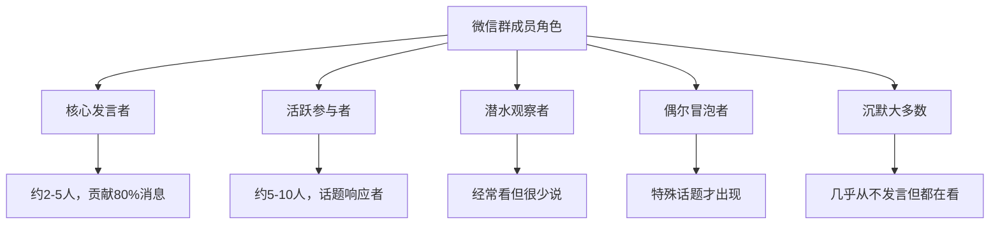

## 场景五：微信群聊

微信群聊是中国社交生态中最独特的沟通场景——它既不是一对一对话，也不是公开演讲，而是一种"半公开的群体对话"。在微信群里，你的每一句话都同时面对多个听众，既有熟悉的朋友，也有陌生的群友；既要表达自我，又要顾及群体氛围。掌握微信群聊的艺术，本质上是在学习如何在群体中建立个人影响力。

### 一、微信群聊的社交本质

#### 1.1 群聊与一对一对话的根本区别

微信群聊和私聊在社交逻辑上有本质差异：

| 维度 | 一对一对话 | 微信群聊 |
|------|-----------|---------|
| 听众数量 | 1人，明确 | 多人，部分沉默 |
| 互动模式 | 双向交替 | 多向并行 |
| 注意力 | 对方专注听你 | 注意力被多人分散 |
| 沉默成本 | 尴尬，需要回应 | 无人注意，随时可退 |
| 社交货币 | 信息交换即可 | 需要"表演性"价值 |
| 回复压力 | 高（不回显得不礼貌） | 低（不回完全正常） |
| 内容传播 | 私密 | 可能被截图转发 |

理解这些差异，才能调整在群聊中的行为策略。群聊的本质是一种**"社交舞台"**——你在说话，但同时也在被观察、被评价、被记住。

#### 1.2 群聊中的社交动力学

一个微信群里，成员的角色可以分为以下几类：

关键洞察：**沉默的大多数并不是不存在**。他们虽然不发言，但会阅读每一条消息，形成对你的印象。群聊中真正影响你社交形象的，不只是和你互动的人，更是那些在暗中观察的沉默者。

#### 1.3 群聊的"社交货币"机制

在群聊中，能获得认可的"社交货币"主要有五种：

- **信息货币**：分享别人不知道的有用信息（行业动态、优惠信息、实用工具）
- **幽默货币**：让人开心的能力（恰到好处的段子、机智的回应）
- **连接货币**：把需要认识的人牵线搭桥（"这个问题XX很专业，我拉他进来说"）
- **观点货币**：独到且有深度的见解（不是跟风，而是有独立思考）
- **情绪货币**：在合适的时候给予支持和共鸣（"完全理解你的感受"）

一个在群聊中有影响力的人，通常是持续输出以上一种或多种货币的人。

### 二、微信群聊的核心策略

#### 2.1 话题参与策略：选择正确的时机和方式

不是每个话题都值得参与，也不是每条消息都需要回复。判断是否参与一个话题，可以用"三问筛选法"：

1. **我有实质性的内容可以贡献吗？**（不是"我也觉得"这种附和）
2. **这个话题和我的身份/专长匹配吗？**（专业人士评论专业话题更有分量）
3. **现在参与是否自然？**（话题已经过了高潮期就别再翻出来了）

**参与话题的五种方式：**

| 方式 | 适用场景 | 示例 |
|------|---------|------|
| 补充信息 | 你恰好知道更多细节 | "补充一个信息，这个政策下个月开始执行" |
| 分享体验 | 话题涉及你的亲身经历 | "我去年去过，确实值得推荐，但建议避开节假日" |
| 提出问题 | 好奇心驱动，引出更多讨论 | "你们有没有遇到过XX的情况？" |
| 幽默回应 | 气氛轻松时增加趣味 | 用表情包或谐音梗接住话题 |
| 总结提炼 | 讨论比较分散时做收束 | "大家说了这么多，核心其实就两点……" |

#### 2.2 发言节奏：控制你在群里的"存在感"

群聊中最常见的错误不是说错话，而是**发言频率失控**。以下是一个经过验证的节奏框架：

**黄金比例原则**——在一个活跃的群聊中：

- 作为普通成员：每10-15条消息中出现1-2次
- 作为活跃成员：每5-8条消息中出现1次
- 在自己发起的话题中：正常回应，但话题热度下降后主动让出空间

**连续发言的"三条红线"：**

1. 连续发3条以上未被回应的消息 → 停止，等待
2. 一个话题中你的发言超过总发言量的50% → 后退，让别人参与
3. 5分钟内连续发了5条以上 → 群友可能已经在心里给你贴上"话痨"标签

#### 2.3 价值输出策略：成为群里的"有用的人"

在群聊中建立长期影响力的核心方法是：**持续提供价值，而非刷存在感**。

具体做法：

- **成为某个领域的信息源**：如果你是程序员，在技术群里分享最新的框架动态；如果你是宝妈，在育儿群里分享靠谱的育儿知识
- **主动帮助新人**：当有人在群里问问题，而你恰好知道答案，给出详细、有耐心的回答
- **做群里的"连接器"**：当A在找资源、B恰好有这个资源时，主动搭桥
- **定期分享独家信息**：你参加了一个行业会议，回来后在群里分享核心要点

### 三、典型场景对话示范

#### 3.1 场景一：热点话题讨论

**场景**：50多人的兴趣小组微信群，有人分享了一条关于最近热门电影的讨论。

**群友A：** "有人看了《流浪地球3》吗？感觉怎么样？"

**你：** "昨天刚看的，特效确实炸裂！不过我觉得剧情比前两部更有深度了。有几个镜头的构图特别有寓意——月球坠落那段用了大量对称构图，暗示人类和AI的命运纠缠。你们觉得呢？"

**群友B：** "我还没看，值得去电影院看吗？"

**你：** "强烈推荐IMAX版本，太空场景的视觉效果太震撼了。如果只是想看剧情的话，普通厅也行，但太空电梯那段在IMAX上的沉浸感完全不一样。建议工作日去，周末人太多。"

**群友C：** "我看了，觉得刘德华那段演得特别好。"

**你：** "对对对，那段我差点看哭了。他那个角色的牺牲精神拍得很克制，没有刻意煽情，反而更打动人。导演在那段用了大量的留白和沉默，比喊口号强一百倍。"

**技巧解析：**

- **"昨天刚看的"**——用时间锚点建立可信度，暗示你的信息是最新的
- **"有几个镜头的构图"**——不是泛泛说"好看"，而是给出具体的专业观察，体现你的审美深度
- **"你们觉得呢？"**——以提问结尾，把话语权交还给群体，避免独白
- **"建议工作日去"**——提供超越话题本身的实用信息，增加价值密度
- **"比喊口号强一百倍"**——有立场、有态度，不是和稀泥

#### 3.2 场景二：新人入群

**场景**：一个新朋友被拉入群，群主发了欢迎消息。

**群主：** "欢迎小李加入，他是做UI设计的@小李"

**普通回应：** "欢迎欢迎"（平淡无奇，没有记忆点）

**高水平回应：** "欢迎小李！UI设计的大佬，正好我最近在纠结一个App的配色方案，回头可以请教一下。群里氛围很好的，有问题随时问~"

**技巧解析：**

- **"正好我最近在纠结"**——用一个具体的事由让欢迎变得自然，不是客套
- **"回头可以请教"**——暗示未来会有互动，降低新人的社交压力
- **"群里氛围很好的"**——帮助新人快速融入，展现你作为群成员的主人翁意识

#### 3.3 场景三：有人在群里求助

**场景**：群友在群里问了一个技术问题。

**群友D：** "有没有人懂Python的？我这段代码老是报错，卡了两天了。"

**差的回应：** "什么错误？贴代码看看"（虽然正确但过于冷淡）

**好的回应：** "说说看，什么报错信息？把代码片段和错误截图发出来，群里好几个Python高手呢，应该能帮你搞定。"

**更好的回应（如果你确实能帮）：** "我来看看。把报错信息和相关代码贴一下？Python的报错信息一般都在最后几行，重点关注`Traceback`下面的内容。另外说一下你用的Python版本和操作系统，排查起来更快。"

**技巧解析：**

- **"说说看"**——口语化，亲切
- **"群里好几个Python高手呢"**——把个人帮助升级为群体支持，降低求助者的心理负担
- **给出具体的指导**——不只是"贴代码"，而是告诉对方怎么有效地求助，帮他提升求助效率

#### 3.4 场景四：群聊中出现争论

**场景**：两位群友因为某个观点产生了分歧，气氛开始紧张。

**群友E：** "我觉得996就是资本家的剥削，没什么好洗的。"

**群友F：** "你这就是站着说话不腰疼，创业公司不拼怎么活？"

**群友E：** "拼可以，但不能强制啊，加班费都不给算什么？"

**错误介入方式：** 选边站队，或者强行当裁判说"你们都对"。

**正确的介入方式：**

"说到这个话题，我想到一个有意思的数据——之前看过一个报告，说长期996的团队，第三年的离职率是正常工时团队的3倍，算下来招聘和培训成本反而更高。所以其实核心问题不是'要不要拼'，而是'怎么拼更有效'。我之前待过一个团队，用OKR管理之后效率提升了40%，反而不用加班了。"

**技巧解析：**

- **"说到这个话题"**——自然过渡，不突兀
- **"我想到一个有意思的数据"**——用事实和数据代替情绪化的立场表达
- **"核心问题不是……而是……"**——重构讨论框架，把争论从"对错"引向"方法"
- **分享个人经历**——用故事代替说教，更容易被接受
- 不直接评判任何一方，但通过提供新视角来化解对立

#### 3.5 场景五：群里有人分享成就

**场景**：群友在群里分享了一个好消息。

**群友G：** "终于拿到PMP证书了！准备了三个月，今天查到成绩过了！"

**差的回应：** "恭喜恭喜"（敷衍）

**好的回应：** "恭喜！PMP不简单啊，三个月能过说明你下了狠功夫。考完之后打算往项目管理方向发展吗？还是就当一个加分项？"

**更好的回应：** "恭喜！PMP的通过率据说只有60%左右，三个月备考能过真的很强。你之前是在哪学的？我有个同事也想考，正好可以参考一下你的经验。"

**技巧解析：**

- **提到具体数据（通过率）**——说明你了解这个领域的背景，不是随口恭喜
- **提一个相关问题**——把"恭喜"升级为"对话"，给对方展开分享的机会
- **"我有个同事也想考"**——把对方的成就转化为实际价值，让对方感到被需要

### 四、不同类型群聊的差异化策略

不同类型的微信群，社交规则和策略差异巨大。以下是针对常见群类型的专项建议：

#### 4.1 工作群

**核心原则**：专业、高效、边界清晰

- 发言围绕工作内容，避免闲聊
- 回复要具体，不要只发"收到"或"好的"（至少说明你理解了什么、下一步做什么）
- 重要信息发完后确认对方是否收到
- 避免在工作群发表情包（除非团队文化允许）
- 下班后非紧急事务不要@人
- 汇报工作用"结论先行"原则

**工作群汇报模板：**

【项目进度更新】XX项目
✅ 已完成：A、B、C三个模块的开发
🔄 进行中：D模块，预计周三完成
⚠️ 阻塞：E模块依赖第三方接口，已催促，对方承诺周五前给
📋 下周计划：……

#### 4.2 亲友群

**核心原则**：温情、耐心、适度参与

- 长辈转发的内容不要当面辟谣打脸（私下沟通更合适）
- 重要的家庭通知要及时回复确认
- 逢年过节主动发祝福和红包
- 不在亲友群中传播负能量
- 对长辈的"养生文章"保持包容，必要时私聊善意提醒

#### 4.3 兴趣群（读书、跑步、摄影等）

**核心原则**：分享干货、参与活动、建立专业形象

- 分享与兴趣相关的内容（作品、心得、资源）
- 积极参与群内组织的活动（打卡、分享会、线下聚会）
- 对新人的问题保持耐心
- 不要过度推销自己的产品或服务
- 尊重群内已有的文化传统

#### 4.4 行业交流群

**核心原则**：输出价值、建立连接、保持谦逊

- 分享有价值的行业洞察而非水文
- 别人分享的内容要认真回应，不是点赞了事
- 引荐资源时注意双方意愿
- 不要频繁发广告或自我宣传
- 有争议时就事论事，不人身攻击

#### 4.5 社区/小区群

**核心原则**：务实、友善、就事论事

- 物业通知、停水停电等信息及时确认
- 邻里之间的问题（噪音、停车）先私聊解决，不在群里公开对峙
- 有好的社区建议可以礼貌提出
- 不在群里发过度个人化的内容

### 五、微信群聊的高阶技巧

#### 5.1 "场景一"开场法

当你想在群里发起一个话题但不知道怎么开口时，用"场景+问题"的结构：

- ❌ "大家觉得XXX怎么样？"（太宽泛，不知道怎么回答）
- ✅ "昨天在地铁上看到一件事，想听听大家的看法——一个妈妈带小孩坐地铁，小孩一直踢前面的座位，妈妈也不管。旁边一个大哥忍不住说了，结果妈妈反而发火了。你们怎么看？"

具体场景比抽象问题更容易引发讨论，因为它给了参与者一个具体的切入点。

#### 5.2 "三明治"表达法

当你在群聊中需要表达不同意见时，用"认同+补充+提问"的三明治结构：

认同层："你说的XX确实有道理"
补充层："不过我注意到一个角度……"
提问层："你怎么看这个情况？"

这样既表达了自己的观点，又不会让对方感到被否定，同时保持了对话的开放性。

#### 5.3 资源"钩子"分享法

在群里分享资源时，不要直接甩链接，而是先给一个"钩子"：

- ❌ 直接发一个链接，什么也不说
- ❌ "推荐一篇文章"（太模糊）
- ✅ "刚看到一篇关于XX的文章，里面提到一个数据挺颠覆的——XX竟然只有XX%。链接在这里，感兴趣的可以看看。"

先抛出一个有吸引力的信息点，让别人有理由点开你的链接。

#### 5.4 话题"升温"与"降温"技巧

**升温**——当你希望一个话题得到更多讨论时：

- @特定的群友："@小王 你之前不是做过这个吗？分享一下？"
- 抛出一个有争议性的子话题："不过这里有个争议点……"
- 分享一个相关的对比案例

**降温**——当一个话题开始失控或变得尴尬时：

- 用一个轻松的评论做自然过渡："哈哈这个话题聊得太深了，说点轻松的——今天周五了，大家周末有什么计划？"
- 不再回复相关消息（沉默是最好的降温方式）
- 私聊解决可能的冲突

#### 5.5 群聊中的"社交锚点"策略

在群聊中建立影响力，不需要每条消息都精彩，而是需要几个"锚点"式的高光时刻：

- **知识锚点**：在某个话题上展示过专业深度，之后别人遇到相关问题会@你
- **幽默锚点**：某次群聊中说了一句特别好笑的话，成为群里的"梗"
- **帮忙锚点**：帮过群里某个人解决了一个棘手问题，建立了"靠谱"的口碑
- **连接锚点**：成功地帮两个人牵线搭桥，成为群里的"枢纽"

一个有3-5个锚点的人，在群里的社交地位就稳固了。

### 六、微信群聊的常见误区

#### 误区一：把群聊当私聊

**错误表现**：在500人的大群里讨论私人事务，或者长篇大论地倾诉个人问题。

**纠正方法**：群聊是公共空间，内容要对大多数人有价值。私人话题请移步私聊。如果不确定内容是否适合群聊，问自己："如果这段话被截图发到朋友圈，我会有问题吗？"

#### 误区二：只发"嗯""哦""好的"

**错误表现**：对别人精心分享的内容只回复一个字。

**纠正方法**：要么认真回应，要么不回应。一个字的回复比不回复更让人不舒服——它传达的信息是"我看到了，但懒得搭理你"。如果你真的觉得内容好，至少说一句具体好在哪里。

#### 误区三：频繁@所有人

**错误表现**：把自己的广告、投票链接、求赞等@所有人。

**纠正方法**：@所有人是群主/管理员的通知工具，不是个人的扩音器。除非你是群主且有重要通知，否则不要使用。普通成员想引起注意，可以在消息开头写"@"然后加上你想通知的人。

#### 误区四：在群里"教育"别人

**错误表现**：别人分享了一个观点，你长篇大论地"纠正"，甚至附上论文链接"证明"对方是错的。

**纠正方法**：群聊不是辩论赛。即使对方说的不完全对，除非涉及重大事实错误（比如医疗健康类的谣言），否则不必纠正。如果确实需要表达不同看法，用"我理解你的角度，我之前看到另一种说法……"的方式，而不是"你说的不对"。

#### 误区五：表情包轰炸

**错误表现**：对每条消息都回一个表情包，或者连续发多个表情包。

**纠正方法**：表情包是调味品，不是主菜。一个好的表情包可以在恰当的时候增加趣味，但过多的表情包会让别人觉得你没有实质内容可说。建议每5-10条文字消息搭配1-2个表情包。

#### 误区六：只在需要帮助时才出现

**错误表现**：长期潜水，只有在自己需要投票、砍价、求推荐的时候才发言。

**纠正方法**：社交是互惠的。如果你只在需要帮助时出现，别人会形成"这个人只索取不付出"的印象。平时多参与讨论、多帮别人，到了你需要帮助的时候才会有人响应。

### 七、实战练习

#### 练习一：观察学习

选择你最活跃的一个微信群，花一周时间观察以下内容，记录在笔记本上：

- 群里最受欢迎的3个人分别有什么特点？他们是怎么说话的？
- 哪些话题最容易引发讨论？哪些话题总是冷场？
- 群里的"社交规则"是什么？（比如是否允许发广告、是否鼓励开玩笑）
- 你的发言频率和群里的核心发言者相比如何？

#### 练习二：价值输出

本周在群里完成以下任务（选择一个你最不常做的）：

- 分享一篇你认为对群友有价值的文章，附上你的简短点评
- 帮一个新人回答一个问题，给出详细且有耐心的解答
- 在一个讨论中提出一个别人没有考虑到的角度
- 为两个互不认识但可能互相需要的群友搭桥

#### 练习三：话术改写

把以下"低效"的群聊回复改写成"高效"版本：

| 低效版本 | 高效改写方向 |
|---------|-------------|
| "恭喜恭喜" | 具体提及成就+后续问题 |
| "推荐一部电影" | 电影名+亮点+推荐理由+一句话钩子 |
| "我也是" | 共鸣+补充个人独特经历 |
| "不错不错" | 哪里不错+为什么不错+关联感受 |
| "有人知道XXX吗？" | 具体描述问题+已经尝试过什么+期望什么样的帮助 |

### 八、总结

微信群聊是当代中国人最重要的社交场景之一。不同于面对面聊天的即时反馈，也不同于一对一私聊的深度交流，群聊要求你在"表演"和"真诚"之间找到平衡——你的话要有价值、有个性、有温度，但不能抢风头、刷存在感、忽略他人。

**三个核心记忆点：**

1. **做一个提供价值的人**——信息、幽默、连接、观点、情绪，总有一种货币你能持续输出
2. **控制你的存在感**——不是越活跃越好，而是每次出现都有质量
3. **记住沉默的大多数**——你的话不只是说给回复你的人听的，群里所有人都在默默形成对你的印象

在群聊中，你不需要是最活跃的那个人，但要努力成为**每次发言都有价值**的那个人。
