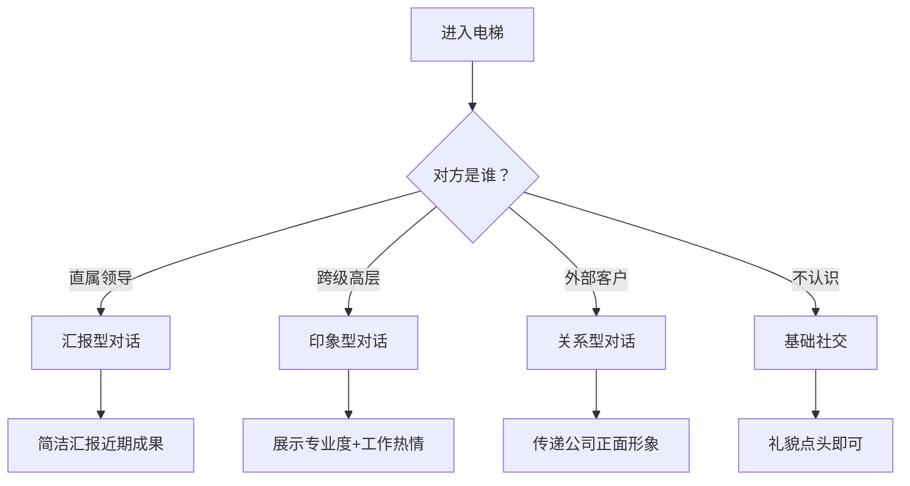
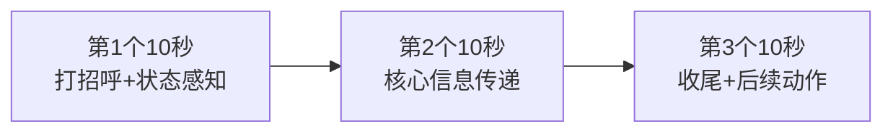
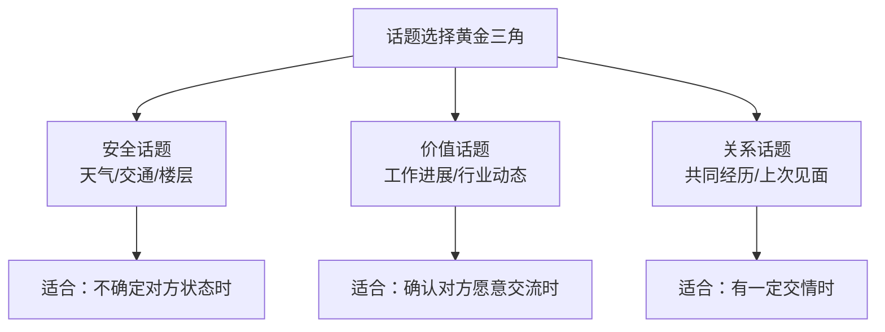

## 场景六：电梯偶遇

### 场景本质：60 秒的微型舞台

电梯偶遇是职场中最被低估的社交场景。它具备三个独特属性：**封闭空间**（无法回避）、**时间刚性**（30-90 秒强制截止）、**身份落差**（常遇到平时接触不到的高层）。这三个属性叠加在一起，让电梯偶遇成为一把双刃剑——用好了是一次高效的印象植入，用砸了则可能给对方留下负面记忆。

为什么说电梯偶遇比你想象的更重要？心理学中有一个概念叫**首因效应（Primacy Effect）**，指人们对他人的第一印象会深刻影响后续判断。而电梯偶遇往往是你在高层领导面前的"第一印象时刻"。研究表明，人类在初次接触的前 7 秒内就会形成对他人的基本判断，而电梯的 30-90 秒绰绰有余。

更关键的是，电梯偶遇具有一种**"非刻意感"**。与正式汇报、会议发言不同，电梯里的交流显得自然、真实，领导反而更容易记住你的表现。这就像脱口秀演员说的："最好的段子听起来像随口说的，其实都是精心设计的。"

### 场景分析：你需要读懂的潜台词

在踏入电梯之前，先花 2 秒判断局势：

| 判断维度 | 关键问题 | 决策方向 |
|---------|---------|---------|
| 对方身份 | 是直属上级、跨级高层还是外部人员？ | 决定对话的正式程度和内容方向 |
| 对方状态 | 正在看手机？皱眉？戴耳机？ | 决定是否主动开口 |
| 同行人数 | 只有你和他，还是有一群人？ | 决定对话的私密性和深度 |
| 电梯方向 | 上行（你还有时间）还是下行（可能随时到） | 决定节奏和信息密度 |
| 楼层差 | 2 层还是 20 层？ | 决定你能说多少 |

### 四种典型电梯偶遇的完整攻略

#### 场景一：偶遇直属领导

这是最常见的场景，也是最不需要紧张的。你们本来就有工作关系，电梯只是一个偶然的交流场所。

**对话示范：**

> **你：** "张总早，今天来得挺早的。"
>
> **张总：** "嗯，上午有个客户要来。你那个项目进展怎么样了？"
>
> **你：** "挺顺利的，昨天刚完成了第二轮用户测试，反馈比预期好。下周应该能出完整的测试报告。"
>
> **张总：** "不错，到时候发我一份。"
>
> **你：** "好的，周一发您邮箱。"

**关键要点：**

- 用**时间性话题**开场（"来得早""今天天气""刚开完会"），这类话题零风险且自然
- 领导问进展时，用**"结果+下一步"**的结构回答，不要从头讲故事
- 如果领导没主动问，不要硬汇报——一句"最近在忙 XX 项目，进展还不错"就够了
- 收尾时绑定一个具体的**后续动作**（"周一发邮箱""明天会上详聊"），让对话有闭环感

#### 场景二：偶遇跨级高层（重点场景）

这是最有价值也最有风险的场景。高层可能平时根本不认识你，这是你唯一一次在近距离展示自己的机会。

**对话示范：**

> **你：** "王总好。"
>
> **王总：** "你好，你是哪个部门的？"
>
> **你：** "我是产品部的陈明，负责教育产品线。王总，上次您在全员会上提到的用户增长策略，我们团队已经在执行了，效果还不错。"
>
> **王总：** "哦？具体什么情况？"
>
> **你：** "我们调整了新用户的引导流程，转化率提升了 15%。等有了更完整的数据，我整理一份报告给您看看？"
>
> **王总：** "好，发给我的助理就行。继续加油。"
>
> **你：** "好的，谢谢王总！"

**为什么这段对话设计得巧妙？**

1. **"上次您在全员会上提到的"**——这句话传达了三个信息：我认真听了您的发言、我在执行您的战略方向、我是一个有执行力的人
2. **"转化率提升了 15%"**——用数据说话，不是空泛的"效果不错"
3. **"等有了更完整的数据，我整理一份报告"**——既展示了成果，又暗示了你是一个严谨、有后续跟进意识的人
4. **"给您看看"而非"请您指导"**——语气平等但尊重，不卑不亢

**高层内心的真实想法（你以为 vs 实际）：**

| 你以为高层在想 | 高层实际在想 |
|-------------|-----------|
| "这人怎么这么烦，打扰我" | "终于有个一线员工跟我说实话了" |
| "我根本不关心你的工作" | "这个部门在执行我的战略，了解一下" |
| "别拍马屁了" | "他居然记得我说过的话，说明有执行力" |
| "电梯到了你还不走？" | "这人不错，记住名字了" |

#### 场景三：偶遇外部客户或合作伙伴

电梯里的你代表的不是个人，而是公司。这种场景需要的是**职业化的温度**。

**对话示范：**

> **你：** "李总您好，我是 XX 公司的陈明，负责项目对接。欢迎来我们公司。"
>
> **李总：** "你好你好，你们公司环境不错。"
>
> **你：** "谢谢，我们去年刚搬过来的。李总您今天是来参加项目评审的吧？会议室在 12 楼，我帮您指一下。"
>
> **李总：** "对对，谢谢。"
>
> **你：** "不客气，有任何需要随时找我。"

**关键要点：**

- 第一句就自报家门（姓名+公司+职位），降低对方的认知成本
- 主动提供**实用信息**（楼层、会议室位置），展现服务意识
- 不要趁机推销或谈业务细节——这不是场合
- 留一个**开放性的结束语**（"随时找我"），为后续合作铺路

#### 场景四：偶遇不认识的人

不是每次电梯偶遇都需要社交。有时候，**最好的社交就是不社交**。

**判断标准：**

- 对方在看手机/戴耳机/低头——不要打扰，点头微笑即可
- 对方主动看你——可以微笑说"你好"
- 对方是高层且状态放松——可以参照场景二
- 对方明显是访客——主动问"请问您去几楼？"帮忙按电梯

### 电梯偶遇的核心技术框架

#### 技术一：30 秒结构法

电梯偶遇的时间是刚性的，你必须在有限时间内完成一个完整的沟通闭环。以下是被验证有效的 30 秒结构：

**第一个 10 秒：打招呼 + 状态感知**

- 一句简洁的问候（"王总好""早上好"）
- 同时用余光观察对方的反应：是点头回应？还是微笑？还是面无表情？
- 如果对方回应积极（微笑、看你、点头），进入下一步
- 如果对方反应冷淡（敷衍点头、继续看手机），微笑后安静即可

**第二个 10 秒：核心信息传递**

- 这是你唯一能"说正事"的时间窗口
- 选择一个最有价值的信息点，用一句话说清楚
- 信息的选择标准：与对方相关 > 有数据支撑 > 有后续价值
- 不要试图说两件事，选最重要的那一件

**第三个 10 秒：收尾 + 后续动作**

- 绑定一个具体的后续动作（"发邮件给您""明天会上详聊"）
- 用一句感谢或祝福结束
- 如果电梯到了，自然地让对方先走

#### 技术二：微表情管理

电梯是一个封闭空间，距离通常只有 1-1.5 米。在这个距离下，你的每一个微表情都会被放大。

**电梯偶遇的表情管理清单：**

| 时机 | 正确表情 | 错误表情 |
|-----|---------|---------|
| 进入电梯看到对方 | 微笑+眼神接触 | 惊讶/慌张/低头回避 |
| 打招呼时 | 自然微笑，语调上扬 | 面无表情/假笑/过度热情 |
| 对方说话时 | 点头+专注的眼神 | 东张西望/看手机/皱眉 |
| 自己说话时 | 自信但不咄咄逼人 | 紧张到声音发抖/语速过快 |
| 电梯到达时 | 微笑+点头致意 | 急匆匆跑出去/回头再说两句 |

**一个实用技巧：** 进电梯前在心里默念"今天天气不错"，这会让你的面部肌肉自然放松，呈现出一个中性偏友好的表情。

#### 技术三：话题选择的黄金三角

电梯偶遇的话题选择有一个黄金三角模型：

**安全话题（零风险）：**

- "今天来得挺早/挺晚的"
- "外面下雨了，您带伞了吗？"
- "这个电梯最近好像有点慢"
- "您也是去参加 X 楼的会议吗？"

**价值话题（有信息量）：**

- "上次您提到的 XX 项目，我们已经在推进了"
- "最近 XX 行业有个新趋势，挺有意思的"
- "我们团队刚完成了一个阶段性目标"

**关系话题（拉近距离）：**

- "上次团建您说的那个餐厅我后来去了，确实不错"
- "您推荐的那本书我读了，收获很大"
- "听说您最近在跑马拉松？"

**绝对禁区话题：**

- ❌ 加薪、晋升、跳槽等个人诉求
- ❌ 公司八卦、人事变动
- ❌ 对同事的负面评价
- ❌ 复杂的技术问题或需要对方决策的事项
- ❌ 任何需要超过 30 秒才能说清楚的事情

### 高阶技巧：电梯偶遇的进阶心法

#### 心法一：印象植入术

电梯偶遇的终极目标不是"完成一次对话"，而是在对方心中植入一个正面印象。这需要你在 30 秒内传递一个**标签化信息**。

**什么是标签化信息？** 就是一句话能让对方在下次见到你时想起你。

| 标签类型 | 示例 | 效果 |
|---------|------|------|
| 成果标签 | "那个转化率提升 15% 的项目就是我负责的" | 有能力 |
| 执行标签 | "您上次说的策略我们已经在执行了" | 有执行力 |
| 专业标签 | "最近我在研究 XX 领域的新趋势" | 有专业深度 |
| 态度标签 | "我们团队最近在冲刺，状态很好" | 有热情 |

#### 心法二：主动权法则

电梯偶遇中，谁先开口谁就掌握了对话的主动权。但主动权不等于话多，而是**控制对话的走向**。

**主动权的三层运用：**

1. **主动打招呼**——而不是等对方先看到你
2. **主动给话题方向**——而不是被动等对方提问
3. **主动收尾**——而不是等电梯到了才尴尬结束

**收尾的万能句式：**

- "不耽误您时间了，祝您今天顺利。"
- "电梯到了，我先下去了，回头再跟您汇报。"
- "到了到了，我帮您按着门，您先请。"

#### 心法三：反向电梯偶遇

不只是"遇到高层"才有价值，有时候你也可以**制造电梯偶遇**。

**合法的制造方式：**

- 如果你知道某位高层每天早上 8:30 坐电梯，在 8:28 到大堂"偶遇"
- 如果你知道某个跨部门负责人在 X 楼办公，可以在合适的时间"路过"
- 但请注意：**制造偶遇 ≠ 跟踪**。频率控制在每月 1-2 次，超过就变成骚扰了

### 常见错误与纠正

#### 错误一：过度紧张导致的"社恐表现"

**错误表现：** 进入电梯看到领导后，低头看手机、假装没看到、或者紧张到说话结巴。

**为什么这是错误的：** 领导不是洪水猛兽，你的紧张反而会让对方不舒服。在一个封闭空间里，假装没看到对方是一种社交失礼。

**纠正方法：**

- 提前在心里准备好 2-3 句万能开场白
- 进入电梯前深呼吸一次
- 记住：最坏的结果也就是 60 秒的尴尬，不会影响你的职业生涯
- 练习：平时在电梯里遇到任何人都主动微笑+点头，养成习惯

#### 错误二：话痨模式

**错误表现：** 抓住机会就不放手，从项目背景讲到执行细节再到未来规划，电梯到了还在说。

**为什么这是错误的：** 电梯偶遇不是汇报会。高层的时间是稀缺资源，你在电梯里说的每一秒都在消耗对方的好感度。

**纠正方法：**

- 强制自己只说一个信息点
- 用"一句话测试"：如果你不能用一句话说清楚，那就不要在电梯里说
- 提前准备好"电梯版"自我介绍和工作汇报（30 秒以内）

#### 错误三：谄媚过度

**错误表现：** "王总您今天气色真好！""王总您上次的发言太精彩了！""王总您就是我们的指路明灯！"

**为什么这是错误的：** 过度的恭维会让对方觉得你是一个没有真本事、只会拍马屁的人。尤其是在电梯这种私密空间里，谄媚会显得格外刺眼。

**纠正方法：**

- 恭维要具体且有信息量："您上次提到的 XX 策略，我们试了确实有效"——这是基于事实的认可，不是空洞的吹捧
- 用成果代替赞美：与其说"您太厉害了"，不如说"我们按照您的建议做了，效果很好"
- 保持语气平等：尊重但不卑微

#### 错误四：只顾说话不看信号

**错误表现：** 对方已经明显表现出不想聊的信号（看手机、敷衍回应、身体转向另一边），你还在滔滔不绝。

**为什么这是错误的：** 你不仅浪费了这次机会，还给对方留下了"不懂分寸"的印象。

**纠正方法：**

- 学会读懂对方的**退出信号**：
  - 看手机/掏手机 → "我先不打扰您了"
  - 敷衍回应（"嗯""好"不接话） → 微笑收尾
  - 身体转向电梯门 → 准备结束
  - 戴上耳机 → 不要再说话
- 记住：**及时收尾比多说一句更有价值**

#### 错误五：电梯到了还在"续命"

**错误表现：** 电梯门已经开了，对方已经迈步出去，你还在追着说"对了还有一件事"。

**为什么这是错误的：** 电梯到达是一个天然的结束信号，强行续命会让之前所有的好印象瞬间崩塌。

**纠正方法：**

- 把电梯到达当作**硬性截止时间**
- 如果确实还有重要的事没说，用收尾句式留后续："今天时间太短了，改天我发邮件跟您详细说"
- **永远不要在电梯门外追着对方说话**

### 特殊情况处理

#### 情况一：电梯里还有其他人

如果电梯里有第三人在场，你需要注意：

- 不要谈任何可能涉及保密信息的话题
- 不要让第三人感到被冷落——可以对所有人微笑点头
- 如果第三人也是同事，可以做一个简短的三方介绍
- 如果第三人是陌生人，保持基本的社交距离感

#### 情况二：对方正在打电话

- **绝对不要打断**，不要说话，不要做手势
- 安静地站在一旁，保持正常表情
- 对方挂电话后，如果时间允许，可以微笑点头
- 不要在对方电话结束后说"刚才不好意思打扰"——你没有打扰，你只是安静地站着

#### 情况三：电梯故障/长时间停留

这是一个**极端但高价值**的场景。如果电梯突然停了，你和高层被困在一起 5-10 分钟：

- 第一反应是关心安全："王总，您别担心，我按紧急呼叫按钮"
- 安全问题解决后，可以自然地聊天——这时候的交流会比任何电梯偶遇都深入
- 但仍然不要利用这个机会推销自己——先解决眼前的问题，再自然地聊
- 这种经历会让对方对你有非常深刻的记忆

#### 情况四：你犯了错正在被批评期

如果你最近犯了错、正在被领导批评，电梯偶遇会变得很尴尬：

- 不要假装没看到——这会让你显得心虚
- 不要主动提犯错的事——电梯不是道歉的场合
- 正常打招呼，简洁收尾："张总好，我先去开会了"
- 用行动而非言语来修复印象

### 电梯偶遇的复盘与跟进

每次电梯偶遇结束后，花 30 秒做一次心理复盘：

1. **我说了什么？** 是否传递了一个有价值的信息点？
2. **对方反应如何？** 是积极回应还是敷衍？
3. **我留下了后续动作吗？** 如果留了，要在 24 小时内执行
4. **有什么可以改进的？** 下次遇到类似情况可以怎么说更好

**最重要的一步：后续动作的执行。** 如果你在电梯里说"发一份报告给您"，那这份报告必须在承诺的时间内发出。否则，电梯偶遇就从"正面印象"变成了"说到做不到的负面印象"。

### 实用工具箱

#### 电梯偶遇万能开场白

| 场景 | 开场白 | 适用对象 |
|------|--------|---------|
| 早上偶遇 | "X总早，今天来得挺早的" | 所有人 |
| 下午偶遇 | "X总，下午好，开完会了？" | 直属领导 |
| 不确定说什么 | "X总好"（微笑+点头） | 所有人 |
| 对方看起来忙 | 微笑+点头（不说话） | 所有人 |
| 对方在看手机 | 安静站着 | 所有人 |

#### 电梯偶遇万能收尾句

| 场景 | 收尾句 |
|------|--------|
| 正常结束 | "电梯到了，X总您先请" |
| 需要后续跟进 | "我回头发邮件跟您详细说" |
| 不确定说什么 | "X总再见"（微笑+点头） |
| 对方要先下 | "X总慢走" |
| 你要先下 | "我先下了，X总再见" |

#### 30 秒电梯演讲模板

如果你知道可能会在电梯里遇到某位高层，提前准备好一个 30 秒的"电梯演讲"：

> **模板：** "我是[部门]的[姓名]，负责[业务]。最近我们在[做什么]，已经取得了[具体成果]。下一步计划是[下一步]，预计[时间节点]会有更完整的结果。"

**示例：**

> "我是产品部的陈明，负责教育产品线。最近我们在优化新用户引导流程，转化率已经提升了 15%。下一步计划把这套方法推广到其他产品线，预计下个月会有完整的数据报告。"

### 本场景核心心法

电梯偶遇的本质是一次**微型个人品牌展示**。你不需要在 30 秒内说服对方给你升职加薪，你只需要做到三件事：

1. **让对方记住你的名字和部门**——这是最低目标
2. **让对方对你有一个正面的标签印象**——这是标准目标
3. **让对方主动想跟你继续聊**——这是最高目标

记住：电梯偶遇不是一次性的机会，而是一个**可重复的场景**。如果你每个月在电梯里遇到同一位高层 2-3 次，每次都用 30 秒传递一个有价值的信息点，累积下来的效果比任何一次正式汇报都强。

**最后一条建议：** 把电梯偶遇当作一种日常练习，而不是一次重大考验。你遇到的每一个人——同事、保安、保洁阿姨——都是你练习社交能力的对象。当你能在电梯里跟任何人自然地聊 30 秒时，遇到高层就只是一个普通的练习场景而已。
