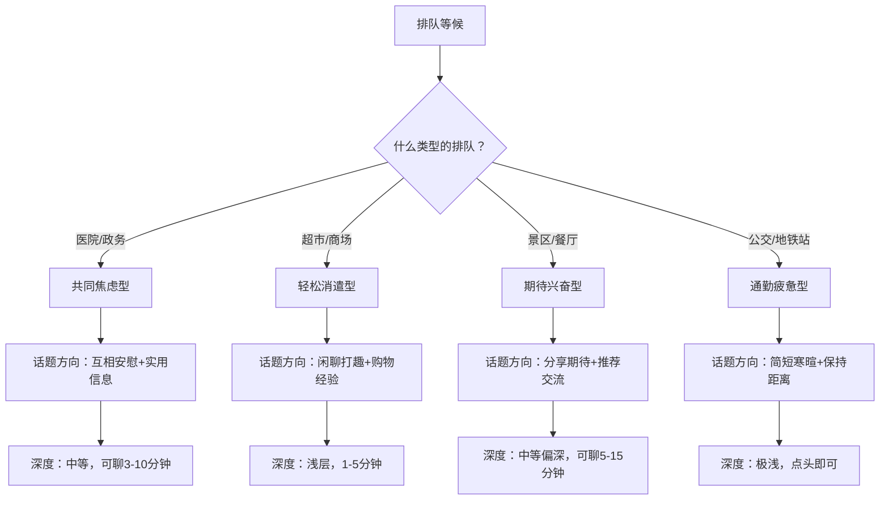
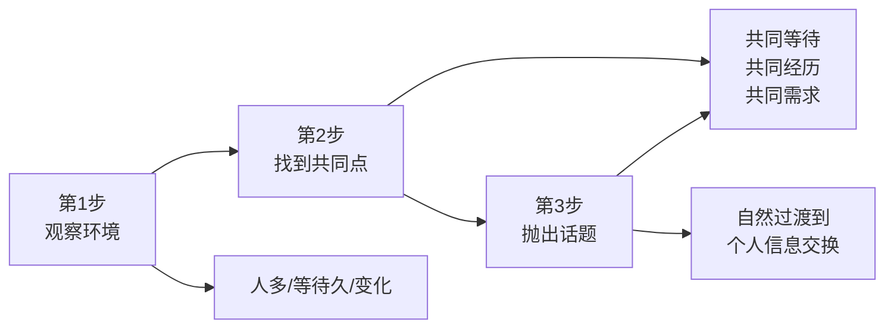
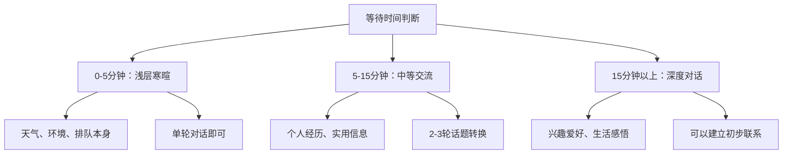
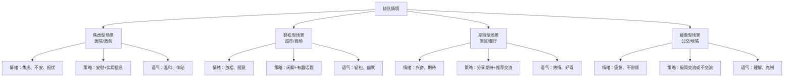

## 场景七：排队等候

### 场景本质：被迫的共处中藏着社交金矿

排队等候是日常生活中最常见却最容易被忽视的社交场景。它具备三个独特属性：**时间不确定性**（不知道要等多久）、**身份对等性**（所有人都是"等待者"）、**共享困境感**（无聊、焦虑、不耐烦是共同情绪）。这三个属性叠加在一起，让排队成为一种天然的"社交破冰器"——当人们共同面对一段空白时间时，交流的意愿会显著提升。

为什么排队等候比你想象的更适合社交？社会心理学中有一个概念叫**共同命运效应（Common Fate Effect）**，指当人们面临相同的处境时，会自发产生亲近感和信任感。排队正是这种效应的典型触发场景：你和旁边的人拥有完全相同的处境——都在等待，都感到无聊，都需要消磨时间。这种共同命运感大大降低了社交的心理门槛。

更关键的是，排队等候具有一种**"低承诺感"**。与正式的社交场合不同，排队中的聊天不需要任何"后续义务"——你们可能永远不会再见，所以双方都没有心理负担。正是这种"随时可以退出"的安全感，让人们在排队时反而更愿意敞开心扉。

### 场景分析：你需要读懂的潜台词

在开口之前，先花 3 秒判断局势：

| 判断维度 | 关键问题 | 决策方向 |
|---------|---------|---------|
| 排队类型 | 是医院、超市、景区还是公共交通？ | 决定话题方向和情感基调 |
| 对方状态 | 是在看手机、发呆、还是也在张望？ | 决定是否主动开口 |
| 排队时长 | 已经等了多久？预计还要等多久？ | 决定聊天的深度和时长 |
| 身体语言 | 对方是否面向你、有眼神接触？ | 判断对方是否愿意交流 |
| 年龄身份 | 是同龄人、长辈还是带孩子的家长？ | 决定称呼和话题选择 |
| 空间距离 | 紧挨着还是隔了几个人？ | 决定音量和沟通方式 |

### 六种典型排队场景的完整攻略

#### 场景一：医院排队（核心场景）

医院是排队社交中最典型的场景。在这里，所有人都带着某种焦虑——等待检查结果、等待挂号、等待叫号。这种共享的焦虑感既是挑战（情绪可能不好），也是机会（人们渴望被理解和安慰）。

**对话示范一：挂号窗口排队**

> **你：** "今天人真多啊，您等了多久了？"
>
> **对方：** "快半小时了，早知道就网上预约了。"
>
> **你：** "是啊，现在网上预约方便多了。我上次就是没预约，白跑了一趟。您是看什么科？"
>
> **对方：** "骨科，最近膝盖有点不舒服。你呢？"
>
> **你：** "我是来拿体检报告的。膝盖不舒服的话要注意保暖，我妈妈之前也是膝盖不好，后来每天热敷好多了。"
>
> **对方：** "真的吗？我回去试试。你妈妈现在怎么样了？"
>
> **你：** "现在好多了，每天还去公园散步呢。"

**对话示范二：候诊区等待叫号**

> **你：** "您好，请问您知道骨科是在这边叫号吗？我看屏幕上半天没动了。"
>
> **对方：** "是这边，我也是等骨科的。今天好像专家号特别多人。"
>
> **你：** "理解，专家号确实难挂。您是提前预约的吗？"
>
> **对方：** "是啊，约了两周才约上。你是看什么？"
>
> **你：** "我来复查的，上次拍了个片子今天看结果。等待真是最考验耐心的事。"
>
> **对方：** "可不是嘛。不过这个医院骨科确实好，等一等也值了。"
>
> **你：** "您之前也来过？那您觉得哪个医生比较好？"

**为什么这两段对话有效？**

1. **"今天人真多" / "半天没动了"**——用共同的等待体验开场，零风险，对方一定有共鸣
2. **分享实用信息**——网上预约的经验、热敷的方法，这些都是真实有价值的"社交货币"
3. **提到家人经历**——"我妈妈之前也是"这句话既建立了共鸣，又不会过于暴露隐私
4. **自然追问**——从排队经验自然过渡到对方的具体情况，不突兀
5. **适度分享个人信息**——"来拿体检报告"是安全的信息，不会让对方觉得你在探听病情

**医院排队的特殊规则：**

| 规则 | 正确做法 | 错误做法 |
|------|---------|---------|
| 病情话题 | 等对方主动提及，适度回应 | 主动追问"你得了什么病？" |
| 情绪管理 | 传递正能量，适当安慰 | 抱怨等待时间、吐槽医院 |
| 信息边界 | 分享通用经验（如预约方法） | 给出具体的医疗建议 |
| 话题深度 | 中等偏浅，以实用信息为主 | 深入探讨生死、重病等沉重话题 |
| 退出时机 | 对方被叫号或明显不想聊时 | 对方已经在看手机你还继续聊 |

#### 场景二：政务服务大厅排队

政务大厅是另一个典型的排队场景。与医院不同，来这里的人通常不是因为健康问题，而是办理各种手续——户口迁移、社保查询、营业执照等。焦虑的来源不是疾病，而是"手续繁琐""材料不全""不知道流程"。

**对话示范：**

> **你：** "您好，请问您也是来办社保的吗？我第一次来，不太清楚流程。"
>
> **对方：** "对，我也是办社保。你取号了没？先去那边取号机取个号。"
>
> **你：** "好的，谢谢！您经常来办这些吗？我看流程挺复杂的。"
>
> **对方：** "第二次了，上次材料没带齐白跑了一趟。你是办什么业务？"
>
> **你：** "社保转移，从上一个城市转过来的。您知道需要哪些材料吗？"
>
> **对方：** "转移的话需要原单位的离职证明、身份证、社保卡，最好都带上复印件。"
>
> **你：** "太好了，我正好没带复印件。这附近有打印店吗？"
>
> **对方：** "出门左转就有个打印店，一块钱一张。"
>
> **你：** "帮大忙了，谢谢您！"

**对话设计的核心逻辑：**

- **求助请教法开场**——"我第一次来，不太清楚流程"是低风险的求助，对方通常乐意帮忙
- **信息互换**——你获得了流程信息，对方获得了"被需要"的满足感
- **自然延伸**——从流程聊到材料，从材料聊到打印店，话题环环相扣
- **真诚感谢收尾**——"帮大忙了"让对方觉得自己提供了价值，留下好印象

#### 场景三：超市/商场排队结账

超市排队是最轻松的排队场景。人们通常心情不错（刚买了东西），等待时间也不算太长。这里的聊天节奏应该是轻松、简短、有趣的。

**对话示范一：**

> **你：** "您这个橙子看起来不错，在哪个货架拿的？"
>
> **对方：** "就在那边水果区，今天打折呢。"
>
> **你：** "真的吗？那我等下也去拿一袋。您经常来这家超市吗？"
>
> **对方：** "基本每周来，东西挺全的。"
>
> **你：** "我刚搬过来不久，还在摸索哪家超市性价比高。有什么推荐的吗？"
>
> **对方：** "这家日常用品不错，但海鲜建议去旁边的农贸市场，新鲜又便宜。"

**对话示范二：**

> **你：** "今天人好多啊，是不是有什么活动？"
>
> **对方：** "好像是会员日，全场八折。"
>
> **你：** "难怪！我说怎么这么多人。您是会员吗？"
>
> **对方：** "是啊，办了一年了，积分还能换东西。"
>
> **你：** "那挺划算的。我下次也办一个。"

**超市排队的关键要点：**

- **商品话题是天然切入点**——"您这个看起来不错"是最自然的开场
- **实用信息交换**——折扣信息、好物推荐、周边店铺推荐，都是高价值社交货币
- **保持轻松愉快**——超市不是深度社交场合，1-3 分钟的简短交流即可
- **不要涉及价格隐私**——不要问"这个多少钱"之类可能让对方尴尬的问题

#### 场景四：景区/网红餐厅排队

景区和网红餐厅的排队具有一种独特的心理状态：**期待感**。人们排了很长时间队，说明他们对这个地方有很高的期望。这种期待感是天然的话题素材。

**对话示范：**

> **你：** "您也是看了小红书推荐来的吗？排了多久了？"
>
> **对方：** "一个小时了！看网上说这家的招牌菜特别好吃。"
>
> **你：** "一个小时！那肯定值得等。您点了什么？我第一次来不知道点什么好。"
>
> **对方：** "我朋友推荐的糖醋排骨和酸菜鱼。你人多的话可以再加个凉菜。"
>
> **你：** "谢谢推荐！您是本地人吗？还有什么好吃的地方推荐？"
>
> **对方：** "我是本地的。你如果喜欢吃辣，东街有家川菜馆也很地道，不用排队。"
>
> **你：** "太好了，收藏了！等下吃完如果这家不好吃，我就去您推荐的那家。"
>
> **对方：** "哈哈，放心吧，这家不会让你失望的。"

**景区/餐厅排队的独特优势：**

- **共同期待**——"等了这么久"本身就是强烈的情感共鸣点
- **攻略互换**——互相推荐、分享经验，是高价值的信息交换
- **本地人 vs 游客**——如果对方是本地人，你可以获得宝贵的本地推荐
- **后续话题丰富**——吃完/玩完之后可以再聊感受，形成完整的话题闭环

#### 场景五：公交/地铁站等车

公共交通等车是一个**边界感要求最高**的排队场景。人们通常赶时间、疲惫、或者沉浸在自己的世界里。这里的社交应该极度克制——除非有明确的信号，否则不要主动开启深度对话。

**适度的互动方式：**

> **你：** "您好，请问 88 路是在这个站台等吗？"
>
> **对方：** "对，就是这边。应该快来了，我看刚才一辆刚走。"
>
> **你：** "好的，谢谢您！"

**或者在长时间等车时：**

> **你：** "这车怎么还没来啊，您等了多久了？"
>
> **对方：** "快二十分钟了，可能路上堵车了。"
>
> **你：** "唉，早高峰确实难等。您也是去 XX 方向的吗？"
>
> **对方：** "对，去上班。你呢？"
>
> **你：** "我也是。希望别迟到。"

**公交/地铁站的社交底线：**

- 只在**长时间等待**（超过 10 分钟）时才考虑聊天
- 话题仅限于**等车本身**（车什么时候来、路线确认等）
- 对方戴耳机、看手机、低头——**绝对不要打扰**
- 收到简短回应后**不要继续追问**——对方可能不想聊

#### 场景六：银行排队取号

银行排队是所有排队场景中**等待时间最长、焦虑感最强**的之一。叫号屏幕上的数字变动缓慢，每个人都在心里计算"还有多少人到我"。这种共同的焦虑为社交提供了天然的土壤。

**对话示范：**

> **你：** "您好，请问您知道对公业务是在这个窗口吗？我第一次来不太确定。"
>
> **对方：** "对公业务在二楼，这里是一楼的个人业务。"
>
> **你：** "啊，谢谢！差点排错了。您等了多久了？"
>
> **对方：** "四十分钟了，前面还有十几个人。"
>
> **你：** "这么慢啊。我之前试过用手机银行办，有些业务其实不用来柜台。"
>
> **对方：** "是吗？我这个业务好像必须来柜台办。"
>
> **你：** "那确实没办法。您要是觉得无聊，那边有杂志可以看。"
>
> **对方：** "好，谢谢。你先去二楼吧，别排错了。"
>
> **你：** "好的，谢谢您帮忙！祝您尽快办完。"

**银行排队的独特要素：**

- **求助信息**——"请问 XX 业务在哪里办"是最自然的开场
- **时间感**——银行等待时间长，可以聊得稍微深入一些
- **实用建议**——手机银行、自助终端等替代方案的分享
- **注意隐私**——不要问对方办什么业务、存了多少钱

### 排队等候的核心技术框架

#### 技术一：5 秒破冰法

排队等候的破冰窗口只有 5 秒——如果在最初的 5 秒内没有开口，后面会越来越尴尬。以下是被验证有效的破冰公式：

**万能破冰公式：环境观察 + 共同处境 + 开放式问题**

| 公式类型 | 结构 | 示例 |
|---------|------|------|
| 抱怨共鸣型 | 共同困境 + 情感表达 + 开放提问 | "今天人真多啊，您等了多久了？" |
| 求助信息型 | 请教 + 场景说明 + 感谢预期 | "您好，请问 XX 是在这边排队吗？" |
| 物品观察型 | 赞美/好奇 + 具体细节 + 追问 | "您这个包挺好看的，是什么牌子的？" |
| 环境评论型 | 对环境的中性评论 + 开放式延伸 | "这家店装修挺有意思的，您来过吗？" |
| 实用分享型 | 提供信息 + 价值感 + 互动邀请 | "我看那边有座位，您要不要先坐一下？" |

#### 技术二：话题深度递进法

排队等候的时间是不确定的，你需要根据等待的长度灵活调整话题深度：

| 等待时长 | 话题深度 | 话题示例 | 结束方式 |
|---------|---------|---------|---------|
| 0-5 分钟 | 表面寒暄 | "今天人真多""天气不错" | 自然结束，微笑点头 |
| 5-15 分钟 | 信息交换 | 经验分享、实用建议、兴趣点 | "和您聊天很开心" |
| 15-30 分钟 | 适度深入 | 个人故事、生活经历、观点交流 | 留联系方式或祝福告别 |
| 30 分钟以上 | 可以较深 | 共同兴趣、价值观、人生经历 | 建立联系，约后续见面 |

#### 技术三：退出信号识别

排队聊天的最大风险不是"聊不起来"，而是"停不下来"。学会识别退出信号，是排队社交的必备技能：

**对方想继续聊的信号：**
- 主动追问你的问题
- 身体朝向你，保持眼神接触
- 主动分享个人信息
- 表情生动，语调上扬
- 主动提出新的话题

**对方想结束聊的信号：**
- 回答变得简短（"嗯""是吧""还好"）
- 开始看手机、看屏幕、四处张望
- 身体转向另一边
- 回答后不追问、不延伸
- 拿出耳机或开始整理东西

**收到退出信号后的正确反应：**

| 信号强度 | 对方表现 | 你的反应 |
|---------|---------|---------|
| 轻微信号 | 回答变短，但仍有眼神接触 | 换一个话题试试，如果还是简短回应就收尾 |
| 中等信号 | 开始看手机，回答很敷衍 | "和您聊天挺开心的" + 微笑收尾 |
| 强烈信号 | 戴上耳机，完全不看你 | 立刻停止说话，不要有任何心理负担 |

#### 技术四：实用信息交换术

排队等候最高效的社交模式是**实用信息交换**——双方互相提供有价值的信息，各取所需。这种模式的优势在于：不涉及隐私、有明确的价值感、自然而不尴尬。

**常见排队场景的实用信息清单：**

| 排队场景 | 可以分享的实用信息 | 可以询问的实用信息 |
|---------|-------------------|-------------------|
| 医院 | 网上预约方法、停车信息 | 哪个医生好、需要带什么材料 |
| 政务大厅 | 办理流程、材料清单 | 附近打印店、复印要求 |
| 超市 | 会员优惠、折扣信息 | 哪个货架有好东西、哪家分店更好 |
| 景区/餐厅 | 排队技巧、最佳时间 | 推荐菜品、本地好去处 |
| 银行 | 手机银行功能、自助终端 | 业务办理时间、需要带什么证件 |
| 学校 | 报名流程、注意事项 | 哪个老师好、课程安排 |

### 多人排队的社交策略

#### 策略一：一对多——成为"排队组织者"

当排队人数较多、秩序混乱时，你可以主动扮演"秩序维护者"的角色，这是一种高级的社交策略：

> **你：** "大家别挤，我刚才问了工作人员，说是按取号顺序来的。没取号的先去那边取个号。"
>
> **旁边的人：** "谢谢啊，我还以为是直接排的。"
>
> **你：** "不客气，我刚才也差点排错了。您是办什么业务？"
>
> **旁边的人：** "办护照，第一次来不知道流程。"
>
> **你：** "办护照的话需要先拍照，在二楼。拍完照再下来取号。"
>
> **旁边的人：** "太好了，谢谢你告诉我！"

**为什么"排队组织者"策略有效？**

1. **展示领导力**——主动帮助他人，展现你的社交自信
2. **建立正面形象**——周围的人都会对你产生好感
3. **创造多个社交触点**——你可以同时与多人建立连接
4. **提供价值感**——你的帮助让别人避免了麻烦

#### 策略二：多对一——排队中的"小团体"

有时排队会自然形成小团体——几个相邻的人开始聊天。这时候需要注意以下规则：

**加入已有小团体的方式：**
- 先倾听 1-2 分钟，找到切入点
- 用微笑和点头表示友善
- 在合适的时候插入一句评论或补充
- 不要一上来就主导话题

**在小团体中的行为准则：**
- 不要只跟一个人聊，照顾到所有人
- 用眼神和微笑与每个人建立连接
- 如果有人明显不想参与，不要强迫
- 在自己离开时，对所有人微笑告别

### 常见错误与纠正

#### 错误一：过度倾诉——把陌生人当心理咨询师

**错误表现：** 等待时间一长，就开始向陌生人倾诉自己的烦恼——工作压力大、感情不顺、家里有矛盾。

**为什么这是错误的：** 陌生人没有义务听你倾诉，而且过度的情感暴露会让对方感到不适和尴尬。在公共场合分享过多私人信息，也会让你自己显得不成熟。

**纠正方法：**
- 分享的内容控制在"轻松有趣"的层面，不要涉及深层情感
- 如果对方主动倾诉，倾听但不要追问细节
- 用"我也遇到过类似的情况"来表示理解，而不是深入探讨

#### 错误二：查户口式提问——让对方像在接受审讯

**错误表现：** "你是哪里人？""做什么工作的？""结婚了吗？""孩子多大了？"一连串的私人问题让对方应接不暇。

**为什么这是错误的：** 连续的私人问题会让对方感到被侵犯隐私，产生防御心理。社交的本质是信息的自愿交换，而不是单方面的信息索取。

**纠正方法：**
- 每次只问一个问题，等对方回答后再决定是否继续
- 在提问之前先分享自己的信息——"我是做 XX 的，您呢？"
- 如果对方对某个问题回避，立刻转向其他话题
- 用开放式问题（"您觉得怎么样？"）代替封闭式问题（"您是 XX 吗？"）

#### 错误三：不懂退出——硬聊到天荒地老

**错误表现：** 对方已经明显不想聊了（看手机、敷衍回答、身体转向别处），你还在滔滔不绝地讲。

**为什么这是错误的：** 强行延续一段对方不想继续的对话，会让之前所有的好感瞬间消失。社交的艺术不在于"说多少"，而在于"知道什么时候停"。

**纠正方法：**
- 设置一个心理时钟——每次聊天不超过 5 分钟就主动评估一次
- 准备好万能收尾语——"和您聊天很开心""希望您一切顺利"
- 记住：**及时收尾比多说一句更有价值**
- 如果不确定对方是否想继续聊，可以暂停 10 秒——如果对方不接话，就是退出信号

#### 错误四：触碰禁区——聊不该聊的话题

**错误表现：** 在医院问"你得了什么病？"，在银行问"你存了多少钱？"，在政务大厅问"你办的是什么手续？"

**为什么这是错误的：** 每个排队场景都有其敏感地带。触碰这些禁区不仅会让对方尴尬，还可能引发不必要的冲突。

**各场景的禁区清单：**

| 排队场景 | 绝对禁区 | 相对禁区 |
|---------|---------|---------|
| 医院 | 具体病情、医疗费用 | 对医院的负面评价 |
| 政务大厅 | 具体办理事项、家庭情况 | 对政策的抱怨 |
| 超市 | 商品价格、收入水平 | 对他人的购物选择评头论足 |
| 景区/餐厅 | 对方的消费水平 | 过于详细的个人行程 |
| 银行 | 存款金额、贷款情况 | 对银行业务的抱怨 |

#### 错误五：忽视空间——侵犯个人边界

**错误表现：** 聊天时靠得太近、声音太大、身体接触（拍肩膀、拉胳膊），或者在狭窄的空间里让对方感到"无处可逃"。

**为什么这是错误的：** 排队时人们通常已经处于一个相对狭窄的空间中，任何额外的空间侵犯都会被放大。保持适当的物理距离是排队社交的基本礼仪。

**纠正方法：**
- 保持至少一臂距离（约 75 厘米）
- 音量控制在"只有你和对方能听到"的程度
- 不要有身体接触，除非对方主动
- 如果对方后退，不要跟上去——那是明确的空间信号

### 高阶技巧：排队等候的进阶心法

#### 心法一：情境共情——读懂排队背后的情绪

不同场景下，人们排队时的情绪是不同的。读懂这些情绪，才能选择正确的话题和语气：

#### 心法二：价值植入——在短暂交流中留下印象

排队聊天通常是短暂的，但你可以在短暂的交流中植入一个让人记住你的"价值点"：

| 价值点类型 | 示例 | 效果 |
|-----------|------|------|
| 实用信息 | "这家医院的体检中心周三人最少" | 对方会觉得你是个"有用的人" |
| 独特见解 | "我觉得排队也是一种修行，练耐心" | 对方会觉得你是个"有思想的人" |
| 幽默感 | "排队排到我都开始数地砖了" | 对方会觉得你是个"有趣的人" |
| 温暖关怀 | "您看起来有点累，要不要先坐一下？" | 对方会觉得你是个"温暖的人" |

#### 心法三：后续连接——从一次性聊天到持续关系

大多数排队聊天都是"一次性"的，但如果你发现与对方特别聊得来，也可以自然地建立后续连接：

**自然建立连接的方式：**
- "您说的那个餐厅我一定去试试，去了跟您说感受"——留下微信
- "您对 XX 这么有研究，能加个微信以后请教吗？"——表达诚意
- "我们小区也有个业主群，您要是住附近我拉您进去"——提供价值

**不自然的方式（避免）：**
- "能加个微信吗？"——太突兀，没有理由
- "我们交个朋友吧"——太刻意，让人有戒备
- 索要电话号码——在排队场景中过于私人

### 特殊情况处理

#### 情况一：对方带着孩子

带孩子排队的家长通常面临双重压力：既要处理自己的事务，又要照顾孩子的情绪。这是一个展示关怀的好机会：

> **你：** "您家小朋友真可爱，几岁了？"
>
> **家长：** "四岁了，等得不耐烦了，一直闹。"
>
> **你：** "小孩子确实坐不住。我这里有个糖，介意给小朋友吃吗？"
>
> **家长：** "那太谢谢了！快说谢谢叔叔/阿姨。"

**注意事项：**
- 不要直接跟孩子说话，先跟家长建立连接
- 给孩子东西之前一定要先问家长
- 不要评论家长的教育方式

#### 情况二：对方是老年人

老年人在排队时往往面临更多的困难——腿脚不便、视力不好、对电子设备不熟悉。主动帮助是最佳的社交策略：

> **你：** "阿姨，您是需要取号吗？我帮您在机器上取一个。"
>
> **老年人：** "好好好，我不太会用这个机器。谢谢你啊小伙子/小姑娘。"
>
> **你：** "不客气，您的号码是 XX 号，大概还要等 XX 分钟。那边有座位，您可以先坐着等。"
>
> **老年人：** "你真是个好孩子。你是来办什么的？"
>
> **你：** "我也是来办 XX 的。您一个人来的吗？"
>
> **老年人：** "是啊，孩子上班忙。"
>
> **你：** "那等下如果有什么需要帮忙的，您叫我就行。"

#### 情况三：排队中出现插队

插队是排队场景中最容易引发冲突的情况。处理方式需要根据具体情况灵活应对：

**如果是别人被插队：**
- 不要主动介入，除非被插队的人向你求助
- 如果被插队的人向你抱怨，表示理解："确实不应该插队"

**如果是你被插队：**
- 语气平和但坚定："不好意思，我排在前面的"
- 不要情绪激动，不要使用攻击性语言
- 如果对方不理会，可以请工作人员协调
- 不要因为一次插队破坏自己的好心情

**如果有人试图跟你一起"搭便车"插队：**
- "不好意思，排队的话请到后面取个号"
- 保持微笑，但立场坚定

### 实用工具箱

#### 排队等候万能开场白

| 场景类型 | 开场白 | 适用条件 |
|---------|--------|---------|
| 通用型 | "今天人真多啊" | 任何排队场景 |
| 信息型 | "您好，请问 XX 是在这边排队吗？" | 不确定排队规则时 |
| 时间型 | "您等了多久了？" | 等待时间较长时 |
| 物品型 | "您这个 XX 挺好看的" | 对方有显眼的物品 |
| 帮助型 | "您需要帮忙吗？" | 对方看起来有困难 |
| 幽默型 | "我都快把这本杂志翻烂了" | 等待时间很长时 |

#### 排队等候万能收尾语

| 场景 | 收尾语 |
|------|--------|
| 对方被叫到号 | "到您了，祝一切顺利！" |
| 你被叫到号 | "我先去了，和您聊天很开心" |
| 等待结束 | "终于到了，祝您今天顺利" |
| 你先离开 | "我先走了，希望您一切顺利" |
| 对方先离开 | "慢走，再见！" |
| 想留联系方式 | "加个微信吧，以后 XX 方面可以互相交流" |

#### 排队聊天话题速查表

| 话题类型 | 安全话题 | 慎聊话题 | 禁区话题 |
|---------|---------|---------|---------|
| 天气 | 今天的天气、季节变化 | 极端天气带来的损失 | — |
| 等待 | 等了多久、预计还要多久 | 对服务的强烈抱怨 | — |
| 环境 | 排队场所的设施、氛围 | 对场所的激烈批评 | — |
| 个人 | 职业（泛泛提及）、兴趣爱好 | 收入、房产、婚姻状况 | 病情、家庭矛盾 |
| 社会 | 热门电影、美食推荐 | 政治立场、宗教信仰 | 他人隐私、八卦传闻 |

### 本场景核心心法

排队等候的本质是一次**微型社交练习**。你不需要在 5 分钟内交到一个知心朋友，你只需要做到三件事：

1. **打破沉默**——用一句自然的开场白开启对话，克服"不敢开口"的心理障碍
2. **提供价值**——分享一个实用信息、一个有趣的观点、或者一份温暖的关怀
3. **优雅退出**——在合适的时机用合适的方式结束对话，给双方都留下好印象

记住：排队等候是所有社交场景中**风险最低、练习价值最高**的。你遇到的每一个人都是陌生人，即使聊砸了也不会有任何后果。把每一次排队当作一次免费的社交能力训练，你的聊天技巧会在不知不觉中大幅提升。

**最后一条建议：** 从明天开始，给自己设定一个小目标——每周在排队时至少主动跟一个陌生人聊 3 分钟。一个月后，你会发现自己的社交恐惧已经大大减轻，"开口说第一句话"变得像呼吸一样自然。
