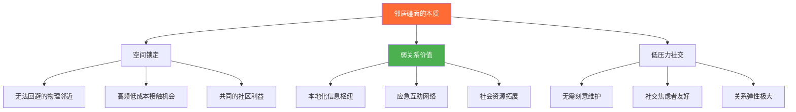
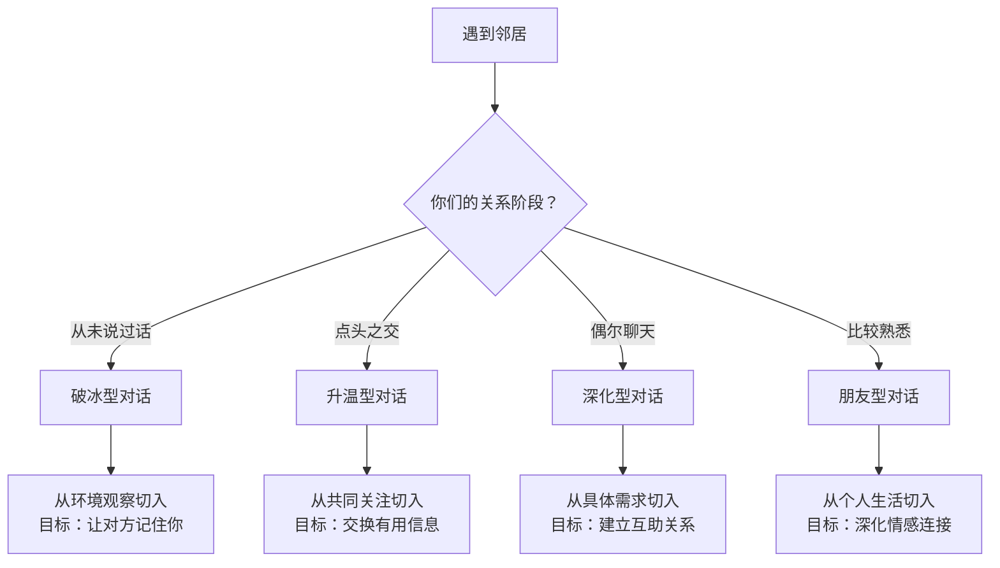
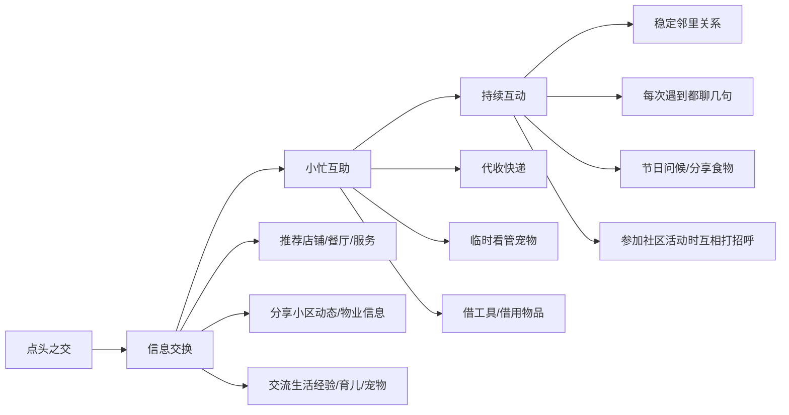
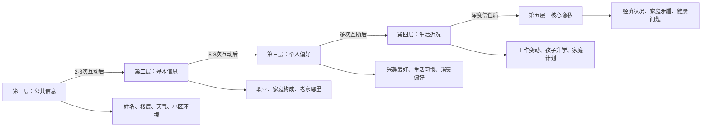
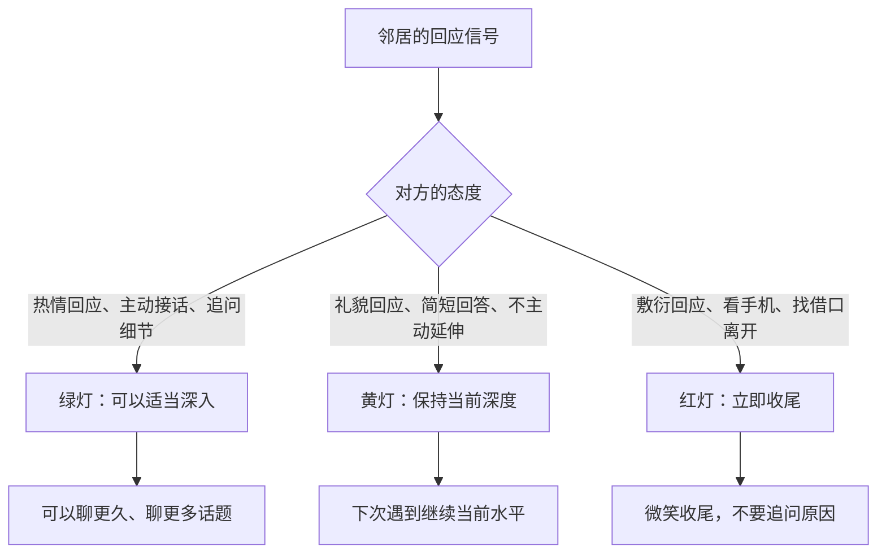
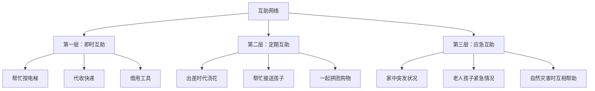

## 场景八：邻居碰面

### 场景本质：被低估的"弱关系金矿"

邻居碰面是日常社交中最容易被忽视、却最具长期回报价值的场景。与职场社交、朋友聚会不同，邻里关系具备三个独特属性：**空间锁定**（你们住在同一栋楼，无法选择回避）、**频率不确定**（可能每天遇到，也可能几个月碰不上一面）、**关系弹性极大**（从点头之交到生死之交，全看你怎么经营）。

社会学家 Mark Granovetter 在1973年提出的**"弱关系的力量"（The Strength of Weak Ties）**理论指出：那些与你关系不太紧密的人——而非亲密好友——往往能为你带来最多的新信息、新机会和新资源。邻居恰好处于"弱关系"的核心区间：你们有共同的物理空间作为信任基础，但又不像同事或朋友那样有固定的利益交集和社交压力。

为什么邻居关系值得投入精力经营？原因有三：

1. **信息枢纽价值**：邻居掌握着你获取不到的本地化信息——哪家幼儿园靠谱、哪个维修师傅便宜、小区物业的最新动态、周边商铺的开业信息。这些信息在网上搜不到，只有住在附近的人才知道。
2. **应急互助网络**：出差时帮忙浇花收快递、家里水管爆了能敲门借工具、老人孩子突发状况能有人搭把手——这种"近在咫尺的互助"是远亲和朋友都无法替代的。
3. **社交安全感**：邻里关系不需要刻意维护，碰到了聊几句，没碰到也不尴尬。这种低压力的社交模式，对社交焦虑者尤其友好。

然而，很多人的邻居关系长期停留在"电梯里尴尬点头"的阶段。问题不在于缺乏社交技巧，而在于**没有抓住"破冰窗口期"**——那些天然的、低压力的互动机会。

### 邻里关系的心理学基础

#### 熟悉效应（Mere Exposure Effect）

心理学家 Robert Zajonc 在1968年的经典实验中发现：仅仅是反复接触某个刺激物，就能增加人们对它的好感度。这就是"熟悉效应"——你不需要做任何特别的事，仅仅是**频繁出现**就能让邻居对你产生好感。

这意味着：在小区里散步、在楼下取快递、在电梯里微笑点头——这些看似微不足道的"露面"，都在默默地为你的邻里关系账户"存款"。很多人犯的错误是：每次遇到邻居都低头看手机、戴耳机、假装没看到。你以为你只是"不想社交"，实际上你在反复向对方传递"我不想认识你"的信号。

#### 互惠原则（Reciprocity Principle）

Robert Cialdini 在《影响力》中阐述的互惠原则在邻里关系中表现得尤为明显：当你主动帮助邻居（帮忙按电梯、代收快递、分享水果），对方会产生一种"回报义务感"。这种回报不一定是即时的，但会在未来某个时刻自然显现——可能是帮忙照看一下门口的快递，也可能是在你需要时提供关键信息。

邻里互惠有一个关键特征：**价值不对等但心理对等**。你帮邻居代收了一个价值30元的快递，邻居后来告诉你一个靠谱的装修队信息，帮你省了5000元。物质价值不对等，但双方都觉得自己"赚了"。

#### 社区归属感（Sense of Community）

心理学家 David McMillan 和 David Chavis 提出的社区感理论指出，社区归属感由四个要素构成：**成员感**（我属于这里）、**影响力**（我能影响社区）、**需求整合**（社区能满足我的需求）、**共享情感联结**（我和这里有共同的记忆和情感）。

与邻居的日常互动，恰恰是建立社区归属感的最直接途径。当你知道楼上住的是王阿姨、楼下住的是小张一家，你对这个小区的感觉就从"我住的地方"变成了"我的社区"。

### 场景分析：读懂邻居碰面的潜台词

邻居碰面的对话质量，取决于你能否在2秒内读懂当前的情境：

| 判断维度 | 关键问题 | 决策方向 |
|---------|---------|---------|
| **关系阶段** | 你们以前聊过吗？熟悉程度如何？ | 决定话题深度和信息暴露程度 |
| **对方状态** | 行色匆匆？悠闲遛狗？带孩子玩耍？ | 决定是否主动开口以及聊多久 |
| **场合属性** | 电梯里（时间刚性）？小区花园（时间弹性）？取快递（偶遇）？ | 决定对话的节奏和结构 |
| **时间维度** | 早上赶着上班？周末下午闲逛？晚上遛弯？ | 决定话题和时长 |
| **第三方在场** | 对方带家人？有其他邻居？ | 决定话题的私密性 |

### 五种典型邻居碰面的完整攻略

#### 场景一：首次破冰——从陌生到认识

这是最关键的场景，也是大多数人最不擅长的。你和邻居住同一栋楼好几个月了，每次在电梯里都尴尬地盯着楼层数字看。现在，你需要打破这个僵局。

**对话示范一：取快递偶遇**

> **你：** "你好，你也来取快递啊？最近快递点好像换了位置，我找了半天。"
>
> **邻居：** "是啊，搬到东门那边去了。你是住几楼的来着？"
>
> **你：** "我住12楼，1202的。你呢？"
>
> **邻居：** "我住11楼，1101。原来我们是上下楼啊！"
>
> **你：** "哈哈，那还真是近！以后有什么事可以互相照应。"

**对话示范二：电梯偶遇**

> **你：** "你好，你是住几楼的？我好像经常在电梯里遇到你。"
>
> **邻居：** "我住8楼，803。你是？"
>
> **你：** "我住12楼，1202。我叫陈明，去年搬来的。你在这个小区住很久了吧？"
>
> **邻居：** "有三年了。小区整体还不错，就是停车有点紧张。"
>
> **你：** "确实，我停车也费劲。对了，你知道小区有业主群吗？我还没加过。"
>
> **邻居：** "有的，我拉你进去吧，加一下微信？"

**对话示范三：小区花园偶遇**

> **你：**（看到邻居在遛狗）"好可爱的狗啊！是什么品种？"
>
> **邻居：** "柯基，叫团团。你要摸摸吗？"
>
> **你：**（摸狗）"团团好乖。我也挺想养狗的，就是怕没时间遛。你每天都带它出来吗？"
>
> **邻居：** "基本每天，早上和晚上各一次。这个小区遛狗的人还挺多的，你要是养了可以一起遛。"
>
> **你：** "那太好了。对了，我住12楼的，1202，我叫陈明。"
>
> **邻居：** "我住9楼，903，叫我老王就行。"

**破冰的核心技术：**

| 技巧 | 原理 | 操作要点 |
|------|------|---------|
| **环境观察法** | 用共同的物理环境作为话题起点，零风险且自然 | 观察快递点变化、电梯装修、小区绿化、物业通知等 |
| **求助式开场** | 请对方帮一个小忙（问路、按电梯、推荐店铺），利用互惠原则建立连接 | 求助要小、要对方能轻松回答、不要让对方为难 |
| **宠物/孩子桥梁** | 宠物和孩子是最强的社交破冰器，几乎没有人会拒绝关于自家宠物/孩子的善意搭话 | 真诚地赞美，不要上来就摸，先问"可以摸吗？" |
| **自我介绍收尾** | 在聊了几句之后自然地报出姓名和楼层，给对方一个记住你的标签 | 不要第一句就自我介绍，先聊几句再报身份更自然 |

**首次破冰的"3分钟原则"：**

第一次和邻居说话，总时长控制在3分钟以内。原因是：初次社交需要给对方一个"舒适区退出口"——如果聊得太久，对方会觉得有压力。3分钟足够让对方知道"这个邻居挺友善的"，又不会让对方觉得"这个人好烦"。

#### 场景二：点头之交升温——从认识到熟悉

你们已经互相认识了，在电梯里会打招呼，但对话仅限于"你好""吃了吗""今天挺冷的"。现在你需要将关系推进一步。

**对话示范一：信息交换型**

> **你：** "王哥，你知道小区旁边那个新开的超市怎么样吗？"
>
> **邻居：** "还行，蔬菜水果挺新鲜的，就是价格比菜市场贵一点。你要买菜的话，往东走500米有个早市，便宜很多。"
>
> **你：** "真的吗？我都不知道有早市。几点去比较好？"
>
> **邻居：** "早上7点到9点最热闹，过了9点好多摊位就收了。周末去人特别多，工作日去好一点。"
>
> **你：** "太感谢了，我明天就去看看。对了，你知道附近哪家理发店剪得好吗？我上次在小区门口那家剪的，不太满意。"
>
> **邻居：** "万达广场三楼有一家叫'造型师'的，我老婆一直在那剪，手艺不错，男士剪发38块。"

**对话示范二：互助建立型**

> **你：** "李姐，我下个月要出差一周，家里有几盆花需要浇水。你能帮我隔两天浇一次吗？我到时候把钥匙放在物业那里。"
>
> **邻居：** "没问题啊，反正我每天都路过你家门口。你出差几天？"
>
> **你：** "大概7天。太感谢了，回来给你带点那边的特产。"
>
> **邻居：** "不用客气，邻居嘛。对了，你家的智能锁是什么牌子的？我家那个最近老是出问题。"
>
> **你：** "我用的是小米的，用了两年了没出过毛病。我帮你看看你家那个？我对这个还算了解。"

**升温阶段的核心策略：**

#### 场景三：日常寒暄维持——保持关系温度

你们已经比较熟悉了，每次遇到都会聊几句。这个阶段的核心不是深化关系，而是**保持温度**——既不过度热情显得刻意，也不冷淡让关系降温。

**对话示范一：上下班碰面**

> **你：** "早啊王哥，今天也这么早？"
>
> **邻居：** "送孩子上学，没办法。你今天也早。"
>
> **你：** "是啊，今天有个早会。对了，你家孩子上几年级了？"
>
> **邻居：** "三年级了，在旁边的实验小学。"
>
> **你：** "实验小学挺好的，听说教学质量不错。你先走，电梯到了。"
>
> **邻居：** "好嘞，晚上见。"

**对话示范二：周末碰面**

> **你：** "王哥，周末还出门啊？"
>
> **邻居：** "带孩子去少年宫学画画。你们周末一般干嘛？"
>
> **你：** "一般在家休息，偶尔去公园跑跑步。对了，小区周六下午有个跳蚤市场，你知道吗？"
>
> **邻居：** "知道，我还想去看看有没有二手自行车呢。你去吗？"
>
> **你：** "可能去逛逛。到时候碰到了聊。"

**日常寒暄的"三不原则"：**

1. **不过度**：不要每次遇到都拉着对方聊10分钟，1-2分钟足矣
2. **不越界**：不要问工资、房价、婚姻状况等敏感话题，除非对方主动提及
3. **不单向**：不要只聊自己，也不要只问对方——保持信息交换的平衡

#### 场景四：社区活动场景——共同参与建立更深连接

社区活动是深化邻里关系的最佳催化剂。在活动中，你们有了共同的体验和话题，关系从"认识的人"升级为"一起做过某事的人"。

**对话示范一：业主大会**

> **你：** "王哥，你也来参加业主大会了？"
>
> **邻居：** "是啊，主要想听听物业费调整的事。你觉得会涨吗？"
>
> **你：** "我也不确定。不过我觉得小区的绿化确实需要改善了，上次台风吹倒了好几棵树都没人管。"
>
> **邻居：** "对，还有地下车库的灯也坏了好几个。等下表决的时候咱们可以一起提。"
>
> **你：** "好主意。我记一下，等下一起举手。"

**对话示范二：跳蚤市场/亲子活动**

> **你：** "王哥，你这自行车不错啊，多少钱淘的？"
>
> **邻居：** "80块，原价好几百呢。你淘到什么了？"
>
> **你：** "我给孩子买了一套绘本，才20块。这种活动真应该多办，既环保又实惠。"
>
> **邻居：** "是啊，明年咱们也摆个摊？把家里不用的东西处理处理。"
>
> **你：** "行啊，到时候咱们挨着摆，互相帮衬。"

#### 场景五：突发状况处理——危机中的邻里互助

突发状况是邻里关系的"试金石"。在紧急时刻伸出的援手，胜过一百次寒暄。

**对话示范一：家中突发漏水**

> **你：**（敲邻居门）"王哥，不好意思这么晚打扰你。我家厨房漏水了，楼下有没有渗水？我看看是不是从你家漏下来的。"
>
> **邻居：** "我看看……我家厨房天花板是干的，应该不是从我这漏的。你家水管是不是坏了？"
>
> **你：** "可能是，我已经关了总阀。你知道小区附近有通下水道的师傅电话吗？"
>
> **邻居：** "有，我给你一个号码，上次我家马桶堵了找的他，50块钱就搞定了。"
>
> **你：** "太感谢了！明天请你喝杯奶茶。"

**对话示范二：代收快递后的互动**

> **邻居：** "小陈，你的快递我帮你签收了，放在我家门口的鞋柜上了。"
>
> **你：** "太感谢了王哥！这是给我老婆买的生日礼物，差点错过了。改天请你吃个饭。"
>
> **邻居：** "不用不用，邻居嘛，举手之劳。"
>
> **你：** "要的要的。对了，你家那个快递柜的取件码怎么绑定手机啊？我妈总是收不到短信。"
>
> **邻居：** "我教你，打开微信小程序搜索……"

### 邻里话题选择指南

#### 推荐话题（SAFE+本地化）

| 话题类别 | 具体示例 | 适用关系阶段 | 为什么有效 |
|---------|---------|------------|-----------|
| **小区环境** | 物业管理、绿化改造、停车问题、电梯维修 | 所有阶段 | 共同利益，天然共鸣 |
| **本地生活** | 周边餐厅推荐、菜市场、超市、医院、学校 | 点头之交以上 | 实用价值高，对方乐于分享 |
| **子女教育** | 孩子上学、兴趣班、升学信息 | 有孩子的邻居 | 家长群体天然亲近，信息需求旺盛 |
| **宠物交流** | 宠物品种、遛狗路线、宠物医院推荐 | 有宠物的邻居 | 宠物主人之间有天然的社交语言 |
| **便民信息** | 维修师傅推荐、搬家公司、家政服务 | 点头之交以上 | 本地化信息价值极高，网上搜不到 |
| **社区动态** | 业主大会、社区活动、物业通知 | 所有阶段 | 共同关注，自然共鸣 |
| **季节/天气** | "今天真热""台风要来了""今年冬天特别冷" | 首次破冰 | 零风险，人人都能接话 |

#### 谨慎话题（需要关系基础）

| 话题类别 | 为什么需要谨慎 | 何时可以聊 |
|---------|--------------|-----------|
| **房价/房租** | 可能触及经济敏感神经 | 对方主动提及，且你们已经比较熟悉 |
| **物业费争议** | 涉及利益分歧，可能产生立场冲突 | 在正式的业主大会上讨论，私下避免 |
| **邻居八卦** | 说别人闲话会让人觉得你不可信 | 绝对避免，除非是善意的提醒 |
| **政治/宗教** | 容易引发激烈争论 | 除非你们已经是很好的朋友 |

#### 绝对禁区

- ❌ 邻居的收入、存款、贷款等经济信息
- ❌ 邻居的家庭矛盾、婚姻状况
- ❌ 对其他邻居的负面评价
- ❌ 过度打听对方的工作细节（除非对方主动分享）
- ❌ 借钱、借贵重物品等越界请求（关系再好也要谨慎）

### 邻里沟通的核心技术框架

#### 技术一：渐进式自我暴露

社会渗透理论告诉我们，人际关系的发展是一个"剥洋葱"的过程——从最外层的公共信息逐步深入到核心的私密信息。邻里关系尤其需要遵循这个规律，因为物理邻近性意味着一旦关系搞僵，后果比其他关系更尴尬（你每天都要面对这个人）。

**每一层暴露的信息和时机：**

| 层级 | 信息类型 | 建议时机 | 示例话术 |
|------|---------|---------|---------|
| **第一层** | 姓名、楼号、天气、小区环境 | 第1-2次互动 | "我叫陈明，住1202的" |
| **第二层** | 职业方向、家庭构成、老家 | 第3-5次互动 | "我在互联网公司上班""老家是四川的" |
| **第三层** | 兴趣爱好、生活习惯 | 5次以上互动 | "我周末喜欢去跑步""最近在学做饭" |
| **第四层** | 工作近况、孩子升学、生活计划 | 关系稳定后 | "最近在考虑换工作""孩子明年要上小学了" |
| **第五层** | 经济状况、家庭矛盾、健康问题 | 深度信任后 | 仅在对方主动分享且你有充分信任基础时 |

#### 技术二：价值交换法则

邻里关系的本质是一种**长期的、低强度的价值交换**。这里的"价值"不一定是物质的，更多是信息价值、情感价值和互助价值。

**邻里关系中的五种价值交换：**

| 价值类型 | 你提供 | 你获得 | 交换频率 |
|---------|-------|-------|---------|
| **信息价值** | 推荐好的餐厅、分享优惠信息 | 本地生活经验、便民电话 | 每次聊天 |
| **互助价值** | 代收快递、帮忙照看 | 同等互助 | 不定期 |
| **情感价值** | 关心问候、倾听对方 | 归属感、被关注感 | 每次互动 |
| **安全价值** | 互相照看房屋、提醒异常 | 居住安全感 | 持续性 |
| **社交价值** | 介绍认识、推荐资源 | 人脉拓展 | 不定期 |

**关键原则：** 不要只索取不付出，也不要只付出不索取。健康的关系是双向的——如果你发现自己总是在帮对方而对方从不回报，需要适当调整投入程度。

#### 技术三：边界感管理

邻里关系最容易出问题的地方就是**边界感**。物理邻近性容易让人产生"我们很熟"的错觉，从而做出越界行为。

**边界感的"三不"清单：**

| 类型 | 具体行为 | 为什么是越界 | 正确做法 |
|------|---------|------------|---------|
| **不过度依赖** | 天天找邻居帮忙、把邻居当免费家政 | 对方有自己的生活，过度依赖会造成压力 | 控制求助频率，每次求助间隔至少1-2周 |
| **不过度热情** | 未经邀请就上门送东西、频繁敲门聊天 | 对方可能正在忙，过度热情让人窒息 | 观察对方的回应热情度，匹配自己的投入 |
| **不过度分享** | 第三次见面就聊家庭矛盾、经济困难 | 信息过载会让对方感到压力和尴尬 | 遵循渐进式暴露，每层信息都要有信任基础 |

**边界感的信号识别：**

### 常见错误与纠正

#### 错误一：过度热情——"社牛式"轰炸

**错误表现：** 第一次见面就拉着邻居聊20分钟，问东问西，临走还要加微信、留电话、约下次一起吃饭。

**为什么这是错误的：** 邻里关系的特殊性在于**无法选择回避**。如果第一次互动就让对方感到压力，之后每次在电梯里遇到你，对方都会想"那个烦人的邻居又来了"。这比不认识还要糟糕。

**纠正方法：**
- 首次互动控制在3分钟以内
- 不要第一次就加微信，除非对方主动提出
- 不要第一次就约饭，给关系留出自然发展的空间
- 观察对方的肢体语言：如果对方身体转向别处、频繁看手机、回答越来越短，立即收尾

#### 错误二：边界模糊——"亲戚式"越界

**错误表现：** 把邻居当亲戚对待——未经邀请就上门送菜、借东西不打招呼直接拿、帮忙后期待对方像亲人一样回报。

**为什么这是错误的：** 邻里关系是一种**契约式弱关系**，它的舒适区在"友好但有距离"之间。越过了这条线，关系就会从"舒适"变成"窒息"。

**纠正方法：**
- 任何涉及进入对方私人空间的行为，都要先征得同意
- 帮忙后不要期待等价回报，更不要记账式地提醒对方
- 借东西要明确归还时间，且务必按时归还
- 分享食物/水果时用"放在你门口了"而非"我进去坐坐"

#### 错误三：关系停滞——"点头式"永恒

**错误表现：** 和邻居认识了好几年，关系始终停留在"你好""吃了吗"的阶段，从不深入。

**为什么这是错误的：** 停滞的邻里关系意味着你浪费了这个"弱关系金矿"。你本可以获得本地化的信息、建立应急互助网络、拓展社交圈，但你什么都没做。

**纠正方法：**
- 主动找到一个**具体的信息需求**作为突破口（"你知道附近哪家幼儿园好吗？""你家那个维修师傅电话能给我吗？"）
- 主动提供一次小帮助（帮按电梯、代收快递、分享一个有用的信息）
- 在社区活动中主动打招呼，创造自然的互动机会

#### 错误四：八卦传播——"情报站"角色

**错误表现：** 和邻居聊天时总是打听其他邻居的八卦，或者把A邻居的事告诉B邻居。

**为什么这是错误的：** 小区是一个相对封闭的社交圈，信息传播速度极快。你今天说的话，明天可能就传遍了整栋楼。一旦你被贴上"大嘴巴"的标签，所有邻居都会对你敬而远之。

**纠正方法：**
- 永远不要在背后议论其他邻居
- 如果对方主动八卦，微笑不评价，然后转移话题
- 如果有人向你打听其他邻居的信息，回答"不太清楚"比"我告诉你"安全得多
- 记住：在邻里关系中，**守口如瓶**是最稀缺也最有价值的品质

#### 错误五：功利性太强——"用到才联系"

**错误表现：** 平时不跟邻居来往，只有需要帮忙的时候才去敲门（借工具、帮忙搬东西、看孩子）。

**为什么这是错误的：** 这种行为模式会让邻居觉得你只是一个"工具人型社交者"——需要别人的时候才出现，不需要的时候就消失。时间久了，没有人愿意帮你。

**纠正方法：**
- 在不需要帮忙的时候也跟邻居聊几句
- 主动分享一些有价值的信息（"旁边新开了一个超市""物业通知明天停水"）
- 平时就建立互助关系，不要等到急需才开口

### 特殊情况处理

#### 情况一：遇到"话痨型"邻居

有些邻居一旦打开话匣子就收不住，你需要一种温和但有效的方式结束对话。

**策略：**
- **身体语言暗示**：身体逐渐转向你要去的方向，脚步微微移动
- **时间锚定收尾**："我得回去做饭了""我还有个快递要拿""我6点有个电话"
- **总结式收尾**："你说的那个超市我回头去看看，今天先聊到这儿？"
- **万能句**："跟你聊天挺开心的，下次再聊！"——愉快但有明确的结束信号

#### 情况二：遇到"社恐型"邻居

有些邻居明显不想说话，每次遇到都低头看手机或者假装没看到你。

**策略：**
- 不要强行破冰，微笑+点头就够了
- 不要觉得对方"不友好"——有些人就是慢热，需要更长时间才能打开
- 持续用"微笑+点头"建立熟悉感，等到合适的机会（比如等电梯时只有你们两个人）再尝试简短对话
- 如果对方持续回避，尊重对方的社交边界——不是每个人都需要和邻居成为朋友

#### 情况三：邻居间发生矛盾

邻里矛盾是不可避免的——噪音、宠物、停车、公共空间占用等问题随时可能引发冲突。

**处理原则：**
- **先沟通，后投诉**：直接、友好地跟邻居沟通，比直接投诉物业或报警更有效
- **用"我"开头，不用"你"开头**："我最近睡眠不太好，能不能麻烦你11点以后小声一点？"而不是"你太吵了！"
- **提供解决方案，而不只是抱怨**："你看这样行不行，周末白天你可以随意，工作日晚上11点后稍微注意一下？"
- **给对方台阶下**："我知道你不是故意的，可能你没注意到声音有点大。"

**矛盾沟通模板：**

> "王哥，有个小事想跟你说一下。最近晚上11点以后你家好像在装修还是在挪家具？可能是地板隔音不太好，我这边听得比较清楚。你看能不能工作日晚上11点以后稍微注意一下？如果确实有需要的话，提前跟我说一声我也能理解。"

#### 情况四：新搬来的邻居

遇到新搬来的邻居，这是一个**主动建立关系的黄金窗口**。

**策略：**
- 主动打招呼，自我介绍
- 提供实用的本地信息："小区门口那家超市不太新鲜，去东边那个早市更好""物业费每个月15号前交，可以在App上交""快递点搬到东门了"
- 提供一次小帮助："搬家需要帮忙吗？""你要是还没通燃气，我帮你问问物业"
- 但注意不要过度热情——刚搬来的人可能需要时间整理，不想被过多打扰

### 邻里关系的长期经营策略

#### 策略一：节日维护

中国的传统节日是邻里互动的天然催化剂：

| 节日 | 互动方式 | 适用范围 |
|------|---------|---------|
| **春节** | 送对联/福字、互道新年好 | 所有邻居 |
| **中秋** | 分享月饼、水果 | 比较熟悉的邻居 |
| **端午** | 分享粽子 | 比较熟悉的邻居 |
| **搬家纪念日** | 分享一些小零食 | 最近搬来的邻居 |

**关键原则：** 分享食物是最安全、最有效的邻里维护方式。一盒10块钱的饼干，比你跟邻居聊10次天都管用。

#### 策略二：线上+线下结合

现代邻里关系已经不局限于线下偶遇。很多小区都有业主微信群，线上互动是线下关系的有效补充。

**线上互动建议：**
- 在业主群里积极参与公共话题讨论（物业、安全、环境等）
- 分享有价值的本地信息（停水通知、优惠活动、交通管制等）
- 不要在群里发广告、拉票、转发谣言
- 线上认识的人，线下遇到时主动打招呼确认身份

#### 策略三：互助网络建设

最高级的邻里关系是一种**互助网络**——你需要帮助时有人伸出援手，别人需要帮助时你也能提供支持。

**互助网络的三层结构：**

### 场景实战：完整的邻居碰面对话案例

#### 案例一：从破冰到建立互助关系（一个月时间线）

**第1周——破冰：**

> 在电梯里偶遇。
> **你：** "你好，你也是住这栋的吗？"
> **邻居：** "是啊，我住11楼，1101。"
> **你：** "我住12楼，1202。我叫陈明，去年搬来的。"
> **邻居：** "我姓王，叫我老王就行。"
> **你：** "王哥好，以后多多关照。"

**第2周——信息交换：**

> 在楼下取快递时遇到。
> **你：** "王哥，你也来取快递啊？"
> **邻居：** "是啊，最近买的东西有点多。"
> **你：** "我也是。对了，你知道小区旁边那个新开的幼儿园怎么样吗？我朋友想送孩子去。"
> **邻居：** "那个幼儿园还不错，我侄子就在那里上。老师挺负责的，就是学费有点贵，一个月3000多。"
> **你：** "这样啊，我帮我朋友问问。谢了王哥。"

**第3周——互助建立：**

> 在小区门口遇到。
> **你：** "王哥，我下个月要出差一周，家里有几盆花需要浇水。你能帮我隔两天浇一次吗？钥匙我放在物业那里。"
> **邻居：** "没问题，反正我每天都经过你家门口。"
> **你：** "太感谢了，回来给你带点那边的特产。"
> **邻居：** "不用客气，邻居嘛。对了你要是出差，门口的快递我帮你签收？"
> **你：** "那敢情好，谢谢王哥！"

**第4周——关系稳固：**

> 出差回来后。
> **你：**（敲门）"王哥，我回来了，给你带了点那边的牛肉干，尝尝。"
> **邻居：** "太客气了，快进来坐坐。"
> **你：** "不进去了，刚回来还没收拾。花浇得真好，比我养得都好。"
> **邻居：** "哈哈，举手之劳。对了，周末小区有个业主活动，一起去？"
> **你：** "好啊，到时候一起。"

#### 案例二：应对"噪音扰民"的沟通艺术

**场景：** 楼上邻居经常在晚上10点后发出噪音，影响你的睡眠。

**错误示范：**

> **你：**（冲上楼敲门）"你们能不能安静点！都几点了还这么吵！"
>
> **邻居：** "我们也没干什么啊，就正常生活。"
>
> **你：** "正常生活能有这么大动静吗？你们是不是在跳操？"
>
> （对话升级为争吵，关系破裂，问题依然存在）

**正确示范：**

> **你：**（找一个白天的时间，心平气和地敲门）
>
> "王哥，打扰一下。有个小事想跟你商量。最近晚上10点以后，我家卧室能听到一些声音，可能是地板隔音不太好。我知道你们肯定不是故意的，就是想商量一下，能不能工作日晚上10点以后稍微注意一下？周末无所谓。你看这样行不行？"
>
> **邻居：** "不好意思啊，可能是我老婆晚上做瑜伽。以后让她早点做。"
>
> **你：** "没事没事，就是隔音的问题。谢谢王哥理解。"

**为什么正确示范更有效？**

| 对比维度 | 错误示范 | 正确示范 |
|---------|---------|---------|
| **时机** | 噪音发生时（情绪激动） | 白天找时间（情绪平稳） |
| **态度** | 指责（"你们能不能安静点"） | 商量（"想跟你商量一下"） |
| **归因** | 怪对方（"你们太吵了"） | 怪环境（"地板隔音不好"） |
| **给台阶** | 无 | "我知道你们不是故意的" |
| **具体方案** | 无（只是抱怨） | 有（"工作日晚上10点以后"） |
| **结果** | 争吵+关系破裂 | 问题解决+关系不受影响 |

### 实用工具箱

#### 邻里聊天万能开场白

| 场景 | 开场白 | 适用对象 |
|------|--------|---------|
| 电梯偶遇 | "你好，你也是住这栋的吗？" | 不认识的邻居 |
| 取快递时 | "你也来取快递啊？最近快递点好像换了位置" | 不太熟的邻居 |
| 遛狗时 | "好可爱的狗！是什么品种？" | 养宠物的邻居 |
| 带孩子时 | "你家孩子几岁了？" | 有孩子的邻居 |
| 小区活动时 | "你也来参加活动了？" | 所有邻居 |
| 新邻居搬来 | "你好，我是隔壁/楼上的，欢迎搬来！需要帮忙吗？" | 新搬来的邻居 |
| 节日时 | "新年好！/中秋快乐！" | 所有邻居 |

#### 邻里聊天万能收尾句

| 场景 | 收尾句 |
|------|--------|
| 正常结束 | "跟你聊天挺开心的，下次再聊！" |
| 赶时间 | "不好意思我得先走了，回头再聊！" |
| 对方很忙 | "你先忙，我不打扰了。" |
| 电梯到了 | "电梯到了，我先下了，王哥再见。" |
| 约后续 | "周末小区有活动，到时候一起啊。" |
| 表示感谢 | "谢谢你告诉我这些，回头请你喝杯奶茶。" |

#### 邻里关系自检清单

完成一次邻居互动后，用以下清单自检：

- [ ] 对话时长是否合适？（首次破冰3分钟以内，日常寒暄1-2分钟）
- [ ] 是否遵循了渐进式暴露？（没有过早分享私人信息）
- [ ] 是否观察了对方的回应信号？（绿灯/黄灯/红灯）
- [ ] 是否提供了某种价值？（信息/帮助/关心）
- [ ] 是否保持了适当的边界感？（不过度热情、不过度依赖）
- [ ] 是否留下了后续互动的自然接口？（"下次再聊""那个信息我回头发你"）

### 本场景核心心法

邻居碰面的本质是一次**长期关系的投资**。你不需要在一次偶遇中建立深厚的友谊，你只需要做到三件事：

1. **让对方知道你是谁**——姓名、楼层、一个简单的标签（"12楼做IT的那个"）
2. **让对方觉得你是个友善的人**——微笑、礼貌、不越界
3. **让你们之间有一个小小的"连接点"**——一个共同的信息、一次小小的互助、一个共同参加的活动

记住：邻里关系是一种**慢变量**。它的价值不会在一次互动中显现，而是在日积月累中指数级增长。今天你帮邻居代收了一个快递，三个月后邻居告诉你一个靠谱的装修队信息，一年后你们两家人一起出去旅游。这就是邻里关系的魅力——它从不给你即时的回报，但它总会在你最需要的时候给你惊喜。

**最后一条建议：** 不要把邻里社交当作一种负担，而要把它当作一种生活方式。每天出门时对邻居微笑、帮忙按一下电梯、分享一个有用的信息——这些微小的善意不仅会让你拥有更好的邻里关系，也会让你成为一个更温暖的人。

***
