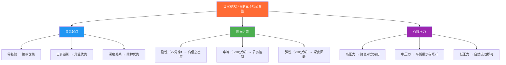
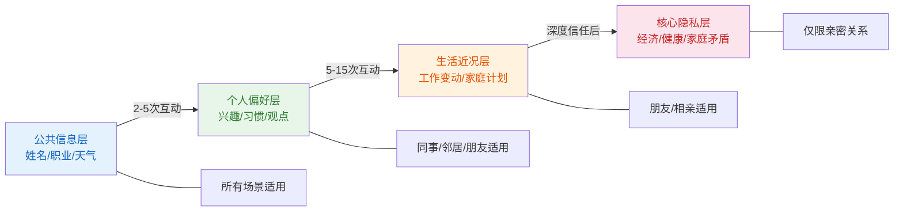
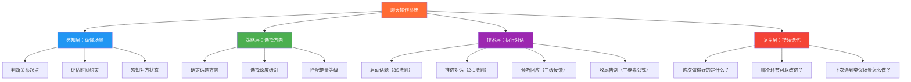

## 实战案例总结

走过八个典型场景的完整拆解之后，现在是时候退后一步，用更高的视角审视这些案例背后的共性规律。本节不是简单的"复习要点罗列"，而是一次从具体到抽象的系统性提炼——我们将从八个看似不同的场景中萃取出一套可迁移的聊天操作系统，让你在面对任何未被覆盖的新场景时，也能从容应对。

### 一、八场景全景回顾：一张表看懂全貌

在深入总结之前，先用一张对比表回顾八个场景的核心特征：

| 场景 | 关系起点 | 时间约束 | 心理压力 | 核心挑战 | 最关键的一句话技巧 |
|------|---------|---------|---------|---------|------------------|
| **初次见面** | 零基础 | 弹性（5-30分钟） | 高（未知恐惧） | 在未知中快速建立信任 | "你也是第一次来吗？" |
| **同事闲聊** | 功能性关系 | 刚性（1-5分钟） | 中（公私边界） | 在公事与私交之间找平衡 | "最近那个项目你参与了吗？" |
| **朋友聚会** | 已有关系基础 | 弹性（数小时） | 低-中 | 在熟人圈中拓展新连接 | "你们是怎么认识的？" |
| **相亲场合** | 预设评估框架 | 中等（1-2小时） | 高（评价焦虑） | 真实展现与策略展示的平衡 | "你平时周末一般怎么过？" |
| **微信群聊** | 松散群体关系 | 极弹性 | 低（匿名感） | 在群体中建立个人影响力 | 分享一条独家实用信息 |
| **电梯偶遇** | 可能不认识 | 刚性（30-90秒） | 高（身份落差） | 在极短时间内留下好印象 | "XX项目进展很顺利" |
| **排队等候** | 零基础 | 不确定 | 极低（随时退出） | 打破陌生感并自然收尾 | "今天人真多啊，您等多久了？" |
| **邻居碰面** | 空间锁定关系 | 弹性（1-10分钟） | 低 | 从点头之交发展为互助关系 | "你知道小区旁边那个新开的超市吗？" |

从这张表中可以提取出一个关键洞察：**所有场景的差异，本质上由三个变量决定——关系起点、时间约束、心理压力。** 理解这三个变量，你就能在任何新场景中快速判断策略方向。

### 二、贯穿八场景的五条底层规律

从具体的话术和技巧中抽离出来，所有成功的日常聊天都遵循以下五条底层规律。这些规律不是"正确的废话"，而是经过心理学研究验证、在八个场景中反复出现的行为模式。

#### 规律一：先给安全感，再推进深度

**原理：** 人脑中的杏仁核负责威胁检测。当一个人面对陌生人或不确定情境时，杏仁核会提高警觉水平，抑制前额叶皮层的理性社交功能。只有当杏仁核确认"安全"后，人才会放松防御、愿意交流。

**在八个场景中的体现：**

| 场景 | 安全感的来源 | 错误做法（破坏安全感） |
|------|------------|---------------------|
| 初次见面 | 微笑、开放姿态、共同朋友背书 | 直接问私人问题、过于热情 |
| 同事闲聊 | 工作话题作为安全起点 | 上来就聊私生活 |
| 朋友聚会 | 共同朋友作为信任桥梁 | 只跟老朋友聊，冷落新人 |
| 相亲场合 | 介绍人背书、公共场合 | 过早涉及婚姻/经济话题 |
| 微信群聊 | 群体氛围降低个人压力 | 第一条消息就发广告 |
| 电梯偶遇 | 简短寒暄确认友善意图 | 沉默不语制造尴尬 |
| 排队等候 | 共同处境提供天然话题 | 过度热情让人想逃 |
| 邻居碰面 | 物理邻近提供天然信任 | 第一次就聊20分钟 |

**实操法则：** 在任何场景中，开口后的前30秒只做一件事——传递"我没有敌意，我是友善的"这个信号。具体内容、深度、方向都不重要，安全感才是第一位的。

#### 规律二：匹配对方的能量等级

**原理：** 社会心理学中的"交互同步性"（Interactional Synchrony）研究表明，当两个人的语速、音量、情绪能量趋于一致时，双方都会感到更舒适、更有连接感。反之，能量不匹配会产生"社交失调感"——对方会觉得你"太吵"或"太冷"。

**匹配规则矩阵：**

| 对方的能量状态 | 你的匹配策略 | 具体表现 |
|--------------|------------|---------|
| 高能量（兴奋、健谈） | 略微提升自己的能量，但不超过对方 | 加快语速、增加表情、主动追问 |
| 中能量（正常、平和） | 保持与对方相似的节奏 | 正常语速、适度表情、平衡对话 |
| 低能量（疲惫、沉默） | 降低自己的能量，减少对方的回应压力 | 放慢语速、少问多说、接受沉默 |
| 负能量（烦躁、焦虑） | 先共情再引导，不急于"正能量"覆盖 | "确实挺烦的"比"别想太多了"有效100倍 |

**常见错误：** 用自己的能量等级去"覆盖"对方。对方已经很疲惫了，你还在滔滔不绝地讲笑话；对方明明兴致很高，你却一脸淡漠地回应。这种能量失调会让对方本能地想要结束对话。

#### 规律三：信息交换遵循"渐进式暴露"

**原理：** 社会渗透理论（Social Penetration Theory）的核心主张是：健康的人际关系发展遵循"由外到内"的信息交换节奏——从公共信息（姓名、职业）到个人偏好（兴趣、习惯）再到核心隐私（经济状况、家庭矛盾），每一层都需要前一层的信任基础。

**八个场景中的暴露节奏对比：**

**关键警示：** "越级暴露"是日常聊天中最常见的致命错误之一。相亲场合第一次见面就问收入、邻居第三次碰面就聊家庭矛盾、同事第二天就倾诉感情问题——这些都是在信任基础尚未建立时强行深入，结果往往适得其反，对方会产生强烈的防御心理。

**正确做法：** 每次互动只深入一层。如果对方主动深入了一层，你可以跟随；但永远不要比对方多暴露一层以上。让信息交换的节奏由"较保守的那一方"来决定。

#### 规律四：对话是双向的价值交换，不是单向的表演

**原理：** 人类社交的本质是价值交换。这里说的"价值"不仅仅是物质利益，更包括信息价值（有用的知识）、情感价值（被理解、被支持的体验）、社交价值（人脉连接、面子）和娱乐价值（有趣、开心的体验）。

**八个场景中的价值交换模式：**

| 场景 | 你提供的典型价值 | 你获得的典型价值 | 交换特征 |
|------|----------------|----------------|---------|
| 初次见面 | 对对方的兴趣关注 | 新的人脉可能性 | 试探性交换 |
| 同事闲聊 | 行业信息、工作协助 | 团队归属感、信息渠道 | 低频持续交换 |
| 朋友聚会 | 连接不同圈子的人 | 情感支持、社交拓展 | 多边交叉交换 |
| 相亲场合 | 真诚的关注和倾听 | 潜在的伴侣关系 | 高期望值交换 |
| 微信群聊 | 有用信息、幽默感 | 群体影响力、归属感 | 公开表演性交换 |
| 电梯偶遇 | 简洁的工作汇报/问候 | 领导的印象分 | 极短时高密度交换 |
| 排队等候 | 打发无聊的陪伴感 | 短暂的社交愉悦 | 零承诺即时交换 |
| 邻居碰面 | 本地信息、互助支持 | 生活便利、安全感 | 长期低强度交换 |

**实操检验标准：** 每次对话结束后问自己——"在这段对话中，对方获得了什么？"如果答案是"什么都没获得，我只是在说自己"，那你需要调整策略。

**最常见的失衡模式：**

- **只问不说型：** 不停地提问，却从不分享自己的信息。对方感觉自己在接受审问。
- **只说不听型：** 滔滔不绝地讲自己的故事，从不追问或回应对方。对方觉得自己只是观众。
- **只索取不付出型：** 只在需要帮忙时才联系，平时消失不见。对方觉得自己只是工具人。
- **只付出不索取型：** 总是主动帮忙、主动分享，却从不向对方提出任何需求。长期下来关系会失衡，因为对方没有"回报"的机会。

#### 规律五：每一次对话都有"记忆锚点"

**原理：** 认知心理学中的"系列位置效应"（Serial Position Effect）表明，人们对一段经历的记忆集中在两个点——开头（首因效应）和结尾（近因效应）。对话中的中间部分往往被遗忘，而开头的第一印象和最后的印象会被大脑优先编码和存储。

**在八个场景中的应用：**

| 场景 | 开头锚点（第一印象） | 结尾锚点（最后印象） |
|------|-------------------|-------------------|
| 初次见面 | 自我介绍中的"连接钩子" | "加个微信吧，回头分享给你" |
| 同事闲聊 | 自然的环境观察切入 | "先忙了，回头再聊" |
| 朋友聚会 | 对新人的热情接纳 | "今天认识你很高兴" |
| 相亲场合 | 得体的形象+真诚的微笑 | "今天聊得很开心，回去路上注意安全" |
| 微信群聊 | 第一次发言的质量决定了群内人设 | 最后一条消息的调性 |
| 电梯偶遇 | 进门时的自然问候 | "到了，先走了" |
| 排队等候 | 一句低门槛的环境观察 | "到我了/我先走了，祝您顺利" |
| 邻居碰面 | 微笑点头 | "下次再聊" |

**实操法则：** 不要在对话快结束时突然变得敷衍——"好了我走了"比"今天聊得很开心，回头联系"差100倍。**有意识地设计你的"退场台词"**，让它成为对方记忆中最温暖的部分。

### 三、跨场景可迁移的核心技术

在八个场景中反复出现、且经过验证有效的技术，提炼为以下四类可迁移的核心技术。

#### 技术一：话题启动的"3S法则"

不管什么场景，启动话题都需要满足三个条件：

| 条件 | 含义 | 正确示例 | 错误示例 |
|------|------|---------|---------|
| **Safe（安全）** | 话题本身不会引发不适 | "今天天气真不错" | "你觉得加班合理吗？" |
| **Shared（共享）** | 双方都能参与讨论 | "这个排队也太长了吧" | "我最近在学Python"（对方不懂） |
| **Specific（具体）** | 足够具体，对方有话可接 | "你这杯咖啡什么口味的？" | "你觉得生活怎么样？" |

**3S法则的高级应用——话题转换的"桥接术"：**

当一个话题即将耗尽时，不要生硬地切换到新话题，而是用"桥接"的方式自然过渡：

话题A → "说到这个，我想起……" → 话题B
话题A → "对了，你刚才提到XX……" → 话题B
话题A → "这让我想起一个问题……" → 话题B

桥接的核心是：**新话题必须与旧话题有某种逻辑关联**（因果、对比、联想、补充），而不是随机跳跃。

#### 技术二：倾听的"三级反馈"升级路径

在所有场景中，"如何回应对方说的话"比"自己说什么"更重要。三级反馈模型提供了一个清晰的升级路径：

| 反馈级别 | 方式 | 效果 | 适用场景 |
|---------|------|------|---------|
| **第一级：确认性** | "嗯""是的""确实" | 让对方知道你在听 | 所有场景的基础 |
| **第二级：复述性** | "所以你的意思是……" | 让对方感到被理解 | 需要深化对话时 |
| **第三级：共情性** | "听起来那件事对你影响挺大的" | 让对方感到被理解且被尊重 | 关系较深、话题较私人时 |

**使用注意：**

- 第一级反馈是"保底操作"，任何时候都必须有——沉默不语是最差的回应
- 第二级反馈是建立深度对话的关键工具——复述对方的关键词，能激发对方展开更多
- 第三级反馈需要谨慎使用——在关系不深时过早共情，会让对方觉得"我们没那么熟"
- 八个场景中，初次见面和排队等候以前两级为主；朋友聚会和相亲场合可以适度使用第三级；同事闲聊和邻居碰面根据话题深度灵活选择

#### 技术三：对话节奏的"2-1法则"

推动对话的节奏不是随机的。"2-1法则"指：**每提出2个问题后，穿插1段自己的分享。**

这个法则解决了一个根本矛盾——只问不说像审问，只说不听像表演。2-1的节奏让双方都感到舒适：对方知道你感兴趣（因为你在问），同时不觉得被盘问（因为你也分享了自己的信息）。

**不同场景的变体：**

| 场景 | 推荐节奏 | 原因 |
|------|---------|------|
| 初次见面 | 2问1分享 | 对方更愿意聊自己的话题 |
| 同事闲聊 | 1问1分享 | 双方信息量对等 |
| 朋友聚会 | 1问2分享 | 已有信任基础，多分享近况 |
| 相亲场合 | 2问1分享 | 对方也在评估你，需要了解你 |
| 排队等候 | 3问1分享 | 短时间内以对方为中心 |
| 邻居碰面 | 1问1分享 | 平等互助关系 |

#### 技术四：收尾的"三要素公式"

不管什么场景，好的收尾都需要包含三个要素：

| 要素 | 作用 | 示例 |
|------|------|------|
| **肯定信号** | 表达这段对话的价值 | "今天聊得很开心""和你聊天很有收获" |
| **具体锚点** | 让对方记住你 | "你说的那本书我回去看看""你推荐的那个餐厅我试试" |
| **未来接口** | 为后续互动留下入口 | "加个微信吧""下次再聊""回头联系" |

**三要素的灵活组合：**

- 短场景（电梯、排队）：只需要"肯定信号"即可——"跟你聊天挺开心的"
- 中场景（邻居、同事）：需要"肯定信号"+"未来接口"——"你说的那个超市我去看看，下次再聊"
- 长场景（初次见面、相亲、聚会）：三个要素全部需要——"今天聊得很开心，你说的那本书我回去找来看看，加个微信吧回头联系"

### 四、八大场景的错误模式总览

从八个场景中提取出最常见、最具破坏力的错误模式，以及对应的纠正方法：

| 错误模式 | 表现 | 出现场景 | 根本原因 | 纠正方向 |
|---------|------|---------|---------|---------|
| **过度热情** | 第一次见面就拉着对方聊20分钟、加微信、约饭 | 初次见面、邻居碰面 | 混淆了"主动"和"强势"的区别 | 首次互动控制在3-5分钟，给对方退出的自由 |
| **审问式提问** | 连续问3个以上问题，对方感觉被盘问 | 所有场景 | 不知道如何自然地分享自己 | 遵循2-1法则，每2个问题穿插1段分享 |
| **越级暴露** | 关系不深就聊收入、家庭矛盾、健康问题 | 相亲、同事、邻居 | 用自己的节奏代替双方共同的节奏 | 每次互动只深入一层，让较保守的一方决定节奏 |
| **只说不听** | 滔滔不绝讲自己，从不追问或回应对方 | 朋友聚会、相亲、同事 | 过度关注自我展示，忽略对方的需求 | 有意识地在每段分享后问一个问题 |
| **能量失调** | 对方疲惫时你很亢奋，对方兴奋时你很冷淡 | 所有场景 | 没有观察和匹配对方的状态 | 先观察对方3秒，再决定自己的能量等级 |
| **敷衍收尾** | "好了我走了""嗯""行吧" | 同事、邻居、电梯 | 不重视结尾的"记忆锚"作用 | 提前设计退场台词，包含肯定信号和未来接口 |
| **话题跳跃** | 从天气突然跳到政治，从工作突然跳到八卦 | 所有场景 | 不会使用话题桥接术 | 用"说到这个""对了""你刚才提到"来过渡 |
| **忽视信号** | 对方明显不想继续某话题，你还在说 | 所有场景 | 缺乏对非语言信号的敏感度 | 观察对方的眼神、身体朝向、回答长度 |
| **功利性社交** | 只在需要帮忙时才联系 | 同事、邻居、朋友 | 把关系当工具而非长期投资 | 平时也主动互动，不要等"有事"才出现 |
| **八卦传播** | 把A的事告诉B，或在背后议论他人 | 邻居、同事、微信群 | 缺乏信息边界意识 | 守口如瓶，在任何场景中不传闲话 |

**错误恢复的通用话术模板：**

当你说错话或做错事时，不要慌张，也不要用更多的错误来"弥补"。以下是可以跨场景使用的恢复模板：

审问式提问后的恢复：
"不好意思，我问太多了。其实我自己……（转向分享）"

说了不合适话题后的恢复：
"哎，这个话题有点沉了。对了，你刚才说的那个XX挺有意思的……（转向安全话题）"

发现自己一直在说的恢复：
"我说太多了，抱歉。你呢？你怎么看？（把话筒交给对方）"

冷场后的恢复：
"对了，我最近看到一个挺有意思的事……（准备好的备用话题）"

### 五、从场景到能力：建立你的聊天操作系统

八个场景走完之后，真正的收获不是记住了多少话术，而是建立了一套**可迁移的聊天操作系统**。这个系统由四个层次组成：

#### 第一层：感知层——在开口之前先读懂场景

每次对话开始前，用3秒钟回答三个问题：

1. **我和对方的关系起点是什么？**（零基础/点头之交/熟悉/深度关系）
2. **当前的时间约束是什么？**（刚性<2分钟/中等5-30分钟/弹性>30分钟）
3. **对方当前的状态是什么？**（高能量/中能量/低能量/负能量）

这三个问题的答案，直接决定了你接下来的策略选择。

#### 第二层：策略层——基于感知做出决策

| 感知结果 | 策略选择 |
|---------|---------|
| 零基础+刚性时间+中性状态 | 极简破冰，不追求深度，友好收尾即可 |
| 零基础+弹性时间+积极状态 | 主动寻找共同点，适度深入，建立联系方式 |
| 点头之交+中等时间+积极状态 | 从具体信息需求切入，推动关系升温 |
| 熟悉关系+弹性时间+积极状态 | 分享近况、深化连接、讨论观点 |
| 任何关系+任何时间+负能量 | 先共情再引导，不要强行推进，适时收尾 |

#### 第三层：技术层——用四个核心技术执行对话

1. **启动话题**：用3S法则（Safe、Shared、Specific）选择安全、共享、具体的话题
2. **推进对话**：用2-1法则（2问1分享）保持节奏平衡
3. **倾听回应**：用三级反馈（确认→复述→共情）让对方感到被理解
4. **收尾告别**：用三要素公式（肯定信号+具体锚点+未来接口）留下好印象

#### 第四层：复盘层——每次对话后的自我迭代

不需要每次对话都写日记，但养成一个简单的习惯：**每次有意义的对话结束后，花10秒钟问自己一个问题——"如果重新来一次，我会在哪里做得不同？"**

长期积累下来，你会发现自己形成了一种"社交直觉"——不需要刻意思考策略，就能自然地做出恰当的反应。这种直觉不是天赋，而是无数次复盘的累积结果。

### 六、不同水平阶段的进阶路径

根据你的当前水平，选择对应的提升方向：

| 阶段 | 典型表现 | 核心瓶颈 | 下一步行动 |
|------|---------|---------|-----------|
| **入门** | 不知道怎么开口，害怕冷场，经常尬聊 | 缺乏基础话术和安全感 | 背熟5个万能开场白，每次社交只练习"开口"这一件事 |
| **初级** | 能开启对话但很快冷场，不知道聊什么 | 话题储备不足，不会追问 | 准备10个跨场景话题库，练习"追问细节"技术 |
| **中级** | 能维持正常对话，但缺乏深度和亮点 | 不会匹配对方节奏，收尾草率 | 练习"能量匹配"和"2-1法则"，设计退场台词 |
| **高级** | 能灵活应对各种场景，对话有节奏有深度 | 在陌生新场景中策略反应不够快 | 建立"感知→策略→技术→复盘"的四层操作系统 |
| **精通** | 不需要思考策略就能自然地高质量社交 | 形成了个人独特的社交风格 | 回归"真诚"二字——所有技巧都内化为自然行为 |

**从入门到精通的最短路径：**

不要试图同时掌握所有技巧。最有效的练习方式是**每次只聚焦一个技术**，在真实场景中反复练习直到它变成习惯，再学下一个。推荐的学习顺序是：

1. 先学"开口"——准备5个万能开场白，克服不敢开口的恐惧
2. 再学"追问"——练习在对方说完后追问一个细节，让对话自然延续
3. 再学"倾听"——练习用复述性反馈让对方感到被理解
4. 再学"收尾"——设计你的退场台词，让每次对话的结尾都温暖而有记忆点
5. 最后学"感知"——培养在开口前3秒读懂场景的能力

### 七、终极回归：技巧之上是真诚

所有的框架、法则、公式，最终都要服务于一个更本质的东西——**真诚**。

八个场景中最成功的对话，不是话术最精妙的，而是双方都感到"和这个人聊天很舒服"的。这种"舒服"不是靠技巧制造的幻觉，而是来自三个真实的心理体验：

1. **被看见**——对方认真听了你说的话，而不是在想下一句该说什么
2. **被尊重**——对方尊重你的边界，没有强迫你深入你不想聊的话题
3. **被珍视**——对方觉得和你聊天是有价值的，而不是在浪费时间

技巧是桥梁，不是目的地。当你把所有技巧内化为自然行为之后，你最终会回到一个最简单也最强大的状态——**做你自己，同时让对方也做他自己。**

这就是日常聊天的最高境界：不是你说了多么精彩的话，而是对方在离开时觉得——**"和这个人聊天，时间过得真快。"**
