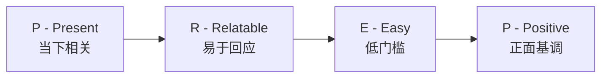
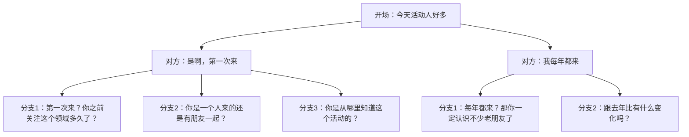
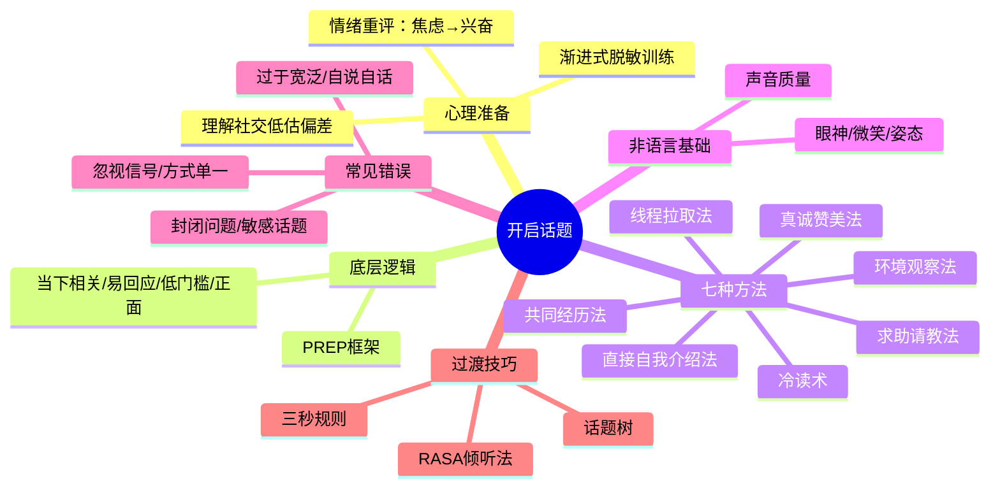

## 一、开启话题：打破沉默的第一步

开启话题是日常聊天中最关键、也最令人紧张的环节。正如前文所述，闲聊的本质是"寒暄交流"（phatic communion），开启话题的目的不是传递信息，而是发出"我愿意与你建立连接"的信号。理解这一点，就能从根本上减轻开口的心理负担——你不需要说出什么惊天妙语，只需要让对方感受到你的善意和关注。

### 1.1 为什么开口这么难：心理障碍的深层解析

许多人在社交场合中最害怕的就是"开口说第一句话"。这种恐惧并非矫情，而是有深层的心理机制在起作用。

#### 1.1.1 大脑的威胁检测系统

神经科学研究表明，人类大脑中的杏仁核（amygdala）会将社交排斥检测为与身体疼痛类似的威胁。当我们考虑主动与陌生人搭话时，大脑会自动评估被拒绝的风险，这种评估往往被过度放大——心理学家称之为"聚光灯效应"（Spotlight Effect），即我们倾向于高估他人对我们的关注程度。

实际上，康奈尔大学Thomas Gilovich教授的研究发现，人们通常只注意到我们行为和外表的约50%，而我们自己却以为被关注了接近100%。换句话说，即使你的开场白不够完美，对方很可能根本没有在意。

#### 1.1.2 四种常见的心理障碍

| 心障类型 | 内心独白 | 真实情况 | 认知重构 |
|---------|---------|---------|---------|
| 害怕被拒绝 | "他肯定不想跟我聊" | 研究显示87%的人对主动搭话持正面态度 | "大多数人会欢迎友善的交流" |
| 完美主义 | "我得想个完美的开场白" | 开场白质量对对话成功率的影响不到15% | "自然比完美更重要" |
| 经验不足 | "我不知道该说什么" | 开启话题是有固定模式可学的技能 | "我只需要学会几个套路" |
| 过度自我意识 | "别人会觉得我很奇怪" | 主动社交被视为自信和友善的表现 | "主动的人反而被尊重" |

哈佛大学2021年发表在《Journal of Personality and Social Psychology》上的研究明确指出：人们系统性地低估了主动发起对话的积极效果。实验中，参与者预测与陌生人交谈会感到尴尬，但实际交谈后，他们的感受远比预期积极。这种"社交低估偏差"是阻碍我们开口的最大心理障碍。

#### 1.1.3 从"社交焦虑"到"社交兴奋"：情绪重评

心理学研究发现，焦虑和兴奋在生理层面几乎完全相同——心跳加速、手心出汗、呼吸急促。区别仅在于大脑对这些信号的解读。哈佛商学院Alison Wood Brooks的研究表明，当你感到紧张时，对自己说"我很兴奋"比说"我很冷静"更有效。这是因为从高唤醒状态（焦虑）转到低唤醒状态（冷静）很难，但从高唤醒状态转到另一种高唤醒状态（兴奋）则容易得多。

**实操建议：** 在开口之前，不要试图让自己冷静下来，而是告诉自己："这种心跳加速的感觉说明我很期待这次对话。"

### 1.2 开启话题的底层逻辑：PREP框架

在学习具体方法之前，先理解开启话题的底层逻辑。一个有效的开场白需要满足四个条件，可以用PREP框架概括：

- **Present（当下相关）**：话题与当前环境或情境相关，而不是凭空冒出来的问题
- **Relatable（易于回应）**：对方不需要特殊知识或准备就能回答
- **Easy（低门槛）**：不需要对方做深度思考，轻松作答
- **Positive（正面基调）**：传递积极情绪，而非抱怨或负面内容

用PREP框架来检验你的开场白：如果同时满足四个条件，就是一个好的开场；如果缺少任何一个，就需要调整。

### 1.3 七种经过验证的开启话题方法

以下是七种经过社交心理学研究和大量实践验证的开启话题方法，按使用场景从通用到特定排列。

#### 方法一：环境观察法——最自然的破冰方式

利用当前环境中的话题元素作为开场，是最自然、最安全的方式。它满足PREP框架的所有条件：与当下相关、对方易于回应、门槛极低、通常带有正面基调。

**核心原理：** 环境观察法之所以有效，是因为它创造了"共享注意力"（shared attention）。当两个人同时关注同一件事物时，大脑会自动产生"我们在一起体验"的感觉，这是建立连接的神经基础。

**具体话术模板：**

| 场景 | 开场白 | 进阶追问 |
|------|--------|---------|
| 餐厅/咖啡厅 | "这家店的装修风格挺有意思，你以前来过吗？" | "你平时喜欢什么类型的店？" |
| 会议/活动 | "今天的会场布置得真不错，比上次好多了。" | "你是第一次来还是老朋友了？" |
| 等待场景 | "这个队排得真长，你知道今天是什么活动吗？" | "你经常来这边吗？" |
| 天气/季节 | "今天这雨下得也太大了，你从哪边过来的？" | "你住得远吗？" |
| 公共交通 | "这趟车今天怎么这么挤，是出了什么事吗？" | "你每天通勤多久？" |

**高级技巧——"环境+感受"组合：** 不仅描述环境，还加上你的感受或判断，这样给对方更多接话的切入点。

- 基础版："今天天气真热。"（只描述环境，对方只能回"是啊"）
- 进阶版："今天热得我出门五分钟就后悔了，你怎么扛过来的？"（环境+感受+提问，对方有三个点可以回应）

#### 方法二：共同经历法——最快建立连接

如果双方有共同的经历或背景，以此作为话题切入点是最有效的方式。社会心理学中的"相似性-吸引效应"（Similarity-Attraction Effect）表明，人们天然倾向于喜欢与自己相似的人。

**核心原理：** 共同经历之所以强大，是因为它同时激活了两个社交心理机制——"内群体偏好"（我们属于同一个群体）和"共享现实"（我们对世界有相似的理解）。这比单纯的赞美或提问更能快速建立信任。

**具体话术模板：**

| 共同经历类型 | 开场白 | 心理效果 |
|------------|--------|---------|
| 共同朋友 | "你也是王总介绍来的吧？你们是怎么认识的？" | 建立信任链 |
| 共同活动 | "刚才那个演讲真有意思，你觉得他说的那个案例靠谱吗？" | 创造共享观点 |
| 共同困境 | "今天这个交通真是让人崩溃，你从哪边过来的？" | 产生同理心 |
| 共同身份 | "你也是XX届的吗？那你认识XXX吗？" | 激活群体归属 |
| 共同兴趣 | "我看你也在看这本书，你觉得写得怎么样？" | 发现共同话题 |

**高级技巧——"桥梁人物"法：** 如果你们是通过共同认识的人来的，以这个人为"桥梁"展开对话。这不是八卦，而是利用社会网络的天然连接点。例如："李总上次跟我提过你，说你在XX领域特别有经验。"这样既赞美了对方，又借助了第三方的信任背书。

#### 方法三：真诚赞美法——最直接的好感表达

真诚的赞美是开启话题的利器。关键在于赞美要**具体、真诚、可回应**，而不是泛泛的恭维。

**赞美的三个层次：**

| 层次 | 类型 | 示例 | 效果 |
|------|------|------|------|
| 表层 | 赞美外在物品 | "你这个包挺好看的，是什么牌子的？" | 安全但较浅 |
| 中层 | 赞美具体行为 | "你刚才在会上的发言真有见地，那个角度我之前没想到。" | 表达认可 |
| 深层 | 赞美内在品质 | "你处理那个突发情况的方式真沉着，一看就是经历过大场面的人。" | 深度连接 |

**赞美的黄金公式：** 具体观察 + 你的感受 + 开放式问题

- 低效赞美："你真厉害。"（空洞，无法回应）
- 高效赞美："你刚才用那个类比解释技术概念的方式特别巧妙（具体观察），我第一次听懂了这个概念（你的感受），你是怎么想到用那种方式表达的？（开放式问题）"

**赞美的雷区：**
- 避免赞美对方无法改变的生理特征（身高、体重），这可能让对方不适
- 避免在赞美后紧跟否定词（"你今天穿得不错嘛，跟平时不一样"暗含平时不好的意思）
- 避免过度赞美，一到两个赞美元素就够了，多了显得谄媚
- 避免带有索取意图的赞美（赞美完马上提要求）

#### 方法四：求助请教法——最高效的开场策略

适当展示自己的"无知"，向对方请教问题，是开启话题的高级技巧。这利用了心理学中的"富兰克林效应"——帮助过你的人会更喜欢你。

**核心原理：** 当你向某人请教时，你在做三件事：（1）表达对对方能力的认可；（2）给对方一个展示自己的机会；（3）创造了一个"施与受"的关系，而这种关系会增加对方对你的好感。Benjamin Franklin在自传中记载，他通过向政敌借书成功将其转化为盟友。

**有效请教的条件：**

| 条件 | 说明 | 示例 |
|------|------|------|
| 在对方能力范围内 | 不要问对方不了解的领域 | 向设计师请教配色，而非编程 |
| 有一定难度但不复杂 | 太简单显得假，太复杂对方嫌烦 | "推荐一款性价比高的红酒"而非"教我品酒" |
| 对方能轻松回答 | 不需要对方做大量准备工作 | 随口推荐而非系统讲解 |
| 你的请教是真诚的 | 虚假的请教比不请教更糟糕 | 你确实对答案感兴趣 |

**高级技巧——"专业请教法"：** 如果你知道对方的专业领域，直接切入那个领域请教。例如在聚会上遇到一位医生："我最近总感觉颈椎不舒服，上班族是不是都有这个问题？"这种请教既自然又能让对方发挥专长。

#### 方法五：直接自我介绍法——最适用于正式场合

在某些场合，最简单直接的方式反而是最好的。不要小看"你好，我是XXX"这句话的力量——它传递的信号是"我对你坦诚开放，愿意建立正式的社交连接"。

**适用场景：**
- 商务社交活动、行业会议
- 被引荐给朋友的朋友
- 入职新公司的第一天
- 参加兴趣小组或课程

**自我介绍的进阶版——"身份+连接点"公式：**

| 版本 | 示例 | 效果 |
|------|------|------|
| 基础版 | "你好，我是张明。" | 能用，但缺乏连接点 |
| 进阶版 | "你好，我是张明，李总的同事。" | 借助第三方建立信任 |
| 高级版 | "你好，我是张明，李总的同事。他说今天这个活动你一定会来，让我一定找你聊聊。" | 有故事，有期待，有理由 |

**关键细节：** 自我介绍后一定要跟一个开放式问题或话题，否则对方只能回"你好"然后继续沉默。例如："我是隔壁部门的，第一次参加这个团建。你经常参加吗？"

#### 方法六：冷读术（Cold Reading）——最能制造惊喜

冷读术是一种通过观察对方的外表、行为、穿着等线索，做出合理推测的技巧。当你的推测正确时，对方会感到惊喜；即使不完全正确，也能引发有趣的讨论。

**核心原理：** 冷读术之所以有效，是因为它展示了你的观察力和对对方的关注。人都喜欢被"看见"的感觉——当你能从细节中读出信息时，对方会觉得你是一个有趣且有洞察力的人。

**冷读的线索来源：**

| 线索类型 | 可以推测的内容 | 示例开场白 |
|---------|--------------|----------|
| 穿着风格 | 职业、个性、审美偏好 | "你这身搭配很讲究，是不是做设计相关工作的？" |
| 随身物品 | 兴趣爱好、生活方式 | "你这本书我也看过，你是不是也喜欢XX类型的小说？" |
| 行为举止 | 情绪状态、社交风格 | "你看起来对这个话题特别感兴趣，之前有研究过吗？" |
| 外表特征 | 年龄段、生活状态 | "你看起来像经常运动的人，是不是有健身习惯？" |

**使用冷读术的注意事项：**
- 猜测要用"是不是"而非"肯定是"，给对方否认的空间
- 保持正面推测，不要做出可能让对方尴尬的判断
- 如果猜错了，优雅地转向："哈哈看来我观察力还得练，那你是做什么的？"
- 不要连续使用多次冷读，一到两次即可，多了像在审问

#### 方法七："线程拉取"法——最适用于线上社交

在线上社交（微信、社交媒体、论坛）中，开启话题的方式有所不同。"线程拉取"法是指从对方发布的内容中找到一个具体的"线程"，然后以此为切入点展开私聊。

**具体操作：**

| 线程来源 | 拉取方式 | 示例 |
|---------|---------|------|
| 朋友圈动态 | 对某条动态发表评论或追问 | "你上次发的那个餐厅看起来不错，在哪里？" |
| 共同群聊 | 对对方在群里的发言做延伸 | "你刚才在群里说的那个观点挺有意思的，能多说说吗？" |
| 个人签名/头像 | 从个人信息中找话题 | "你的头像是在XX拍的吗？那个地方我一直想去。" |
| 分享的文章/音乐 | 以内容为切入点 | "你分享的那篇文章我看了，作者那个论点你怎么看？" |

**线上开场的特殊注意事项：**
- 文字消息缺乏语气和表情，容易被误解，适当使用表情符号弥补
- 不要在深夜或清晨发消息，除非你们已经很熟
- 如果对方没有回复，不要连续追问，给对方空间
- 第一条消息不宜过长，三到五句话足够

### 1.4 不同场景的开场策略矩阵

不同社交场景需要不同的开场策略。以下是针对常见场景的策略矩阵：

| 场景 | 推荐方法 | 开场示例 | 要点 |
|------|---------|---------|------|
| 初次见面（正式） | 自我介绍法 + 环境观察法 | "你好，我是张明。这个活动办得挺不错的。" | 礼貌为主，建立正式连接 |
| 初次见面（非正式） | 环境观察法 + 冷读术 | "你这杯颜色挺好看的，是什么？" | 轻松随意，降低对方防备 |
| 同事闲聊 | 共同经历法 | "你周末过得怎么样？有什么好玩的吗？" | 从工作外的话题切入 |
| 朋友聚会 | 共同经历法 + 赞美法 | "好久不见，你最近状态看起来不错啊！" | 热情但不过度 |
| 相亲场合 | 求助请教法 + 冷读术 | "你是做什么工作的？我对你们行业挺好奇的。" | 表达真诚兴趣 |
| 电梯/排队 | 环境观察法 | "今天电梯等好久，你知道几楼有人搬东西吗？" | 简短自然，随时可中断 |
| 微信群聊 | 线程拉取法 | "你刚才说的那个观点我特别认同，能展开说说吗？" | 从具体内容切入 |
| 行业活动 | 共同经历法 + 求助请教法 | "你对XX技术怎么看？我最近在研究这个。" | 展示专业性同时保持谦虚 |

### 1.5 开启话题的非语言基础

在你开口说话之前，你的身体已经在"说话"了。研究表明，在面对面沟通中，非语言信息（表情、姿态、眼神）占到信息传递总量的55%以上（Albert Mehrabian, 1971）。一个完美的开场白如果配上僵硬的表情和封闭的姿态，效果会大打折扣。

#### 1.5.1 开启话题前的身体准备

| 要素 | 正确做法 | 常见错误 | 原因 |
|------|---------|---------|------|
| 眼神 | 自然对视，每隔3-5秒移开一下 | 死盯着看或完全不看 | 适度眼神接触传递自信和真诚 |
| 微笑 | 嘴角上扬，眼角有皱纹（真笑） | 嘴角上扬但眼睛无变化（假笑） | 杜兴微笑（Duchenne smile）更可信 |
| 姿态 | 身体微微前倾，双手自然放开 | 双手抱胸，身体后仰 | 开放姿态传递友善信号 |
| 距离 | 保持1-1.5米的社交距离 | 靠得太近让人压迫，太远显得疏远 | 尊重个人空间 |
| 头部 | 微微点头，头部略微倾斜 | 低头或仰头 | 头部倾斜表示倾听和兴趣 |

#### 1.5.2 声音的非语言要素

你的声音质量往往比说话内容更早被对方接收和评判：

- **语速：** 适中偏快（每分钟150-180字），太快显得紧张，太慢显得犹豫
- **音量：** 以对方能清晰听到为标准，不要太大声显得冒失，也不要太小声显得不自信
- **音调：** 略微提高音调传递热情和活力，过低的音调容易显得无精打采
- **停顿：** 在关键信息前略微停顿，可以吸引注意力

### 1.6 开启话题的常见错误与纠正

以下是初学者最常犯的错误，以及具体的纠正方法：

**错误一：开场白过于宽泛**

- 错误示例："今天天气不错啊。"（对方只能回"是啊"然后沉默）
- 纠正方法："今天天气不错啊，你有没有什么周末计划？"（环境观察+开放问题）
- 原则：开场白要包含一个对方可以接话的"钩子"

**错误二：开场后立刻自说自话**

- 错误示例：你说完开场白，不等对方回应就开始讲自己的故事
- 纠正方法：开场白说完后，停顿，给对方至少3秒的回应时间
- 原则：开启话题是邀请，不是独白的开始

**错误三：使用封闭式问题**

- 错误示例："你来过这里吗？"（对方回答"来过"或"没有"后，对话容易断）
- 纠正方法："你来过这里吗？第一次来是什么时候？"（封闭问题+开放追问）
- 原则：如果必须用封闭问题，后面紧跟一个开放问题

**错误四：开场就涉及敏感话题**

- 错误示例：初次见面就问收入、年龄、感情状况
- 纠正方法：从环境、活动、共同经历等中性话题开始
- 原则：信任建立需要时间，话题的深度应该随着关系的深入而递进

**错误五：忽视对方的回应信号**

- 错误示例：对方明显不想聊（简短回答、看手机、身体转向别处），你还在继续
- 纠正方法：注意对方的非语言信号，如果对方给出"不想继续"的信号，礼貌退出
- 原则：好的社交者不是能跟所有人聊起来，而是能判断谁愿意聊

**错误六：过度依赖同一种开场方式**

- 错误示例：每次都用"你是做什么工作的？"
- 纠正方法：根据不同场景灵活运用上述七种方法
- 原则：多准备几种开场方式，像工具箱里的工具一样按需取用

### 1.7 从开场到持续对话的过渡技巧

开场白只是第一步，真正的挑战在于如何从开场白自然过渡到持续的对话。以下是三种经过验证的过渡技巧：

#### 1.7.1 "三秒规则"——在开场后三秒内提供话题方向

开场白之后不要停顿太久，要在对方回应后迅速提供一个话题方向，否则对话容易陷入尴尬的沉默。

**示例流程：**
你："今天这个活动挺热闹的。"（环境观察法开场）
对方："是啊，人比我想的多。"
你："我也是第一次来，之前朋友一直推荐说这个活动不错。你是一个人来的还是跟朋友一起？"（三秒内提供方向）

#### 1.7.2 "话题树"——从一个话题生长出多个分支

想象话题是一棵树，主干是你的开场白，树枝是可能的延伸方向。在对话过程中，你要不断从对方的回答中识别新的"树枝"。

#### 1.7.3 "RASA倾听法"——用倾听为持续对话蓄能

RASA（Receive, Appreciate, Summarize, Ask）是Julian Treasure提出的倾听框架，可以在开场后的前几分钟内快速建立对话的正向循环：

- **Receive（接收）：** 全神贯注地听对方说话，不要分心
- **Appreciate（回应）：** 用"嗯""是的""有意思"等简短回应表示你在听
- **Summarize（总结）：** 用自己的话概括对方的要点，"所以你是说……"
- **Ask（提问）：** 基于对方的回答提出相关问题

### 1.8 开启话题的心理建设：日常训练方法

开启话题的能力是可以训练的。以下是经过验证的渐进式训练方案：

#### 1.8.1 四周渐进训练计划

| 周次 | 训练目标 | 具体任务 | 预期成果 |
|------|---------|---------|---------|
| 第一周 | 突破开口恐惧 | 每天向3个陌生人说"你好"（收银员、保安、路人） | 消除对开口的恐惧感 |
| 第二周 | 练习环境观察 | 每天用环境观察法开启1次对话（不限对象） | 能自然地从环境中找话题 |
| 第三周 | 综合运用 | 每天尝试用不同方法开启1次对话，持续至少2分钟 | 能灵活运用多种开场方式 |
| 第四周 | 实战检验 | 在真实的社交场合（聚会、活动）主动开启3次对话 | 能在压力环境下自如开场 |

#### 1.8.2 每日微练习

- **观察练习：** 每天在通勤路上观察3个人，尝试推测他们的职业、心情或目的地
- **赞美练习：** 每天对1个人（包括家人朋友）给出一个具体、真诚的赞美
- **开场白预演：** 在进入一个新的社交场合之前，提前想好3个可能的开场白
- **复盘练习：** 每次社交后回顾：哪些开场白效果好？哪些需要改进？

### 1.9 进阶：开场白的"元认知"——理解何时不需要开场

真正成熟的社交能力不仅包括知道如何开口，还包括知道何时不需要开口。以下情况中，保持沉默反而是更好的选择：

- **对方正在深度专注时：** 读书、工作、打电话、戴着耳机——这些信号表明对方目前不想被打扰
- **场合气氛不允许时：** 悲伤的场合、紧张的谈判、严肃的会议——强行社交会显得不识趣
- **你没有真诚的社交动机时：** 如果你只是为了"练习"而跟人搭话，对方能感受到你的不真诚
- **对方已经给出明确的"不想聊"信号时：** 简短回答、身体转向别处、持续看手机

**判断原则：** 开启话题的目的是建立连接，不是完成任务。如果当下的情境不利于建立连接，等待更好的时机比强行开口更明智。

### 1.10 本节要点回顾

开启话题是一项可以通过学习和练习掌握的技能，而不是一种天赋。记住，最有效的开场白不是最巧妙的那句话，而是传递出"我对你感兴趣，我愿意与你交流"这个信号的那句话。在下一节中，我们将讨论如何在成功开启话题后，让对话持续流动下去。
