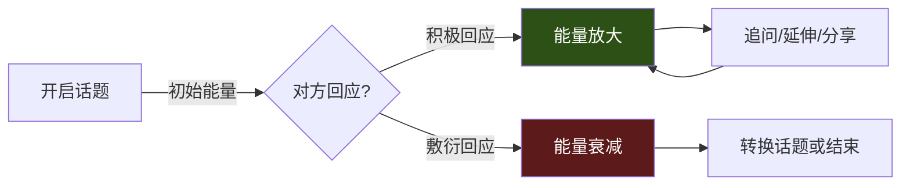
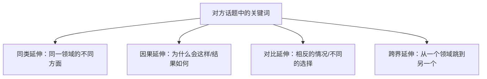
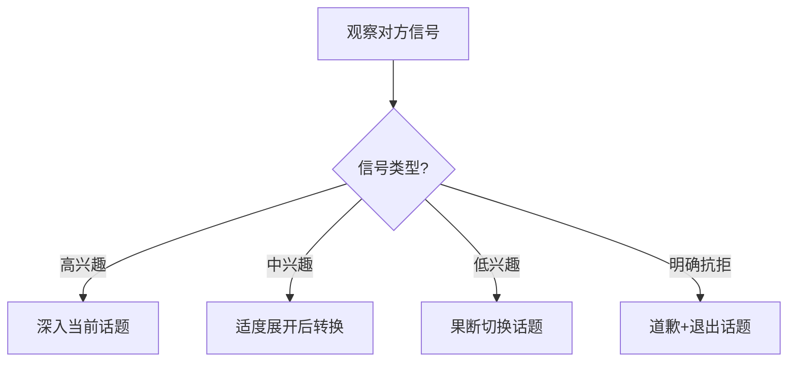

## 二、延续话题：让对话持续流动

开启话题只是敲门，延续话题才是真正的功夫。很多人能说出"你好"，却在三句话后陷入尴尬的沉默——问题不在于不知道说什么，而在于没有掌握让对话自然流动的方法。

延续话题不是"尬聊"或"硬撑"，而是一种有章法的沟通能力。它的本质是：**在倾听的基础上，用恰当的回应方式，让对方感到被理解、被重视，从而愿意继续展开对话。**

### 2.1 为什么延续话题比开启话题更难

#### 2.1.1 心理学视角：对话的"能量守恒"

一段对话就像一个能量系统。开启话题时，你投入初始能量；如果对方接住了，能量在两人之间传递和放大；如果没人接住，能量迅速耗散，对话就"死了"。

心理学家Mihaly Csikszentmihalyi提出的"心流"（Flow）理论同样适用于对话：当两个人的交流节奏匹配、话题有深度、彼此投入时，对话会进入一种"流动"状态——双方都感觉时间飞逝，意犹未尽。

#### 2.1.2 延续话题的底层逻辑

延续话题需要同时做到三件事，缺一不可：

| 底层能力 | 作用 | 缺失后果 |
|:---------|:-----|:---------|
| **专注倾听** | 准确捕捉对方话语中的信息点和情绪 | 答非所问，让对方觉得你没在听 |
| **即时联想** | 从对方的话中找到可以展开的线索 | 接话生硬，对话卡顿 |
| **适度自我暴露** | 分享自己的经历或观点建立连接 | 对方感觉像在"被采访" |

很多人只做到了第一条（假装在听），第三条完全缺失，结果就是单方面追问，对方很快疲劳。

### 2.2 延续话题的八种核心技巧

#### 2.2.1 追问细节法

对对方提到的内容追问具体细节，是最简单、最普适的延续方式。它的底层原理是**好奇心驱动**——当你表现出真诚的好奇，对方会感到被重视。

**追问的三个层次：**

- **事实层**：追问发生了什么、在哪里、什么时候
- **感受层**：追问当时的体验和情绪
- **意义层**：追问这件事对对方意味着什么

**实操示例：**

- 对方："我上周去了一趟云南。"
- 你（事实层）："云南啊！去了哪些地方？最喜欢哪里？"
- 对方："特别喜欢大理，洱海太美了。"
- 你（感受层）："听你这么说，感觉你当时一定很放松。那种感觉是怎样的？"
- 对方："就是那种什么都不用想，坐在海边发呆的感觉。"
- 你（意义层）："这种完全放空的状态现在太难得了。你平时压力很大吗？"

**追问的注意事项：**

- 每次追问1-2个问题，不要连珠炮式提问
- 问题要开放（"怎么样"、"什么感觉"），而非封闭（"是"、"不是"）
- 如果对方的回答很简短，可能是话题不感兴趣，及时切换

#### 2.2.2 感受回应法

先回应情绪，再展开讨论。很多人犯的错误是直接问"事实"而忽略了"感受"，结果让对话变成审讯。

**感受回应的公式：** `共情表达 + 情绪确认 + 开放式追问`

**实操示例：**

- 对方："我最近工作压力特别大，天天加班。"
- ❌ "是吗？加班有钱吗？"（忽略感受，直接跳到事实）
- ❌ "大家都这样。"（否定对方的独特感受）
- ✅ "听起来确实挺辛苦的（共情）。天天加班身体受得了吗（情绪确认）？是什么项目这么紧张（开放式追问）？"

**感受回应的高级用法——"情绪命名"：**

心理学研究表明，当我们能准确命名对方的情绪时，对方会感到被深度理解。

- 对方："辛辛苦苦做了一个月的方案，被领导一句话否了。"
- 你："那一定很**沮丧**吧。自己投入那么多心血，结果被一句话推翻——你当时是什么反应？"

关键词在于精准的情绪词汇：沮丧、委屈、焦虑、期待、兴奋、纠结……比"难受"、"开心"这类笼统的词更有力量。

#### 2.2.3 联想延伸法

从对方的话题中找到一个关键词，自然地联想到相关主题。这是让对话"横向扩展"的关键技能。

**联想的四个方向：**

**实操示例：**

- 对方："我最近在学吉他。"
- 同类延伸："学的民谣还是电吉他？有没有在学某首特定的歌？"
- 因果延伸："是什么契机让你决定学吉他的？"
- 对比延伸："我之前试过学钢琴，手指不够灵活就放弃了。吉他上手难吗？"
- 跨界延伸："会弹吉他的人去KTV应该很有优势吧？你平时喜欢唱歌吗？"

**联想延伸的训练方法：**

每天练习"关键词联想"：随机看到一个词（比如"咖啡"），在30秒内想出至少5个相关话题方向。长期训练后，你在对话中的联想速度会显著提升。

#### 2.2.4 共同经历法

分享自己的相关经历，与对方建立共鸣。这是从"倾听者"转变为"参与者"的关键一步。

**共同经历法的要点：**

1. **比例控制**：对方说3句，你分享1句。不要喧宾夺主
2. **关联性**：你的经历必须和对方的话题相关，不能生硬转移
3. **回归对方**：分享完后，把话题抛回给对方

**实操示例：**

- 对方："我女儿今年上小学了。"
- 你："哇，小学是个重要的阶段！我侄子去年刚上小学，一开始还有点不适应（分享）。你女儿适应得怎么样（回归对方）？"
- 对方："还行，就是每天早上起床是个大工程。"
- 你："哈哈，这个我太理解了。我记得我小时候每天早上都要被叫好几遍（共鸣）。你有什么叫她起床的好办法吗（推进话题）？"

**常见错误——"抢话"：**

- 对方："我最近在学烘焙。"
- ❌ "我也是！我上周做了一个戚风蛋糕超级成功，我跟你说，秘诀是……"（完全抢走了话语权）
- ✅ "真的吗？烘焙很有意思。做了什么好吃的？"（先让对方说完，再找机会分享）

#### 2.2.5 观点交流法

在对方分享后，表达自己的看法或思考，引发更深层的讨论。这是让对话从"闲聊"升级为"深度交流"的关键。

**观点交流的层次：**

| 层次 | 说明 | 示例 |
|:-----|:-----|:-----|
| **认同+补充** | 先表示认同，再补充新的信息 | "确实如此，而且我还发现……" |
| **部分认同+新角度** | 承认对方有道理，同时提出不同视角 | "你说的有道理，不过从另一个角度看……" |
| **好奇式质疑** | 用好奇而非否定的态度提出疑问 | "这个观点挺有意思，我好奇的是……" |

**实操示例：**

- 对方："我觉得远程办公挺好的，效率高多了。"
- 你（认同+补充）："确实是，节省了通勤时间。而且我发现在家工作时，那种被打断的次数少了很多。你觉得最大的好处是什么？"
- 对方："主要是时间自由了，可以自己安排节奏。"
- 你（新角度）："时间自由确实是很大的优势。不过我有时候发现，自由多了反而容易拖延。你是怎么保持自律的？"

**观点交流的禁忌：**

- ❌ 不要为了"显得有想法"而强行反驳
- ❌ 不要把观点交流变成辩论赛
- ❌ 不要用"你说得不对"开头——换成"我的理解略有不同"

#### 2.2.6 幽默回应法

在合适的时候用幽默来回应，能迅速拉近距离、活跃气氛。幽默是社交的润滑剂，但也是最难掌握的技巧。

**安全的幽默类型：**

- **自嘲**：拿自己开玩笑，最安全也最讨喜
- **夸张**：把对方的话适度夸张，制造喜剧效果
- **意外转折**：在对方预期之外给出一个轻松的回答

**实操示例：**

- 对方："我今天出门才发现衣服穿反了。"
- 自嘲："这种事我干过更离谱的——我有次穿着拖鞋去上班，到公司才发现。"
- 夸张："穿反衣服？那你今天一定自带'反转人生'的好运气！"
- 意外转折："没事，说不定这是今年的流行趋势呢。后来发现了尴尬吗？"

**幽默的红线：**

- 不拿对方的外貌、身材、缺陷开玩笑
- 不在对方表达负面情绪时强行幽默
- 不讲可能冒犯对方的段子（性别、地域、宗教）
- 不确定是否合适时，宁可不开玩笑

#### 2.2.7 假设推演法

根据对方的描述，假设一种场景或结果，引导对话走向新方向。这个技巧适合对方的话题已经"说完一轮"时使用。

**实操示例：**

- 对方："我最近在考虑要不要跳槽。"
- 你："如果跳槽的话，你最想去什么类型的公司？"
- 对方："想去那种创业公司吧，感觉更有挑战。"
- 你："创业公司确实成长快。你有没有想过，如果去了一家创业公司，三年后你希望自己在什么位置？"

**假设推演的价值：**

它把对话从"回顾过去"推进到"展望未来"，让讨论更有深度，也更容易发现对方的价值观和期待。

#### 2.2.8 沉默善用法

很多人害怕对话中的沉默，急着填补空白。但适当的沉默不仅无害，反而能让对话更有质量。

**沉默的三种用法：**

1. **思考性沉默**：对方说了一段深思熟虑的话后，你停顿2-3秒表示在认真消化，而不是立刻回应
2. **邀请性沉默**：你说完一段话后适当停顿，给对方留出回应空间
3. **陪伴性沉默**：对方情绪低落时，不需要说太多，安静的陪伴本身就是最好的回应

**实操示例：**

- 对方："我爸最近查出了问题，我……"（声音哽咽）
- ❌ "没事的，现在医学很发达！"（急于安慰，反而显得敷衍）
- ✅ （安静几秒，轻轻点头）"嗯……你还好吗？"（给对方空间表达）

### 2.3 延续话题的信号识别系统

延续话题不是"我说了算"，而是双方共同参与的过程。学会识别对方的信号，才能做出正确的应对。

#### 2.3.1 话题兴趣信号矩阵

| 信号等级 | 语言信号 | 非语言信号 | 应对策略 |
|:---------|:---------|:-----------|:---------|
| **高兴趣** | 主动补充细节、提出相关问题、"真的吗？""然后呢？" | 身体前倾、眼神专注、表情丰富、点头 | 深入追问，展开讨论 |
| **中兴趣** | 回答完整但不主动延伸 | 保持基本的眼神接触，偶尔回应 | 适度展开，准备备选话题 |
| **低兴趣** | 回答简短（"嗯"、"还行"、"是吧"） | 眼神游移、频繁看手机、身体后仰 | 2句话内转换话题 |
| **明确抗拒** | 沉默、答非所问、直接说"换个话题吧" | 转身、看表、打哈欠、皱眉 | 立即停止，礼貌转换 |

#### 2.3.2 数字化场景的信号识别

在线上聊天中，非语言信号完全消失，你需要通过文字线索来判断：

**高兴趣信号：**
- 回复速度快（分钟级）
- 消息长度超过你的消息
- 主动发送语音或图片
- 使用表情符号或感叹号
- 主动提出新话题

**低兴趣信号：**
- 回复间隔越来越长
- 只用"嗯""哦""哈哈"等单字回复
- 从不主动发起话题
- 你问一句答一句，从不追问
- 频繁使用"忙去了""我要去洗澡了"

**关键判断原则：** 三个连续的低兴趣信号，基本可以确定对方不想继续当前话题。此时最明智的做法是优雅退场，而不是加大投入。

### 2.4 不同场景的延续策略

#### 2.4.1 面对面聊天

面对面聊天信息最丰富——语言、表情、肢体动作、语调都是信号源。

**核心策略：**
- 善用非语言回应（点头、微笑、"嗯嗯"、眼神接触）
- 注意对方的肢体语言变化
- 保持合适的物理距离（社交距离约1.2米，朋友距离0.5-1米）
- 话题切换时可以用动作辅助（比如拿起饮料喝一口，自然过渡）

#### 2.4.2 微信/文字聊天

文字聊天缺少语调和表情，更容易产生误解。

**核心策略：**
- 善用表情符号弥补情感表达的缺失
- 每2-3条消息可以发一段语音，增加亲切感
- 不要只问封闭式问题，否则容易变成"查户口"
- 回复长度与对方保持大致匹配——对方发一句你发一句，对方发三句你也可以多说几句
- 适当使用"哈哈哈""表情包"来调节气氛

**文字聊天的延续话术模板：**

对方发了一段经历 → 你: [共情] + [追问细节] + [表情]
对方发了一个观点 → 你: [认同/补充] + [新角度] + [反问]
对方发了一张图片 → 你: [具体描述] + [联想延伸]

#### 2.4.3 群聊场景

群聊中延续话题更复杂，因为你需要同时关注多人。

**核心策略：**
- 先回应说话的人，再@其他人引发讨论
- 善用"投票""接龙"等互动形式
- 不要一个人霸占话题，主动把发言机会让给别人
- 可以在群里"转述"某个人的观点，引发更多人参与

### 2.5 延续话题的常见误区

#### 误区一：把"追问"当"审讯"

❌ "你去哪了？和谁去的？花了多少钱？住了什么酒店？"（连续追问像查岗）

✅ 每次只追问一个方向，问完给对方空间回应。如果对方没有展开的意思，及时转换。

#### 误区二：只当"提问机器"

全程提问、从不分享自己的人，会让对方感到在"接受采访"。

✅ 遵循"3:1法则"——对方说3句，你至少分享1句自己的相关经历或观点。

#### 误区三：强行延续已经"死掉"的话题

当对方已经明显不感兴趣时，继续在同一个话题上努力是徒劳的。

✅ 识别三个低兴趣信号后果断转换。话题"死掉"不是你的失败，而是信息——告诉你该换个方向了。

#### 误区四：用"嗯""哦""是吧"敷衍回应

这些词本身没问题，但如果每句回应都是这些，对话会迅速枯萎。

✅ 每次回应至少包含一个信息增量——一个新问题、一个新观点、一个新联想。

#### 误区五：过度自我暴露

有些人为了让对话继续，会急切地分享自己的隐私或负面经历，让对方感到不适。

✅ 自我暴露要循序渐进。初期只分享轻松的经历，随着关系深入再逐步加深。

#### 误区六：忽略话题的"自然终点"

不是所有对话都要无限延续。有时候话题自然走到了尽头，继续硬撑反而尴尬。

✅ 识别对话的自然收尾点，用"今天聊得很开心"、"下次继续聊"等方式优雅结束。

### 2.6 进阶技巧：对话流的高级管理

#### 2.6.1 多线程话题管理

高水平的聊天者不会只在一条话题线上走到底，而是同时维护2-3条话题线，根据气氛灵活切换。

**操作方法：**

在对话过程中，悄悄记住对方提到的多个信息点。当当前话题快要结束时，回到之前的信息点展开新方向。

**示例：**

- 对方提到："我最近工作很忙，周末还去学了烘焙。"
- 你先围绕"工作忙"展开，聊了几轮后自然过渡——
- "对了，你刚才说在学烘焙，都做了些什么？"

这样做的好处是：对话不会因为一条线断掉就彻底冷场，你总有备用话题可以激活。

#### 2.6.2 情绪节奏管理

一段好的对话像一首曲子，有起伏、有高潮、有留白。

**节奏控制的要点：**
- 不要一直停留在轻松表面，也不要一直深入沉重话题
- 在情绪高潮后留出几秒沉默，让双方消化
- 如果气氛变得太沉重，用幽默或新话题轻轻带过

#### 2.6.3 "话题银行"——提前储备谈资

延续话题的能力很大程度上取决于你的"话题储备量"。平时有意识地积累谈资，关键时刻就不会词穷。

**话题储备清单：**

- 最近看过的电影、剧集、书籍
- 最近的新闻热点（选择轻松愉快的话题）
- 有趣的个人经历或见闻
- 美食、旅行、运动等大众话题
- 对方之前提到过的事情（最高级的话题储备）

### 2.7 自检清单：你的延续能力到了哪个层级

| 层级 | 表现 | 对应技巧 |
|:-----|:-----|:---------|
| **入门** | 能接住对方的话，不冷场 | 追问细节法、感受回应法 |
| **进阶** | 能让对话自然深入，对方愿意多聊 | 联想延伸法、共同经历法、观点交流法 |
| **高手** | 能管理多条话题线，控制对话节奏 | 多线程管理、情绪节奏管理、假设推演法 |
| **大师** | 对方感觉"和你聊天很舒服"但说不出具体原因 | 所有技巧融会贯通，自然流露 |

### 2.8 本节小结

延续话题是一项可以通过刻意练习不断提升的能力。核心要点回顾：

1. **底层逻辑**：专注倾听 + 即时联想 + 适度自我暴露，三者缺一不可
2. **八种技巧**：追问细节、感受回应、联想延伸、共同经历、观点交流、幽默回应、假设推演、沉默善用
3. **信号识别**：学会读取对方的兴趣信号，该深入时深入，该转换时转换
4. **场景适配**：面对面、文字、群聊各有不同的延续策略
5. **避开误区**：不要审讯式追问、不要只当提问机、不要强行延续死话题

最重要的一点：**延续话题的最高境界，不是你说了多少聪明的话，而是你让对方觉得"被听懂了"。** 当对方感到你是真正在听、真正在意时，话题自然会源源不断地涌出来。
