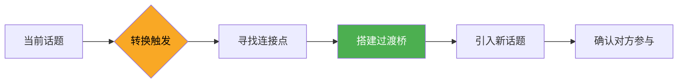

## 三、转换话题：优雅地切换频道

对话不是单曲循环，而是一张播放列表。当一首歌的情绪已经释放完毕，听众需要新鲜的旋律来维持注意力。转换话题（Topic Transition）正是这种"切歌"的技艺——切得好，对话如行云流水；切得生硬，双方都会感到尴尬。

本章从原理到实操，系统讲解如何在对话中优雅地切换频道。

### 3.1 为什么需要转换话题

#### 3.1.1 对话的自然生命周期

任何话题都有一个自然的生命周期：引入 → 展开 → 高潮 → 收尾。当一个话题走完这个周期后，对话双方的参与度会急剧下降。如果强行延续，就会出现以下症状：

- **重复翻炒**：双方开始重复已经说过的内容，没有新的信息增量
- **尬聊信号**：出现"嗯""是啊""对对对"等高频填充词，实质内容为零
- **注意力漂移**：对方开始看手机、环顾四周、或者回答变得敷衍

研究表明，成人日常对话中，单个话题的平均持续时间约为 2-4 分钟。超过这个时间窗口而不引入新话题，对话活力会显著下降。

#### 3.1.2 需要转换话题的七种信号

| 信号类型 | 具体表现 | 紧急程度 |
|---------|---------|---------|
| 话题枯竭 | 双方都无新内容可补充，出现冷场 | 中 |
| 敏感触发 | 话题触及对方痛点，表情/语气明显变化 | 高 |
| 氛围沉重 | 对话陷入负面情绪，需要正向调节 | 高 |
| 新人加入 | 有第三方加入对话，需要让所有人参与 | 中 |
| 兴趣丧失 | 对方回答变短、频繁点头、眼神游离 | 中 |
| 时间限制 | 对话需要在有限时间内覆盖更多内容 | 低 |
| 目的达成 | 当前话题的交流目的已经达到 | 低 |

#### 3.1.3 话题转换的认知原理

从认知科学角度看，话题转换涉及**注意力资源的重新分配**。人的工作记忆容量有限（米勒定律：7±2 个信息组块），当一个话题的信息量接近认知负荷上限时，大脑会自然产生"换挡"需求。

一个成功的话题转换需要同时满足两个条件：

1. **认知连贯性**：新旧话题之间存在可识别的逻辑关系，让大脑能够平滑过渡
2. **情感过渡性**：情绪色彩的变化是渐进的而非突变的，避免情感上的"急刹车"

### 3.2 转换话题的八种核心方法

#### 3.2.1 自然过渡法：找桥梁

从当前话题中找到与新话题之间的逻辑连接点，让话题转换成为"顺水推舟"而非"硬拐弯"。

**操作步骤：**

1. 倾听当前话题中的关键词或概念
2. 在脑海中联想与之相关的 2-3 个方向
3. 选择最自然的一个作为过渡桥梁
4. 用连接词（"说到""这让我想起""顺着这个思路"）引导转换

**示例场景：**

> **当前话题**：最近的天气热得受不了
>
> **过渡桥梁**：热 → 空调 → 家电维修
>
> **话术**："说到热，你们家空调制冷效果怎么样？我家那台最近好像有点问题，制冷不太给力。"
>
> **新话题**：家电选购 / 居家生活

**多种过渡路径示例：**

| 当前话题关键词 | 可能的过渡方向 | 过渡话术示例 |
|-------------|-------------|------------|
| 天气热 | 运动/健身 | "这么热的天，你们还会坚持户外运动吗？" |
| 天气热 | 旅行/避暑 | "这么热，真想去个凉快的地方躲躲。你有推荐的避暑地吗？" |
| 天气热 | 饮食/饮品 | "热天最适合喝冷饮了，你平时喜欢喝什么？" |
| 天气热 | 居家/装修 | "这种天气家里没装空调真受不了，你们家装的是什么牌子？" |

**关键要点：** 桥梁越短越好，最多不超过一句过渡句。如果需要三句话才能解释两个话题的关联，说明你找的桥梁太远了，需要换一条更近的路。

#### 3.2.2 主动引导法：开门见山

在当前话题自然收尾时，直接、坦诚地引入新话题。这种方法不依赖话题之间的逻辑关联，而是依靠"时机"——选择对方已经说完、对话出现自然停顿的时刻。

**操作步骤：**

1. 等待对方说完一个完整的意思（不要中途打断）
2. 用一个简短的回应表示你在听（"原来如此""确实"）
3. 用过渡短语引入新话题
4. 观察对方反应，确认是否感兴趣

**过渡短语工具箱：**

| 场景 | 过渡短语 |
|-----|---------|
| 一般场合 | "对了，我突然想起来……""换个话题……""另外一件事……" |
| 朋友间 | "诶，你有没有……""突然想起来个好玩的事……""话说……" |
| 职场场合 | "说到这个，我想到另一个相关的问题……""借此机会讨论一下……" |
| 长辈/正式 | "请教您一个问题……""还想跟您聊个事……" |

**示例：**

> "关于你说的那个健身方法我记下了，回去试试。对了，你最近在工作上有什么新进展吗？"

**进阶技巧——"桥接认可法"：** 在引入新话题之前，先对当前话题做一个具体的认可或总结，让对方感到被倾听，然后再自然转向。这比突然说"换个话题"要柔和得多。

> ✅ "你说的那个远程办公的好处确实有道理，尤其省去通勤时间这一点。对了，你们公司最近有调整办公政策吗？"
>
> ❌ "嗯。换个话题，你最近看了什么电影？"

#### 3.2.3 环境借力法：善用当下

利用周围环境中出现的新元素（声音、画面、事件、物品）来引入话题。这种方法最大的优势是话题来源完全自然，不会让对方觉得你在刻意转移注意力。

**操作步骤：**

1. 保持对周围环境的感知力（不要只盯着手机或沉浸在自己的思绪中）
2. 发现有趣的、与对方相关的、或具有讨论价值的环境元素
3. 用感叹词或疑问句引起对方注意
4. 自然展开讨论

**示例场景库：**

| 环境元素 | 话术 | 可展开方向 |
|---------|------|----------|
| 背景音乐 | "这首BGM挺好听的，你知道是什么歌吗？" | 音乐品味、歌手、最近的演唱会 |
| 路人穿搭 | "你看那个人的穿搭好有风格，是今年的流行趋势吗？" | 时尚、购物、个人风格 |
| 菜单/食物 | "这家店的甜品看起来不错，你想不想试试？" | 美食、探店、烹饪 |
| 装修/环境 | "这家店的装修挺有意思的，这种风格叫什么？" | 设计、审美、家居 |
| 天气变化 | "刚才还晴天，这就阴了，天气预报说今天有雨吗？" | 天气、出行计划、周末安排 |
| 手机通知 | "诶，我刚看到一个新闻挺有意思的……" | 时事、观点讨论 |

**注意事项：** 环境借力法要求你具备"环境敏感度"。在咖啡厅、餐厅、公园等开放场景中特别好用，但在封闭会议室或严肃场合中需要谨慎使用——过度关注环境会显得不专注。

#### 3.2.4 总结收尾法：画句号再开篇

先对当前话题做一个简洁的总结或表态，给对方一个明确的"这一段聊完了"的信号，然后再引入新话题。这种方法显得既尊重了前面的对话内容，又有条理地推进了对话。

**操作步骤：**

1. 用一两句话概括当前话题的核心结论或你的收获
2. 给出一个明确的收尾信号（"这个话题先到这里""改天可以深入聊"）
3. 短暂停顿（给对方消化的时间）
4. 引入新话题

**示例：**

> "所以总结一下，装修最重要的就是先确定预算和风格，其他的细节可以后面再慢慢定。这个话题改天我们可以专门聊聊。你最近工作上有什么新项目吗？"

**适用场景：**
- 讨论型对话中，需要从讨论转到闲聊
- 正式场合需要切换到轻松话题
- 对方分享了一段比较长的经历，需要给予正式回应后再转向

#### 3.2.5 时间/场景提醒法：借助物理变化

利用时间节点或场景转换作为话题切换的天然契机。这种方法不需要任何话术技巧，因为变化本身就是理由。

**常用触发点：**

| 触发类型 | 示例话术 | 新话题方向 |
|---------|---------|----------|
| 饭点 | "都快12点了，你平时午饭一般吃什么？" | 饮食、餐厅、烹饪 |
| 位置变化 | "我们在这坐了好久了，要不要出去走走？" | 运动、附近景点、散步 |
| 天气变化 | "开始起风了，我们找个室内的地方？" | 接下来的行程、咖啡厅 |
| 看到钟表 | "时间过得真快，待会儿你还有什么安排吗？" | 对方的计划、日程 |
| 季节/节日 | "马上就要中秋了，你们家有什么过节的传统吗？" | 传统文化、家庭、假期 |

#### 3.2.6 借力第三方法：引入"不在场的桥梁"

提及一个双方都认识的人、一部共同看过的影视作品、一条双方都可能感兴趣的新闻，作为话题转换的媒介。

**操作步骤：**

1. 选择一个与对方有交集的第三方元素（人/事/物）
2. 以提问或分享的方式引入
3. 对方如果感兴趣，自然展开；如果不感兴趣，迅速换方向

**示例：**

> "对了，你上次说的小王最近怎么样了？他那个创业项目有进展吗？"
>
> "最近那个XXX电影你看了吗？朋友圈里好多人都在讨论。"
>
> "我昨天刷到一条新闻，说咱们这边要新开一个大型商场，你听说了吗？"

**优势：** 第三方元素天然具有社交属性——谈论不在场的人或共同关注的事，是人类社交中最古老也最有效的话题来源之一。

#### 3.2.7 自我暴露法：分享个人信息

主动分享一个自己的近况、感受、发现，作为新话题的种子。这种方法适合在对方比较被动（不主动找话题）的情况下使用。

**示例：**

> "我最近开始学做饭了，昨天尝试做了一个红烧肉，结果糊了（笑）。你平时自己做饭吗？"
>
> "我上周去了一家新开的咖啡店，手冲做得特别好。你喝咖啡还是喝茶？"
>
> "最近在追一部剧，叫XXX，剧情挺烧脑的。你最近有在追什么剧吗？"

**关键原则：** 自我暴露要适度——分享的内容应该是轻松的、有趣的、或对方可能共鸣的，而不是沉重的个人隐私。目的是引发对方的参与，而不是变成单方面的自我表达。

#### 3.2.8 提问转向法：用问题撬动新方向

在当前话题的基础上，用一个带有方向性的提问来引导对话走向新的领域。这种方法的核心是"问对问题"。

**提问技巧：**

| 提问类型 | 示例 | 引导效果 |
|---------|------|---------|
| 扩展型 | "除了这个，你还对什么感兴趣？" | 打开更大的话题空间 |
| 跳转型 | "说到这个，你有没有想过……" | 跳到一个相关但不同的方向 |
| 个人型 | "那你呢？你平时是怎么做的？" | 从泛泛讨论转向个人分享 |
| 假设型 | "如果你可以选择任何地方去旅行，你会选哪里？" | 引入轻松的想象空间 |
| 推荐型 | "你有什么好推荐的吗？" | 让对方成为话题主导者 |

### 3.3 数字场景中的话题转换

在面对面交流中，环境借力和非语言信号（表情、动作）是天然的话题切换助手。但在文字聊天、群聊、视频通话等数字场景中，这些工具都不存在，话题转换需要更明确的策略。

#### 3.3.1 一对一文字聊天

**核心挑战：** 没有环境线索，没有表情辅助，话题转换需要完全依赖文字。

**实用策略：**

1. **分段发送法**：先回应当前话题（一两条消息），然后隔几秒钟，发一条以"对了""话说""诶"开头的新消息。时间间隔本身就是话题切换的信号。

2. **表情/图片过渡法**：发一个与当前话题相关的表情包或图片作为收尾，然后用新话题开启下一段对话。表情包的"轻松感"天然适合做话题过渡。

3. **引用回复法**：如果对方之前发了多条消息，可以引用其中一条较早的消息来引入新话题，暗示"之前那条我也想聊聊"。

4. **链接/图片分享法**：直接分享一篇文章、一个视频、一张图片，然后说"这个你看过吗？"——内容本身就是新话题。

**示例：**

> 对方："最近加班好多，好累啊"
>
> 你："辛苦了，记得注意休息。"（回应当前话题）
>
> *间隔几秒*
>
> 你："对了，周末要不要一起吃个饭放松一下？"（新话题）

#### 3.3.2 群聊中的话题转换

**核心挑战：** 多人同时参与，话题切换需要考虑群体动态。

**实用策略：**

1. **@引导法**：在群聊中，直接 @ 一个没怎么说话的人，问一个与当前话题相关但方向不同的问题，自然地将对话引向新方向。

2. **接龙法**：在当前话题讨论到一定程度后，用"说到XX，你们有没有……"来发起一个新的话题接龙。

3. **投票/互动法**：在群聊中发起一个投票或互动（"大家来投票：周末聚餐吃什么？"），用互动性强的形式引入新话题。

4. **图片/链接轰炸法**：在群聊中直接发一组有趣的图片或链接，吸引注意力后自然展开新话题。

#### 3.3.3 视频通话中的话题转换

**核心挑战：** 有视觉和听觉线索，但缺少环境线索，且可能存在网络延迟导致的"撞话"。

**实用策略：**

1. **视觉道具法**：拿起身边的一件物品（一本书、一杯咖啡、一个摆件）展示给对方看，用它作为新话题的切入点。

2. **屏幕共享法**："诶，我给你看个东西"——分享屏幕展示一个有趣的网页、图片或文档，自然引入新话题。

3. **停顿信号法**：在视频通话中，主动说"这个话题我们聊得差不多了"，然后短暂停顿 2-3 秒（这个空白本身就是切换信号），再引入新话题。

### 3.4 高级话题转换技巧

#### 3.4.1 从敏感话题中脱身

当对话触及了对方的敏感区域（收入、感情状况、家庭矛盾、外貌、健康等），需要快速而得体地转换话题，同时避免让对方感到被忽视。

**脱身话术模板：**

| 场景 | 话术 | 原理 |
|-----|------|------|
| 对方提到经济困难 | "确实不容易。对了，你最近有没有看什么好看的剧？" | 先共情再转向 |
| 对方提到感情问题 | "听起来挺难的，不过你一定能处理好的。诶，你上次说想学的那个技能，开始了吗？" | 给予肯定再转向 |
| 对方不想回答某个问题 | "没关系，不方便说就不说。对了……" | 尊重边界再转向 |
| 自己不小心踩雷 | "抱歉，我不该问这个。换个话题吧，你最近……" | 直接道歉再转向 |

**关键原则：** 在转向之前，一定要先给予简短的情感回应（"理解""确实""不容易"），而不是直接跳过。跳过会让对方感到自己的感受被无视了。

#### 3.4.2 为负面情绪降温

当对话氛围变得沉重、争论即将升级、或者对方情绪激动时，话题转换不仅是"换话题"，更是一种情绪管理工具。

**降温三步法：**

1. **认可情绪**："我理解你的感受""你说的有道理"
2. **降低温度**："这个问题确实挺复杂的""我们先不急着下结论"
3. **温和转向**："不如我们先吃点东西？吃饱了再聊""要不我们先走走，换个环境想想"

**禁忌：** 不要在对方情绪最激动的时候强行转换话题。这会适得其反，让对方觉得你在逃避问题。等待对方的情绪峰值过去（通常 30-60 秒）再转向。

#### 3.4.3 在正式场合的话题管理

在商务会议、正式晚宴、面试等场合，话题转换需要更加谨慎和有策略。

**正式场合的转换原则：**

1. **使用议题引导**："关于这一点，我们已经有了初步结论。接下来我想讨论一下……"
2. **使用时间管理**："我们在这个议题上已经花了 15 分钟了，按照议程，接下来是……"
3. **使用请教姿态**："这个问题我还需要再想想。另外，想请教您对……的看法。"
4. **使用总结过渡**："总结一下刚才的讨论……那么，关于……"

#### 3.4.4 多话题并行管理

高级对话者不是一次只聊一个话题，而是能够在多个话题之间灵活穿梭，保持每个话题的"活线索"。

**操作方法：**

1. 在聊话题 A 时，埋下话题 B 的种子（"这个回头可以详细聊"）
2. 在话题 A 快结束时，回头捡起之前埋下的种子 B
3. 同时保持 2-3 个"待聊话题"的心理清单

**示例：**

> *聊旅行时*："你之前说你也喜欢爬山，改天可以聊聊你去过哪些山。"（埋种子）
>
> *旅行话题快结束时*："对了，你刚才提到爬山，你都去过哪些地方？"（捡起种子）

### 3.5 转换话题的常见误区与纠正

#### 误区一：过于频繁地切换

**症状：** 一个话题还没展开就跳到下一个，对方还没说完就被打断引入新方向。

**后果：** 对话显得杂乱无章，对方感到你缺乏耐心，不愿意深入交流。

**纠正：** 每个话题至少让它完成"引入→展开"两个阶段再考虑切换。如果一个话题值得深入，就给它足够的时间。

#### 误区二：生硬的逻辑跳跃

**症状：** 从"今天天气不错"直接跳到"你觉得人工智能会取代人类吗"，中间没有任何过渡。

**后果：** 对方需要花额外的认知资源来理解你的话题切换逻辑，产生困惑和不适。

**纠正：** 使用至少一个过渡句来连接两个话题。哪怕是最简单的"对了"或"话说"，也比直接跳跃要好。

#### 误区三：忽视对方的意愿

**症状：** 对方明显还想继续讨论当前话题，但你强行转向了新话题。

**后果：** 对方感到自己的表达欲望被压制，产生不被尊重的感觉。

**纠正：** 转换后观察对方的反应。如果对方仍然回到之前的话题，说明那个话题对他们很重要，应该尊重并继续。

#### 误区四：在关键时刻打断

**症状：** 对方正在分享重要的个人经历、情感倾诉或关键信息时，你转换了话题。

**后果：** 对方会感到不被倾听、不被重视，严重时会影响信任关系。

**纠正：** 判断"关键时刻"的标准——如果对方用了很多细节来描述、语气变得认真、或者明确说"我想跟你说个事"，这些都是"不要打断"的信号。

#### 误区五：只用"对了"一种过渡方式

**症状：** 每次转换话题都说"对了"，变成了口头禅。

**后果：** 对方会条件反射地意识到"他又要换话题了"，产生不自然的感觉。

**纠正：** 使用多种过渡方式交替使用（参见 3.2 节的各种方法和话术）。

#### 误区六：转换后不确认参与

**症状：** 引入新话题后，不观察对方是否感兴趣，继续自说自话。

**后果：** 如果对方对新话题不感兴趣，对话会迅速降温。

**纠正：** 引入新话题后，用一个开放性问题邀请对方参与（"你觉得呢？""你有类似的经历吗？"），观察对方的回应热情再决定是否继续深入。

### 3.6 话题转换能力的训练方法

#### 3.6.1 "联想链"练习

每天花 5 分钟，选一个随机词语，快速联想出至少 10 个相关话题方向。训练大脑快速寻找话题之间连接点的能力。

**示例：** "咖啡" → 咖啡馆 → 装修风格 → 家居设计 → 宜家 → 瑞典 → 北欧旅行 → 极光 → 摄影 → 手机拍照技巧 → ...

#### 3.6.2 "场景模拟"练习

在日常生活中，有意识地练习话题转换：

- 和朋友聊天时，主动尝试使用不同的转换方法
- 在群聊中练习"@引导法"和"接龙法"
- 在视频通话中练习"视觉道具法"

#### 3.6.3 "复盘"练习

每次社交结束后，回顾对话中的话题转换：

- 哪次转换很自然？为什么？
- 哪次转换很生硬？可以怎么改进？
- 对方对哪些新话题最感兴趣？

#### 3.6.4 "观察学习"练习

观察身边社交能力强的人是如何切换话题的，记录他们的过渡方式、时机选择和话术。

### 3.7 自检清单

在进行话题转换之前，快速过一遍这个清单：

- [ ] 当前话题是否已经自然收尾，或者到了合适的转换时机？
- [ ] 新话题是否与对方的兴趣、经历相关？
- [ ] 我是否使用了合适的过渡方式，而不是生硬跳跃？
- [ ] 我是否观察了对方的反应，确认对方对新话题感兴趣？
- [ ] 我是否避免了在对方表达重要情感或信息时打断？
- [ ] 如果对方对新话题不感兴趣，我是否有备选方案？

### 3.8 本章小结

话题转换是对话中的"频道切换"艺术。核心要点：

1. **时机比话术更重要**：在对的时机用简单的话术就能成功转换，在错的时机再精妙的话术也会显得突兀
2. **连贯性是底线**：新旧话题之间需要有可识别的逻辑联系，哪怕是微弱的
3. **尊重对方意愿**：话题转换不是单方面的行为，需要对方的配合和确认
4. **多备几种方法**：不同场景需要不同的转换方式，灵活运用才能应对自如
5. **练习是唯一的捷径**：话题转换是一种需要反复练习的社交技能，理论知识只是起点

掌握了话题转换的技巧，你就能让对话始终保持新鲜感和活力，让每一次交流都成为愉快的体验。
