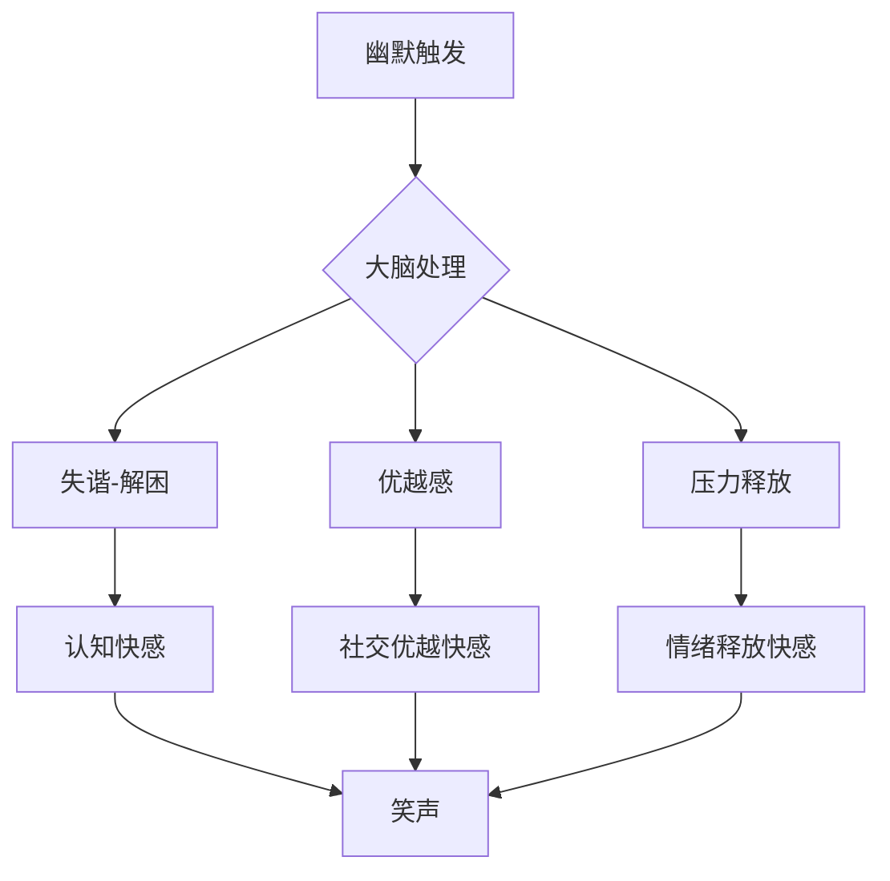

## 四、幽默技巧：让对话充满欢笑

幽默是社交中最强大的润滑剂。一个懂得幽默的人，能让尴尬的场面变得轻松，让陌生的关系迅速拉近，让枯燥的对话变得生动。但幽默绝非天赋的专利——它是一套可以拆解、学习、反复练习的技能体系。本章将从幽默的心理学原理出发，系统讲解日常聊天中可用的幽默类型、具体操作方法、常见陷阱以及进阶修炼路径。

### 4.1 幽默的心理学基础

#### 4.1.1 为什么我们会笑：三大经典理论

理解幽默的本质，才能真正掌握它。心理学界对"人为什么会笑"有三种主流解释，它们并不互斥，而是从不同维度揭示了幽默的运作机制：

**失谐-解困理论（Incongruity-Resolution Theory）**

这是目前被引用最广的幽默理论。核心逻辑：大脑在处理信息时会自动建立预期模式，当接收到一个"意外但合理"的信息时，预期被打破的瞬间产生认知快感，转化为笑声。

关键点在于两个条件必须同时满足：
- **失谐**：结果偏离预期，制造意外感
- **解困**：这个意外在某种逻辑框架下又说得通

如果只有失谐没有解困，听者会感到困惑而非好笑（"这是什么鬼？"）；如果只有解困没有失谐，听者会觉得无聊（"这不是废话吗？"）。

> 示例分析："我方向感特别差，导航都经常被我带偏。"
> - 预期：导航是工具，帮助人找方向
> - 失谐：人居然能把导航带偏——工具反被使用者误导
> - 解困：方向感差到这种程度确实可能影响导航判断（合理）
> - 效果：自嘲+荒诞感 → 笑

**优越感理论（Superiority Theory）**

最早由柏拉图和亚里士多德提出。当我们看到他人的小失败、小窘迫（非严重伤害），会本能地产生一种"幸好不是我"的优越感，这种感觉转化为笑。

这个理论解释了为什么讽刺和自嘲都有效：
- 讽刺：让对方相对于自己处于"低位"（不推荐用于正面社交）
- 自嘲：主动把自己放到"低位"，让对方产生优越感，同时展示自信

**释放理论（Relief Theory）**

弗洛伊德和斯宾塞的观点：幽默是心理压力的释放阀。在紧张、尴尬、焦虑的情境下，一个恰到好处的玩笑能打破情绪张力，让积蓄的压力以笑声的形式释放出来。

这解释了为什么"越紧张的场景，幽默越有效"——面试时一句轻松的自嘲、约会冷场时一个夸张的比喻、争吵后一个善意的玩笑，效果往往比正常场景强数倍。

#### 4.1.2 幽默的神经科学视角

脑成像研究显示，幽默处理涉及多个脑区协同工作：

| 处理阶段 | 负责脑区 | 功能 |
|---------|---------|------|
| 理解铺垫 | 颞叶（语言区） | 加工语义信息，建立预期 |
| 检测意外 | 前扣带回 | 发现预期与实际的偏差 |
| 解困整合 | 前额叶皮层 | 找到意外中的合理逻辑 |
| 产生愉悦 | 伏隔核（奖赏系统） | 释放多巴胺，产生快感 |
| 输出反应 | 运动皮层 | 笑、拍手等外在表现 |

这个过程通常在300-500毫秒内完成。如果解困阶段耗时过长（梗太复杂或太隐晦），快感会衰减——这就是为什么"解释笑话就不好笑了"。

#### 4.1.3 幽默在社交中的核心功能

幽默不只是"让人开心"，它在社交中承担着多重功能：

- **社交筛选**：幽默风格是价值观的折射。你笑什么、怎么笑，暴露了你的认知层次和价值取向。相似幽默偏好的人更容易建立深层连接。
- **地位信号**：能制造笑点的人天然占据社交主导位置——你引导了群体情绪走向。研究显示，善于幽默的人在职场中被评价为更有领导力（Bitterly et al., 2017, *Journal of Personality and Social Psychology*）。
- **关系润滑**：笑声触发内啡肽释放，群体同步大笑会增强归属感和信任感。这也是为什么"一起笑过"的关系进展速度远快于"一起聊过"。
- **冲突缓冲**：在紧张氛围中适度幽默，可以降低双方的防御心，为理性对话创造空间。
- **记忆锚点**：带有幽默感的信息更容易被记住。在演讲和教学中，幽默元素的回忆率是普通内容的2-3倍。

### 4.2 日常聊天中的六种实用幽默类型

#### 4.2.1 自嘲式幽默：最安全的幽默起点

自嘲是所有幽默类型中风险最低、适用范围最广的一种。它通过善意地调侃自己的小缺点或尴尬经历，展示内心的安全感和自信。

**底层逻辑**：一个能拿自己开玩笑的人，传递的信号是"我对自己的不完美感到坦然"——这本身就是一种高价值展示。相反，过度自恋、从不自嘲的人反而让人有距离感。

**实操模板**：

| 场景 | 自嘲示范 | 有效原因 |
|------|---------|---------|
| 迟到 | "我的时间观念属于另一个时区，今天已经算提前到了" | 轻描淡写化解尴尬 |
| 做饭失败 | "我做饭的水平，泡面都能煮糊，但我糊得很均匀" | 荒诞+自知之明 |
| 方向感差 | "导航都经常被我带偏，我是电子设备的天敌" | 夸张到明显不真实 |
| 运动差 | "我跑步的样子像企鹅逃命，但企鹅至少目标明确" | 类比+自嘲组合 |
| 工作失误 | "这个方案唯一的优点就是让我学到了教训" | 转化为成长叙事 |

**自嘲的三条铁律**：

1. **调侃边缘缺陷，不碰核心能力**。可以说自己做饭差（无关紧要），但别说自己工作能力差（核心价值）。可以笑自己方向感差（可爱），但别笑自己赚钱少（敏感）。
2. **语气轻快收尾，不陷入悲情**。自嘲的结尾应该是轻松的、甚至带点得意的，而不是越说越丧。"我泡面都能煮糊"收尾可以加"但我糊出了新境界"，而不是"我可能真的不适合生活"。
3. **频率控制在每30分钟对话不超过2次**。过多自嘲会从"幽默自信"滑向"真的在贬低自己"，让对方不知该笑还是该安慰。

#### 4.2.2 夸张式幽默：放大事实制造笑点

通过有意夸大某个细节或特征，制造荒诞感。夸张要夸张到"明显不是事实"的程度，让对方立刻识别出你在制造幽默。

**关键原则**：夸张必须超出合理范围。如果说"今天地铁有点挤"，这是事实陈述；如果说"今天地铁挤得我变成了二维生物"，这是幽默——因为程度明显脱离现实。

**进阶技巧——梯度夸张**：

不要一步到位，而是逐级加码，每级都比上一级更荒诞：

> "今天地铁很挤 → 挤到我双脚离地 → 挤到我都不用扶把手因为根本掉不下去 → 我怀疑自己被压缩成了JPEG格式"

梯度夸张的好处是每个台阶都制造一次微小的笑点，累积效果远强于单次大笑点。

**夸张的常见结构**：

- **数字夸张**："这份报告改了八遍，我都快能倒背如流了。"
- **程度夸张**："这个会议长到我感觉椅子都和我长在一起了。"
- **后果夸张**："如果再开一个小时会，我可能会开始和投影仪聊天。"
- **感官夸张**："这个辣条辣得我怀疑舌头已经提交了离职申请。"

#### 4.2.3 反差式幽默：预期反转的精妙设计

反差式幽默利用"铺垫→反转"结构，前半句建立一个预期，后半句突然转向完全不同的方向。这是脱口秀演员最常用的技巧。

**基本公式**：`建立预期的铺垫 + 打破预期的转折`

**三种反差模式**：

**A. 语义反转**——同一句话的后半段推翻前半段的语义：

> "我今天特别自律——六点就醒了，然后又睡到了十一点。"
> "我最近在健身——主要是嘴部肌肉，吃零食练的。"

**B. 严肃vs日常反转**——用庄重的语态描述日常小事：

> "经过深思熟虑和反复论证，我最终做出了一个重大决定——今晚吃火锅。"
> "这是一个改变人生的时刻——我终于把那个bug修好了。"

**C. 预期落空**——对方以为你要说什么重要的事，结果拐了个弯：

> 对方："你最近有什么大事？"
> 你："我最近发现了一个惊天秘密——冰箱里的酸奶其实是上周的。"

**设计反差的技巧**：

1. 铺垫要足够正经，让对方的预期完全被带偏
2. 转折要干净利落，不要拖泥带水
3. 转折后不要解释，留给对方自己品味

#### 4.2.4 类比式幽默：连接两个不相关的世界

将两个看似毫无关联的事物进行类比，因为"意外的相似性"制造幽默。类比越出人意料、越精准，效果越好。

**类比的两种方向**：

- **降维类比**：用日常琐事类比严肃事物 → "我的爱情就像我的WiFi信号——看着满格但实际连接不上去。"
- **升维类比**：用宏大叙事类比日常琐事 → "今天找钥匙的过程堪比一场考古发掘。"

**实操练习——"这就像"造句法**：

选取一个你想描述的场景，然后用"这就像……"接一个完全不相关的领域：

| 原始场景 | "这就像"类比 |
|---------|-------------|
| 早高峰挤地铁 | 这就像沙丁鱼罐头，只不过沙丁鱼至少是自愿进来的 |
| 改第八版方案 | 这就像西西弗斯推石头，只是我的石头是个PPT |
| 等外卖 | 这就像等一个不确定会不会来的约会对象 |
| 开长会 | 这就像看一部没有剧本、没有导演、也没有结局的电影 |

#### 4.2.5 观察式幽默：日常荒诞的精准捕捉

对生活中那些"大家都经历过但没人说出来"的荒诞之处进行敏锐观察和巧妙表达。这种幽默最具共鸣感，因为它来源于共同经验。

**培养观察力的练习方法**：

1. **"今天有什么不对劲"日记**：每天记录一件让你觉得"等等，这有点奇怪"的事。坚持两周，你的观察敏锐度会显著提升。
2. **"放大镜"思维**：对一个日常行为追问"为什么"——为什么电梯里的人都盯着楼层数字看？为什么超市排队时旁边那队总是更快？为什么等人的时候时间过得特别慢？
3. **"外星人视角"**：假装你是第一次来地球的外星人，用全新的眼光看待习以为常的事——"这个物种每天花8小时坐在一个发光的长方形前面，用手指在一块有字母的板上敲击。"

**观察式幽默的示例**：

- "你有没有发现，超市排队时你换到另一队，原来那队立马就变快了——好像有人在监视你的选择。"
- "健身房最热闹的时候永远是年初那两周。一月份的跑步机争都争不到，二月份就只剩保洁阿姨在上面擦灰了。"
- "发朋友圈之前精修半小时、配文想了二十分钟，发出去之后每三十秒刷一次看谁点赞了——当代人的完整创作流程。"

#### 4.2.6 谐音/双关式幽默：文字游戏的魅力

利用中文的谐音、多义词或语境歧义制造笑点。这种幽默在中文语境中特别有效，因为中文同音字极多。

**常见手法**：

- **谐音梗**："我这个人比较'梨'想主义——凡事都往好的方向想，除了挑水果的时候。"
- **语义双关**：利用一个词的多种含义。"这个项目终于'落地'了——字面意义上的，从桌上掉下去了。"
- **断句歧义**：通过重新断句改变语义。"我今天心情不好/吃什么都行 → 我今天心情/不好吃/什么都行"

**注意事项**：谐音梗在文字聊天中效果好于口头聊天（对方有时间反应），但在高端社交场合慎用——过度使用会显得"段子手"而非"幽默感"。建议每场对话使用不超过1-2次。

### 4.3 幽默的高级技巧

#### 4.3.1 回调（Callback）：重复引用之前的笑点

回调是专业喜剧演员的核心技巧之一——在对话稍后重新引用之前出现过的某个笑点或梗，制造"前后呼应"的效果。这种技巧能制造"内部笑话"（inside joke），极大增强双方的亲密感和默契感。

**操作步骤**：
1. 在对话前段制造一个笑点（可以是任何类型的幽默）
2. 在对话后段，当出现类似语境时，巧妙引用之前的笑点
3. 不要直接重复，而是用变体或隐喻的方式引用

> 前段对话中你自嘲方向感差，导航都被带偏。
> 后段讨论去哪吃饭时，你说："你带路吧，不然我们可能要绕地球一圈。"

回调的力量在于它暗示"我一直在认真听你说话，并且记住了我们之间的互动"——这比任何恭维都更能拉近关系。

#### 4.3.2 节奏控制：喜剧中的timing

同样的笑话，不同的节奏讲出来效果天差地别。专业喜剧中，timing（时机和节奏）占了成败的50%以上。

**核心节奏技巧**：

- **铺垫后的停顿**：在关键转折前停顿0.5-1秒，给大脑切换预期的时间。停顿制造悬念，悬念放大转折效果。
- **快速连击**：短时间内连续抛出2-3个相关笑点，形成"笑浪"——第一个笑点打开情绪阀门，后续笑点容易叠加放大。
- **笑点后的沉默**：抛出笑点后不要急着继续说话，给对方反应时间。很多人犯的错误是笑点刚说完就接"就是说啊哈哈"——这会冲淡笑点。
- **deadpan delivery（冷面讲述）**：用完全严肃的表情讲一个荒诞的内容，表情和内容的反差本身就是额外的笑点。

#### 4.3.3 情境幽默 vs 预制幽默

| 维度 | 情境幽默（即兴） | 预制幽默（准备好的） |
|------|----------------|-------------------|
| 效果 | 更自然、更贴切、更显功力 | 更保险、更精致 |
| 风险 | 可能翻车 | 可能显得刻意 |
| 适用场景 | 熟悉的朋友、轻松氛围 | 演讲、第一次见面、正式场合 |
| 训练方法 | 提高观察力+快速联想 | 积累素材库+反复打磨 |
| 核心能力 | 反应速度、联想能力 | 编排能力、表达能力 |

**最佳策略**：70%情境幽默 + 30%预制幽默。日常聊天以即兴为主，但在重要场合（演讲、面试、第一次约会）可以提前准备2-3个适用范围广的幽默素材。

#### 4.3.4 幽默的递进层次

初学者往往把幽默理解为"讲笑话"，但实际上幽默有明确的递进层次：

- **Level 1-2**：依赖外部素材，适合初学者入门
- **Level 3-4**：开始加入个人元素，有了自己的表达
- **Level 5-6**：幽默成为一种思维方式，信手拈来

大多数人的幽默感停留在Level 2-3，通过刻意练习可以达到Level 5。Level 6则是天赋+大量实践的综合结果。

### 4.4 幽默的使用原则与边界

#### 4.4.1 五条核心原则

**原则一：善意为本。** 幽默的目的是让在场所有人都开心，不是牺牲某个人来取悦其他人。永远避免以他人的生理特征、家庭背景、痛苦经历、隐私为笑料。检验标准：如果这个笑话的主人公在场听到了，他会觉得好笑吗？

**原则二：时机恰当。** 同一句话在不同时机说出来，效果可能截然相反。在对方分享伤心事时使用幽默会被视为不尊重；在对方压力大时一个轻松的玩笑则可能恰好解围。判断时机的简单法则：先观察对方的情绪状态，再决定是否启动幽默模式。

**原则三：自然流露。** 最好的幽默是"想到了就说出来"，而不是"我准备给你讲个笑话"。刻意的幽默预告会拉高对方的期待阈值，让你的笑话更难达标。自然的方式是将幽默融入正常对话流，让对方在不经意间被逗笑。

**原则四：了解边界。** 不同的人对幽默的接受程度不同。不熟悉对方时，从温和的自嘲或观察式幽默开始，观察对方的反应——如果对方笑了且接住了你的梗，可以逐步升级；如果对方反应平淡，退回正常对话模式。

**原则五：接受失败。** 不是每一次幽默尝试都会成功。专业脱口秀演员的笑点命中率也只有60-70%，日常聊天中翻车是完全正常的。失败时的正确处理方式：自然地继续对话，不解释、不补救、不追问"你怎么不笑"。越补救越尴尬。

#### 4.4.2 幽默的雷区清单

| 雷区 | 示例 | 为什么危险 |
|------|------|-----------|
| 拿别人的外貌开玩笑 | "你怎么又胖了" | 直接伤害自尊 |
| 涉及种族/地域歧视 | "XX地方的人都……" | 价值观红线 |
| 拿他人的痛苦当素材 | "你被分手怪不得" | 踩踏情感底线 |
| 在严肃场合不合时宜 | 葬礼上讲笑话 | 完全无视情境 |
| 反复用同一个梗 | 每次见面都说同一句 | 从幽默变成骚扰 |
| 解释自己的笑话 | "你没听懂吧，我意思是……" | 杀死所有笑点 |
| 以"开玩笑的"为挡箭牌 | 说完伤人话加"开玩笑" | 不是幽默是攻击 |

#### 4.4.3 不同场景的幽默策略

**初次见面**：以温和的自嘲和观察式幽默为主，展示亲和力。避免任何可能冒犯的幽默，也不要过于放飞——第一印象的分量很重。

**和朋友聊天**：可以大胆使用各种幽默类型，回调和内部笑话是强化友情的利器。可以互相调侃，但要注意朋友的敏感点。

**工作场合**：以自嘲和观察式幽默为主，避免讽刺和可能被解读为不专业的幽默。开会时适度幽默能提高团队协作效率，但不要让幽默影响议题推进。

**微信/文字聊天**：文字缺少语气和表情，幽默容易被误解。建议多用表情包辅助、适度使用"哈哈"表明态度、对于可能有歧义的句子加上"狗头"等保命标记。

**安慰他人时**：先共情，再在情绪回升阶段引入轻松幽默。时机判断：对方开始主动笑了，说明可以适度引入幽默；对方还在哭或沉默时，保持共情。

### 4.5 如何系统培养幽默感

#### 4.5.1 输入层：建立幽默素材库

**日常积累**：
- 关注优质脱口秀节目和喜剧播客，观察专业喜剧人的节奏和结构
- 建立个人"笑点笔记本"（手机备忘录即可），记录日常中发现的有趣观察
- 阅读幽默散文和随笔，学习文字幽默的表达技巧
- 留意朋友圈和社交媒体上的精彩评论——很多民间幽默高手的创意不输专业人士

**逆向拆解**：看到一个好笑的段子，不要只笑过去，拆解它：
1. 它用了什么类型的幽默？（自嘲/夸张/反差/类比/观察/双关）
2. 铺垫和转折分别在哪里？
3. 如果我把转折换掉，还成立吗？
4. 我能在自己的生活中找到类似结构的素材吗？

#### 4.5.2 处理层：训练快速联想

幽默的核心能力是"在两个不相关的概念之间建立意外连接"。以下练习可以提升这种联想速度：

**练习一："一分钟三个联想"**
随机选取两个无关的词（如"番茄"和"会议"），在一分钟内想出三种将它们联系起来的幽默说法。这个练习训练大脑的快速联想能力。

**练习二："日常改写"**
每天选一个日常事件（如等电梯、挤地铁），用至少两种幽默类型重新描述它。坚持一个月，你会发现幽默视角逐渐成为本能。

**练习三："接龙反转"**
和朋友玩"严肃开头→幽默结尾"的接龙游戏。一个人说一句正经话，另一个人用反转或夸张把它变成笑点。这个练习能快速提升即兴反应能力。

#### 4.5.3 输出层：从小范围开始实践

**第一阶段（第1-2周）：自嘲练习**
只在亲密朋友面前尝试自嘲式幽默，这是最安全的起步方式。每天至少尝试一次，记录效果。

**第二阶段（第3-4周）：扩大类型**
在熟悉的朋友圈中尝试夸张和反差式幽默，继续观察反应和调整分寸。

**第三阶段（第5-8周）：情境应用**
在更大的社交范围（同事、不太熟的朋友）中使用幽默，从温和类型开始，逐步试探边界。

**第四阶段（持续）：形成风格**
经过反复实践，你会发现自己擅长哪几种幽默类型，这就是你的个人幽默风格。强化优势类型，补足弱项类型。

### 4.6 常见误区与纠正

#### 误区一："幽默就是讲笑话"

**现实**：幽默是一种沟通方式，不是表演节目。日常聊天中的幽默应该是融入对话的自然元素，而不是突然停下来"给大家讲个笑话"。刻意讲笑话的模式在正式场合（演讲开场）可以使用，但在日常聊天中会显得突兀。

**纠正**：把目标从"我要逗笑对方"转变为"我要用轻松有趣的方式表达观点"。幽默是手段，不是目的。

#### 误区二："幽默感是天生的"

**现实**：幽默感确实有天赋成分（有些人天生反应更快、联想更丰富），但它更是一种可以后天训练的技能。研究表明，喜剧演员的脑部神经连接模式与普通人有差异，但这些差异很大程度上来自大量练习而非先天禀赋（Amir & Biederman, 2016）。

**纠正**：把幽默当作一门手艺来练。正如写作可以越练越好，幽默也可以。

#### 误区三："我性格内向，幽默不了"

**现实**：幽默风格有很多种，不是只有外向张扬的才叫幽默。冷面幽默、冷知识式幽默、文字游戏型幽默，都是内向者的优势领域。很多知名喜剧人（如周星驰、金·凯瑞的采访状态）私下其实相当安静内敛。

**纠正**：找到适合自己性格的幽默类型。内向者往往擅长观察式幽默和文字幽默——因为这些类型依赖的是细致的观察和深度思考，而非社交场合的临场反应。

#### 误区四："对方没笑就是失败"

**现实**：笑只是幽默效果的一种外在表现。对方可能觉得好笑但没有明显笑出来（性格内敛、当时场合不方便笑、正在打字来不及笑）。衡量幽默是否成功的标准应该是"对话氛围是否变得更轻松"，而非"对方是否笑了"。

**纠正**：观察整体对话质量——话题是否更自然地延续了？对方是否更愿意和你聊天了？这些才是幽默起效的真正信号。

#### 误区五："什么场合都能幽默"

**现实**：幽默有明确的适用边界。在以下场景中，幽默需要极度谨慎或完全避免：对方正在倾诉痛苦、严肃的道歉场合、涉及生死的讨论、文化或宗教敏感话题。此时任何幽默都可能被解读为"你不够重视我/这件事"。

**纠正**：先判断场合再决定是否幽默。有一个简单的判断框架——"如果我是对方，此刻最需要的是被认真对待还是被逗开心？"如果答案是前者，放下幽默冲动。

### 4.7 进阶：形成个人幽默风格

#### 4.7.1 识别你的天然优势

每个人都有自己的幽默"甜区"——那些你最容易自然产生幽默反应的场景和类型。识别方法：

1. 回忆你过去成功逗笑别人的经历，分析你用了什么类型的幽默
2. 观察你最容易被什么类型的幽默打动——你笑什么，往往也擅长什么
3. 让亲密朋友评价你的幽默风格——旁观者清

#### 4.7.2 从"用别人的梗"到"创造自己的梗"

初级幽默者依赖网络梗和段子，高级幽默者创造只属于自己的表达方式。进阶路径：

1. **改编**：看到一个好笑的结构，用你自己的经历和语言重新表达
2. **融合**：将两种幽默类型结合（如自嘲+类比："我的厨艺就像我的恋爱史——每道菜都有故事，但结局都不太好"）
3. **原创**：从你自己的生活观察中提取素材，创造完全属于你的笑点

#### 4.7.3 幽默与真诚的平衡

幽默的最高境界不是让人笑，而是让人在笑的同时感受到你的真诚。自嘲展示了坦然，观察式幽默展示了洞察，善意的玩笑展示了关心。当幽默服务于真实的表达而非表演时，它就从"技巧"升级为"人格魅力"。

> 最好的幽默不是"我会讲笑话"，而是"和你聊天很开心"。前者是技术，后者是连接。

***

**本章小结**：幽默是可以系统学习的社交技能。从理解"失谐-解困"的底层机制开始，掌握自嘲、夸张、反差、类比、观察、双关六种核心类型，遵循善意、时机、自然、边界、接受失败五条原则，通过持续的输入、联想训练和实践逐步提升。记住：幽默的终极目标不是逗人笑，而是让每一次对话都更轻松、更真实、更有温度。
