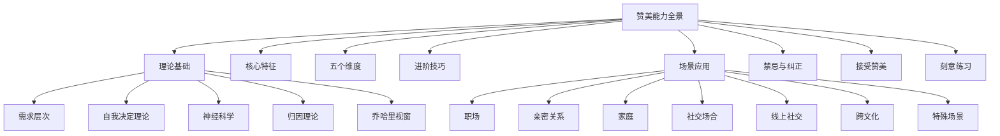
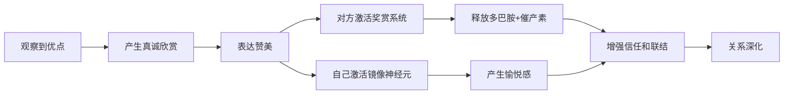
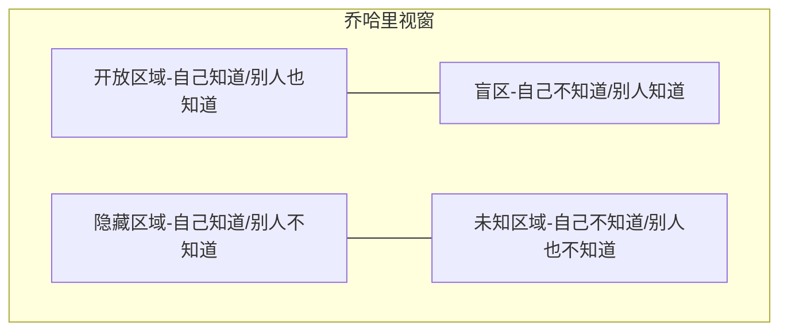
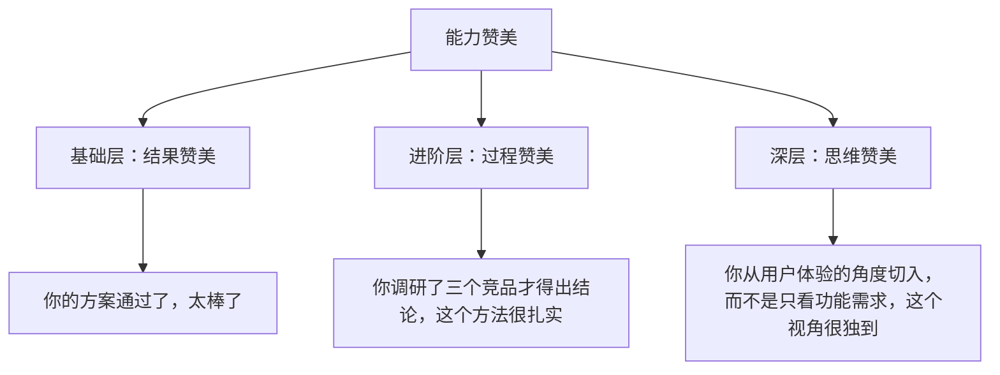
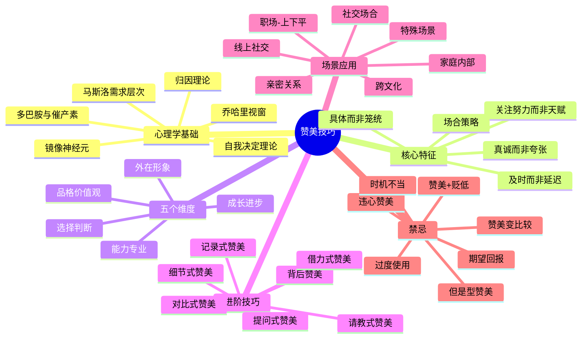

## 五、赞美技巧：用真诚打动人心

> "人类本质中最殷切的需求，是渴望被肯定。" ——威廉·詹姆斯

你是否有过这样的经历：看到同事做了一件很棒的事，想说点什么却只憋出一句"厉害"；想夸伴侣今天很好看，话到嘴边又觉得太敷衍；领导在会上表扬了你，你只会干巴巴地说"谢谢"然后迅速转移话题。

赞美是人际交往中最强大的"软武器"。一句恰到好处的赞美，能让陌生人瞬间放下戒备，让同事心甘情愿配合你的工作，让伴侣感受到被珍视。但赞美也是最容易弄巧成拙的技能——过犹不及、词不达意、时机不对，都可能让你的善意变成尴尬。

本章将从心理学原理出发，系统讲解赞美的底层逻辑、核心方法、场景应用和常见误区，帮助你掌握这门"用真诚打动人心"的艺术。

### 5.1 赞美的心理学基础

#### 5.1.1 马斯洛需求层次与赞美

马斯洛需求层次理论将人类需求分为五层：生理需求、安全需求、社交需求、尊重需求、自我实现需求。赞美直接触及第四层——**尊重需求**，即个体渴望被他人认可、赞赏和重视的内在驱动力。

当一个人的基本需求得到满足后，尊重需求会成为行为的重要驱动力。这就是为什么在职场中，有时候一句真诚的认可比加薪更能激发员工的工作热情——前者满足的是更高层次的心理需求。

盖洛普（Gallup）一项覆盖全球10万名员工的研究发现：在过去的七天里得到过认可或表扬的员工，其生产力比未得到认可的员工高出**21%**，离职率低**31%**。这个数据说明，赞美不是可有可无的"锦上添花"，而是实实在在影响绩效和留人的关键因素。

#### 5.1.2 自我决定理论（SDT）与赞美

心理学家德西（Deci）和瑞安（Ryan）提出的自我决定理论认为，人类有三种基本心理需求：

| 需求 | 含义 | 赞美的作用 |
|------|------|------------|
| **自主性** | 感到行为出于自身意愿 | 认可对方的选择和判断力 |
| **胜任感** | 感到自己有能力完成任务 | 肯定对方的能力和成果 |
| **归属感** | 感到与他人有联结 | 表达"我看到了你""我在乎你" |

高质量的赞美同时满足这三种需求：它既认可了对方的能力（胜任感），又表达了你对对方的关注（归属感），还暗示你尊重对方的选择（自主性）。

**应用示例：** 当同事完成了一个优秀的方案，你可以说："你选择从用户痛点切入而不是直接堆功能（认可自主性），这个分析框架很专业（肯定胜任感），和你搭档让我学到很多（表达归属感）。" 一句话同时满足三个心理需求，比"做得好"有力百倍。

#### 5.1.3 神经科学视角：赞美如何改变大脑

从神经科学的角度来看，真诚的赞美能够激活大脑的**腹侧纹状体**（ventral striatum）——这是大脑奖赏系统的核心区域。功能性磁共振成像（fMRI）研究显示，当人们接收到真诚的赞美时，该区域会释放**多巴胺**，产生与获得金钱奖励相似的愉悦感。

更值得关注的是，赞美产生的效果具有**持续性**。日本学者�的场浩司的研究发现，受试者在接收到赞美后的第二天，执行相同任务的表现仍然优于未被赞美的对照组。这说明赞美不仅仅是即时的情感刺激，还能通过强化神经通路来促进技能的长期巩固。

此外，赞美还会促进**催产素**（oxytocin）的分泌——这种"信任荷尔蒙"能增强人与人之间的情感联结和信任感。这就是为什么被真诚赞美后，你会本能地对赞美者产生好感。

赞美的神经科学效应有一个重要前提：**必须是真诚的赞美**。大脑的前扣带皮层（ACC）和前脑岛（anterior insula）负责检测社会信号的真实性。当你感知到对方的赞美不真诚时，这些区域会激活"警报"，触发心理防御，反而增加不信任感。这就是为什么虚假的马屁不仅无效，还会适得其反——大脑在生理层面就能分辨真假。

#### 5.1.4 镜像神经元与赞美者的收获

赞美不仅让被赞美者受益，赞美者自身也会获得积极的情绪体验。这是因为当我们观察到他人的积极反应时，大脑中的**镜像神经元**会激活，让我们"共情"对方的愉悦。简单来说，赞美是一种双向的快乐——你让别人开心的同时，自己也会感到满足。

积极心理学之父马丁·塞利格曼（Martin Seligman）的"三件好事"练习（Three Good Things）证实了这一点：每天记录值得感恩的事情（包括对他人的欣赏），连续一周后，参与者的幸福感提升持续了长达六个月。主动寻找他人的优点并表达赞美，本质上就是一种积极心理训练。

#### 5.1.5 归因理论与赞美方向

心理学家伯纳德·韦纳（Bernard Weiner）的**归因理论**指出，人们对成败的归因方式会直接影响后续行为。赞美本质上是一种正向归因——你告诉对方"你做得好"的同时，也在暗示"你为什么做得好"。

| 归因类型 | 赞美方向 | 对方接收到的信息 | 后续行为倾向 |
|----------|----------|-----------------|-------------|
| **内部-稳定**（天赋） | "你真有天赋" | 成功靠天生，我无法改变 | 遇到困难时容易放弃 |
| **内部-不稳定**（努力） | "你花了很多功夫" | 成功靠努力，我可以继续 | 遇到困难时更坚持 |
| **外部-稳定**（环境） | "你运气真好" | 成功靠外部条件 | 不觉得是自己的功劳 |
| **外部-不稳定**（任务简单） | "这个任务本来就不难" | 成功不算什么成就 | 对赞美无感 |

最优的赞美方向是**内部-不稳定归因**（努力、策略、选择），因为它既肯定了对方的主体性，又暗示了成功的可复制性。

#### 5.1.6 乔哈里视窗与赞美的社交功能

心理学家约瑟夫·卢夫特（Joseph Luft）和哈里·英格拉姆（Harry Ingham）提出的**乔哈里视窗**（Johari Window）将人的自我认知分为四个区域：

赞美的独特功能在于它能**扩大开放区域、缩小盲区**。当你告诉同事"你今天的演讲逻辑特别清晰"，你帮助对方认识到了自己可能忽略的优势（缩小盲区）。当你对伴侣说"你处理和我妈关系的方式特别成熟"，你帮助对方看到了自己品格的闪光点。

这也解释了为什么有些赞美会让人"感动到哭"——不是因为辞藻华丽，而是因为你看到了对方自己都没注意到的美好。

### 5.2 高质量赞美的核心特征

赞美有高低之分。低质量的赞美不仅无效，还可能适得其反。以下五个特征是区分高质量与低质量赞美的关键标准。

#### 5.2.1 具体而非笼统

**原则：** 赞美的信息量越大，说服力越强。

笼统的赞美（"你真厉害"）像一张空白支票——听起来不错，但没有实质内容。具体的赞美则像一份详细的报告——它证明你真正观察过、关注过对方。认知心理学中的**具体性效应**（concreteness effect）表明：具体的信息比抽象的信息更容易被记住、更有说服力。

| 类型 | 低质量 | 高质量 |
|------|--------|--------|
| 工作 | "你做得很好" | "你今天汇报里那个竞品分析的框架特别清晰，尤其是用SWOT和波特五力对比的那部分" |
| 外貌 | "你今天很好看" | "你这件风衣的剪裁特别修身，搭配那条丝巾显得很有质感" |
| 能力 | "你真聪明" | "你用类比的方式解释量子计算，让我这个文科生都听懂了，这种把复杂概念简单化的能力很厉害" |
| 写作 | "你文章写得好" | "你那篇分析里用'漏斗模型'解释用户流失那段特别精彩，读完我就去改了我们的产品" |
| 做饭 | "好吃" | "这个红烧肉的火候掌握得太好了，肥而不腻，你是不是用了先煸后炖的方法？" |

**具体赞美的公式：**

我注意到/观察到 + [具体行为/细节] + [产生的效果/给我的感受]

示例："我注意到你开会时总是最后一个发言（具体行为），这样既能听完所有人的意见再做判断，又不会让别人觉得你太强势（效果），和你共事让人觉得很舒服（感受）。"

**练习方法：** 下次想说"你真厉害"的时候，强制自己回答三个问题：①他/她具体做了什么？②什么地方让我觉得厉害？③这件事对我产生了什么影响？把这三个答案串起来，就是一条高质量赞美。

#### 5.2.2 真诚而非夸张

**原则：** 赞美的可信度与夸张程度成反比。

"你是全世界最厉害的设计师！"——这句话的问题不在于赞美本身，而在于它超出了正常人能接受的范围。当赞美超出合理范围时，对方的大脑会自动启动"防御机制"，怀疑你的动机。这在心理学上叫做**过度辩护效应**（over-justification effect）的反向触发：当外部评价过度偏离自我认知时，人不会接受它，反而会质疑信息来源的可靠性。

真诚赞美的关键在于**基于事实**。你需要：
- 只陈述你真正观察到的事实
- 用你的实际感受来表达，而非用极端词汇
- 允许自己用朴素的语言
- 让对方能"对号入座"——他听完能确认"确实如此"

| 夸张（低可信度） | 真诚（高可信度） |
|-----------------|-----------------|
| "你简直是天才！" | "你那个解题思路我真没想到，从这个角度切入很巧妙" |
| "这是我吃过的最好吃的饭！" | "这个红烧肉的火候掌握得太好了，肥而不腻，你是怎么做到的？" |
| "你永远都是对的！" | "上次你建议我先做用户调研再定方案，事实证明这个决策方向是对的" |
| "你是公司最厉害的人！" | "你那个自动化脚本帮我们省了至少三个小时的重复劳动" |
| "没有人比你更好！" | "每次和你合作项目都推进得特别顺，你对节奏的把控很好" |

#### 5.2.3 关注过程而非天赋

**原则：** 赞美努力比赞美天赋更能激励人。

斯坦福大学心理学家卡罗尔·德韦克（Carol Dweck）的**成长型思维**研究表明：

- 赞美天赋（"你真聪明"）→ 让人倾向于回避挑战，害怕失败会证明自己"不够聪明"
- 赞美努力（"你花了很多时间研究这个问题"）→ 让人更愿意接受挑战，把失败视为学习机会

德韦克的经典实验：给两组孩子同样难度的拼图。完成后，A组被夸"你真聪明"，B组被夸"你真努力"。随后给两组更难的拼图选择：A组**65%**选择了更简单的（保护"聪明"标签），B组**92%**选择了更难的（享受挑战过程）。

这个发现尤其适用于教育和管理场景。对孩子说"你很聪明"，可能无意中培养了他们对失败的恐惧；说"你很努力"，则会鼓励他们继续挑战困难。

**赞美的重心对比：**

天赋导向："你数学真好，天生就是学理科的料。"
努力导向："你这次数学考了95分，我看到你每天晚上都在做练习题，这个成绩是你应得的。"

天赋导向："你画画真有天赋。"
努力导向："你这幅画的构图比上次进步很多，看得出你专门研究过透视原理。"

天赋导向："你真聪明，一下就想到了。"
努力导向："你花了三个小时研究这个方案，最终找到了最优解，这种专注度很厉害。"

#### 5.2.4 及时而非延迟

**原则：** 赞美的即时性决定了它的冲击力。

心理学中的"**峰终定律**"（Peak-End Rule）告诉我们，人们对一段经历的记忆主要取决于其高峰时刻和结束时刻。及时的赞美能够在对方体验的"高峰时刻"叠加一个正向刺激，强化整体印象。

此外，**近因效应**（recency effect）使得越靠近事件发生时间的反馈，越容易被关联到具体行为上。超过一定时间后，对方虽然记得被赞美了，但很难将其与具体行为建立强联系，赞美就从"行为强化器"退化为"泛泛的好话"。

延迟赞美（"你上次那个方案做得不错"——已经过了两周）会面临两个问题：
1. 对方的记忆已经模糊，无法产生强烈的情感共鸣
2. 对方可能觉得你在"找话题"而非发自内心的欣赏

**最佳时机窗口：**
- 当场：看到好行为/成果的**30秒内**是黄金窗口
- 当天：如果当场不方便（比如有其他人在场），当天私下表达
- 隔天：如果当天没有合适的机会，次日也能保持较好效果
- 超过一周：效果大幅衰减，需要更多细节来"唤醒"记忆

**延迟赞美补救技巧：** 如果确实错过了最佳窗口，可以通过"记忆唤醒"来弥补效果——提供足够具体的细节让对方回忆起来："上周三你做的那个用户增长方案，我当时没来得及说，但我特别认同你那句'增长不是拉新，是留存率的溢出效应'，这个观点我后来跟好几个朋友提过。" 关键是让对方能精准回溯到那个场景。

#### 5.2.5 场合选择：私下与公开的策略

**原则：** 私下赞美建立亲密感，公开赞美建立社会认同。

| 场合 | 适合的赞美类型 | 效果 |
|------|---------------|------|
| **私下** | 深层的性格品质、私密的努力、敏感话题 | 让人感到被真正理解和重视，建立深层信任 |
| **公开** | 能力成就、团队贡献、客观事实 | 让人获得社会认可，提升自信和地位感 |

**公开赞美的注意事项：**
- 赞美的内容必须是对方愿意被公开提及的（有些人不喜欢被当众关注）
- 不要让其他人觉得被"对比贬低"了
- 注意分寸，过度公开赞美可能让人觉得你在"拍马屁"
- 如果是领导在场，提前了解被赞美者是否希望这个贡献被领导知道（有时功劳归错人反而害了对方）

**私下赞美的优势：**
- 没有旁观者的压力，对方可以自然地接受
- 更适合表达深层的情感（如"你对家人的那种责任感让我很敬佩"）
- 不会造成社交压力
- 更容易触发坦诚的深度对话

**公开赞美的高级技巧——"荣誉归因"：** 在团队会议上，不要只说"小王做得好"，而是用第三人称叙事："这次项目的成功，小王在XX环节的贡献是关键转折点——他用了XX方法解决了我们卡了两周的问题。" 这种方式让赞美更有"证据感"，也更容易被领导记住。

### 5.3 赞美的五个维度

一个立体的赞美应该覆盖多个维度，而不仅仅是单一层面。以下是赞美可以涉及的五个维度，以及每个维度的具体技巧。

#### 5.3.1 外在形象赞美

外在形象是最容易观察到的维度，也是社交破冰的常用切入点。但外在赞美需要特别注意**边界感**——对不熟悉的人，赞美范围应限于对方"可控"的外在要素（穿着、发型、配饰），而非不可控的身体特征。

**可以赞美的要素：**
- 穿着搭配（"这件外套的版型很好，很衬你"）
- 发型（"新发型很适合你，显得干练"）
- 配饰（"这块手表的设计很简约，品味不错"）
- 整体气质（"你笑起来特别有感染力"）
- 精神状态（"你最近状态真好，看起来精力充沛"）
- 办公桌/工位布置（"你的工位好有生活气息，那盆绿萝养得真好"）

**需要谨慎的要素：**
- 身材（除非是非常熟悉的朋友，否则容易越界）
- 年龄相关（"你看起来好年轻"有时反而提醒了对方对年龄的在意）
- 过于私人的外貌特征
- 素颜状态（"你今天素颜啊"——无论后面接什么赞美，对方第一反应可能是"我不化妆不好看吗"）

**外在赞美的进阶技巧——"选择赞美"：**

不要笼统地赞美"好看"，而是赞美对方的**选择**和**品味**。"这件衣服很配你"是在赞美衣服；"你选衣服的眼光真好"是在赞美人。后者更有深度。

普通："你今天穿得真好看。"
进阶："你这件衬衫选得好，领口的设计刚好适合你，你是怎么挑到的？"

**外在赞美的陷阱——性别敏感度：** 在职场中，对女性同事的外在赞美需要格外注意。"你今天好漂亮"可能让对方不舒服，而"你今天这套搭配很有职业感"则是安全的替代。核心原则：赞美品味和选择，而非身体特征。

#### 5.3.2 能力与专业赞美

能力赞美是职场中最核心的赞美类型。它需要你对对方的专业领域有一定了解，才能给出有分量的评价。

**能力赞美的层次：**

- **基础层（结果）：** 赞美成果——"你的PPT做得真好"。有效但缺乏深度。
- **进阶层（过程）：** 赞美方法——"你每页PPT只放一个核心观点，这个排版策略让观众很容易跟上。"更有说服力。
- **深层（思维）：** 赞美思考方式——"你能从受众的角度出发来组织信息，这种用户思维在技术团队里很少见。"最具深度。

层次越高，赞美越能触及对方的"内核"，也就越能建立深度信任。

**能力赞美的具体示例：**

- "你处理客户投诉的方式真的很专业——先倾听、再共情、最后给方案，既解决了问题又维护了关系。"
- "你写的代码注释特别清晰，新人接手完全没有理解成本，这说明你写代码的时候就考虑到了团队协作。"
- "你用数据说话的习惯很好，上次那个报告每个结论都有数字支撑，说服力很强。"
- "你做决策前总喜欢列一个优劣清单，这个方法虽然慢一点，但很少做错决定。"
- "你那个Excel函数嵌套用得太巧妙了，能教教我吗？"

#### 5.3.3 品格与价值观赞美

品格赞美是所有赞美中最有分量的一种，因为它触及的是一个人的"内核"。当你赞美一个人的品格时，你实际上在说："我看到了你是谁，而不仅仅是你做了什么。"

**品格赞美的特点：**
- 需要长期观察才能给出（不能对陌生人说"你很正直"）
- 往往与具体事件关联（"上次项目出了问题，你主动承担责任，这种担当让我很敬佩"）
- 效果持久，能深刻影响对方的自我认知
- 适合在私下场合表达，避免让对方在公开场合感到"被评价"

**品格赞美的常见维度：**

| 品格维度 | 示例 |
|----------|------|
| 责任感 | "你答应的事情从来不会掉链子，这一点特别靠谱" |
| 善良 | "你上次帮那个陌生人指路还带他走了好远，这种善意是骨子里的" |
| 坚韧 | "项目遇到那么大的困难你都没放弃，这种韧性比能力更难得" |
| 诚实 | "你上次主动说自己不知道答案，而不是硬编一个，这种坦诚让人信任" |
| 包容 | "你对待不同意见总是先听完再回应，而不是急着反驳，这一点很成熟" |
| 慷慨 | "你把自己整理的资料库分享给全部门，这种无私很难得" |
| 正直 | "那次所有人都同意了一个有问题的方案，只有你站出来说了，这种勇气不是谁都有的" |

**品格赞美的关键：** 必须有具体的事件支撑。"你是一个好人"是空话；"上次流浪汉摔倒，周围人都绕着走，只有你停下来扶了他，这件事我一直记着"——这才是有力量的品格赞美。

#### 5.3.4 成长与进步赞美

成长赞美是专门针对"变化"的赞美。它最大的价值在于：**它让对方意识到自己的进步被看见了**。

**成长赞美的结构：**

[过去的起点] + [观察到的变化] + [对变化的肯定]

示例：
- "你刚来的时候做汇报还会紧张，现在台风越来越稳了，进步很明显。"
- "你上次那个方案侧重于功能实现，这次你加入了用户体验的考量，思考维度在扩展。"
- "你这半年的英语口语进步好大，现在和客户开会已经完全能hold住了。"
- "记得你刚接手这个项目时还会手忙脚乱，现在你已经能同时协调三个团队了。"
- "你第一次带实习生的时候管理方式比较生硬，现在团队氛围比以前好多了。"

**成长赞美的关键原则：**
- 对比要温和，不要把"过去的差"说得太明显（否则变成了贬低）
- 强调变化的方向，而不是终点（"你在变好"比"你现在很好"更能激励持续成长）
- 如果可能，指出导致变化的具体行为（"你是不是最近在刻意练习公开演讲？"）
- 避免在公开场合使用成长赞美——因为它暗含"你以前不好"的信息

#### 5.3.5 选择与判断赞美

这是最容易被忽视但极有力量的赞美维度。当你赞美一个人的**选择**和**判断**时，你实际上在认可他/她的**自主性**——这是自我决定理论中最核心的需求之一。

选择赞美的独特价值在于：它确认了对方的**决策能力**，而不只是执行力。很多人执行力强但缺乏自信做决定，选择赞美恰好填补了这个心理缺口。

**选择赞美的示例：**
- "你选择在这个时间点创业，说明你对市场趋势判断很准。"
- "你当初坚持选择这个方案而不是那个更简单的方案，现在看来是正确的。"
- "你选择先处理客户关系再优化产品，这个优先级排得很对。"
- "你选择了二线城市而不是一线，生活质量和事业发展兼顾得很好。"
- "你决定把预算重点放在留存而不是拉新上，这个判断显示了你对业务本质的理解。"

**选择赞美的心理学机制：** 每个人都希望自己的选择被验证。当你认可对方的选择时，你帮助他/她建立了"我是有判断力的人"的自我认同——这比"你很厉害"有力得多。

### 5.4 赞美的进阶技巧

掌握了基础维度之后，以下进阶技巧能让你的赞美更具穿透力和记忆点。

#### 5.4.1 "背后赞美"策略

**原理：** 当对方从第三方那里听到你对他的赞美时，效果往往是当面赞美的**2-3倍**。

背后赞美的心理机制：
1. **可信度更高**——你不是当面讨好，而是发自内心的认可
2. **意外感更强**——对方没有预期，惊喜效果更大
3. **社交传播效应**——第三方成为"证人"，强化了赞美的可信度
4. **无利益交换嫌疑**——当面赞美可能被误解为有求于人，背后赞美没有这个顾虑

**操作方法：**
- 在与共同朋友聊天时，自然地提到对某人的欣赏（"老张那个人真的很靠谱，上次要不是他帮忙，项目肯定延期"）
- 在团队会议上，借由领导或同事之口传达（"小王上次做的那个分析帮了大忙"——在合适的场合提一句）
- 通过社交媒体转发、评论等方式间接表达认可
- 在汇报工作成果时，顺带提及对方的贡献（领导会注意到你是一个"不忘团队"的人）

**注意：** 背后赞美必须是真实的。如果你背后说的和当面说的不一致，一旦被发现，信任会瞬间崩塌。背后赞美还有一个隐性收益：它展示了你的格局——你不在别人面前争功，而是认可他人的贡献。这种品质本身就是一种强有力的"隐性赞美"——你在用行为赞美自己。

#### 5.4.2 "请教式赞美"

**原理：** 将赞美与请教结合，同时满足对方的"胜任感"和"被需要感"。

请教式赞美的精妙之处在于：它不仅说"你很厉害"，还说"我需要你的帮助"。后者是一种更深层的认可——你愿意把自己的问题托付给对方。罗伯特·西奥迪尼（Robert Cialdini）在《影响力》中提到的"互惠原则"也在此发挥作用：当你表达信任和请教时，对方会本能地想要回报这份信任。

**模板：**

[表达欣赏] + [具体请教问题] + [表达学习意愿]

**示例：**
- "你做饭真的太好吃了，尤其是这道红烧肉，入口即化。你是怎么控制火候的？我每次做出来都偏硬。"
- "你对投资理财特别有研究，去年推荐的那几只基金表现都不错。我最近也想开始做基金定投，能给我一些入门建议吗？"
- "你做的PPT总是既简洁又有冲击力，我想请教一下，你是怎么做到每页只放一个核心信息的？"

**注意事项：**
- 请教必须是你真正想知道的问题，否则就是伪装的拍马屁
- 请教后要认真听取并应用——"你上次教我的那个方法，我试了一下，确实有效"是最好的后续
- 不要在同一个请教中包含过多问题——一到两个即可

#### 5.4.3 "对比式赞美"

**原理：** 通过与一般情况的对比来突出对方的优秀，但对比对象是"普遍情况"而非具体的人（避免踩一捧一）。

**安全的对比方式：**
- 与普遍情况对比："大多数人在那种情况下都会选择放弃，但你坚持下来了，真的很了不起。"
- 与行业标准对比："我见过很多设计师，但像你这样既懂技术又懂审美的真的不多。"
- 与自我对比："我处理这种情况肯定做不到你这么冷静。"
- 与预期对比："我以为这个项目至少要延期两周，你居然提前完成了。"

**危险的对比方式（应避免）：**
- 与具体的人对比："你比小李强多了。"——这会伤害小李，也让被赞美者尴尬
- 与不可能的标准对比："你简直是乔布斯再世。"——过于夸张，降低可信度
- 贬低自己来抬高对方："我太笨了，还是你聪明。"——过度自贬让人不舒服

#### 5.4.4 "细节式赞美"

**原理：** 关注到别人可能忽略的细节，能够显示你的用心和观察力，让对方感到"被真正看见了"。

细节赞美的力量在于它的**稀缺性**——大多数人只看到表面，而你看到了深层的东西。这种"被看见"的感觉比任何华丽的辞藻都更能打动人心。

**示例：**
- "我注意到你今天用了新的香水，味道很清新，和你平时的风格很搭。"
- "你的PPT里那个动画效果用得恰到好处，既不花哨又能抓住注意力，你专门研究过这个？"
- "你和客户沟通的时候，每次对方说完你都会停顿两三秒再回应，这个小习惯让对方觉得你在认真听。"
- "你码代码的时候变量命名特别规范，一看就知道是为了方便团队其他人阅读。"
- "你送的生日礼物是一本我之前在朋友圈提过想看的书，你记性真好。"

**练习方法：** 养成"观察者视角"——在社交场合刻意放慢节奏，关注别人的微表情、小习惯、着装细节、表达方式。这些观察就是细节赞美的素材库。

#### 5.4.5 "提问式赞美"

**原理：** 用提问代替陈述，让对方主动展开话题，既表达了赞美，又开启了对话。

**模板：**

观察到的现象 + "你是怎么做到的？"

**示例：**
- "你每天早上6点起来跑步还能保持精力充沛，是怎么做到的？"
- "你同时管理三个项目还能保证每个都按时交付，时间管理方面有什么秘诀？"
- "你和谁都能聊得来，有什么社交技巧可以分享吗？"
- "你做的菜味道总是刚刚好，是怎么调味的？"

这种技巧的优势在于：它把"单向赞美"变成了"双向对话"，避免了赞美后可能出现的尴尬沉默。同时，对方在分享"秘诀"的过程中会产生满足感——人天然喜欢教别人东西（这叫**专家效应**）。

#### 5.4.6 "借力式赞美"

**原理：** 借用第三方的视角或权威来增强赞美的分量。

**示例：**
- "我上次和客户吃饭，他们提到你做的方案是他们见过最专业的。"
- "我们部门新来的小王说，你是他见过最靠谱的老员工。"
- "我给你看的那篇文章的作者也说你的分析方法很前沿。"
- "我那个做了十年产品的朋友看了你的方案，说比他们公司的都专业。"

借力赞美的优势在于它自带"证据"——不是你一个人觉得好，别人也这么认为。这在心理学上叫做**社会证明**（social proof），是增强说服力最有效的方式之一。

#### 5.4.7 "记录式赞美"

**原理：** 将赞美的内容用文字记录下来，让赞美从"一次性语音"变成"可反复阅读的存证"。

在数字时代，一条精心编辑的微信消息、一封真诚的邮件、甚至一张手写的便签，其持久影响力远超口头表达。文字赞美的优势在于：
- 对方可以反复阅读，每次阅读都会重新激活积极情绪
- 文字需要更多思考，往往更精炼、更有分量
- 文字可以被保存，成为对方的"精神存款"

**场景示例：**
- 项目结束后，发一封感谢邮件，具体列出每位成员的贡献
- 朋友生日时，发一条长微信，回顾这一年他/她对你的重要影响
- 同事离职时，写一封告别信，记录你们合作中的精彩时刻

### 5.5 不同场景的赞美策略

赞美不是一套模板打天下。不同场景、不同关系、不同文化背景下，赞美的方式需要灵活调整。

#### 5.5.1 职场赞美

职场赞美的核心原则是**专业、得体、不越界**。职场中的赞美不仅仅是"让对方开心"，更是一种**政治智慧**——得体的赞美能帮你建立盟友、赢得信任、获得资源。

**向上赞美（对领导/上级）：**
- 重点赞美决策力、战略眼光、领导力
- 避免过度奉承，保持职业距离
- 最佳方式：在执行中体现认可（"您上次建议的那个方向，我试了一下效果确实好"）
- **高级技巧：** 在汇报工作成果时，自然提及领导的指导作用——"这个方向是XX总当时定的，事实证明判断很准"。这既是赞美，也是展示你善于吸收上级智慧的能力。
- **绝对避免：** 在同事面前过度讨好领导，这会同时损害你和领导的信誉

**向下赞美（对下属/晚辈）：**
- 重点赞美成长和努力，而非天赋
- 及时、具体、有建设性
- 公开表扬成就，私下指出改进空间
- **高级技巧：** 在跨部门会议上提及下属的贡献——"这个方案的核心分析是我们团队的小李做的"。这会让下属感到被重视，同时展示你的团队管理能力。
- **绝对避免：** 只在你需要下属加压时才赞美——"你做得很好，所以这个任务也交给你"，会让赞美变成压榨的前奏

**平行赞美（对同事）：**
- 重点赞美专业能力和团队贡献
- 在团队会议或领导面前提及对方的贡献
- 避免让人觉得你在"经营关系"
- **高级技巧：** 在项目复盘会上，主动提到其他部门同事的帮助——"这次能提前上线，多亏了前端组的XX帮我们优化了接口"。这会为你赢得"有格局"的评价。
- **绝对避免：** 对异性同事的过度赞美，容易被误解

**特殊职场场景的赞美策略：**

| 场景 | 策略 | 示例 |
|------|------|------|
| 新人入职 | 赞美学习速度和适应能力 | "你才来两周就已经能独立处理客户需求了，学习能力很强" |
| 同事晋升 | 赞美积累和成长历程 | "这个晋升是你这几年一步步积累的结果，实至名归" |
| 面试候选人 | 赞美具体经历和思考深度 | "你刚才提到的那个项目复盘方法很有系统性" |
| 客户会议 | 赞美对方的专业度和行业洞察 | "您对这个行业的理解比我们深入多了，给我们提供了很多启发" |
| 合作伙伴 | 赞美互补性和协同效果 | "和贵公司合作最大的收获是你们的执行效率，让我们学到了很多" |
| 团队失败后 | 赞美团队在逆境中的表现 | "虽然结果不理想，但大家在最后一周的冲刺状态让人敬佩" |

#### 5.5.2 亲密关系中的赞美

亲密关系中的赞美需要**持续性**和**深度**——不是偶尔的大招，而是日常的小确幸。

约翰·戈特曼（John Gottman）的婚姻研究发现：**幸福婚姻中，正面互动（包括赞美）与负面互动的比例至少为5:1**。低于这个比例的婚姻，离婚概率显著上升。这意味着，每一次批评或争吵，至少需要五次正面互动来平衡。

**对伴侣的赞美维度：**

| 维度 | 频率 | 示例 |
|------|------|------|
| 外在 | 日常 | "你今天这件裙子很好看" |
| 品格 | 适时 | "你对家人的那种责任感让我很安心" |
| 能力 | 机会出现时 | "你处理婆媳关系的方式很成熟" |
| 成长 | 周期性 | "你最近在学做饭，进步真的很大" |
| 存在感 | 经常 | "有你在身边我觉得很踏实" |
| 角色价值 | 适时 | "你是一个很好的妈妈/爸爸" |
| 独特性 | 偶尔 | "我最欣赏你的一点是，你从不随波逐流" |

**亲密关系赞美的注意事项：**
- 不要只赞美外在，否则对方会觉得自己被"物化"
- 在争吵后主动赞美对方的优点，有助于修复关系
- 赞美要有新鲜感，不要每次都用同一句话
- 关注伴侣"引以为傲"的特质——这些是最能打动他/她的赞美方向
- 在伴侣的家人面前赞美他/她，效果是私下赞美的数倍

**亲密关系赞美的常见错误：**
- 只在外人面前赞美（让人觉得是"表演"）
- 用赞美来掩盖问题（"你什么都好，但是……"——"但是"后面才是重点）
- 在争吵中翻旧账式的"赞美"（"你以前不是这样的"）

#### 5.5.3 家庭内部的赞美

家庭是最容易忽略赞美的场景——人们往往对最亲近的人最吝啬赞美。但家庭成员之间的赞美，尤其是**父母对子女、子女对父母、兄弟姐妹之间**的赞美，对关系质量有深远影响。

**父母对子女的赞美：**
- 基于成长型思维，赞美努力和策略，而非天赋
- 赞美品格和行为，而非外貌（尤其对女孩）
- 关注进步，而非完美
- 在他人面前赞美孩子，增强其自信心
- 避免"有条件的赞美"（"你考100分妈妈才高兴"——这会让孩子认为爱是有条件的）

**子女对父母的赞美：**
- 这是很多家庭缺失的一环——中国家庭中子女很少主动赞美父母
- 赞美父母的付出和牺牲（"爸，你这么多年一个人扛着家，真的很不容易"）
- 赞美父母的学习精神（"妈，你现在用手机比我用得还溜"）
- 赞美父母的品质（"你待人接物的方式对我影响很大"）
- **最打动父母的一句话往往不是"我爱你"，而是"谢谢你"和"我很骄傲有你这样的爸妈"。**

**兄弟姐妹之间的赞美：**
- 赞美对方作为独立个体的成就，而非只在家庭角色中评价
- 赞美对方的伴侣和孩子（这会建立更深的家族联结）
- 忌比较——在多子女家庭中，赞美最忌讳的就是"你比你哥/姐强"

#### 5.5.4 社交场合的赞美

在社交场合（聚会、行业活动、初次见面），赞美的作用是**破冰和建立好感**。

**社交赞美的黄金法则：**
1. 从外在切入（安全、轻松、不冒犯）
2. 迅速过渡到能力或选择（"你这件外套的款式很特别，在哪里买的？"→"你选衣服的眼光真好"）
3. 用提问式赞美开启对话（"你对这个行业了解很深，是什么契机进入的？"）

**初次见面的赞美安全区：**
- 对方的穿着、配饰、品味
- 对方的谈吐、见解（"你刚才那个观点很有意思"）
- 对方的职业选择（"做心理咨询师一定很有意义"）
- 对方的名字（"这个名字很好听，有什么特别的含义吗？"）

**初次见面的赞美禁区：**
- 身材、体重等身体特征
- 收入、财产等敏感话题
- 过于私人的性格评价（"你看起来很孤独"）
- 政治、宗教等敏感领域的立场

**聚会中的赞美策略——"涟漪法"：** 先赞美一个在场的人，然后自然地将赞美"涟漪"扩展到其他人。比如："老张今天组织得真好"（赞美组织者），然后"你上次那个活动也办得特别精彩"（赞美在场的另一个人），最后"这种氛围让我觉得来对了"（赞美所有人）。这样每个人都能感受到正面能量。

#### 5.5.5 线上社交的赞美

在微信、短信、社交媒体等文字场景中，赞美面临一个挑战：**缺少语气和表情的辅助，容易被误解为敷衍或讽刺**。

**线上赞美的技巧：**
- 使用具体细节增加真诚感（不要只发"👍"或"厉害"）
- 适当使用表情符号辅助语气（😊、👏、💪）
- 语音赞美比文字更有温度
- 朋友圈评论比私信更公开，效果不同
- 如果关系亲近，一段语音消息比打字更有诚意

**线上赞美示例：**

| 场景 | 敷衍版 | 真诚版 |
|------|--------|--------|
| 朋友圈晒娃 | "好可爱" | "宝宝的眼睛好亮，笑起来有酒窝，太治愈了😊" |
| 朋友分享文章 | "写得好" | "第三段关于产品思维的分析特别有洞见，和我之前看的那篇XX文章的观点互补，收藏了" |
| 同事群发成果 | "厉害" | "这个项目的转化率提升到15%，比行业平均水平高了近一倍，你那个用户分层策略功不可没👏" |
| 朋友晒旅行照 | "好看" | "这个地方的光影太绝了，你拍照角度选得好，是专业学过吗？" |
| 朋友圈自拍 | "漂亮" | "这个妆容好适合你，眉毛的弧度和脸型搭配得很和谐，谁化的？" |

**微信朋友圈评论的进阶技巧：**
- 第一时间评论（前5条评论被看到的概率最高）
- 评论内容要有信息量（让其他人也觉得"这个人有见解"）
- 避免只用emoji——一排emoji等于没有评论
- 如果想表达更深层的赞美，可以先评论再私信

#### 5.5.6 跨文化赞美注意事项

不同文化对赞美的接受度和方式有显著差异：

| 文化背景 | 赞美特点 | 注意事项 |
|----------|----------|----------|
| **中国** | 含蓄为主，谦虚回应 | 对方说"哪里哪里"是礼貌，继续适度赞美即可 |
| **美国** | 直接热情，常以"Thank you"接受 | 不需要过度谦虚，大方接受即可 |
| **日本** | 非常含蓄，过度赞美会让人不安 | 赞美行为而非个人，避免太夸张 |
| **中东** | 热情夸张是常态 | 注意不要赞美对方的配偶/孩子（可能被视为不礼貌） |
| **北欧** | 低调务实，不喜欢过度赞美 | 用事实说话，少用形容词 |
| **韩国** | 注重辈分和关系层级 | 对长辈用敬语赞美，不要平起平坐 |
| **印度** | 赞美普遍但常伴随谦虚回应 | 赞美家庭和教育背景是安全话题 |

**中国语境下的特殊注意：**
- 中国人习惯用谦虚回应赞美（"哪里哪里""还行吧"），不要因此觉得对方在拒绝你的赞美
- 在正式场合（如商务宴请），赞美要含蓄、间接，不宜过于直白
- "吃了吗"式的关心本身就是一种隐性赞美——"我在乎你"
- 中国人的赞美往往通过**行动**而非语言表达——帮忙做事、送礼、请客都是"行动赞美"

#### 5.5.7 特殊场景的赞美策略

**面试场景：**
- 面试官赞美候选人：用赞美引导对方展开（"你这个项目经历很有意思，能详细讲讲吗？"）
- 候选人赞美公司：要有具体信息支撑（"我研究了贵司去年的产品迭代，XX功能的设计思路很前沿"）
- **禁忌：** 候选人不要过度赞美面试官——会显得缺乏自信

**商务谈判场景：**
- 开场赞美对方公司/团队的专业度，建立善意
- 在关键分歧点前赞美对方的诚意（"您提出的方案充分考虑了我们的需求，这一点很让人感动"）
- **禁忌：** 不要在价格争议时赞美——会显得虚伪

**服务行业场景：**
- 对服务员的赞美要具体、真诚（"这道菜的摆盘真漂亮"而非"你服务真好"）
- 在餐厅、酒店等场所，赞美一线员工的服务质量，然后要求经理转达——这会极大提升对方的工作满意度
- **高级技巧：** 在大众点评或社交媒体上具体点名赞美（"XX号桌的服务员特别细心，推荐了适合我们口味的菜品"）

**网络匿名场景：**
- 在技术论坛、开源社区，赞美他人的代码/方案是建立声誉的最快方式
- GitHub Issue/PR中的赞美："这个实现方案的优雅程度让我惊叹，学到了很多"
- **禁忌：** 空洞的"+1""顶"没有赞美效果——说出具体哪里好才有价值

### 5.6 赞美的禁忌与常见误区

以下是你必须避开的赞美雷区。即使出发点是好的，踩中这些雷区也会让赞美效果适得其反。

#### 5.6.1 "赞美+贬低"组合

**典型错误：**
- "你今天穿得挺好看的，比昨天强多了。"
- "这次方案做得不错嘛，看来你也不是做不到。"
- "你这次考试进步很大，终于不是倒数了。"

这种"先扬后抑"或"扬中带抑"的表达，本质上不是赞美，而是一种隐性的攻击。对方听到的重点不是赞美，而是那句贬低。心理学上这叫做**消极偏见**（negativity bias）——人类大脑对负面信息的敏感度是正面信息的2-5倍，所以一句贬低足以抵消多句赞美。

**纠正方法：** 赞美就是赞美，不要夹带私货。如果你想给反馈，把赞美和建议分开表达——先给赞美，过一段时间再给建议，不要在同一个句子中混合。

#### 5.6.2 期望回报的赞美

**典型错误：**
- "你真厉害，能不能帮我做个PPT？"
- "你做得真好，下次也帮我看看呗。"

赞美之后立刻提出请求，会让对方觉得你的赞美是有目的的"铺垫"，而不是发自内心的欣赏。这在心理学上叫做**归因偏移**——当赞美与请求紧邻时，对方会将赞美的动机归因为"想让我帮忙"而非"真心欣赏"。

**纠正方法：** 赞美和请求之间至少间隔一段时间（至少一次对话切换）。如果你确实需要帮助，直接说，不要用赞美"开路"。

#### 5.6.3 过度使用赞美

每天对同一个人说"你真棒"，到第三天，这三个字就失去了所有的力量。心理学上称之为**"适应性效应"**（habituation）——当刺激反复出现时，大脑会逐渐降低对它的反应。

**纠正方法：**
- 保持赞美的稀缺性——只在真正值得赞美的时候才说
- 变换赞美的角度和表达方式
- 用行为替代语言（竖起大拇指、点头微笑、转发对方的工作成果）
- 把赞美变成"奖励"——当它稀有时才有价值

#### 5.6.4 违心赞美

如果你真的不认可某件事，宁可不赞美也不要违心地说好话。虚假的赞美不仅会让对方感到不真诚，还会损害你自己的信誉。

**替代策略：**
- 找到你真正认可的方面（即使整体不好，某个细节可能值得肯定）
- 表达鼓励而非赞美（"这个方向是对的，继续优化下去会越来越好"）
- 老实说"我还没有仔细看，看完再给你反馈"
- 对事不对人："这次的方案还不够成熟"vs"你做得不好"——前者是反馈，后者是攻击

#### 5.6.5 在不合适的时机赞美

**以下场景不适合赞美：**
- 对方正在生气或悲伤时（赞美会被视为"不理解我"）
- 对方刚刚犯了错误时（赞美会被视为讽刺）
- 严肃的讨论/谈判场合（赞美会被视为讨好）
- 对方明确表示不想被关注时
- 对方刚刚受到批评后立刻赞美（会被视为"打一巴掌给个甜枣"）

**正确做法：** 在这些场景中，先共情，再支持，等情绪过去后再找机会赞美。

**"情绪温度计"法则：** 在赞美之前，先评估对方当前的"情绪温度"。如果对方处于负面情绪中（生气、悲伤、焦虑），先处理情绪，再表达赞美。如果对方处于正面情绪中（开心、自豪、放松），赞美会事半功倍。

#### 5.6.6 赞美变成比较

**典型错误：**
- "你比小李强多了。"
- "你是我见过最好的。"

用贬低第三方来抬高被赞美者，不仅不道德，还会让对方觉得你是一个会在背后说人坏话的人——你今天在我面前贬低小李，明天会不会在小李面前贬低我？

**纠正方法：** 用"群体对比"替代"个体对比"。"在大多数情况下，人们都会选择妥协，但你坚持了自己的立场"——这样既突出了对方的优秀，又没有踩任何人。

#### 5.6.7 "但是"型赞美

**典型错误：**
- "你做得很好，但是……"
- "你这个方案不错，不过……"
- "我很欣赏你，只是……"

"但是"是一个信号词——它告诉对方"前面说的都不重要，后面才是重点"。在中文语境中，"但是"几乎等于否定前面的所有内容。

**纠正方法：**
- 把"但是"换成"同时"或"而且"——"你做得很好，同时如果能在XX方面再优化一下会更完美"
- 或者把赞美和建议分成两个独立的表达——先完整地说完赞美，停顿，再说建议

### 5.7 如何优雅地接受赞美

赞美是双向的。当别人赞美你时，你的回应方式同样重要。很多人不知道如何接受赞美，常见的错误回应包括：

| 回应方式 | 问题 |
|----------|------|
| 全面否认："没有没有，我做得一点都不好" | 否定了对方的判断力，让赞美者尴尬 |
| 过度谦虚："还行吧，还有很多不足" | 让气氛变得沉重 |
| 立即回赞："你也很厉害啊！" | 显得敷衍，像是"还人情" |
| 忽略转移："哦对了，我想说个别的事……" | 让对方觉得自己的赞美不被重视 |
| 过度自嘲："哪里哪里，我运气好而已" | 否定了自己的努力，也让对方的赞美显得不准确 |

**优雅接受赞美的三步法：**

第一步：接受——微笑 + "谢谢你" 或 "谢谢，听到你这么说我很开心"
第二步：具体化——分享一点背后的故事或感受
第三步（可选）：延伸——把功劳分享给团队或引出新话题

**示例：**
- 赞美："你今天的演讲太精彩了！"
- 接受："谢谢！其实我准备了挺长时间的，尤其是那个数据可视化部分改了好几版。你们团队的反馈也帮了我很多。"

**更多场景的接受回应：**

| 赞美 | 优雅回应 |
|------|----------|
| "你今天好漂亮" | "谢谢！这件衣服是新买的，你眼光好帮我参考的" |
| "你的方案写得很好" | "谢谢认可，这个方案我前后改了四版，你之前给的建议帮了大忙" |
| "你真厉害" | "谢谢！主要是这个领域做久了，你也一样，上次你处理XX问题的时候我就觉得你很专业" |
| "你的孩子好乖" | "谢谢！不过在家可不是这样的😂 你家宝宝上次那个手工做得也很棒" |
| "你做的饭真好吃" | "谢谢！今天这个菜谱是我从网上学的，你要是喜欢我可以分享给你" |

**关于"谦虚回应"的文化平衡：** 在中国文化中，适度谦虚是美德。但谦虚不等于否认——"哪里哪里"是可接受的谦虚回应，"不不不，我做得一点都不好"则是否认。一个好用的中间路线是："谢谢，还有进步的空间，你的肯定让我更有动力。"

### 5.8 赞美能力的刻意练习

赞美是一种可以通过刻意练习提升的技能。以下是一套系统的练习方法。

#### 5.8.1 每日观察训练

每天花5分钟观察身边的人（家人、同事、路人），找出至少3个可以赞美的点，并在心里组织语言。

**观察清单：**
- 今天谁做了什么值得认可的事？
- 谁的穿着/状态看起来特别好？
- 谁在工作中展现了某种值得肯定的品质？
- 谁在你没有注意到的细节上做得很用心？
- 谁今天遇到了困难但处理得很好？

**进阶练习：** 用"五感法"训练观察力——每天用视觉、听觉、触觉、嗅觉、味觉各找一个可以赞美的点。比如：视觉——同事的新发型；听觉——朋友说了一句话很有道理；味觉——食堂今天的菜味道不错。这个练习能快速提升你的观察力和赞美的敏锐度。

#### 5.8.2 赞美日记

每天记录1-2次你给出或收到的赞美，包括：
- 场景：什么情况下
- 对象：对谁
- 内容：说了什么
- 反应：对方如何回应
- 反思：哪里做得好，哪里可以改进
- 维度：这次赞美覆盖了哪个维度（外在/能力/品格/成长/选择）

坚持一个月后回看，你会发现自己赞美的能力和频率都有明显提升。

#### 5.8.3 30天赞美挑战

连续30天，每天至少真诚地赞美一个人。规则：
- 不重复赞美同一个人同一件事
- 每次赞美必须具体
- 记录对方的反应和关系的变化
- 每周尝试一个不同的赞美进阶技巧

很多人在完成这个挑战后反馈：他们的社交关系有了明显改善，而且赞美从刻意练习变成了自然而然的习惯。

**挑战进阶版——"反向挑战"：** 连续30天，每天接受一次赞美而不否认、不谦虚、不转移话题。这对于习惯性谦虚的中国人来说，可能是比"给赞美"更难的挑战。

#### 5.8.4 赞美能力自评表

完成下面的自评，给自己的赞美能力打分（1-5分）：

| 维度 | 自评标准 | 得分 |
|------|----------|------|
| 频率 | 每天至少给出一次真诚的赞美 | __/5 |
| 具体性 | 赞美中包含具体细节而非笼统表达 | __/5 |
| 多样性 | 赞美覆盖多个维度（不止外在或能力） | __/5 |
| 场景覆盖 | 在职场、家庭、社交等不同场景都能自然赞美 | __/5 |
| 接受能力 | 能优雅地接受他人的赞美而不否认 | __/5 |
| 真诚度 | 每次赞美都发自内心，而非客套 | __/5 |
| 时机把握 | 能在合适的时机表达赞美 | __/5 |
| **总分** | | __/35 |

总分25分以上：赞美术已内化为习惯
总分18-24分：基础扎实，需要在特定维度提升
总分18分以下：建议从30天赞美挑战开始练习

### 5.9 赞美速查手册

以下是常见场景的赞美速查卡片，可以截图保存，在需要时快速参考。

**职场速查：**

| 场景 | 万能句式 | 示例 |
|------|----------|------|
| 同事完成任务 | "你在XX环节的处理方式很专业" | "你在需求评审时的质疑很专业，避免了后期返工" |
| 下属成长 | "你在XX方面进步很明显" | "你最近写周报的逻辑清晰多了，每个问题都有解决方案" |
| 领导决策 | "您上次定的方向被验证了" | "您上次让我们提前做兼容性测试，果然在上线时省了很多麻烦" |
| 团队协作 | "你做的XX帮了大忙" | "你整理的接口文档帮了后端大忙，联调效率提高了一倍" |

**社交速查：**

| 场景 | 万能句式 | 示例 |
|------|----------|------|
| 初次见面 | "你的XX很有品味/眼光" | "你这块手表的设计很简约，品味不错" |
| 朋友聚会 | "和你聊天总能学到新东西" | "你刚才讲的那个行业趋势分析，让我对这个领域有了新认识" |
| 帮忙之后 | "你能在XX方面帮忙，说明你XX" | "你能帮我修电脑，说明你动手能力真的很全面" |

**亲密关系速查：**

| 场景 | 万能句式 | 示例 |
|------|----------|------|
| 日常相处 | "有你在真好" | "下班回家看到你在厨房忙碌，觉得今天再累都值了" |
| 对方做了一件事 | "你做的XX让我感到XX" | "你帮我倒了杯热水，让我觉得你一直在关注我" |
| 吵架之后 | "我最欣赏你的一点是XX" | "刚才虽然吵了一架，但你最后愿意先道歉，说明你是一个重视关系胜过面子的人" |

### 5.10 本章小结

赞美的本质不是话术，而是一种**看见他人的能力**。当你真正关注身边的人，注意到他们的努力、进步和闪光点时，赞美就会自然流露。技巧只是让你的表达更准确、更有效，但根基永远是真诚。

最后分享一个简单的检验标准：**说完赞美后，你能不能在心里列出至少两个支撑这个赞美的具体事实？** 如果能，你的赞美就是真诚的；如果不能，你可能需要先回去观察和感受。

记住：**最好的赞美，是让对方觉得"你真的看到了我"。**
