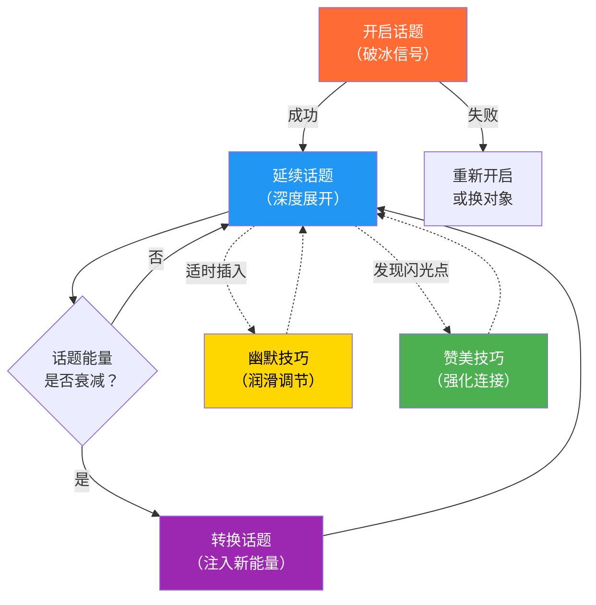
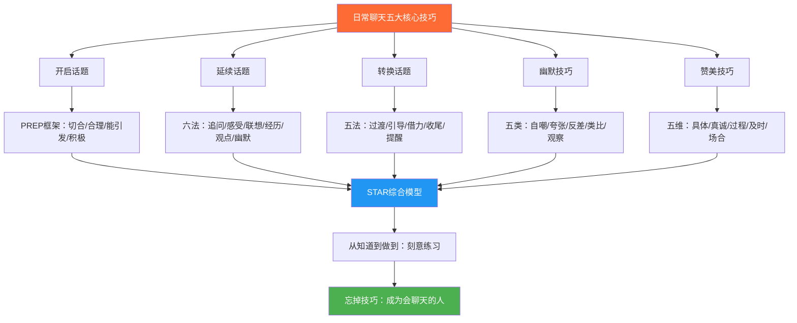

## 本节小结：五大核心技巧的完整图谱与综合应用

前面五节分别拆解了日常聊天的五大核心技巧——开启话题、延续话题、转换话题、幽默技巧、赞美技巧。本节的目标不是简单重复要点，而是做三件事：**回顾每个技巧的核心机制**、**揭示五者之间的协同关系**、**给出一套可立即上手的综合运用框架**。

如果你只读了其中几节，本小结可以帮你快速补全全貌；如果你全部读过，本小结帮你把散落的知识点编织成一张完整的行动网络。

---

## 一、五大技巧的核心机制回顾

### 1.1 开启话题：打破沉默的第一步

**本质**：发出"我愿意与你建立连接"的社交信号。开场白不需要惊艳，只需要让对方感受到善意和关注。

**核心方法**：

| 方法 | 适用场景 | 操作要点 |
|:-----|:---------|:---------|
| 环境观察法 | 任何公共场合 | 评论双方共同身处的环境，如装修、天气、活动布置 |
| 共同经历法 | 会议、排队、等电梯 | 提及双方刚刚共同经历的事情，天然建立共鸣 |
| 真诚赞美法 | 初次见面 | 从对方的穿着、配饰、气质中找到具体的赞美点 |
| 求助请教法 | 不确定如何切入 | 以开放性问题请求帮助，降低对方的防御心理 |
| 直接自我介绍 | 社交活动、行业聚会 | 坦诚表明身份和来意，展现自信和真诚 |

**底层逻辑——PREP框架**：一个有效的开场白需要同时满足四个条件——**P**ertinent（切合情境）、**R**easonable（合理自然）、**E**ngaging（能引发回应）、**P**ositive（传递积极情绪）。

**关键认知转折**：哈佛大学2021年发表在《Journal of Personality and Social Psychology》上的研究发现，人们系统性地低估了主动发起对话的积极效果——实验参与者预测与陌生人交谈会尴尬，但实际交谈后感受远比预期积极。**大多数人欢迎友善的主动搭话，而非抗拒它。**

### 1.2 延续话题：让对话持续流动

**本质**：在倾听的基础上，用恰当的回应方式让对方感到被理解、被重视，从而愿意继续展开对话。

**六种延续方法**：

| 方法 | 操作方式 | 效果 |
|:-----|:---------|:-----|
| 追问细节 | "后来呢？""具体是什么情况？" | 传递"我在认真听"的信号，引导对方深入展开 |
| 感受回应 | "听起来你当时一定很紧张" | 超越事实层面，触及情感共鸣 |
| 联想延伸 | "你说的让我想到……" | 搭建话题桥梁，自然引入新维度 |
| 共同经历 | "我也有过类似的经历" | 建立"我们是一类人"的认同感 |
| 观点交流 | "我觉得这件事可以从另一个角度看" | 提升对话深度，展示独立思考 |
| 幽默回应 | 在适当时机插入轻松的调侃 | 调节对话氛围，创造愉悦体验 |

**底层能力三角**：延续话题需要同时做到三件事——**专注倾听**（捕捉信息点和情绪）、**即时联想**（从对方的话中找到展开线索）、**灵活回应**（根据对方的风格调整自己的方式）。三者缺一，对话就会出现卡顿。

**关键数据**：对话中让对方说得更多的人，会被评价为"更受欢迎"和"更有亲和力"。倾听时间占比在60%-70%之间的对话者获得的好感度最高。

### 1.3 转换话题：优雅地切换频道

**本质**：当一个话题的能量衰减时，主动引入新话题来维持对话的活力。不是"逃离"当前话题，而是为对话注入新的能量。

**五种转换技巧**：

| 技巧 | 操作方式 | 适用信号 |
|:-----|:---------|:---------|
| 自然过渡法 | "说到这个，我突然想起……" | 话题自然走完生命周期 |
| 主动引导法 | "对了，你之前提到……" | 对方有未展开的话题线索 |
| 环境借力法 | 借助周围的人、事、物引出新话题 | 双方无话可说时 |
| 总结收尾法 | "这个话题挺有意思的，对了……" | 需要明确告别旧话题 |
| 时间提醒法 | "时间不早了，最后聊一个……" | 对话接近尾声 |

**七种需要转换的信号**：话题枯竭、敏感触发、氛围沉重、新人加入、兴趣丧失、时间限制、目的达成。其中"敏感触发"和"氛围沉重"属于高紧急度信号，需要立即行动。

**关键认知**：单个话题的平均持续时间约为2-4分钟。超过这个时间窗口而不引入新话题，对话活力会显著下降。学会识别信号、及时切换，是保持对话流畅的关键。

### 1.4 幽默技巧：让对话充满欢笑

**本质**：幽默不是天赋，而是一套可拆解、可学习、可练习的技能体系。它的核心机制是"失谐-解困"——制造一个"意外但合理"的信息，让大脑在预期被打破的瞬间产生认知快感。

**五种日常幽默类型**：

| 类型 | 机制 | 示例 |
|:-----|:-----|:-----|
| 自嘲式幽默 | 主动把自己放到"低位"，展示自信 | "我方向感特别差，导航都经常被我带偏" |
| 夸张式幽默 | 把小事放大到荒诞程度 | "我等这杯咖啡等了一个世纪" |
| 反差式幽默 | 用出人意料的转折打破预期 | "我终于瘦了——钱包" |
| 类比式幽默 | 用不相关的事物做巧妙对比 | "我的代码跟我的发型一样混乱" |
| 观察式幽默 | 从日常细节中发现荒诞之处 | "电梯里的人都在假装看手机，其实在等别人按楼层" |

**幽默的五大原则**：

1. **善意原则**：幽默的靶心永远是情境或自己，而不是对方的缺陷
2. **时机原则**：幽默需要在情绪"到位"时才投放，过早或过晚都无效
3. **自然原则**：刻意准备的笑话远不如顺势而为的调侃
4. **边界原则**：不拿种族、性别、疾病、外貌、信仰开玩笑
5. **接受失败原则**：90%的幽默可能不会引起预期反应，这很正常

**关键理论**：幽默的三大经典解释——失谐-解困理论（认知快感）、优越感理论（"幸好不是我"的释放）、释放理论（紧张情绪的宣泄）。理解机制才能灵活运用，而非机械模仿。

### 1.5 赞美技巧：用真诚打动人心

**本质**：赞美是人际交往中最强大的"软武器"。它的底层逻辑是满足人类最根本的心理需求——被看见、被认可、被珍视。

**赞美的五个核心维度**：

| 维度 | 操作要求 | 反面教材 |
|:-----|:---------|:---------|
| 具体化 | "你今天的领带和西装搭配得很协调" | "你穿得不错" |
| 真诚化 | 发自内心地表达，避免过度修饰 | "你是我见过最漂亮的人" |
| 关注过程 | "看得出你为这个方案下了很大功夫" | "你真聪明" |
| 及时性 | 在行为发生后尽快表达 | 过了一周才想起要夸 |
| 场合匹配 | 根据场合调整赞美的正式程度和内容 | 在严肃会议上夸对方发型 |

**四种进阶赞美技巧**：

1. **背后赞美**：在当事人不在场时表达欣赏，通过第三方传达，可信度翻倍
2. **请教式赞美**："你这个方案做得真好，能跟我讲讲思路吗？"——赞美+请教的双重效果
3. **对比式赞美**："相比上次，你这次的表达清晰了很多"——突出进步和成长
4. **细节式赞美**：关注别人忽略的细节，"你注意到PPT第15页的数据可视化做得特别用心"

**关键数据**：威廉·詹姆斯说"人类本质中最殷切的需求，是渴望被肯定"。神经科学研究证实，接收到真诚赞美时，大脑的伏隔核（奖励中枢）会被激活，释放多巴胺，产生愉悦感——其机制与获得物质奖励几乎相同。

---

## 二、五大技巧的协同关系

五大技巧不是孤立的技能清单，而是一个有机的系统。它们之间的关系可以用"对话生命周期"来理解：

**关键洞察**：

- **开启话题是入口**：没有成功的破冰，后续所有技巧都无用武之地。但它只需要做到"够用"——自然、友善、能引发回应即可。
- **延续话题是主干**：占据对话80%以上的时间。它决定了对话的深度和质量。
- **转换话题是节奏器**：在延续话题的过程中，适时转换让对话保持新鲜感。
- **幽默和赞美是催化剂**：它们穿插在对话的各个阶段，起到润滑、强化、深化的作用，而不是独立存在的"段落"。

### 2.1 技巧之间的配合模式

**模式一：开启→赞美→延续**

最经典的开场路径。用赞美破冰，然后通过追问细节延续话题。

> "你这个背包挺好看的，什么牌子的？" → "哦这个牌子我听说过，他们家的设计一直很有特点，你用了多久了？" → 自然进入关于使用体验的深度对话。

**模式二：延续→幽默→延续→转换**

在对话进入平台期时，用幽默打破沉闷，重新激活对话能量，然后在幽默的余韵中自然转换到新话题。

> 聊工作聊到有些沉重 → "我跟你说，我上次开会差点睡着，还好打了个喷嚏把自己吓醒了" → 对方笑 → "对了，你周末一般怎么放松？"

**模式三：转换→赞美→延续**

转换话题时用赞美作为过渡的润滑剂，避免生硬跳转。

> "刚说到健身，我突然想起你上次发的那个健身照，效果真明显，你是怎么坚持下来的？" → 从旧话题自然过渡到新话题，赞美起到了桥梁作用。

**模式四：延续→幽默→赞美→转换**

在深度对话中，用幽默缓解可能的紧张，用赞美肯定对方，然后在积极氛围中转向新话题。

> 对方分享了一个工作挑战 → 幽默回应"这难度堪比我当年考研" → 赞美"不过你能扛下来真的很厉害" → "对了，你平时压力大的时候怎么调节？"

---

## 三、综合运用框架：STAR对话模型

将五大技巧整合为一个可操作的对话模型——**STAR框架**：

| 阶段 | 英文 | 对应技巧 | 核心任务 | 时间占比 |
|:-----|:-----|:---------|:---------|:---------|
| S | Start | 开启话题 | 打破沉默，建立连接 | 5%-10% |
| T | Talk | 延续话题 | 深入交流，寻找共鸣 | 50%-60% |
| A | Adjust | 转换话题+幽默 | 调节节奏，保持活力 | 20%-30% |
| R | Recognize | 赞美技巧 | 肯定对方，强化关系 | 10%-15% |

**STAR模型的使用要点**：

1. **S阶段不要恋战**：开场白只需30秒到1分钟，目标是引发对方的回应，而不是展示你的口才。
2. **T阶段以倾听为主**：遵循60/70法则——让对方说60%-70%的话，你负责引导和回应。
3. **A阶段保持敏感**：时刻观察对方的反应，当出现能量下降的信号时（回答变短、眼神游离），及时用幽默或话题转换来调节。
4. **R阶段自然融入**：赞美不是独立环节，而是在对话过程中随时捕捉对方的闪光点并即时表达。

---

## 四、从知道到做到：刻意练习路径

知道技巧和熟练运用之间隔着一道"刻意练习"的鸿沟。以下是一条分阶段的练习路径：

### 第一阶段：单项突破（第1-2周）

| 日期 | 练习重点 | 每日任务 |
|:-----|:---------|:---------|
| 第1-2天 | 开启话题 | 每天主动与1个陌生人开启对话 |
| 第3-4天 | 延续话题 | 在对话中刻意使用追问细节和感受回应各2次 |
| 第5-6天 | 转换话题 | 在对话中至少进行1次话题转换 |
| 第7天 | 综合复习 | 回顾本周的对话，记录成功和失败的经验 |

### 第二阶段：组合运用（第3-4周）

| 日期 | 练习重点 | 每日任务 |
|:-----|:---------|:---------|
| 第1-3天 | 开启+延续 | 练习将开场白自然过渡到深度对话 |
| 第4-5天 | 延续+幽默 | 在对话中适时插入1次幽默回应 |
| 第6-7天 | 赞美+延续 | 用赞美作为话题延续的切入点 |

### 第三阶段：综合实战（第5-6周）

| 日期 | 练习重点 | 每日任务 |
|:-----|:---------|:---------|
| 第1-3天 | STAR全流程 | 在每次对话中完成完整的STAR流程 |
| 第4-5天 | 多人场景 | 在群聊或聚会中练习技巧的灵活切换 |
| 第6-7天 | 复盘总结 | 录音回听自己的对话，找出改进空间 |

### 练习效果评估标准

| 等级 | 表现特征 | 对应阶段 |
|:-----|:---------|:---------|
| 入门 | 能主动开口，对话能持续3分钟以上 | 第一阶段完成 |
| 进阶 | 对话中能自然转换话题，偶尔使用幽默 | 第二阶段完成 |
| 熟练 | 对话流畅自然，技巧运用无明显痕迹 | 第三阶段完成 |
| 精通 | 能根据不同对象和场景灵活调整策略，对方感觉不到你在"使用技巧" | 持续实践 |

---

## 五、五大技巧的核心原则速查表

在实际对话中，你不可能逐条回忆每种技巧的操作要点。以下是一张精简的速查表，帮助你在对话中快速调取关键原则：

| 技巧 | 一句话核心 | 三个必须做到 | 一个绝对不要 |
|:-----|:---------|:-------------|:-------------|
| 开启话题 | 让对方感到"这个人挺友善的" | 眼神接触、微笑、自然 | 不要准备"完美台词"后才开口 |
| 延续话题 | 让对方感到"这个人真的在听" | 追问细节、回应感受、分享自己 | 不要只顾说自己、忽略对方 |
| 转换话题 | 让对方感到"对话一直在流动" | 观察信号、自然过渡、保持连贯 | 不要生硬跳转、不解释就换 |
| 幽默技巧 | 让对方感到"和你聊天很愉快" | 善意为先、顺势而为、接受失败 | 不要拿对方的痛点开玩笑 |
| 赞美技巧 | 让对方感到"被真正看见了" | 具体、真诚、及时 | 不要空洞敷衍、过度吹捧 |

---

## 六、常见陷阱与纠偏

即使掌握了五大技巧的正确用法，仍然可能落入一些"看起来正确实则有害"的陷阱。以下是每个技巧最常见的一个陷阱及其纠偏方法：

### 6.1 开启话题的陷阱：过度准备

**表现**：花大量时间构思"完美开场白"，结果错失最佳时机。

**纠偏**：记住一条原则——**"不完美的行动胜过完美的等待"**。研究显示，开场白的质量对对话成功率的影响不到15%，而是否开口本身的影响超过70%。第一句话说什么远不如"说了"这件事重要。

### 6.2 延续话题的陷阱：问题轰炸

**表现**：为了延续话题，不断提问，让对话变成"审讯"。

**纠偏**：遵循"一问一答一分享"的节奏——提一个问题，听完对方回答后，先分享自己的相关经历或看法，再自然引出下一个问题。这样对话才是双向的，而不是单方面的信息索取。

### 6.3 转换话题的陷阱：逃避深度

**表现**：每当话题深入到需要真情实感的层面，就立刻转换话题，永远停留在安全的浅层交流。

**纠偏**：深度对话是建立真正连接的关键。当对方开始分享个人感受或深层想法时，不要急于逃离，而是用追问和感受回应来鼓励对方继续。浅层闲聊是起点，不是终点。

### 6.4 幽默技巧的陷阱：用力过猛

**表现**：为了显得幽默，每句话都想搞笑，结果让人觉得不真诚或轻浮。

**纠偏**：幽默是调味品，不是主菜。一段10分钟的对话中，1-2次恰到好处的幽默就足够了。重点是"顺势而为"——当情境自然产生笑点时接住它，而不是强行制造笑点。

### 6.5 赞美技巧的陷阱：泛泛而夸

**表现**：每次都用"你真棒""好厉害""不错"等空洞的词汇，让赞美失去力量。

**纠偏**：每次赞美前问自己一个问题——"我能否说出至少一个具体细节？"如果不能，就不要开口。"你这个方案的第三部分数据分析做得特别有说服力，尤其是那个对比图表"，远比"你方案做得不错"更有力量。

---

## 七、进阶思考：超越技巧的境界

真正精通日常聊天的人，最终会进入一个"忘掉技巧"的境界。这不是说技巧不重要，而是技巧已经内化为本能，不再需要刻意调用。

### 7.1 从"使用技巧"到"成为会聊天的人"

三个阶段的蜕变：

| 阶段 | 心态 | 行为 |
|:-----|:-----|:-----|
| 初学 | "我需要使用技巧" | 刻意回忆、机械套用 |
| 熟练 | "我知道什么时候用什么" | 有意识但不生硬 |
| 精通 | "我只是在和人聊天" | 技巧完全内化，自然流露 |

### 7.2 超越技巧的三个底层修炼

1. **培养好奇心**：对人真正感兴趣的人，不需要"追问技巧"——他们会自然地想知道更多
2. **积累生活经验**：有丰富生活的人，不需要"话题清单"——他们有聊不完的故事和见解
3. **修炼共情能力**：能感受他人情绪的人，不需要"信号识别表"——他们本能地知道什么时候该听、该问、该笑、该夸

### 7.3 日常聊天的终极目标

回到前文闲聊的本质——**闲聊不是传递信息，而是建立连接**。所有技巧的最终指向，不是让你"说得漂亮"，而是让你在每一次对话中，都让对方感受到：

- "这个人关注我"
- "这个人理解我"
- "和这个人聊天很舒服"
- "我想再和这个人聊"

当你能让对方产生这四个感受时，你已经不需要任何技巧了——因为你已经成为了一个真正会聊天的人。

---

## 八、本节要点速记

最后用一张总览图回顾核心技巧的完整体系：

在下一节的实战案例中，你将看到这些技巧如何在"初次见面""同事闲聊""朋友聚会""相亲场合""微信群聊""电梯偶遇""排队等候""邻居碰面"等八大真实场景中协同发挥作用。理论终归要落地——准备好了，就继续前进。
