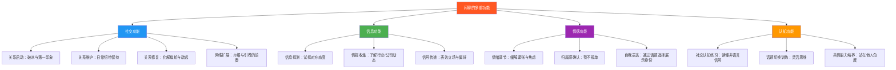
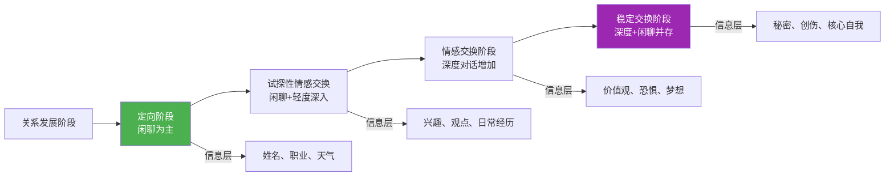
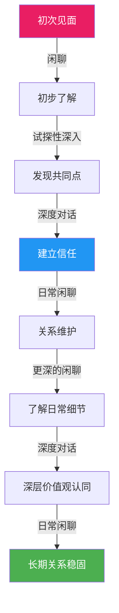
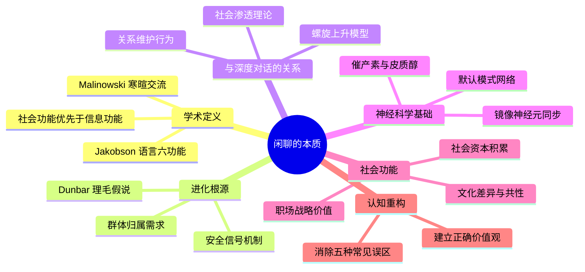

## 一、闲聊的本质：不只是"没话找话"

大多数人对闲聊有一种根深蒂固的偏见：它是浪费时间的废话，是社交场合中不得不忍受的"填充物"，是有意义对话的反面。这种偏见让无数人在电梯里低头看手机，在茶水间假装忙碌，在聚会中缩在角落刷朋友圈——他们不是不想社交，而是打心底觉得"聊天气""聊吃了没"这种事情毫无价值。

这个认知是错的，而且错得离谱。

闲聊不仅不是废话，反而是人类社会运转的基础润滑剂。它承担着信息探测、关系维护、情绪调节、社会网络构建等多重关键功能。那些认为"只有深度对话才有价值"的人，往往也是社交圈最窄、人脉最脆弱的人——因为他们切断了通往深度对话的唯一入口。

本章将从语言学、进化心理学、社会学和神经科学四个维度，彻底解构闲聊的本质，让你理解为什么这件"小事"值得被认真对待。

### 1.1 闲聊的定义与边界

#### 1.1.1 学术定义

闲聊（small talk），在学术语境中更精确的名称是"寒暄交流"（phatic communication）。这个概念由波兰裔英国人类学家 Bronisław Malinowski 在 1923 年首次提出。他在研究特罗布里恩群岛（Trobriand Islands）原住民的语言使用时发现，许多对话的目的根本不是传递信息，而是维持社交纽带。

Malinowski 原文写道：

> "语言的功能不一定是表达思想，而是履行一种社会义务……一种通过声音建立联结的社交功能。"

当两个人见面说"今天天气不错"时，他们交换的不是气象数据——双方都看得到天空。他们真正传递的信号是：**"我注意到了你的存在，我愿意与你保持友好关系。"**

语言学家 Roman Jakobson 后来将语言功能分为六类（表达功能、指称功能、诗学功能、寒暄功能、元语言功能、意动功能），其中寒暄功能（phatic function）被单独列为独立类别，与信息传递功能平起平坐。这说明语言学界早已认识到：**不传递信息的语言，同样具有不可替代的社会价值。**

#### 1.1.2 闲聊与相关概念的区分

很多人混淆闲聊与其他社交对话形式。以下表格厘清边界：

| 对话形式 | 核心目的 | 典型场景 | 信息密度 | 情感功能 |
|---------|---------|---------|---------|---------|
| **闲聊** | 建立/维护关系 | 茶水间、电梯、排队 | 低 | 高 |
| **信息交换** | 传递具体信息 | 工作汇报、学术讨论 | 高 | 低 |
| **深度对话** | 探索观点与感受 | 朋友深夜长谈 | 中高 | 高 |
| **争论/辩论** | 说服对方 | 学术答辩、商业谈判 | 高 | 负面 |
| **仪式性对话** | 遵循社会规范 | 婚礼致辞、葬礼安慰 | 低 | 中 |

关键区分：闲聊的**信息内容**几乎不重要，重要的是**交互行为本身**。你和同事聊了五分钟天气，过后你一个字也记不住——但你们的关系温度提升了 0.5 度。这 0.5 度，在你需要帮忙时，可能就是决定对方"不好意思拒绝"还是"跟你不太熟"的关键。

#### 1.1.3 闲聊的功能全景图

### 1.2 闲聊的进化根源

闲聊不是现代社会的发明，而是人类数百万年进化的产物。理解它的进化逻辑，才能真正理解为什么我们无法跳过它。

#### 1.2.1 理毛假说：从梳毛到闲聊

英国人类学家 Robin Dunbar 提出了著名的"社会脑假说"（Social Brain Hypothesis）。他发现，灵长类动物大脑新皮层的大小与其社会群体的规模高度相关——群体越大，大脑越大。Dunbar 推算出人类的"自然群体上限"约为 150 人（即"Dunbar 数"）。

更关键的是，Dunbar 指出灵长类动物通过**互相理毛**（grooming）来维系社会关系。理毛释放内啡肽，建立信任和亲密感。但理毛有一个致命限制：它是**一对一**的，同一时间只能为一个伙伴服务。

当人类群体规模扩大到 150 人时，一对一的理毛效率远远不够。进化给出的解决方案是：**语言，特别是闲聊。**

与理毛相比，闲聊的优势是革命性的：

| 维度 | 理毛（灵长类） | 闲聊（人类） |
|------|-------------|------------|
| 同时服务人数 | 1 人 | 3-5 人（小组聊天） |
| 信息带宽 | 极低（只有触觉） | 高（语言+语调+表情） |
| 距离限制 | 必须身体接触 | 数米到数十米 |
| 社交半径 | 5-10 个亲密伙伴 | 150 人（Dunbar 数） |
| 情感传递效率 | 慢（理毛 20 分钟=建立信任） | 快（5 分钟闲聊=破冰） |

Dunbar 进一步估算，人类每天大约花 **2 小时**在社交对话上（跨文化一致），其中约 **60-70%** 是闲聊性质的。这不是时间浪费，而是维系 150 人社会网络的**最低维护成本**。

#### 1.2.2 安全信号机制

在进化环境中，两个陌生人相遇是一个**高风险场景**——对方可能是敌人、竞争者、或潜在的合作者。闲聊作为一种低成本的"试探性互动"，提供了三种关键的安全信号：

**第一，意图透明化。** 通过主动开启轻松对话，你向对方展示："我没有敌意，我的目的是友好的。"神经科学研究证实，友好的社交互动会触发双方大脑释放**催产素**（oxytocin），这是一种与信任、亲密和社会联结密切相关的神经激素。催产素水平的升高会降低杏仁核（负责恐惧和威胁检测）的活跃度，从而降低防御反应。

**第二，社会地位探测。** 通过闲聊中的语言风格、话题选择、知识面广度，人们在无意识中评估对方的社会地位、智力水平和资源状况。这种评估是即时的、自动的，通常在对话开始后的 **30 秒内**就完成了初步判断。

**第三，互惠性测试。** 闲聊是一种"小额投资"。如果对方拒绝回应你的友好试探（比如你打招呼时对方不理不睬），你损失的只是几秒钟的社交努力。但如果对方回应了，你们就建立了互惠关系的第一步。这种低成本试探在博弈论中被称为"廉价谈话"（cheap talk），它是建立合作的基础策略。

#### 1.2.3 群体归属的进化压力

从进化的角度看，被群体排斥等同于死刑。在远古环境中，脱离群体的个体面临极高的被捕食、饥饿和伤病风险。因此，人类进化出了一套强烈的**归属需求系统**——我们本能地渴望被群体接纳，恐惧被排斥。

心理学家 Kipling Williams 的"抛球实验"（Cyberball Experiment）生动展示了这一点：即使只是被虚拟游戏中的其他参与者忽视（不把球传给你），参与者也会体验到显著的负面情绪，脑成像显示这种体验激活的脑区与**身体疼痛**高度重叠。

闲聊正是维护群体归属感的日常手段。在办公室里，那个每天跟你聊两句天气的同事，其实在持续向你发送"你属于我们这个群体"的信号。而那些从不参与闲聊的人，虽然可能从未被明确排斥，却会在潜意识中感到"格格不入"。

### 1.3 闲聊与深度对话的辩证关系

"我只想跟人聊有深度的话题"——这句话听起来很有追求，但实际上暴露了两个认知误区。

#### 1.3.1 社会渗透理论：闲聊是深度关系的入口

心理学家 Irwin Altman 和 Dalmas Taylor 在 1973 年提出了**社会渗透理论**（Social Penetration Theory）。这个理论用一个形象的比喻来描述人际关系的发展：人就像洋葱，由外到内有多层，从表面信息（姓名、职业、爱好）到核心信息（恐惧、创伤、价值观）。关系的发展就是一层一层"剥洋葱"的过程。

关键洞见：**你不能跳过外层直接进入内层。** 就像你不能第一次见面就问"你童年最大的创伤是什么"——这不叫真诚，这叫社交灾难。闲聊是定向阶段和试探阶段的主要工具，没有它，你永远无法获得进入更深层次的"门票"。

Arthur Aron 在 1997 年的经典实验中，让陌生人在 45 分钟内回答 36 个逐渐深入的问题，结果发现许多人因此建立了深厚的亲密感甚至恋爱关系。但这个实验的起始问题是什么？是"你想成名吗？以什么方式？"和"你上次唱歌给自己听是什么时候？"——这些本质上就是**结构化的闲聊话题**。

#### 1.3.2 关系维护的日常需求

即使在已经建立的深度关系中，闲聊仍然不可或缺。社会学研究揭示了一个反直觉的规律：

**那些只在有"重要事情"时才沟通的关系，往往比每天都有轻松闲聊的关系更加脆弱。**

原因在于"关系维护行为"（Relational Maintenance Behaviors）。学者 Laura Stafford 和 Daniel Canary 确定了五种关键的关系维护策略：

1. **积极性**（Positivity）：保持互动愉快、乐观
2. **开放性**（Openness）：愿意讨论关系本身
3. **保证**（Assurances）：表达对关系的承诺
4. **社交网络**（Social Networks）：与对方的社交圈互动
5. **共享任务**（Sharing Tasks）：分担共同责任

其中，"积极性"是最频繁使用的策略，而它的主要载体就是日常闲聊。每天的"今天怎么样""中午吃了什么""周末打算干嘛"看似琐碎，实际上在持续传递"我关心你的日常"这个核心信号。

#### 1.3.3 闲聊与深度对话的互补模型

两者不是对立关系，而是**螺旋上升**的关系：

注意这个模型中的关键节点：**"更深的闲聊"**。这不是自相矛盾，而是指随着关系深入，闲聊的内容会自然变得更私密——从"今天天气不错"到"今天工作好烦"再到"我最近对人生方向很迷茫"。闲聊的深度随着关系的深度同步提升，但它的轻松、非正式的本质不变。

### 1.4 闲聊的神经科学基础

现代脑成像技术让我们能够"看到"闲聊时大脑内部发生了什么。

#### 1.4.1 默认模式网络的社交功能

当人们进行轻松的社交对话时，大脑的**默认模式网络**（Default Mode Network, DMN）会被激活。DMN 是一组在"非任务状态"下活跃的脑区，包括内侧前额叶皮层、后扣带回皮层和颞顶联合区。

DMN 在闲聊中的角色是：**持续运行"社交模拟"——你在对话的同时，大脑在后台不断推演对方的心理状态、评估你们的关系动态、预测对话的走向。** 这就是为什么闲聊虽然"不用动脑"，但如果你心不在焉（比如一边聊天一边想工作），很快就会露出破绽——你的 DMN 没有分配足够的资源给社交模拟。

#### 1.4.2 镜像神经元与共情同步

闲聊过程中，对话双方的大脑活动会出现**神经同步**（neural synchrony）现象。研究发现，当两个人进行自然对话时，说话者的大脑活动模式会在约 1-2 秒后"传染"给听者，这种同步程度与对话质量正相关。

这种同步的主要机制是**镜像神经元系统**。当你听对方描述周末去爬山的经历时，你大脑中负责运动规划的区域也会激活——你在"模拟"爬山的体验。这种神经层面的"感同身受"是共情的基础，而闲聊正是锻炼这种能力的最佳训练场。

#### 1.4.3 催产素与皮质醇的平衡

| 神经化学物质 | 闲聊中的作用 | 缺乏闲聊时的影响 |
|------------|-----------|---------------|
| **催产素** | 释放信任和亲密信号 | 社交信任感降低 |
| **内啡肽** | 产生愉悦感和归属感 | 社交孤立感增加 |
| **皮质醇** | 降低压力激素水平 | 长期社交压力累积 |
| **血清素** | 调节情绪稳定性 | 情绪波动加剧 |
| **多巴胺** | 新话题带来新奇感 | 社交动机下降 |

哈佛大学 2010 年的一项研究发现，与陌生人进行简短的闲聊（即使只有 5 分钟）可以显著降低参与者的皮质醇水平，并提升主观幸福感。更有趣的是，那些主动发起闲聊的人比被动回应者获得了更大的情绪收益——**主动社交比被动社交更能提升幸福感。**

### 1.5 闲聊的社会功能深度解析

#### 1.5.1 社会资本的日常积累

社会学家 Robert Putnam 在《独自打保龄》（Bowling Alone）中区分了两种社会资本：

- **桥接型社会资本**（Bridging Social Capital）：弱连接带来的广泛信息和机会网络
- **粘合型社会资本**（Bonding Social Capital）：强连接带来的深度信任和支持

闲聊是**桥接型社会资本的主要生产方式**。Mark Granovetter 的经典论文《弱连接的力量》（The Strength of Weak Ties, 1973）证明，大多数工作机会、商业信息和创新灵感来自于弱连接（即那些你不怎么深入交流但保持日常联系的人），而非强连接（亲密好友和家人）。

这意味着什么？你每天在公司走廊里跟不同部门的人进行的 30 秒闲聊，实际上在构建一个巨大的弱连接网络。这个网络在你意想不到的时刻——跳槽、找供应商、解决问题——会发挥关键作用。

#### 1.5.2 文化差异与共性

不同文化对闲聊的态度和规范差异巨大，但闲聊的**底层功能**是跨文化一致的：

| 文化维度 | 高语境文化（如中国、日本） | 低语境文化（如美国、德国） |
|---------|---------------------|---------------------|
| 闲聊时长 | 较长，注重铺垫 | 较短，快速切入正题 |
| 话题偏好 | 关系型（家庭、健康） | 信息型（工作、兴趣） |
| 沉默容忍度 | 高（沉默不尴尬） | 低（沉默需填补） |
| 闲聊深度 | 渐进式（从浅到深） | 可跳跃式（较快深入） |
| 非语言成分 | 高（眼神、微笑、递茶） | 低（语言为主） |
| 破冰方式 | 通过中间人介绍 | 自我介绍 |

在中国文化语境下，闲聊有一些独特特征：

- **饭桌闲聊**：中国商业关系的建立几乎必然经历"先吃饭后谈事"的阶段。饭桌上的闲聊（聊家乡、聊孩子、聊养生）不是浪费时间，而是建立信任的必要步骤。
- **关系（guanxi）维护**：中国社会的关系网络比西方更依赖日常维护。逢年过节的问候、朋友圈的点赞评论、偶尔的"近来如何"——这些都是闲聊形态的关系维护行为。
- **面子机制**：闲聊是"给面子"的重要方式。主动跟某人闲聊，表达的是"我重视你这个人"；拒绝回应闲聊，则是"不给面子"的社交攻击。

#### 1.5.3 职场中的闲聊战略价值

Google 在 2012 年启动了"亚里士多德计划"（Project Aristotle），研究是什么让团队高效运作。研究发现，排名第一的因素不是成员的个人能力、学历或经验，而是**心理安全感**（psychological safety）——团队成员是否敢于冒险、表达不同意见、承认错误。

而心理安全感的核心来源之一，正是团队成员之间的**日常闲聊**。那些在会议前聊几句周末活动、午饭时讨论最近看的剧、茶水间分享零食的团队，其心理安全感显著高于"只谈工作"的团队。

原因很简单：闲聊让同事从"工作角色"变成"活生生的人"。当你了解到同事喜欢爬山、养了一只猫、最近在学吉他，你在跟他讨论工作分歧时就更倾向于"他是一个有想法的人"，而不是"他是一个反对我方案的障碍"。

### 1.6 常见误区与认知纠正

#### 误区一："闲聊是虚伪的"

**错。** 闲聊遵循的是"社交剧本"（social script），而非"表达真实内心"。就像你不会在婚礼上宣读新人的财务报表一样，社交场合有其适当的表达层级。遵循社交剧本不是虚伪，而是**社交智慧**。

真正虚伪的是**用闲聊来操控**——假装关心对方以获取利益。正常的闲聊，即使话题是天气，背后的社交意图（建立友好关系）是真诚的。

#### 误区二："内向者不擅长/不需要闲聊"

**错。** 内向者的社交特点不是"不需要社交"，而是"需要独处来充电"。内向者同样需要社会连接，只是他们偏好**一对一**或**小群体**的闲聊形式，而非大群体的嘈杂社交。

实际上，很多内向者是优秀的闲聊者——他们通常更善于倾听、观察力更强、对话更有深度。关键不是"要不要闲聊"，而是"选择什么形式的闲聊"。

#### 误区三："闲聊会阻碍效率"

**部分错。** 在需要高度专注的工作场景（如编程、写作、手术），确实应该减少闲聊。但在大多数工作场景中，适度的闲聊不仅不会降低效率，反而会**提升团队协作效率**。

哈佛商学院的研究发现，在一起工作前花 10 分钟进行非正式闲聊的谈判小组，比直接进入正题的小组达成了**更好的协议**（双方满意度更高，总价值更大）。闲聊建立了信任基础，让后续的协作更顺畅。

#### 误区四："我不会聊天是因为性格问题"

**大错特错。** 闲聊是一种**可习得的技能**，与性格类型无关。就像学开车一样，有些人上手快、有些人需要更多练习，但几乎所有正常智力的人都能学会。

那些自称"不会聊天"的人，通常面临的是以下具体问题之一：

| 表面症状 | 实际原因 | 解决方向 |
|---------|---------|---------|
| 不知道说什么 | 话题库不足 | 积累话题素材 |
| 说了几句就冷场 | 不会追问和延伸 | 学习追问技巧 |
| 怕说错话 | 过度自我审查 | 降低心理门槛 |
| 对方不感兴趣 | 没有关注对方反应 | 学习观察反馈 |
| 觉得无聊 | 没有理解闲聊的价值 | 认知重构（本章内容） |

每一个问题都有对应的、可练习的解决方案——这些将在后续章节详细展开。

#### 误区五："网络时代不需要面对面闲聊了"

**错得离谱。** 社交媒体和即时通讯工具增加的是信息交换的效率，但**降低**了社交关系的质量。研究表明，频繁使用社交媒体的人反而报告更高的孤独感。

面对面闲聊中包含的信息维度（微表情、语调、肢体语言、共同物理空间的体验感）是文字消息无法替代的。一个简短的面对面闲聊，在建立亲密感方面的效果约等于 **10-15 条微信消息**。

### 1.7 闲聊能力的自我评估

在深入学习技巧之前，先了解自己当前的水平。以下是一个简化的自评框架：

**Level 1 — 回避者**：尽可能避免一切非必要社交，电梯里宁可看手机，遇到不太熟的人会绕路走。

**Level 2 — 被动回应者**：别人发起闲聊时能应付，但很少主动开启对话。对话通常在 1-2 分钟内自然消亡。

**Level 3 — 基本胜任者**：能在大多数社交场合进行 5-10 分钟的闲聊，能接住常见话题，但不太会引导对话深入。

**Level 4 — 熟练社交者**：能自如地开启、维持和结束闲聊，善于发现共同话题，能让对方感到舒适和被关注。

**Level 5 — 社交高手**：能与任何类型的人建立轻松对话，善于在闲聊中自然过渡到有意义的话题，让每次对话都有"意犹未尽"的感觉。

大多数人在 Level 2-3 之间。通过系统学习和刻意练习，达到 Level 4 并不困难。Level 5 需要更多的实践积累和社交敏感度的培养。

### 1.8 本节核心要点回顾

**一句话总结：闲聊不是"没话找话"，而是人类数百万年进化出的、用语言替代理毛的、以最低成本维护社会网络的核心生存策略。轻视闲聊，就是轻视人类最基本的社会能力。**
