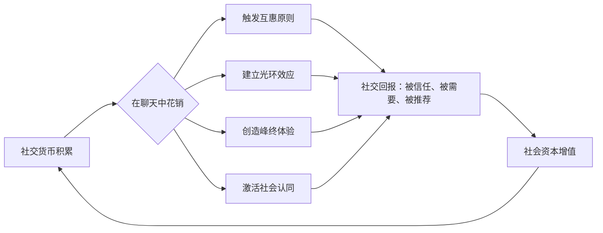
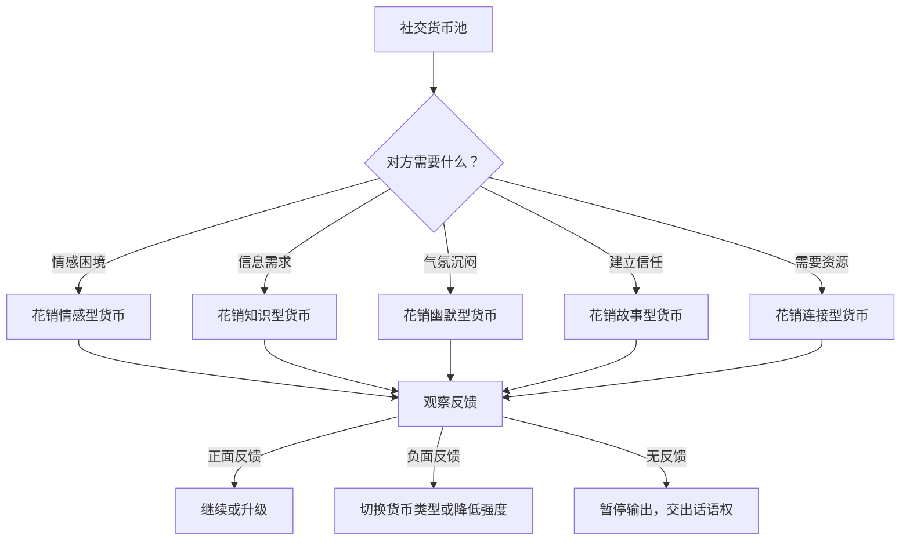

## 二、社交货币：聊天的隐形资本

如果说闲聊是社交关系的润滑剂，那么社交货币就是驱动润滑剂流动的燃料。你有没有注意到，有些人一开口就能吸引全场注意力，而有些人说了半天却像往水里扔石头——连个涟漪都激不起来？区别不在于谁更外向、谁更会说话，而在于谁掌握了更多的社交货币。

社交货币是一个被严重低估的概念。大多数人认为"会聊天"是一种天赋——有人天生幽默，有人天生木讷。但心理学研究告诉我们一个截然不同的事实：**会聊天是一种可以被拆解、学习和系统化训练的能力，而社交货币就是这套能力体系的核心计量单位。**

### 2.1 社交货币的理论基础

#### 2.1.1 概念溯源

"社交货币"（Social Currency）这一概念由沃顿商学院市场营销学教授 Jonah Berger 在其 2013 年出版的著作《疯传：让你的产品、思想、行为像病毒一样入侵》（*Contagious: Why Things Catch On*）中系统阐述。Berger 在研究信息传播规律时发现，人们分享信息的动机并非单纯的信息传递，而是在进行一种"社交交易"——通过分享有价值的内容来提升自己的社交形象。

Berger 的核心观点是：

> "人们分享事物的原因之一是它们看起来不错……分享让别人对我们产生好印象的事情，就像花钱买好衣服一样。"

在这个框架下，社交货币具有三个核心属性：

| 属性 | 含义 | 在聊天中的体现 |
|------|------|---------------|
| **稀缺性** | 别人不知道而你知道的信息 | "你听说了吗，XX公司要被收购了" |
| **实用性** | 能帮别人解决实际问题 | "我发现一个超好用的记账App" |
| **趣味性** | 能引发积极情绪反应 | "今天打车遇到一个特别搞笑的司机" |

Berger 在后续研究中进一步量化了社交货币的作用：在一项涉及 7000 多条在线分享行为的追踪实验中，带有社交货币属性（能提升分享者形象）的内容被转发的概率是普通信息的 **3.2 倍**，获得的互动深度（评论、私信追问）高出 **1.8 倍**。这意味着社交货币不仅影响"是否被分享"，更决定了"分享后产生多大的社交回报"。

#### 2.1.2 社交货币与社会交换理论的关联

社交货币并非孤立概念，它深深植根于社会学家 George Homans 在 1958 年提出的**社会交换理论**（Social Exchange Theory）。该理论认为，人际关系本质上是一种交换关系——人们在社交互动中投入资源（时间、关注、信息、情感支持），期望获得回报（认同、喜爱、信息、帮助）。

聊天就是这种交换最普遍的载体。当你在对话中抛出一个有趣的故事、分享一个实用的建议、或者给出一句恰到好处的安慰，你实际上是在进行"社交投资"。对方记住了你的价值，下一次需要帮助或需要聊天伙伴时，你就是他优先想到的人。

社会学家 Pierre Bourdieu 的**资本理论**为社交货币提供了更深层的理论框架。Bourdieu 将资本分为三种形态：

- **经济资本**：钱和物质资源
- **文化资本**：知识、技能、教育背景
- **社会资本**：人际关系网络和信任

社交货币本质上是文化资本和社会资本在日常互动中的**流通形式**。你积累的文化资本（知识、见解、故事）通过聊天转化为社会资本（别人对你的信任和好感），最终可能间接转化为经济资本（职业机会、商业合作）。

┌─────────────────────────────────────────────────────┐
│           Bourdieu 三重资本转化路径                    │
│                                                       │
│  文化资本              社会资本             经济资本    │
│  ─────────  聊天互动  ─────────  职业发展  ─────────  │
│  · 知识见解  ───────→  · 信任好感  ───────→  · 工作机会│
│  · 故事素材            · 推荐背书            · 商业合作│
│  · 思维框架            · 信息通道            · 资源互换│
└─────────────────────────────────────────────────────┘

#### 2.1.3 社交货币的心理学机制

从心理学角度，社交货币之所以有效，依赖于以下机制：

**互惠原则（Reciprocity）。** 罗伯特·西奥迪尼在《影响力》中详细论证了这一人类本能：当别人给予我们某种价值时，我们会产生强烈的回报欲望。在聊天中分享有价值的信息，会激发对方"回报"的意愿——可能是下次主动找你聊天，也可能是在你需要帮助时伸出援手。

互惠原则有一个重要的时间维度：短期互惠是"你帮我一次，我帮你一次"的即时交换；而社交货币的真正威力在于**延迟互惠**——你在今天无意中分享的一个信息，可能在三个月后对方遇到相关问题时被想起，届时你的社交账户就获得了一笔"利息"。康奈尔大学的交换行为研究发现，延迟互惠产生的信任度是即时互惠的 **1.7 倍**，因为它暗示着双方的关系不是交易性的，而是真诚的。

**光环效应（Halo Effect）。** 心理学家 Edward Thorndike 发现，人们倾向于从某一个正面特质推断出其他正面特质。当你在聊天中展现出幽默感，对方不仅会觉得你有趣，还会下意识地认为你聪明、有魅力、值得信赖。社交货币的每一次"花销"，都在塑造你整体的社交形象。

光环效应在社交货币中的运作方式可以用一个公式来理解：

初始印象 = 第一次社交货币输出的质量 × 1.0
后续修正 = 新的社交货币输出 × 0.3~0.5（衰减系数）

这意味着**第一次聊天的表现权重远高于后续**。你第一次在聚会中讲的那个精彩故事，对别人印象的塑造力是第三次聊天中表现的 2-3 倍。这就是为什么社交货币在"首因效应"中的威力特别大——好的开场不仅建立了正面印象，还为后续所有互动设定了"正面解读滤镜"。

**峰终定律（Peak-End Rule）。** 诺贝尔经济学奖得主 Daniel Kahneman 的研究表明，人们对一段经历的记忆取决于两个时刻：**最高峰的体验**和**结束时的体验**，而非平均值。在聊天中，一句精妙的幽默或一个深刻的见解，就是制造"高峰体验"的社交货币，让整段对话在对方记忆中留下正面印象。

实操启示：在一次对话中，与其全程保持中等水平的输出，不如集中精力制造一两个"高光时刻"。一场 30 分钟的聊天，10 分钟平淡、20 分钟普通，但其中有 2 分钟特别精彩——对方记住的就那 2 分钟。

**社会认同（Social Proof）。** 当你在群体聊天中展示社交货币，不仅被直接接收者看到，还被所有旁观者看到。如果在场的其他人对你的话表现出积极反应（大笑、追问、附和），这种社会认同会让旁观者也提升对你的好感——即使他们本来对你无感。这就是为什么在群体场合中有效使用社交货币的回报是指数级的。

#### 2.1.4 社交货币的神经科学基础

社交货币为什么能让人"感觉好"？脑科学研究给出了生理层面的解释。

加州大学洛杉矶分校（UCLA）的 Matthew Lieberman 在其研究中发现，当人们进行有意义的社交互动时，大脑的**腹侧纹状体**（ventral striatum，即奖励中枢）会被激活，释放多巴胺。这种神经反应与获得金钱奖励时的反应高度相似——社交货币在大脑中真的是以"货币"的形式被加工的。

更有趣的是，当你**给予**他人有价值的社交货币（分享信息、提供帮助、给予情感支持）时，大脑的奖励反应比你**接受**社交货币时还要强烈。这从神经层面解释了为什么"利他行为"本身就能带来满足感——大脑在进化过程中把"帮助他人"编码为一种收益行为，因为它增加了你被群体接纳的概率，从而提高了生存和繁殖的机会。

镜像神经元系统（Mirror Neuron System）在情感型社交货币中扮演关键角色。当你真诚地表达共情时，听者大脑中的镜像神经元会被激活，产生"模拟"你的神经活动，从而在生理层面感受到"被理解"。这就是为什么"被人理解"会带来如此深层的温暖感——它不仅仅是心理感受，而是大脑神经活动的真实共振。

### 2.2 社交货币的五种类型

在日常聊天中，社交货币可以分为五种主要类型。每一种都有独特的运作机制、适用场景和使用禁忌。

#### 2.2.1 故事型社交货币

**定义与原理。** 故事是最强大的社交货币，没有之一。认知心理学家 Jerome Bruner 的研究表明，人类大脑对故事的记忆效率是纯信息的 **22 倍**。神经科学进一步解释了原因：当人们听到事实陈述时，只有大脑的语言处理区域被激活；而当人们听到故事时，大脑中负责体验该事件的所有区域都会被激活——运动皮层、感觉皮层、情感中枢，仿佛听众亲历了故事中的事件。这就是为什么一个好故事比一百条道理更有说服力。

普林斯顿大学神经科学家 Uri Hasson 的 "神经耦合"（Neural Coupling）实验发现，讲故事时，听者的大脑活动模式会逐渐与讲述者趋同——好的故事能让两个人的脑电波"同步"。这种同步程度越高，听者对故事的理解越深、记忆越牢、对讲述者的好感越强。

**故事型货币的四种来源：**

| 来源 | 示例 | 稀缺程度 | 适用场景 |
|------|------|---------|---------|
| **个人经历** | "我第一次出差就丢了行李" | 高（独一无二） | 建立信任和亲密感 |
| **他人轶事** | "我同事做了一件特别离谱的事" | 中 | 轻松社交场合 |
| **旅行见闻** | "我在东京迷路了，结果发现一家超棒的居酒屋" | 高 | 新朋友交流 |
| **职业挑战** | "那个项目差点失败，最后我们用了一个意想不到的方法" | 中高 | 职场社交、行业交流 |

**好故事的结构公式。** 故事不需要惊天动地，但需要结构。好莱坞编剧和认知科学家对数千个被广泛传播的故事进行分析，提炼出一个核心结构：

背景（SETUP）→ 冲突（CONFLICT）→ 解决（RESOLUTION）→ 钩子（HOOK）

- **背景**：用一两句话建立情境，让听者快速进入。"去年我们团队接了一个不可能的项目——三个月内要上线一个全新产品。"
- **冲突**：制造张力，这是故事的核心驱动力。"第二个月，核心开发人员突然离职了。"
- **解决**：给出结果，满足听者的期待。"最后我们临时拉了实习生上来，没想到他写出了整个系统最优雅的模块。"
- **钩子**：留一个让对方想回应的开口。"所以我现在招人特别看重学习能力，你觉得呢？"

**进阶结构：STAR故事法。** 对于职场场景，可以使用更精准的 STAR 框架：

- **S（Situation）**：什么背景下
- **T（Task）**：要解决什么问题
- **A（Action）**：你做了什么
- **R（Result）**：结果如何，学到了什么

示例："去年公司要把客服系统从自建迁到第三方平台（S），领导让我负责数据迁移（T）。我先跑了完整备份，再用影子流量双跑了一周确认无误才切换（A），最终零事故上线，客户投诉量还降了 15%（R）。"

STAR 法的好处是逻辑严密、不会跑题，在面试、汇报、行业交流等正式社交场合特别有效。

**故事型货币的使用禁忌：**

- **故事太长。** 日常聊天中的故事应控制在 **60-90 秒**以内。超过两分钟，除非你有极强的叙事能力，否则听者注意力会断崖式下降。超过三分钟的故事在口语交流中几乎必然失败。
- **故事只有自己。** 每次都是"我怎么怎么厉害"的故事，不是社交货币，是社交债务。好的故事应该包含"脆弱性"——你犯过的错、遇到的困难、出过的糗——这些才是让听者产生共鸣和信任的关键元素。
- **故事缺乏共鸣。** 对不了解编程的人讲代码调试的故事，对没养过宠物的人讲猫咪的趣事——故事的价值取决于听者能否产生共鸣。在讲之前先评估：对方的生活经验和兴趣是否与这个故事有交叉点？
- **没有情感层次。** 平铺直叙地报流水账不是故事。你需要让听者在故事中至少经历一种情绪转换（紧张→放松、困惑→恍然大悟、平淡→惊喜）。
- **故事被验证为虚假。** 互联网时代，你讲的任何"真实故事"都可能被快速验证。夸大其词或编造经历一旦被识破，社交信用归零且很难重建。

#### 2.2.2 知识型社交货币

**定义与原理。** 在信息过载的时代，能提供**有价值的筛选和解读**的人天然具有社交价值。知识型社交货币不是背诵百科全书，而是在对方需要时，提供"刚好需要"的信息或见解。哈佛商学院的研究表明，专家在社交网络中的受欢迎程度呈倒 U 形曲线——适度展示专业知识会显著提升社交吸引力，但过度展示（让人感到被说教或被威胁）则会急剧下降。

**知识型货币的三个层次：**

| 层次 | 内容 | 价值感 | 举例 |
|------|------|--------|------|
| **信息层** | 你知道别人不知道的事 | 中 | "最近XX城市开了一个超赞的展览" |
| **洞见层** | 你对信息有独特的分析角度 | 高 | "这个展览的作品风格其实反映了当下的经济焦虑" |
| **框架层** | 你能帮别人建立理解复杂事物的思维模型 | 极高 | "看待艺术趋势可以用'时代情绪→审美偏好→作品特征'这个框架来分析" |

大多数人停留在信息层，少数人达到洞见层，极少数人能提供框架层的知识货币。越往上走，稀缺性越强，社交货币的价值越高。

**知识型货币的积累路径：**

1. **广泛阅读但有主线。** 泛读建立广度，精读建立深度。最有效的策略是选择 2-3 个你真正感兴趣的领域深耕，同时保持对其他领域的基本了解。具体做法：每周精读 1 本本专业书籍，泛读 3-5 篇跨领域长文（科技、经济、心理学、文化各一篇），并花 10 分钟写一条"知识卡片"——用自己的话总结核心观点，加上一个可以引用的案例。
2. **建立"知识消化"习惯。** 读到一个有用的信息，花 5 分钟思考：这个信息和我已知的东西有什么关联？我能用一句话把它说清楚吗？它对谁有用？这个过程被称为"费曼技巧"——如果你不能用简单的话向一个外行解释清楚，说明你还没有真正理解。
3. **关注"跨学科连接点"。** 最有价值的知识货币往往来自不同领域的交叉——比如用心理学原理分析营销案例，用经济学原理解释人际关系。Richard Feynman 称之为"不同领域的类比"，他认为这是创造力和深度理解的核心来源。
4. **定期更新。** 知识有保质期。去年的行业趋势、前年的热门技术，提及时需要标注时间背景，否则会给人"信息滞后"的印象。建议每季度对你的"知识库"做一次盘点：哪些信息已经过时？哪些行业有了新动态？哪些曾经的预测被验证或证伪了？

**知识型货币的使用禁忌：**

- **抢话和纠正。** 对方说了一个不准确的信息，立刻纠正并详述正确答案——这是最快的社交货币破产方式。除非涉及安全或重大利益，否则"对的，而且……"远比"不对，其实是……"有效。
- **炫耀性分享。** "你不知道吗？这个在XX年就有人提出过了。" 信息的价值不在于"我比你早知道"，而在于"这个信息对你有什么用"。
- **脱离语境的知识倾倒。** 在轻松的聚餐场合大谈量子力学，在丧礼上引用存在主义哲学——不是知识多就有价值，匹配语境才是关键。
- **信息不准确。** 如果你分享的知识被证明是错误的（网上的伪科学、过时数据、断章取义的引用），不仅这次社交货币归零，还会触发"信任污染"——对方以后对你分享的任何信息都会打折扣。分享知识前先核实来源，宁可不分享也不要分享错误信息。

#### 2.2.3 幽默型社交货币

**定义与原理。** 幽默是效率最高的社交货币——它能在最短时间内拉近距离、消除隔阂、建立好感。进化心理学家认为，幽默本质上是一种**智力信号**：能制造幽默的人展示了快速思维、模式识别和语言创造力，这些都是高智力的表现。斯坦福大学商学院的研究发现，适度的幽默能显著提升领导者在团队中的影响力和信任度。

但幽默也是技术含量最高的社交货币——搞砸了不仅不加分，反而严重扣分。

**幽默型货币的四种类型（由易到难）：**

**① 自嘲式幽默（Self-deprecating Humor）**

最安全、最推荐的幽默类型。通过调侃自己的小缺点或小糗事来制造笑点。

- ✅ "我方向感差到什么程度呢——在自己小区都能迷路，保安都认识我了，每天专门给我指路。"
- ❌ "我太蠢了，什么都做不好。"（这不是自嘲，这是自我贬低，会让对方不适）

自嘲式幽默的安全密码是：**嘲笑的是具体的、无关紧要的、不伤自尊的缺点，而非核心自我价值。**

**② 观察式幽默（Observational Humor）**

对日常生活中的荒谬和矛盾进行敏锐观察并语言化。这种幽默最能引起共鸣，因为每个人都有类似经历但从未表达出来。

- "你有没有注意到，超市结账的时候，不管你选了哪条队，旁边的永远比你的快？我怀疑这是宇宙的基本定律之一。"
- "健身房最忙的时候永远是 1 月份，设备上贴着的新年决心到 2 月就全变成了灰。"

**③ 关联式幽默（Connecting Humor）**

把两个看似无关的事物联系起来，制造意外感。这是脱口秀演员的核心技能。

- "开会的前半部分是领导独白，后半部分是集体梦游，中间穿插着'有没有人有不同意见'的恐怖提问。"

**④ 节奏式幽默（Timing Humor）**

不在于说了什么，而在于什么时候说、怎么说。停顿、语气变化、表情控制都是节奏式幽默的组成部分。这种幽默最需要练习，也最难教——它更多是一种"语感"，类似于音乐中的节拍感。

**幽默的"违规-解决"理论。** 认知科学家 Peter McGraw 提出的"良性违规理论"（Benign Violation Theory）解释了幽默的本质机制：当某件事同时满足两个条件时，它就变得好笑——（1）它违反了某种预期或规范（违规），（2）但这种违规是无害的或可接受的（良性）。纯违规而不良性是冒犯，纯良性而不违规是无聊。幽默存在于两者的交集。

理解这个理论对实操有直接帮助：当你想制造幽默时，先找到一个"预期"，然后以无害的方式打破它。比如"我最近开始健身了（建立预期：要讲健身效果）……主要练的是从沙发走到冰箱的耐力训练（无害地打破预期）"。

**幽默型货币的使用禁忌：**

- **嘲笑他人。** 任何以他人的痛苦、缺陷、尴尬为笑料的"幽默"，都不是幽默，而是霸凌。即使对方笑了，旁观者也在给你记账。特别注意：永远不要拿对方的生理特征、家庭背景、经济状况开玩笑。
- **不合时宜。** 对方正在倾诉烦恼，你来一句搞笑评论——这不是幽默，是共情失败。
- **重复使用。** 一个段子讲三次就从好笑变成了尴尬。幽默是消耗品，用完即弃。
- **解释笑话。** 如果一个笑点需要解释，那就放弃它。解释笑话就像解剖青蛙——解剖完了，青蛙也死了。
- **冒犯性幽默边界不清。** 黄色笑话、歧视性段子、政治敏感玩笑——在不确定对方接受度时，永远选择保守。一旦冒犯，修复成本极高。

#### 2.2.4 情感型社交货币

**定义与原理。** 在所有社交货币中，情感型货币是价值最高、保质期最长、也是最稀缺的一种。心理学家 John Gottman 对 3000 对夫妻的研究发现，**情感回应的质量**是预测关系满意度的最强指标——不是你说了多聪明的话，而是你在对方需要时，给出了恰当的情感回应。

Gottman 的研究还发现了一个惊人的数据：在预测关系是否会破裂时，仅凭观察夫妻之间 15 分钟的对话，预测准确率高达 **91%**。其中最关键的预测变量不是争吵的内容，而是双方是否表现出"转向"（turning toward）行为——在对方发出情感信号时给予积极回应，而非忽略或敌对。情感型社交货币正是"转向"行为在日常聊天中的体现。

情感型货币的核心机制是**情感共振**（Emotional Resonance）：当你准确感知并回应对方的情感状态时，对方的大脑镜像神经元系统被激活，产生"这个人理解我"的深层信任感。

**情感型货币的四个维度：**

**① 共情回应——"我懂你"**

共情不是说"我理解你的感受"这句话，而是能够准确命名对方的情绪并给予验证。

| 场景 | ❌ 无效回应 | ✅ 有效回应 |
|------|-----------|-----------|
| 对方加班到很晚 | "别太累了" | "连续加班确实很消耗人，你最近压力应该挺大的吧" |
| 对方和朋友吵架 | "别生气了" | "被好朋友误解的感觉特别难受，换我也会很委屈" |
| 对方工作受挫 | "下次会好的" | "你花了这么多心血却被否定，心里肯定不好受" |
| 对方考试失败 | "没关系的" | "准备了那么久却没达到预期，这种失落感我能想象" |

有效共情的公式：**命名情绪 + 陈述原因 + 表达验证**。

共情的进阶技巧是"情感标注"（Affect Labeling）——UCLA 的 Matthew Lieberman 的 fMRI 研究发现，当人们的情绪被准确命名时（比如对方说"你听起来很焦虑"），大脑杏仁核的激活程度会显著下降。这意味着**准确命名情绪本身就有镇静作用**，比说"别担心"有效得多。

**② 深度倾听——"我在听"**

大多数人以为自己在听，实际上只是在等对方说完然后说自己的事。真正的深度倾听包括三个层次：

- **物理层**：放下手机，保持眼神接触，身体微倾
- **信息层**：准确复述对方的核心意思，确认理解无误——"所以你的意思是……"
- **情感层**：不仅听内容，还要听情绪——"你虽然说得轻描淡写，但听起来这件事对你影响挺大的"

深度倾听的实操标志：在对方说完后，你能用一句话准确概括对方的核心情感和核心诉求。如果做不到，说明你还没有真正听进去。

**③ 支持性语言——"我站你这边"**

人在脆弱时最需要的不是建议，而是知道有人和自己站在同一边。

- ✅ "无论你怎么决定，我都支持你"
- ✅ "你有这种想法很正常，换了谁都会这样"
- ✅ "你已经做得很好了，这件事本来就不容易"
- ❌ "你应该这样做……"（未经请求的建议=否定对方的判断力）
- ❌ "这有什么好难过的"（否定对方的情绪=否定对方的感受）

**④ 积极关注——"我看到了你的好"**

心理学家 Martin Seligman 的积极心理学研究表明，**正面反馈与负面反馈的理想比例是 5:1**——也就是说，在健康的关系中，每 1 次批评或负面互动需要 5 次正面互动来平衡。在日常聊天中，这意味着你需要主动发现并真诚地表达对对方的欣赏。

关键是**具体化**：不是说"你很棒"，而是说"你刚才处理那个客户投诉的方式特别专业，尤其是你先认同对方情绪再给方案的顺序，用得很精准"。具体化的正面反馈比笼统的赞美有说服力十倍。

**情感型货币的使用禁忌：**

- **急于给建议。** 对方说"好烦啊"，你立刻给解决方案——大多数时候，对方需要的不是答案，而是被听见。在给建议前，先问一句："你想聊聊还是想让我帮你想想办法？"这个问题本身就是情感型货币。
- **比惨。** "你这算什么，我比你还惨呢。" 这不是共情，是情感竞争。即使你的经历更糟糕，此刻对方需要的是被理解，不是被比较。
- **情绪绑架。** "我这么关心你，你怎么不领情？" 情感型货币的给予应该是无条件的，附加条件的情感投资会让人窒息。
- **过度解读。** 对方说"今天有点累"，你追问"是不是工作出了什么问题？是不是和对象吵架了？"——共情不是审讯。
- **虚假共情。** 你并不真的理解或关心对方的感受，但机械地使用"我理解你""听起来很难受"这样的话——大多数人都能感知到"套话"和"真心"的区别，虚假共情比不共情更有害，因为它暗示着你不尊重对方的判断力。

#### 2.2.5 连接型社交货币

**定义与原理。** 连接型社交货币是最高级别的社交货币。如果说其他四种货币是你在对话中"花出去"的价值，那么连接型货币是你**为别人创造连接**的价值——把两个可能互相需要的人引荐到一起，成为社交网络中的"超级节点"。

社会学家 Mark Granovetter 在 1973 年发表的经典论文《弱关系的力量》（*The Strength of Weak Ties*）中指出，最有价值的信息往往不是来自亲密的强关系，而是来自大量的弱关系。能够成为弱关系之间的桥梁的人，在社交网络中拥有最大的影响力。

网络科学的研究进一步量化了"超级节点"的价值：在一个社交网络中，连接不同群组的"桥接者"（bridge）虽然数量可能只占总人数的 5%，但对信息流通的贡献高达 **40-60%**。成为桥接者，你的社交影响力是普通社交者的 10 倍以上。

**连接型货币的三个层次：**

| 层次 | 行为 | 价值 | 风险 |
|------|------|------|------|
| **信息桥** | 告诉A"你可以去找B，他在XX方面很厉害" | 中 | 低 |
| **介绍桥** | 为A和B做正式介绍，说明双方价值 | 高 | 中 |
| **信任桥** | 为A向B做信任背书："我担保这个人靠谱" | 极高 | 高 |

**如何成为连接者：**

1. **建立"人名数据库"。** 在与人交往时，记住对方的专业领域、兴趣爱好、当前需求。不是要你记在纸上（当然也可以），而是在心里建立一个索引系统。高效做法：每次认识新朋友后，花 30 秒在手机通讯录的备注栏写下对方的 3 个标签（如"前端开发/摄影爱好者/在找实习"）。
2. **主动匹配需求。** 当你听到有人说"我最近想学摄影"，你的大脑应该自动检索"谁认识的人擅长摄影"。这种能力需要刻意练习。
3. **做好介绍。** 一个专业的介绍应该包含：双方的姓名、各自的核心价值、为什么他们应该认识彼此。例如："张明，这是我朋友李华，他是做UI设计的，你之前说想找个设计师帮你做个logo，正好可以聊聊。" 介绍时最好提前征得双方同意。
4. **承担桥梁维护。** 连接不是一次性的。定期跟进，了解连接是否产生了价值，必要时进行二次连接。

**连接型货币的使用禁忌：**

- **没有征得双方同意就拉群。** "我建了个群把你俩拉进去了"——这是社交暴力，不是社交货币。
- **介绍不匹配的人。** 为了显示自己"人脉广"而随意介绍，是对双方时间和信任的浪费。
- **索取回报。** "我给你介绍了这么好的资源，你得请我吃饭"——真正高级的连接者从不索取即时回报，社交声誉本身就是最大的回报。
- **过度暴露他人信息。** 引荐时未经同意透露对方的私事（收入、感情状况、健康问题），是严重的信任破坏。

#### 2.2.6 五种社交货币的对比矩阵

为了帮助你快速判断在不同场景下应该使用哪种货币，这里给出一个综合对比：

| 维度 | 故事型 | 知识型 | 幽默型 | 情感型 | 连接型 |
|------|--------|--------|--------|--------|--------|
| **见效速度** | 快 | 中 | 最快 | 慢 | 慢 |
| **保质期** | 中（同圈3次） | 短（信息会过时） | 最短（用完即弃） | 最长（终身） | 长（关系持续） |
| **获取难度** | 低 | 高 | 中 | 最高 | 中 |
| **风险程度** | 低 | 中 | 高 | 低 | 中高 |
| **适用人群** | 全部 | 全部 | 需要语感 | 全部 | 有一定社交基础 |
| **最佳场景** | 初次见面/饭局 | 职场/行业交流 | 任何轻松场合 | 关系深化 | 社交网络构建 |
| **最大风险** | 自我吹嘘 | 说教感 | 冒犯 | 虚假共情 | 信任背书失败 |

### 2.3 社交货币的经济学：获取、持有与花销

把社交货币想象成一种"看不见的货币"，它有获取成本、持有成本和花销策略。

#### 2.3.1 获取成本

不同类型社交货币的获取成本差异巨大：

| 货币类型 | 获取成本 | 获取周期 | 典型获取方式 |
|---------|---------|---------|------------|
| 故事型 | 低 | 即时 | 生活经历自然产生，关键是留心记录和打磨表达 |
| 知识型 | 中高 | 长期 | 持续阅读、学习、思考，没有捷径 |
| 幽默型 | 中 | 中期 | 大量观察、练习、模仿，逐渐形成个人风格 |
| 情感型 | 高 | 长期 | 培养共情能力、情绪觉察能力，需要自我成长 |
| 连接型 | 中 | 长期 | 扩展社交网络、深入了解不同人群 |

#### 2.3.2 持有成本与贬值

社交货币不是存在银行里就高枕无忧的资产。它会贬值：

- **故事贬值。** 重复讲同一个故事，社交价值逐次递减。一个故事讲了三次以上，在同一个社交圈里就基本"花光"了。
- **知识贬值。** 信息有保质期。去年的热点分析、过时的技术推荐，不仅不能加分，还会暴露你的信息滞后。
- **幽默贬值。** 一个梗用多了就不灵了。幽默需要持续创新。
- **情感贬值。** 如果你只提供情感支持但自己从不展露脆弱，对方可能会感到关系不平等，信任反而下降。
- **连接贬值。** 你推荐的人如果表现不好，你的信誉也会受损。

**贬值的量化估算：** 在同一个社交圈中，一个故事型货币的"半衰期"大约是 3-5 次使用，知识型货币的半衰期取决于信息时效性（热点话题 1-2 周，经典理论数年），幽默型货币的半衰期最短（1-3 次），情感型货币的半衰期最长（如果关系持续，几乎不贬值）。

#### 2.3.3 花销策略

有效的社交货币花销需要策略，就像投资需要资产配置一样。

**匹配对方需求。** 对方正在为工作烦恼，你讲一个旅行趣事——货币类型不匹配，花不出去。对方焦虑时需要的是情感型货币（"我理解你现在的压力"），不是知识型货币（"我教你一个时间管理方法"）。

需求识别的三个信号：
1. **语言信号**："好烦""不知道怎么办""压力大" → 需要情感型货币
2. **提问信号**："你觉得呢？""你有什么建议？" → 可以使用知识型货币
3. **氛围信号**：沉默、叹气、转移话题 → 需要情感型货币或幽默型货币（视场合而定）

**控制花销节奏。** 不要一次性"炫富"——在一场聊天中把你知道的所有趣事、所有见解全部倒出来，不如精挑细选一两个最有价值的"消费"。高质量的少量输出，远胜于中等质量的大量输出。

具体节奏建议：一场 30 分钟的聊天中，社交货币的"花销"不超过 3-5 次。其余时间用于倾听、提问、回应——让对方也有"花销"的机会。

**注意"找零"。** 聊天是双向的。如果你一直在输出社交货币（讲故事、给建议、提供情绪价值），而对方只是听——这段关系的货币流动是不平衡的。健康的社交互动应该是双向流通：你给一个故事，对方回一个故事；你给一个建议，对方给你一个有用的推荐。

如果你发现一段关系长期处于单向输出状态，要么调整策略（减少输出，引导对方参与），要么重新评估这段关系的社交价值。

### 2.4 不同关系类型的社交货币策略

社交货币不是一招鲜吃遍天的。在不同类型的关系中，你需要调整货币的配比和花销方式。

#### 2.4.1 亲密关系（伴侣、家人、挚友）

**核心货币：情感型 > 故事型 > 幽默型**

在亲密关系中，情感型货币的权重远高于其他类型。Gottman 的研究表明，亲密关系的健康程度不取决于你们一起做了多少有趣的事，而在于日常小互动中的情感回应质量——吃饭时对方分享一件小事，你的回应是"嗯"还是"然后呢？那个人怎么说？"，这个微小差异经过数千次累积，最终决定了关系的走向。

在亲密关系中特别有效的做法：
- **日常更新仪式**：每天花 10 分钟各自分享今天发生的一件小事（故事型 + 情感型）
- **情绪签到**："今天心情怎么样，1-10 分你打几分？"（情感型）
- **具体化赞美**：把"你做的饭真好吃"升级为"这道菜的酱汁调得特别好，你是怎么做的？"（积极关注 + 好奇心）

#### 2.4.2 职场关系（同事、领导、下属）

**核心货币：知识型 > 连接型 > 故事型**

职场社交货币的核心是**可靠性**（Reliability）。在领导眼中，最值钱的社交货币不是你多会讲笑话，而是"这个人说的信息总是准确的""这个人推荐的人总是靠谱的"。每次你分享的知识被验证为正确，你的职场社交信用就增加一级；每次你引荐的人表现出色，你的连接型货币就增值一次。

在职场社交中需要注意的特殊规则：
- 知识型货币在上下级之间有不同花法：对上级重"洞见"（"我注意到这个趋势可能影响我们的方向"），对下级重"框架"（"你可以用这个思路来分析"）
- 故事型货币在职场中需要更高的"安全系数"——避免涉及政治观点、宗教立场、性取向等敏感话题
- 幽默型货币在职场中需要降低强度——自嘲和观察式幽默比较安全，避免涉及任何同事的笑料

#### 2.4.3 社交场合（聚会、活动、新朋友）

**核心货币：故事型 > 幽默型 > 连接型**

社交场合是社交货币流通最活跃的"市场"。你需要在短时间内（通常 5-15 分钟的对话）完成几个任务：建立好感、展示价值、留下记忆点。在这个场景中，故事型和幽默型货币是最佳选择——它们见效快、效果明显、不需要深入了解对方。

社交场合的"开场三板斧"：
1. 一个有趣的故事（不超过 60 秒）
2. 一个对方可以参与的话题（"你呢？"）
3. 一个连接点（"你认识XX吗？""你去过XX吗？"）

#### 2.4.4 线上关系（微信、社交媒体、群聊）

**核心货币：知识型 > 故事型 > 连接型**

线上社交有独特的货币规则：你无法使用语气、表情、肢体语言来辅助幽默型和情感型货币的输出，所以知识型货币和故事型货币成为主力。同时，线上社交的"花销记录"是永久的——你的每一条消息都可能被截图、转发、搜索到，所以准确性比面对面交流更重要。

微信朋友圈的社交货币运作逻辑：
- 分享一篇有深度的文章 + 加一句自己的见解 → 知识型货币（效果最好）
- 分享日常生活中有趣的瞬间 → 故事型货币（效果中等）
- 转发广告、拉票、求赞 → 社交货币的大量消耗（效果最差）
- 每天发超过 3 条朋友圈 → 社交货币"通货膨胀"，每条的价值都会下降

### 2.5 社交货币的积累路径

社交货币的积累是一个持续的过程，需要在日常生活中有意识地进行系统化建设。

#### 2.5.1 信息输入系统

**广泛阅读，但有策略。** 不是漫无目的地刷信息流，而是建立一个多渠道、有层次的信息输入系统：

- **日常层**：每天花 15-20 分钟浏览跨领域资讯（科技、文化、商业、心理学），保持"话题敏感度"。
- **深度层**：每周精读 2-3 篇高质量长文或一个播客节目，积累可以深入讨论的知识储备。
- **专业层**：在你的核心领域保持深度学习，确保在专业社交场合有可以输出的高级见解。

**培养"故事雷达"。** 故事型货币的关键不是"经历得多"，而是"注意得多"。很多人的生活经历并不平淡，只是他们没有养成记录和提炼故事的习惯。建立一个简单的"故事笔记"——手机备忘录即可——遇到有趣的场景、反常的现象、感人的瞬间，花 30 秒记录关键细节。你会发现，原来生活中到处都是聊天素材。

故事记录模板：
日期：
场景：（在哪里/什么场合）
事件：（发生了什么，一句话概括）
细节：（最有画面感的一句话）
情绪：（当时你的感受）
可复用性：（对哪些人/什么场合有用）

#### 2.5.2 表达能力训练

同样的素材，表达能力强的人能够讲得更有趣、更有感染力。表达能力可以通过以下方式系统提升：

**叙事练习。** 每天找一个生活中的小事，尝试用"背景→冲突→解决→钩子"的结构重新组织，然后大声讲出来（对着镜子、录音、或讲给朋友听）。坚持 21 天，你的叙事能力会有质的飞跃。

**幽默感培养。** 幽默不是天赋，是技能。方法包括：每天看一段脱口秀并分析笑点结构（找出"预期"和"违规"）；尝试对同一件事给出三个不同的幽默角度；练习在日常对话中找到"反直觉的联系"。

**情感表达校准。** 录下自己的日常对话，回听时关注：我是否在对方需要情感支持时给出了建议？我是否在该轻松时过于严肃？我是否忽略了对方的情绪信号？

**知识结构化。** 读完一本书或一篇文章后，尝试用三句话总结核心观点：第一句说"是什么"，第二句说"为什么重要"，第三句说"和什么有关联"。这个练习能训练你将复杂知识转化为即时可输出的社交货币。

#### 2.5.3 社交实践计划

社交货币只有在社交互动中才能发挥价值。以下是系统化的实践路径：

| 阶段 | 目标 | 行动 | 周期 |
|------|------|------|------|
| **观察期** | 识别高手 | 在社交场合中观察谁最会聊天，分析他们用了哪种社交货币 | 1-2周 |
| **模仿期** | 小范围试错 | 在安全的社交环境（老朋友、家人）中尝试使用不同类型的社交货币 | 2-4周 |
| **实践期** | 扩大范围 | 在同事、新朋友等中等风险场景中主动使用社交货币 | 1-3个月 |
| **内化期** | 形成风格 | 社交货币的使用变成自然习惯，形成自己的社交风格 | 持续 |

### 2.6 社交货币的自我评估

在开始系统化积累社交货币之前，先了解自己的现状。以下是基于本文框架的自我评估工具。

#### 2.6.1 五维评估表

对以下每个陈述，从 1（完全不符合）到 5（完全符合）打分：

**故事型（5题）：**
1. 我能在 60 秒内讲一个让对方产生共鸣的故事 → ___
2. 我有意识地记录生活中有趣/反常/感人的瞬间 → ___
3. 我讲故事时有"背景→冲突→解决→钩子"的结构 → ___
4. 我能根据对方的兴趣调整故事的侧重点 → ___
5. 我不会在同一个社交圈重复讲同一个故事 → ___

**知识型（5题）：**
1. 我能就 2-3 个领域进行深度讨论，而非停留在表面 → ___
2. 我能用简单的话向非专业人士解释复杂概念 → ___
3. 我的信息来源多样且可靠，能提供别人不知道的新鲜信息 → ___
4. 我能在对方需要时提供恰好有用的信息或见解 → ___
5. 我不会在不合适的场合强行输出专业知识 → ___

**幽默型（5题）：**
1. 我能用自嘲式幽默化解尴尬 → ___
2. 我能在日常生活中发现荒谬和反常并语言化 → ___
3. 我的幽默不以他人的痛苦或缺陷为笑料 → ___
4. 我能根据场合调整幽默的强度和类型 → ___
5. 我知道什么时候该严肃、什么时候该幽默 → ___

**情感型（5题）：**
1. 我能准确识别对方正在经历什么情绪 → ___
2. 我在对方倾诉时不会急于给建议 → ___
3. 我能给出具体而非笼统的正面反馈 → ___
4. 我在对方需要时能放下手头的事全身心倾听 → ___
5. 我能在适当的时候展露自己的脆弱性 → ___

**连接型（5题）：**
1. 我经常能想到"谁和谁应该认识" → ___
2. 我做介绍时会说明双方的核心价值和连接理由 → ___
3. 我会在引荐前征得双方同意 → ___
4. 我会跟进引荐的结果，确保连接产生价值 → ___
5. 我的引荐记录中没有"踩雷"的案例 → ___

**计分方式：** 每个维度满分 25 分。

- **20-25分**：该维度是你的强项，继续保持并作为主要货币类型
- **15-19分**：中等水平，有提升空间
- **10-14分**：薄弱项，需要重点关注和练习
- **5-9分**：严重不足，建议作为优先改进目标

#### 2.6.2 制定个人提升计划

根据评估结果，选择得分最低的 1-2 个维度作为重点提升目标。每天用 10-15 分钟进行针对性练习：

- **故事型薄弱**：每天用 STAR 框架改写一个生活事件，录音回听
- **知识型薄弱**：每天精读 1 篇跨领域文章，写 3 句话知识卡片
- **幽默型薄弱**：每天看 5 分钟脱口秀，分析笑点结构并尝试模仿
- **情感型薄弱**：每天对一个人进行 2 分钟的深度倾听练习，事后复盘
- **连接型薄弱**：每周整理一次通讯录，为至少一对朋友创造一次连接机会

### 2.7 社交货币的常见误区

#### 误区一："社交货币 = 讨好别人"

社交货币不是让你变成一个"讨好型人格"的人。它是一种**自愿的价值输出**——你分享有趣的故事是因为你也享受分享的过程，你给建议是因为你真心想帮对方，你展露共情是因为你确实关心对方。如果社交货币的使用让你感到被消耗、被利用、被掏空，要么是你选错了对象（对方只取不给），要么是你的方式有问题（没有建立健康的边界）。

健康的社交货币使用应该是"越用越充实"的——好的社交互动让双方都获得价值，而不是单方面的消耗。

#### 误区二："社交货币越多越好"

这是一个常见的"社交暴发户"心态——拼命囤积故事、知识、人脉，在每次聊天中大量输出。问题是：**过度输出社交货币本身就是一种社交负担。** 一个在聚会中霸占话语权、不断讲故事、给建议、开玩笑的人，不是社交高手，是社交噪音。真正的高手知道什么时候输出，什么时候沉默。

一个实用的检验标准：在一场对话中，你说话的时间占比是否超过了 50%？如果超过，你大概率在过度输出。理想的社交货币花销节奏是 **40-60**：你说 40%，对方说 60%，你用社交货币引导对方多说。

#### 误区三："社交货币可以速成"

很多"社交技巧课程"试图教你"30天成为社交达人"。社交货币的积累没有捷径。知识需要时间沉淀，故事需要生活经历，共情需要自我成长，人脉需要长期维护。那些试图用"技巧"代替"实质"的人，在短期内可能有效果，但一旦被识破（而人们总会识破），社交信用会彻底归零。

有效的社交货币积累需要 3-6 个月的刻意练习才能看到明显改善，1-2 年才能形成稳定的社交风格。

#### 误区四："幽默是最重要的社交货币"

幽默确实是最"快"的社交货币，但不是最"重"的。在长期关系中，情感型货币的价值远高于幽默型。你的朋友不会因为"你不够搞笑"而疏远你，但会因为你"从不在意他们的感受"而离开。幽默是拉近距离的利器，共情是维系关系的基石。

#### 误区五："社交货币只要花出去就行"

社交货币的价值取决于**接收者是否认可**。你讲了一个自认为精彩的故事，对方却心不在焉——这不是对方的问题，是你的"货币"和对方的"需求"不匹配。有效的社交货币使用需要持续的"市场调研"——观察对方的反应、理解对方的需求、调整自己的输出。

#### 误区六："我性格内向，不适合社交货币"

这是最常见也最有害的误区。社交货币不是外向者的专利。实际上，内向者在知识型和情感型社交货币上有天然优势——内向者通常更善于深度阅读和深度倾听，而这正是这两种货币的核心技能。你不需要成为"聚会中最活跃的那个人"，你只需要在合适的时机，用合适的货币类型，为合适的人提供价值。一个安静但每次开口都有料的人，比一个滔滔不绝但全是废话的人有更高的社交货币净值。

### 2.8 进阶：社交货币的投资策略

对于已经掌握基础社交货币的读者，以下是几个进阶策略。

#### 2.8.1 建立个人社交品牌

在你的社交圈中，你是否有一个清晰的"社交标签"？比如"那个特别会讲冷笑话的人""那个总能推荐好餐厅的人""那个什么行业都认识人的人"。有一个清晰的社交标签，别人在特定场景下就会自动想到你，这就是社交货币的复利效应。

建立社交品牌的步骤：
1. **识别你的最强货币类型**：回顾自我评估结果，找到你得分最高的维度
2. **强化一致性**：在一段时间内，集中使用这一类型的社交货币，让别人对你形成稳定认知
3. **叠加次要类型**：在主标签稳定后，逐步叠加第二强的货币类型，形成"复合型"社交标签

#### 2.8.2 社交货币的杠杆效应

最高级的社交货币使用不是一对一，而是一对多。写一篇文章、发一条朋友圈、在一个群里分享一个见解——这些都是一次创作、多次"花销"的杠杆操作。互联网时代，社交货币的最大杠杆是**内容创作能力**。

杠杆的层级：
- **一对一对话**：杠杆倍数 1x
- **群聊/多人场合**：杠杆倍数 5-20x
- **朋友圈/社交媒体**：杠杆倍数 50-500x
- **公众号/自媒体**：杠杆倍数 1000x+

#### 2.8.3 社交货币的代际传承

这个概念听起来很玄，但本质很简单：你教会别人如何积累和使用社交货币，本身就是一种最高级别的社交货币输出。当你的朋友因为你的影响变得更会聊天、更会社交，你的社交网络整体质量提升了，你自己的社交环境也变好了——这是一个正向循环。

### 2.9 本节要点回顾

| 维度 | 关键认知 |
|------|---------|
| 是什么 | 社交货币是能在社交互动中提升你价值的信息、能力和行为 |
| 五种类型 | 故事型、知识型、幽默型、情感型、连接型 |
| 核心机制 | 互惠原则、光环效应、峰终定律、社会认同 |
| 积累路径 | 信息输入系统 + 表达训练 + 社交实践 |
| 花销原则 | 匹配需求、控制节奏、注意"找零"、双向流通 |
| 关系适配 | 亲密关系重情感、职场重知识、社交场合重故事幽默、线上重知识故事 |
| 常见误区 | ≠ 讨好、≠ 越多越好、≠ 速成、≠ 只靠幽默、≠ 只管输出、≠ 外向者专利 |
| 自我评估 | 五维 25 题评估工具，找到薄弱项，针对性练习 |
| 最高境界 | 成为社交网络中的超级节点，让社交货币产生复利效应 |

社交货币的终极目标，不是成为聊天室里最亮眼的那个人，而是成为每个人在需要帮助、需要支持、需要陪伴时，最先想到的那个人。当你的存在本身就成了别人社交网络中最有价值的节点，你就不再需要"学习如何聊天"——因为每一次开口，都是在兑现你积累的社会资本。
