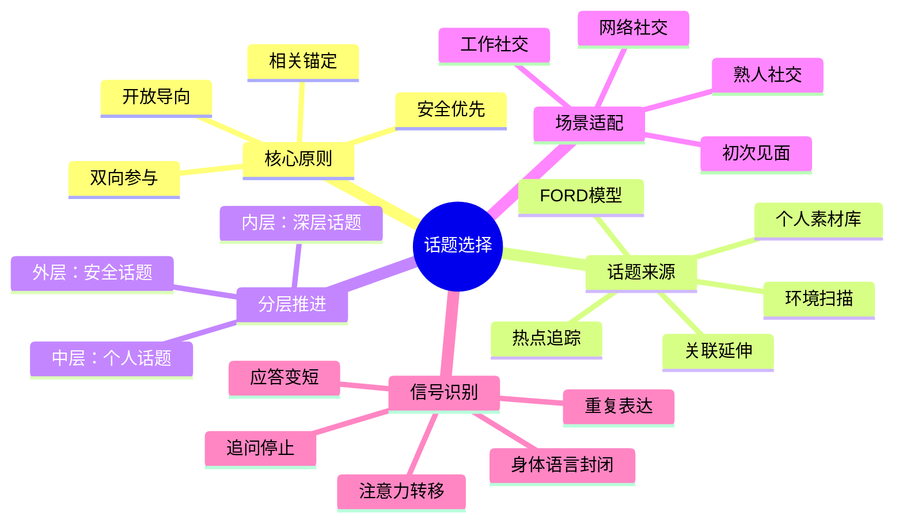

## 三、话题选择：说什么比怎么说更重要

很多社交指南把重心放在"怎么说"——语气、表情、肢体语言。这些当然重要，但它们属于执行层。在执行之前，有一个更根本的问题：**说什么**。选错了话题，再高超的表达技巧也救不回来；选对了话题，即使表达平平，对话也能自然推进。

哈佛商学院一项针对 300 场商务晚宴的追踪研究发现：对话双方的事后满意度，与"话题匹配度"的相关系数达到 0.67，远高于"表达流畅度"的 0.31。换句话说，你聊什么，比你聊得好不好重要一倍。

### 3.1 为什么话题选择是聊天的第一变量

#### 3.1.1 认知负荷理论的解释

人的工作记忆容量有限（Miller, 1956，7±2 个信息块）。当话题触及对方的知识盲区或兴趣荒漠时，对方需要额外的认知资源来跟上对话——这就是**认知负荷过载**。一旦过载，对方的反应模式会退化为敷衍点头、简短应答、眼神游移。

反过来，当话题落在对方的**知识甜蜜区**——既熟悉又有话想说——认知负荷最低，参与感最高，对话进入"自动驾驶"状态。

#### 3.1.2 社会交换理论的视角

社会交换理论（Homans, 1958）认为，人际互动本质上是一种资源交换。在聊天场景中，话题就是交换的"货币"。一个好的话题能同时提供两种价值：

| 价值类型 | 含义 | 示例 |
|---------|------|------|
| **信息价值** | 让对方获得新知、新视角 | 分享一个行业趋势、推荐一家新餐厅 |
| **情感价值** | 让对方感到愉悦、被理解、被认同 | 聊共同回忆、赞美对方的品味 |

话题选择的本质，是在恰当的时机，向对方提供恰当比例的信息价值和情感价值。

#### 3.1.3 前景理论与话题风险

行为经济学的前景理论（Kahneman & Tversky, 1979）指出：损失带来的心理冲击是等量收益的 2-2.5 倍。映射到聊天场景：

- 一个好话题带来的好感度：+1
- 一个踩雷话题带来的厌恶度：-2 到 -2.5

这意味着，**避雷**比**加分**更重要。话题选择的第一优先级不是找到完美话题，而是避开危险话题。

### 3.2 话题选择的四条铁律

#### 铁律一：安全优先——不确定时选中性话题

在不了解对方立场的情况下，选择政治中立、宗教无关、不涉及隐私的话题。这不是"圆滑"，而是**基本的社交礼仪**。

安全区话题的共同特征：
- 几乎所有人都有经验或看法（天气、美食、交通）
- 不涉及深层价值观判断（喜欢什么电影 vs 对某个社会议题的立场）
- 允许对方选择参与深度（可以简单回应，也可以深入讨论）

#### 铁律二：相关锚定——话题必须与当下情境相关

话题不是凭空产生的，它需要一个**锚点**——当前环境、共同经历、刚刚发生的事件。从锚点出发的话题过渡自然，强行切换话题则显得突兀。

❌ 生硬切换：
  A: "今天天气真不错。"
  B: "对了，你看过那部新电影吗？"

✅ 从锚点延伸：
  A: "今天天气真不错。"
  B: "是啊，这种天气特别适合户外。你平时周末会出去走走吗？"

从"天气"锚点自然延伸到"户外活动"，再延伸到"对方的生活方式"，每一步都有逻辑链条。

#### 铁律三：开放导向——选择能展开的话题

封闭式话题用一两个词就能回答完，对话瞬间死亡。开放式话题则能激发对方的思考和表达。

| 封闭式（死胡同） | 开放式（高速公路） |
|-----------------|-------------------|
| "你喜欢旅行吗？" → "喜欢" | "你去过最惊喜的地方是哪里？" → 长篇回忆 |
| "周末忙吗？" → "还行" | "周末一般怎么安排？" → 分享习惯 |
| "这个项目顺利吗？" → "还行" | "这个项目最有挑战的部分是什么？" → 讲述细节 |

判断标准：如果一个话题可以用"是/否"或"喜欢/不喜欢"一句话回答完，就需要改造——加上"为什么"、"怎么做到的"、"印象最深的是"等追问钩子。

#### 铁律四：双向参与——对方必须有话可说

话题选择不是单方面的输出，而是为双方搭建对话的舞台。一个好的话题必须满足：**对方有话说**。

快速检测法——在抛出话题前，问自己两个问题：
1. 对方在这个话题上有经验或知识吗？
2. 对方有表达的欲望吗？

如果两个答案都是"是"，这个话题大概率可行。如果第一个是"否"，你就是在给对方出考卷。如果第二个是"否"，你就是在自说自话。

### 3.3 万能话题清单与使用指南

以下是经过社交心理学研究和大量实践验证的高成功率话题类别。每个类别不仅列出"聊什么"，还给出"怎么聊"的具体方法。

#### 3.3.1 环境与场景话题

**为什么有效：** 环境是双方共享的、当下正在经历的，认知负担为零。不需要任何背景知识就能参与。

**使用时机：** 开场、冷场、不知道聊什么的时候。

**具体话术模板：**
- 观察 + 感受："这个场地的布置挺用心的，灯光特别有氛围。"
- 观察 + 好奇："这家店的装修风格很特别，你知道是什么主题吗？"
- 观察 + 对比："这次活动比上次人多了不少，你感觉呢？"

**进阶用法：** 从环境话题出发，向"对方的经历"方向延伸。
环境 → 对方的经历 → 对方的价值观

"这个咖啡馆的豆子品质不错"（环境）
  → "你平时也自己冲咖啡吗？"（经历）
    → "你觉得手冲和意式哪个更有意思？"（偏好/价值观）

#### 3.3.2 共同经历话题

**为什么有效：** 共同经历创造**共享现实**（shared reality），是建立亲密感的最快路径。心理学研究表明，回忆共同经历时，双方的大脑活动模式会出现同步（neural coupling），这种同步本身就是亲密感的生理基础。

**使用时机：** 有共同经历可用时（同事、同学、同一活动参与者）。

**具体话术模板：**
- 直接唤起："上次那个项目加班到凌晨三点，现在想想还挺疯狂的。"
- 感受分享："我发现每次开完那种长会，都得缓半天才能回神。你呢？"
- 变化追踪："自从换了新主管，感觉整个团队节奏都变了。你有这种感觉吗？"

**注意事项：** 共同经历话题的核心是**情感共鸣**，不是事实罗列。不要变成"事件回顾"，而要聚焦"感受分享"。

#### 3.3.3 兴趣与爱好话题

**为什么有效：** 兴趣爱好是人们自我认同的核心组成部分。当别人对你的兴趣表现出真诚的好奇时，你感到的是**被看见**——这是人类最深层的社交需求之一。

**使用时机：** 已经初步建立舒适感后。

**关键技巧——真诚好奇而非社交审查：**
❌ 社交审查（让人有压力）：
  "你平时有什么爱好？" → 像面试
  "你周末都干嘛？" → 像查户口

✅ 真诚好奇（让人有表达欲）：
  "我看你朋友圈经常发烘焙的东西，是最近开始学的吗？"
  "你上次提到在学吉他，现在弹得怎么样了？"

**深入对话的三步法：**
1. **发现**：通过观察（朋友圈、桌面摆设、穿着配饰）发现对方的兴趣线索
2. **好奇**：用具体问题表达兴趣，而非笼统提问
3. **连接**：找到自己与这个兴趣的连接点（"我虽然不懂，但一直觉得很有意思"）

#### 3.3.4 美食与旅行话题

**为什么有效：** 美食和旅行属于"低门槛高参与"话题——几乎所有人都有经验，而且话题本身带有愉悦的情绪色彩。神经科学研究显示，谈论美食和旅行时，大脑的奖赏回路会被激活（与实际享用美食时类似）。

**话术示例与进阶方向：**

| 入门级 | 进阶级 | 深度级 |
|-------|--------|--------|
| "最近发现一家好吃的店" | "你是那种会为了吃专门跑一趟的人吗？" | "你对食物的偏好有没有受家庭影响？" |
| "你去过云南吗？" | "旅行中你更喜欢探索还是躺平？" | "有没有哪次旅行改变了你看问题的方式？" |

**进阶用法：** 从美食/旅行延伸到对方的**决策风格、价值取向、生活态度**。比如，一个人旅行时喜欢做详细攻略还是随性而行，能反映出TA对"控制感"和"不确定性"的态度。

#### 3.3.5 热点与趋势话题

**为什么有效：** 热点话题自带"社交货币"属性——人们聊热点时，展示的是自己的信息获取能力、审美品味和社会敏感度。

**使用时机：** 双方有信息重叠时（同龄人、同行、同一社交圈）。

**安全操作规范：**
- ✅ 娱乐热点（新上映的电影、热播剧、综艺）——风险最低
- ✅ 科技趋势（AI、新能源、新App）——有话题性，争议小
- ⚠️ 社会新闻——需要判断对方立场，谨慎表达
- ❌ 政治议题、宗教话题——除非确认对方立场一致，否则不碰
- ❌ 灾难/悲剧事件——除非对方主动提及，否则不要拿来当谈资

**使用模板：**
"最近那个 [热点事件] 你有关注吗？"（试探性开场）
  → 如果对方感兴趣：顺着聊
  → 如果对方没关注："就是 [一句话概括]，我觉得挺有意思的。"
  → 如果对方明显不感兴趣：立刻切换话题

#### 3.3.6 工作与职业话题

**为什么有效：** 工作占据了成年人清醒时间的 40%-60%，是个人身份认同的重要来源。

**风险提示：** 工作话题是把双刃剑。聊得好能建立职业认同和信任感，聊不好会变成"工作汇报"或"抱怨大会"。

**安全话题范围：**
- ✅ 行业趋势和新动态（宏观视角，不涉及具体公司八卦）
- ✅ 职业成长和学习（"最近在学什么新东西？"）
- ✅ 工作中的趣事和观察（轻松、不涉及机密）
- ⚠️ 薪资收入（除非关系非常亲密，否则不问）
- ⚠️ 对同事/领导的评价（容易卷入是非）
- ❌ 工作中的具体困难和压力（除非对方主动倾诉）

### 3.4 话题分层模型：洋葱结构

好的对话不是在同一个深度水平上平铺，而是由浅入深地**逐层深入**。我把这个过程称为"洋葱模型"：


**外层（安全层）：** 天气、环境、公共热点。功能是破冰和建立基本舒适感。适用于初次见面、公开场合、不确定对方态度时。

**中层（个人层）：** 兴趣爱好、生活经历、个人观点。功能是建立个人连接和相互了解。适用于已经有初步信任基础的关系。

**内层（深层）：** 价值观、情感经历、人生困惑。功能是建立深层亲密感和信任。适用于已经建立了较强信任基础的关系。

**核心原则：逐层推进，不越级。** 从外层直接跳到内层会让对方感到冒犯和不适。但也不能一直停留在外层——如果聊了很久还是只谈天气，关系就无法推进。

**推进信号：** 当对方主动分享个人信息、提出追问、延长对话时，说明可以从中层向内层试探。

### 3.5 话题生成的五种方法

很多人觉得"没话题可聊"，其实不是缺少话题，而是缺少**发现话题的视角**。以下是五种实用的话题生成方法：

#### 方法一：环境扫描法

用五感扫描当前环境，每个感官至少发现一个可聊的点。

视觉：这个空间的装修、窗外的景色、对方的配饰
听觉：背景音乐、环境声音、对方的口音
嗅觉：咖啡的香气、食物的味道
触觉：温度、座椅的舒适度
味觉：正在吃/喝的东西

**实操练习：** 下次在任何场合，给自己 30 秒，用五感各找出一个可聊的话题。你会发现，话题无处不在。

#### 方法二：FORD 模型

FORD 是一个经典的话题框架，覆盖了日常社交中最安全、最有效的四个话题领域：

| 字母 | 领域 | 示例问题 |
|------|------|---------|
| **F** - Family | 家庭 | "你家在这边吗？" "家里有兄弟姐妹吗？" |
| **O** - Occupation | 职业 | "你是做什么工作的？" "最近工作忙吗？" |
| **R** - Recreation | 娱乐 | "周末一般怎么过？" "最近有看什么好剧吗？" |
| **D** - Dreams | 梦想 | "有没有什么想做但还没做的事？" "如果有一年假期你会怎么安排？" |

FORD 模型的优势在于它的渐进性——从 F 到 D，话题逐渐深入，与洋葱模型自然吻合。

#### 方法三：关联延伸法

从对方说的任何一句话中，提取关键词，向外延伸。

对方："昨天加班到十点才走。"
关键词提取：昨天 / 加班 / 十点 / 走

延伸方向：
- "最近项目很忙吗？"（加班 → 工作状态）
- "加班完一般怎么犒劳自己？"（加班 → 生活方式）
- "十点下班地铁还方便吗？"（十点 → 通勤 → 生活细节）
- "你们公司加班多吗？"（加班 → 公司文化 → 职业选择）

这个方法的核心是：**对方说的每一句话都是话题的种子**，关键在于你能否看到这些种子。

#### 方法四：热点追踪法

养成每天浏览社交热点的习惯，但不是为了"炫耀博学"，而是为了**储备谈资**。

**实操建议：**
- 每天花 10 分钟浏览微博热搜、知乎热榜、抖音热榜
- 重点关注：娱乐、科技、生活方式类内容（争议性最低）
- 记住 3-5 个话题的"一句话摘要"即可，不需要深入了解
- 目标：当别人提到某个热点时，你能接上话，而不是一脸茫然

#### 方法五：个人经历素材库

每个人的生活都是一座话题富矿，只是大多数人没有系统地整理过。

**建立素材库的方法：**
1. **记录有趣的小事**：今天遇到的趣事、看到的有趣现象、听到的有意思的观点
2. **分类整理**：按 FORD 模型分类存储
3. **定期回顾**：在社交前快速翻阅，找到可能适用的话题
4. **练习讲述**：同一个故事，用 30 秒、1 分钟、3 分钟三个版本讲出来

### 3.6 话题切换的信号识别与技巧

即使选对话题，也不可能永远聊下去。话题有自然的生命周期：**启动 → 发展 → 高潮 → 衰退**。识别衰退信号并及时切换，是聊天高手的必备技能。

#### 3.6.1 话题衰退的五个信号

| 信号 | 具体表现 | 应对策略 |
|------|---------|---------|
| 应答变短 | 从长句变成"嗯""是啊""还好" | 准备切换 |
| 追问停止 | 对方不再主动提出新问题 | 尝试深入一层，不行就换 |
| 注意力转移 | 眼神游移、看手机、环顾四周 | 立刻切换 |
| 重复表达 | 同一个观点说了两遍以上 | 话题已耗尽，必须切换 |
| 身体语言封闭 | 手臂交叉、身体后倾、转向别处 | 对方可能对当前话题不适，切换 |

#### 3.6.2 三种切换方式

**自然过渡法（推荐）：** 从当前话题中找到一个关键词，自然延伸到新话题。
"说到旅行，我最近发现一个特别好用的 App……"
"对了，你刚才提到加班，最近有没有什么减压的好方法？"

**场景锚定法：** 从当前环境中找到新话题。
"诶，那边那个是什么？看着挺有意思的。"
"这背景音乐挺不错的，你知道是什么歌吗？"

**直接切换法：** 当前话题明显不适合继续时，直接但礼貌地切换。
"这个话题说来话长了。对了，你最近怎么样？"
"不说这些了。我最近发现了一家特别好吃的店……"

### 3.7 不同场景的话题策略

#### 3.7.1 初次见面

**目标：** 建立基本舒适感，留下友善印象。
**策略：** 外层话题为主，配合环境扫描法。
**话术示例：**
"你好！你也是第一次来这个活动吗？"（环境 + 共同经历）
"你是怎么知道这个活动的？"（对方的经历 → 了解背景）
"你平时也经常参加这类活动吗？"（兴趣探索）
**禁忌：** 不问收入、年龄、婚恋状况等私人问题。

#### 3.7.2 熟人社交

**目标：** 深化了解，维护关系。
**策略：** 中层话题为主，使用关联延伸法。
**话术示例：**
"上次你说在学潜水，学得怎么样了？"（跟进上次对话）
"最近朋友圈看你去了 [地名]，好玩吗？"（基于观察的好奇）
"我发现了一家特别适合聚餐的店，下次叫上大家一起去？"（创造下次见面的理由）

#### 3.7.3 工作社交

**目标：** 建立职业信任，寻找合作机会。
**策略：** 工作话题为骨架，穿插个人话题为血肉。
**话术示例：**
"你们最近在做的 [项目/产品] 我有关注，进展怎么样？"（表达关注）
"你觉得这个行业接下来会怎么发展？"（宏观讨论，不涉及具体利益）
"你平时工作之余怎么放松？"（从工作过渡到个人）

#### 3.7.4 网络社交（微信/QQ）

**目标：** 保持联系，创造见面机会。
**策略：** 内容驱动，分享有趣内容作为话题起点。

| 场景 | 话题策略 | 示例 |
|------|---------|------|
| 朋友圈互动 | 简短赞美 + 提问 | "这个地方好漂亮！是哪里？" |
| 一对一聊天 | 分享内容 + 表达看法 | "刚看到这篇文章，想到你之前说的……" |
| 群聊 | 发起投票/讨论 | "大家觉得 [轻松话题] 怎么样？" |
| 久未联系 | 回忆 + 关心 | "突然想起上次咱们聊的 [话题]，最近怎么样了？" |

### 3.8 话题选择的七大误区

#### 误区一："只要我够幽默，什么话题都能聊"

**真相：** 幽默是调味品，不是主菜。再好的调味品也救不了变质的食材。在一个不适合的话题上强行幽默，只会让场面更尴尬。

#### 误区二："聊深一点才能建立真正的关系"

**真相：** 深度话题需要信任基础。在信任不足时强行深入，会让对方感到被冒犯或有压力。关系的深化是一个渐进过程，不能跳级。

#### 误区三："我必须找到一个完美话题才能开口"

**真相：** 不存在完美话题。话题只是对话的起点，真正的价值在于双方的互动和延伸。一个普通的话题 + 好的互动，远胜于一个"完美"话题 + 尬聊。

#### 误区四："对方不说话说明话题不好"

**真相：** 对方沉默的原因可能是：(1) 性格内向需要时间思考；(2) 对话题不感兴趣；(3) 当前情绪状态不佳。不要急于换话题，先给 3-5 秒的思考时间，然后用追问引导。

#### 误区五："热门话题一定好用"

**真相：** 热门话题的前提是**双方都关注**。如果你聊的热点对方完全不知道，反而会造成信息不对称的尴尬。先试探对方是否了解，再决定是否展开。

#### 误区六："工作场合只能聊工作"

**真相：** 纯工作对话缺乏温度，难以建立真正的信任关系。在工作场合适当穿插个人话题（兴趣、生活、轻松经历），反而能提升合作效率。

#### 误区七："我性格内向，不擅长找话题"

**真相：** 话题选择是一项**可以习得的技能**，与性格无关。内向者的优势在于——更善于倾听和观察，更容易发现对方的兴趣点。用好环境扫描法和关联延伸法，内向者也能成为话题高手。

### 3.9 话题选择的进阶心法

#### 3.9.1 从"选话题"到"造话题"

初级选手选择话题，高级选手**创造话题**。创造话题的本质是：在对话中制造"未完成感"和"好奇心"。

**技巧一：悬念式分享**
"我最近遇到一件特别有意思的事……算了，说来话长。"
对方大概率会追问："什么事？说来听听。"

**技巧二：反常识观点**
"我发现一个反直觉的现象：越是忙的人，越有时间运动。"
这会激发对方的好奇心和讨论欲。

**技巧三：选择性透露**
"我最近在学一个新技能，等学成了给你展示。"
不说具体是什么，引发好奇心，也为下次对话埋下伏笔。

#### 3.9.2 话题雷达图——评估话题质量

在选择话题时，可以用以下五个维度快速评估：

```mermaid
radar
    title 话题质量评估雷达图
    axis 安全性, 相关性, 开放性, 趣味性, 双向性
    "好话题" : [9, 8, 9, 7, 8]
    "一般话题" : [8, 5, 4, 6, 3]
    "差话题" : [3, 2, 2, 4, 1]
```

一个好话题不需要每个维度都满分，但**安全性和双向性**不能低于 6 分。

#### 3.9.3 建立你的"话题直觉"

经过足够的练习后，话题选择会从"刻意思考"变成"直觉反应"。这个过程需要：

1. **大量练习**：每次社交后复盘——哪些话题效果好，哪些冷场了
2. **模式识别**：总结自己和不同人群聊得好的共同话题类型
3. **快速试错**：抛出话题后观察反应，3 秒内判断是继续还是切换
4. **素材积累**：建立个人经历素材库，随时调用

最终目标：**看到一个人，脑子里自动浮现 3 个以上可聊的话题**。这不是天赋，是训练的结果。

### 3.10 本节小结



话题选择的本质不是"找到正确答案"，而是"为双方搭建对话的舞台"。记住以下优先级：

1. **先避雷，再加分**——安全话题 > 有趣话题
2. **先相关，再深入**——从当下情境出发，逐层推进
3. **先对方，再自己**——对方有话说 > 自己想说
4. **先练习，再直觉**——刻意练习积累到足够量后，自然形成直觉

选对话题，聊天就成功了一半。剩下的一半，才是怎么说。
