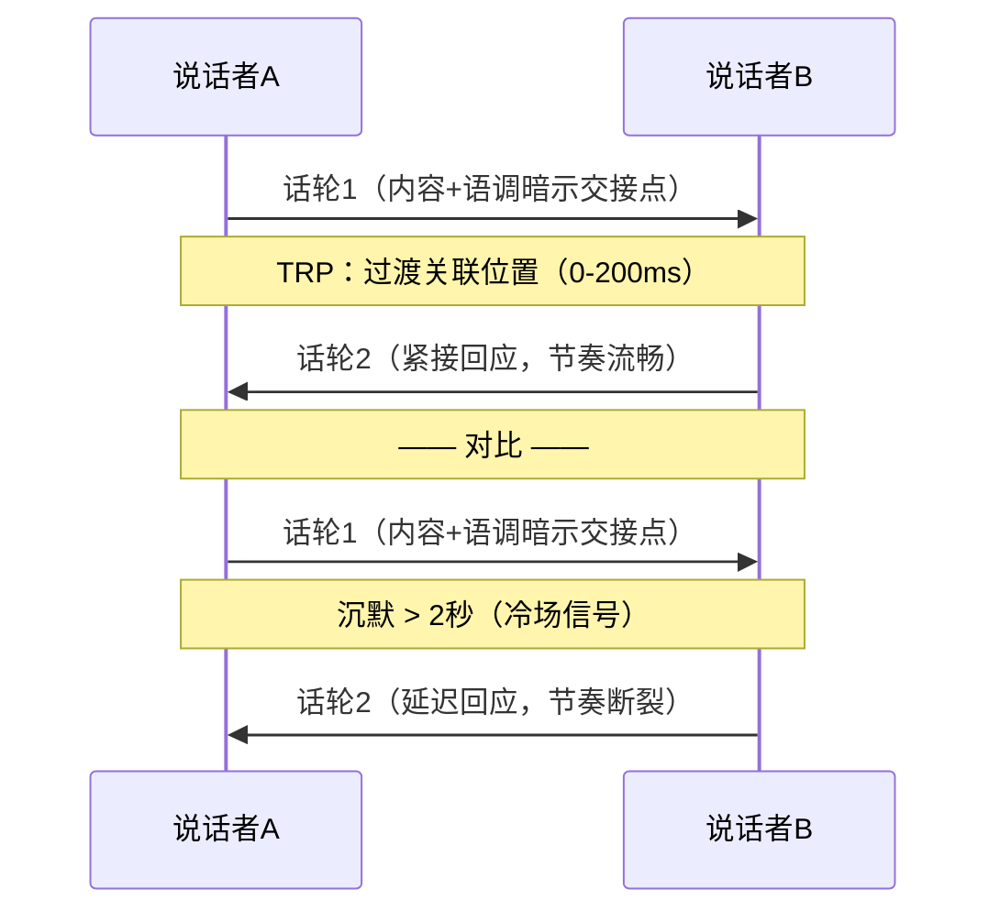
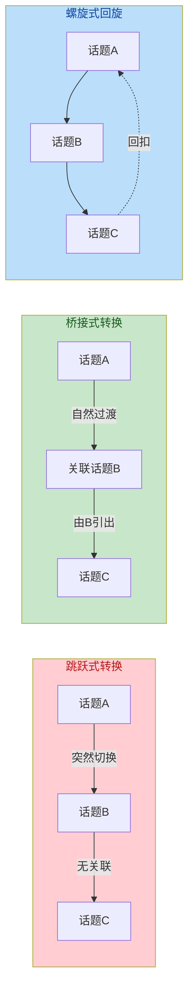
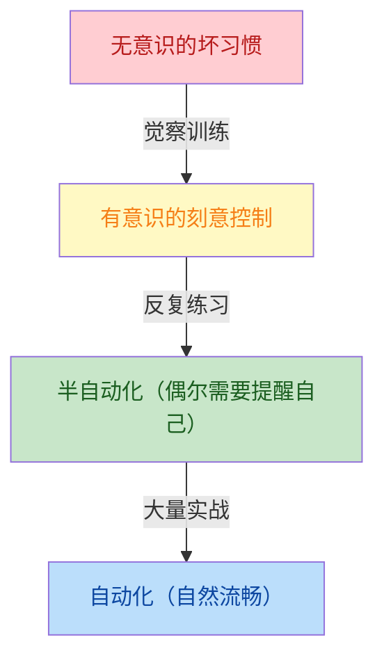
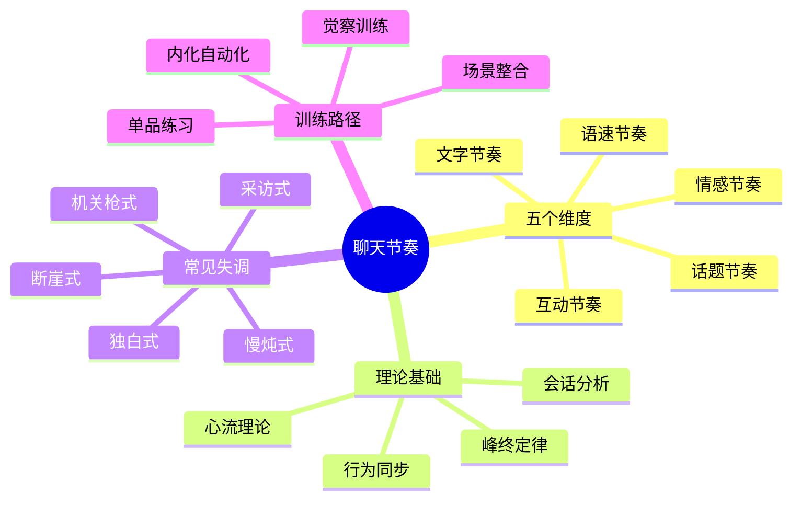

## 四、聊天节奏：掌握对话的韵律

> "音乐之所以动人，不在于音符本身，而在于音符之间的沉默。" ——Claude Debussy

### 4.1 为什么节奏是聊天的隐藏操作系统

大多数人学习聊天技巧时，注意力集中在"说什么"和"怎么说"上——选什么话题、用什么语气、做什么表情。这些当然重要，但它们都是**内容层**的变量。在内容层之下，还有一个几乎不被察觉却深刻影响对话体验的**结构层**变量——**节奏**。

节奏是什么？用一句话概括：**节奏是你在时间维度上组织对话的方式**——你多快回应、多长时间换话题、说话是连珠炮还是慢条斯理、沉默时是冷场还是留白。如果说话题选择决定了对话的"质量"，那么节奏控制决定了对话的"体验"。

#### 4.1.1 节奏感的心理学基础

认知心理学家Daniel Kahneman在《思考，快与慢》中提出了"体验自我"与"记忆自我"的区分。体验自我关注当下的感受强度，记忆自我关注叙事结构——高峰、低谷、结尾。这一发现直接解释了为什么节奏对聊天如此重要：

| 心理机制 | 与节奏的关系 | 实际影响 |
|---------|------------|---------|
| **峰终定律** | 记忆自我根据高峰时刻和结尾时刻评价整段体验 | 对话的高光时刻和收尾节奏决定了对方事后对这次聊天的整体印象 |
| **心流理论**（Csikszentmihalyi, 1990） | 当挑战与能力匹配时，人进入沉浸状态 | 对话节奏与对方的认知处理速度匹配时，双方进入"聊天心流" |
| **习惯化** | 持续不变的刺激会降低感受强度 | 始终同一节奏的对话会让对方感到麻木 |
| **新奇效应** | 变化打破预期时，注意力被重新激活 | 节奏的突然变化能重新捕获对方的注意力 |

换言之，好的聊天节奏不只是"听起来舒服"，而是在神经层面影响对方的注意力分配、情绪唤起和记忆编码。

#### 4.1.2 会话分析：对话的交替机制

社会语言学中的**会话分析**（Conversation Analysis, CA）为聊天节奏提供了微观层面的理论框架。Sacks、Schegloff和Jefferson（1974）在其经典研究中发现了"话轮转换"（turn-taking）的基本规则：

1. **过渡关联位置**（Transition Relevance Place, TRP）：一句话的自然结束点，是说话权可以合法切换的位置
2. **最短停顿原则**：在TRP处，下一个说话者应在最短时间内开始（通常0-200毫秒）
3. **说话者选择**：当前说话者可以通过语法结构、语调变化来指定下一个说话者
4. **自我选择**：如果没有被指定，任何参与者都可以在TRP处"抢占"话轮

这些规则的违反就会产生节奏上的不和谐——过长的沉默（冷场）、抢话（不让对方说完）、追问（跳过对方的TRP）。理解这些微观机制，是掌握聊天节奏的第一步。

### 4.2 聊天节奏的五个核心维度

聊天节奏不是单一变量，而是由五个相互关联的维度构成的复合系统。理解每个维度的机制和调控方法，是节奏控制的基础。

#### 4.2.1 语速节奏：说话快慢的艺术

语速是最容易被感知的节奏维度。中文普通话的平均语速约为每分钟200-250字，但聊天中的语速远不是恒定的——**语速的变化本身就是信息**。

心理学研究（Apple, Streeter & Krauss, 1979）发现，说话者的语速会影响听者的多项判断：

| 语速特征 | 听者感知 | 适用场景 |
|---------|---------|---------|
| **偏快**（>280字/分钟） | 活力、热情、紧迫感、控制欲 | 讲有趣的故事、渲染气氛、表达兴奋 |
| **中等**（200-250字/分钟） | 自然、舒适、专业 | 日常对话、信息分享 |
| **偏慢**（<180字/分钟） | 严肃、重要、真诚、低落 | 表达重要观点、传递坏消息、表达情感 |
| **突然变化** | 注意力聚焦、情感冲击 | 强调关键信息、制造戏剧效果 |

**实操原则：语速弹性**

好的聊天者不是保持"完美语速"，而是拥有**语速弹性**——根据内容和情境灵活调整。具体方法：

- **快慢交替法**：在讲述铺垫内容时保持正常偏快语速，到达关键信息点时突然放慢，形成"减速带"效果。例如："我昨天去了一家新开的店（正常速度），他们有一道菜——（放慢，停顿）——叫分子料理版的红烧肉（慢速，强调）"
- **加速推进法**：当你感觉到对方开始走神时，适度加快语速可以重新激活对方的注意力，因为快速的信息流迫使大脑进入更主动的处理模式
- **减速共情法**：当对方分享情绪化的内容时，主动放慢语速可以传递"我在认真对待你说的话"的信号

#### 4.2.2 话题节奏：切换频率的掌控

话题节奏指的是对话在不同话题之间转换的频率和方式。这是聊天节奏中最宏观的维度，直接影响对话的"丰富度"和"深度感"。

**话题持续时间的"黄金区间"**

对话分析研究和社交实践表明：

| 持续时间 | 效果 | 适用对象 |
|---------|------|---------|
| < 2分钟 | 浅尝辄止，对方感觉你心不在焉 | 几乎不适用，除非是简短寒暄 |
| **3-8分钟** | 充分展开但不拖沓，多数场景的最佳区间 | 大多数日常聊天 |
| 8-15分钟 | 深度探讨，适合对方感兴趣的话题 | 有共同兴趣的深入交流 |
| > 15分钟 | 容易疲倦，除非话题极具吸引力或双方高度投入 | 知己深谈、专业讨论 |

**话题转换的三种模式**

| 转换模式 | 特征 | 效果 | 适用场景 |
|---------|------|------|---------|
| **跳跃式** | 无过渡直接换话题 | 显得散乱，对方困惑 | 避免使用 |
| **桥接式** | 从当前话题中提取关联元素，自然引出新话题 | 流畅、有逻辑 | 日常聊天的最佳模式 |
| **螺旋式** | 围绕核心话题展开多个子话题，最后回扣主题 | 深度、有层次 | 深度交流、说服场景 |

**桥接式转换的实操技巧**——"接住最后一句话"

最自然的话题转换方式，是从对方刚刚说的内容中提取关键词，关联到新话题：

> 对方："最近加班太多了，周末只想躺着。"
> 
> 关联路径分析：
> - "加班" → 工作压力 → 职场话题
> - "周末" → 休闲活动 → 生活方式话题  
> - "躺着" → 休息方式 → 养生/健身话题
> 
> 选择1（接"周末"）："周末躺平也是一种治愈。我最近发现了一个特别适合周末去的地方……"
> 选择2（接"加班"）："你们公司最近是在赶什么项目吗？我们部门也是……"
> 选择3（接"躺着"）："哈哈，同感。你平时除了躺着还会做什么放松？"

#### 4.2.3 情感节奏：对话的情绪曲线

一段好的对话不是情感上的"一条直线"，而是有起伏的"波浪线"。情感节奏控制着对话的情绪强度和类型的变化。

**情感节奏的基本原则：张弛有度**

会话分析研究和叙事心理学共同揭示了一个规律——**最有感染力的对话遵循"波浪式"情感模式**：

情感强度
  ↑
  │    ╱╲          ╱╲（高光时刻）
  │   ╱  ╲    ╱╲  ╱  ╲
  │  ╱    ╲  ╱  ╲╱    ╲
  │ ╱      ╲╱           ╲
  │╱  轻松期   探索期      ╲ 收尾
  └──────────────────────────→ 时间

具体操作：

| 情感阶段 | 目的 | 实操方法 |
|---------|------|---------|
| **升温期** | 从安全区开始，建立舒适感 | 轻松话题、共同经历、观察评论 |
| **升温拐点** | 切换到更有深度或更有趣的内容 | 提出有趣的问题、分享意外信息 |
| **高光时刻** | 情感强度的峰值，对话的"记忆锚点" | 笑点爆发、真诚共鸣、意外发现 |
| **缓冲落点** | 高光后给对方消化空间 | 轻松评论、稍作停顿、转换视角 |
| **二次升温** | 再次推动情感上升 | 深入展开、换角度讨论 |
| **收尾落点** | 在适当高度结束，而非拖到低谷 | 在愉快或自然断点处结束 |

**错误示范 vs 正确示范：**

❌ 错误（平淡直线）：
开始 → 中等温度聊 → 中等温度聊 → 中等温度聊 → 结束
（全程不温不火，事后没有记忆锚点）

❌ 错误（开头过热）：
开始 → 瞬间热情高涨 → 逐渐降温 → 越来越冷 → 勉强结束
（虎头蛇尾，对方觉得你"太用力"）

✅ 正确（波浪推进）：
开始 → 轻松热身 → 有趣话题升温 → 高光时刻 → 稍微缓冲 → 再次升温 → 愉快收尾
（张弛有度，每个阶段都有节奏感）

#### 4.2.4 互动节奏：说与听的平衡术

互动节奏是聊天节奏中最具"双向性"的维度。它关注的不是你个人的表达方式，而是**你与对方之间的信息流动模式**。

**话轮比例的健康区间**

语言学研究和社交实践表明，健康的对话中，双方的话轮时间比应大致在**40:60到60:40**之间。

| 话轮比例 | 状态 | 信号 |
|---------|------|------|
| > 70:30（你占70%） | 你在主导甚至独白 | 对方回应越来越短、开始看手机、眼神游移 |
| **40:60到60:40** | 双方参与均衡 | 对方主动延伸话题、追问细节、分享个人经历 |
| < 30:70（你占30%） | 你在被动听 | 你可能需要主动抛出更多话题或表达观点 |

注意：这个比例不是要你精确计时，而是要你保持觉察。如果你发现自己连续说了3分钟对方没有插话的机会，就需要主动"交出话轮"。

**话轮交接的三种信号**

当你想把话轮交给对方时，可以使用以下信号：

1. **直接提问**："你觉得呢？""你遇到过这种情况吗？"
2. **语调下降**：句子末尾语调自然下降，暗示这段话告一段落
3. **停顿+眼神**：说完后停顿1-2秒，同时看向对方，表示"该你了"

**节奏同步现象**

社会心理学中有一个重要发现叫**行为同步**（behavioral synchrony）——当两个人对话节奏匹配时，双方的好感度和信任度都会提升。具体表现为：

- 语速趋向一致（对方快你也快一点，对方慢你也慢一点）
- 停顿时长趋向一致
- 笑声频率趋向一致
- 身体姿态趋向镜像

这不是"模仿"，而是**自然的社交同步**。当你有意识地调整自己的节奏去匹配对方的节奏时，对方会在潜意识中感到"和这个人聊天很舒服"——因为你们的神经节律在趋于同步。

#### 4.2.5 文字节奏：数字时代的专属维度

在面对面聊天中，节奏主要通过语音实现。但在数字时代，大量日常聊天发生在文字场景中——微信、短信、社交媒体私信。文字聊天有其独特的节奏特征和控制方法。

**文字节奏的三大要素**

| 要素 | 含义 | 影响 |
|------|------|------|
| **回复间隔** | 收到消息后多久回复 | 传递优先级、兴趣度、情绪状态 |
| **消息长度** | 每条消息的字数/行数 | 传递投入程度、对话深度 |
| **消息密度** | 单次发送的条数 | 传递情绪强度、兴奋程度 |

**回复间隔的潜规则**

文字聊天中，回复间隔是最容易被过度解读的节奏信号。以下是社交实践中的"潜规则"：

| 回复间隔 | 对方可能的解读 | 适用场景 |
|---------|-------------|---------|
| < 10秒 | "他一直在等我消息" / "他很重视这次对话" | 双方都在积极聊天时 |
| **1-3分钟** | 自然舒适，不急不缓 | 日常聊天的默认节奏 |
| 5-15分钟 | "他在忙，但还是回了" | 工作时间的正常回应 |
| 30分钟-2小时 | "可能真的在忙" / "他不太想聊" | 需要配合回复内容判断 |
| > 4小时不回 | "他不想理我"（除非有合理解释） | 避免对重要的人这样做 |

**重要原则：回复间隔应该与对话的"热力"匹配。** 如果对方秒回你，你却隔半小时才回——不管你的理由多么合理——节奏上的不对等都会让对方感到失落。反之亦然。

**消息长度的节奏变化**

好的文字聊天者会有意识地调整消息长度来制造节奏感：

❌ 死板节奏（每条都一样长）：
"今天天气不错"
"你中午吃了什么"
"周末有什么计划"

✅ 有节奏感的聊天：
"今天天气不错，适合出去走走"
"嗯"
"中午吃了一家新开的湘菜馆，辣得我怀疑人生，但又停不下来😂"
"哈哈 哪家"
"就在公司旁边那条街，你下次可以试试，那个剁椒鱼头真的绝了，鱼肉嫩得像豆腐一样，配上他们自制的辣椒酱，我一个人吃了两碗饭"

**消息密度与情绪表达**

在文字聊天中，连发多条短消息可以模拟说话时的语气和节奏：

连发3条短消息（模拟兴奋/激动）：
"你知道吗！！"
"我刚收到offer了"
"就是那个dream company"

vs

一条长消息（模拟平静/正式）：
"想跟你说一下，我刚收到了之前面试那家公司的offer，薪资和岗位都挺满意的。"

这不是说哪种更好——而是说，消息密度是一种可以有意识使用的节奏工具。

### 4.3 节奏失调：常见问题诊断与修复

聊天节奏出了问题，双方可能都不会明确说出来——只会感到"和这个人聊天不太舒服"。以下是五种常见的节奏失调及其诊断和修复方法。

#### 4.3.1 机关枪式——语速过快、信息过密

**症状表现**：
- 说话连珠炮，不给对方反应时间
- 一个话题还没展开就跳到下一个
- 文字聊天中连发10条以上消息
- 对方的回应越来越短（"嗯""哦""是吧"）

**心理根源**：通常是焦虑驱动——害怕沉默、害怕冷场、害怕对方失去兴趣。试图用"量"来弥补"质"的不足。

**修复方法**：
1. **三秒法则**：每次说完一个完整的观点后，刻意停顿3秒。这3秒是给对方的"入场通道"
2. **一段一问**：每段话（不管是口头还是文字）至少包含一个问题，把话轮交给对方
3. **文字消息限制**：每次最多发3条消息，如果内容很多就合并成一条

#### 4.3.2 慢炖式——节奏过慢、缺乏起伏

**症状表现**：
- 每个话题都用同样缓慢的速度展开
- 缺乏情绪起伏，全程"温吞水"
- 对方开始走神、看手机、频繁切换话题
- 对话在结束时双方都松了一口气

**心理根源**：可能是表达习惯问题，也可能是过度谨慎——害怕说错话、害怕出格，所以用最"安全"的节奏聊天。

**修复方法**：
1. **强调法**：在关键信息点刻意放慢（而不是全程慢），制造"减速带"
2. **加速铺垫**：在铺垫和过渡部分适度加快，把更多时间留给有料的内容
3. **情绪标签**：有意识地在对话中加入情绪表达——惊叹、好奇、困惑、开心——打破平淡

#### 4.3.3 独白式——话太多、互动太少

**症状表现**：
- 对方很少有机会插话
- 对方的回应经常被打断或被续接
- 你自己说了5分钟，对方只说了"嗯"和"对"
- 对话结束后对方记不清自己说了什么

**心理根源**：可能是话题驱动——找到了一个自己特别感兴趣的话题就停不下来。也可能是缺乏"话轮敏感度"——读不懂对方想说话的信号。

**修复方法**：
1. **定时自检**：说了一段话后，主动问对方一个问题
2. **信号扫描**：注意对方的非语言信号——嘴巴微张、身体前倾、发出"呃"的声音——这些都是"我想说话"的信号
3. **内容分段**：把想说的话分成几段，每段之间给对方反应的机会

#### 4.3.4 采访式——问题太多、分享太少

**症状表现**：
- 对话中大部分是"你……？""你觉得……？""你平时……？"
- 自己很少分享个人经历和观点
- 对方感到在被"审问"而非在聊天
- 对方回答越来越敷衍

**心理根源**：可能是"社交安全策略"——通过提问来避免暴露自己。也可能误以为"多问问题=好的倾听者"。

**修复方法**：
1. **2:1法则**：每问2个问题，至少分享1段自己的相关内容
2. **回应优先**：先对对方说的内容做出回应（评价、共鸣、联想），再抛出新问题
3. **嵌入式分享**：在提问中嵌入自己的信息，如"我最近也在看科幻小说，你有没有特别推荐的？"而不是单纯问"你平时看什么书？"

#### 4.3.5 断崖式——高潮后无过渡直接结束

**症状表现**：
- 聊到high点后突然"那就这样吧"
- 文字聊天中在最热烈的时刻突然不回了
- 对话的结尾生硬、突兀
- 事后回想总觉得"最后怪怪的"

**心理根源**：可能是时间管理不当（突然有事），也可能是缺乏"收尾意识"——不知道在什么时机、用什么方式结束对话。

**修复方法**：
1. **渐弱收尾**：在结束前1-2分钟，逐步降低话题热度和情感强度
2. **预告法**：提前暗示即将结束——"再聊最后一个问题"、"我一会儿要出门，但是……"
3. **高点收尾**：在对话的自然高潮或愉快节点处结束——"哈哈太有意思了，我先去忙了，下次继续！"

### 4.4 培养节奏感的系统方法

节奏感不是天赋，而是可以通过系统训练获得的技能。以下是四个层次的训练方法，从新手到高手逐步进阶。

#### 4.4.1 第一层：觉察训练——从无意识到有意识

大多数人聊天时对节奏毫无觉察，就像听音乐时感受不到节拍。第一步是建立"节奏意识"。

**练习一：观察者模式**

选择一个公共场合（咖啡馆、地铁、公园），花10分钟观察两组正在聊天的人，不听内容，只注意节奏特征：
- 他们的语速如何？快慢是否变化？
- 谁说的更多？比例大概是多少？
- 有没有停顿？停顿时双方的反应是什么？
- 什么时候笑？笑之前发生了什么节奏变化？

**练习二：录音复盘**

在征得对方同意的前提下，录下自己的一段日常对话（3-5分钟），然后回放分析：
- 自己的语速是否合适？
- 有没有过多的停顿或过少的停顿？
- 说与听的比例是否均衡？
- 话题转换是否自然？

**练习三：文字聊天记录审视**

翻看自己最近的微信聊天记录，重点关注：
- 回复间隔的分布模式
- 消息长度是否一成不变
- 对话结束时的状态（是自然收尾还是不了了之）

#### 4.4.2 第二层：单品练习——逐一攻克每个维度

建立了节奏觉察之后，针对每个维度进行专项练习。

| 练习维度 | 练习内容 | 练习场景 | 预期效果 |
|---------|---------|---------|---------|
| **语速控制** | 每天用3种不同语速说同一段话 | 独自练习或与亲密朋友 | 建立语速选择的能力 |
| **话题转换** | 和朋友聊天时，刻意练习"桥接式"话题转换 | 日常社交 | 让话题转换从突兀变为自然 |
| **情感曲线** | 在一次聊天中，有意识地设计一次"升温-高峰-缓冲" | 有意识的社交场合 | 对话变得有层次感 |
| **互动比例** | 用计时器提醒自己：说了2分钟后必须提问 | 日常对话 | 克服独白倾向 |
| **文字节奏** | 在微信聊天中有意识地变化消息长度和间隔 | 线上社交 | 文字聊天更生动 |

#### 4.4.3 第三层：场景整合——在真实场景中综合运用

单品练习之后，需要在真实场景中整合运用。

**整合练习一：电梯挑战（30秒版）**

目标：在电梯的30秒内完成一次有节奏感的简短对话。
- 前5秒：轻松开场（"今天这天气……"）
- 中间15秒：一个有趣的回应+一个短问题
- 最后10秒：愉快收尾（"到了，回头聊！"）

**整合练习二：咖啡聊天（10分钟版）**

目标：和同事或朋友进行10分钟的咖啡时间聊天，全程有意识地控制节奏。
- 0-2分钟：热身期，轻松话题，建立舒适感
- 2-5分钟：升温期，找到一个双方都感兴趣的话题
- 5-8分钟：高光期，深入展开，制造情感高峰
- 8-10分钟：收尾期，渐弱并愉快结束

**整合练习三：微信深度聊天（20分钟版）**

目标：通过微信进行20分钟的有节奏的文字聊天。
- 回复间隔：跟随对方节奏，不刻意快也不刻意慢
- 消息长度：有变化，短句和长句交替
- 话题管理：通过桥接式转换覆盖2-3个话题
- 情感曲线：至少有一个"笑点"或"共鸣点"

#### 4.4.4 第四层：内化阶段——从刻意到自然

当节奏控制从"需要刻意注意"变成"下意识反应"时，你就完成了从新手到高手的跃迁。

**内化的标志**：
- 不需要刻意数秒就知道什么时候该停顿
- 自然地根据对方的节奏调整自己的节奏
- 话题转换不知不觉就完成了，双方都觉得很流畅
- 能"感觉到"对话的热度变化，并据此调整策略

**从刻意到自然的路径**：

这个过程通常需要**4-8周的持续练习**。每天至少一次有意识的节奏控制练习，一个月后你就会明显感到自己的聊天节奏感在提升。

### 4.5 不同场景的节奏策略

聊天节奏不是一成不变的——不同场景需要不同的节奏策略。以下是六种常见场景的节奏要点。

#### 4.5.1 初次见面

| 维度 | 策略 | 原因 |
|------|------|------|
| 语速 | 中等偏慢 | 给对方安全感，避免显得过于热情或强势 |
| 话题节奏 | 慢换（3-5分钟/话题） | 需要时间建立信任，频繁换话题显得不安定 |
| 情感节奏 | 平稳升温 | 从安全话题开始，不要一上来就聊深度话题 |
| 互动比例 | 倾听多于表达（40:60） | 多听少说，让对方感到被关注 |

#### 4.5.2 朋友聚会

| 维度 | 策略 | 原因 |
|------|------|------|
| 语速 | 中等偏快，配合笑声 | 活跃气氛，匹配聚会的能量水平 |
| 话题节奏 | 中等换（3-8分钟/话题） | 话题丰富但不杂乱 |
| 情感节奏 | 高频起伏 | 多个笑点+轻松过渡，保持氛围活跃 |
| 互动比例 | 主动发起话题（55:45） | 聚会中需要"气氛担当" |

#### 4.5.3 安慰场景

| 维度 | 策略 | 原因 |
|------|------|------|
| 语速 | 明显放慢 | 传递"我在认真听，不着急"的信号 |
| 话题节奏 | 极慢（不主动换话题） | 让对方主导话题方向 |
| 情感节奏 | 低而稳 | 配合对方的情绪状态，不要试图"拉高" |
| 互动比例 | 大量倾听（30:70） | 对方需要的是"被听见"而不是"被教育" |

#### 4.5.4 微信日常聊天

| 维度 | 策略 | 原因 |
|------|------|------|
| 回复间隔 | 跟随对方节奏 | 节奏匹配比"秒回"更重要 |
| 消息长度 | 有变化 | 短句和长句交替，制造节奏感 |
| 消息密度 | 情绪高时多条，平静时单条 | 用密度模拟口语的情绪表达 |
| 话题转换 | 每3-5个回合换一个话题 | 文字对话的注意力窗口更短 |

#### 4.5.5 跨文化/跨年龄聊天

| 对象特征 | 节奏调整 | 原因 |
|---------|---------|------|
| 长辈 | 语速放慢、停顿加长、话题保守 | 尊重对方的表达习惯和舒适区 |
| 年轻人 | 语速正常偏快、话题新颖、用网络语言 | 匹配对方的能量和表达方式 |
| 跨文化 | 观察对方节奏后跟随 | 不同文化的"正常节奏"差异很大 |

#### 4.5.6 敏感话题

| 维度 | 策略 | 原因 |
|------|------|------|
| 语速 | 先快后慢——用快速切入，用慢速展开 | 快速切入避免"酝酿"的压力感，慢速展开表示慎重 |
| 话题节奏 | 单一深入 | 敏感话题不适合快速切换，需要时间建立安全感 |
| 情感节奏 | 低开稳走 | 从客观事实开始，逐步引入情感层面 |
| 互动比例 | 倾听为主 | 给对方充分的表达空间和回应时间 |

### 4.6 文化差异与聊天节奏

不同文化对"正常"聊天节奏的定义差异显著。在跨文化交流中，误解往往不是来自语言本身，而是来自节奏的错位。

| 文化区域 | 语速特征 | 沉默态度 | 话题转换 | 互动模式 |
|---------|---------|---------|---------|---------|
| **东亚（中日韩）** | 中等偏慢，重要话题更慢 | 可接受，表示思考和尊重 | 较慢，注重和谐 | 倾听比例较高，避免抢话 |
| **北美** | 中等偏快 | 不太舒服，倾向于填补 | 中等，话题多样 | 强调参与，长沉默不自然 |
| **地中海（意大利、西班牙）** | 快速，情感充沛 | 几乎不接受，被认为冷漠 | 快速频繁 | 高度互动，允许"重叠说话" |
| **北欧（瑞典、芬兰）** | 中等偏慢 | 完全接受，是思考的一部分 | 缓慢深沉 | 倾听为主，不打断 |
| **拉美** | 快速热情 | 短暂可接受 | 频繁且自然 | 高度互动，肢体语言丰富 |

**实操建议**：在跨文化聊天中，最好的策略是**镜像策略**——观察对方的节奏特征，然后尽量匹配。不要用自己的文化标准去判断对方的节奏是否"正常"。如果你不确定，略慢于对方的节奏通常比略快更安全。

### 4.7 本节小结

**核心要点回顾**：

1. **节奏是聊天的"隐藏操作系统"**——它在内容之下、感知之内，深刻影响对话体验
2. **节奏由五个维度构成**：语速、话题、情感、互动、文字，每个维度都有其控制方法
3. **好的节奏是"波浪式"的**——有快有慢、有张有弛、有高潮有低谷
4. **节奏匹配是社交同步的基础**——调整自己的节奏去匹配对方，是建立舒适感的核心技巧
5. **节奏感可以通过系统训练获得**——从觉察到单品练习到场景整合到内化，4-8周可见明显提升
6. **不同场景需要不同节奏策略**——没有万能的"完美节奏"，只有适合当下场景的节奏

**一句话行动指南**：从今天开始，在每次聊天中至少有意识地关注一个节奏维度——可以是语速，可以是停顿，可以是话题转换。觉察是改变的第一步。
