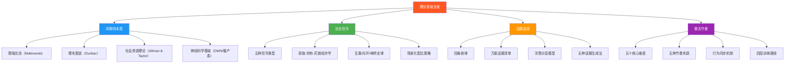
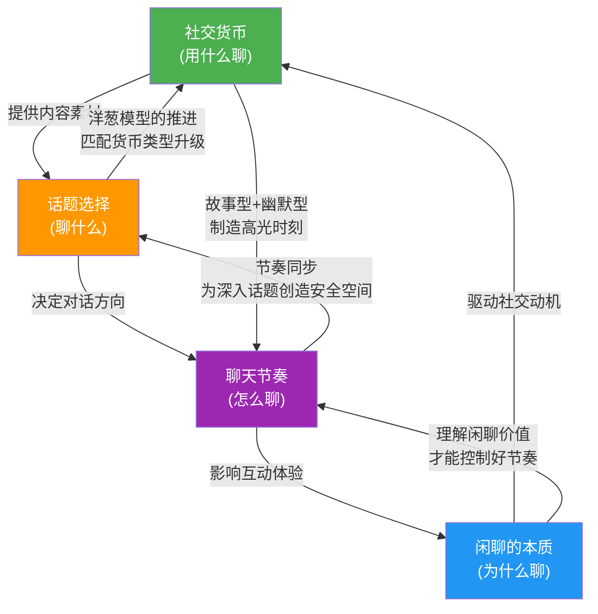

## 理论基础·本节小结

> "没有理论的实践是盲目的，没有实践的理论是空洞的。" ——Immanuel Kant

本节从四个维度构建了日常聊天的理论地基。这四个维度不是并列的知识点，而是一个层层递进的认知框架：先理解**闲聊是什么**（本质），再理解**用什么聊**（社交货币），接着理解**聊什么**（话题选择），最后理解**怎么聊**（节奏控制）。缺了任何一块，后续的技巧学习都会根基不稳。

### 四大理论支柱回顾

---

### 支柱一：闲聊的本质——不是废话，是生存策略

#### 核心结论

闲聊的学术名称是"寒暄交流"（phatic communication），由人类学家 Malinowski 于 1923 年首次提出。它的核心功能**不是传递信息，而是维护社会关系**。当你和同事聊了五分钟天气，你一个字也记不住——但你们的关系温度提升了 0.5 度。这 0.5 度，在你需要帮忙时，可能就是决定对方"不好意思拒绝"还是"跟你不太熟"的关键。

#### 三个必须记住的理论

| 理论 | 提出者 | 核心观点 | 对你的意义 |
|------|--------|---------|-----------|
| **理毛假说** | Robin Dunbar | 语言（尤其是闲聊）是灵长类互相理毛的升级版，从一对一扩展到同时服务 3-5 人 | 你每天花在闲聊上的时间不是浪费，而是维系 150 人社会网络的最低维护成本 |
| **社会渗透理论** | Altman & Taylor | 人际关系像剥洋葱，从表面信息逐层深入到核心自我 | 闲聊是进入深度关系的唯一入口，跳过它等于永远敲不开门 |
| **社会资本理论** | Robert Putnam | 弱连接（不怎么深入交流但保持日常联系的人）带来的机会远多于强连接 | 走廊里 30 秒的闲聊，构建的是价值巨大的弱连接网络 |

#### 一个关键认知重构

**闲聊与深度对话不是对立关系，而是螺旋上升关系。** 闲聊建立初步信任 → 信任允许更深入的话题 → 深入话题强化关系 → 强化的关系中闲聊变得更私密 → 更私密的闲聊进一步深化关系……这个螺旋不断上升，但**每一层上升都需要闲聊作为过渡带**。

那些宣称"我只聊有深度的话题"的人，切断的不是闲聊，而是通往深度对话的唯一通道。

---

### 支柱二：社交货币——聊天的隐形资本

#### 核心结论

社交货币是 Jonah Berger 在《疯传》中系统阐述的概念：人们通过分享有价值的信息来提升自己的社交形象，就像花钱买好衣服一样。在聊天中，你能"花出去"的信息、故事、幽默和情感，就是你的社交货币。

#### 五种货币类型速查

| 类型 | 核心机制 | 见效速度 | 保质期 | 最佳场景 | 最大风险 |
|------|---------|---------|--------|---------|---------|
| **故事型** | 人脑对故事的记忆效率是纯信息的 22 倍 | 快 | 中（同圈 3 次） | 初次见面、饭局 | 自我吹嘘 |
| **知识型** | 提供有价值的筛选和解读，而非背诵百科 | 中 | 短（信息会过时） | 职场、行业交流 | 说教感 |
| **幽默型** | 在最短时间内拉近距离，本质是智力信号 | 最快 | 最短（用完即弃） | 任何轻松场合 | 冒犯 |
| **情感型** | 准确感知并回应对方的情感状态 | 慢 | 最长（终身） | 关系深化 | 虚假共情 |
| **连接型** | 为别人创造连接，成为社交网络的超级节点 | 慢 | 长（关系持续） | 社交网络构建 | 信任背书失败 |

#### 三个必须记住的心理学机制

1. **互惠原则**：你给出价值，对方会产生回报欲望。社交货币的真正威力在于延迟互惠——今天无意分享的一个信息，三个月后被想起时，你的社交账户就收到一笔"利息"。延迟互惠产生的信任度是即时互惠的 1.7 倍。

2. **光环效应**：第一次聊天的社交货币输出权重是后续的 2-3 倍。好的开场不仅建立正面印象，还为后续所有互动设定了"正面解读滤镜"。

3. **峰终定律**：一场 30 分钟的聊天，对方记住的不是平均值，而是最高峰的体验和结束时的体验。与其全程保持中等输出，不如集中精力制造一两个高光时刻。

#### 一个关键操作原则

**社交货币的花销必须匹配对方的需求。** 对方焦虑时需要情感型货币（"我理解你的压力"），不是知识型货币（"我教你一个时间管理方法"）。识别需求的三个信号：语言信号（"好烦"→情感型）、提问信号（"你觉得呢？"→知识型）、氛围信号（沉默/叹气→情感型或幽默型）。

---

### 支柱三：话题选择——说什么比怎么说更重要

#### 核心结论

哈佛商学院对 300 场商务晚宴的追踪研究发现：对话满意度与"话题匹配度"的相关系数为 0.67，远高于"表达流畅度"的 0.31。**你聊什么，比你聊得好不好重要一倍。**

更关键的是前景理论的映射：一个好话题带来 +1 的好感度，一个踩雷话题带来 -2 到 -2.5 的厌恶度。因此，**避雷比加分更重要**——话题选择的第一优先级不是找到完美话题，而是避开危险话题。

#### 四条铁律

| 铁律 | 含义 | 违反后果 |
|------|------|---------|
| **安全优先** | 不确定时选中性话题，不碰政治、宗教、隐私 | 一次踩雷需要五次好表现才能弥补 |
| **相关锚定** | 话题必须从当前环境/共同经历/刚发生的事出发 | 强行切换话题显得突兀，对方感到"被安排" |
| **开放导向** | 选择能展开的话题，避免"是/否"就能回答的死胡同 | 封闭式话题让对话在 30 秒内死亡 |
| **双向参与** | 对方必须有话可说，否则你就是在给对方出考卷 | 单向输出不是聊天，是独白 |

#### 洋葱模型：话题的三层结构

核心原则：**逐层推进，不越级。** 从外层直接跳到内层是冒犯，一直停留在外层则关系无法推进。推进信号：当对方主动分享个人信息、提出追问、延长对话时，可以试探性地进入下一层。

#### 五种话题生成方法

| 方法 | 原理 | 适用场景 |
|------|------|---------|
| **环境扫描法** | 用五感扫描当前环境，每个感官发现一个可聊的点 | 冷场、不知道聊什么时 |
| **FORD 模型** | Family（家庭）、Occupation（职业）、Recreation（娱乐）、Dreams（梦想） | 初次见面、拓展话题 |
| **关联延伸法** | 从对方说的任何一句话中提取关键词，向外延伸 | 接话、延续话题 |
| **热点追踪法** | 每天花 10 分钟浏览热点，储备 3-5 个谈资 | 有信息重叠的社交场合 |
| **个人素材库** | 记录生活中的有趣小事，按 FORD 分类存储 | 所有场合 |

---

### 支柱四：聊天节奏——掌握对话的韵律

#### 核心结论

如果说话题选择决定了对话的"质量"，那么节奏控制决定了对话的"体验"。节奏是你在时间维度上组织对话的方式——你多快回应、多长时间换话题、说话是连珠炮还是慢条斯理、沉默时是冷场还是留白。

#### 五个核心维度

| 维度 | 关注点 | 核心原则 |
|------|--------|---------|
| **语速节奏** | 说话快慢的变化 | 不是保持"完美语速"，而是拥有语速弹性——根据内容灵活调整 |
| **话题节奏** | 话题切换的频率 | 3-8 分钟是大多数话题的黄金区间，桥接式转换是最佳模式 |
| **情感节奏** | 对话的情绪曲线 | 好的对话是"波浪线"而非"直线"——有升温、有高峰、有缓冲、有收尾 |
| **互动节奏** | 说与听的平衡 | 健康比例 40:60 到 60:40，行为同步是建立舒适感的基础 |
| **文字节奏** | 回复间隔、消息长度、消息密度 | 回复间隔应与对话"热力"匹配，消息长度要有变化 |

#### 五种节奏失调及修复

| 失调类型 | 症状 | 心理根源 | 修复方法 |
|---------|------|---------|---------|
| **机关枪式** | 语速过快、信息过密 | 焦虑驱动，害怕沉默 | 三秒法则、一段一问、消息限制 3 条 |
| **慢炖式** | 节奏过慢、缺乏起伏 | 过度谨慎，害怕出格 | 强调法制造减速带、加速铺垫、情绪标签 |
| **独白式** | 话太多、互动太少 | 话题驱动或缺乏话轮敏感度 | 定时自检、信号扫描、内容分段 |
| **采访式** | 问题太多、分享太少 | 社交安全策略 | 2:1 法则（问 2 个问题分享 1 段经历） |
| **断崖式** | 高潮后无过渡直接结束 | 缺乏收尾意识 | 渐弱收尾、预告法、高点收尾 |

#### 一个关键发现：行为同步

当两个人对话节奏匹配时，双方的好感度和信任度都会提升——语速趋向一致、停顿时长趋向一致、笑声频率趋向一致、身体姿态趋向镜像。这不是"模仿"，而是自然的社交同步。当你有意识地调整自己的节奏去匹配对方的节奏时，对方会在潜意识中感到"和这个人聊天很舒服"。

---

### 四大支柱的关联图谱

四个理论支柱不是孤立的，它们在实际聊天中协同运作：

**运作示例**：你在茶水间遇到同事（闲聊的本质：关系维护需求启动）→ 你决定用一个最近的出差趣事作为社交货币（故事型）→ 从"你出差回来了？"这个环境锚点开始聊（话题选择：相关锚定）→ 用正常偏快的语速讲铺垫，到笑点时突然放慢制造效果（聊天节奏：语速弹性）→ 对方笑完后你自然地问"你出差一般会不会顺便逛逛？"（话题选择：开放导向 + 聊天节奏：交出话轮）→ 整个过程 3 分钟，对方觉得和你聊天很舒服（行为同步达成）。

---

### 从理论到实践的行动清单

理论学习的唯一目的是指导行动。以下是将四大支柱转化为日常行为的具体清单：

#### 认知层面——先改变想法

- [ ] **重新定义闲聊**：从"浪费时间的废话"重新定义为"维护社会网络的最低成本投资"
- [ ] **建立货币意识**：每次聊天前问自己——我这次准备花什么类型的社交货币？
- [ ] **接受"先避雷再加分"**：话题选择的优先级是安全 > 有趣 > 深刻
- [ ] **接受"节奏比内容更隐形"**：对方记住的不是你说了什么，而是和你聊天的整体感受

#### 行为层面——再改变做法

- [ ] **每天一次环境扫描练习**：在任何场合，30 秒内用五感各找出一个可聊的话题
- [ ] **建立故事笔记**：手机备忘录记录生活趣事（日期、场景、事件、细节、情绪、可复用性）
- [ ] **练习桥接式话题转换**：从对方最后一句话中提取关键词，自然延伸到新话题
- [ ] **录音复盘**：每周录一段自己的对话回放，关注语速变化、说听比例、停顿频率
- [ ] **微信聊天记录审视**：翻看最近的聊天记录，评估回复间隔模式和消息长度变化

#### 能力评估——确认自己在哪里

在进入下一节"核心技巧"之前，用以下标准快速评估自己在四个维度上的当前水平：

| 维度 | Level 1（入门） | Level 2（基本胜任） | Level 3（熟练） |
|------|---------------|-------------------|----------------|
| **闲聊认知** | 认为闲聊是浪费时间 | 知道闲聊有用但说不清为什么 | 能清晰解释闲聊的社会功能和心理机制 |
| **社交货币** | 不知道自己有什么可以"花"的 | 有一些故事和知识但不知道怎么组织 | 能根据场景选择合适的货币类型和花销节奏 |
| **话题选择** | 经常不知道说什么 | 有话题但常选错或不会延伸 | 能快速扫描环境生成话题，自然推进话题深度 |
| **聊天节奏** | 对节奏毫无意识 | 知道节奏重要但控制不好 | 能根据对方状态灵活调整语速、话题频率和情感曲线 |

如果你在某个维度处于 Level 1，下一节学习对应技巧时要特别留意该维度的内容。

---

### 与下一节的衔接

本节建立了"道"——理论基础和底层逻辑。下一节"核心技巧"将进入"术"——具体的操作方法。

理论基础 → 核心技巧的对应关系：

| 本节理论 | 下一节对应技巧 | 预期收获 |
|---------|--------------|---------|
| 闲聊的本质（关系维护功能） | 开启话题（打破沉默的第一步） | 理解为什么"开口"比"说什么"更重要 |
| 社交货币（五种类型与花销策略） | 延续话题（让对话持续流动） | 学会用不同类型的货币"接住"对方的话 |
| 话题选择（四条铁律与洋葱模型） | 转换话题（优雅地切换频道） | 掌握从当前话题自然过渡到新话题的方法 |
| 聊天节奏（五个维度与行为同步） | 幽默技巧 + 赞美技巧 | 学会在正确的节奏点释放幽默和赞美 |

**一句话总结：本节的四个理论支柱——闲聊的本质回答"为什么聊"，社交货币回答"用什么聊"，话题选择回答"聊什么"，聊天节奏回答"怎么聊"。理解了这四个问题，你就拥有了日常聊天的完整认知框架。接下来，是时候把框架变成能力了。**
