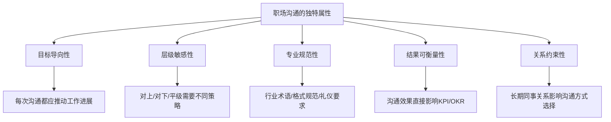
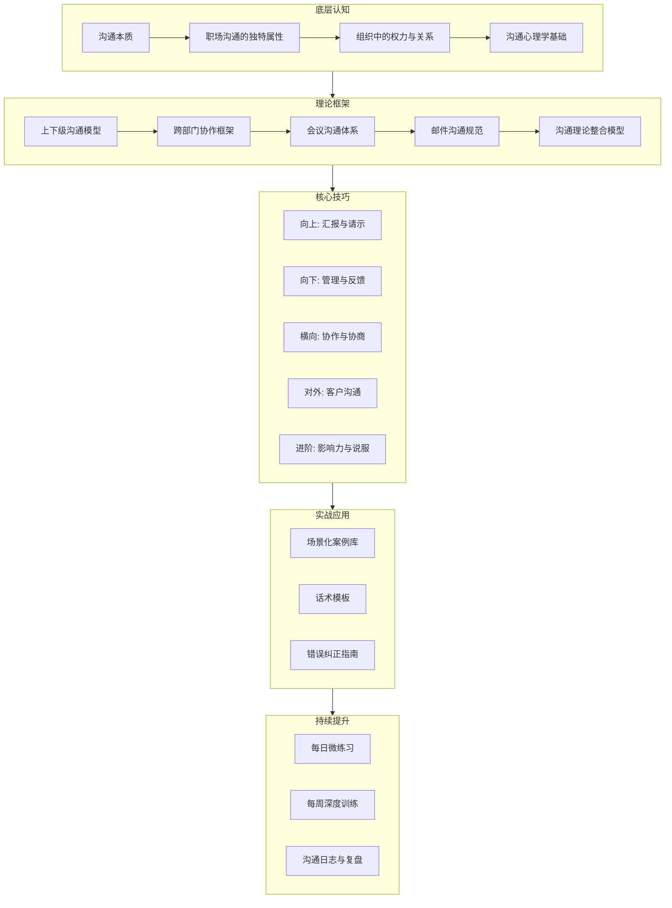
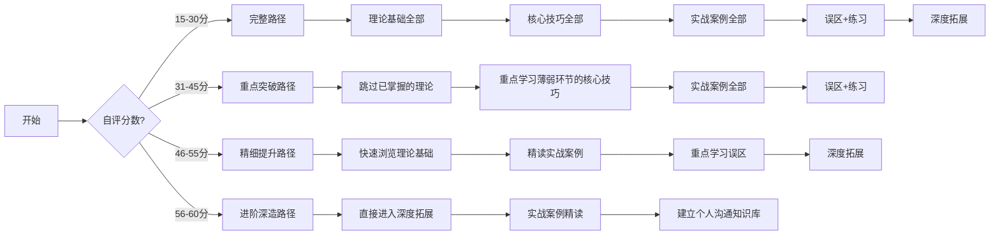

# 第五章 职场沟通

## 章节概览

### 为什么需要专门学习职场沟通

在人的一生中，职场是除了家庭之外，我们花费时间最多的地方。一个普通职场人每天大约有 8 到 10 个小时在工作环境中度过，而在这段时间里，绝大部分活动都与沟通密切相关。根据美国管理协会（AMA）的调查，管理者平均花费约 70% 的工作时间用于各种形式的沟通——开会、写邮件、打电话、一对一谈话、团队讨论等。即便是普通员工，沟通也占据了工作时间的 50% 以上。

然而，职场沟通与日常社交沟通有着本质的不同。日常沟通的对象多为家人、朋友，彼此之间有深厚的情感基础和较高的容错率，即便表达不当，也容易获得谅解。职场沟通则不同：它发生在组织架构的框架之中，受到层级关系、部门利益、组织文化、职业规范等多重因素的约束。一句不得体的话，可能影响你在领导心目中的形象；一封措辞不当的邮件，可能引发跨部门的误解；一次失败的工作汇报，可能让你长期的努力付诸东流。

正因如此，职场沟通需要专门的学习和训练。它不仅仅是"把话说清楚"那么简单，更是一门需要策略、技巧和智慧的综合能力。

#### 职场沟通能力与职业发展的直接关联

沟通能力对职业发展的影响远超多数人的认知。以下数据来自多项权威研究：

| 影响维度 | 研究发现 | 来源 |
|---------|---------|------|
| 晋升概率 | 沟通能力排名前 25% 的员工，晋升概率是后 25% 的 2.5 倍 | Harvard Business Review, 2019 |
| 薪资差异 | 具备优秀沟通能力的管理者，团队绩效平均高出 25% | McKinsey, 2020 |
| 离职率 | 72% 的员工离职原因与直属上级的沟通质量有关 | Gallup, 2022 |
| 项目成功率 | 沟通有效的团队，项目按时交付率提高 35% | PMI Pulse of the Profession, 2021 |
| 创新能力 | 心理安全感高的团队（由沟通氛围决定），创新产出高出 47% | Google Aristotle Project, 2015 |

这些数据揭示了一个残酷的现实：很多人在职场中花了大量时间提升专业技能，却忽视了沟通能力的修炼，结果是"干得好不如说得好的人"。这并不是说专业能力不重要，而是说专业能力需要通过有效沟通才能被看见、被认可、被放大。

#### 职场沟通失败的典型代价

为了更直观地说明问题，以下是职场沟通失败的真实案例：

**案例一：一封邮件引发的跨部门冲突。** 某互联网公司的产品经理在需求评审邮件中使用了"这个方案技术上应该很简单"的措辞，技术团队认为这是对他们工作的轻视，导致双方关系紧张，后续三个版本的需求沟通都困难重重，项目延期两个月。一句无心之语，代价是整个团队两个月的效率损失。

**案例二：一次汇报错失的晋升机会。** 某位连续三个季度超额完成业绩的销售主管，在年终述职中用了大量时间讲述具体执行细节，却没有提炼出自己的方法论和战略思考。管理层评价为"执行力强但缺乏全局视野"，晋升名额给了一个业绩稍逊但汇报更出色的同事。

**案例三：一次拒绝方式毁掉的同事关系。** 某工程师直接回复同事"这不是我的工作"，虽然在职责划分上完全正确，但这种表达方式让对方感到被拒绝和被轻视。消息在团队中传开后，该工程师逐渐被孤立，跨部门协作变得困难。

这些案例的共同点是：问题的根源不在于事情本身的是非对错，而在于沟通的方式和策略。技术能力决定了你能做什么，沟通能力决定了你能做成什么。

### 职场沟通的五大独特属性

要掌握职场沟通，首先要理解它区别于一般沟通的独特属性。这些属性决定了职场沟通的底层规则：

**属性一：目标导向性。** 职场沟通不是闲聊，每次对话、每封邮件、每个会议都应指向某个具体的工作目标。在开口或动笔之前，先问自己：这次沟通要达成什么结果？如果想不清楚目标，说明你还没准备好沟通。

**属性二：层级敏感性。** 组织中的权力关系深刻影响着沟通方式。对上级沟通需要简洁、尊重、聚焦结果；对下级沟通需要清晰、激励、给予空间；对平级沟通需要协作、互利、尊重边界。用错层级的沟通方式，轻则尴尬，重则影响职业关系。

**属性三：专业规范性。** 职场沟通有其自身的规范体系，包括行业术语的正确使用、正式文书的格式要求、会议礼仪的基本准则、邮件沟通的规范约定等。掌握这些规范是职场专业性的基本体现。

**属性四：结果可衡量性。** 与日常社交不同，职场沟通的效果往往可以通过工作结果来衡量——项目是否按时推进、团队是否高效协作、客户是否满意、上级是否认可。这种可衡量性既是压力，也是改进的依据。

**属性五：关系约束性。** 职场中的关系具有长期性和不可选择性。你不能像对待朋友那样对待同事——不能随意拉黑、不能任性发脾气、不能想说什么就说什么。你必须在维护关系的前提下推进工作，这对沟通策略提出了更高的要求。

### 本章的学习目标

本章旨在帮助读者系统地掌握职场沟通的核心知识和实用技能。具体而言，学完本章后，你将能够：

1. **理解职场沟通的本质特征**：认识到职场沟通的目标导向性、层级敏感性、专业规范性等独特属性，从而在实际工作中做出恰当的沟通决策。

2. **掌握不同场景的沟通策略**：无论是向上汇报、向下管理、横向协作还是对外沟通，都能找到合适的方法和话术。

3. **运用实用的沟通工具和框架**：如金字塔汇报法、STAR 反馈法、PREP 表达法等经过验证的沟通模型，让你的表达更有条理和说服力。

4. **规避职场沟通的常见陷阱**：识别并避免那些看似无害但实则有害的沟通习惯，如过度道歉、模糊表达、情绪化回应等。

5. **建立持续提升的练习体系**：通过每日和每周的刻意练习，将沟通技能内化为职业素养的一部分。

### 自我诊断：你目前的职场沟通水平如何

在开始学习之前，建议你先做一个快速的自我诊断，了解自己当前的沟通水平和薄弱环节。以下是一份简化的职场沟通能力自评量表，涵盖 5 个核心维度，共 15 个自评问题。

**评分标准：** 1 分 = 完全不符合，2 分 = 较少符合，3 分 = 一般，4 分 = 较多符合，5 分 = 完全符合。

#### 维度一：向上沟通能力

| 编号 | 自评项目 | 评分(1-5) |
|------|---------|-----------|
| 1 | 向领导汇报工作时，我能先说结论再展开细节 | ____ |
| 2 | 请示领导时，我会带着方案而非只抛出问题 | ____ |
| 3 | 接到模糊指令时，我会主动确认关键细节而非自行猜测 | ____ |

#### 维度二：向下沟通能力

| 编号 | 自评项目 | 评分(1-5) |
|------|---------|-----------|
| 4 | 布置任务时，我会明确说明期望结果、截止时间和验收标准 | ____ |
| 5 | 批评下属时，我能对事不对人，且给出改进建议 | ____ |
| 6 | 我能及时给予下属正面反馈，而非只在出问题时才沟通 | ____ |

#### 维度三：横向协作能力

| 编号 | 自评项目 | 评分(1-5) |
|------|---------|-----------|
| 7 | 跨部门协作时，我能做到换位思考，理解对方的优先级 | ____ |
| 8 | 遇到意见分歧时，我能聚焦共同目标而非争对错 | ____ |
| 9 | 拒绝不合理请求时，我能做到态度温和但立场坚定 | ____ |

#### 维度四：书面沟通能力

| 编号 | 自评项目 | 评分(1-5) |
|------|---------|-----------|
| 10 | 我的邮件主题清晰、正文结构化、行动项明确 | ____ |
| 11 | 我能根据不同场景（正式/非正式）调整书面表达的语气 | ____ |
| 12 | 重要邮件发送前我会检查措辞是否可能引起误解 | ____ |

#### 维度五：会议沟通能力

| 编号 | 自评项目 | 评分(1-5) |
|------|---------|-----------|
| 13 | 我能在会议中清晰表达观点，且控制在合理时间内 | ____ |
| 14 | 我会提前准备会议议题，并在会后跟进决议事项 | ____ |
| 15 | 遇到跑题或冗长的讨论，我能有效引导回到正题 | ____ |

**计分方式：** 将 15 项评分相加，得到总分。

| 总分范围 | 水平评估 | 建议 |
|---------|---------|------|
| 15-30 分 | 初级水平——沟通意识薄弱，需要系统学习 | 建议完整阅读本章所有内容，重点关注理论基础和核心技巧 |
| 31-45 分 | 中级水平——有一定基础，但存在明显短板 | 建议重点阅读自评得分较低的维度对应章节，补充实战案例 |
| 46-55 分 | 高级水平——整体良好，仍有提升空间 | 建议重点关注实战案例和常见误区，进行精细化提升 |
| 56-60 分 | 精通水平——沟通能力突出 | 建议直接阅读深度拓展部分，关注领导力沟通和组织沟通 |

### 职场沟通知识体系全景图

职场沟通的知识体系可以用一张全景图来呈现。这张图帮助你理解本章各个部分之间的逻辑关系，以及每个部分在整个体系中的位置：

### 本章的内容结构

本章按照"理论认知 → 核心技巧 → 实战应用 → 误区纠正 → 刻意练习"的逻辑展开，共分为以下部分：

**第一节：理论基础。** 从宏观视角审视职场沟通的特点和规律，分别探讨上下级沟通、跨部门沟通、会议沟通和邮件沟通这四大职场沟通场景的底层逻辑，以及职场沟通的经典理论模型。这一节帮助你建立对职场沟通的整体认知框架，理解"为什么这样做"而非仅仅记住"应该怎么做"。

**第二节：核心技巧。** 聚焦六个高频职场沟通场景——工作汇报、请示领导、批评下属、接受批评、团队协作、客户沟通，提供具体可操作的方法和话术模板。此外，还包含一个进阶能力专题，讲解如何培养沟通中的影响力和说服力。

**第三节：实战案例。** 通过八个真实场景的完整案例，展示如何将理论和技巧应用于实际工作情境。每个案例都包含场景描述、错误示范、正确做法和关键要点分析。案例覆盖了从日常汇报到敏感话题（如离职沟通）的完整光谱。

**第四节：常见误区。** 列举职场沟通中最常见的十个误区，帮助你对照检查自身的沟通习惯，及时纠正偏差。每个误区都配有具体的情境描述和纠正方案。

**第五节：练习方法。** 提供一套系统的练习方案，包括每日微练习和每周深度练习，以及沟通日志的记录和复盘方法，确保学习成果能够转化为实际能力。

**第六节：本章小结。** 回顾全章要点，提炼核心理念，为读者提供一个可以随时查阅的知识速查表。

**第七节：深度拓展。** 为希望进一步深入的读者提供高级话题，包括组织政治沟通、危机沟通、跨文化职场沟通等进阶主题。

### 不同读者的阅读路径建议

根据自我诊断的结果，不同水平的读者可以选择不同的阅读路径：

**完整路径（初级读者）：** 按顺序从理论基础读到深度拓展，预计需要 8-10 小时。建议分 3-4 次完成，每次 2-3 小时，中间留出消化和实践的时间。

**重点突破路径（中级读者）：** 跳过已掌握的理论部分，重点学习自评中得分较低的维度对应的核心技巧，然后通读实战案例和误区。预计需要 5-7 小时。

**精细提升路径（高级读者）：** 快速浏览理论基础确认无遗漏，精读实战案例学习不同处理方式的优劣，重点学习误区部分查漏补缺。预计需要 3-4 小时。

**进阶深造路径（资深读者）：** 直接阅读深度拓展部分的高级主题，结合实战案例进行批判性阅读，同时建立自己的沟通知识库。预计需要 2-3 小时。

### 职场沟通的核心理念

在正式开始学习之前，有必要先确立几个关于职场沟通的核心理念。这些理念不是空洞的口号，而是贯穿全章的底层逻辑，理解它们将帮助你更好地吸收后续的具体技巧。

**第一，沟通是手段，不是目的。** 职场沟通的根本目的是推动工作、解决问题、达成目标。华丽的辞藻和高超的话术固然重要，但如果脱离了工作目标，就变成了无意义的表演。很多沟通培训的误区在于过度关注"怎么说"而忽略了"为什么说"。在你准备任何一次职场沟通之前，第一个要回答的问题不是"我该怎么说"，而是"我要达成什么结果"。

**第二，换位思考是一切技巧的基础。** 无论是向上汇报还是向下管理，理解对方的立场、需求和关切，永远是有效沟通的第一步。领导关心的是结果和风险，不是过程细节；同事关心的是自己的利益和边界，不是你的困难；下属关心的是成长和认可，不是你的权威。真正的换位思考不是"如果我是对方我会怎么想"，而是"对方现在的处境、压力和目标是什么"。

**第三，职场沟通是可以训练的技能。** 没有人天生就是沟通高手，但每个人都可以通过系统的学习和刻意的练习，显著提升自己的职场沟通能力。心理学家安德斯·埃里克森（Anders Ericsson）的研究表明，任何技能的习得都遵循"刻意练习"的原则——有目标、有反馈、有重复、有改进。沟通技能也不例外。本章最后一节提供的练习方案，正是基于这一原则设计的。

**第四，真诚是最好的沟通策略。** 所有技巧都应该建立在真诚的基础上。虚伪的恭维和刻意的讨好，或许能带来短期利益，但终将损害你的职业信誉。真诚不意味着什么话都直说——真诚是指你的出发点是善意的，你的表达是诚实的，你的承诺是可信的。在真诚的基础上运用技巧，是"锦上添花"；脱离真诚的技巧，则是"金玉其外"。

**第五，沟通的效果取决于接收方的理解，而非发送方的意图。** 这是一个常被忽视的原则。很多人在沟通出现问题时会说"我不是那个意思"，但在职场中，你的意图并不重要，对方接收到的信息才是真正的沟通内容。这意味着你有责任确保对方正确理解了你的意思，而不是在被误解时指责对方"理解能力差"。

**第六，沉默和不沟通本身也是一种沟通。** 在职场中，不回复邮件、不参加会议、不表态、不反馈，这些"不作为"都会被解读为某种信号——可能是不重视、不支持、不认同，甚至是有意见。很多人以为"不说就不会出问题"，但实际上，不沟通往往比错误的沟通造成更大的问题。

### 本章关键词与导航

**本章关键词：** 职场沟通、层级关系、工作汇报、跨部门协作、会议沟通、邮件沟通、向上管理、向下领导、客户沟通、绩效面谈、沟通策略、话术模板、沟通误区、刻意练习

**建议学习时间：** 8-10 小时（完整路径），可分 3-4 次完成

**前置知识：** 建议先阅读第一章（沟通的本质）和第二章（倾听的艺术），以便更好地理解本章内容。如果你已经具备基本的沟通和倾听知识，可以直接开始本章学习。

**章节导航：**

| 节次 | 内容 | 建议时长 | 适合读者 |
|------|------|---------|---------|
| 第一节 理论基础 | 职场沟通的底层逻辑与理论模型 | 2-3 小时 | 初级/中级 |
| 第二节 核心技巧 | 六大场景的具体方法与话术 | 2-3 小时 | 所有读者 |
| 第三节 实战案例 | 八个真实场景的完整案例分析 | 1.5-2 小时 | 所有读者 |
| 第四节 常见误区 | 十个典型误区与纠正方案 | 0.5-1 小时 | 所有读者 |
| 第五节 练习方法 | 系统化的日常练习方案 | 0.5-1 小时 | 所有读者 |
| 第六节 本章小结 | 知识速查表与核心理念提炼 | 0.5 小时 | 所有读者 |
| 第七节 深度拓展 | 高级话题与前沿趋势 | 1-2 小时 | 高级/资深 |

带着这些理念和准备，让我们正式开始第五章的学习之旅。
