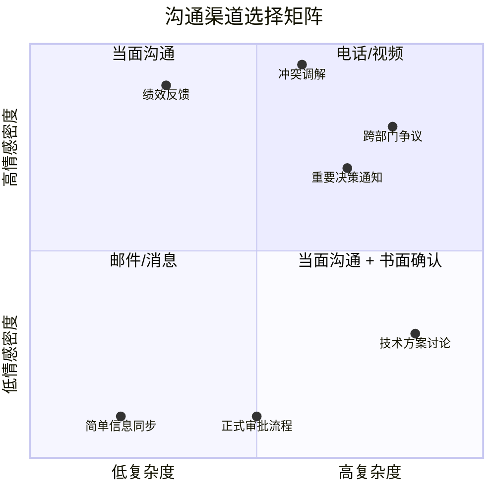

# 第四节 职场沟通的常见误区

职场沟通中的错误，往往不是因为缺乏知识，而是因为错误的习惯在压力和惯性下反复强化。认知心理学将这类现象称为"自动化行为偏差"——人们在熟悉的环境中倾向于依赖直觉和习惯做出反应，而忽略了情境的细微差异。一个在朋友聚会上无伤大雅的玩笑，搬到团队会议上可能变成冒犯；一封措辞随意的消息在亲密同事间毫无问题，在跨部门协作中却可能引发误解。

本节系统梳理职场沟通中最常见的十五个误区。每个误区不仅告诉你"错在哪"，更从心理学和组织行为学的角度解释"为什么会犯这个错"，并提供具体的纠正方案和恢复策略。

## 误区的底层逻辑：为什么聪明人也会犯沟通错误

在逐一讨论具体误区之前，有必要理解一个根本问题：为什么受过良好教育、专业能力出色的人，仍然会反复陷入沟通陷阱？

```mermaid
graph TD
    A[沟通误区的三大根源] --> B[认知偏差]
    A --> C[情绪驱动]
    A --> D[习惯惯性]
    
    B --> B1[确认偏误：只看到支持自己观点的信息]
    B --> B2[透明度假象：以为对方能理解自己的意图]
    B --> B3[后见之明偏差：事后觉得"我早就知道"]
    
    C --> C1[杏仁核劫持：情绪压过理性]
    C --> C2[损失厌恶：对负面反馈过度防御]
    C --> C3[即时满足：选择短期舒适而非长期收益]
    
    D --> D1[早期习得的沟通模式难以改变]
    D --> D2[环境默许强化了错误行为]
    D --> D3[缺乏反馈机制导致盲区持续存在]
```

**认知偏差层面**，心理学家伊丽莎白·牛顿（Elizabeth Newton）的经典实验揭示了"知识的诅咒"——当你知道某件事时，你很难想象不知道它是什么感觉。在沟通中，这意味着你很难准确评估对方是否理解了你的意思。你以为自己说得很清楚，实际上对方接收到的信息可能完全不同。

**情绪驱动层面**，神经科学家安东尼奥·达马西奥（Antonio Damasio）的研究表明，人类的决策过程本质上是情绪先行、理性后置的。当你在会议上被质疑时，大脑的杏仁核会在200毫秒内启动"战斗或逃跑"反应，而前额叶皮层需要数秒才能介入进行理性分析。这解释了为什么人们在冲突中会说出"不过脑子"的话。

**习惯惯性层面**，组织行为学研究表明，人们在组织中会逐渐适应既有的沟通模式，即使这些模式并不高效。如果一个团队长期容忍模糊表达，新成员也会迅速学会用模糊语言来降低犯错风险。

理解这些底层机制，是纠正误区的前提。接下来我们逐一分析十五个最常见的职场沟通误区。

***

## 误区一：只报喜不报忧

### 表现形式

很多职场人习惯于只汇报好消息，把坏消息藏着掖着，希望能在问题自行解决或被发现之前蒙混过关。具体表现包括：

- 项目进度已经严重滞后，周报中仍然写"进展顺利"
- 客户已经表达了明确不满，却只向上级反馈"客户有一些小意见"
- 预算已经超支，却等到季度结算时才暴露
- 技术方案存在重大缺陷，却在评审中轻描淡写
- 团队成员已经提出离职意向，管理者却不向上预警

### 心理根源

这种行为背后有三个深层心理机制：

**损失厌恶效应。** 诺贝尔经济学奖得主丹尼尔·卡尼曼（Daniel Kahneman）的研究表明，人们对损失的敏感度是收益的2.5倍。汇报坏消息意味着可能面临批评、追责甚至惩罚，这种"损失预期"会驱动人们选择回避。

**鸵鸟心态。** 心理学中的"回避应对"（avoidance coping）策略——面对威胁时选择不去看它，希望它自己消失。在职场中表现为"只要我不说，问题就不算存在"。

**过度乐观偏差。** 人们倾向于高估积极结果的概率。"也许下周进度就能赶上来""也许客户过几天就忘了""也许领导不会注意到"——这些自我安慰在多数情况下都是幻觉。

### 为什么有害

- **失去领导信任**：坏消息终将浮出水面，当领导质问"为什么现在才告诉我"时，你不仅失去了对这个具体问题的信任，更失去了对未来所有汇报的信任。领导会开始怀疑：你还有多少事情没告诉我？
- **错失解决窗口**：项目管理中有一个"1-10-100法则"——问题发现越早，解决成本越低。第一天发现可能只需要1小时调整，拖到第十天可能需要10天返工，拖到第一百天可能需要100天重建。拖延不是在保护自己，是在放大损失。
- **扭曲决策基础**：领导基于不完整信息做出的决策，可能对团队和公司造成更大的连锁损失。你隐瞒的成本超支，可能导致领导批准了新的预算项目；你隐瞒的客户不满，可能导致销售团队继续错误的策略。

### 正确做法

采用"预警机制"思维：一旦发现风险或问题，第一时间向相关方通报。汇报坏消息时，遵循**"问题-影响-方案"三段式结构**：

> "领导，XX项目遇到了一个问题：核心供应商的交付时间推迟了两周（问题）。如果不处理，我们的整体上线时间将延迟两周，影响Q3的营收目标（影响）。我已经准备了三个应对方案：A方案是更换供应商，B方案是调整上线计划，C方案是增加预算加急，需要和您商量一下（方案）。"

**关键细节**：方案至少准备两个，最好三个。只提一个方案像是在推卸决策权，只提问题不提方案像是在甩锅。两到三个方案表明你已经深入思考过，同时尊重领导的决策权。

### 真实案例

某电商平台的技术负责人在"双十一"前两周发现了一个可能导致订单丢失的底层数据库缺陷。他没有选择隐瞒，而是立即向CTO汇报，同时准备了热修复方案和降级方案。CTO当即决定投入额外资源修复，最终在"双十一"前解决了问题。事后CTO在全员会上公开表扬了这位技术负责人的"职业勇气"。如果他选择隐瞒，一旦在"双十一"当天爆发，后果将不堪设想——不是项目延期的问题，而是整个平台的信任危机。

### 核心原则

**坏消息要尽早说，好消息可以稍后说。** 一个成熟的职场人，不是不会遇到问题，而是能够在问题出现时第一时间处理和汇报。汇报坏消息不是示弱，而是展示你对风险的敏感度和解决问题的能力。

***

## 误区二：过度使用模糊语言

### 表现形式

在沟通中频繁使用"大概""差不多""应该没问题""尽快""回头再说"等模糊词汇。例如：

- "我尽快给你。"——尽快是什么时候？今天？明天？下周？
- "差不多完成了。"——完成了80%还是95%？剩余部分是什么难度？
- "应该没问题。"——是确定没问题，还是你不太确定？
- "很多人反馈……"——多少人？什么比例？什么渠道收集的？
- "效果还不错。"——具体好在哪里？有没有数据支撑？

### 心理根源

模糊语言的使用并非总是出于懒惰，它有三种常见的心理动机：

**自我保护。** 模糊的承诺给自己留了余地——"尽快"意味着如果没按时完成，你可以说"我以为你说的是下周"。这本质上是一种防御性沟通，用模糊性来降低被追责的风险。

**认知懒惰。** 给出精确信息需要思考和核实，而模糊表达则可以"先应付过去"。这是一种认知资源的节省策略，但代价是对方需要花更多精力去猜测你的意思。

**社交润滑。** 在中国文化语境中，模糊语言有时被视为一种礼貌——"差不多"比"你做得不够好"更温和，"回头再说"比"我不想讨论这个"更委婉。问题在于，职场沟通需要精确性来驱动行动，过度润滑会导致执行力下降。

### 为什么有害

- **造成期望落差**：每个人对"尽快""差不多"的理解不同。你以为"尽快"是一周内，领导以为是今天下班前。这种期望落差是职场冲突的主要来源之一。
- **削弱专业形象**：模糊的语言给人留下不靠谱、不严谨的印象。长期使用模糊语言的人，在关键项目中会被绕过——因为没有人敢把重要任务交给一个"大概没问题"的人。
- **增加沟通成本**：模糊表达意味着需要更多轮次的确认和追问。一封说清楚的邮件可以一次解决问题，一封模糊的邮件可能引发五六封后续邮件的来回确认。
- **难以追责**：当结果与预期不符时，双方都会觉得是对方的问题。"我说的是周三""我以为你说的是下周五"——这种扯皮在职场中每天都在发生。

### 正确做法

用具体的时间、数字和标准来替代模糊语言。以下是常见模糊表达的具体化替换：

| 模糊表达 | 具体表达 | 具体化的价值 |
|----------|----------|-------------|
| 尽快完成 | 周三下午5点前完成 | 对方可以安排后续工作 |
| 差不多了 | 完成了85%，剩余部分预计明天上午完成 | 对方了解真实进度 |
| 应该没问题 | 基于目前的信息，风险可控，但有两个假设需要确认：A和B | 对方知道风险边界 |
| 很多人反馈 | 根据上周的客户调研，73%的受访者（共150人样本）反馈…… | 对方可以判断数据可信度 |
| 回头再说 | 我们周三下午3点再讨论这个议题，届时我准备好方案 | 对方知道什么时候会得到答案 |
| 效果还不错 | 转化率提升了12个百分点，超出目标3个百分点 | 对方知道具体成果 |
| 有一些问题 | 有三个关键问题需要解决：1.…… 2.…… 3.…… | 对方了解具体障碍 |

**当你确实无法给出精确数字时**，给出范围和假设条件：

> "基于目前的信息，完成时间在3到5个工作日之间。如果周三前能拿到设计稿，3天可以完成；如果设计稿延迟，需要5天。我会在周三确认一次进度。"

### 核心原则

**精确是专业的体现。** 当你不确定时，可以说"我需要核实一下，XX时间前给你准确答复"，这比"大概没问题"要好得多。前者展示的是严谨和负责，后者暴露的是敷衍和模糊。

***

## 误区三：用文字替代当面沟通

### 表现形式

有些职场人习惯用邮件或即时消息来处理所有沟通，包括那些本应该当面或电话沟通的事情。具体表现为：

- 用邮件通知下属绩效不佳
- 用群消息宣布涉及团队利益的重要决策
- 用邮件来回讨论复杂的跨部门争议
- 用即时消息处理敏感的人事安排
- 用文字沟通处理高情绪密度的冲突场景

### 心理根源

选择文字沟通而非面对面交流，背后有明确的心理动机：

**回避冲突。** 面对面沟通需要即时回应，无法"编辑"自己的表达。文字沟通提供了一个缓冲区——你可以反复修改措辞，避免直接面对对方的情绪反应。这种回避虽然降低了当下的不适，但往往导致问题被延后和放大。

**效率幻觉。** "发一封邮件只要5分钟，约一次会议要协调半天"——这是典型的效率幻觉。一封复杂邮件可能引发十几封回复和追问，总沟通时间远超一次20分钟的面对面讨论。

**留痕偏好。** 在问责文化较重的组织中，人们倾向于"留下文字记录"以保护自己。这种行为可以理解，但当留痕需求压过沟通效果时，就会出现问题。

### 为什么有害

- **缺乏情感温度**：梅拉比安沟通模型（Mehrabian's Communication Model）指出，情感态度的传递中，语言内容仅占7%，语调占38%，肢体语言占55%。文字沟通剥离了93%的情感信息，这在传递负面消息或处理冲突时尤其危险。一句"你的方案需要大改"在邮件中读起来是严厉的批评，当面说出来时配合温和的语气和建设性的姿态，可能变成一次有帮助的指导。
- **效率低下**：复杂问题用邮件来回讨论，可能一封邮件变成十几封，远不如当面谈10分钟高效。项目管理协会（PMI）的研究显示，沟通渠道的选择对项目效率的影响高达30%。
- **留下不可控的记录**：不恰当的邮件内容可能被截图、转发、甚至在劳动仲裁中作为证据。很多职场纠纷的起点就是一封措辞不当的邮件。

### 正确做法

根据沟通的**情感密度**和**复杂度**两个维度选择合适的渠道：



具体渠道选择指南：

| 沟通类型 | 推荐渠道 | 原因 |
|----------|----------|------|
| 绩效反馈 | 当面沟通 | 情感密度高，需要即时互动和情绪感知 |
| 重要决策通知 | 当面沟通 + 邮件确认 | 需要当面解释背景和回答疑问，邮件留痕确认 |
| 跨部门争议 | 当面或视频会议 | 复杂度高，需要实时澄清立场和寻找共识 |
| 复杂技术方案 | 会议讨论 + 文档沉淀 | 需要多方参与讨论，结论需文档化 |
| 简单信息同步 | 即时消息或邮件 | 低复杂度低情感，文字足够 |
| 正式审批流程 | 邮件或OA系统 | 需要完整的审批链条和记录 |
| 冲突调解 | 当面沟通（绝不群聊） | 情感密度最高，任何文字都可能被误读 |
| 表扬认可 | 公开场合当面表达 | 当众表扬的激励效果是私下表扬的3-5倍 |

### 核心原则

**重要的事情当面说，当面说了的事情邮件确认。** 文字是辅助工具，不是替代品。选择沟通渠道时，不要问"哪种最方便"，而要问"哪种最有效"。

***

## 误区四：在公开场合批评同事或下属

### 表现形式

在团队会议、工作群里或有其他人在场的情况下，直接指出同事或下属的错误。例如：

- 在周会上当着所有人的面说："小李，你这个方案做得太差了。"
- 在工作群里说："@小王 你这个bug怎么又犯了？上次不是说过了吗？"
- 在跨部门会议上说："这个问题完全是技术部的责任。"
- 在全员邮件中点名批评某个团队的交付质量
- 在客户面前批评自己的同事

### 心理根源

公开批评的行为通常源于以下心理动机：

**权力展示。** 有些管理者通过公开批评来确立自己的权威地位——"我要让所有人知道谁说了算"。这种行为短期内可能产生威慑效果，但长期会严重破坏团队信任。

**即时情绪宣泄。** 当问题发生时，批评者自身也处于愤怒或失望的情绪中，公开场合的批评往往是一时冲动而非深思熟虑的结果。

**"杀鸡儆猴"思维。** 有些管理者认为公开批评可以起到警示其他团队成员的作用，但研究表明，旁观者看到公开批评后的感受不是"我要小心"，而是"这里不安全"。

### 为什么有害

- **严重伤害自尊和信任**：马斯洛需求层次理论中，尊重需求是仅次于安全需求的高优先级需求。公开批评直接打击了一个人的自尊，这种伤害的修复周期通常以月甚至年计算。被公开批评过的员工，有65%会在一年内选择离职（SHRM, 2021）。
- **引发对抗或退缩**：被公开批评的人有两种典型反应——对抗（当场反驳、事后报复）或退缩（消极怠工、不再主动发言）。两种反应都会损害团队效能。
- **制造心理不安全**：谷歌的"亚里士多德项目"（Project Aristotle）研究发现，心理安全感是高效团队的第一要素。当团队成员看到有人被公开批评时，他们会本能地降低自己的发言频率和创新意愿——因为"多说多错"。
- **损害批评者的形象**：公开批评别人的人，往往被视为缺乏情商和领导力。旁观者不会觉得被批评的人有问题，而会觉得批评者"不会管理"。

### 正确做法

**表扬在公开场合，批评在私下进行。** 这是管理学中"肥皂水效应"的核心原则——将批评夹在表扬中间，像三明治一样包裹起来。

如果需要在会议中指出问题，采用**建设性转向**的方式：

> ❌ "小李，你这个方案的数据分析部分做得太粗糙了。"
>
> ✅ "方案的整体框架很好，特别是市场定位的分析很到位。数据部分我有一些想法可以进一步加强，会后我们单独讨论一下。"

**私下批评的三步法**（BID模型）：

1. **Behavior（行为）**：描述具体行为，不评价人格。"我注意到这次报告中的数据有三处与原始数据不一致。"
2. **Impact（影响）**：说明行为造成的影响。"如果客户看到这些不一致，可能会影响对我们专业性的判断。"
3. **Desired action（期望行为）**：明确期望的改进方向。"下次提交前，建议你用交叉验证的方法核对一遍数据源，我可以分享一个自动化校验工具给你。"

### 例外情况

有一种情况需要在公开场合处理：当错误的影响范围是整个团队，且需要所有人共同吸取教训时。即便如此，也应该**对事不对人**：

> "上周的发布流程中出现了一个问题，导致线上服务中断了30分钟。我们需要一起复盘一下流程中哪个环节可以改进，避免下次再发生。"（不点名，聚焦流程改进）

### 核心原则

**给人留面子，就是给自己留后路。** 私下批评不仅保护了对方的尊严，也给了双方更坦诚沟通的空间。真正有领导力的人，不需要通过贬低别人来抬高自己。

***

## 误区五：过度道歉

### 表现形式

在职场中频繁、过度地道歉，为一些不需要道歉的事情道歉。这种行为在职场新人和女性员工中尤为常见。具体表现为：

- "不好意思打扰了，我想问一下……"
- "对不起，可能我的想法不太成熟……"
- "抱歉，我不知道这个对不对，但是……"
- "真的很抱歉让您多等了5分钟……"
- 每封邮件开头都是"不好意思""打扰一下"
- 提出不同意见前先道歉三遍

### 心理根源

过度道歉通常源于以下心理因素：

**低自我效能感。** 心理学家阿尔伯特·班杜拉（Albert Bandura）提出的自我效能感理论指出，当一个人对自己的能力缺乏信心时，会通过频繁道歉来降低他人对自己的期望——"我先道歉，这样如果做得不好也不至于太丢脸"。

**社交焦虑。** 害怕冲突和被拒绝的人倾向于用道歉来"润滑"人际关系。道歉变成了一种社交安全毯——只要先道歉，就不会被讨厌。

**文化习得。** 在某些文化背景和家庭环境中，"谦虚"被过度强调，导致道歉成为一种无意识的习惯性表达。

### 为什么有害

- **削弱专业形象**：过度道歉让人觉得你缺乏自信和专业能力。一项针对职场沟通的研究发现，频繁使用道歉语的员工在360度评估中获得的"专业能力"评分平均低15%。
- **降低话语权**：每次开口都先道歉，等于在告诉别人"我的话不重要"。在会议中，过度道歉的人的意见被采纳的概率明显低于直接表达的人。
- **制造不必要的心理负担**：对方本来没觉得有问题，你的道歉反而让他觉得"好像确实是个问题"。心理学中这被称为"锚定效应"——你的道歉为对方设置了一个负面的心理锚点。
- **形成恶性循环**：越道歉越没自信，越没自信越道歉。久而久之，道歉成为一种自动化的自我贬低行为。

### 正确做法

道歉要适度，只在真正需要道歉的情况下道歉。区分"需要道歉"和"不需要道歉"的场景：

| 不需要道歉的场景 | 需要道歉的场景 |
|-----------------|---------------|
| 提问和寻求信息 | 真的犯了错误且造成了影响 |
| 表达不同意见 | 造成了实质性的经济损失或信誉损害 |
| 设定合理边界 | 迟到了重要会议且影响了议程 |
| 合理的等待时间 | 忘记了明确承诺过的事情 |
| 分享自己的想法 | 冒犯了他人的尊严或底线 |
| 说"不" | 违反了明确的规则或流程 |

将"抱歉"替换为更自信的表达：

| 过度道歉的表达 | 替换为 |
|---------------|--------|
| ❌ "不好意思打扰了" | ✅ "有个问题想请教" 或 "占用你两分钟" |
| ❌ "可能我的想法不太成熟" | ✅ "我的建议是……" 或 "从我的角度看……" |
| ❌ "对不起我不知道" | ✅ "这个我需要确认一下，XX时间前回复你" |
| ❌ "抱歉让你多等了" | ✅ "感谢你的耐心等待" |
| ❌ "不好意思我可能说错了" | ✅ "我补充一个角度" |

**需要真正道歉时的正确方式**：道歉要具体、真诚、包含补救措施，而不是空洞的"对不起"。

> ❌ "对不起对不起，都是我的错。"
>
> ✅ "这次报告中的数据错误是我的责任，我已经核对了所有数据并更正了报告。同时我建立了一个数据校验清单，确保以后不再发生类似问题。"

### 核心原则

**道歉是承认错误的工具，不是自我贬低的习惯。** 真正有礼貌的表现是尊重他人的时间和意见，而不是不断贬低自己。把道歉的次数减半，你会发现别人对你的尊重反而增加了。

***

## 误区六：只说不听

### 表现形式

在沟通中只顾着表达自己的观点，不认真倾听对方说了什么。具体表现为：

- 别人还没说完就打断，急于表达自己的观点
- 别人说话时在心里准备自己接下来要说什么
- 对别人的问题和关切视而不见，只关注自己想说的内容
- 会议中一直在发言，从不提问或邀请他人分享
- 对方明显在表达不满，你却在滔滔不绝地解释自己的立场
- 收到反馈后立刻反驳，而不是先理解对方的意思

### 心理根源

**自我中心偏差。** 发展心理学研究表明，人类天生具有"自我中心"的认知倾向。在沟通中表现为：人们对自己想说的话的关注度远高于对对方表达内容的关注度。

**表达欲的即时满足。** 说话比倾听更能带来即时的心理满足——你在表达时是主动的、有控制感的，而倾听时是被动的、等待的。很多人把"在说话"等同于"在参与"，把"沉默"等同于"不在场"。

**对倾听价值的认知不足。** 很多人认为沟通能力等于表达能力，忽略了倾听才是沟通的基础。实际上，哈佛商学院的研究表明，在高管级别的沟通中，最有效的领导者花在倾听上的时间是表达时间的两倍。

### 为什么有害

- **错失关键信息**：对方可能正在说一个对你非常重要的信息，但你因为没有倾听而错过了。一个被忽略的客户暗示，可能意味着一个即将流失的大单。
- **让人感到不被尊重**：没有人喜欢和一个只关心自己说话的人沟通。被忽略的感受会迅速转化为对你个人的负面评价——"这个人很自大""这个人不尊重人"。
- **影响决策质量**：没有充分听取各方意见就做出的决策，往往不够全面。管理学中的"群体极化"现象表明，当团队中某些声音被压制时，决策会向极端方向偏移。
- **错失关系深化的机会**：倾听是建立信任的最有效方式。当你认真倾听对方时，对方会感到被理解和被重视，这种感受是建立深层工作关系的基础。

### 正确做法

倾听不是被动地等对方说完，而是一种需要刻意练习的主动技能。以下是系统化的倾听提升方法：

**主动倾听四步法（ARIA模型）：**

1. **Attend（关注）**：放下手机、关闭电脑屏幕、保持眼神接触、点头示意。这些非语言信号告诉对方"我在认真听"。
2. **Reflect（反映）**：用自己的话复述对方的核心观点。"你的意思是……对吗？"这不仅能确认理解，还能让对方感到被认真对待。
3. **Inquire（追问）**：通过开放式提问深入了解。"你能多说说这个想法吗？""你觉得最大的挑战是什么？"
4. **Acknowledge（确认）**：在回应之前，先确认你理解了对方的立场。"我理解你的顾虑，你担心的是……"

**控制发言比例：**

- 在一对一沟通中，理想的倾听与发言比例是 **60:40**——你听60%，说40%
- 在团队会议中，管理者应该将发言比例控制在 **30%** 以下，把更多时间留给团队成员
- 在客户沟通中，倾听比例应该更高，达到 **70:30**

**一个实用的检验方法**：在每次重要对话结束后，问自己三个问题：对方的核心诉求是什么？对方的情感状态是什么？对方最关心的优先级是什么？如果你答不上来，说明你的倾听还不够。

### 核心原则

**沟通高手首先是倾听高手。** 你听得越多、理解得越深，你说出来的话就越有针对性和说服力。正如管理大师彼得·德鲁克所说："沟通中最重要的是听到对方没有说出来的话。"

***

## 误区七：忽视非语言信号

### 表现形式

只关注文字内容，忽视了对方的语气、表情、肢体语言等非语言信号。例如：

- 同事说"没问题"，但语气明显犹豫、目光躲闪，你却没有追问
- 领导在你汇报时频繁看手机、身体后仰、手臂交叉，你还在滔滔不绝
- 客户的眉头紧锁、频繁看表，你却没有察觉到他的不耐烦
- 视频会议中对方已经关闭了摄像头，你还在对着屏幕长篇大论
- 文字消息中对方从长句回复变成"嗯""好""收到"，你没有意识到对方情绪的变化

### 理论基础

阿尔伯特·梅拉比安（Albert Mehrabian）在1971年的研究中发现，当语言信息和非语言信息不一致时，人们对信息可信度的判断依据如下：

| 信息通道 | 占比 | 具体表现 |
|---------|------|---------|
| 语言内容 | 7% | 你说了什么词 |
| 语调语气 | 38% | 你怎么说的——音量、语速、音调变化 |
| 肢体语言 | 55% | 你的表情、手势、姿态、眼神 |

需要注意的是，这个7-38-55比例仅适用于情感态度的传递，不适用于事实信息的传递。但在职场中，大量的沟通恰恰涉及态度、立场和情感——"我同意你的方案"是事实信息还是态度表达？如果对方语气勉强、表情勉强，你接收到的其实是"我不同意但不想争辩"。

### 为什么有害

- **错失真实信号**：当语言和非语言信号不一致时，非语言信号往往更真实。如果对方说"我同意"，但语气犹豫、表情勉强、身体微微后退，真实的信号是"我有保留意见"。只关注字面意思会让你做出错误的判断。
- **无法调整沟通策略**：如果你能察觉到对方的不耐烦（频繁看表、注意力分散），就可以及时调整——要么加快节奏，要么约另一个时间继续。忽视这些信号意味着你会一直用错误的方式沟通下去。
- **错过关系预警**：非语言信号往往是关系变化的早期预警。当一个原本热情的同事开始对你冷淡、减少眼神接触、回复变慢时，这可能意味着你们之间出现了某种问题。如果等到对方明确表达不满时才意识到，往往已经错过了最佳修复时机。

### 正确做法

**面对面沟通时的关键信号解读：**

| 非语言信号 | 可能的含义 | 应对策略 |
|-----------|-----------|---------|
| 眼神游离、频繁看手机 | 不感兴趣或有更紧急的事 | 暂停，询问对方是否有急事需要处理 |
| 手臂交叉、身体后仰 | 防御或不同意 | 换个角度阐述，或直接询问对方的看法 |
| 眉头紧锁、频繁点头 | 困惑或在努力理解 | 放慢节奏，用更简单的语言重述 |
| 身体前倾、保持眼神接触 | 高度关注和认同 | 继续当前方向，对方在认真吸收 |
| 频繁看表、脚尖朝向门口 | 想要结束对话 | 尽快总结要点，提出后续安排 |
| 搓手、摸脖子、抖腿 | 紧张或焦虑 | 营造更轻松的氛围，降低压力感 |

**文字沟通中的信号解读：**

| 文字信号 | 可能的含义 | 应对策略 |
|---------|-----------|---------|
| 回复从长句变成"嗯""好""收到" | 情绪变化或不想继续话题 | 私下了解是否有什么问题 |
| 回复速度突然变慢 | 可能在犹豫或与其他方确认 | 给对方空间，不要追问 |
| 使用句号结尾（原本不用） | 语气变严肃或不满 | 注意措辞，必要时当面沟通 |
| 开始使用"您"而非"你" | 关系疏远或正式化 | 反思是否最近有让对方不舒服的行为 |
| 不再使用表情包或语气词 | 态度变冷 | 及时通过其他渠道修复关系 |

**提升非语言感知能力的日常练习：**

1. **无声观影**：关掉声音看一部电影片段，尝试仅通过演员的肢体语言和表情来理解剧情。这个练习能显著提升你的非语言解读能力。
2. **会议观察**：在下次会议中，花5分钟不听内容，只观察与会者的身体语言——谁在认真听？谁在走神？谁对这个议题有保留意见？
3. **复盘练习**：每天回顾一次沟通中对方的非语言信号，问自己："我注意到了什么？我忽略了什么？如果重来，我会怎么做？"

### 核心原则

**学会"听"话外之音。** 人们不会总是直接说出自己的真实想法，但非语言信号会诚实地表达出来。培养对非语言信号的敏感度，是提升沟通洞察力的关键一步。

***

## 误区八：情绪化回应

### 表现形式

在收到批评、遇到冲突或感到不满时，立即做出情绪化的回应。例如：

- 收到领导的批评邮件后，立刻回复一封长邮件逐条辩解
- 在会议上与同事发生分歧时，提高声音、语气激动
- 被客户投诉后，感到委屈，在同事群中抱怨
- 被质疑方案时，立刻开始攻击对方的方案来"反击"
- 在即时通讯中用讽刺的语气表达不满

### 心理根源

**杏仁核劫持（Amygdala Hijack）。** 神经科学家丹尼尔·戈尔曼（Daniel Goleman）在《情商》一书中详细描述了这个机制：当人感受到威胁时，杏仁核会在200毫秒内触发"战斗或逃跑"反应，而负责理性思考的前额叶皮层需要数秒才能介入。这意味着在情绪爆发的最初几秒，你的行为是由原始的杏仁核驱动的，而非理性大脑。

**自我服务偏差。** 人在受到批评时，倾向于将失败归因于外部因素（"领导不了解情况""客户太挑剔"），而将成功归因于自身（"我做得很好"）。这种偏差会强化防御性回应。

**情绪传染。** 对方的负面情绪会通过镜像神经元传递给你。当领导用严厉的语气批评你时，你的大脑会自动"镜像"对方的情绪状态，导致你也进入紧张和防御模式。

### 为什么有害

- **说出无法收回的话**：情绪化时说的话，往往过度或不当，事后后悔。但在职场中，说出去的话就像泼出去的水——你可以道歉，但对方的记忆不会消失。
- **损害职业形象**：情绪失控会让人觉得你不成熟、不专业。在管理层的评估中，"情绪稳定性"是晋升考量的关键因素之一。一个容易情绪化的人，很难被委以需要压力下决策的重任。
- **升级冲突**：情绪化回应往往让问题变得更严重。你本来只是被批评了一个方案，情绪化反驳后可能变成对你态度的质疑——问题的性质从工作层面升级到了人际关系层面。
- **影响旁观者的判断**：在会议等公开场合的情绪化表现，不仅影响当事人，也会影响所有旁观者对你的判断。

### 正确做法

**24小时法则**：当感到强烈情绪时，先不要回应。给自己24小时的冷静期，等情绪平复后再处理。这不是逃避，而是策略性的延迟。

**紧急情况下的即时情绪管理（STOP技术）：**

1. **S - Stop（停）**：在做出反应之前，先停下来。物理上可以喝一口水、深呼吸一次。
2. **T - Take a breath（呼吸）**：进行3次深呼吸（吸4秒-屏2秒-呼6秒），激活副交感神经系统，降低心率。
3. **O - Observe（观察）**：观察自己的情绪——"我现在很愤怒/委屈/失望，这是正常的反应，但我不需要现在就行动。"
4. **P - Proceed（行动）**：在情绪稍微平复后，选择最合适的行动方式。如果仍然无法冷静，可以说"我需要一点时间整理思路，我们XX时间再讨论"。

**不同场景的应对策略：**

| 场景 | 情绪化回应（错误） | 理性回应（正确） |
|------|-------------------|-----------------|
| 收到批评邮件 | 立刻回复长邮件辩解 | 先标记，24小时后再回复。回复时聚焦事实和改进方案 |
| 会议中被质疑 | 提高声音反驳 | "这是一个好问题，让我从另一个角度来看……" |
| 被客户投诉 | 感到委屈后在同事群中抱怨 | 私下找信任的人倾诉，然后思考投诉中的合理部分 |
| 方案被否决 | 沉默不语或赌气不配合 | "我理解您的顾虑，能否具体说说哪部分需要调整？" |
| 被分配不合理任务 | 当场发火或阴阳怪气 | "我理解这个任务的重要性，我想和您商量一下优先级" |

**写下但不发送**：当你非常想回复一封措辞激烈的邮件时，先写下来，保存为草稿，24小时后再看。你几乎一定会重写一封更理性的版本。

### 核心原则

**情绪是信号，不是行动指南。** 感到愤怒、委屈、失望都是正常的——这些情绪在提醒你某些重要的事情正在发生。但不要让情绪驱动你的沟通行为。信号告诉你"这里有问题"，但解决问题的方式应该是理性的分析和策略性的行动。

***

## 误区九：不确认理解

### 表现形式

在接收任务或信息时，不做确认就离开，以为自己理解了，结果做出来的和领导或同事的预期完全不同。例如：

- 领导布置了一个任务，你"嗯嗯"地点头就走了，结果做出来的完全跑偏
- 会议上讨论了很多，但没有人做总结确认，大家各执己见
- 客户提了需求，你觉得理解了，但交付时才发现偏差很大
- 接收到一封包含多个任务的邮件，只处理了你认为最重要的部分
- 对领导说的"尽快搞定"理解为一周内，实际意思是今天下班前

### 心理根源

**透明度假象（Illusion of Transparency）。** 心理学家吉尔维·基维洛维奇（Gilovich）的研究发现，说话者倾向于高估听者理解自己意图的程度。领导说"你把这个整理一下"时，他脑中有非常具体的画面，但他以为你也看到了同样的画面。实际上，"整理"可以有几十种不同的理解。

**社交压力下的顺从。** 当领导或客户在交代任务时，很多人不敢提问，怕显得"理解能力差"或"不专业"。于是选择"先接下来再说"，结果造成了更大的理解偏差。

**信息过载下的选择性注意。** 当一次沟通包含大量信息时，人只能记住其中一部分。研究表明，人们对一次沟通内容的记忆率在24小时后会下降到仅25%。不确认就意味着你记住的25%可能不是对方认为最重要的25%。

### 为什么有害

- **浪费时间和资源**：做出来的结果不对，需要返工。根据项目管理协会的数据，因沟通不清晰导致的返工占项目总工时的15%-25%。
- **影响信任**：多次出现理解偏差，会让人觉得你不靠谱。领导会开始对你的执行力产生怀疑，进而减少委派重要任务。
- **引发冲突**：双方都觉得自己是对的，但实际上理解不同。这种"平行世界"式的冲突在职场中非常常见，且难以解决——因为双方说的都是"对的"，只是在说不同的事情。
- **错失澄清机会**：很多任务的关键约束条件（时间、预算、质量标准、优先级）如果在一开始就确认清楚，执行过程中会顺畅很多。等到交付时才发现偏差，修改成本已经成倍增加。

### 正确做法

**复述确认法**：在接收重要信息或任务后，用自己的话复述一遍：

> "领导，我确认一下。您的意思是需要在下周五之前完成市场分析报告，重点关注华东区域的竞品动态，数据来源以第三方报告为主、内部数据为辅，报告需要包含趋势分析和策略建议两个部分，对吗？"

复述确认的关键要素：

1. **时间**：截止日期是什么？
2. **标准**：什么样的结果算"完成"？
3. **优先级**：如果有多个任务，哪个最紧急？
4. **约束条件**：预算、资源、权限等限制是什么？
5. **关键假设**：有哪些前提条件需要确认？

**书面确认法**：重要事项沟通后，通过邮件或消息确认：

> "刚才的讨论我整理了一下：
> 1. 目标：……
> 2. 截止时间：……
> 3. 关键要求：……
> 4. 需要的资源：……
> 5. 下一步行动：……
>
> 如有遗漏或偏差请指正。"

**会议后的确认闭环**：每次会议结束前，花5分钟做一次口头确认：

> "我们快速确认一下今天的结论：A负责……，B负责……，截止时间是……，下次会议在……。有没有遗漏？"

### 核心原则

**确认不是无能的表现，而是专业的体现。** 宁可花2分钟确认，也不要花2天返工。真正有经验的职场人，在接收任务时的提问数量远多于新手——因为他们知道，提前问清楚的问题，每一个都在为后续节省时间和精力。

***

## 误区十：忽视组织文化差异

### 表现形式

用自己的沟通习惯来应对所有组织环境，不考虑不同公司、不同部门、不同文化背景的沟通差异。例如：

- 在一家传统国企中使用互联网公司的"扁平化"沟通方式，直呼领导名字
- 在外企中使用过于含蓄的中式表达，导致关键意见没有被传达
- 在跨文化团队中用自己文化的肢体语言，无意中冒犯了对方
- 在创业公司用大公司的汇报流程，显得过于官僚
- 在不同部门间用同一套沟通策略，忽略了部门亚文化的差异

### 理论基础

组织文化学者埃德加·沙因（Edgar Schein）将组织文化分为三个层次：

1. **人工制品**（Artifacts）：可见的组织结构和流程——着装规范、办公布局、审批流程
2. **信仰与价值观**（Espoused Values）：组织公开宣称的理念——"客户第一""创新文化"
3. **基本假设**（Basic Assumptions）：深层的、无意识的信念——"领导永远是对的""不要挑战权威"

很多跨文化沟通问题的根源在于，人们只看到了前两个层次的差异，却忽略了第三个层次。你可能知道这家公司"号称扁平化"（第二层），但不知道实际上"所有重要决策仍然需要VP点头"（第三层）。

### 为什么有害

- **产生误解**：同样的表达在不同文化中可能有完全不同的含义。在中国文化中说"这个方案还可以"可能是委婉的否定，在美国文化中同样的表述可能是真诚的肯定。
- **显得格格不入**：不适应组织文化的人，往往难以获得信任和认可。你可能有出色的能力，但如果沟通方式与组织文化不匹配，你的能力很难被组织接纳。
- **影响协作效率**：文化冲突会严重影响团队合作效率。当不同文化背景的团队成员对"什么是好的沟通"有不同理解时，协作成本会急剧上升。
- **错失关键信号**：不同组织文化中，同样的行为可能传递不同的信号。在一些文化中，沉默意味着同意；在另一些文化中，沉默意味着强烈反对。

### 正确做法

**加入新组织的前30天——文化侦察期：**

1. **观察汇报方式**：周报/月报的格式是什么？简洁还是详细？数据驱动还是叙事驱动？
2. **观察决策模式**：是自上而下的命令式，还是自下而上的共识式？会议中谁说了算？
3. **观察冲突处理**：分歧是公开讨论还是私下协调？直接对抗还是迂回表达？
4. **观察非正式沟通**：同事之间如何称呼？午餐时间聊什么？有没有不能触碰的话题？
5. **找到文化翻译者**：在团队中找到一个"老员工"，私下请教"我们这里通常是怎么做的"。

**跨文化沟通的四个原则：**

1. **不做假设**：不要假设对方和你有同样的沟通偏好。"直接"在你的文化中是高效，在对方的文化中可能是粗鲁。
2. **观察并适应**：注意对方的沟通风格，适当调整自己的风格来匹配。这不是虚伪，而是尊重。
3. **确认而非推测**：在跨文化场景中，更要重视确认环节。"我理解你的意思是……，在你的文化中这是常见的表达方式，我的理解对吗？"
4. **保持好奇心而非评判心**：不同不代表对错。当遇到不理解的行为时，先问"为什么他们这样做"，而不是"他们怎么这样"。

### 核心原则

**沟通能力的核心不是有一套万能的方法，而是能够灵活适应不同的环境。** 真正的沟通高手，能够在任何组织文化中找到有效的沟通方式。适应不等于丧失自我，而是在保持核心原则的前提下，调整表达方式来适配当前环境。

***

## 误区十一：信息囤积与知识封锁

### 表现形式

有意或无意地将关键信息据为己有，不与团队共享。这种行为在竞争性较强的组织中尤为常见：

- 掌握了关键客户信息却不更新到CRM系统，"放在我脑子里更安全"
- 学会了一个高效的工具或方法，却不分享给团队
- 了解了某个项目的重要背景信息，却在讨论中选择性地透露
- 跨部门会议中故意遗漏关键数据，因为"这是我们部门的事"
- 将自己的工作文档保存在个人电脑上，拒绝上传到共享平台

### 心理根源

**稀缺心态。** 心理学家斯蒂芬·柯维（Stephen Covey）区分了"稀缺心态"和"丰裕心态"。持稀缺心态的人认为资源（包括信息、机会、认可）是有限的，分享意味着自己会失去。这种心态在职场中表现为"我知道的越多，我就越有价值；别人知道的越多，我就越危险"。

**可替代性焦虑。** 担心如果别人掌握了自己知道的东西，自己就变得不再重要。这种焦虑在35岁以上的员工中尤为明显——当职场竞争力开始下降时，"信息不对称"成为一种隐性的保护机制。

**组织激励错位。** 如果组织的绩效评估过度强调个人贡献而忽视团队协作，员工自然会选择囤积信息来增强自己的不可替代性。

### 为什么有害

- **降低团队效率**：信息孤岛导致重复劳动和决策低效。当关键信息只存在于一个人的脑中时，整个团队的运作效率都依赖于这个人的可用性——这是极大的组织风险。
- **破坏信任基础**：当同事发现你有意隐瞒信息时，信任会迅速瓦解。信任一旦破裂，修复成本极高。
- **限制自身发展**：信息囤积者短期内可能显得"不可或缺"，但长期来看会被排除在核心决策圈之外——因为没有人愿意依赖一个不透明的人。
- **阻碍组织创新**：创新往往发生在信息交叉的边界。当信息被封锁在个人或部门内部时，跨领域的创新灵感就无法产生。

### 正确做法

**建立信息共享的习惯体系：**

1. **文档化**：将关键流程、决策依据、经验教训写成文档，存放在团队共享平台上
2. **定期分享**：每周花15分钟在团队中分享一个新学到的知识或工具
3. **主动同步**：当获得可能影响他人的信息时，第一时间通知相关方
4. **交接意识**：在请假、调岗或离职前，确保关键信息有完整的交接文档

**心态转变的自我检验：**

问自己一个问题——"如果团队中每个人都有和我一样的信息，我是会变得更强还是更弱？"如果答案是"更弱"，说明你的竞争力建立在信息不对称上，而不是真正的专业能力上。真正可持续的竞争力来自于你处理信息、解决问题的能力，而不是占有信息。

### 核心原则

**信息的价值在于流动，而非囤积。** 一个信息流通顺畅的团队，其整体效能远高于信息被个人垄断的团队。分享不是在削弱自己，而是在扩大自己的影响力——当你成为团队中信息枢纽时，你的价值不是降低了，而是指数级地增加了。

***

## 误区十二：被动攻击性沟通

### 表现形式

不直接表达不满或反对，而是通过间接、隐晦的方式传递负面情绪。这是职场中最隐蔽也最具破坏力的沟通误区之一：

- "这个方案挺好的，就是不知道能不能落地。"（表面肯定，实际否定）
- "当然了，既然领导都同意了，那我们执行就好。"（表面服从，实际不满）
- "我不是说这样不行，只是之前这样做的时候出了很多问题。"（表面客观，实际反对）
- 故意延迟回复某人的消息，或回复得极其简短
- 在邮件中抄送领导来"施压"，而不是直接和当事人沟通
- "随便吧，你们决定就好。"（表面大度，实际是放弃参与和无声抗议）
- 在会议中沉默不语，会后在小圈子里抱怨

### 心理根源

**直接表达的风险规避。** 在中国的职场文化中，直接表达反对意见可能被视为"不懂事"或"不给面子"。被动攻击成为一种在表达不满和维护关系之间寻求平衡的"安全策略"——但这种安全是虚假的。

**习得性无助。** 当一个人多次直接表达意见被忽视或打压后，可能逐渐转向被动攻击——因为"说了也没用，但不说又憋得难受"。

**冲突回避型人格。** 心理学家将人格分为"冲突追求型""冲突协商型"和"冲突回避型"。冲突回避型的人即使内心强烈反对，表面上也会保持配合，但会通过被动攻击来释放不满。

### 为什么有害

- **毒化团队氛围**：被动攻击是一种"慢性毒药"。它不像公开冲突那样激烈，但它的破坏力在于持续性和隐蔽性。团队中如果存在被动攻击的沟通模式，信任会逐渐被侵蚀，直到整个团队弥漫着一种"表面和谐、暗流涌动"的氛围。
- **阻碍问题解决**：被动攻击将真实的反对意见隐藏在表面的配合之下，导致问题无法被正视和解决。决策者可能以为"大家都同意了"，实际上没有一个人真正认同。
- **损害个人信誉**：被动攻击一旦被识别，对个人信誉的打击比直接冲突更大。人们可以尊重一个直接表达反对意见的人，但很难信任一个"口是心非"的人。
- **制造不必要的误解**：被动攻击的间接性意味着对方可能根本没有接收到你的"暗号"，导致你以为自己已经表达了不满，对方却完全不知道。

### 正确做法

**从被动攻击转向直接但尊重的表达：**

| 被动攻击的表达 | 直接但尊重的表达 |
|---------------|-----------------|
| "这个方案挺好的，就是不知道能不能落地" | "方案的方向我认同，但我对落地执行有两个顾虑想讨论一下" |
| "既然领导都同意了，那就好吧" | "我有一些保留意见，想在执行前讨论清楚，避免后续风险" |
| "随便吧，你们决定就好" | "这个决定对我有XX影响，我希望能参与讨论，但如果大家已经决定，我需要了解后续安排" |
| 故意延迟回复 | 及时回复，如果需要时间可以说"我需要想想，明天回复你" |
| 在小圈子抱怨 | 直接找当事人沟通，或者找上级协调 |

**ASCERTAIN表达法——表达反对的安全框架：**

1. **A - Acknowledge（肯定对方）**：先肯定对方的努力或出发点
2. **S - State your concern（表达关切）**：清晰、具体地表达你的顾虑
3. **C - Cite evidence（提供依据）**：用事实和数据支撑你的顾虑
4. **E - Explore alternatives（探讨替代方案）**：提出建设性的替代方案
5. **R - Request dialogue（请求对话）**：邀请对方回应和讨论

> "我理解你在这个方案上投入了很多精力，整体方向是对的（肯定）。但我有一个顾虑：按照目前的时间线，测试阶段只有三天，这在历史上是不够的（表达关切）。上次类似项目中，测试阶段用了两周才发现了关键问题（提供依据）。我建议我们讨论一下是否可以延长测试时间，或者缩减第一期的功能范围（替代方案）。你怎么看？（请求对话）"

### 核心原则

**真诚的反对胜过虚伪的配合。** 直接表达不同意见，短期内可能制造一些摩擦，但长期来看是建立信任和推动问题解决的唯一途径。被动攻击不是在维护关系，而是在慢慢毒害关系。

***

## 误区十三：过度依赖会议

### 表现形式

将会议视为解决所有问题的默认手段，导致会议泛滥、效率低下。这是现代职场中最普遍的效率杀手之一：

- 任何事情都要"开个会讨论一下"，即使一封邮件就能解决
- 会议没有明确议程，讨论漫无边际
- 参会人数远超实际需要，"所有人都来听一下"
- 会议没有结论，没有行动项，没有跟进机制
- "会议中的会议"——在会上讨论应该会后单独讨论的事情
- 每周会议时间超过工作时间的50%

### 数据支撑

一项针对1,000名职场人的调查（Harvard Business Review, 2022）显示：

| 会议问题 | 数据 |
|---------|------|
| 认为至少一半的会议是浪费时间 | 71% |
| 每周参加超过10个会议的员工比例 | 65% |
| 会议中实际与自己相关的时间占比 | 不足30% |
| 因会议过多导致需要加班完成工作的比例 | 45% |
| 有明确议程和结论的会议占比 | 仅25% |

### 为什么有害

- **吞噬深度工作时间**：一个1小时的会议，实际成本不是1小时——它还包括会前准备、会后回忆、上下文切换的成本。研究显示，一次1小时的会议对生产力的实际影响是1.5到2小时。
- **制造虚假进展感**：开完会让人感觉"我们做了决定""事情在推进"，但如果会后没有行动跟进，会议就只是一个让人自我感觉良好的仪式。
- **压制独立思考**：当所有决策都要通过会议讨论时，独立思考和快速决策的能力会被削弱。员工会逐渐形成"不开会就不敢做决定"的依赖。
- **放大从众效应**：在会议中，人们倾向于附和大多数人的意见或最高权威的意见，导致有价值的少数意见被压制。

### 正确做法

**会议准入检查清单——在发起会议前问自己：**

1. 这件事能否通过一封邮件或一条消息解决？如果能，不开会。
2. 是否需要同步讨论和即时反馈？如果不需要，不开会。
3. 参会人是否都必须参加？如果不是，缩小范围。
4. 我能否在5分钟内说清楚会议的目标？如果不能，说明还没准备好开会。

**高效会议四要素：**

| 要素 | 具体要求 |
|------|---------|
| 议程 | 会前24小时发出，每个议题有时间分配和负责人 |
| 参会人 | 只邀请必须参加的人，其他人会后收会议纪要 |
| 时间 | 设定明确的结束时间，到时间必须结束 |
| 结论 | 每个议题必须有结论、行动项、负责人和截止时间 |

**替代会议的沟通方式：**

| 适合会议的场景 | 适合其他方式的场景 |
|--------------|------------------|
| 头脑风暴、创意讨论 | 信息同步 → 邮件或群消息 |
| 复杂决策需要多方讨论 | 单向通知 → 文档或录屏 |
| 冲突调解需要即时互动 | 简单确认 → 即时消息 |
| 团队建设需要面对面互动 | 异步审阅 → 文档评论 |
| 跨部门协调需要对齐 | 日常跟进 → 项目管理工具 |

### 核心原则

**会议是手段，不是目的。** 一个好的会议应该让参与者离开时比进入时更清楚下一步该做什么。如果开完会大家的感觉是"又浪费了一小时"，这个会议就不应该存在。减少30%的会议，你会发现团队的产出反而增加了。

***

## 误区十四：职责边界模糊导致沟通推诿

### 表现形式

在协作中不明确各自的职责范围，导致任务无人认领或互相推诿：

- "这个不是我负责的，你找XX吧。"
- "我以为这是你那边的事。"
- 一个问题在多个部门之间被踢来踢去
- 会议上同意了很多事情，但没有明确谁来做
- 两个人重复做了同一件事，或者一件事没有人做

### 为什么有害

- **任务落空**：最常见的情况是"三个和尚没水喝"——当一件事有多个可能的负责人时，每个人都以为别人会做，结果没有人做。
- **效率浪费**：重复劳动和信息不对称导致大量无效工作。
- **关系紧张**：推诿行为会让同事之间产生不信任和敌意。"他总是把事情推给我"是职场关系恶化的常见起因。
- **责任事故**：当真正出现问题需要追责时，模糊的职责边界会让追责变得极其困难，最终可能变成互相指责的闹剧。

### 正确做法

**RACI矩阵法**：对每项任务明确四个角色：

| 角色 | 英文 | 含义 | 具体要求 |
|------|------|------|---------|
| R - 执行者 | Responsible | 实际执行任务的人 | 每个任务有且只有一个主执行者 |
| A - 负责人 | Accountable | 对结果负最终责任的人 | 每个任务有且只有一个负责人 |
| C - 咨询者 | Consulted | 执行前需要征求意见的人 | 提供专业意见，但不做决定 |
| I - 知情者 | Informed | 需要被告知进展的人 | 不参与执行，但需要了解情况 |

**在沟通中明确职责的话术：**

> "关于这个项目，我们确认一下分工：A负责数据收集和清洗，B负责分析和报告撰写，C负责最终审核。如果过程中需要对方配合，提前24小时通知。这样可以吗？"

**发现推诿时的处理方式：**

> ❌ "这不是我的事。"
>
> ✅ "这个部分确实不在我的职责范围内，但我可以帮你联系到负责的XX。或者我们可以一起梳理一下这个流程涉及的各方，确保以后不再出现这种模糊地带。"

### 核心原则

**清晰的职责划分是高效协作的基础设施。** 在开始任何协作之前，花5分钟明确"谁做什么"，比在协作过程中花50分钟争论"这是谁的事"要值得多。职责清晰不是在甩锅，而是在为高效协作创造条件。

***

## 误区十五：远程与混合办公中的沟通陷阱

### 表现形式

远程和混合办公模式带来了全新的沟通挑战，很多职场人仍然用办公室时代的沟通习惯来处理远程场景：

- 默认所有人都在线，随时发起消息和通话，不尊重异步沟通的节奏
- 视频会议中关闭摄像头，导致沟通效果大幅下降
- 在家办公时"隐身"——既不主动同步进度，也不回应他人
- 过度依赖文字消息处理复杂或敏感话题
- 忽略了不在办公室的同事的信息需求
- 线上会议和线下会议的体验差距被忽视

### 为什么有害

**信息不对称加剧。** 在混合办公中，在办公室的人能获得大量"走廊信息"——茶水间的闲聊、路过时的搭话、午餐时的讨论。远程的人完全错过了这些非正式信息通道，导致他们对项目状态、团队氛围、组织变化的了解严重滞后。

**归属感流失。** 斯坦福大学经济学家尼古拉斯·布鲁姆（Nicholas Bloom）的研究发现，远程员工的晋升率比办公室员工低50%。一个重要原因是"眼不见心不念"效应——不在领导视线范围内的人，更容易被忽略。

**沟通效率下降。** 在办公室时，一个30秒的眼神交流就能解决问题；远程时可能需要一条消息、一个回复、一次追问、再一条消息，总耗时可能是面对面的10倍。

**工作生活边界模糊。** 当工作沟通不受时间和空间限制时，"随时在线"的压力会导致倦怠。一项调查显示，远程员工平均每天比办公室员工多工作2.5小时。

### 正确做法

**建立远程沟通的基本契约：**

1. **明确响应时间预期**：和团队约定不同类型消息的响应时间。紧急事项用电话，非紧急事项消息回复时间窗口为4小时内。
2. **状态透明化**：使用状态标记（在线/会议中/专注中/离线）让同事知道你的可用性。主动同步"我今天下午在专注做XX，如果有急事请打电话"。
3. **异步优先原则**：默认使用异步沟通（消息、文档、录屏），只有在确实需要同步讨论时才安排会议。
4. **摄像头礼仪**：在团队会议中保持摄像头开启，这是远程环境中最基本的"在场信号"。如果网络不好，至少在发言时开启。

**混合办公中的公平性保障：**

- 会议中同时有线下和线上参会者时，确保线上参会者有平等的发言机会
- 使用共享文档作为会议的"单一信息源"，而不是只在白板上写字（线上的人看不到）
- 重要决策的信息同步要包含所有相关方，不能只和在办公室的人讨论
- 定期安排线上团建或非正式交流，弥补远程员工缺失的"走廊时刻"

**远程场景的渠道选择指南：**

| 场景 | 推荐渠道 | 原因 |
|------|---------|------|
| 日常进度同步 | 项目管理工具（如飞书/Jira） | 异步、可追溯、结构化 |
| 快速问题确认 | 即时消息 | 快速、低打扰 |
| 复杂问题讨论 | 视频会议 | 需要实时互动和视觉信息 |
| 敏感话题 | 视频一对一 | 需要情感感知和信任建立 |
| 知识分享 | 文档 + 录屏 | 可反复查阅、不占用他人时间 |
| 团队建设 | 视频 + 线下活动 | 需要社交连接和归属感 |

### 核心原则

**远程沟通的敌人不是距离，而是假设。** 不要假设对方看到了你的消息，不要假设对方理解了你的意思，不要假设"不说也没关系"。在远程环境中，过度沟通远好于沟通不足。主动、透明、有节奏的沟通是远程协作的生命线。

***

## 误区发生后的恢复策略

即使是最有经验的沟通者，也会偶尔犯错。关键不在于"永不犯错"，而在于犯错后如何快速、有效地恢复。以下是不同误区发生后的具体恢复策略。

### 恢复的基本原则

```mermaid
graph LR
    A[发现沟通失误] --> B[迅速承认]
    B --> C[真诚道歉]
    C --> D[说明改进措施]
    D --> E[后续行动证明]
    
    B --> B1[不要等对方来找你]
    C --> C1[具体说明错在哪]
    D --> D1[不只是说"下次注意"]
    E --> E1[用行为证明改变]
```

**关键点**：恢复的速度比完美的措辞更重要。研究表明，在犯错后24小时内主动修复的效果，远好于一周后才反应。快速承认错误传递的信号是"我重视这段关系"，延迟反应传递的信号是"我不得不承认"。

### 常见场景的恢复话术

**场景一：在会议中说了不该说的话**

> "刚才我的表达方式不太合适，我想重新说明一下。我的本意是……，但我刚才的措辞可能给大家带来了不好的感受，我为此道歉。"

**场景二：邮件中措辞不当**

> "关于刚才的邮件，我想补充说明一下。我的措辞可能过于直接了，实际上我想表达的是……。如果你有任何疑虑，我很愿意当面沟通。"

**场景三：忽略了同事的意见**

> "刚才我一直在说自己的想法，没有充分听取你的意见，这是我的疏忽。你现在方便说说你的看法吗？我很想听听。"

**场景四：情绪化回应后**

> "昨天我的反应过于情绪化了，这不是我希望的沟通方式。我已经冷静下来重新思考了这个问题，我们能找个时间重新讨论一下吗？"

**场景五：公开场合说了让某人不舒服的话**

> （私下）"今天会上我提到的那个问题，我的表达方式可能让你不舒服了，我特意来跟你解释一下。我当时想表达的是……，绝不是针对你个人。"

### 恢复中的禁忌

| 不要做的 | 为什么 |
|---------|--------|
| "如果你觉得被冒犯了，我道歉" | 这是把责任推给对方的感受，不是真诚的道歉 |
| "我当时压力太大了" | 解释原因可以，但不能作为借口 |
| 过度补偿 | 突然变得过于热情或殷勤，反而让人不自在 |
| 反复提起 | 道歉一次就够了，反复提起会放大尴尬 |
| 期待立刻被原谅 | 信任的修复需要时间，不要催促对方 |

### 核心原则

**犯错不可怕，可怕的是不承认或不改变。** 一次真诚的错误恢复，有时甚至能加深双方的信任——因为你在困难的时刻展现了诚实和勇气。职场中真正损害关系的不是偶尔的失误，而是反复的模式。

***

## 误区自查与改进计划

### 自查清单

建议你对照以下清单，用1-5分评估自己在每个误区上的表现（1=从不犯此错误，5=经常犯此错误）：

| 编号 | 误区 | 评分(1-5) | 严重程度 | 改进优先级 |
|------|------|-----------|---------|-----------|
| 1 | 只报喜不报忧 | ____ | 影响信任和决策 | |
| 2 | 过度使用模糊语言 | ____ | 影响执行效率 | |
| 3 | 用文字替代当面沟通 | ____ | 影响关系和效果 | |
| 4 | 公开批评他人 | ____ | 破坏团队氛围 | |
| 5 | 过度道歉 | ____ | 削弱专业形象 | |
| 6 | 只说不听 | ____ | 错失信息和信任 | |
| 7 | 忽视非语言信号 | ____ | 错失真实信号 | |
| 8 | 情绪化回应 | ____ | 损害形象和关系 | |
| 9 | 不确认理解 | ____ | 导致返工和冲突 | |
| 10 | 忽视文化差异 | ____ | 导致误解和排斥 | |
| 11 | 信息囤积 | ____ | 降低团队效能 | |
| 12 | 被动攻击性沟通 | ____ | 毒化团队氛围 | |
| 13 | 过度依赖会议 | ____ | 吞噬工作时间 | |
| 14 | 职责边界模糊 | ____ | 导致推诿和冲突 | |
| 15 | 远程沟通陷阱 | ____ | 影响协作公平性 | |

### 评分解读与行动建议

| 总分范围 | 整体评估 | 行动建议 |
|---------|---------|---------|
| 15-25分 | 沟通习惯良好 | 保持现状，定期复查，关注新出现的误区 |
| 26-35分 | 存在改进空间 | 选择得分最高的2-3个误区作为本月重点改进目标 |
| 36-45分 | 需要系统改进 | 制定季度改进计划，每周聚焦一个误区，配合练习方法节的练习方案 |
| 46-60分 | 沟通习惯急需改善 | 建议寻求同事或导师的反馈，了解盲区，同时系统学习本章的理论基础和核心技巧 |
| 61-75分 | 严重沟通问题 | 建议参加专业的沟通培训或寻求一对一的沟通教练 |

### 四周改进计划模板

| 周次 | 聚焦误区 | 每日行动 | 周末复盘 |
|------|---------|---------|---------|
| 第一周 | 得分最高的误区 | 每天记录一次该误区的表现，刻意练习替代行为 | 回顾本周记录，评估改进幅度 |
| 第二周 | 得分第二高的误区 | 同上，同时继续巩固第一周的改进 | 同上 |
| 第三周 | 得分第三高的误区 | 同上，同时保持前两周的改进 | 同上 |
| 第四周 | 综合巩固 | 将三个误区的改进融入日常工作流 | 重新评分，对比四周前的变化 |

**复盘时的关键问题**：

1. 这周我在哪些时刻成功避免了误区？
2. 这周我在哪些时刻又落入了误区？触发因素是什么？
3. 下周我可以做什么来进一步巩固改进？

### 核心原则

**改变沟通习惯是一个渐进过程，不是一夜之间的转变。** 不要期望自己一次性纠正所有误区——同时关注太多问题只会让你什么都做不好。选择最影响你职业发展的2-3个误区，集中精力改进，一个月后你会发现明显的不同。

***

## 小结

职场沟通的误区往往不是因为不知道正确的做法，而是因为在压力、情绪或习惯的影响下，不自觉地落入了错误的模式。本节分析的十五个误区可以归纳为五大类：

| 类别 | 包含的误区 | 底层问题 |
|------|-----------|---------|
| 信息传递类 | 误区1（报喜不报忧）、误区2（模糊语言）、误区9（不确认理解） | 信息在传递过程中失真或缺失 |
| 渠道选择类 | 误区3（文字替代当面）、误区13（过度会议）、误区15（远程陷阱） | 沟通方式与场景不匹配 |
| 关系维护类 | 误区4（公开批评）、误区5（过度道歉）、误区11（信息囤积） | 忽略了沟通的关系维护功能 |
| 情绪管理类 | 误区8（情绪化回应）、误区12（被动攻击） | 让情绪而非理性驱动沟通 |
| 意识缺失类 | 误区6（只说不听）、误区7（忽视非语言）、误区10（文化差异）、误区14（职责模糊） | 缺乏对沟通环境和对方的敏感度 |

认识到这些误区的存在，是改变的第一步。建议将本节的自查清单定期使用（每月一次），将沟通质量的持续改进纳入你的职业发展规划。

一个成熟的职场人，不是从不犯错的人，而是在犯错后能够快速识别、真诚修复、持续改进的人。沟通能力的提升没有终点，但每一个被纠正的误区，都是你职业道路上的一次升级。
