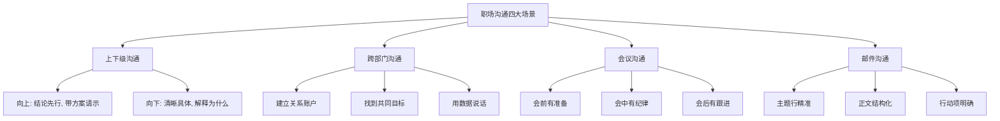
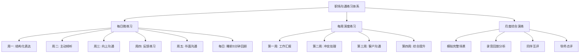
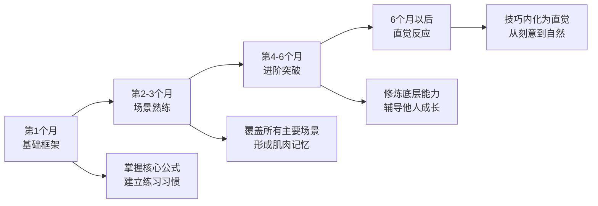

# 本章小结

## 一、核心理念回顾

第五章围绕"职场沟通"这一主题，从理论基础、核心技巧、实战案例、常见误区和练习方法五个维度进行了系统探讨。在进入总结之前，有必要先理解一个根本命题：**职场沟通与日常沟通的本质差异在哪里？**

日常沟通发生在情感联结的基础上，容错率高，表达不当容易获得谅解。职场沟通则发生在组织架构的框架之中，受到层级关系、部门利益、组织文化和职业规范的多重约束。一句不得体的话可能影响你在领导心目中的形象，一封措辞不当的邮件可能引发跨部门的误解，一次失败的工作汇报可能让你长期的努力付诸东流。

### 1.1 职场沟通的四大特征

理解这四大特征，是掌握所有后续技巧的前提。它们构成了职场沟通的"底层操作系统"——无论具体场景如何变化，这四条规则始终适用。

| 特征 | 含义 | 实际影响 |
|------|------|----------|
| **目标导向性** | 每次沟通都应推动工作进展，不是闲聊 | 沟通前明确目的，沟通后确认成果。如果你无法用一句话说清楚这次沟通的目标，说明你还没准备好开始沟通 |
| **层级敏感性** | 上下级、平级各有不同的策略和禁忌 | 对上沟通的核心是"降低决策成本"，对下沟通的核心是"降低执行成本"，平级沟通的核心是"降低协作成本" |
| **专业规范性** | 使用专业语言、遵循格式规范、尊重时间效率 | 职场中没有"随便说说"——口头承诺也是承诺，会议发言会被记录，邮件是法律证据 |
| **利益关联性** | 涉及多方利益，需识别诉求、寻求共赢 | 沟通前问自己"对方为什么要在乎我说的？"——找到对方的利益点，才能找到沟通的支点 |

### 1.2 四大沟通场景的核心策略

**场景一：上下级沟通。** 这是职场中最频繁、也最容易出问题的场景。向上沟通的核心原则是"结论先行、带方案请示"——领导需要的是决策依据，不是过程流水账。向下沟通的核心原则是"清晰具体、解释为什么"——下属不仅需要知道做什么，更需要理解为什么这样做，才能在执行中做出正确判断。

**场景二：跨部门沟通。** 跨部门协作的难点在于"没有命令权，只有影响力"。核心策略是：建立关系账户（日常积累信任，关键时刻才能"支取"）、找到共同目标（把"你们部门的事"变成"我们的项目"）、用数据说话（消除主观判断的争议）、尊重专业（不越界指挥，不外行指导内行）。

**场景三：会议沟通。** 会议是组织中最大的时间消耗之一。高效会议遵循"三阶段"原则：会前有准备（议题、材料、预期成果提前明确）、会中有纪律（控制时间、聚焦议题、记录决议）、会后有跟进（行动项、责任人、截止时间三要素缺一不可）。

**场景四：邮件沟通。** 职场邮件的核心是"让人在30秒内知道你要什么"。具体要求：主题行精准（包含关键信息和行动要求）、正文结构化（背景-问题-方案-请求）、行动项明确（谁、做什么、什么时候完成）、发送前检查（收件人、附件、语气、错别字）。

---

## 二、核心技巧总结

### 2.1 六大技巧速览

本章详细介绍了六大核心沟通技巧，每个技巧都有其适用场景、操作步骤和关键要点。以下是系统梳理：

| 技巧 | 核心模型 | 操作要点 | 适用场景 |
|------|----------|----------|----------|
| **工作汇报** | 金字塔法 | 结论先行→原因→细节→请求，30秒内给出核心信息 | 日报周报、项目进展、年终述职 |
| **请示领导** | 双方案法 | 问题→方案A→方案B→推荐，至少2个方案 | 资源申请、方向选择、风险汇报 |
| **批评下属** | SBI模型 | 情境(Situation)→行为(Behavior)→影响(Impact)，私下进行 | 绩效面谈、行为纠偏、质量问题 |
| **接受批评** | LEARN模型 | 倾听→共情→承认→回应→下一步 | 被上级批评、客户投诉、同事反馈 |
| **团队协作** | 透明主动法 | 透明共享、主动沟通、尊重差异、建设性冲突 | 项目协作、跨组配合、新人融入 |
| **客户沟通** | PREP法则 | 观点(Point)→原因(Reason)→例证(Example)→重申(Point) | 客户汇报、方案展示、投诉处理 |

### 2.2 公式速查表

以下公式是本章最重要的"工具箱"，建议保存到手机备忘录中，在重要沟通前快速查阅：

| 场景 | 公式 | 操作要点 |
|------|------|----------|
| 工作汇报 | 结论→原因→细节→请求 | 结论先行，30秒内给出核心信息 |
| 请示领导 | 问题→方案A→方案B→推荐 | 至少2个方案，明确推荐，说明紧迫性 |
| 批评下属 | S→B→I | 情境-行为-影响，私下进行，对事不对人 |
| 接受批评 | L→E→A→R→N | 倾听-共情-承认-回应-下一步，不辩解 |
| 客户沟通 | P→R→E→P | 观点-原因-例证-重申，客户导向 |
| 投诉处理 | L→A→S→T | 倾听-道歉-解决-感谢，先情绪后事实 |
| 拒绝请求 | 感谢→原因→替代方案 | 不直接说"不"，给替代选项 |
| 跨部门协作 | 建立关系→找共同点→数据支撑→尊重专业 | 先做朋友再谈合作 |

### 2.3 进阶能力：超越技巧的底层能力

六大技巧是"术"的层面，真正的职场沟通高手还需要修炼"道"的层面——即那些无法用单一公式概括，但贯穿所有沟通场景的底层能力：

- **情绪管理**：在高压环境下保持理性。杏仁核劫持（amygdala hijack）是沟通失控的生理根源——当情绪被触发时，大脑的理性中枢会被短路。应对策略是"6秒暂停法"：感到愤怒时，在内心默数6秒，等待前额叶皮层重新接管。
- **政治敏感度**：识别组织中的权力结构、隐性规则和利益博弈。这不是"搞政治"，而是"理解政治"——你不参与博弈，但必须理解博弈的规则，才能保护自己、推动工作。
- **跨文化意识**：在多元化的职场中，理解不同文化背景下的沟通差异。高语境文化（如中国、日本）依赖隐含信息和关系背景，低语境文化（如美国、德国）依赖明确的语言表达。
- **向上管理**：不是"拍马屁"，而是主动管理与上级的关系和信息流。核心是理解领导的工作压力和决策偏好，用领导需要的方式提供信息支持。

---

## 三、十大常见误区警示

### 3.1 误区清单

以下是职场沟通中最常见的十个误区，按"发生频率×危害程度"排序：

| 排名 | 误区 | 为什么危险 | 纠正方法 |
|------|------|-----------|----------|
| 1 | 只报喜不报忧 | 问题被掩盖后会指数级放大，最终爆发时领导会质问"为什么不早说" | 坏消息要第一时间上报，附带影响评估和应对方案 |
| 2 | 过度使用模糊语言 | "尽快""差不多""可能"——这些词让对方无法做出明确判断 | 用具体数字替代模糊描述："3天内"替代"尽快"，"95%完成"替代"差不多了" |
| 3 | 用邮件代替当面沟通 | 复杂问题和敏感话题在邮件中极易被误解，且缺乏即时反馈 | 判断标准：如果需要来回3封邮件才能说清楚，就应该打电话或面谈 |
| 4 | 公开批评他人 | 即使批评是对的，公开场合也会让对方感到羞辱，激发防御心理 | SBI模型+私下进行，批评的目的是改进，不是展示权力 |
| 5 | 过度道歉 | 频繁道歉会削弱你的专业形象，让人觉得你不够自信或能力不足 | 道歉一次就够，重点放在解决方案和改进措施上 |
| 6 | 只说不听 | 你以为你在表达，对方觉得你在"倾倒"——单向沟通是信任的杀手 | 用"3:7法则"：30%说，70%听，通过提问引导对方表达 |
| 7 | 忽视非语言信号 | 研究表明沟通中55%的信息通过肢体语言传递（Mehrabian法则） | 注意自己的眼神、姿势、语调，同时观察对方的非语言反馈 |
| 8 | 情绪化回应 | 愤怒时发出的邮件、说出的话，99%你事后会后悔 | "24小时法则"：情绪激动时不要回复，等24小时后再处理 |
| 9 | 不确认理解 | 你以为对方理解了，对方以为他理解了，但双方理解的可能完全不是一回事 | 复述确认："我确认一下，你的意思是……对吗？" |
| 10 | 忽视文化差异 | 同样的表达方式在不同文化背景下可能产生截然不同的效果 | 了解对方的文化背景，避免使用可能引起误解的表达 |

### 3.2 误区背后的认知偏差

为什么聪明人也会反复犯这些错误？认知心理学给出了三个根源：

- **确认偏误**：只看到支持自己观点的信息，忽略反面证据。表现为你觉得"我说得没问题啊"，但对方听到的完全是另一个意思。
- **透明度假象**：以为自己的意图对他人是透明的，不需要明确表达。实际上，你脑子里的想法，对方一个字都接收不到。
- **习惯惯性**：早期习得的沟通模式在压力下会自动激活。你在朋友间习惯的随意表达方式，会不自觉地被带入职场场景。

识别这些偏差的存在，是改变的第一步。你不需要消灭这些偏差——那是不可能的——但你需要在关键沟通前"主动检查"自己是否陷入了偏差陷阱。

---

## 四、案例启示录

### 4.1 八大案例的核心教训

本章的八个实战案例覆盖了职场中最典型的沟通场景，每个案例都包含具体的对话脚本、操作步骤和关键转折点。以下是每个案例最值得记住的一条教训：

| 案例 | 场景 | 核心教训 |
|------|------|----------|
| 案例一 | 季度销售数据汇报 | 数据本身不会说话，**解读和建议**才是汇报的价值——同样是120%的完成率，"超额完成"和"超出预期但存在结构性风险"的汇报效果天差地别 |
| 案例二 | 提出优化报销流程建议 | 好建议+坏方式=无效。用"痛点-方案-收益"框架包装你的建议，让领导看到**改变的理由**而不只是改变的内容 |
| 案例三 | 拒绝同事帮忙请求 | 直接拒绝说"这不是我的工作"虽然正确但极其有害。正确方式：感谢信任→说明处境→提供替代方案 |
| 案例四 | 与同事方案分歧 | 分歧不是冲突，是**优化方案的机会**。用"是的，而且……"替代"不对，但是……" |
| 案例五 | 绩效面谈（批评下属） | 批评前的准备比批评本身更重要——准备好具体事例、影响数据和改进方案，才能让批评成为**成长对话**而非**审判** |
| 案例六 | 跨部门推进紧急项目 | 跨部门推动力不来自职位，来自**关系账户**的余额。平时不存钱，急时取不出 |
| 案例七 | 首次拜访重要客户 | 第一次见面的目标不是成交，是**建立信任**。让客户觉得"这个人懂我"比"这个人很专业"更重要 |
| 案例八 | 向领导提出辞职 | 离职沟通是职场关系的最后一次投资。方式得体，你得到的是**一辈子的推荐人**；方式失当，你得到的是**行业黑名单** |

### 4.2 案例背后的共同模式

跨越所有案例，可以提炼出七条贯穿始终的原则：

1. **准备充分**：重要的沟通值得提前准备。临场发挥是高手的特权，而高手之所以能临场发挥，是因为他们已经在脑中"预演"过无数遍。
2. **尊重对方**：无论对方是上级、下属、同事还是客户，尊重是一切有效沟通的地基。尊重不是客气，是认真对待对方的观点和感受。
3. **数据说话**：用客观事实支撑你的观点。"我觉得这个方案更好"不如"这个方案在A/B测试中转化率高出23%"。
4. **换位思考**：理解对方的立场和需求。沟通前问自己"如果我是对方，我最关心什么？"
5. **方案导向**：带着解决方案去沟通，而不是只带问题。领导最讨厌听到的话是"出了个问题"，最喜欢听到的是"出了个问题，我建议这样处理"。
6. **保持专业**：控制情绪，保持职业素养。你可以在私下吐槽，但在正式沟通中，专业性是你的护城河。
7. **维护关系**：沟通的目的是解决问题、推动工作，同时维护良好的人际关系。赢了道理、输了关系，是最亏的买卖。

---

## 五、练习体系回顾

### 5.1 三层练习架构

本章提供了一套完整的练习体系，从日常微练习到专项深度训练，确保知识从"知道"到"做到"的转化：

### 5.2 练习的理论支撑

练习不是盲目的重复。有效的练习必须满足四个条件（基于Anders Ericsson的刻意练习理论）：

| 条件 | 含义 | 职场沟通中的体现 |
|------|------|------------------|
| 明确的目标 | 每次练习聚焦一个具体技能点 | "今天只练习结论先行"，而非模糊的"提升沟通能力" |
| 即时的反馈 | 练习后能获得准确评价 | 录音回放、同伴点评、观察对方的非语言反应 |
| 走出舒适区 | 练习内容略超出当前水平 | 如果你已习惯在5人小组发言，下一步是在10人会议上发言 |
| 持续的重复 | 同一技能反复练习直到自动化 | 连续两周每天练习结构化表达，直到不需要刻意思考 |

### 5.3 读者分层练习建议

不同基础的读者应该有不同的练习起点：

**入门级（沟通经验少、容易紧张）：**
- 第1-2周：只做每日微练习，重点是"开口说"和"结构化"
- 第3-4周：加入每周深度练习，从工作汇报开始
- 第2个月：开始练习向上沟通和反馈技巧
- 关键目标：建立沟通的自信心和基本框架

**进阶级（有一定经验、想突破瓶颈）：**
- 第1周：全面自测，找到最薄弱的环节
- 第2-4周：针对薄弱环节做专项突破
- 第2个月：开始练习高难度场景（批评下属、冲突处理、客户投诉）
- 关键目标：从"能用"到"好用"，从"不会出错"到"出彩"

**高手级（经验丰富、追求精进）：**
- 重点练习：情绪管理、政治敏感度、跨文化沟通
- 训练方式：角色扮演复杂场景、复盘自己的真实沟通记录、辅导他人
- 关键目标：从"技巧"到"直觉"，从"刻意运用"到"自然反应"

---

## 六、自我评估工具

### 6.1 职场沟通能力自测表

用以下量表评估自己在各个维度的水平（1=很弱，5=很强）。诚实评估是进步的起点——高估自己比低估自己更危险。

| 评估维度 | 自评(1-5) | 关键指标 |
|----------|-----------|----------|
| 结构化表达 | __ | 能否在30秒内说清一件事的核心信息 |
| 向上沟通 | __ | 领导是否经常需要追问你才能了解情况 |
| 向下沟通 | __ | 下属是否清楚理解你的指令和期望 |
| 跨部门协作 | __ | 是否经常因沟通问题导致跨部门项目延期 |
| 会议表现 | __ | 在会议中能否有效表达观点、推动决策 |
| 邮件质量 | __ | 发出的邮件是否经常需要补充说明 |
| 冲突处理 | __ | 遇到分歧时能否建设性地解决问题 |
| 情绪管理 | __ | 在压力下能否保持理性和专业 |
| 倾听能力 | __ | 是否真正理解了对方的意思，而非只等对方说完 |
| 非语言沟通 | __ | 是否注意并正确解读肢体语言信号 |

### 6.2 计分与行动指南

- **40-50分**：沟通能力优秀。重点修炼进阶能力（政治敏感度、跨文化沟通），并开始辅导他人。
- **30-39分**：沟通能力良好。针对短板做专项突破，重点关注得分最低的2-3个维度。
- **20-29分**：沟通能力有提升空间。建议系统学习本章内容，从基础练习开始，每周重点突破一个维度。
- **10-19分**：沟通能力需要重点提升。不要急于求成，先从每日微练习入手，建立基本的沟通习惯和信心。

无论你当前处于哪个水平，记住一个事实：沟通能力排名前25%的员工，晋升概率是后25%的2.5倍（Harvard Business Review, 2019）。这项投资的回报率，远高于你花同样时间提升任何一项专业技能。

---

## 七、关键公式速查卡

以下是本章所有核心公式的精简速查版本，建议截图保存到手机，在重要沟通前快速回顾：

┌─────────────────────────────────────────────────────────┐
│              职场沟通核心公式速查卡                        │
├─────────────────────────────────────────────────────────┤
│ 工作汇报：结论 → 原因 → 细节 → 请求                      │
│ 请示领导：问题 → 方案A → 方案B → 推荐                     │
│ 批评下属：情境(S) → 行为(B) → 影响(I)                     │
│ 接受批评：倾听(L) → 共情(E) → 承认(A) → 回应(R) → 下一步(N) │
│ 客户沟通：观点(P) → 原因(R) → 例证(E) → 重申(P)           │
│ 投诉处理：倾听(L) → 道歉(A) → 解决(S) → 感谢(T)           │
│ 拒绝请求：感谢 → 原因 → 替代方案                          │
│ 跨部门协作：建关系 → 找共同点 → 数据支撑 → 尊重专业        │
└─────────────────────────────────────────────────────────┘

---

## 八、从本章到下一章

### 8.1 一句话记住本章

> **职场沟通的本质是：用对方能接受的方式，传递对方需要的信息，推动工作目标的达成。**

这句话包含了三个关键要素：
- **"对方能接受的方式"**——形式（How）：选择合适的渠道、语气、时机
- **"对方需要的信息"**——内容（What）：聚焦对方关心的问题，而非你想说的内容
- **"推动工作目标"**——目的（Why）：沟通不是目的，推动工作才是

### 8.2 下一步行动建议

**本周就能做的三件事：**

1. **录音回放**：在一次重要沟通前告知对方你在录音（用于自我提升），沟通后回放，用本章的公式和原则逐句审视自己的表现。你会发现大量"如果重来我会说得更好"的地方——这就是进步的空间。

2. **公式实战**：选择本章一个最适合你当前场景的公式（比如工作汇报用金字塔法，向上沟通用双方案法），在本周的3次真实沟通中有意识地应用。记录每次的效果和感受。

3. **自测表评估**：认真完成上面的自测表，找到你最薄弱的2个维度。这两个维度就是你接下来一个月的练习重点。不要试图同时提升所有维度——聚焦才能突破。

### 8.3 长期成长路径

沟通能力的提升不是线性的——前两周你可能感觉不到明显变化，但坚持一个月后，你会突然发现自己在某些场景中变得从容了。这是因为程序性知识（"知道怎么做"）的习得需要时间，它不像陈述性知识（"知道什么"）那样可以即时获取。

**最后一句话：** 无论你是职场新人还是资深管理者，无论你是技术人员还是业务骨干，掌握职场沟通的技巧都将为你的职业发展带来显著的帮助。记住，沟通能力不是天赋，而是可以通过系统学习和持续练习不断提升的技能。从今天开始，在每一次职场沟通中有意识地运用本章所学，你会发现：好的沟通不仅能推动工作，还能赢得信任、建立关系、打开职业发展的新空间。
