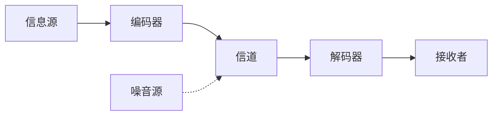
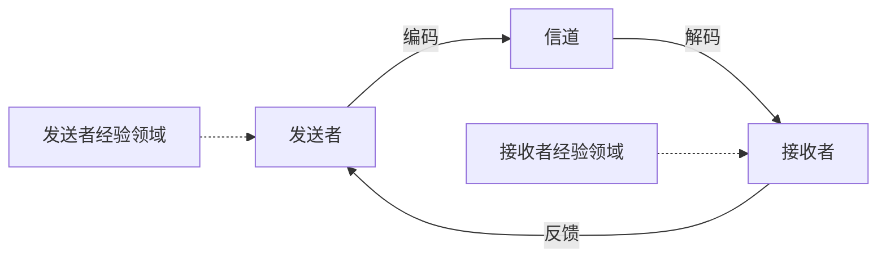
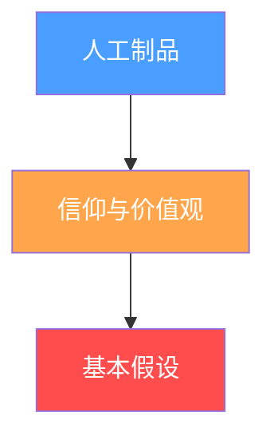
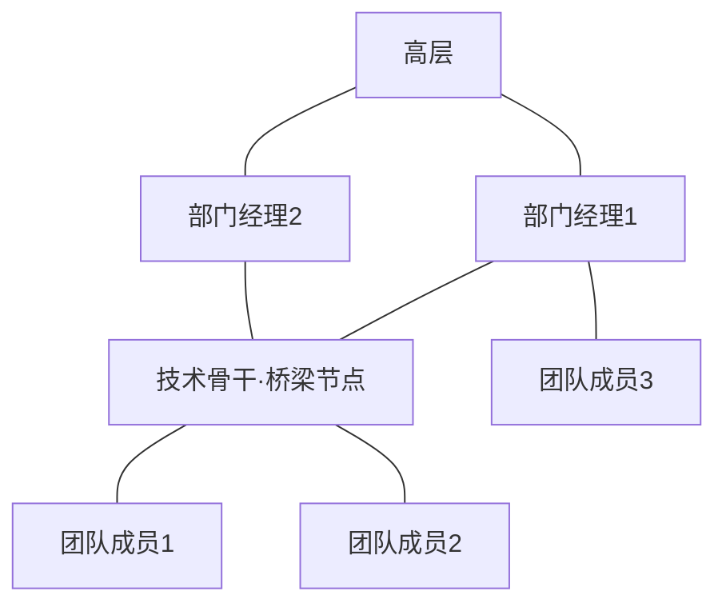
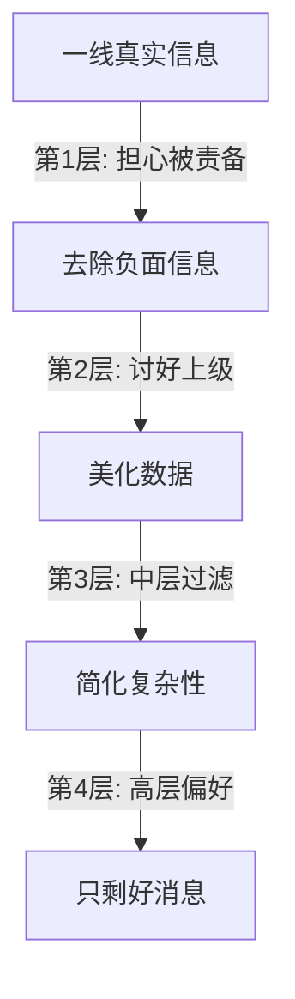
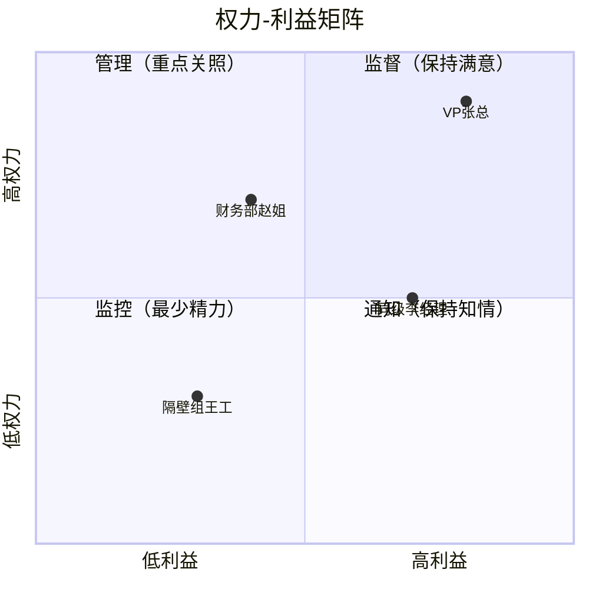

# 职场沟通：深度拓展

## 引言

前几章我们讨论了职场沟通的基本原则和常见场景。本章将深入七个专业领域，把职场沟通从"技巧层"提升到"系统层"——理解组织沟通的底层理论、权力结构如何塑造信息流动、远程协作的科学方法、跨部门协同的工程化手段，以及性别差异和新人适应的深层机制。

每个板块都遵循"道法术器"的逻辑：先讲理论根基（为什么），再给方法论（怎么做），最后提供可直接使用的工具和模板（用什么）。

---

## 一、组织沟通理论

### 1.1 经典沟通模型演进

理解沟通模型不是学术游戏——它决定了你用什么方式传递信息，以及你如何诊断沟通失败的原因。

**线性模型：单向管道思维**

1949年，香农和韦弗（Shannon & Weaver）提出了最早的沟通数学模型：



这个模型的价值在于引入了"噪音"概念——任何干扰信息准确传递的因素都是噪音。在职场中，噪音可以是：
- **物理噪音**：会议室太吵、网络不稳定
- **语义噪音**：专业术语障碍、文化差异导致的理解偏差
- **心理噪音**：偏见、情绪、先入为主的判断
- **组织噪音**：信息经过多层传递后的失真（"传话效应"）

**局限性**：线性模型把沟通看成单向传递，忽略了反馈。在职场中，如果你发了一封邮件但不知道对方是否理解，那就是典型的线性思维陷阱。

**互动模型：加入反馈回路**

施拉姆（Schramm）在香农模型基础上加入了反馈机制和"经验领域"概念：



"经验领域"这个概念在职场中极为重要：你和CEO说话，与和同级同事说话，编码方式完全不同。双方的经验领域重叠越多，沟通效率越高。这就是为什么"共同语言"——无论是技术语言还是业务语言——对团队效率如此关键。

**交易模型：真正的双向同时**

交易模型是目前学术界公认的最准确描述：

| 维度 | 线性模型 | 互动模型 | 交易模型 |
|------|----------|----------|----------|
| 方向 | 单向 | 轮流双向 | 同时双向 |
| 角色 | 固定发送/接收 | 角色互换 | 双方同时发送和接收 |
| 噪音 | 外部干扰 | 外部干扰 | 内外部干扰均考虑 |
| 情境 | 忽略 | 部分考虑 | 强调社会文化情境 |
| 意义 | 在信息中 | 在编码解码中 | 双方共同建构 |
| 职场对应 | 群发通知 | 一对一会谈 | 高效团队实时协作 |

**实践启示**：当你发现团队沟通效率低时，先问自己——我们用的是哪种模型？很多管理者还在用线性思维（发通知→期望执行），而高效团队已经在用交易模型（实时共建理解）。

### 1.2 组织意义建构理论

卡尔·韦克（Karl Weick）的理论彻底改变了我们理解组织沟通的方式。他的核心观点是：**组织不是预先存在的实体，而是通过沟通不断被"建构"出来的**。

**意义建构的七个属性**

韦克提出，组织中的意义建构遵循七个特征。这不是纯理论——每个属性都对应着职场中的具体行为模式：

| 属性 | 含义 | 职场实例 |
|------|------|----------|
| 身份建构 | 通过沟通定义"我们是谁" | 公司使命宣言、团队口号、新人介绍仪式 |
| 回顾性 | 只能理解已发生的事 | 项目复盘、季度总结、事故分析 |
| 环境线索 | 从环境中提取信号 | 观察领导表情判断态度、从邮件语气推断紧迫性 |
| 可相信性 | 目标是创建"可信故事" | 裁员时的官方说辞、项目延期的解释 |
| 持续性 | 永不停止的过程 | 每天的晨会、持续的企业文化传播 |
| 社会性 | 发生在互动中 | 团队讨论、走廊聊天、会议争论 |
| 行动导向 | 通过行动推进 | 先试点再推广、通过小胜利建立信心 |

**关键案例**：2010年BP墨西哥湾漏油事件中，BP CEO托尼·海沃德说出"我希望找回我的生活"这句话，瞬间摧毁了BP试图建构的"负责任企业"叙事。这就是意义建构的脆弱性——一句话可以瓦解数年品牌建设。

**组织信息处理三种策略**

当组织面对模糊信息时，韦克描述了三种回应：

1. **信息搜寻**：主动寻找更多信息。例如，市场份额突然下降，营销团队立即进行客户调研。
2. **信息选择**：从已有信息中筛选相关部分。例如，面对海量市场报告，只关注与自身产品线相关的数据。
3. **信息创造**：通过沟通创造新意义。例如，公司业绩下滑，管理层将其框架为"战略调整期"而非"危机"。

**实操工具：意义建构诊断表**

当你所在的组织出现沟通混乱时，用这个框架诊断：

1. 身份问题：我们现在对"我们是谁"有共识吗？（无共识→先建立共识）
2. 线索问题：大家从环境中提取的信号一致吗？（不一致→统一信息源）
3. 故事问题：目前流传的"故事"是什么？（负面故事→需要新的叙事框架）
4. 行动问题：我们在通过行动推进理解吗？（光说不做→意义无法内化）

### 1.3 组织文化与沟通

埃德加·沙因（Edgar Schein）的组织文化三层次模型是理解"为什么在这个公司要这样说话"的基础框架：



**三层逐一拆解：**

**人工制品（看得见但看不懂）**：办公室布局、着装规范、会议时长、邮件格式、称呼方式。例如，谷歌的开放式办公和Netflix的"无休假政策"都是人工制品。你入职一家新公司，最先感知的就是这一层——但仅凭人工制品无法理解背后的文化逻辑。

**信仰与价值观（说得出口的规则）**：公司官网上的价值观、领导讲话中反复强调的原则、绩效考核中的评价维度。例如，亚马逊的"领导力准则"（Leadership Principles）就是典型的信仰与价值观层。这一层可以通过沟通直接传播，但要注意——说的和做的可能不一致。

**基本假设（说不出来的规则）**：这是最深层，也是最强大的。例如：
- "在这里，加班到深夜是忠诚的表现"（即使公司说"我们重视工作生活平衡"）
- "犯错会被记住很久"（即使公司说"我们鼓励试错"）
- "真正重要的决定在会议室外面做出"（即使公司说"我们推崇透明决策"）

**实操建议**：作为新人，花前两周只观察不判断。记录你观察到的人工制品，推断背后的价值观，再验证基本假设。这个过程本身就是意义建构。

**组织叙事分析**

组织中的故事（创始故事、危机故事、英雄故事、失败故事）承载着最核心的文化密码。分析组织叙事的四个维度：

| 维度 | 问题 | 示例 |
|------|------|------|
| 主题 | 反复出现什么主题？ | "我们从车库里起家"→强调创业精神 |
| 英雄 | 谁被推崇为英雄？ | 推崇技术大牛→技术导向文化 |
| 反派 | 谁是反派？ | "那个不听劝的前管理层"→变革叙事 |
| 教训 | 故事的教训是什么？ | "所以我们再也不会那样做了"→价值观锚定 |

### 1.4 批判性视角：权力如何塑造沟通

批判性组织沟通理论揭示了一个常被忽视的事实：**组织沟通从来不是中立的信息传递，它始终嵌入在权力关系中**。

**四个关键洞察**：

1. **渠道即权力**：谁控制沟通渠道（邮件系统、会议安排权、信息发布权），谁就控制了信息流动。这就是为什么很多公司争夺"直接向CEO汇报"的渠道。

2. **话语即权力**：管理层通过定义"正确"的表达方式来框定讨论边界。例如，把裁员说成"组织优化"，把加班说成"奋斗者文化"——这些话语选择本身就是权力运作。

3. **沉默即信息**：组织中没有被讨论的话题往往比被讨论的话题更重要。如果公司从不讨论薪资透明度，这个沉默本身就是一个强烈的文化信号。

4. **霸权的形成**：当某种组织意识形态被视为"常识"时（比如"996是福报"），它就不再被当作一种观点，而是被当作"现实"——这就是葛兰西所说的霸权。

**实践启示**：作为职场人，培养"批判性沟通意识"不是要你对抗组织，而是要你理解沟通背后的权力结构，从而做出更明智的沟通选择。当你听到"大家都这么认为"时，问一问：谁是"大家"？谁有发言权？谁的声音被忽略了？

---

## 二、职场沟通中的权力动态

### 2.1 权力的六种来源

弗伦奇和雷文（French & Raven）的经典权力来源理论在职场中依然适用，但需要扩展到六个维度：

| 权力类型 | 来源 | 有效期 | 职场示例 |
|----------|------|--------|----------|
| 法定权力 | 职位头衔 | 在职期间 | 总监审批预算 |
| 奖赏权力 | 给好处的能力 | 持续有效 | 绩效评定、奖金分配 |
| 强制权力 | 惩罚能力 | 持续但有代价 | 绩效警告、调岗 |
| 专家权力 | 知识和技能 | 长期有效 | 技术大牛一票否决方案 |
| 参照权力 | 人格魅力 | 长期有效 | 团队核心人物的非正式影响力 |
| 信息权力 | 控制信息流 | 情境性 | 知道裁员名单的HR |

**关键洞察**：在现代扁平化组织中，法定权力的影响力在下降，而专家权力和信息权力在上升。一个高级工程师可能比一个中层经理更有话语权——这取决于组织的权力结构。

**权力的网络视角**

除了个人权力来源，还有"网络权力"——你在组织网络中的位置决定了你的影响力：



上图中，D（技术骨干）虽然级别不高，但作为"桥梁节点"连接两个部门，拥有巨大的信息权力和网络权力。在职场中识别这类关键节点，无论是为了合作还是推动项目，都至关重要。

### 2.2 权力距离与沟通风格

霍夫斯泰德的"权力距离"维度直接影响职场沟通的方方面面：

**高权力距离文化（中国得分80，美国得分40）中的沟通特征：**

| 场景 | 高权力距离表现 | 低权力距离表现 |
|------|----------------|----------------|
| 开会发言 | 等领导先说，或只在被点名时说 | 随时可以插话讨论 |
| 提出异议 | 私下沟通或用暗示 | 当场直接表达 |
| 邮件称呼 | 职位头衔（王总、李处） | 直呼其名（John、Lisa） |
| 决策方式 | 上级决定，下级执行 | 集体讨论，共识决策 |
| 反馈方向 | 主要是自上而下 | 双向甚至自下而上 |
| 犯错后果 | 可能影响长期评价 | 对事不对人 |

**中国职场的微妙之处**：

中国职场的权力距离正在发生变化。互联网公司和外企的文化正在降低权力距离——扁平化管理、直接称呼英文名、鼓励"挑战"上级。但传统企业和体制内机构仍然保持较高权力距离。关键是**识别你所在组织的权力距离水平**，然后调整你的沟通策略。

**实操：如何判断组织的权力距离？**

观察以下信号：
- 会议室座位是否有固定等级安排？（有→高权力距离）
- 新人是否敢于在会议上发言？（不敢→高权力距离）
- 领导的错误是否有人指出？（没有→高权力距离）
- 信息是否在层级间自由流动？（不自由→高权力距离）
- 公司是否有"越级汇报"的明确规定？（有禁止→高权力距离）

### 2.3 向上沟通：把坏消息变成信任

向上沟通是职场中最被低估的技能。研究表明，**信息在向上传递过程中会被系统性地过滤和美化**——这就是"报喜不报忧"现象的组织学根源。

**信息过滤的四层漏斗**



每一层都在削减信息的真实度。等到CEO看到的报告，可能和一线情况已经完全脱节。

**向上沟通的五种有效策略**

**策略一：SCQA框架汇报法**

| 要素 | 含义 | 示例 |
|------|------|------|
| Situation（情境） | 背景是什么 | "本季度我们新增了3个大客户" |
| Complication（冲突） | 出了什么问题 | "但交付团队的产能已经达到极限" |
| Question（问题） | 需要解决什么 | "如何在不增加人手的情况下提升交付能力？" |
| Answer（答案） | 你的建议 | "建议引入自动化测试工具，预计可节省30%人力" |

**策略二：坏消息三步法**

1. **事实先行**："我们的项目延期了两周"（不是"出了一些状况"）
2. **原因分析**："主要原因是第三方API响应时间超出预期"（不是"因为各种原因"）
3. **解决方案**："我已经和供应商协商了优先通道，预计一周内恢复"（不是"我会尽快处理"）

**策略三：定期主动同步**

不要等出了问题才找领导。建立定期同步机制：
- 每周一封简短的进展邮件（3-5句话）
- 每月一次深度汇报（15-30分钟）
- 重大节点的即时通报

**策略四：管理领导的预期**

在项目初期就设定合理预期，比事后解释要容易得多：
- 列出风险清单并提前沟通
- 给出乐观、正常、悲观三种时间估计
- 在预期范围内汇报进展（"按计划推进"比"一切顺利"更专业）

**策略五：用领导的语言说话**

每个领导都有偏好的沟通风格：
- **数据驱动型**：用数字和图表
- **叙事型**：用故事和案例
- **行动导向型**：直接说下一步做什么
- **关系型**：先建立情感连接再谈事情

观察你的领导属于哪种类型，调整你的沟通方式。

### 2.4 话语权与框架控制

话语权不仅是"说话的机会"，更是"定义讨论框架的能力"。

**框架控制的三个层级：**

1. **议题设置**：决定什么被讨论。例如，在季度review中，把讨论框架从"我们哪里做得不好"转变为"我们的增长机会在哪里"。

2. **定义权**：决定关键术语的含义。例如，把"裁员"定义为"组织优化"，把"加班"定义为"弹性工作"。

3. **评价标准**：决定什么是"好"的。例如，在技术选型讨论中，把评价标准从"功能全面"转向"运维简单"。

**挑战话语权的策略：**

- **用数据说话**：数据是最有力的框架武器。当对方用定性描述框定讨论时，用数据重新框定。
- **重新定义问题**：不要在对方的框架内争论，而是提出新的框架。
- **建立联盟**：一个人挑战话语权很难，但一群人共同提出替代框架就容易得多。
- **选择时机**：在组织危机或转型期，话语权更容易被重新分配。

---

## 三、远程团队沟通策略

### 3.1 远程沟通的信息损失模型

远程沟通最大的挑战不是技术，而是**信息带宽的急剧缩减**：

| 沟通方式 | 信息带宽 | 传递内容 |
|----------|----------|----------|
| 面对面 | 100% | 语言+语调+表情+肢体+环境+触觉 |
| 视频会议 | ~60% | 语言+语调+部分表情（受限于画面） |
| 电话 | ~35% | 语言+语调 |
| 即时消息 | ~15% | 语言（无语调、无表情） |
| 邮件 | ~10% | 语言（无语调、无表情、异步延迟） |

这意味着，**远程沟通中85%以上的信息在传递过程中丢失了**。这就是为什么文字消息容易被误解，为什么邮件里的一句话可以引发整个团队的恐慌。

**实操：减少信息损失的五种方法**

1. **升级信道**：重要/敏感/复杂的信息，用更高带宽的方式传递。一条文字消息说不清楚的事，打3分钟电话就解决了。
2. **过度上下文**：在异步消息中提供比你认为必要的更多的背景信息。
3. **情绪标记**：在文字消息中明确标注情绪（"这个反馈请不要理解为批评，而是建设性建议"）。
4. **确认理解**：关键信息发送后，请对方复述确认。
5. **避免讽刺和幽默**：在低带宽信道中，讽刺几乎100%会被误解。

### 3.2 沟通规范的工程化设计

远程团队不能靠默契，必须靠制度。以下是经过验证的远程沟通规范模板：

**渠道选择矩阵**

| 信息类型 | 紧急程度 | 推荐渠道 | 期望响应时间 |
|----------|----------|----------|------------|
| 生产事故 | 紧急 | 电话+群消息 | 5分钟内 |
| 工作阻塞 | 高 | 即时消息@指定人 | 30分钟内 |
| 一般协作 | 中 | 即时消息/项目管理工具 | 2小时内 |
| 信息同步 | 低 | 邮件/文档 | 24小时内 |
| 知识沉淀 | 非紧急 | 文档/Wiki | 按计划更新 |

**异步沟通的MINT原则**

远程异步消息应包含四个要素：

- **M - Message**：核心信息是什么
- **I - Impact**：为什么重要/对谁有影响
- **N - Next step**：需要对方做什么
- **T - Timeline**：期望什么时候完成

**模板示例**：
【消息】支付系统在高并发时出现超时
【影响】影响约5%的用户下单，每小时损失约2万元
【下一步】需要排查数据库连接池配置
【时间】今天下午3点前给出初步分析

### 3.3 远程会议的科学管理

远程会议是远程团队最大的时间黑洞。以下是经过实践验证的会议管理框架：

**会议前（Before）**
- 提前24小时发送议程（精确到每个议题的时间分配）
- 明确每个议题的类型：信息同步 / 讨论决策 / 头脑风暴
- 预读材料提前发送，会议中不再朗读

**会议中（During）**
- 前5分钟：快速同步（每人30秒进展）
- 中间时间：讨论决策（按议程推进）
- 最后5分钟：行动项确认（谁、做什么、什么时候完成）

**会议后（After）**
- 30分钟内发送会议纪要
- 纪要格式：决策项 + 行动项（负责人+截止日期）
- 行动项录入项目管理工具

**会议效率检查清单**

□ 这个会议能否用一封邮件/一个文档替代？
□ 每个参会者都有必要参加吗？（只邀请决策者和执行者）
□ 会议时长是否控制在25或50分钟？（留5-10分钟缓冲）
□ 是否有人负责计时和控场？
□ 是否有明确的产出（决策/行动项）？

### 3.4 虚拟团队信任建设

**快速信任（Swift Trust）的构建机制**

远程团队的信任不能靠时间积累，必须靠制度建设。Deborah Meyerson等人提出的"快速信任"理论指出，虚拟团队的信任建立在以下基础上：

| 信任基础 | 具体行为 | 频率 |
|----------|----------|------|
| 可靠性 | 按时交付、遵守承诺 | 每次承诺 |
| 能力展示 | 专业问题的高质量解答 | 持续 |
| 透明度 | 主动分享进展和困难 | 每日/每周 |
| 社交连接 | 非工作话题的交流 | 每周 |
| 一致性 | 言行一致 | 持续 |

**实操：远程信任建设活动清单**

1. **每日站会**（15分钟）：每人回答"昨天完成了什么、今天计划做什么、有什么阻塞"
2. **虚拟咖啡时间**（每周2次，每次15分钟）：随机配对两人进行非工作聊天
3. **周五分享会**（每周30分钟）：一人分享工作之外的兴趣或技能
4. **季度线下聚会**（如果可能）：面对面的时间对信任建设有指数级效果
5. **公开感谢文化**：在团队频道中公开感谢帮助过你的同事

### 3.5 跨时区沟通的工程化方案

**重叠时间计算**

假设你的团队分布在三个时区：

| 成员 | 时区 | 工作时间（本地） | UTC |
|------|------|-----------------|-----|
| 小王 | UTC+8（北京） | 9:00-18:00 | 01:00-10:00 |
| John | UTC-5（纽约） | 9:00-18:00 | 14:00-23:00 |
| Priya | UTC+5:30（印度） | 9:00-18:00 | 03:30-12:30 |

重叠窗口：
- 北京时间17:00-18:00 = 纽约时间4:00-5:00 = 印度时间14:30-15:30
- 只有1小时重叠！

**解决方案**：
- 将关键同步会议安排在唯一的重叠窗口
- 其他沟通全部异步化
- 轮换会议时间，不要总让同一时区的人在凌晨开会
- 使用世界时钟工具（如World Time Buddy）可视化各时区

---

## 四、职场政治与沟通

### 4.1 职场政治的本质

职场政治不是贬义词。**它是组织中通过非正式影响力实现目标的行为**。只要组织存在，政治就存在。回避政治的人，往往是在放弃自己的影响力。

**职场政治的光谱模型**

建设性政治 ◄──────────────────────► 破坏性政治
│                                      │
├─ 建立联盟推动变革                    ├─ 背后中伤
├─ 争取资源支持团队                    ├─ 抢功推责
├─ 影响决策方向                        ├─ 排斥异己
└─ 保护团队利益                        └─ 故意设障

关键是区分建设性政治和破坏性政治，并学会运用前者、防御后者。

### 4.2 利益相关者分析的实操框架

在推动任何重要事项之前，先做利益相关者分析：

**权力-利益矩阵**



**四象限策略**：

| 象限 | 特征 | 沟通策略 |
|------|------|----------|
| 高权力+高利益 | 关键决策者 | 重点关照：一对一沟通、定期汇报、邀请参与决策 |
| 高权力+低利益 | 高层领导 | 保持满意：关键节点汇报、不给他们惊喜 |
| 低权力+高利益 | 受影响的执行者 | 保持知情：及时通知、听取反馈、争取支持 |
| 低权力+低利益 | 相关但不关键 | 监控：最低限度信息同步 |

### 4.3 联盟建设的沟通策略

联盟不是搞小团体，而是找到共同目标的人，协调行动以增加影响力。

**联盟建设五步法**：

1. **识别共同利益**：找到与你目标一致的人。问自己："谁也想推动这件事？谁会从这件事中受益？"
2. **建立互惠关系**：先提供价值，再寻求支持。帮助别人解决一个问题，比直接请求支持有效10倍。
3. **统一信息口径**：联盟成员在关键议题上使用一致的表达框架。这不是"串供"，而是确保信息一致。
4. **协调行动时机**：在正确的场合、正确的时间共同发声。一个提议在会议中被一个人提出可能被忽略，但被三个人同时附议就会被重视。
5. **维护联盟信任**：不要在背后议论联盟成员，不要单方面行动而不同步。

### 4.4 向上管理的具体技巧

向上管理不是"拍马屁"，而是**让你和你的上级都更成功**的沟通策略。

**了解你的上级：诊断清单**

□ 他的核心KPI是什么？（你的工作如何帮他完成KPI？）
□ 他面临的最大压力来自哪里？（他的上级？其他部门？）
□ 他偏好什么沟通方式？（邮件/面谈/消息/电话）
□ 他做决策的方式是什么？（数据驱动/直觉/需要多人意见）
□ 他一天中什么时候状态最好？（早上/下午/晚上）
□ 他的管理风格是什么？（微观管理/授权/混合）

**向上管理的四个原则**：

1. **别给惊喜**：坏消息要早说、直说、带方案说。上级最怕的不是坏消息，而是最后一刻才知道坏消息。
2. **管理期望**：在承诺时留余地，在交付时超出预期。承诺"两周完成，可能需要三周"，然后三周交付，比承诺"一周"然后延期好得多。
3. **帮他省时间**：汇报时用"结论-原因-建议"的顺序，而不是"过程-过程-过程-结论"。
4. **成为可靠的信息源**：确保你提供的信息准确、及时、完整。一旦你成为领导信任的信息渠道，你的影响力将大幅增加。

### 4.5 应对职场政治攻击

**识别七种常见政治攻击手段**

| 手段 | 表现 | 应对 |
|------|------|------|
| 背后中伤 | 散布对你不利的信息 | 建立广泛正面关系网，让谣言不攻自破 |
| 抢功 | 把你的成果说成他的 | 及时用邮件/文档记录贡献，抄送相关人 |
| 推责 | 把错误推到你身上 | 重要决策保持书面记录，邮件确认关键共识 |
| 边缘化 | 把你排除在重要会议之外 | 主动参与、建立跨部门连接 |
| 信息封锁 | 不分享你需要的信息 | 建立多源信息渠道，不依赖单一信息源 |
| 设障 | 故意给你制造困难 | 提前识别风险，准备好备选方案 |
| 分化 | 离间你和同事的关系 | 与核心同事保持直接沟通，不听信传话 |

**核心防御策略**：

1. **记录一切**：重要沟通用邮件确认，会议有纪要，决策有记录。
2. **建立声誉**：长期的正面声誉是最好的防御。当所有人都知道你靠谱时，中伤的效果会大打折扣。
3. **扩大网络**：不要只依赖一个圈子。广泛的职业网络让你在政治攻击中有更多支持。
4. **保持冷静**：政治攻击的目的是让你失控。你越冷静、越专业，攻击者越被动。
5. **知道底线**：如果遭遇系统性的职场霸凌或歧视，不要独自承受——寻求HR、法律或外部支持。

### 4.6 道德边界

在运用职场政治时，始终问自己三个问题：
1. **如果这个行为被公开，我是否能坦然面对？**
2. **这个行为是否伤害了无辜的人？**
3. **我是在创造价值还是在零和博弈？**

如果答案让你不舒服，停下来重新考虑。建设性的政治行为应该是：争取资源让团队做得更好、影响决策让方向更正确、建立联盟推动有价值的变革。

---

## 五、跨部门沟通的系统方法

### 5.1 跨部门沟通的深层障碍

跨部门沟通的障碍不仅仅是"大家在不同办公室"这么简单。深层障碍来自三个维度：

**结构障碍**：不同部门有不同的KPI，这些KPI可能是冲突的。例如，销售部门的KPI是"签单量"，这可能导致他们承诺过多的功能给客户；而研发部门的KPI是"按时交付"，这要求他们拒绝需求变更。两个部门的KPI冲突直接导致沟通冲突。

**认知障碍**：每个部门都有自己的"专业语言"和思维模式。产品说"用户体验"，工程说"技术债"，销售说"客户痛点"，财务说"投入产出比"——这些术语背后是完全不同的认知框架。

**情感障碍**：部门间的积怨和刻板印象。"产品总是改需求"、"研发总是说做不了"、"销售总是乱承诺"——这些标签一旦形成，就会在每次沟通中自动激活负面预期。

### 5.2 RACI矩阵：明确角色与责任

RACI矩阵是跨部门协作中最实用的工具之一：

| 角色 | 含义 | 关键行为 |
|------|------|----------|
| R (Responsible) | 负责执行 | 实际干活的人 |
| A (Accountable) | 最终负责 | 做决策的人（每个任务只能有一个A） |
| C (Consulted) | 需要咨询 | 执行前需要征求意见的人 |
| I (Informed) | 需要通知 | 执行后需要知道结果的人 |

**示例：新产品上线的RACI矩阵**

| 任务 | 产品部 | 工程部 | 设计部 | 市场部 | 销售部 |
|------|--------|--------|--------|--------|--------|
| 需求定义 | A/R | C | C | I | I |
| 技术方案 | C | A/R | I | I | I |
| UI/UX设计 | C | C | A/R | I | I |
| 代码开发 | I | A/R | C | I | I |
| 测试验收 | A | R | I | I | I |
| 上线发布 | A | R | I | C | I |
| 市场推广 | C | I | I | A/R | C |
| 客户沟通 | I | I | I | C | A/R |

### 5.3 跨部门会议的高效运行

**跨部门会议的三种类型**

| 类型 | 频率 | 参与者 | 目的 | 时长 |
|------|------|--------|------|------|
| 同步站会 | 每日/每周 | 各部门接口人 | 快速同步进展和阻塞 | 15分钟 |
| 协调会 | 每两周 | 各部门负责人 | 议题讨论和决策 | 60分钟 |
| 战略对齐 | 每月/每季度 | 高层+各部门负责人 | 方向对齐和资源分配 | 90分钟 |

**跨部门会议的六个规则**：

1. **议题预审**：会议议题提前48小时发送，参会者提前准备意见
2. **决策前置**：尽量在会前通过一对一沟通达成初步共识，会议只确认决策
3. **记录责任**：每个议题的决策和行动项必须有明确的责任人和截止日期
4. **避免"部门代表思维"**：参会者不是来代表部门利益谈判的，而是来解决问题的
5. **建设性冲突**：鼓励不同观点的碰撞，但聚焦问题而非人身
6. **会后跟进**：会议纪要24小时内发送，行动项录入共享看板

### 5.4 跨部门冲突解决框架

**冲突升级路径**


**每一步的具体做法**：

**第一步：直接沟通**
- 找到对方部门的具体执行人，用"我们共同面对的问题"框架讨论
- 不要一开始就上升到"你们部门"
- 用事实和数据说话，不用感受和判断

**第二步：接口人协调**
- 如果直接沟通未果，请各自部门的接口人介入
- 接口人带着双方的方案和约束条件进行协调
- 寻找双方都能接受的折中方案

**第三步：部门负责人介入**
- 准备好完整的问题描述、已尝试的方案、剩余选项
- 让负责人在信息充分的基础上做决策

**第四步：高层裁决**
- 这是最后手段。频繁需要高层裁决说明协作流程有根本性问题

### 5.5 案例：产品上线的跨部门协作流程

以一个SaaS产品的新功能上线为例，展示跨部门协作的完整流程：

**阶段一：需求对齐（第1-2周）**
- 产品部完成需求文档，附带用户故事和验收标准
- 工程部评估技术方案和工时
- 设计部评估设计工作量
- 市场部评估推广资源需求
- 各部门接口人在协调会上确认排期

**阶段二：并行执行（第3-6周）**
- 工程部和设计部并行开发
- 产品部每周同步进度，处理需求变更
- 市场部准备推广材料
- 每日站会同步各部门进展

**阶段三：集成测试（第7周）**
- 工程部完成功能开发
- 产品部验收功能
- 设计部验收UI实现
- 市场部确认推广材料与实际功能一致

**阶段四：上线发布（第8周）**
- 工程部执行上线
- 产品部监控用户反馈
- 市场部发布推广
- 销售部同步客户沟通

**关键成功因素**：
- 共享的项目看板（如Jira、飞书项目）
- 每周固定的跨部门同步会
- 清晰的RACI矩阵
- 提前定义的上线标准（Done的定义）

---

## 六、职场沟通中的性别差异

### 6.1 研究发现的系统性差异

性别沟通差异的研究（Deborah Tannen, Judith Butler等学者的成果）揭示了一些有趣的模式。需要注意的是，**这些是统计趋势，不是个体特征**——任何个体都可能不符合这些趋势。

**语言使用的性别差异**

| 维度 | 研究发现 | 职场影响 |
|------|----------|----------|
| 道歉频率 | 女性道歉频率高于男性 | 女性可能被认为"不够自信" |
| 自我推销 | 男性更倾向于强调成就 | 女性的贡献可能被低估 |
| 提问方式 | 女性更倾向于通过提问参与 | 可能被误解为"不确定" |
| 打断模式 | 男性更频繁打断女性 | 女性的发言时间被压缩 |
| 肯定语 | 女性更多使用"我觉得""可能" | 被解读为缺乏自信 |
| 倾听信号 | 女性更多使用点头和附和 | 被解读为"同意"而非"在听" |

**重要提醒**：这些差异的成因是复杂的——社会化、文化期望、权力结构都在其中起作用。简单地把差异归因于"男女天生不同"是不准确的。

### 6.2 双重束缚（Double Bind）

职业女性面临的"双重束缚"是职场沟通中最隐蔽的结构性不公平之一：

```mermaid
graph TD
    A[职业女性的沟通选择] --> B{选择沟通风格}
    B -->|直接、自信、果断| C[被标签为"太强势""不像女人"]
    B -->|温和、合作、征求意见| D[被标签为"不够格""太软弱"]
    C --> E[领导力被质疑]
    D --> E
```

**具体场景示例**：

| 场景 | 男性行为的评价 | 女性同样行为的评价 |
|------|---------------|-------------------|
| 会议上直接否定方案 | "有主见" | "咄咄逼人" |
| 用提问引导讨论 | "善于倾听" | "缺乏决断力" |
| 坚持自己的立场 | "有魄力" | "固执" |
| 寻求团队共识 | "有领导力" | "优柔寡断" |
| 表达愤怒 | "有激情" | "情绪化" |
| 保持冷静 | "沉稳" | "冷漠" |

### 6.3 促进性别包容的沟通实践

**个人层面**

1. **语言审计**：检视自己常用的词汇。是否习惯性地用"兄弟们"指代整个团队？是否在表扬女性时特别提到"作为女性做得很好"？
2. **打断意识**：在会议中注意是否有人被系统性打断。如果你是主持人，主动为被打断的人创造发言机会。
3. **贡献归属**：当女性同事的贡献被错误归属时（mansplaining），主动指出："这个方案最初是小张提出来的。"
4. **评价标准**：在评估他人时，问自己"如果对方是另一个性别，我会用同样的词评价吗？"

**组织层面**

1. **会议规则**：实施结构化发言机制（如轮流发言、举手发言），减少打断和话语权不均。
2. **匿名反馈**：在重要决策中引入匿名反馈机制，减少性别偏见的影响。
3. **晋升透明化**：明确晋升标准和流程，减少主观评价的空间。
4. **导师计划**：为女性员工提供高管导师和赞助人。
5. **薪酬审计**：定期进行薪酬公平性审计。

### 6.4 超越性别二元

需要强调的是，性别不是二元的，沟通风格也不应该被性别刻板印象所限制。最有效的做法是：

- **关注个体**而非性别群体
- **评价行为**而非风格
- **创造包容环境**让所有人都能以自己最有效的方式沟通
- **培养多元沟通能力**——既能果断直接，也能温和合作

---

## 七、新员工沟通适应策略

### 7.1 组织社会化三阶段模型

新员工入职不是一天的事，而是一个持续数月的适应过程：


**各阶段的沟通重点**

| 阶段 | 时间 | 核心任务 | 沟通重点 |
|------|------|----------|----------|
| 预期社会化 | 入职前 | 建立正确预期 | 了解公司文化、准备问题清单 |
| 相遇阶段 | 第1-4周 | 信息吸收和关系建立 | 大量提问、广泛观察、寻找导师 |
| 调整适应 | 第2-6月 | 角色内化和贡献输出 | 主动分享观点、建立自己的工作节奏 |
| 角色确认 | 第6-12月 | 成为"内部人" | 独立推动项目、帮助更新人 |

### 7.2 新人信息寻求的四种策略

Jablin的研究发现，新员工使用四种信息获取策略。高效的新员工会综合运用所有四种：

**策略一：直接询问**
- 适用场景：关于流程、工具、制度的明确问题
- 技巧：准备问题清单，集中提问而非零散打扰
- 注意：不要问百度能查到的问题，也不要问同一个人太多问题

**策略二：间接询问**
- 适用场景：敏感话题（薪资、政治、历史恩怨）
- 技巧：通过"我听说..."的方式试探性提问
- 注意：信息需要交叉验证

**策略三：观察学习**
- 适用场景：理解组织的隐性规则
- 技巧：观察正式场合（会议怎么开）和非正式场合（午餐聊什么）
- 关注点：谁说话有分量？决策真的在会议上做出吗？加班文化如何？

**策略四：测试验证**
- 适用场景：验证你对组织规范的理解
- 技巧：通过小的试探性行为来观察反应
- 例如：在会议上提出一个小的反对意见，看组织的反应是开放还是排斥

### 7.3 新人30-60-90天沟通计划

**第1-30天：学习期**

沟通目标：建立关系网，理解组织规范
□ 完成入职培训，掌握基本工具和流程
□ 与直属上级进行一对一沟通，明确期望和目标
□ 与直接协作的5-8位同事分别进行30分钟1v1
□ 找到一位非正式导师（buddy）
□ 参加团队的所有例会和社交活动
□ 记录观察笔记：组织文化、隐性规则、关键人物
□ 完成第一个小任务，建立"可交付"的印象

**第31-60天：融入期**

沟通目标：开始贡献，建立信任
□ 在会议中开始发表观点（从小话题开始）
□ 主动承担一个小型项目或任务
□ 扩展社交网络到跨部门
□ 与上级进行中期review，确认方向
□ 开始理解部门间的协作模式和历史恩怨
□ 找到自己的沟通风格（不必完全模仿他人）

**第61-90天：贡献期**

沟通目标：独立推动，展现价值
□ 独立负责一个完整项目
□ 在跨部门会议中代表团队发言
□ 向新人分享你的入职经验
□ 与上级进行90天review，讨论职业发展
□ 开始建立自己的专业声誉
□ 明确你在组织中的独特价值定位

### 7.4 远程入职的特殊挑战与应对

远程入职面临的核心矛盾是：**你需要通过观察来理解组织，但远程环境中可供观察的信息大幅减少**。

**远程入职的五种补偿策略**

1. **虚拟影子学习**：请求旁听各种会议（不仅是你必须参加的），观察组织的沟通方式。
2. **主动建立连接**：每天主动找一位同事进行15分钟的虚拟咖啡聊天。在远程环境中，没有人会主动来找你。
3. **文档即文化**：仔细阅读组织的文档（不只是流程文档，还包括PR模板、RFC文档、会议纪要），这些文档的写作风格和详细程度本身就是文化信号。
4. **异步社交**：在团队频道中分享工作之外的内容（有趣的链接、周末活动照片），让同事看到你作为"人"的一面。
5. **请求明确反馈**：远程环境中，你很难从非语言信号中读取反馈。直接问："我目前的适应情况如何？有什么需要改进的？"

### 7.5 跨文化新员工的沟通调适

跨文化新员工面临的挑战是双重的：既要适应新组织的文化，又要处理国家/地区文化差异。

**文化调适的四个维度**

| 维度 | 需要了解的 | 调适策略 |
|------|-----------|----------|
| 沟通风格 | 直接vs间接？正式vs随意？ | 先观察再模仿，不要急于展现自己的风格 |
| 时间观念 | 会议准时吗？截止日期严格吗？ | 前期严格守时，逐渐了解弹性空间 |
| 等级观念 | 如何称呼上级？可以越级沟通吗？ | 先按最正式的方式，再根据观察调整 |
| 冲突处理 | 可以当面争论吗？还是需要给面子？ | 前期避免正面冲突，观察文化容忍度 |

**"文化桥梁人"策略**：找到一位理解你母文化又熟悉新文化的同事作为"文化桥梁人"，帮你解读你观察到但不理解的行为。这个角色可以是你的导师、HR或有跨文化经验的同事。

---

## 本章小结

职场沟通的"深度拓展"涵盖了七个关键维度，它们共同构成了一个完整的职场沟通知识体系：

| 维度 | 核心洞察 | 实操要点 |
|------|----------|----------|
| 组织沟通理论 | 沟通不是传递信息，而是建构意义 | 用意义建构框架诊断沟通问题 |
| 权力动态 | 权力结构塑造信息流动 | 用SCQA框架向上沟通 |
| 远程团队 | 信息带宽急剧缩减 | 工程化沟通规范+MINT原则 |
| 职场政治 | 政治不可避免，关键在于建设性 | 利益相关者分析+联盟建设 |
| 跨部门沟通 | 障碍来自结构、认知、情感三层 | RACI矩阵+冲突升级路径 |
| 性别差异 | 双重束缚是最隐蔽的不公平 | 语言审计+结构化会议 |
| 新人适应 | 社会化是持续数月的过程 | 30-60-90天沟通计划 |

职场沟通能力的提升不是一蹴而就的。它需要理论指导、刻意练习和持续反思。通过本章的框架和工具，你已经有了系统性的方法论。接下来，就是在实践中不断验证和迭代。

---

## 延伸阅读

1. Weick, K. E.《组织社会心理学》——组织意义建构理论的经典之作
2. Schein, E. H.《组织文化与领导力》——组织文化的权威著作
3. Hofstede, G.《文化的影响力》——跨文化管理的基础读物
4. Jablin, F. M. & Putnam, L. L.《组织沟通新手册》——组织沟通的综合参考
5. Tannen, D.《你就是不理解》——性别沟通差异的经典研究
6. Watkins, M.《最初90天》——新领导者过渡期的实用指南
7. Fisher, R. & Ury, W.《Getting to Yes》——谈判与冲突解决的经典
8. Cialdini, R.《影响力》——理解说服和影响的心理学机制
