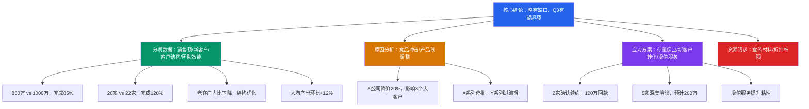

## 案例一：汇报工作——季度销售数据汇报

季度销售数据汇报是职场中最典型的向上汇报场景之一。它不仅考验数据整理能力，更考验你的逻辑组织、问题分析和方案输出能力。本案例将从一个完整的真实场景出发，拆解汇报的每个环节，让你掌握从"流水账"到"结构化汇报"的跃迁方法。

### 场景背景

张伟是一家 B2B 科技公司的华中区销售经理，管理 8 人销售团队。他需要在公司月度经营会议上向总经理汇报 Q2（4-6 月）的销售业绩。

**关键背景信息：**

- Q2 销售额完成目标的 85%（850 万 / 目标 1000 万），缺口 150 万
- 新客户开发数量超额完成，达到目标的 120%（新增 26 家 / 目标 22 家）
- 核心原因：竞争对手 A 公司在 5 月推出降价 20% 的促销活动，影响了 3 个大客户的续约决策
- 积极信号：2 个流失客户已确认 Q3 续约，5 个新客户进入深度洽谈

**会议环境：** 月度经营会议，参会者包括总经理、各区域销售经理、市场总监、财务总监。张伟的汇报时间约 8-10 分钟，之后有 5 分钟提问环节。

---

### ❌ 错误示范：流水账式汇报

> "领导好，我来汇报一下 Q2 的销售情况。嗯……Q2 整体来说还可以吧，虽然没完全达标，但是也做了不少工作。我们团队每天都在外面跑客户，大家都很辛苦。主要是因为市场竞争太激烈了，对手降价了，所以我们有些单子没拿下来。不过新客户开发还是不错的，比上季度多了 30%。下个季度我们会继续努力的。"

**逐句诊断：**

| 原话 | 问题类型 | 具体分析 |
|------|---------|---------|
| "整体来说还可以吧" | 结论模糊 | 听众无法判断到底是好是坏，"还可以"在领导耳中等于"不行" |
| "没完全达标" | 数据缺失 | 差了多少？1% 和 15% 是完全不同的概念 |
| "做了不少工作" | 无实质内容 | 没有具体成果，只有苦劳没有功劳 |
| "市场竞争太激烈了" | 推卸责任 | 把原因归咎于外部环境，暗示"不是我的问题" |
| "对手降价了" | 分析肤浅 | 竞品降价是表象，没有分析对哪些客户、哪些产品线造成了多大影响 |
| "比上季度多了 30%" | 口径不一致 | 前面说的是"完成率"，这里突然跳到"环比增长"，数据体系混乱 |
| "继续努力" | 空洞承诺 | 没有任何具体措施，等于什么都没说 |

**深层问题：** 这段汇报的核心毛病不是"说得不好"，而是**没有想清楚**。一个讲不清楚的人，通常是因为没有把问题分析透彻。汇报的混乱本质上是思维的混乱。

---

### ✅ 正确示范：金字塔结构汇报

以下是基于金字塔原理（Pyramid Principle）重新组织的汇报内容。金字塔原理的核心是**结论先行、以上统下、归类分组、逻辑递进**——先把最重要的结论告诉听众，再逐层展开支撑论据。

> **【第一层：核心结论】**
> "王总，向您汇报 Q2 华中区销售业绩。一句话总结：**销售额略有缺口，但新客户储备充足，Q3 有望超额完成目标。**"
>
> **【第二层：分项数据】**
> "具体来看四个方面：
>
> 第一，**销售额**。Q2 实现 850 万，目标 1000 万，完成率 85%，缺口 150 万。
>
> 第二，**新客户开发**。新增客户 26 家，目标 22 家，完成率 120%，是本季度最大亮点。
>
> 第三，**客户结构**。老客户续约收入占比从 70% 下降到 55%，新客户收入占比从 30% 提升到 45%，客户结构正在优化。
>
> 第四，**团队效能**。人均产出 106 万，环比 Q1 的 95 万提升 12%。"
>
> **【第三层：原因分析】**
> "销售额缺口的直接原因有两个：
>
> 一是**竞品冲击**。A 公司 5 月推出降价 20% 的促销，直接影响了我们 3 个大客户的续约决策——华科电子、中联重工、鼎盛科技，合计影响金额约 120 万。
>
> 二是**产品线调整**。我们的老款产品 X 系列在 Q2 停止推广，新品 Y 系列还在市场教育期，过渡期造成了约 30 万的自然流失。"
>
> **【第四层：应对方案】**
> "针对以上问题，我已经制定了 Q3 的三项核心措施：
>
> 第一，**存量客户保卫**。已对 3 个流失客户完成深度拜访，其中华科电子和中联重工确认 Q3 续约，预计回款 120 万。鼎盛科技目前态度摇摆，我计划邀请技术团队做一次定制方案演示，预计 7 月中旬出结果。
>
> 第二，**新客户转化**。26 个新客户中，5 家已进入深度洽谈阶段，预计 Q3 可贡献 200 万。我会按客户规模分为 A/B/C 三级，A 级客户每周跟进，B 级每两周跟进，C 级每月跟进。
>
> 第三，**增值服务绑定**。针对存量客户推出'技术服务包'，通过增值服务提升客户粘性，降低价格敏感度。
>
> 综合以上，Q3 销售目标暂定 1100 万，其中存量客户 600 万，新客户转化 500 万。"
>
> **【第五层：资源请求】**
> "需要的支持有两项：
>
> 一是请市场部在两周内配合完成增值服务方案的宣传材料，我已经和市场部刘经理初步沟通过，他原则上同意。
>
> 二是申请对鼎盛科技的特殊折扣权限，最多让利 8%，我需要在 7 月 10 日之前给客户答复。请王总指示。"

---

### 结构拆解：为什么这样汇报有效



**逐层解析：**

| 层级 | 内容 | 作用 | 时间占比 |
|------|------|------|---------|
| 第一层：核心结论 | 一句话总结全貌 | 让领导在 10 秒内知道结果 | 10% |
| 第二层：分项数据 | 4 个维度的具体数字 | 用数据支撑结论，建立可信度 | 25% |
| 第三层：原因分析 | 竞品冲击 + 产品线调整 | 展示思考深度，不是甩锅 | 20% |
| 第四层：应对方案 | 3 项具体措施 + 时间节点 | 展示解决问题的能力 | 30% |
| 第五层：资源请求 | 2 项明确需求 + 预沟通 | 降低领导决策成本 | 15% |

---

### 汇报前的准备工作清单

很多人只关注"怎么说"，忽略了"说什么"和"准备什么"。一份高质量的季度汇报，准备工作占 70%，现场表达只占 30%。

#### 数据准备

**必须准备的数据清单：**

- **核心指标**：销售额、完成率、环比变化、同比变化
- **分项指标**：按产品线/客户类型/区域拆分的数据
- **对比基准**：与目标比、与上季度比、与去年同期比、与兄弟区域比
- **趋势数据**：近 4 个季度的趋势线，展示变化方向
- **明细数据**：前 10 大客户的贡献和变化（领导可能追问）

**数据陷阱——必须避免的错误：**

| 错误做法 | 为什么有问题 | 正确做法 |
|---------|------------|---------|
| 只报完成率不报绝对值 | 85% 看起来不差，但缺口 150 万可能很大 | 完成率和绝对值同时呈现 |
| 只环比不同比 | Q2 比 Q1 增长 10%，但去年 Q2 增长了 25% | 同比环比同时对比 |
| 只看总量不看结构 | 总额达标但某产品线暴跌 | 按维度拆分后分析 |
| 取平均值掩盖分化 | 人均 106 万，但 Top1 是 200 万，末位是 40 万 | 展示分布和中位数 |
| 数据口径不一致 | 前面说的是含税，后面变成不含税 | 明确标注口径 |

#### 预判领导可能提出的问题

汇报不是单向输出，领导随时可能打断你提问。提前准备常见问题的回答，能大幅提升你的专业形象。

**高频问题清单：**

1. "缺口 150 万，主要差在哪里？" —— 需要按客户/产品/区域拆分的能力
2. "竞品降价，我们为什么不跟着降？" —— 需要准备好价格策略的分析
3. "新客户质量怎么样？能留得住吗？" —— 需要新客户的首单数据和复购预测
4. "Q3 的 1100 万有把握吗？" —— 需要分客户、分产品的详细测算表
5. "团队里谁表现好，谁需要改进？" —— 需要团队成员的个人数据
6. "其他区域情况怎么样？" —— 需要提前了解兄弟区域的数据

**应对追问的原则：**

- 有数据立刻回答，不要说"我回去查一下"
- 不确定的问题诚实说"这个数据我需要确认，会后 30 分钟内给您"
- 敏感问题（如某员工表现不佳）不要在大会上展开，说"这部分我想单独向您汇报"

#### 材料准备

**汇报材料的三种形式：**

| 形式 | 适用场景 | 优缺点 |
|------|---------|--------|
| 口头汇报（无 PPT） | 小型会议、临时汇报、一对一 | 高效直接，但复杂数据不易呈现 |
| 简短 PPT（5-8 页） | 月度经营会、部门周会 | 平衡效率和可视化，最常用 |
| 详细报告（Word/Excel） | 季度述职、年度总结、正式存档 | 全面系统，但阅读成本高 |

**PPT 制作要点：**

- 第 1 页：核心结论（一句话 + 4 个关键数字）
- 第 2-3 页：分项数据（图表为主，文字为辅）
- 第 4 页：原因分析（不超过 3 个原因）
- 第 5-6 页：应对方案（措施 + 时间表 + 预期效果）
- 第 7 页：资源请求（明确、具体、有替代方案）
- 每页只传递一个核心信息，不要堆砌

---

### 不同情境下的汇报变体

同一个 Q2 数据，在不同情境下汇报的重点完全不同。高手能根据场景灵活调整汇报策略。

#### 变体一：数据很好看——超额完成

当业绩超额完成时，重点不是炫耀，而是**归因和可复制性**。

> "王总，Q2 华中区超额完成目标，销售额 1150 万，完成率 115%。
>
> 超额主要来自三个因素：一是新产品 Y 系列在制造业客户中快速渗透，贡献了 200 万增量；二是老客户华科电子追加了一笔大单；三是团队小李成功拿下了一个行业标杆客户。
>
> 值得关注的是，Y 系列的制造业渗透模式可以复制到其他区域。我已经整理了打法要点，可以分享给兄弟团队。"

**要点：** 好成绩要归因到具体因素，让领导知道"为什么好"和"怎么复制"，而不只是一句"我们做得不错"。

#### 变体二：数据很差——大幅未达标

当业绩严重不达标时，重点是**诚实面对 + 深度分析 + 翻盘方案**。

> "王总，Q2 华中区销售额 600 万，完成率 60%，缺口 400 万，我对此负主要责任。
>
> 核心原因是我对竞品降价的反应滞后了两周，错过了最佳应对窗口。具体来说……
>
> 目前已采取三项止损措施：第一……第二……第三……
>
> Q3 的翻盘计划是……预计可以追回 300 万缺口。剩余 100 万需要在 Q4 追赶。"

**要点：** 成绩差时最忌讳找借口。先认责、再分析、最后给方案。领导最怕的不是业绩差，而是"你不知道为什么差"和"你没有翻盘计划"。

#### 变体三：数据有好有坏——混合型

这正是本案例的原始情境——好坏参半。处理策略是**先给整体判断，再分项展开，最后用亮点收尾**。

> "总体评价：Q2 基本达标。销售额有缺口，但新客户储备为 Q3 打下了坚实基础。"

**要点：** 不要先说坏消息再说好消息（领导听完坏消息已经焦虑了），也不要先说好消息再说坏消息（显得报喜不报忧）。正确的做法是**先给整体判断**，让领导心中有数，再逐项展开。

---

### 汇报中的表达技巧

#### 语言层面

**用数字说话，不用形容词。**

| ❌ 模糊表达 | ✅ 精准表达 |
|------------|-----------|
| 销售额还可以 | 销售额 850 万，完成率 85% |
| 新客户增长不少 | 新客户 26 家，环比增长 30% |
| 竞品影响很大 | 竞品影响 3 个客户，涉及金额 120 万 |
| 团队很努力 | 人均拜访客户 45 次/月，环比增长 15% |
| 下季度会更好 | Q3 目标 1100 万，其中已确认可落地 800 万 |

**用"主谓宾"短句，不用长从句。**

- ❌ "由于市场竞争加剧导致我们的一些客户在续约方面出现了一定程度的犹豫。"
- ✅ "竞品降价导致 3 个客户推迟续约。"

**用主动语态，不用被动语态。**

- ❌ "150 万的缺口被造成了。"
- ✅ "销售额缺口 150 万。"

#### 节奏层面

**关键数字要停顿。** 在说出最重要的数字前，停顿 1-2 秒，让听众的注意力集中。

> "Q2 销售额——850 万。"（停顿）"目标是 1000 万，缺口 150 万。"

**用"第一、第二、第三"明确结构。** 让听众知道你说到哪里了，还剩多少。人类对有编号的信息记忆效率比无编号的高 40%。

**控制语速。** 汇报数据时语速放慢（让听众有时间消化），讲方案时可以适当加快（展示自信和熟练）。

#### 肢体语言

- **目光接触：** 汇报时目光扫视所有参会者，不要只盯着总经理一个人
- **手势辅助：** 说"三个方面"时伸出三根手指，帮助听众跟随你的结构
- **站姿/坐姿：** 挺直但不僵硬，传递自信和从容
- **不要看稿子：** 核心数据和结论必须脱稿，细节可以看笔记

---

### 常见误区与纠正

#### 误区一：把汇报当成念 PPT

**表现：** 逐页朗读 PPT 上的文字，没有任何补充和互动。

**纠正：** PPT 是给听众看的辅助材料，不是你的演讲稿。PPT 上放关键数据和图表，口头补充分析和洞察。如果你念的和 PPT 写的一模一样，那 PPT 就是多余的。

#### 误区二：只报喜不报忧

**表现：** 大篇幅讲成绩，问题一笔带过或完全不提。

**纠正：** 领导不傻，你不说他也会从其他渠道知道。主动暴露问题反而展示你的坦诚和专业。正确比例：问题分析占 30-40%，方案和亮点占 60-70%。

#### 误区三：原因分析停留在表面

**表现：** "市场不好""竞争激烈""客户预算紧"——这些是所有人都知道的外部原因。

**纠正：** 外部原因一句话带过即可，重点分析**内部可改进的因素**。比如："竞品降价我们反应慢了两周"比"竞品降价了"有价值得多，因为前者指向了可改进的决策流程。

#### 误区四：方案不具体

**表现：** "下季度我们会加大推广力度""加强客户关系维护""提升团队能力"。

**纠正：** 每个方案必须回答五个问题：做什么？谁来做？什么时候做？做到什么程度？怎么衡量效果？

| ❌ 模糊方案 | ✅ 具体方案 |
|------------|-----------|
| 加大推广力度 | 7 月组织 3 场行业沙龙，邀请 50 个潜在客户参加 |
| 加强客户维护 | A 级客户每周拜访，B 级客户每两周电话回访 |
| 提升团队能力 | 8 月完成 2 天销售技巧培训，9 月进行模拟演练考核 |

#### 误区五：不预沟通就上会

**表现：** 在会议上突然提出需要其他部门配合的请求，让对方措手不及。

**纠正：** 任何需要跨部门配合的事项，**必须在会前与相关部门负责人沟通**。本案例中，张伟在会前已与市场部刘经理沟通过，所以汇报时可以说"已和刘经理初步沟通，他原则上同意"——这大幅降低了领导的决策阻力。

---

### 进阶技巧：让汇报从"合格"到"出彩"

#### 技巧一：用"对比锚点"强化数据感知

孤立的数字缺乏感知。通过对比让数字"活"起来。

- "850 万"本身无感 → "850 万，相当于每天签下一个 9.4 万的订单"
- "缺口 150 万"不够直观 → "150 万，约等于丢掉了一个华科电子这样的大客户"
- "新客户 26 家"没有冲击力 → "26 家，是过去 8 个季度以来的最高纪录"

#### 技巧二：用"故事线"串联数据

数据汇报不是罗列数字，而是讲一个有起承转合的故事。


这个故事线的逻辑是："我们有一个目标 → 遇到了意外挑战 → 我们采取了应对措施 → 结果可控 → 未来有信心。" 这比干巴巴地报数字有感染力得多。

#### 技巧三：主动提出"领导关心的问题"

不要等领导追问，主动回答他最关心的问题。领导听到销售数据时，脑子里想的是：

1. 这个缺口会不会继续扩大？
2. 你有没有能力追回来？
3. 需要我做什么？

在汇报中主动回答这三个问题，就等于替领导省了追问的步骤，体验感会大幅提升。

#### 技巧四：准备好"一页纸摘要"

无论你的 PPT 有多少页，都准备一份**一页纸的摘要**，包含：核心结论、关键数据、主要问题、应对方案、资源需求。汇报结束后发给领导和参会者，方便他们存档和转发。

---

### 数据可视化的选择

在汇报中，合适的数据可视化能让信息传递效率翻倍。

| 展示目的 | 推荐图表 | 适用场景 |
|---------|---------|---------|
| 展示完成率 | 进度条/仪表盘 | 销售额、KPI 完成度 |
| 展示趋势 | 折线图 | 近 4 个季度的变化趋势 |
| 展示构成 | 饼图/环形图 | 客户类型占比、收入来源占比 |
| 展示对比 | 柱状图 | 区域对比、产品线对比、同比环比 |
| 展示排名 | 条形图 | Top10 客户贡献、团队成员排名 |
| 展示分布 | 散点图/箱线图 | 客户规模分布、订单金额分布 |

**原则：** 一张图只传递一个信息。不要在一张图上同时展示趋势、对比和构成——拆成三张图。

---

### 不同汇报形式的应对策略

#### 书面汇报（邮件/报告）

书面汇报要求逻辑更严密，因为读者可以反复阅读、挑毛病。

**邮件汇报的结构：**

主题：【Q2销售汇报】华中区-销售额850万/完成率85%-张伟

正文：
1. 核心结论（一句话）
2. 关键数据（表格形式，4-6个核心指标）
3. 问题分析（2-3个原因，每个不超过2句话）
4. Q3计划（措施+时间+预期效果）
5. 需要的支持（具体、有替代方案）
附件：详细数据表、客户明细

**注意：** 邮件汇报不要超过 500 字正文。详细内容放附件，正文只放摘要。领导没时间读长邮件。

#### 口头汇报（会议）

口头汇报的核心是**控制节奏**和**与听众互动**。

- 开头 30 秒：用核心结论抓住注意力
- 中间 5-7 分钟：分项展开，每个论点 1-2 分钟
- 结尾 1 分钟：总结 + 资源请求
- 期间观察领导表情，如果他在某个点上皱眉或点头，灵活调整详略

#### 一对一汇报

一对一汇报更灵活，可以更深入地讨论问题和方案。

- 可以更坦诚地讨论困难和不确定性
- 可以请教领导的意见和建议
- 可以讨论敏感话题（如某个员工的表现）
- 但仍需有结构，不要变成闲聊

---

### 完整汇报模板

以下是可以直接复用的季度销售汇报模板，根据实际情况填入数据即可。

```markdown
## Q[X] 销售汇报——[区域/部门]

### 一、核心结论
[一句话总结本季度整体表现，包含主要指标完成情况]

### 二、关键数据
| 指标 | 目标 | 实际 | 完成率 | 环比 | 同比 |
|------|------|------|--------|------|------|
| 销售额 | [X]万 | [X]万 | [X]% | [X]% | [X]% |
| 新客户数 | [X]家 | [X]家 | [X]% | [X]% | [X]% |
| 客单价 | [X]万 | [X]万 | — | [X]% | [X]% |
| 续约率 | [X]% | [X]% | — | [X]% | [X]% |

### 三、亮点与问题
**亮点：**
- [具体亮点1：数据+归因]
- [具体亮点2：数据+归因]

**问题：**
- [具体问题1：数据+原因+已采取措施]
- [具体问题2：数据+原因+已采取措施]

### 四、Q[X+1] 计划
| 措施 | 负责人 | 时间节点 | 预期效果 |
|------|--------|---------|---------|
| [措施1] | [姓名] | [日期] | [量化效果] |
| [措施2] | [姓名] | [日期] | [量化效果] |
| [措施3] | [姓名] | [日期] | [量化效果] |

### 五、需要的支持
1. [具体需求：内容+理由+期望时间]
2. [具体需求：内容+理由+期望时间]
```

---

### 本案例的核心收获

回顾这个案例，季度销售数据汇报的本质不是"报数字"，而是通过数字展示你的**分析能力**和**解决问题的能力**。领导听完你的汇报，如果能清晰地回答以下三个问题，你的汇报就是成功的：

1. **现状如何？** —— 有明确的结论和具体的数据
2. **为什么会这样？** —— 有深度的原因分析，不是浮于表面
3. **接下来怎么办？** —— 有具体的方案、时间表和资源需求

记住：**汇报的质量反映思考的质量。** 一个讲不清楚的人，首先要想清楚。在准备汇报的过程中，把问题真正分析透彻，表达自然就清晰了。

***
