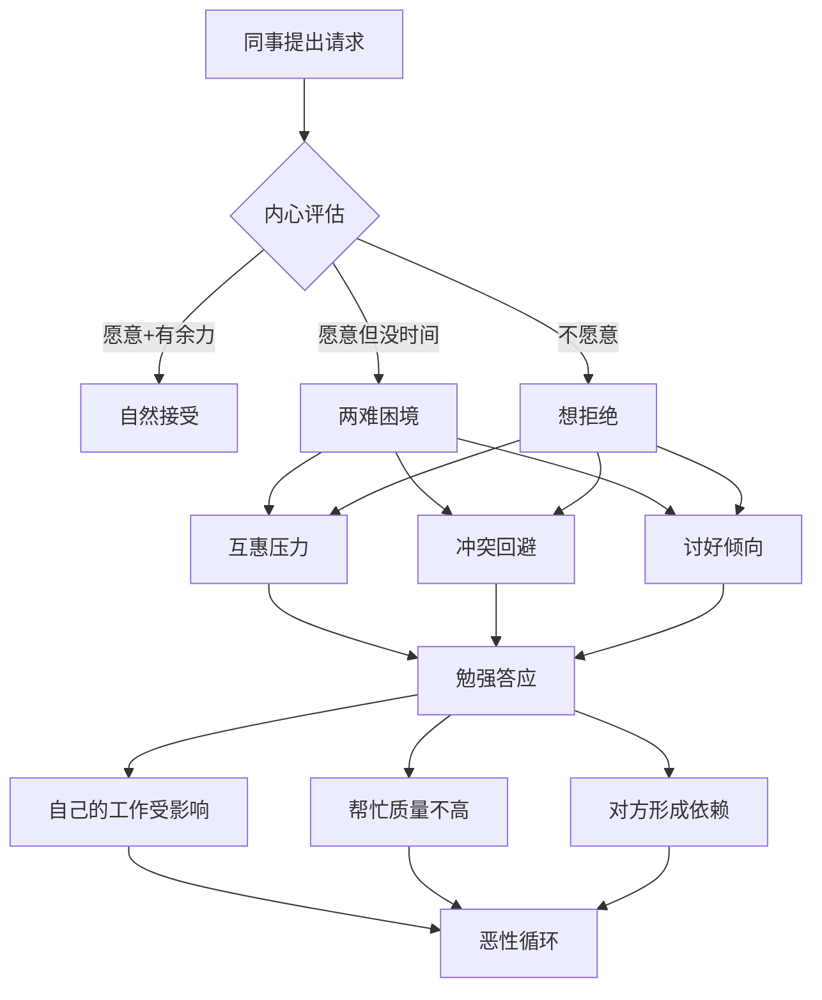

## 案例三：拒绝请求——同事要求帮忙完成不属于自己的任务

### 场景导入

王强是产品部的项目经理，正同时推进两个下周要交付的项目方案。周三下午，技术部的赵明找到他："强哥，我们部门那个智能推荐模块的技术文档一直没人写，你文笔好，能不能帮我写一下？下周就要评审了。"

这不是王强的职责范围。但他和赵明平时关系不错，一起吃过几次饭，偶尔也会互相帮个小忙。现在赵明开口了，王强陷入了两难——答应吧，自己的工作要加班才能赶上；拒绝吧，怕伤了关系，以后找赵明帮忙也不方便了。

这个场景在职场中极其普遍。据哈佛商学院2019年的一项调研，**73%的职场人表示自己每周至少被同事要求做一次超出职责范围的事情**，而其中超过一半的人会勉强答应，导致自己的核心工作质量下降。

### 为什么拒绝这么难？——心理机制拆解

在学习正确方法之前，先理解为什么大多数人无法拒绝：

**1. 互惠压力（Reciprocity Pressure）**

社会心理学家罗伯特·西奥迪尼在《影响力》中指出，人类有一种根深蒂固的互惠本能——别人给了你什么，你就觉得"欠了"，必须还。职场中，如果赵明以前帮过王强一个小忙，王强会感到强烈的"还债"压力，即使这次的请求远超之前的人情。

**2. 冲突回避倾向（Conflict Avoidance）**

很多人把"拒绝"等同于"冲突"。实际上，**合理的拒绝是边界管理，不是攻击**。但在情绪层面，大脑的杏仁核会把社交拒绝信号处理成"威胁"，触发回避反应——这就是为什么明明知道应该拒绝，嘴巴却说出了"好吧"。

**3. 讨好型人格模式（People-Pleasing Pattern）**

如果一个人从小被教育"要懂事""要乐于助人"，他可能会把"被需要"等同于"被认可"。拒绝别人的请求，在潜意识里等于放弃了一次获得认可的机会。

**4. 关系误判（Relationship Miscalculation）**

很多人高估了拒绝的负面影响。斯坦福大学组织行为学教授杰弗里·普费弗的研究表明：**在职场中，有清晰边界感的人反而比"有求必应"的人获得更高的专业尊重**。因为别人会推断——这个人把时间花在了我的请求上，说明他自己的工作不够饱和，或者他不懂得优先级管理。

认识到这些心理机制，是学会拒绝的第一步——**你不是"不会拒绝"，而是被自己的情绪绑架了**。

---

### ❌ 错误示范：三种常见失败模式

#### 失败模式A：生硬拒绝

> "不好意思，这不是我的工作，你找别人吧。"

**问题分析**：

这句话在逻辑上没有错，但在沟通效果上是灾难性的。它同时犯了三个错误：

| 错误点 | 具体问题 | 对方的感受 |
|--------|----------|------------|
| 缺乏共情 | 没有承认对方的困难 | "他根本不在乎我的处境" |
| 标签化拒绝 | "不是我的工作"听起来像推诿 | "他就是不想帮我，找借口" |
| 没有替代方案 | 把解决问题的责任完全推回给对方 | "他虽然拒绝了，但什么忙都没帮" |

**后果**：赵明回去后可能跟其他同事说"王强这人太冷漠了"，虽然王强没有做错什么，但他的职场口碑会受损。

#### 失败模式B：模糊答应

> "好吧，我抽时间帮你看看。"

**问题分析**：

这是最隐蔽的失败模式，因为它表面上解决了当下的尴尬，实际上制造了更多问题：

- **对自己的伤害**：王强需要加班才能完成自己的工作，或者两边都做不好
- **对赵明的伤害**：赵明以为有人帮忙了，没有去找其他解决方案，结果王强最后交付的质量很差或根本没做
- **对关系的伤害**：比直接拒绝更伤关系——赵明会觉得"你答应了又没做到，比不答应还可恶"

心理学上这叫**"讨好性承诺"（People-Pleasing Commitment）**——为了避免当下的社交不适，承诺了自己无法兑现的事情，最终导致更大的信任损失。

#### 失败模式C：过度解释

> "真的不行啊，我妈最近住院了，我女朋友又在跟我闹分手，我自己的项目也延期了，领导天天催我……"

**问题分析**：

过度暴露个人信息有两个风险：第一，对方可能觉得你在编造理由（"怎么每次拒绝都有这么多事？"）；第二，你把自己的隐私和脆弱性暴露给了职场关系中的人，这在未来可能被利用或传播。

**拒绝的理由只需要一个真实的、具体的、可验证的事实，不需要一部苦情剧。**

---

### ✅ 正确做法：四层结构拒绝法

#### 核心框架

第一层：共情确认（让对方感到被尊重）
    ↓
第二层：事实陈述（用客观原因代替主观不愿意）
    ↓
第三层：替代方案（展示你的善意和建设性）
    ↓
第四层：关系维护（为未来的合作留下空间）

#### 完整示范

> **王强**："赵明，谢谢你信任我来帮忙写这份技术文档。我知道你们技术部最近确实很忙，那个智能推荐模块又是重点项目，文档评审下周就要了，时间确实紧张。"
>
> *(停顿一拍，给对方回应的空间)*
>
> "不过说实话，我这周手上有两个项目的方案要赶——一个是周三要交付的客户提案，另一个是周五要交付的产品规划，都是硬性deadline，我现在自己的工作都得加班才赶得出来。如果硬接你的文档，要么我自己的方案质量下降，要么你的文档写得粗糙，哪种结果对我们都不好。"
>
> "我有两个建议你看行不行：**第一**，我之前写过一份类似模块的技术文档模板，结构和格式都比较成熟，我发给你，你在这个框架里填内容，至少能省一半时间；**第二**，产品部的小刘最近相对空闲，而且他上个月刚参与了你们那个项目的评审，对业务逻辑比较熟悉，你可以问问他，我可以提前跟他打个招呼。你觉得哪个方案更合适？"

#### 逐层拆解

**第一层：共情确认**

> "谢谢你信任我来帮忙写这份技术文档。我知道你们技术部最近确实很忙……"

| 要素 | 作用 | 语言技巧 |
|------|------|----------|
| 感谢信任 | 肯定对方的选择 | "谢谢你信任我"而不是"谢谢你看得起我" |
| 承认困难 | 展示你理解对方的处境 | 具体说出对方的困难（"时间确实紧张"） |
| 降低防御 | 让对方感到你不是在对抗他 | 语气真诚，不要有"但是"紧随其后 |

**关键**：共情之后要有一个自然的停顿（1-2秒），让对方感受到你真的在考虑，而不是走流程。

**第二层：事实陈述**

> "我这周手上有两个项目的方案要赶……都是硬性deadline……"

原则：

- **用具体事实代替模糊感受**：不说"我很忙"，说"有两个项目方案，周三和周五交付"
- **用客观约束代替主观不愿意**：不说"我不想帮你"，说"如果硬接，两边质量都会下降"
- **用双赢分析代替单方面拒绝**：把"我不能帮你"转化为"这样做对我们都不好"

**第三层：替代方案**

> "我有两个建议你看行不行……"

这是区分"高级拒绝"和"普通拒绝"的关键。替代方案的价值在于：

1. **降低对方的损失感**：虽然你不能帮忙，但你提供了其他形式的支持
2. **展示你的专业性**：能提出替代方案说明你认真思考了对方的问题
3. **转移决策权**：用"你觉得哪个方案更合适？"让对方参与到解决方案中

**替代方案的三个层次**（从高到低）：

| 层次 | 举例 | 适用场景 |
|------|------|----------|
| 工具/资源支持 | 提供模板、参考资料、工具链接 | 对方缺的不是能力而是起点 |
| 人脉推荐 | 推荐其他可能帮忙的人 | 你认识更合适的人选 |
| 部分参与 | 帮忙审阅、提建议（不代写） | 你有一点时间但不够做完整件事 |

**第四层：关系维护**

> "你觉得哪个方案更合适？"

以开放性问题结尾，而不是以拒绝结尾。这传递的信号是："我拒绝了你的请求，但我没有拒绝你这个人。"

---

### 进阶场景：当拒绝变得更复杂

现实中的拒绝远比"标准场景"复杂。以下是几种常见的高难度变体：

#### 变体一：对方是你的上级或资深同事

**场景**：技术部的李总监（比王强高两级）让王强帮忙写文档。

**调整要点**：对上级的拒绝需要更多的"策略性"，核心是**把"拒绝"转化为"优先级确认"**。

> "李总，这个技术文档我很愿意支持。不过我想跟您确认一下优先级——我手上现在有A项目（周三交付）和B项目（周五交付），如果接这个文档，我需要调整其中一个的交付时间。您看哪个优先级更高？"

**为什么有效**：你没有说"不"，而是把决策权交还给了上级。大多数情况下，上级会说"那先把你自己的工作做好"——这实际上就是拒绝，但由上级主动做出。

#### 变体二：对方反复请求（"软磨硬泡"型）

**场景**：王强已经拒绝了，但赵明说"就帮这一次嘛""你能力强才找你的""上次老张找你帮忙你不就帮了吗"。

**应对策略：温和而坚定地重复边界（Broken Record Technique）**

| 赵明的话 | 王强的回应 |
|----------|------------|
| "就帮这一次嘛" | "我理解你的处境，但我这周确实没有额外的时间。我之前说的那个模板和小刘的建议，你看要不要先试试？" |
| "你能力强才找你的" | "谢谢认可。不过正因为我想把事情做好，才不能在时间不够的情况下去做——那样质量也对不起你。" |
| "上次老张找你帮忙你不就帮了吗" | "上次帮老张是因为正好那周我手头工作告一段落了。这周情况确实不同，不是区别对待。" |

**核心原则**：每次重复都用不同的措辞表达同一个意思，但始终回到替代方案上。不被对方带偏到争论"你是不是不够朋友"这种问题上。

#### 变体三：模糊请求（不好判断是否属于自己的职责）

**场景**：赵明说"帮我看看这个技术方案有没有问题"——这个请求介于"帮个忙"和"跨部门协作"之间，不好直接拒绝。

**应对策略：澄清+限缩**

> "可以的，我帮你从产品角度看一下逻辑有没有问题。不过技术细节的审核我不是专业的，这部分还是需要你们技术部内部把关。你看我周三下午抽20分钟快速过一遍，给你一个产品视角的反馈，可以吗？"

**要点**：不是拒绝，而是把承诺限定在你能接受的范围内——时间上限（20分钟）、内容上限（产品视角）、责任上限（不负责技术细节审核）。

#### 变体四：团队文化压力（"大家都互相帮忙"）

**场景**：整个团队的氛围就是"互相帮忙"，拒绝会被视为"不合群"。

**应对策略**：

1. **用数据说话**："我上个月额外帮了3次忙，这个月我自己的KPI有压力，需要集中精力在核心产出上。"
2. **建立长期预期**："我建议我们跟领导讨论一下，能不能把这些跨部门的工作纳入正式的流程，这样分配更公平，质量也有保障。"
3. **选择性帮忙**：不是所有请求都要拒绝，建立"帮忙预算"——比如每周最多帮一次忙，用在刀刃上。

---

### 实操工具箱

#### 工具一：拒绝话术速查表

| 场景 | 核心话术 | 要点 |
|------|----------|------|
| 没时间 | "我现在手上有X和Y，都是Z时间交付，实在抽不出来" | 具体化你的工作量 |
| 不擅长 | "这方面我不够专业，怕帮倒忙。XX比我更合适" | 承认局限性比硬撑更专业 |
| 不合理 | "这个任务按流程应该走XX部门/XX流程" | 引用制度而非个人判断 |
| 模糊请求 | "我可以帮你看一下A部分，但B和C需要XX来做" | 限缩范围，不全盘接受 |
| 反复请求 | "我理解你的处境，但我的情况确实没变。建议你试试XX" | 温和重复，回到替代方案 |

#### 工具二：拒绝前的30秒自检清单

在回答之前，快速问自己三个问题：

1. **如果答应了，我的核心工作会受到什么影响？**（量化影响：延迟几天？质量下降多少？）
2. **这个请求的合理程度如何？**（是否真的超出职责？是否有先例？是否对方确实无法独立完成？）
3. **我能提供什么替代方案？**（模板？推荐人选？部分参与？）

如果第一个问题的答案是"明显受影响"，就应该拒绝——你对团队最大的贡献是把自己职责范围内的工作做好，而不是当所有人的"万能替补"。

#### 工具三：拒绝后的跟进

拒绝不是终点。如果对方接受了你的替代方案，事后可以做一次简短跟进：

> "赵明，上次那个文档写得怎么样了？模板用上了吗？有什么需要调整的可以跟我说。"

这个跟进有两个作用：**一是确认你的替代方案真的帮到了对方，二是向对方传递"我虽然没有直接帮忙，但我关心这件事的结果"**。

---

### 误区与纠正

#### 误区一："拒绝就是得罪人"

**现实**：真正得罪人的不是拒绝，而是拒绝的方式。一份盖洛普职场调查显示，员工对同事关系满意度最高的团队，不是"从不拒绝"的团队，而是"能坦诚沟通边界"的团队。因为清晰的边界让每个人都知道可以期待什么，减少了失望和误解。

#### 误区二："要给很多理由才能拒绝"

**现实**：理由越多，越显得心虚。一个真实、具体、可验证的理由就够了。如果对方追问，你可以重复同一个理由，不需要编造新的。

#### 误区三："拒绝之后要反复道歉"

**现实**：过度道歉会削弱你拒绝的立场，让对方觉得"你其实知道自己做得不对"。道歉一次就够了，之后把重心放在替代方案上。

#### 误区四："这次帮了，下次对方就不会再找我了"

**现实**：心理学中的"登门槛效应"（Foot-in-the-Door Effect）表明，一旦你答应了一次不合理的请求，对方下次提更大请求的可能性会增加而不是减少。因为在他的认知模型里，你已经被归类为"可以突破边界的人"。

#### 误区五："我先答应着，之后找借口推掉"

**现实**：这比当场拒绝糟糕十倍。对方已经投入了期待和时间成本（比如没有去找其他人），你之后推掉造成的损失远大于一开始就拒绝。

---

### 知识延伸：边界管理的底层逻辑

拒绝不是一项孤立的沟通技巧，它是**个人边界管理系统**的一部分。

**什么是个人边界？**

个人边界是你为自己设定的规则——什么行为你可以接受，什么行为你不接受。在职场中，边界包括：

- **职责边界**：哪些任务属于你的工作范围
- **时间边界**：你能为额外请求投入多少时间
- **情感边界**：你能承受多大的社交压力而不改变决定
- **能力边界**：你的真实能力范围在哪里

**为什么边界管理比"技巧"更重要？**

技巧只能帮你应对单次请求。但如果你的整个行为模式是"有求必应"，单次拒绝只会让对方困惑——"他以前都帮忙的，这次怎么了？是不是对我有意见？"

只有当你建立了清晰、一致的边界模式，别人才能准确预期你的行为，减少摩擦。这就像交通规则——如果每个人随时都可能变道，交通会瘫痪；正因为有明确的规则，大家才能高效通行。

**建立边界的行为策略**：

1. **一致性**：你的边界应该是稳定的，不要今天帮明天不帮，那样别人会觉得你是在"看人下菜碟"
2. **可预期性**：让别人知道你的边界在哪里，比如在团队里明确"我每周三下午可以帮大家审阅文档，其他时间请走正式流程"
3. **渐进性**：如果你过去一直是"老好人"，不要突然变成"冷面拒客"。从低风险的请求开始练习拒绝，逐步建立新的行为模式

---

### 本案例核心要点回顾

| 要点 | 说明 |
|------|------|
| 先共情再拒绝 | 让对方感受到尊重，降低防御心理 |
| 用事实代替感受 | "我有两个deadline"比"我很忙"有力十倍 |
| 提供替代方案 | 展示善意，把"拒绝"变成"换一种方式帮忙" |
| 温和而坚定 | 被软磨硬泡时重复边界，不被带偏 |
| 建立长期边界模式 | 一致性比单次技巧更重要 |

拒绝不合理请求不是自私，是对自己工作质量和团队整体效率负责。**一个总是牺牲自己的核心工作去帮别人的人，最终既做不好自己的事，也帮不好别人的事。** 学会有策略地说"不"，是职场成熟度的重要标志。

