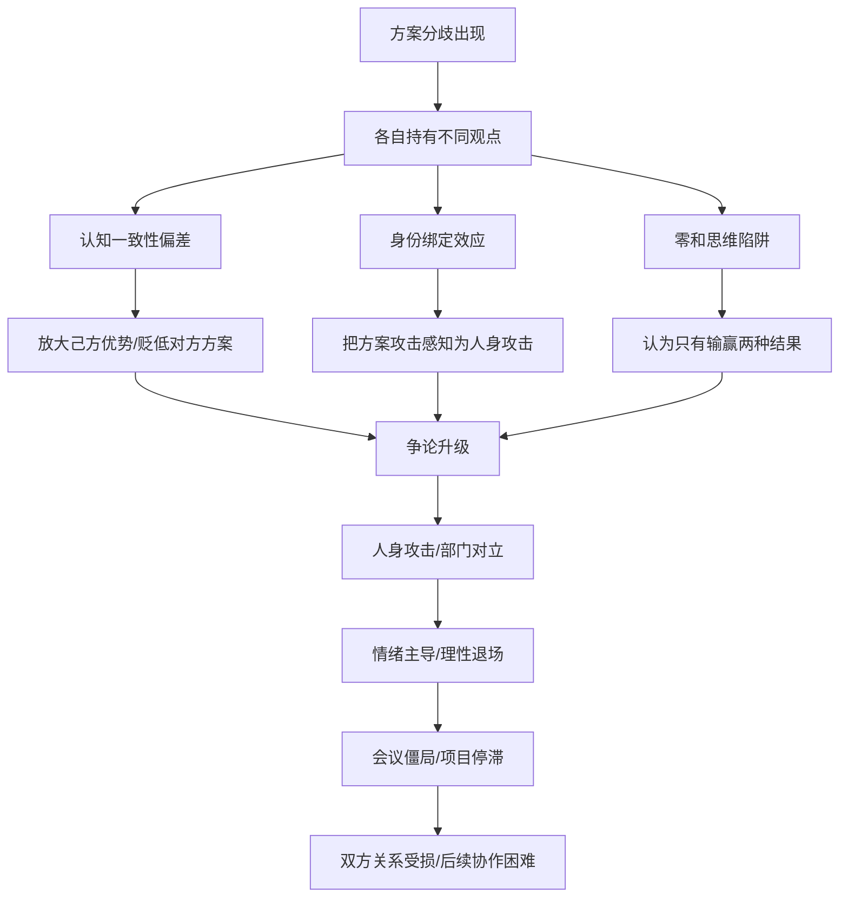
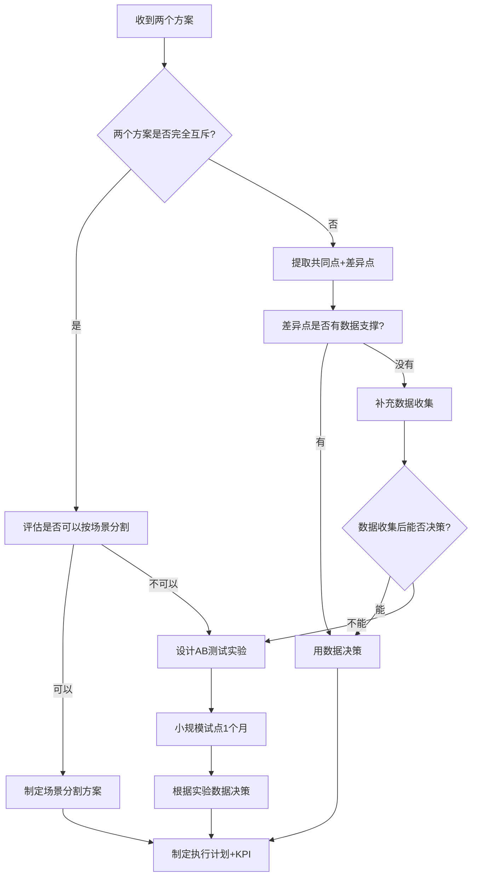
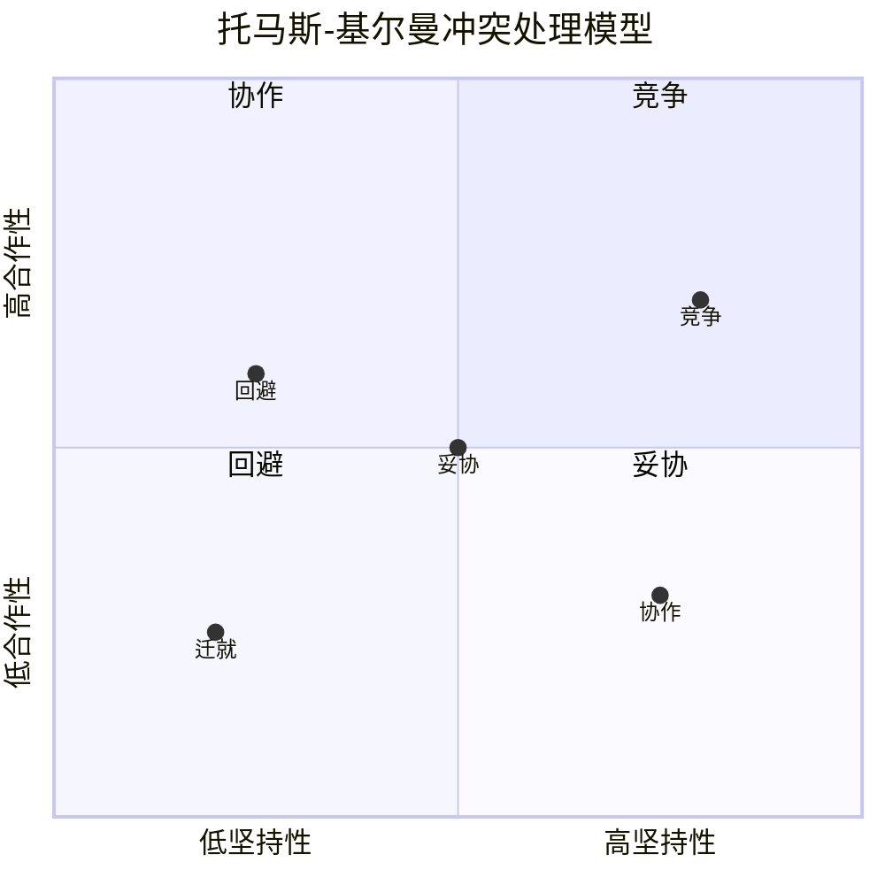

## 案例四：处理冲突——与同事在方案上的分歧

### 场景描述

市场部的刘洋和销售部的陈明在年度营销方案上产生了严重分歧。刘洋主张大量投入线上广告（信息流投放、短视频营销、搜索引擎竞价），理由是线上获客成本可控、效果可追踪；陈明主张增加线下渠道（行业展会、地推团队、经销商拜访），理由是公司的核心客户群体（B端企业决策者）更依赖面对面信任关系。

两人在部门协调会议上各执己见。刘洋认为陈明"思维老旧，不懂数字化转型"；陈明觉得刘洋"只会看数据，不了解真实客户"。争论从方案讨论逐渐升级为部门互相指责——市场部说销售部"只知道搞关系、吃饭"，销售部说市场部"坐在办公室拍脑袋"。会议气氛越来越紧张，其他参会同事面面相觑，项目推进陷入僵局。

这不是个例。据《哈佛商业评论》2021年的调研，**管理者平均花费25%-40%的工作时间处理冲突**，其中方案分歧类冲突占比最高（约38%），因为它是"观点对观点"的对抗——双方都有合理的论据支撑，没有明确的对错，极难调和。

### 为什么方案分歧容易升级为人身攻击？

在学习正确方法之前，先理解冲突升级的心理机制——只有看清陷阱在哪里，才能有意识地避开它。

#### 心理机制拆解

**1. 认知一致性偏差（Cognitive Consistency Bias）**

心理学家费斯汀格的"认知失调理论"指出，当人们持有某个观点后，会本能地排斥与之矛盾的信息。刘洋既然已经投入时间精力构建了"线上营销方案"，他的大脑就会自动放大线上渠道的优势、忽略其局限，同时贬低线下渠道的价值——这不是故意的，而是大脑的自我保护机制。

**2. 身份绑定效应（Identity Fusion）**

当一个人长期代表某个部门发言时，他的个人身份会与部门身份融合。攻击"线下渠道方案"在他听来等同于攻击"销售部"，进而等同于攻击"我"。这就是为什么方案讨论会迅速变成人身攻击——双方都觉得对方在否定自己这个人。

**3. 零和思维陷阱（Zero-Sum Thinking）**

在资源有限的组织环境中，人们容易把"你的方案赢了"等同于"我的方案输了"，进而等同于"我输了"。这种"非此即彼"的思维模式让双方无法看到第三种可能——两种方案的融合或各自适用不同场景。

**4. 面子文化加成（Face-Saving Dynamic）**

在中国职场文化中，"面子"是重要的社会资本。在公开会议上的方案被否定，不仅意味着专业判断被质疑，还意味着在同事面前"丢了面子"。这种压力会让当事人加倍捍卫自己的立场，即使内心已经开始动摇。



认识这些机制的目的不是"理解了就能避免"，而是建立一个自我觉察的锚点——当你在争论中感到"必须赢"的冲动时，能意识到"这可能是认知偏差在作怪"，从而给自己一个暂停的机会。

---

### ❌ 错误示范：四种常见失败模式

#### 失败模式A：人身攻击型

> **刘洋**："你懂什么线上营销？你们销售就知道搞关系、吃饭，现在都什么时代了！"
>
> **陈明**："你天天坐在办公室里看数据，知道客户真正需要什么吗？线上那些广告有几个能转化成实际订单的？"

**问题分析**：

| 错误点 | 具体问题 | 后果 |
|--------|----------|------|
| 攻击人而非方案 | 把对方案的否定转化为对对方能力和职业的否定 | 对方立刻进入防御/反击模式 |
| 贬低对方部门 | "就知道搞关系""坐在办公室拍脑袋" | 引发部门对立，扩大冲突范围 |
| 使用讽刺语气 | "你懂什么""现在都什么时代了" | 制造羞辱感，破坏合作基础 |
| 用反问代替论证 | "有几个能转化成订单？" | 没有提供数据，只是情绪宣泄 |

**后果**：这种对话一旦发生，即使最终达成了方案共识，两人的关系也会出现裂痕。后续的跨部门协作会因为"上次吵架"的心结而处处受阻。更严重的是，其他参会同事会形成"这两个人/两个部门不对付"的印象，影响团队整体氛围。

#### 失败模式B：沉默忍耐型

> **刘洋**：（提出线上方案后，陈明内心反对但保持沉默）
>
> **会议主持人**："陈明，你觉得呢？"
>
> **陈明**："都行吧，你们定。"
>
> （会议结束后，陈明在自己部门抱怨"市场部又在瞎指挥"，实际执行中消极配合）

**问题分析**：

表面上没有冲突，实际上是最具破坏性的"隐性冲突"。盖洛普的调研显示，**隐性冲突对企业造成的损失是显性冲突的3倍**——因为它不会被解决，只会在暗处持续发酵，表现为消极配合、信息隐瞒、背后议论。

| 隐性冲突表现 | 具体行为 | 组织损害 |
|-------------|----------|----------|
| 消极执行 | "按你说的做，但不做优化" | 方案执行质量打折 |
| 信息囤积 | 不主动分享关键市场信息 | 决策依据不完整 |
| 背后议论 | "市场部就知道烧钱" | 团队信任被侵蚀 |
| 事后追责 | "当初我就说不行吧" | 组织学习能力下降 |

#### 失败模式C：上级压服型

> **领导**："别争了，就按刘洋的线上方案执行。陈明，你们销售部配合一下。"
>
> **陈明**：（表面服从，内心不满）

**问题分析**：

用权力解决分歧是最简单的方式，也是后患最大的方式。它解决了"说什么"的问题，但没有解决"为什么"的问题。陈明的线下方案中合理的部分被完全忽略，他的专业判断被权力否定——这不仅损害了他的工作积极性，也让组织失去了一个可能更优的方案组合。

更关键的是，**被压服的执行者不会全力以赴**。麦肯锡的研究表明，员工对自己参与制定的方案的执行投入度是"被分配方案"的2.3倍。

#### 失败模式D：和稀泥型

> **会议主持人**："两位说得都有道理。这样吧，线上和线下各做一半，预算对半分。大家觉得呢？"

**问题分析**：

表面上"公平公正"，实际上是一种决策懒惰。"各打五十大板"式的折中方案缺乏逻辑支撑——为什么是50:50而不是60:40或30:70？它既没有利用线上渠道在获客效率上的优势，也没有发挥线下渠道在客户信任上的特长。结果往往是一个"什么都不突出"的平庸方案。

**折中≠整合。折中是双方各退一步的妥协；整合是基于分析找到的最优组合。** 前者通常不是最优解，后者才是。

---

### ✅ 正确做法：五阶段冲突化解框架

#### 总体框架

第一阶段：暂停降温（中断情绪升级链条）
    ↓
第二阶段：重构议题（从"谁对谁错"转向"什么是最优解"）
    ↓
第三阶段：数据驱动（用事实替代感觉，用证据支撑论点）
    ↓
第四阶段：整合方案（寻找超越二选一的第三种可能）
    ↓
第五阶段：共识落地（明确决策、责任和跟踪机制）


#### 第一阶段：暂停降温——中断情绪升级链条

当争论开始升温、语气开始变得尖锐时，第一步不是"讲道理"，而是**物理性地中断情绪惯性**。这可以由会议主持人、任一方当事人或在场的第三方来执行。

**方式一：主持人介入**

> "两位先停一下。我理解两位对这个方案都很重视，而且出发点都是好的——刘洋希望用更高效的方式获取流量，陈明希望确保投入能转化为实际订单。这两点公司都需要。
>
> 我建议我们换个方式来讨论：先不争论哪个方案更好，而是先把各自的方案用数据呈现出来，然后我们一起分析。这样可以吗？"

**方式二：当事人主动暂停（更高级的技巧）**

> **刘洋**（意识到争论在升级）："等一下，我刚才的表达可能有点急了。陈明说的线下信任关系确实是我们的客户特点，这个我认同。我重新整理一下我的想法——我的核心观点不是说线下没用，而是想讨论线上在某些场景下的效率优势。我们可以分开来看吗？"

**方式三：第三方协调**

> **在场的项目经理**："我听下来，两位其实不是完全对立——刘洋认可线下渠道的价值，陈明也不反对线上投放。分歧点在于预算分配比例和优先级。我们能不能先把这个分歧具体化，看看各自需要多少资源、预期产出是多少？"

**关键原则**：暂停不是否定任何一方，而是把讨论从"情绪赛道"切换到"理性赛道"。

#### 第二阶段：重构议题——从"谁对谁错"到"什么是最优解"

大多数方案分歧之所以僵持不下，是因为双方陷入了"我的方案 vs 你的方案"的二元对立。重构议题的关键是**把问题重新定义为一个更精确的、可分析的问题**。

| 原始议题（低效） | 重构后议题（高效） |
|-----------------|-------------------|
| "线上广告好还是线下渠道好？" | "在我们的目标客户群体中，不同渠道的获客效率和转化质量如何？" |
| "该不该大量投入线上？" | "线上投放的预算应该是多少？投放哪些平台？预期ROI是多少？" |
| "线下渠道有没有价值？" | "线下渠道在客户生命周期的哪个阶段作用最大？如何量化其贡献？" |
| "谁的方案更对？" | "两种方案各自适用于什么场景？如何组合才能最大化整体效果？" |

**主持人的引导话术**：

> "我注意到两位的讨论其实在两个不同层面——刘洋讨论的是'获客效率'，陈明讨论的是'转化质量'。这两个维度并不矛盾，我们可以把它们拆开分别讨论。先看获客效率的数据，再看转化质量的数据，最后综合决策。"

#### 第三阶段：数据驱动——用事实替代感觉

这是整个框架中最关键的一步。没有数据支撑的方案争论，本质上是"两个主观意见的碰撞"——谁也说服不了谁，最后要么僵持，要么由权力更大的一方强行决定。

**刘洋应该提供的数据**：

| 数据维度 | 具体指标 | 作用 |
|---------|---------|------|
| 获客成本 | 各线上渠道的CPA（单客获取成本） | 证明线上渠道的效率 |
| 转化漏斗 | 从点击→注册→试用→付费的各环节转化率 | 展示线上获客的可追踪性 |
| 历史ROI | 过去12个月线上投放的投入产出比 | 用历史数据支撑未来预测 |
| 竞品参考 | 同行业竞品的线上投放策略和效果 | 提供行业对标 |

**陈明应该提供的数据**：

| 数据维度 | 具体指标 | 作用 |
|---------|---------|------|
| 客户来源分析 | 现有大客户的初始触达渠道分布 | 证明线下渠道对大客户的有效性 |
| 客单价对比 | 线下获客 vs 线上获客的平均客单价 | 说明线下客户的质量差异 |
| 留存率对比 | 不同渠道客户的续费率和LTV（生命周期价值） | 评估长期价值 |
| 销售反馈 | 一线销售人员对客户决策过程的观察 | 补充数据无法捕捉的软信息 |

**引导话术**：

> "两位的方案都有数据可以验证。我建议我们用一周时间各自补充数据，下周三再开会讨论。讨论时我们只看数据、不讲故事——数据说什么我们就信什么。"

**为什么数据驱动如此重要？**

哈佛商学院教授迈克尔·沃特金斯在《最初90天》中指出：**当分歧双方都被要求用数据支撑自己的观点时，大约60%的冲突会在数据收集阶段自行消解**——因为很多人在收集数据的过程中会发现自己的立场并不如想象中那么站得住脚，从而主动调整。

#### 第四阶段：整合方案——寻找超越二选一的第三种可能

这是框架的核心创新点。大多数方案分歧的解法不是"选A或选B"，而是"基于分析重新设计C"。

**整合思路一：场景分割法**

> "根据数据分析，我们的客户群体实际上可以分为两类：A类客户（中小企业，决策周期短，对价格敏感）和B类客户（大型企业，决策周期长，重视信任关系）。
>
> 针对A类客户，线上广告的获客效率确实更高，建议以刘洋的线上方案为主，预算占比70%；针对B类客户，线下渠道的信任建立作用不可替代，建议以陈明的线下方案为主，预算占比60%。
>
> 总体预算分配不是50:50，而是根据两类客户的预期收入贡献来动态调整。"

**整合思路二：漏斗阶段法**


| 客户旅程阶段 | 最优渠道 | 原因 | 对应方案 |
|-------------|---------|------|---------|
| 认知阶段 | 线上广告 | 大范围触达、成本低 | 刘洋方案 |
| 兴趣阶段 | 内容营销+线上互动 | 持续教育、建立专业形象 | 刘洋方案 |
| 考虑阶段 | 线下活动+样品试用 | 建立信任、消除疑虑 | 陈明方案 |
| 决策阶段 | 面对面拜访+方案定制 | 高客单价决策需要信任背书 | 陈明方案 |
| 复购阶段 | 线上维护+线下拜访结合 | 线上效率+线下温度 | 双方融合 |

> "这样看，线上和线下不是竞争关系，而是在客户旅程不同阶段各有所长。我们的方案应该是：用线上广告做'广撒网'（认知+兴趣阶段），用线下渠道做'精准转化'（考虑+决策阶段），两者形成漏斗式配合。"

**整合思路三：时间维度法**

> "我们的年度营销目标是1200万新增营收。前两个季度先以线上投放为主快速获客、验证市场需求；后两个季度根据前半年的数据反馈，加大线下渠道投入做深度转化和大客户攻坚。这样既利用了线上渠道的快速试错优势，又发挥了线下渠道的深度转化特长。"

**为什么"整合"优于"折中"？**

| 维度 | 折中方案（50:50） | 整合方案（场景/阶段/时间分割） |
|------|-----------------|--------------------------|
| 决策依据 | 无，纯粹妥协 | 有数据和逻辑支撑 |
| 资源效率 | 分散投入，两边都不突出 | 精准投放，各场景最大化 |
| 可执行性 | 模糊，难以考核 | 明确，每个场景有清晰目标 |
| 参与感 | 双方都觉得"被稀释" | 双方都觉得"我的方案被尊重了" |
| 创新性 | 无 | 可能产生1+1>2的协同效应 |

#### 第五阶段：共识落地——明确决策、责任和跟踪机制

方案整合完成后，如果没有明确的落地机制，共识就只是"会上说说"。这一步决定了冲突化解的效果能否转化为实际的业务成果。

**会议纪要模板**：

```markdown
## 年度营销方案——会议决议

### 一、核心策略
- 客户分层：A类（中小企业）+ B类（大型企业）
- A类客户：线上为主（70%预算），线下为辅（30%预算）
- B类客户：线下为主（60%预算），线上为辅（40%预算）

### 二、预算分配
| 渠道类型 | 预算金额 | 占比 | 负责人 | KPI |
|---------|---------|------|--------|-----|
| 线上广告 | XX万 | XX% | 刘洋 | CPA≤XX元，ROI≥3:1 |
| 线下活动 | XX万 | XX% | 陈明 | 大客户转化率≥XX%，客单价≥XX万 |
| 内容营销 | XX万 | XX% | 刘洋 | 线索量≥XX个/月 |
| 行业展会 | XX万 | XX% | 陈明 | 现场签约≥XX万 |

### 三、里程碑节点
- Q1：完成线上投放平台搭建+首轮测试投放
- Q2：线上数据复盘，调整投放策略；启动首轮线下活动
- Q3：线上线下联动推广，重点攻坚B类客户
- Q4：全年复盘，制定次年策略

### 四、沟通机制
- 每月第一个周一：市场部+销售部联合复盘会（1小时）
- 每周：刘洋和陈明15分钟电话对齐进展
- 数据看板：共享实时营销数据，双方均可查看

### 五、决策升级机制
- 预算调整<10%：刘洋和陈明协商决定
- 预算调整10%-30%：报分管副总审批
- 预算调整>30%：报总经理审批
```

**为什么会议纪要如此重要？**

因为冲突化解的最大风险不是"没有达成共识"，而是"达成了共识但各人理解不同"。书面纪要的作用是**消除歧义**——每个人看到的是同一份文件、同一套数字、同一个时间表。

---

### 进阶场景：当冲突变得更复杂

现实中的方案分歧远比"标准场景"复杂。以下是几种常见的高难度变体及应对策略。

#### 变体一：双方实力悬殊（一方是资深/高管）

**场景**：刘洋是刚入职两年的市场专员，陈明是带了15年销售团队的销售总监。刘洋的线上方案有数据支撑，但在会议上被陈明的气场压住了，不敢坚持。

**应对策略**：刘洋需要借助"非对称博弈"的策略——**不跟对方比气场，而是比数据和逻辑**。

> "陈总，您在行业里的经验和对客户的理解，我非常尊重。我提出线上方案不是要取代线下，而是想补充一个增量渠道。这是我整理的过去半年的线上投放测试数据——获客成本比线下低40%，但客单价确实不如线下。
>
> 我的建议不是二选一，而是线上线下配合。线下继续做您擅长的大客户深耕，线上负责拉新获客和品牌曝光，最终把线索交给销售团队做转化。这样您的团队能拿到更多高质量线索，线上投入的ROI也能量化。"

**关键技巧**：
- **先表达尊重**：承认对方的经验和贡献
- **用数据代替观点**：不说"我觉得线上更好"，说"数据显示获客成本低40%"
- **定位为补充而非替代**：降低对方的威胁感
- **把对方的利益纳入方案**：让对方看到"你的团队也能受益"

#### 变体二：情绪已经失控（当场吵起来了）

**场景**：争论已经升级为人身攻击，刘洋说了"你们销售就知道搞关系"，陈明回了"你们市场部就是烧钱部门"，两人站了起来，会议陷入混乱。

**应对策略：强行中断 + 冷却期 + 重启会议**

**第一步：强行中断**（由主持人或在场最高职级的人执行）

> "两位都先坐下。刚才的讨论已经偏离了主题，我建议我们暂停这个议题。今天下午3点，我单独跟两位分别聊一下，明天上午10点重新开会讨论方案。"

**第二步：分别面谈**（一对一，目的是让双方冷静并重新聚焦）

与刘洋：
> "刘洋，我理解你对线上方案的信心，数据确实支持你的判断。但'销售就知道搞关系'这种话伤害的不只是陈明个人，而是市场部和销售部的协作关系。你的方案需要销售部配合执行，如果关系搞僵了，再好的方案也推不动。你愿意在明天的会议上先为刚才的表达道个歉吗？"

与陈明：
> "陈明，你在销售领域的经验是公司的宝贵资产，你的线下方案有坚实的基础。但'烧钱部门'这种说法也不太合适——市场部的投放数据确实有成绩。明天的会议上，我们回到数据讨论，你觉得怎么样？"

**第三步：重启会议**

> "感谢两位今天再次参加讨论。我昨天分别和两位聊过了，两位都认同一个大前提：公司的增长需要线上线下协同，不是非此即彼。今天我们聚焦在两个问题上：第一，预算分配比例；第二，协同执行机制。两位准备好了吗？"

#### 变体三：背后有人（领导授意或部门政治）

**场景**：刘洋之所以坚持线上方案，是因为他的直属领导——市场总监在上次会议上被CEO点名"要加大数字化转型力度"，刘洋被夹在中间。陈明坚持线下方案，是因为销售VP明确表态"不能削弱线下投入"。

**应对策略：把隐性约束摆到台面上**

> "我注意到两位的方案其实都反映了公司的战略方向——一方面CEO强调数字化转型，另一方面销售VP希望保住线下基本盘。这两个方向并不矛盾，但我们需要一个能同时满足两头的方案。
>
> 我建议：我们先做一个小规模的AB测试——用10%的预算分别在线上和线下各跑一个月，用数据说话。这样我们既有数据支撑后续的大规模投入决策，也能给两位的领导一个有依据的汇报。"

**关键技巧**：
- **识别政治约束**：不是所有分歧都是"观点不同"，有些是"夹在中间"
- **用实验代替争论**：当无法在理论上达成共识时，用最小成本做实验
- **给双方领导都留面子**：实验结果可以灵活解读

#### 变体四：分歧涉及价值观层面

**场景**：刘洋认为"营销应该以数据驱动"，陈明认为"营销的核心是人的关系"。这不是方案层面的分歧，而是营销哲学的根本差异。

**应对策略：跳出价值观争论，聚焦可衡量的目标**

> "两位的营销哲学其实不矛盾——数据驱动和关系营销是现代营销的两个支柱。与其争论哪个更重要，不如我们定一个共同的可衡量目标：比如年度新增营收1200万。然后分别用各自的方法去实现，每月看数据。如果某个方法效果不好，我们及时调整。"

**原则：价值观可以不同，但目标必须统一。** 当共同目标足够清晰时，方法论层面的分歧会自然转化为"如何更好地实现目标"的建设性讨论。

---

### 实操工具箱

#### 工具一：冲突升级自检表

在方案讨论中，定期用这张表自检当前状态：

| 检查项 | 正常 | 警告 | 危险 |
|--------|------|------|------|
| 讨论焦点 | 在方案本身 | 开始涉及对方的动机 | 已经在攻击对方的人或部门 |
| 语气 | 平和、就事论事 | 语速加快、音量提高 | 讽刺、反问、人身攻击 |
| 倾听状态 | 在听对方说什么 | 边听边想反驳 | 根本不听，在等对方说完 |
| 逻辑质量 | 用数据和事实支撑 | 开始用"我觉得""大家都说" | 全是感受和判断，没有事实 |
| 情绪状态 | 平静、理性 | 烦躁、急于证明自己 | 愤怒、感到被冒犯 |
| 时间感知 | 感觉讨论在推进 | 感觉在原地打转 | 感觉浪费时间、想离开 |

**如果3项以上进入"警告"或任何一项进入"危险"，立即启动暂停程序。**

#### 工具二：方案对比分析表

当两个方案需要比较时，用这张标准化的对比框架替代"我觉得我的更好"：

| 对比维度 | 方案A（线上为主） | 方案B（线下为主） | 权重 | 得分A | 得分B |
|---------|-----------------|-----------------|------|-------|-------|
| 预估获客成本 | CPA 150元 | CPA 800元 | 25% | 9 | 4 |
| 客户质量（客单价） | 平均2万 | 平均8万 | 20% | 5 | 9 |
| 可追踪性 | 全链路数据追踪 | 较难量化 | 15% | 9 | 4 |
| 执行周期 | 1周启动 | 1-3月准备 | 10% | 9 | 5 |
| 团队能力匹配 | 市场部有经验 | 销售部有经验 | 15% | 8 | 8 |
| 风险可控性 | 可随时调整预算 | 合同锁定周期长 | 15% | 8 | 5 |
| **加权总分** | | | 100% | **7.5** | **5.8** |

**使用要点**：
- 权重必须在比较之前确定，避免"先看结果再调权重"的确认偏差
- 分数由双方共同打分，取平均值
- 如果某维度双方打分差异超过3分，说明对该维度的理解存在分歧，需要进一步讨论

#### 工具三：会议主持人引导话术速查表

| 讨论状态 | 引导话术 | 作用 |
|---------|---------|------|
| 双方开始重复观点 | "这个点已经充分表达了。我们进入下一个议题。" | 推进讨论 |
| 开始偏离主题 | "我们回到今天的两个核心问题……" | 拉回焦点 |
| 开始攻击人 | "我们聚焦在方案本身，不对个人做评价。" | 设定边界 |
| 一方沉默不语 | "XX，你对这个方案有什么补充或者不同看法？" | 激活参与 |
| 陷入僵局 | "我建议我们先搁置这个分歧，讨论其他能达成共识的部分。" | 找到突破口 |
| 讨论过于发散 | "这个话题我们可以会后单独讨论。现在先聚焦在……" | 控制范围 |
| 需要决策 | "两位已经充分表达了各自的方案，我的理解是……我说得对吗？" | 澄清确认 |
| 达成初步共识 | "我总结一下刚才的共识……有遗漏或不对的地方请补充。" | 固化成果 |

#### 工具四：方案整合决策流程图



---

### 误区与纠正

#### 误区一："方案分歧一定要分出对错"

**现实**：大多数方案分歧没有绝对的对错，只有不同假设条件下的不同最优解。执着于"证明我对你错"会让讨论变成辩论赛，而不是决策会。**好的决策者不是赢了争论的人，而是找到最优解的人。**

#### 误区二："和气生财，避免冲突"

**现实**：适度的建设性冲突是组织健康的标志。心理学家黛博拉·坦嫩的研究表明，**完全没有冲突的团队往往决策质量最低**——因为没人提出反对意见，群体思维（Groupthink）会让团队集体犯错。Google的"亚里士多德项目"研究也发现，高效团队的特征不是"没有冲突"，而是"能在安全的环境中进行激烈辩论"。

#### 误区三："数据万能，有数据就不需要讨论了"

**现实**：数据是决策的基础，但数据不会自己说话——**同样的数据可以从不同角度解读**。刘洋看到"线上CPA低"解读为"应该加大线上投入"，陈明看到"线上客单价低"解读为"线上获客质量差"。所以数据驱动不意味着"看数据就够了"，而是"用数据作为讨论的共同基础"。

#### 误区四："整合方案就是谁都要照顾到"

**现实**：整合方案的核心不是"让每个人都满意"，而是"找到整体最优解"。有时候整合的结果是"线上为主、线下为辅"（或反过来），这意味着一方的方案权重更大——但这是基于分析得出的结论，不是对某一方的否定。**成熟的职场人能区分"我的方案被降权"和"我被否定了"。**

#### 误区五："这次冲突解决了，以后就不会再有了"

**现实**：方案分歧是组织决策中的常态，不是一次性的"疾病"。真正需要建设的不是"冲突解决能力"，而是**持续的冲突管理机制**——定期的跨部门沟通、数据共享平台、决策流程标准化。把冲突管理从"应急处理"变成"日常运营"，才是根本解法。

#### 误区六："让领导来裁决最省事"

**现实**：频繁把方案分歧上交领导裁决，短期看省事，长期看有三个严重后果：第一，领导会认为你们"缺乏独立解决问题的能力"；第二，领导的裁决未必是最优解（因为他不了解执行层面的细节）；第三，你们失去了通过争论达成更优方案的机会。**把方案分歧上交领导应该是最后手段，而不是第一选择。**

---

### 知识延伸：职场冲突的类型学与管理框架

#### 冲突的三种类型

并非所有冲突都是同一性质。心理学家将冲突分为三种类型，每种需要不同的处理策略：

| 冲突类型 | 定义 | 举例 | 处理策略 |
|---------|------|------|---------|
| 任务冲突（Task Conflict） | 对"做什么"和"怎么做"的分歧 | 线上 vs 线下方案 | 数据驱动+整合方案 |
| 关系冲突（Relationship Conflict） | 对"人"的不满和敌意 | "你不懂""你守旧" | 情绪管理+修复关系 |
| 流程冲突（Process Conflict） | 对"谁做""什么时候做"的分歧 | "这个该我们部门做还是你们做" | 流程明确+责任分工 |

**关键洞察**：任务冲突如果处理不当，会在3分钟内转化为关系冲突。本案例中刘洋和陈明的争论就是典型——从"方案分歧"（任务冲突）变成了"人身攻击"（关系冲突）。**冲突管理的第一要务是防止任务冲突向关系冲突转化。**

#### 托马斯-基尔曼冲突处理模型（TKI Model）

这是全球最广泛使用的冲突处理框架，由心理学家肯尼斯·托马斯和拉尔夫·基尔曼提出。它将冲突处理风格分为五种：



| 风格 | 特征 | 适用场景 | 本案例中的表现 |
|------|------|---------|---------------|
| 竞争（Competing） | 高坚持、低合作 | 紧急决策、原则性问题 | 领导强压"就按A方案做" |
| 协作（Collaborating） | 高坚持、高合作 | 双方利益都很重要、有时间深入讨论 | 整合方案（本案例最优选择） |
| 妥协（Compromising） | 中坚持、中合作 | 时间紧迫、需要临时方案 | 50:50预算分配 |
| 回避（Avoiding） | 低坚持、低合作 | 问题不重要、情绪太高需要冷却 | 暂时搁置议题 |
| 迁就（Accommodating） | 低坚持、高合作 | 对方的方案确实更优、维护关系更重要 | "都行，你定吧" |

**本案例的最优选择是"协作"风格**——因为：（1）两个方案都有合理性，不是一方明显优于另一方；（2）这是年度营销方案，重要性高，值得花时间深入讨论；（3）市场部和销售部长期需要协作，关系维护很重要。

#### 建设性冲突的三个条件

管理学家约翰·戈特曼研究发现，能够产生建设性成果的冲突需要满足三个条件：

1. **对事不对人**：讨论方案的优劣，不评判对方的能力、动机或人格
2. **基于事实**：用数据、案例、逻辑支撑观点，而不是用"我觉得""我感觉"
3. **聚焦共同目标**：始终把讨论锚定在"什么对公司/团队/项目最好"上，而不是"谁赢了"

当这三个条件满足时，冲突会激发创意、暴露盲点、提升决策质量——**冲突从"问题"变成了"资源"**。

---

### 本案例核心要点回顾

| 要点 | 说明 |
|------|------|
| 暂停降温优先 | 情绪升温时先中断，不要试图在情绪中讲道理 |
| 重构议题 | 把"谁对谁错"变成"什么是最优解"，拓宽讨论空间 |
| 数据驱动 | 用事实替代感觉，让讨论有共同的锚点 |
| 整合优于折中 | 场景分割、漏斗阶段、时间维度——找到1+1>2的方案 |
| 共识要落地 | 会议纪要、责任分工、跟踪机制缺一不可 |
| 防止任务冲突变关系冲突 | 讨论方案的优劣，不评判对方的人格和能力 |

方案分歧是组织中最健康的冲突类型——它意味着团队在认真思考"什么是最好的选择"。**真正危险的不是有分歧，而是有分歧却不敢表达，或者表达后被压制。** 学会建设性地处理方案分歧，不仅能做出更好的决策，还能在过程中建立更深层的团队信任。

***
