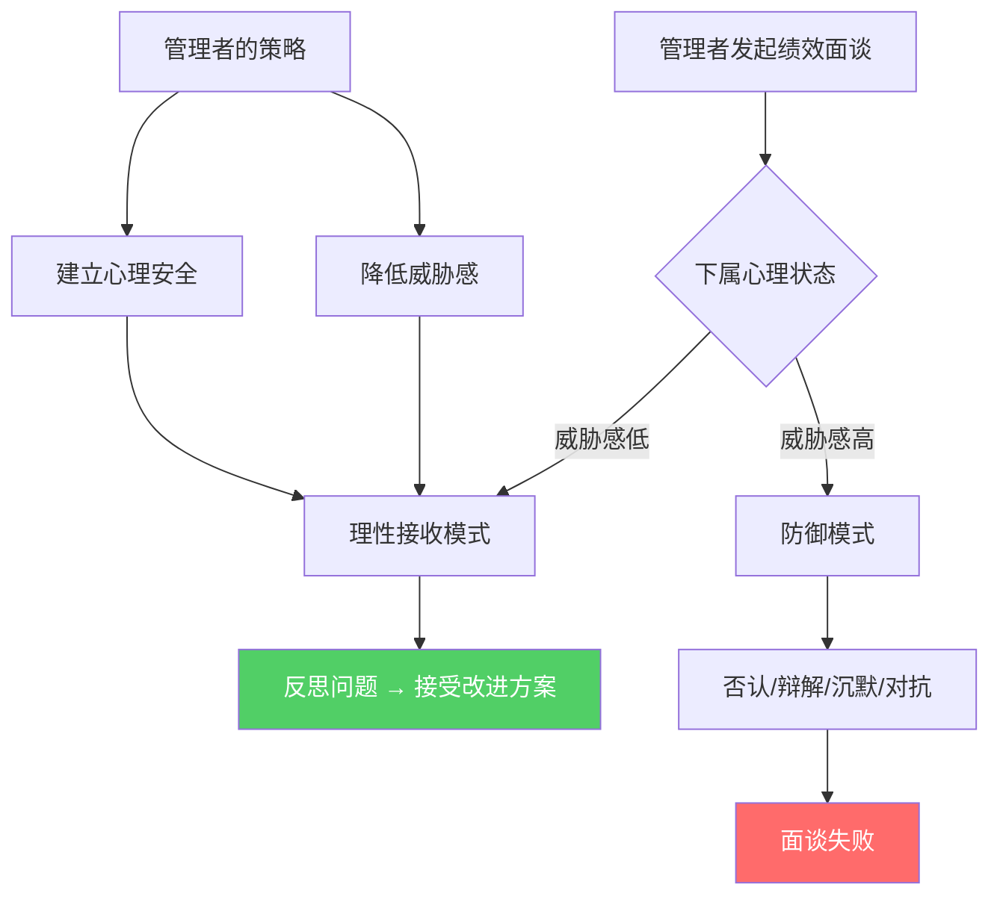
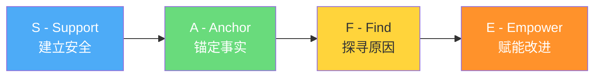
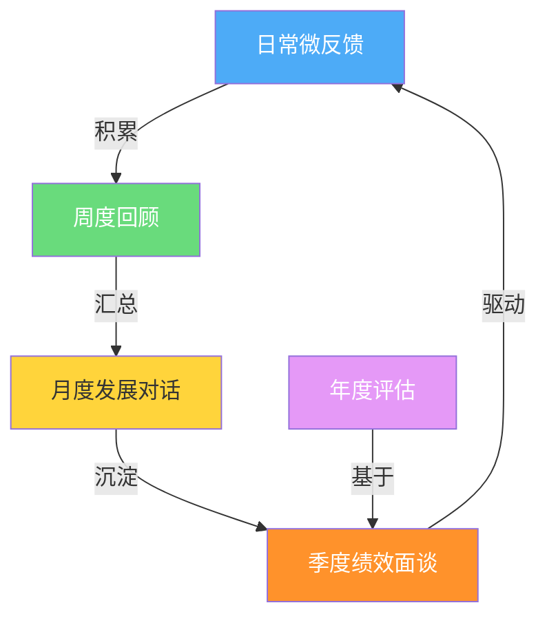

## 案例五：绩效面谈——与表现不佳的下属谈话

绩效面谈是管理者最具挑战性的沟通场景之一。与表现不佳的下属谈话，既要让对方清醒认识到问题，又不能摧毁其工作动力；既要传递组织的期望，又要展现支持的诚意。这种谈话的失败率极高——盖洛普调查显示，仅14%的员工认为绩效面谈激励了自己改进，近半数管理者自认不擅长这类谈话。本案例将从理论框架到实操话术，系统拆解这一高难度场景的应对方法。

### 为什么绩效面谈如此困难

#### 心理机制分析

绩效面谈之所以困难，根源在于它触发了人类最深层的心理防御机制：

**威胁响应（Threat Response）**：神经科学研究表明，当人感知到评价性威胁时，大脑杏仁核会激活"战斗或逃跑"反应，前额叶皮层（负责理性思考）的活动显著降低。这意味着批评会直接降低对方的理性接收能力。

**自我服务偏差（Self-Serving Bias）**：人倾向于将成功归因于自身能力，将失败归因于外部因素。当管理者指出问题时，下属的本能反应是寻找外部借口，而非反思自身。

**公平世界假设（Just-World Hypothesis）**：人天然认为"付出应有回报"。当一个态度认真但产出不足的下属被告知绩效不达标时，会产生强烈的不公平感——"我已经很努力了，凭什么？"

理解这些机制，是设计有效面谈话术的前提。你的目标不是"说服"下属接受批评，而是绕过心理防御，让理性对话成为可能。



#### 绩效面谈失败的五种典型模式

| 失败模式 | 管理者行为 | 下属反应 | 后果 |
|----------|-----------|---------|------|
| 突然袭击型 | 平时不说，面谈时集中批评 | "你怎么不早说？" | 信任崩塌 |
| 和稀泥型 | 模糊表达，回避核心问题 | "所以到底哪里有问题？" | 问题持续 |
| 审判型 | 单方面宣判，不给解释机会 | 沉默或对抗 | 关系破裂 |
| 威胁型 | 用后果施压，不给支持方案 | 恐惧但无力改变 | 离职或摆烂 |
| 老好人型 | 全程表扬，问题一笔带过 | "那还谈什么？" | 问题恶化 |

### 面谈前的准备工作

#### 信息收集清单

高效的绩效面谈，70%的功夫在谈话之前。你需要准备以下材料：

**客观数据（硬指标）**：
- 任务完成量与团队平均值的对比（需要具体数字，不能说"偏低"）
- 项目交付质量指标（bug率、返工率、客户满意度评分）
- 时间管理数据（延期次数、加班时长与产出的比率）
- 关键里程碑的达成情况（达成/未达成/部分达成）

**行为观察记录（软指标）**：
- 具体的工作行为事例（至少准备3个正面+3个待改进的事例）
- 团队协作中的具体表现（会议参与度、知识分享、跨部门配合）
- 与上一评估周期的对比变化

**原因假设分析**：

在谈话前，管理者应该根据观察形成初步的假设，但要保持开放心态：

| 可能原因 | 观察信号 | 验证方法 |
|----------|---------|----------|
| 技能不足 | 重复性错误、同类任务耗时长 | 安排技能评估或让其演示工作流程 |
| 任务不匹配 | 某类任务表现好、某类差 | 回顾任务分配与个人优势的匹配度 |
| 个人问题 | 突然变化、情绪波动 | 谈话中观察，适度关心但不过问隐私 |
| 动力不足 | 敷衍了事、缺乏主动性 | 探讨职业发展和兴趣方向 |
| 资源不足 | 抱怨工具/信息/支持不够 | 了解实际工作环境和资源供给 |
| 目标不清 | 做了但做的方向不对 | 回顾目标传达是否清晰 |
| 身心健康 | 频繁请假、状态低迷 | 关心而非调查，建议EAP |

#### 面谈环境设置

**时间选择**：
- 避开周一早上（周末情绪缓冲期刚过）和周五下午（周末前的焦虑）
- 预留充足时间，至少45-60分钟，不要被下一个会议催促
- 选在对方不太忙的时间段，避免工作压力叠加

**空间选择**：
- 私密会议室，确保隔音，避免被路过的同事听到
- 圆桌或并排座位优于面对面（减少对立感）
- 确保手机静音，门关好，不被打断

**心理准备**：
- 明确谈话目标：是帮助改进，不是发泄不满
- 预设对方可能出现的反应（否认、沉默、愤怒、哭泣），提前准备应对策略
- 调整自己的情绪状态，确保当天不带个人负面情绪进入谈话

### 面谈话术的四层结构

绩效面谈不是一次性的"告知"，而是一个有层次的沟通过程。推荐采用**SAFE框架**：



#### 第一层：Support（建立安全）

**目标**：降低对方的防御心理，建立"我是来帮你"的基本共识。

**话术原则**：
- 先肯定具体的努力和贡献，而非泛泛表扬
- 说明面谈的目的不是批评，而是共同解决问题
- 表达你作为管理者的责任——帮助团队成员成长

**参考话术**：

> "小林，谢谢你抽时间来聊。这半年你在XX项目上的投入我是看到的，特别是那几次加班赶进度的时候，你的态度一直很认真。今天我想和你坦诚地聊聊工作上的一些情况，目的是看看我能怎么帮你把事情做得更顺。这不是批评会，是我们一起找办法。"

**关键细节**：
- "谢谢你抽时间"——尊重对方的时间，建立平等感
- "我是看到的"——让对方知道努力被看见了
- "我能怎么帮你"——定位为支持者而非审判者
- "一起找办法"——强调协作而非命令

#### 第二层：Anchor（锚定事实）

**目标**：用客观数据呈现问题，让对方无法否认事实，但不攻击人格。

**话术原则**：
- 只描述行为和结果，不评价人格（"任务延期了"而非"你不靠谱"）
- 用具体数据对比，不用模糊词（"完成了12个模块，团队平均18个"而非"效率偏低"）
- 一次只聚焦1-2个核心问题，不要列清单式地罗列所有问题

**参考话术**：

> "我想和你看看一些数据。这半年你完成了12个项目模块，团队的平均水平是18个。差距主要集中在XX类任务上——这类任务你的平均耗时是其他同事的1.5倍。另外，有3次任务延期超过了计划时间的20%。这些数据说明在效率和时间管理上有一些提升空间。"

**关键细节**：
- "我想和你看看"——邀请对方一起看数据，而非单方面宣判
- "差距主要集中在XX类任务"——定位具体问题领域，不是全面否定
- "提升空间"——积极表述，不是"问题"而是"空间"

**数据呈现的黄金法则**：

| 原则 | 正确做法 | 错误做法 |
|------|---------|---------|
| 具体化 | "完成12个模块" | "做得不够多" |
| 对比化 | "团队平均18个" | "比别人少" |
| 时效化 | "近三个月延期3次" | "经常延期" |
| 影响化 | "导致下游测试延迟一周" | "影响了进度" |
| 非人格化 | "任务交付有延迟" | "你这个人拖延" |

#### 第三层：Find（探寻原因）

**目标**：给下属充分表达的机会，了解问题背后的真实原因。

**话术原则**：
- 用开放式问题，不用引导性问题
- 真正倾听，不急着反驳或给建议
- 不要预设原因，让对方自己说

**参考话术**：

> "这些数据背后，我想听听你的看法。你觉得是什么原因导致了这些情况？在工作中有没有遇到什么困难是我可能不了解的？"

**追问话术（根据对方回答选择使用）**：

- 对方说了原因后："你能举个具体的例子吗？"
- 对方归因于外部："除了这个因素，你觉得还有哪些方面可以调整？"
- 对方沉默不语："没关系，可以慢慢想。我问这个问题是真心想了解情况，不是要追责。"
- 对方情绪激动："我理解你的感受。我们先不急着下结论，你觉得怎样才能改善这个情况？"

**不同原因的应对策略**：

| 下属给出的原因 | 管理者的回应思路 |
|---------------|----------------|
| "任务太难了" | "具体是哪部分让你觉得困难？我们看看能否拆解或提供支持" |
| "时间不够" | "你的时间主要花在哪里了？我们一起看看优先级是否合理" |
| "不知道标准是什么" | "这是我的失误，目标传达不够清晰。我们一起明确一下" |
| "家里有事" | 表示理解，讨论是否需要调整工作安排，不追问细节 |
| "觉得没意义" | 了解动机问题，讨论职业发展方向和兴趣匹配 |
| 沉默/否认 | 不要逼迫，换个角度提问，或分享你自己的观察 |

#### 第四层：Empower（赋能改进）

**目标**：共同制定具体、可执行、有时间表的改进方案，让下属感到"有路可走"。

**话术原则**：
- 让下属参与方案制定（参与感带来承诺感）
- 方案必须具体到行动、时间、检查点
- 提供实际支持资源，不只是口头鼓励

**参考话术**：

> "谢谢你的坦诚。基于刚才的讨论，我建议我们一起制定一个改进计划。我有三个想法：
>
> 第一，接下来一个月，我安排老周带你做两个XX类项目。他是这方面的专家，你可以学习他的工作方法，遇到问题随时请教。
>
> 第二，每周五下午我们花15分钟做个简短回顾。你告诉我这周的进展和遇到的困难，我帮你协调资源。这个不是考核，是同步。
>
> 第三，如果需要参加相关培训，我可以帮你申请。你觉得这个计划可行吗？你有什么想补充的？"

**关键细节**：
- "我有三个想法"——具体数量让对方觉得准备充分
- "老周带你"——提供人际支持，不只是文件培训
- "每周15分钟"——频率高但时间短，降低压力
- "不是考核，是同步"——消除对定期检查的恐惧
- "你觉得可行吗"——邀请参与，增加承诺

### 案例全流程演练

#### 场景设定

孙经理需要和下属小林进行半年度绩效面谈。小林工作态度认真，经常加班，但近半年工作产出明显低于团队平均水平——效率不高，同样的任务需要更多时间，多次延期。

#### ❌ 错误示范

> "小林，你的绩效评分是C。说实话，你这半年的表现不太行，效率太低了，别人都能按时完成的工作，你总是要加班。你要好好反思一下，下个半年必须改进，否则就很难办了。"

**逐句拆解问题**：

| 原话 | 问题 | 心理效应 |
|------|------|---------|
| "你的绩效评分是C" | 开场直接亮分数，像宣判 | 立刻激活防御机制 |
| "你的表现不太行" | 模糊的否定评价 | 对方不知道具体哪里不行 |
| "效率太低了" | 贴标签而非描述行为 | 被攻击人格而非行为 |
| "别人都能按时完成" | 比较式批评 | 激发羞耻感和不公平感 |
| "你要好好反思" | 单方面命令 | 没有具体方向，无从反思 |
| "否则就很难办了" | 模糊威胁 | 恐惧而非动力，且没有出路 |

#### ✅ 正确示范

**完整对话流程**：

**【开场：建立安全（3分钟）】**

> 孙经理："小林，谢谢你抽时间来。这半年你在XX项目上付出的努力我是看到的，特别是10月份那两周加班赶交付的时候，你的态度一直很认真。今天我想和你聊聊半年来的工作情况，看看我能怎么帮你把事情做得更顺。"

**【数据呈现：锚定事实（5分钟）】**

> "我们先看看这半年的数据。你完成了12个项目模块，团队平均水平是18个。差距主要集中在XX类任务上，这类任务你的平均耗时是其他同事的1.5倍。另外，有3次任务延期超过了计划时间的20%，其中两次影响到了下游测试环节的安排。"

**【暂停：给对方反应时间（注意观察表情和肢体语言）】**

**【探寻原因（10-15分钟）】**

> "这些数据背后，我想听听你的看法。你觉得是什么原因？在工作中有没有遇到什么困难是我不了解的？"

*（假设小林回应：XX类任务我不太熟悉，每次都要花很多时间查资料和试错，而且有时候需求不清晰，做完了又返工。）*

> "明白了。你说的需求不清晰这个点，能举个最近的例子吗？"

*（小林举例）*

> "这个确实是个问题，需求传达不清楚会导致大量无效工作。这是我们需要一起解决的。除了这个，你觉得在XX类任务的技能上，自己和团队里做得好的同事相比，差距主要在哪里？"

*（小林回应）*

> "谢谢你的坦诚。你提到的这些——技能提升、需求清晰度、还有工作方法——都是可以改善的。"

**【共同制定改进方案（10分钟）】**

> "基于刚才的讨论，我建议三个方向：
>
> 第一，针对XX类任务的技能差距，我安排老周下个月带你做两个项目。他是团队里这方面最熟练的，你可以跟着他的节奏学习，有问题随时请教。一个月后我们评估一下效果。
>
> 第二，需求传达的问题，我来解决。以后每个任务开始前，我会安排一个15分钟的需求对齐会，你、我、产品经理三方确认。如果中途需求变更，你有权要求重新对齐，不用自己消化。
>
> 第三，每周五下午花15分钟做个简短回顾，你告诉我本周进展和困难，我帮你协调资源。这不是考核，是我们之间的同步机制。
>
> 你觉得这个方案可行吗？有什么想调整的？"

*（小林回应）*

> "好的，那就这么定了。一个月后我们做个中期回顾，看看效果。小林，我对你是有信心的，你态度认真，执行力也不差，这次面谈的目的是帮你找到瓶颈点然后突破它。我们一起努力。"

**【收尾：明确共识（2分钟）】**

> "最后确认一下今天的共识：第一，老周下月带你做两个XX类项目；第二，每个任务前开需求对齐会；第三，每周五15分钟回顾。我今天会把这些写进你的发展计划里，你也留一份。有问题随时找我。"

#### 改进方案对比表

| 维度 | 错误示范 | 正确做法 | 效果差异 |
|------|---------|---------|---------|
| 开场 | 直接亮分数 | 先肯定具体努力 | 降低防御 vs 激发对抗 |
| 问题描述 | "效率太低" | "完成12个模块，平均18个" | 笼统否定 vs 客观呈现 |
| 原因探究 | 无 | 开放式提问+追问 | 单方面判决 vs 双向对话 |
| 解决方案 | "好好反思" | 三人具体行动计划 | 无方向 vs 有路径 |
| 威胁/支持 | "很难办" | "我对你有信心" | 恐惧驱动 vs 信任驱动 |
| 书面确认 | 无 | 形成发展计划 | 口头说说 vs 落实到位 |

### 不同场景的话术变体

#### 场景一：态度问题（能力OK但态度消极）

这类员工有能力完成工作，但投入度不够，表现为敷衍了事、缺乏主动性。

> "小林，你的专业能力我是认可的，XX项目的技术方案你做得很漂亮。但我注意到最近几个任务的完成质量有一些波动，比如YY任务的文档比之前的水平粗糙了不少。我很好奇——是不是最近工作上有什么事情影响了你的状态？"

**策略**：先肯定能力，让对方知道你知道他能做到，然后用对比制造落差——"你之前能做到这个水平，现在为什么没有？"这比直接批评有效得多。

#### 场景二：突然下滑（之前表现好，近期急剧恶化）

> "小林，我想和你聊聊。上个季度你的表现是团队前列的，但这三个月数据有些变化——完成了5个模块，之前同期是10个。这个变化比较明显，我关心的是：是不是发生了什么事情？"

**策略**：用数据对比突出变化，表达关心而非指责。这类突然下滑往往有外部原因（家庭、健康、职业倦怠），管理者需要先了解再判断。

#### 场景三：持续低迷（入职以来一直表现不佳）

> "小林，今天想和你聊聊入职以来的工作情况。你来公司半年了，从数据看，目前的产出和我们岗位的要求还有一些差距。我想和你一起分析一下，看看是哪些因素在影响你的发挥。"

**策略**：这类情况需要认真评估是否为岗位匹配问题。谈话目标不只是"改进"，还要判断是否需要调整岗位、重新设定期望，或进入正式的绩效改进计划（PIP）。

#### 场景四：能力不足但态度好（小林的情况）

这是本案例的核心场景，详细话术见上方"正确示范"部分。核心策略：

1. 肯定态度 → 保护积极性
2. 定位具体差距 → 不全面否定
3. 提供具体支持 → 帮助而非施压
4. 设定检查点 → 确保改进落地

### 面谈中的棘手情况应对

#### 对方否认问题

**下属说**："我觉得我做得还可以啊，只是标准不一样而已。"

**应对**：
> "我理解你的感受。我们来看看具体的数据——这是团队所有人的完成量，这是你的。你觉得这个差距可能是什么原因造成的？"

**策略**：用数据而非观点回应，把"对不对"的问题转化为"怎么看数据"的讨论。

#### 对方情绪激动/哭泣

**应对**：
> "没关系，我理解这个话题可能让你不舒服。我们不急，可以暂停一下。你先喝杯水。"

**策略**：递纸巾、倒水、暂停话题但不结束面谈。等情绪平复后继续，不要因为尴尬就草草结束。如果对方持续无法平复，可以约第二天继续。

#### 对方反过来指责管理

**下属说**："我觉得是团队管理有问题，任务分配不公平。"

**应对**：
> "你提到的这个点很重要，我愿意听。你能具体说说哪些方面你觉得不公平吗？如果确实存在管理上的问题，我需要知道才能改进。同时，我们也需要回到你个人的改进计划上来，这两个事情我们都会处理。"

**策略**：不要否认对方的反馈，认真倾听并记录。但同时把谈话拉回核心议题——个人改进方案。

#### 对方完全沉默

**应对**：
> "我注意到你没有说话，没关系。这个话题可能需要消化一下。我换个方式问——如果让你给自己这半年的工作打个分，你会打多少？为什么？"

**策略**：换一种提问方式，用"自评"降低压力。如果持续沉默，可以给对方时间思考，或转为书面反馈形式。

### 面谈后的跟进机制

绩效面谈不以谈话结束为终点，后续跟进才是改进落地的关键。

#### 48小时内必做事项

- [ ] 将面谈共识形成书面文档，发给下属确认
- [ ] 安排承诺的支持资源（如本案例中的"老周带教"）
- [ ] 设置定期回顾的日历邀请（如每周五的15分钟同步）
- [ ] 如有必要，与HR同步面谈情况（特别是涉及PIP时）

#### 跟进沟通的频率和内容

| 时间节点 | 沟通内容 | 形式 |
|----------|---------|------|
| 每周 | 本周进展、遇到的困难、需要的支持 | 15分钟简短面谈或消息 |
| 第2周 | 初步观察：改进方向是否正确 | 非正式沟通 |
| 第1个月 | 中期回顾：数据是否有改善趋势 | 正式面谈，30分钟 |
| 第2个月 | 持续跟踪：改进是否稳定 | 面谈或书面评估 |
| 第3个月 | 最终评估：达标/继续改进/进入PIP | 正式面谈，带数据 |

#### 改进计划文档模板

```markdown
# 绩效改进计划

**员工**：小林
**制定日期**：2024-06-15
**评估周期**：2024-06-15 至 2024-09-15
**管理者**：孙经理

## 当前差距
- 项目模块完成量：12个（团队平均18个）
- XX类任务平均耗时：团队平均值的1.5倍
- 任务延期次数：3次（超过计划时间20%）

## 改进目标
1. 第1个月末：XX类任务耗时降至团队平均值的1.2倍以内
2. 第2个月末：项目模块完成量达到15个/月
3. 全周期内：任务延期次数≤1次

## 支持措施
1. 老周带教：7月起，带做2个XX类项目
2. 需求对齐会：每个任务开始前15分钟三方确认
3. 每周五15分钟进展回顾
4. 如需培训，由管理者申请资源

## 检查点
- 7月15日：中期回顾（第1次）
- 8月15日：中期回顾（第2次）
- 9月15日：最终评估

## 签字确认
- 员工签字：______  日期：______
- 管理者签字：______  日期：______
```

### 管理者的自我反思清单

在每次绩效面谈之后，管理者应该花10分钟回答以下问题：

1. **准备充分吗？** 我是否带了具体数据，还是凭印象谈话？
2. **倾听够多吗？** 谈话中我说话的比例是否超过了60%？
3. **情绪管理如何？** 我是否在某个时刻失去了耐心或产生了评判？
4. **方案可执行吗？** 制定的改进计划是否具体、有资源、有时间表？
5. **后续有保障吗？** 我是否设置了检查机制，还是"谈完就忘"？

### 常见误区与纠正

#### 误区一：把面谈当惩罚

**错误认知**："绩效面谈就是让他知道自己不行。"

**正确认知**：绩效面谈是管理工具，目的是帮助下属回到正轨。如果面谈后对方没有变得更清晰、更有方向、更有支持，那这次面谈就是失败的。

#### 误区二：用"三明治法"包装批评

**错误做法**："你做得很好（表扬），但是效率太低（批评），不过我对你有信心（表扬）。"

**问题**：三明治法已被广泛认知，下属听到表扬后会立刻等待"但是"，导致表扬失效，批评也被防御性地过滤。

**正确做法**：直接但友善。分开肯定和改进讨论，让每部分都真实可信。

#### 误区三：面谈后不做跟进

**错误做法**：谈完一次，然后等半年后的下一次绩效评估。

**问题**：没有跟进的面谈等于没有面谈。改进需要持续的支持和反馈，不是一次对话就能改变的。

**正确做法**：面谈后48小时内形成书面计划，设置至少每两周一次的检查点，持续3个月。

#### 误区四：只谈结果不谈过程

**错误做法**："你的KPI没达标，必须提高。"

**问题**：只强调结果，不分析过程中的障碍，下属会感到无助——"我知道没达标，但不知道怎么提高"。

**正确做法**：拆解过程——"你在这类任务上花了多少时间？主要卡在哪个环节？我们能不能优化这个环节？"

#### 误区五：回避不舒服的对话

**错误做法**：拖了几个月才谈，或者因为怕冲突而把问题说得轻描淡写。

**问题**：越晚谈，问题积累越大，下属也越困惑——"既然这么严重，为什么你之前不说？"

**正确做法**：发现问题及时沟通。日常的一对一沟通中就应该传递反馈，不要等到正式绩效面谈才"集中爆发"。

### 进阶：从绩效面谈到教练式管理

成熟的管理者不会等到绩效面谈才处理问题。他们把反馈融入日常管理，形成**教练式管理风格**：

**日常微反馈（每天）**：
- "今天这个方案的思路很好，特别是XX部分"
- "这个任务的排期可以更保守一点，下次留一天buffer"

**周度回顾（每周）**：
- "本周完成了3个任务，重点表扬XX；下周注意YY的风险点"

**月度发展对话（每月）**：
- "这个月你最大的成长是XX；下个月我们试试让你主导YY项目"

**季度绩效面谈（每季度）**：
- 汇总数据、回顾目标、制定下季度计划



当日常反馈做到位时，季度绩效面谈就不会出现"意外"——双方对情况都有清晰的预期，面谈变成一个正式的总结和规划环节，而不是一次紧张的"宣判"。

### 核心要点回顾

1. **面谈是系统工程**：70%的功夫在准备——数据、原因假设、环境、自己的情绪状态
2. **用SAFE框架组织对话**：Support（安全）→ Anchor（事实）→ Find（原因）→ Empower（方案）
3. **数据说话，不贴标签**："完成12个模块，平均18个"永远比"效率太低"有效
4. **探寻原因比指出问题更重要**：找到根因才能制定有效方案
5. **方案必须具体**：谁做什么、什么时候、怎么检查，缺一不可
6. **面谈只是起点**：后续跟进机制才是改进落地的关键
7. **日常反馈是最好的预防**：等到正式面谈才说问题，说明管理已经滞后了
