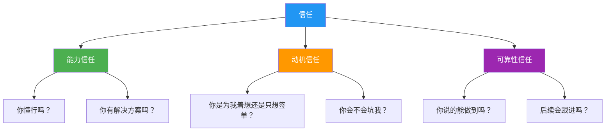
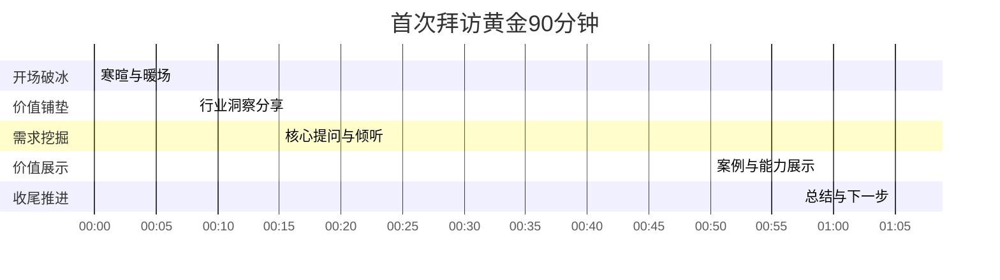

## 案例七：客户拜访——首次拜访重要客户

首次拜访重要客户是商业沟通中最具战略价值的场景之一。心理学研究表明，人们在初次见面的前7秒内就会形成对你的第一印象，而这个印象一旦形成，后续需要8-12次正面互动才能改变。对于B2B业务而言，首次客户拜访的成败往往直接决定了数百万甚至数千万的合作机会。掌握首次拜访的沟通艺术，是每一位商务人士的必修课。

### 首次拜访的战略意义

#### 为什么首次拜访如此关键

首次拜访不是一次简单的"见面聊聊"，它承载着多重战略目标：

| 目标层级 | 具体内容 | 权重 |
|---------|---------|------|
| 核心目标 | 建立信任基础，让客户愿意继续接触 | 40% |
| 关键目标 | 了解客户真实需求和决策链 | 30% |
| 重要目标 | 展示专业能力，差异化定位 | 20% |
| 附加目标 | 获取竞争情报，了解市场动态 | 10% |

很多销售人员犯的第一个错误就是把首次拜访当作"推销机会"。实际上，首次拜访的本质是**信任投资**——你在用专业、真诚和价值换取客户对你的认可，而不是用产品资料换取订单。

#### 首次拜访的心理学基础

信任的建立遵循"信任三角"模型：

首次拜访的核心任务是在这三个维度上同时得分，而不是只展示能力。

---

### 拜访前：七步准备法

首次拜访的成败，80%取决于准备阶段。以下是系统化的准备框架：

#### 第一步：客户背景深度调研

不要只看公司官网的"关于我们"。真正有价值的调研应该覆盖以下维度：

**企业层面调研清单：**

- **经营状况**：最近一年的营收、利润、增长率（上市公司查财报，非上市公司查工商信息、行业报告）
- **战略动向**：近期的并购、新业务线、组织架构调整、高管变动
- **行业地位**：市场份额、竞争格局、上下游关系
- **痛点信号**：媒体报道中的负面信息、招聘岗位暗示的需求、行业政策影响
- **文化特征**：企业价值观、管理风格（狼性/温和）、决策模式（集权/分权）

**关键人物调研清单：**

- **王总的公开信息**：LinkedIn/脉脉资料、公开演讲、发表文章、媒体报道
- **职业轨迹**：从哪里来、做过什么项目、管理风格如何
- **个人偏好**：通过共同联系人了解沟通风格偏好
- **决策角色**：是最终决策者、影响者、还是守门人？

**调研工具推荐：**

| 工具/渠道 | 获取信息类型 | 成本 |
|-----------|-------------|------|
| 天眼查/企查查 | 工商信息、股东结构、司法风险 | 免费/付费 |
| 上交所/深交所 | 财报、公告（上市公司） | 免费 |
| 行业研究报告 | 市场趋势、竞争格局 | 免费/付费 |
| LinkedIn/脉脉 | 关键人背景、人脉关系 | 免费 |
| 36氪/虎嗅 | 企业动态、行业新闻 | 免费 |
| 共同联系人 | 内部信息、个人偏好 | 人脉成本 |

#### 第二步：明确拜访目标

首次拜访的目标应该是**具体的、可衡量的、现实的**。以下是一个目标设定框架：

【首次拜访目标模板】

主要目标：了解客户在XX方面的真实需求和优先级
次要目标：确认决策链和采购流程
底线目标：获得第二次见面的机会

成功标准（量化）：
□ 获得至少3个具体的需求信息
□ 了解决策链中的至少3个关键角色
□ 获得客户承诺的下一步时间点
□ 客户主动分享了至少1个非公开信息

风险预案：
□ 如果客户时间紧张：准备5分钟精简版开场
□ 如果客户态度冷淡：准备2-3个行业洞察作为破冰
□ 如果竞品已介入：准备差异化价值话术

#### 第三步：准备价值弹药

不要带一堆公司宣传册。准备以下"价值弹药"：

**行业洞察报告**：针对客户行业准备一份简短的洞察（3-5页PPT），展示你对行业的理解深度。这不是公司介绍，而是"我懂你的行业"的证明。

**对标案例**：准备2-3个同行业或类似场景的成功案例，每个案例包含：背景、挑战、方案、量化结果。案例要能直接映射到客户的潜在需求。

**问题清单**：准备10-15个高质量的问题，按优先级排序。好的问题比好的陈述更有价值。

#### 第四步：模拟演练

找同事扮演客户，进行至少2轮模拟拜访。重点练习：

- 开场白的自然度（不是背诵）
- 提问的节奏和深度
- 倾听时的反应和追问
- 处理刁钻问题的能力
- 时间控制能力

#### 第五步：物料准备

**必带物料清单：**

- 名片（确保数量充足、信息正确）
- 笔记本和笔（用于记录，展示重视）
- iPad/笔记本电脑（展示案例用，但不要一上来就打开）
- 行业洞察材料（打印版，方便客户翻阅）
- 公司介绍（精简版，不超过5页）

**不建议带的东西：**

- 大量产品手册（首次拜访用不上）
- 合同或报价单（太早，会让客户警觉）
- 礼品（首次拜访送礼可能适得其反，除非有文化惯例）

#### 第六步：形象管理

着装原则：**比客户高半级**。

- 如果客户穿商务休闲，你穿商务正装
- 如果客户穿商务正装，你穿高级商务装
- 如果客户穿工装/制服，你穿商务休闲

其他细节：提前确认地址和交通，至少提前15分钟到达；确认会议室预订；了解停车或门禁信息。

#### 第七步：预热联络

拜访前1-3天，通过邮件或微信发送一条简短的预热信息：

> 王总您好，我是XX公司的陈晨。非常期待明天下午2点的见面。为了更高效地利用您的时间，我已经提前做了一些行业调研，准备了几个问题想向您请教。如果方便的话，您能否简要告诉我目前最关注的方向？这样我可以更有针对性地准备。感谢！

这条信息的目的：展示专业性、降低客户的防御心理、获取提前信息。

---

### 拜访中：黄金90分钟框架

首次拜访的理想时长是60-90分钟。以下是经过验证的时间分配框架：

#### 阶段一：开场破冰（前8分钟）

开场的核心任务是**消除陌生感，建立舒适氛围**。

**三步破冰法：**

1. **感谢+认可**（2分钟）：真诚感谢对方的时间，提及你对其工作的认可
2. **共同连接点**（3分钟）：找到共同认识的人、共同经历、或共同关注的话题
3. **目的预告**（3分钟）：简短说明今天的拜访目的，降低对方的防御心理

#### 阶段二：价值铺垫（8-15分钟）

在进入正式提问前，用一个行业洞察或趋势分析来展示你的专业性。这不是推销，而是"我懂你的行业"的证明。

**示例话术：**

> "王总，在来之前我研究了一下咱们行业的最新动态。我发现一个有意思的趋势——今年头部制造企业的数字化投入平均增长了40%，但实际ROI达到预期的不到30%。您怎么看这个现象？"

这个话术的设计逻辑：

- 展示你做了功课（专业性）
- 引出一个有争议的话题（激发讨论欲）
- 用提问结尾（把话语权交给客户）

#### 阶段三：需求挖掘（15-50分钟）

这是首次拜访最核心的阶段。目标是**深入了解客户的真实需求、决策逻辑和优先级**。

**SPIN提问法**是这个阶段的最佳工具：

| 提问类型 | 目的 | 示例 |
|---------|------|------|
| Situation（情境问题） | 了解现状 | "目前贵公司的XX流程是怎么运作的？" |
| Problem（问题问题） | 发现痛点 | "在这个过程中，您觉得最大的挑战是什么？" |
| Implication（影响问题） | 放大痛点 | "这个问题如果不解决，对业务的影响有多大？" |
| Need-payoff（需求回报） | 引导需求 | "如果能找到解决方案，您期望达到什么效果？" |

**深度追问技巧：**

当客户回答一个问题后，不要急着问下一个，用以下方式追问：

- **"能具体说说吗？"**——获取更多细节
- **"这种情况多久了？"**——了解问题的持续时间
- **"之前尝试过什么解决方案？"**——了解历史和竞争情况
- **"您觉得根本原因是什么？"**——了解客户的认知深度
- **"如果打分的话，1-10分您觉得这个问题的紧迫性是几分？"**——量化优先级

**倾听的黄金法则：**

- 客户说话时，保持眼神接触，不要看手机或电脑
- 用点头、"嗯"、"我理解"等信号表示在听
- 关键信息要记录下来（让客户看到你在记）
- 不要打断客户，即使他说的不对
- 客户说完后，先复述确认，再追问

#### 阶段四：价值展示（50-65分钟）

在充分了解需求后，有针对性地展示你的能力。注意：不是全面介绍公司，而是**精准匹配客户提到的需求**。

**展示框架：**

> "根据您刚才提到的XX问题，我想分享一个类似的案例。[简述案例背景]，他们面临的情况和贵公司很相似，[具体说明相似点]。当时我们采取的方案是[简述方案]，最终帮助他们在[具体指标]上提升了[具体数字]。"

展示时的关键原则：

- **用案例而非理论**：客户相信事实，不相信道理
- **量化结果**：说"提升了30%"比说"显著提升"有力100倍
- **保持谦逊**：说"仅供参考"而不是"我们一定能解决"
- **留有余地**：说"需要进一步了解才能给出针对性建议"

#### 阶段五：收尾推进（65-75分钟）

收尾的质量决定了是否有下一次见面。以下是收尾的标准流程：

**第一步：总结要点**（2分钟）

> "王总，今天收获很大。我总结一下，您目前主要关注三个方向：第一是XX，第二是XX，第三是XX。不知道我理解的是否准确？"

**第二步：确认下一步**（3分钟）

> "基于今天的沟通，我觉得下一步可以这样安排：我会整理一份针对XX问题的初步思路，下周三之前发给您。如果方便的话，下周四或周五，我可以带我们的技术专家再来一次，更深入地讨论技术细节。您看这个安排可以吗？"

**第三步：留下钩子**（2分钟）

> "另外，我们下周有一个关于XX行业的闭门研讨会，邀请了几位行业专家分享最新的趋势和实践。我回去确认一下名额，如果方便的话，想邀请您参加。"

**第四步：礼貌告别**（3分钟）

- 再次感谢客户的时间
- 询问是否需要帮忙叫车或带路
- 主动握手告别
- 如果客户送你到电梯，不要拒绝（这是社交礼仪）

---

### 案例全景演示

#### 场景设定

陈晨是一家管理咨询公司的高级顾问，需要第一次拜访大型制造企业的高管王总。王总是一家年营收50亿的制造集团副总裁，分管运营和数字化。陈晨的目标是了解客户需求、建立信任关系，为后续合作打下基础。

#### ❌ 错误示范

> （坐下后直接开始推销）
>
> "王总，我们公司是国内领先的管理咨询公司，服务过500多家企业，涵盖战略规划、组织变革、数字化转型等领域。我们有独特的方法论和工具，一定能帮助贵公司提升管理水平。这是我们公司的介绍材料，您可以看看。"

**逐句问题分析：**

| 原文 | 问题 | 本质 |
|------|------|------|
| "我们公司是国内领先的管理咨询公司" | 自我吹嘘，没有事实支撑 | 缺乏可信度 |
| "服务过500多家企业" | 数字堆砌，没有关联性 | 没有回答"跟我有什么关系" |
| "涵盖战略规划、组织变革..." | 面面俱到，没有重点 | 信息过载 |
| "一定能帮助贵公司" | 过度承诺 | 引发警觉和不信任 |
| "这是我们的介绍材料" | 主动给材料 = 结束对话 | 放弃了沟通主导权 |

#### ✅ 正确示范（完整版）

**【开场破冰】**

> "王总，非常感谢您抽出宝贵时间。说实话，能约到您的时间挺不容易的，我知道您最近在推智能制造二期项目，肯定非常忙。"
>
> （停顿，观察反应）
>
> "另外，我注意到您上个月在行业峰会上做的那个演讲，关于'传统制造企业的数字化路径'，里面有几个观点我特别认同，尤其是您说的'数字化不是技术问题，是组织问题'。这个洞察非常深刻。"

**设计逻辑**：展示做了功课（提到具体事件）+ 真诚认可（引用其观点）+ 创造共鸣点

**【价值铺垫】**

> "在来之前，我特意研究了一下咱们行业的数字化转型情况。有一个数据挺有意思——去年行业里有70%的企业启动了智能制造项目，但真正达到预期效果的不到20%。失败的主要原因不是技术选型，而是组织变革跟不上。"
>
> （停顿）
>
> "您怎么看这个现象？"

**设计逻辑**：用数据说话 + 引出客户关心的话题 + 把话语权交给客户

**【需求挖掘】**

> 王总："你说的这个问题确实是我们的痛点。我们二期项目推了半年，技术层面进展很快，但一线员工的抵触情绪很大，很多新的数字化工具推不下去。"
>
> 陈晨："能具体说说抵触主要表现在哪些方面吗？"
>
> 王总："主要是两个方面。一是老员工习惯了原来的流程，不愿意学新系统；二是基层管理者觉得新系统增加了他们的工作量，没有看到好处。"
>
> 陈晨："这种情况在行业内其实很普遍。我好奇的是，你们之前尝试过什么方法来解决这个问题？"
>
> 王总："我们做过培训，也搞过竞赛，效果都不太好。"
>
> 陈晨："如果打分的话，1-10分，您觉得这个问题的紧迫性是几分？"
>
> 王总："8分。如果不解决，二期项目的ROI会大打折扣。"

**设计逻辑**：用SPIN法层层深入 + 用打分量化紧迫性 + 让客户自己说出问题的严重性

**【价值展示】**

> "王总，感谢您这么详细的分享。您提到的这个组织变革问题，我们之前帮助过一家类似的制造企业解决过。"
>
> "那家企业的规模和贵公司差不多，也是在推进智能制造的过程中遇到了员工抵触的问题。当时他们的情况可能比贵公司还严重——一线员工的离职率因为数字化改革上升了15%。"
>
> "我们当时采取的方案是'双轨制变革管理'——不强制切换，而是让新旧系统并行运行3个月，同时在每个车间培养2-3个'数字化先锋'，让他们用实际效果去影响同事。3个月后，新系统的使用率从30%提升到了85%，员工满意度反而提升了20%。"
>
> "当然，每个企业的情况不同，我不确定这个方案是否完全适用贵公司。但我觉得'用内部力量推动变革'这个思路，可能值得借鉴。"

**设计逻辑**：用具体案例 + 量化结果 + 保持谦逊 + 留有余地

**【收尾推进】**

> "王总，今天收获非常大。我总结一下，您目前最关注的三个方向：第一是智能制造二期的组织变革问题，第二是一线员工的数字化能力提升，第三是基层管理者的利益绑定机制。不知道我理解的是否准确？"
>
> 王总："差不多是这样。"
>
> "好的。基于今天的沟通，我觉得下一步可以这样安排：我会在三天内整理一份我们之前在组织变革方面的经验总结，不是那种通用的材料，而是针对您提到的这三个具体问题的思考。发给您看看，如果觉得有价值，我们可以安排第二次见面，邀请我们的变革管理专家一起深入讨论。您看方便吗？"
>
> 王总："可以，你把材料发我邮箱就行。"

**设计逻辑**：总结确认（展示认真倾听）+ 具体下一步（降低行动门槛）+ 留钩子（为第二次见面铺路）

---

### 首次拜访的12个常见误区

| 误区 | 表现 | 后果 | 纠正方法 |
|------|------|------|----------|
| 一上来就推销 | 坐下就开始介绍产品 | 客户产生防御心理 | 先提问，再展示 |
| 信息轰炸 | 带大量资料，讲大量案例 | 客户记不住任何重点 | 精选2-3个最相关的案例 |
| 不做功课 | 不了解客户基本情况 | 客户觉得你不重视 | 花至少2小时做调研 |
| 只顾自己说 | 全程80%时间在说话 | 错失需求信息 | 遵循"70/30法则"——客户说70% |
| 急于承诺 | "我们一定能解决" | 失去专业可信度 | 保持谦逊，留有余地 |
| 忽视非语言信号 | 不观察客户表情和肢体 | 错失客户真实态度 | 每5分钟观察一次客户状态 |
| 时间失控 | 聊了2小时还没进入正题 | 客户失去耐心 | 严格控制90分钟框架 |
| 没有下一步 | 拜访结束时没有明确下一步 | 客户关系停滞 | 必须确认具体的时间和行动 |
| 贬低竞品 | "他们家的产品不行" | 降低自身格调 | 只讲自己的差异化优势 |
| 只接触决策者 | 忽视执行层和影响者 | 信息不全面 | 争取接触多个层级的人 |
| 过度讨好 | 什么都答应，失去立场 | 客户不尊重你 | 保持专业边界，敢于说不 |
| 不做记录 | 全靠记忆 | 关键信息遗漏 | 带笔记本，当面记录关键点 |

---

### 非语言沟通：被忽视的决胜因素

首次拜访中，非语言信息占沟通效果的55%（梅拉比安法则）。以下是关键的非语言要素：

#### 肢体语言清单

**进门时：**

- 敲门节奏：两下，间隔0.5秒（不要太急促）
- 握手：力度适中，持续2-3秒，配合眼神接触
- 微笑：自然的微笑，不是刻意的露齿笑

**就座时：**

- 不要主动选择座位，等客户安排或询问
- 坐姿：稍微前倾10-15度（表示关注）
- 双手：自然放在桌上或膝盖上，不要交叉抱胸
- 腿部：双脚着地，不要翘二郎腿

**交流时：**

- 眼神：保持60-70%的时间看客户眼睛，不要死盯
- 点头：客户说话时适度点头，频率不要太快
- 记录：让客户看到你在记笔记（展示重视）
- 倾听时身体微微前倾，说话时可以稍微后靠

#### 需要警惕的客户非语言信号

| 客户信号 | 可能含义 | 应对策略 |
|---------|---------|---------|
| 频繁看手机/手表 | 时间紧张或失去兴趣 | 加快节奏，抓住核心 |
| 身体后靠，双臂交叉 | 防御心理或不认同 | 换个话题，或直接问"您怎么看" |
| 眼神游离 | 思考其他事情或无聊 | 用一个问题重新吸引注意 |
| 身体前倾，频繁提问 | 高度兴趣 | 深入展开这个话题 |
| 点头但不说话 | 礼貌性认同（表面） | 追问"您觉得这个可行吗？" |
| 频繁看门口 | 想结束谈话 | 礼貌收尾，确认下一步 |

---

### 不同行业的拜访策略差异

#### 制造业客户

- **特点**：务实、注重数据、决策链长
- **策略**：多用量化数据，少用概念性描述；关注生产效率和成本控制
- **禁忌**：不要用太多互联网行业的案例（他们不认同）

#### 金融行业客户

- **特点**：合规意识强、风险敏感、层级分明
- **策略**：强调合规性和风控能力；准备详细的实施方案和风险预案
- **禁忌**：不要轻率承诺结果（金融行业对合规要求极高）

#### 互联网行业客户

- **特点**：节奏快、扁平化、注重创新
- **策略**：直接切入痛点，减少寒暄；用最新的行业趋势和技术话题破冰
- **禁忌**：不要用太传统的销售话术（他们会觉得老套）

#### 政府/国企客户

- **特点**：流程规范、层级分明、注重关系
- **策略**：尊重流程和层级；准备正式的书面材料；注重礼节
- **禁忌**：不要过于直接地谈价格或利益；不要越过层级沟通

---

### 首次拜访后的跟进策略

首次拜访结束不是终点，而是客户关系的起点。以下是经过验证的跟进框架：

#### 跟进时间表

| 时间节点 | 行动 | 内容要点 | 目的 |
|---------|------|---------|------|
| 当天 | 微信/邮件 | 简短感谢 + 1-2个印象深刻的话题 | 强化正面印象 |
| 次日 | 邮件 | 结构化会议纪要 + 确认理解 | 展示专业性 |
| 3天内 | 邮件 | 承诺的材料 + 1个额外的行业洞察 | 持续提供价值 |
| 7天内 | 电话 | 确认材料收到 + 询问反馈 | 推进下一步 |
| 14天内 | 邀约 | 第二次见面的具体安排 | 深化关系 |

#### 感谢信息模板

> 王总好，今天非常感谢您的时间。您关于"数字化本质是组织问题"的观点让我很受启发。我会按照今天的沟通，尽快整理一份针对性的材料发给您。期待下次见面继续交流！

#### 会议纪要模板

【客户拜访纪要】

拜访时间：2024年X月X日 14:00-15:30
拜访人员：陈晨（咨询顾问） vs 王总（XX集团副总裁）

一、客户核心关注点
1. XX问题——具体描述
2. XX问题——具体描述
3. XX问题——具体描述

二、关键信息
- 决策链：王总（决策者）→ 李总（技术评估）→ 张经理（执行负责人）
- 预算范围：待确认
- 时间节点：希望Q3前启动

三、下一步行动
- 我方：3天内发送XX材料
- 客户：内部讨论后反馈
- 下次见面：待确认

四、竞争情况
- 暂未了解到竞品介入信息

---

### 进阶技巧：高手的差异化打法

#### "反向拜访"策略

传统做法是"你有需求，我来找你"。高手的做法是"我带来了你还不知道的价值"。

**示例**：在拜访前，主动帮客户解决一个小问题（比如提供一个行业数据、介绍一个潜在客户），然后再约见面。这样你的拜访从一开始就带着"价值感"。

#### "第三方案例"策略

不要只讲自己的成功案例，而是引用行业标杆的做法。

**示例**："我注意到XX公司（行业标杆）在类似问题上的做法是……您觉得这个方向值得借鉴吗？"

这种说法的妙处在于：你不是在推销，而是在进行行业交流。

#### "问题升级"策略

当客户提到一个表面问题时，帮他看到更深层的影响。

**示例**：

> 客户："我们的一线员工不愿意用新系统。"
>
> 你："这种情况如果持续下去，您觉得会对二期项目的整体ROI产生多大影响？"
>
> 客户："影响肯定不小，可能会打个对折。"
>
> 你："那如果能找到一个方法，让员工从'被迫用'变成'主动用'，对您来说价值有多大？"

通过这种"问题升级"，让客户自己意识到问题的紧迫性和解决方案的价值。

#### "预设下一步"策略

在拜访过程中，提前埋下下一次见面的"钩子"。

**示例**：

> "这个问题其实可以展开讲很多，今天我们时间有限，下次见面我可以带一份详细的诊断框架来跟您讨论。"

这句话的效果：暗示你有更深入的内容 + 自然地为下次见面创造了理由。

---

### 自检清单

首次拜访结束后，用以下清单评估自己的表现：

**准备阶段自检：**

- [ ] 调研了客户企业最近3个月的公开信息
- [ ] 了解了拜访对象的职业背景和个人偏好
- [ ] 准备了至少10个高质量的问题
- [ ] 准备了2-3个相关行业的对标案例
- [ ] 进行了至少1轮模拟演练

**执行阶段自检：**

- [ ] 开场用了"感谢+认可+连接点"三步法
- [ ] 客户说话时间占比超过50%
- [ ] 使用了SPIN提问法挖掘需求
- [ ] 关键信息都做了记录
- [ ] 展示了具体案例和量化结果
- [ ] 结尾确认了明确的下一步行动

**跟进阶段自检：**

- [ ] 当天发送了感谢信息
- [ ] 次日发送了结构化会议纪要
- [ ] 3天内发送了承诺的价值材料
- [ ] 7天内进行了电话跟进
- [ ] 14天内安排了第二次见面

***

> **核心心法**：首次拜访的最高境界，不是让客户觉得"你好厉害"，而是让客户觉得"你真懂我"。当客户说出"你怎么这么了解我们"这句话时，你就赢了。
