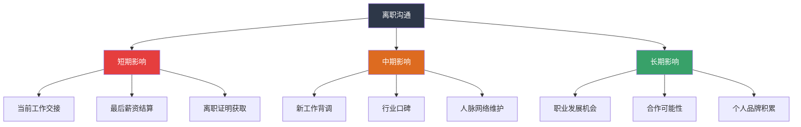
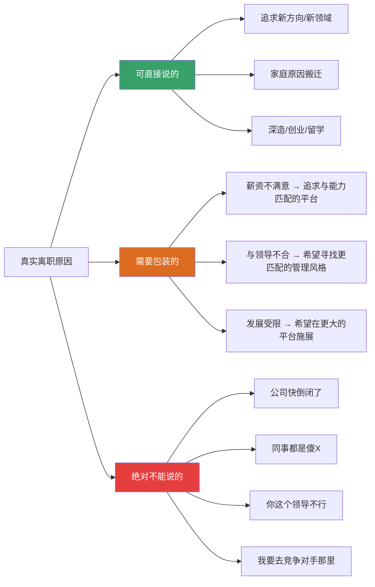
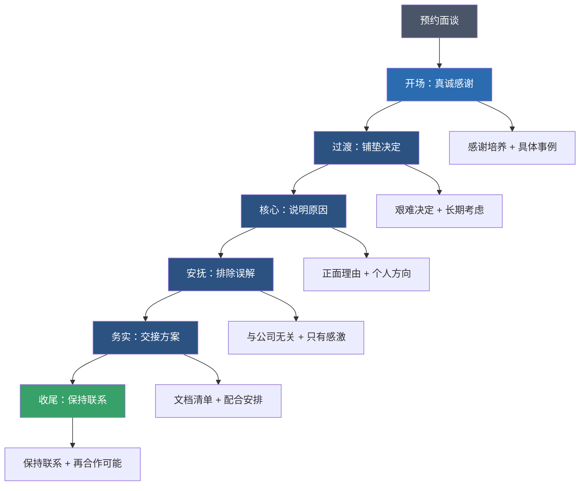

## 案例八：离职沟通——向领导提出辞职

离职沟通是职场沟通中最敏感、最具挑战性的场景之一。它不仅仅是一次"通知"，而是一场涉及情感管理、利益博弈、关系维护和职业声誉的综合考验。处理得好，你带着祝福和人脉离开；处理得不好，可能在行业里留下难以消除的负面口碑。

### 为什么离职沟通如此重要

很多人低估了离职沟通的价值，认为"反正要走了，说清楚就行"。这种想法会带来严重的后果：

**职业声誉的长期影响**：行业圈子远比你想象的小。你今天的领导，明天可能是你面试官的熟人、你合作伙伴的校友、你客户的老同事。一次粗暴的离职，可能在你不知道的地方持续发酵。

**背调与推荐信**：越来越多的公司在录用前进行背景调查。前领导的一句"这个人离职时很不负责任"可能直接毁掉你的新offer。而一句"非常优秀，我非常遗憾他离开"则能为你打开无数扇门。

**心理过渡的需要**：离职是人生重大转折点之一，如果处理得一团糟，你带着内疚、愤怒或遗憾进入新环境，会影响新工作的表现和适应。

### 离职前的决策分析

在开口提离职之前，你需要完成一套完整的决策流程。冲动离职和经过深思熟虑的离职，对话质量天差地别。

#### 自检清单：你真的想清楚了吗

| 检查维度 | 具体问题 | 为什么重要 |
|---------|---------|-----------|
| 动机清晰度 | 你离职的根本原因是什么？是逃避问题还是追求成长？ | 逃避式离职往往在新公司重复同样的困境 |
| 经济准备 | 你有至少3个月的生活储备金吗？新offer是否已拿到书面确认？ | 裸辞的压力会让你在谈判中处于弱势 |
| 替代方案 | 你是否尝试过在公司内部解决？调岗、换项目、谈加薪？ | 内部解决的成本远低于跳槽 |
| 时机选择 | 是否避开公司关键项目期？你的替代人选是否容易找到？ | 好时机能让对方更容易接受，减少摩擦 |
| 法律义务 | 竞业协议怎么约定的？提前通知期是多久？培训服务期是否到期？ | 违反法律义务可能面临经济赔偿 |

#### 离职原因的分类与表述策略

不同的离职原因需要不同的表述方式。核心原则是：**真实但不伤人，具体但不指责**。

**为什么不能说去竞争对手**：即使没有竞业协议，这个信息也会让领导感到被背叛，可能导致交接期被提前终止、离职证明被拖延、甚至行业里的负面传播。

### 正确的离职沟通全流程

#### 场景设定

> 赵敏在公司工作了三年，因为职业发展方向与公司不太匹配，决定离职。她需要和直属领导刘总进行离职沟通。

#### ❌ 错误示范

**版本A——冷冰冰的通知**：
> 刘总，我决定离职了，最后工作日是下个月15号。请安排交接。

问题分析：把辞职当成行政通知，完全没有情感铺垫。领导会觉得你事先没有尊重他，甚至可能怀疑你是否被竞争对手挖走了。这种方式会让三年的上下级关系瞬间降到冰点。

**版本B——情绪化宣泄**：
> "刘总，我受不了了。工资不涨，活越来越多，隔壁公司给我开的薪水比这里高50%。我决定走了。"

问题分析：这是"情绪绑架"式沟通。即使你说的都是事实，这种表达方式会让领导觉得你是在威胁而非沟通。如果领导恰好有加薪的权力，这种方式反而让他无法下台——答应你的要求像是被要挟，不答应又显得不在意你。

**版本C——编造虚假理由**：
> "我要回老家发展了。"（实际上跳槽到同城竞争对手）

问题分析：谎言总有被拆穿的一天。同城竞争对手圈子更小，你的新同事可能就是刘总的前同事。一旦谎言被戳穿，你失去的不只是刘总的信任，还有整个行业的信誉。

#### ✅ 正确示范——分阶段沟通法

离职沟通不是一次性的"炸弹投递"，而是一个循序渐进的过程。

**第一阶段：铺垫期（离职决定确认后1-3天）**

在正式谈话前，先做两件事：
1. 完成工作交接文档的初步整理，确保你手里没有"卡着"的重要资料
2. 观察领导的日程，找一个他心情相对平稳、不忙的时间段

**第二阶段：正式沟通**

预约一个私密的面谈。注意，是预约而不是突击：

> "刘总，方便单独聊聊吗？大概需要20分钟，是我个人发展方面的事情。"

这句话的作用是：给领导心理准备，让他知道你要谈正事；限定时间，减少他的焦虑；说是个人发展，提前暗示这不是来谈加薪的。

**第三阶段：核心对话**

> "刘总，首先我要特别感谢您这三年的培养。从刚入职时连项目流程都不太懂，到现在能独立带项目，每一步成长都离不开您的指导。特别是在XX项目中您给我那次机会，让我学到了很多，我一直记在心里。
>
> 但是经过很长一段时间的慎重考虑，我做出了一个很艰难的决定——我希望去尝试一个新的方向。我一直对XX领域有很强烈的兴趣，而这与公司目前的业务方向不太吻合。我考虑了很久，觉得趁现在还年轻，应该去追求自己真正想做的事情。
>
> 这个决定跟公司和您没有任何关系。说实话，如果不是职业方向的差异，我很愿意在这里继续干下去。
>
> 关于交接我已经做了准备。这是项目进度表和工作交接清单（递上文档），我列了每个项目的当前状态、待办事项和关键联系人。接下来的时间我会全力配合交接，确保不影响团队的工作。
>
> 我也希望咱们以后能保持联系，如果将来有机会，不排除再合作的可能。"

**第四阶段：收尾确认**

沟通结束后，在24小时内发送一封正式的辞职邮件，抄送HR。邮件内容需要包含：
- 确认离职日期
- 感谢公司的培养
- 交接计划概述
- 表达配合意愿

这封邮件既是正式法律文件，也是你职业态度的体现。

### 不同场景的应对策略

离职不是千篇一律的，不同情况需要不同的策略。

#### 场景一：领导挽留

这是最常见的场景。领导可能会说："你再考虑考虑"、"我可以给你调薪"、"我可以帮你换个项目组"。

**应对原则**：感谢但坚定。

> "刘总，非常感谢您愿意为我考虑这些。这让我更加确信在这里工作的三年是非常值得的。但这个决定我真的考虑了很久，不是一时冲动。我希望您能理解，这对我来说是一个必须抓住的机会。"

**如果领导提出加薪**：

你需要在心中快速计算：
- 新offer的薪资增长幅度是多少？
- 如果领导匹配薪资，你是否真的愿意留下？
- 如果你因为加薪留下，领导会不会认为你只是"用离职要挟加薪"？

根据行业调查数据，接受挽留后继续留在原公司的员工中，约70%会在12个月内再次离职。原因很简单：导致你想走的根本问题（发展受限、文化不合）通常不会因为加薪而改变。

**如果领导用情感绑架**：

> "现在项目正在关键期，你这时候走，团队怎么办？"

回应方式：

> "我理解现在确实不是最理想的时机。正因为如此，我已经提前整理了完整的交接文档，也愿意延长一些时间帮助过渡。但我也希望您能理解，这个时机对我来说也很重要。"

#### 场景二：领导愤怒

有些领导会把下属离职视为"背叛"，可能会发脾气、说难听的话。

**应对原则**：不争辩，不对抗，保持冷静。

如果领导说："公司培养了你三年，你说走就走？"

> "刘总，我完全理解您的感受。公司确实给了我很多，我也一直很珍惜这些机会。正因为如此，我希望把交接做好，不给公司添麻烦。"

不要试图争辩"公司也从我身上赚了钱"之类的话。即使你是对的，这种争辩毫无意义，只会让局面恶化。

#### 场景三：领导冷淡

有些领导听到后会说"行，我知道了"，然后就不怎么搭理你了。

**应对原则**：主动推进交接，不要因为领导冷淡就消极怠工。

主动找HR确认离职流程，主动找接手同事做好交接，保持专业到最后一天。

#### 场景四：被迫离职

如果你的离职原因是被新公司"挖角"，但不想暴露去向：

> "我计划先休息一段时间，调整一下状态，再考虑下一步的方向。"

这句话既不是谎言，也不会暴露你的去向。等你在新公司稳定下来，该知道的人自然会知道。

### 法律合规要点

离职不是"说走就走"那么简单，你需要提前了解并遵守相关法律义务。

#### 劳动法规定的提前通知期

根据《劳动合同法》第三十七条：

| 情况 | 提前通知期 | 法律依据 |
|------|----------|---------|
| 正式员工（试用期后） | 30天书面通知 | 劳动合同法第37条 |
| 试用期员工 | 3天通知 | 劳动合同法第37条 |
| 协商一致解除 | 无固定期限，双方协商 | 劳动合同法第36条 |

#### 竞业限制协议

如果你签了竞业协议，离职前务必确认以下几点：
- 竞业限制的范围和期限（最长不超过2年）
- 公司是否支付了竞业补偿金（未支付的竞业条款可能无效）
- 你新去的公司是否在竞业限制范围内

如果你不确定，建议在提离职前咨询劳动法律师。免费法律援助热线：12348。

#### 培训服务期

如果公司为你提供了专项培训费用（如外派培训、学历教育等），并约定了服务期，提前离职可能需要按比例返还培训费用。计算公式：

应赔偿金额 = 培训费用总额 × (未履行服务期 / 约定服务期总长)

在提离职前，你需要先弄清楚自己是否有未到期的服务期约定。

#### 离职证明与社保转移

离职证明是你入职新公司的必备文件。根据法律规定，用人单位应当在解除劳动合同时出具离职证明。如果公司拖延或拒绝出具，你可以向劳动监察部门投诉。

### 情绪管理与心理准备

离职沟通不仅是技巧问题，更是心理问题。你需要提前管理好自己的情绪。

#### 常见心理障碍

**内疚感**："领导对我很好，我走了对不起他。"——你需要明白，雇佣关系本质上是商业合作，不是恩情关系。你付出劳动创造价值，公司给你报酬和成长，这是一笔公平的交易。

**恐惧感**："如果领导发火怎么办？如果公司不放人怎么办？"——提前准备好应对方案，恐惧感会大大降低。本文档已经覆盖了各种场景的应对策略。

**焦虑感**："万一新公司不靠谱怎么办？"——确保你拿到的是书面offer而非口头承诺，最好在确认新offer后再提离职。

#### 沟通时的情绪控制技巧

- 语速放慢：紧张时人会不自觉加快语速，刻意放慢能帮助你保持冷静
- 提前排练：对着镜子或朋友练习2-3遍，把关键话术背熟
- 准备"锚点句"：如果紧张到忘词，回到核心句"我是出于个人职业规划的考虑"
- 接受沉默：说完要点后不要急着填补沉默，给领导消化的时间

### 离职后的关系维护

离职沟通只是开始，离职后的关系维护同样重要。

#### 保持联系的方式

| 时间节点 | 行动 | 目的 |
|---------|------|-----|
| 离职当天 | 给领导和同事发告别消息 | 表达感谢，留下好印象 |
| 离职后1个月 | 简短问候，分享近况 | 保持联络，不被遗忘 |
| 节假日 | 发送节日祝福 | 维系关系，保持温度 |
| 每半年 | 约一顿饭或咖啡 | 深度交流，更新信息 |
| 关键时刻 | 主动帮忙或求助 | 价值互换，关系深化 |

#### 前领导作为人脉的价值

前领导可能是你未来职业生涯中最有价值的人脉之一：
- 他们了解你的工作能力和职业素养
- 他们可能跳槽到更大的平台，成为你未来的推荐人
- 他们积累了多年的行业资源，可能在关键时刻给你提供信息或机会
- 他们的人脉网络可能覆盖你新公司需要接触的客户或合作伙伴

### 完整对话结构拆解

把一次成功的离职沟通拆解成结构化模块，方便你根据自己的情况组装：

### 常见误区与纠正

| 误区 | 为什么是错的 | 正确做法 |
|------|------------|---------|
| 用邮件或微信提离职 | 缺乏尊重，像通知而非沟通 | 必须当面沟通，邮件仅作为后续书面确认 |
| 同事比领导先知道 | 领导会觉得被架空，信息从非正式渠道传到他耳朵里效果极差 | 先和领导谈，再通知同事 |
| 吐槽公司或同事来解释离职原因 | 无论你的批评多么正确，离职时说这些只会显得你人品差 | 用"追求新方向"替代"对现状不满" |
| 离职前消极怠工 | 最后几周的表现会被所有人记住，是你的"职业遗产" | 保持专业到最后一天，交接做到位 |
| 拒绝参加离职交接 | 觉得"都要走了还让我干活" | 主动、完整的交接是你最后的职业名片 |
| 在朋友圈/社交媒体吐槽前公司 | 网络没有秘密，截图会传到你不想让它去的地方 | 保持沉默或只发中性内容 |
| 裸辞后再找工作 | 失去谈判筹码，空窗期越长越被动 | 至少拿到书面offer再提离职 |

### 赵敏的完整案例复盘

回到赵敏的案例，让我们看看她做对了什么，以及还能怎样做得更好。

**做对的部分**：
- 选择当面沟通，体现了对领导的尊重
- 先表达感谢再说明决定，符合情感铺垫原则
- 用"个人职业规划"作为理由，正面且不伤人
- 提前准备了交接文档，展示了职业素养
- 表达了保持联系和再合作的意愿

**可以优化的部分**：
- 可以在正式谈话前先释放一些信号，比如偶尔提到"最近在思考未来方向"
- 可以更具体地提到刘总帮助她成长的具体事例，增加真诚感
- 可以主动提出一个具体的交接时间表，而不只是说"配合安排"
- 可以提前了解公司的标准离职流程，展示你做了功课

### 关键要点总结

1. **当面沟通是底线**：辞职是非常重要的事情，必须当面说，不要发邮件或发微信。即使你们异地办公，也至少要视频通话。
2. **真诚感谢而非虚伪客套**：说出具体的事例和细节，让感谢显得真实可信。
3. **正面理由替代负面抱怨**：说"追求新方向"比"对公司不满"更得体，也更不容易引发冲突。
4. **不烧桥是长期投资**：保持专业和体面，世界很小，行业更小，以后可能还会打交道。
5. **主动交接是职业素养**：准备完整的交接文档，不给前东家添麻烦，是你最后的职业名片。
6. **保持关系是战略性行为**：前同事和前领导是你职业网络的重要组成部分，维护这些关系的成本很低，回报却很高。
7. **法律义务必须提前确认**：提前通知期、竞业协议、培训服务期，这些硬性约束必须在提离职前搞清楚。
8. **情绪管理决定沟通质量**：提前排练、准备锚点句、接受沉默，让沟通在理性的轨道上进行。

***

> 离职不是结束，而是新阶段的开始。你如何离开，决定了你以什么样的姿态进入下一个职场篇章。一个优雅的离职，是职业素养最有力的证明。
