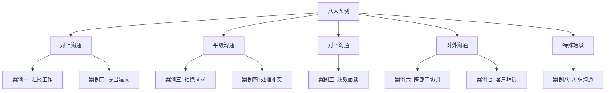
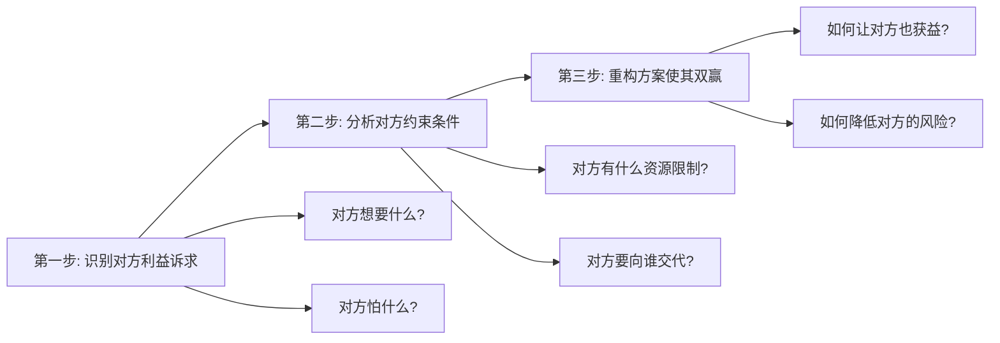
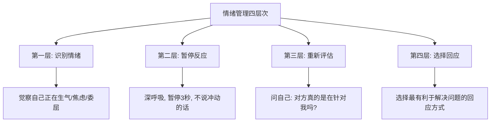
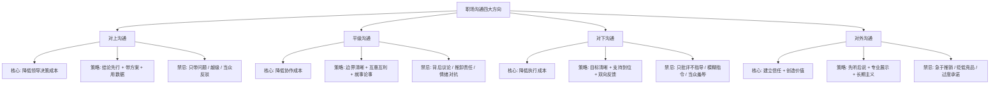
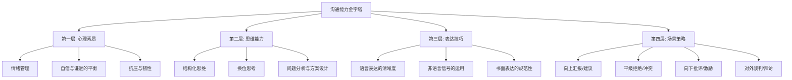
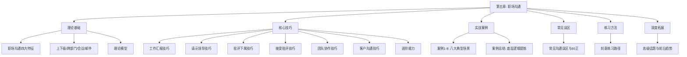

## 案例总结：从八个场景中提炼职场沟通的底层逻辑

八个案例走完，我们经历了职场沟通中最典型的八种场景：向上汇报、向上建议、平级拒绝、平级冲突、向下绩效面谈、跨部门协调、客户拜访、离职沟通。这八个场景覆盖了职场人从入职到离职的完整生命周期，涵盖了对上、对下、平级、对外四个沟通方向。

但掌握八个独立的"打法"远远不够。真正的沟通高手不是"场景应对专家"，而是"底层逻辑通透的人"——他们能在从未遇到的新场景中，快速推导出正确的沟通策略。本节的目标，就是从八个案例中萃取那些**跨场景通用的底层规律**，让你建立一套可以迁移的沟通思维框架。

### 一、八大案例全景回顾

在深入分析之前，先用一张表快速回顾每个案例的核心场景、关键挑战和核心解法：

| 案例 | 场景 | 沟通方向 | 核心挑战 | 核心解法 |
|------|------|---------|----------|----------|
| 案例一 | 季度销售汇报 | 向上 | 数据不达标，如何汇报不丢分 | 结论先行 + 归因分析 + 行动方案 |
| 案例二 | 优化报销流程 | 向上 | 身份敏感，批评现有流程等于批评领导 | 现状偏见破解 + 数据锚定 + 渐进方案 |
| 案例三 | 拒绝同事帮忙请求 | 平级 | 互惠压力 + 冲突回避心理 | 边界设定 + 替代方案 + 关系维护 |
| 案例四 | 方案分歧冲突 | 平级 | 观点对抗升级为人身攻击 | 利益重构 + 共同目标 + 第三选择 |
| 案例五 | 绩效面谈 | 向下 | 触发心理防御，对方听不进去 | SBI模型 + 发展导向 + 双向对话 |
| 案例六 | 跨部门项目协调 | 跨部门 | 无行政权力，各方推诿 | 权力借力 + 利益绑定 + 透明进度 |
| 案例七 | 首次客户拜访 | 对外 | 7秒第一印象，信任尚未建立 | 信任三角 + 需求倾听 + 价值前置 |
| 案例八 | 离职沟通 | 向上（特殊） | 情感敏感 + 利益博弈 + 声誉风险 | 充分准备 + 感恩表达 + 专业交接 |

### 二、七个跨场景通用原则

以下七个原则不是"正确的废话"，而是从八个案例的具体成败中反复验证的规律。每个原则都标注了它在哪些案例中被印证，以及违反它会导致什么后果。

#### 原则一：准备充分——沟通的成败在开口之前已经决定了

八个案例有一个共同点：**成功的沟通者都在开口之前做了大量准备工作，失败的沟通者都在"临场发挥"**。

| 案例 | 准备内容 | 准备不足的后果 |
|------|---------|--------------|
| 案例一（汇报） | 数据整理、逻辑框架、预判提问 | 流水账式汇报，领导追问时答不上来 |
| 案例二（建议） | 流程痛点数据、竞品方案对比、ROI测算 | 建议被当作"抱怨"，不了了之 |
| 案例三（拒绝） | 评估自身工作量、准备替代方案 | 要么勉强答应影响本职，要么生硬拒绝伤关系 |
| 案例四（冲突） | 理解对方立场、准备数据论据、预设底线 | 情绪失控，从方案争论变成人身攻击 |
| 案例五（绩效） | 绩效数据、具体事例、改进计划、支持资源 | 泛泛而谈，下属不认账或情绪崩溃 |
| 案例六（协调） | 各部门现状、利益诉求、领导背书 | 推不动各部门，项目继续停滞 |
| 案例七（拜访） | 客户背景调研、行业洞察、拜访目标设定 | 泛泛寒暄，客户觉得浪费时间 |
| 案例八（离职） | 离职原因梳理、交接方案、时间节点 | 仓促提出，领导措手不及，关系破裂 |

**准备的核心不是"想好说什么"，而是"想清楚对方会怎么反应"。** 案例一中，张伟不仅准备了自己的数据，还预判了总经理可能追问的三个问题（竞品动态、Q3预测、资源需求），每个都准备了数据支撑。案例二中，李娜准备了三个版本的方案（激进版、温和版、折中版），根据领导的反应灵活切换。

**实操方法：沟通前的"五问清单"**

每次重要沟通前，花5分钟回答以下五个问题：

1. **对方最关心什么？**（不是你想说什么，而是对方想听什么）
2. **对方可能的反对意见是什么？**（至少准备两个）
3. **你的核心诉求用一句话怎么说？**（说不清 = 没准备好）
4. **对方答应你的最低门槛是什么？**（理想结果 vs 底线结果）
5. **如果沟通失败，Plan B 是什么？**

#### 原则二：换位思考——站在对方的立场重新审视你的诉求

换位思考不是"想想对方的感受"这么简单。它是一个结构化的分析过程：**识别对方的利益诉求 → 理解对方的约束条件 → 重新包装你的方案使其对对方也有利**。

八个案例中，换位思考的具体体现各不相同：

- **案例一**：张伟站在总经理的角度——总经理需要的不是"好消息"，而是"决策信息"。所以汇报不能只报喜不报忧，而是要让总经理看到问题的全貌和他的应对选项。
- **案例二**：李娜站在财务总监的角度——张总关心的不是"流程烦不烦"，而是"改了之后风险可控吗？出事谁负责？"所以方案中特别加入了风险控制措施和试点计划。
- **案例三**：王强站在赵明的角度——赵明不是故意为难他，而是确实找不到人帮忙。所以拒绝时不是"我不帮"，而是"我帮你想别的办法"。
- **案例五**：管理者站在下属的角度——下属听到"绩效不达标"时，第一反应不是"我要改进"，而是"领导是不是对我有意见"。所以面谈要先解除防御，再谈改进。
- **案例六**：周明站在各部门的角度——技术部要人手、市场部要时间、运营部要资源。他不是要求各部门"配合"，而是帮各部门"解决自己的问题"。

**换位思考的三步法：**

#### 原则三：数据说话——用客观事实替代主观判断

"数据说话"是所有案例中反复出现的制胜因素。但很多人误解了"数据"的含义——它不仅仅是数字，而是**一切可验证的客观信息**。

| 数据类型 | 示例 | 适用场景 |
|---------|------|---------|
| 量化数据 | 销售额850万、完成率85%、耗时两周 | 案例一、二、五、六 |
| 时间线数据 | 5月竞品降价、Q3预计回升、21天交付期 | 案例一、六、八 |
| 对比数据 | 优化前两周 vs 优化后三天、线上获客成本vs线下 | 案例二、四 |
| 行业数据 | 哈佛商学院调研73%、盖洛普14% | 案例三、五 |
| 具体事例 | "上个月报销被退回3次"、"张工连续两周加班到11点" | 所有案例 |

**数据的说服力公式：**

> 数据说服力 = 数据可信度 × 数据相关性 × 数据冲击力

- **可信度**：数据来源要权威（公司系统 > 个人记忆 > 网络传言）
- **相关性**：数据必须直接支撑你的核心论点（不要堆砌无关数据）
- **冲击力**：数据要有对比才能产生冲击（"85%完成率"没有冲击力，"85%完成率，缺口150万，相当于3个大客户的年合同额"才有冲击力）

**案例四中的经典运用**：当刘洋和陈明争执线上vs线下渠道时，有效的沟通不是"我觉得线上好"，而是"过去12个月，线上渠道获客成本为每个有效线索280元，线下为520元；但线下渠道的成交率为35%，线上为12%。按单客获取成本算，线下实际更划算。"这种用数据重构问题的方式，把"观点之争"变成了"事实分析"。

#### 原则四：方案导向——带着解决方案去沟通，而不是只带问题

这条原则在案例一（汇报）、案例二（建议）、案例六（协调）中体现得最为明显。

**"只带问题"的沟通 vs "带方案"的沟通：**

| 维度 | 只带问题 | 带方案 |
|------|---------|--------|
| 给领导的印象 | "这人只会抱怨" | "这人能解决问题" |
| 沟通结果 | 领导反过来问你"你觉得该怎么办" | 领导在你的方案上做选择题 |
| 你的价值体现 | 暴露问题的能力（低价值） | 解决问题的能力（高价值） |
| 领导的决策成本 | 高（要自己想方案） | 低（只需审批） |

案例一中，张伟的汇报之所以成功，关键在于他不仅指出了"Q2缺口150万"的问题，还给出了"三个Q3行动方案"——挽回流失客户、加速新客户转化、申请市场部联合推广资源。这让总经理从"听问题"变成了"批方案"，决策效率大幅提升。

案例二中，李娜的建议之所以被采纳，关键在于她不是说"报销流程太慢了"（抱怨），而是提供了三个方案——方案A（全面线上化，投入大，效果最好）、方案B（保留纸质但优化审批链，投入小，效果中等）、方案C（先试点再推广，投入中等，风险最低）。这让领导从"是否要改"的选择题变成了"怎么改"的选择题，降低了决策门槛。

**方案导向的"三明治"结构：**

1. **问题描述**（简明扼要，用数据说话）
2. **方案选项**（至少两个，说明优劣和投入产出）
3. **推荐建议**（明确你推荐哪个，为什么）

#### 原则五：尊重对方——无论上下级，人格平等是沟通的底线

"尊重"在八个案例中的表现形式不同，但本质相同：**承认对方的合理性，即使你不同意对方的观点**。

- **对上尊重**（案例一、二、八）：不挑战领导的权威感，用"请教"代替"指正"，用"建议"代替"批评"。案例二中，李娜不说"现在的报销流程设计得很烂"，而是"现有流程在保障财务安全方面做得很好，但在效率层面有优化空间"。
- **平级尊重**（案例三、四）：不贬低对方的能力和判断。案例四中，有效的沟通不是"你的方案不行"，而是"你的方案在B端信任建立方面有明显优势，我的方案在线上覆盖方面更高效，两者能否结合？"
- **对下尊重**（案例五）：不否定下属的努力和人格。绩效面谈中，"你这个季度做得不好"和"你这个季度的产出和我们预期有差距，我注意到你在XX方面付出了很多努力，我们一起看看哪里可以调整"，效果天差地别。
- **对外尊重**（案例七）：不居高临下，不急于推销。首次客户拜访中，最好的尊重就是"认真倾听"——客户说得越多，你掌握的信息越多，后续的合作基础越牢固。

**尊重的具体行为清单：**

1. 倾听时不打断，等对方说完再回应
2. 回应时先认可对方的合理部分，再提出不同意见
3. 使用"我理解你的考虑"而不是"你错了"
4. 公开场合给足对方面子，有分歧私下沟通
5. 记住对方的名字、职务和关键信息（案例七中客户拜访的基本功）

#### 原则六：保持专业——情绪管理是职场沟通的隐藏门槛

案例四（冲突）和案例五（绩效面谈）最直接地展示了情绪失控的破坏力。

案例四中，刘洋和陈明的争论从"方案分歧"升级为"部门互相指责"，根本原因是双方都让情绪接管了理性。当刘洋说陈明"思维老旧"时，攻击的不再是方案而是人格，陈明的防御本能被激活，对话从"解决问题"变成了"证明自己没错"。

案例五中，管理者如果带着"恨铁不成钢"的情绪进行绩效面谈，下属接收到的不是"信息"而是"攻击"，心理防御全面启动，任何改进建议都进不去。

**情绪管理的四个层次：**

**职场情绪管理的三条铁律：**

1. **不在情绪高峰期做决定或发言**。如果感到愤怒，说"我需要想一下，明天回复你"比说出后悔的话强一百倍。
2. **区分"人"和"事"**。对方反对你的方案 ≠ 对方否定你这个人。案例四中，刘洋需要理解的是：陈明反对线上方案，不是反对刘洋本人。
3. **用"我"开头代替"你"开头**。"我觉得这个方案还有优化空间"比"你的方案有问题"更容易被接受。这不是文字游戏，而是心理学中的"非暴力沟通"核心技巧。

#### 原则七：维护关系——沟通的终极目标是"解决问题 + 维护关系"的双赢

很多人把职场沟通当成"零和博弈"——我赢了，你就输了。八个案例反复证明：**最好的沟通结果是双方都觉得自己赢了**。

- **案例三**（拒绝）：王强拒绝了赵明的请求，但帮他找到了替代方案（推荐了一个可以接外包的自由撰稿人），赵明的问题解决了，两人的关系没有受损。
- **案例四**（冲突）：刘洋和陈明最终不是"谁说服了谁"，而是共同设计了一个"线上+线下"的组合方案，双方的专业能力都得到了体现。
- **案例六**（协调）：周明没有用行政权力强压各部门，而是帮各部门争取了额外资源（给技术部申请了2名外援、帮市场部协调了营销大会延期、给运营部安排了临时数据支持），各部门在配合项目的同时也解决了自己的问题。
- **案例八**（离职）：即使要离开，也把交接做到位，给领导留足面子，给自己留好口碑。

**关系维护的核心公式：**

> 长期关系 = 每次互动的情感净值之和

每次沟通都会在"关系账户"中存入或取出"情感货币"。好的沟通（认可、帮助、信任）是存款；坏的沟通（指责、背叛、失信）是取款。当账户余额充足时，偶尔的分歧不会破坏关系；当账户透支时，即使你做得对，对方也会往坏处想。

**在每次沟通中维护关系的具体做法：**

1. 沟通结束时表达感谢（"谢谢你花时间和我讨论这个"）
2. 承诺的事情一定做到（案例八中，承诺的交接文档一份不少）
3. 给对方留台阶（案例三中，"不是我不想帮，确实是我手头项目太紧"比"这不是我的活"好得多）
4. 事后跟进（案例七中，拜访后24小时内发感谢邮件 + 会议纪要）

### 三、四大沟通方向的策略矩阵

八个案例分布在四个沟通方向上。每个方向有其独特的权力关系和沟通逻辑，值得单独提炼。

#### 对上沟通策略（案例一、二、八）

对上沟通的本质是**帮助领导做决策**。领导的时间和注意力是稀缺资源，你的沟通越能降低领导的决策成本，你的价值就越大。

| 技巧 | 说明 | 案例体现 |
|------|------|---------|
| 结论先行 | 先说结果/诉求，再说过程/原因 | 案例一：先说"Q2完成85%，缺口150万"，再展开分析 |
| 带方案请示 | 至少准备两个方案供选择 | 案例二：三个版本的优化方案，含投入产出分析 |
| 预判提问 | 提前准备领导可能追问的问题 | 案例一：预判竞品动态、Q3预测、资源需求三个问题 |
| 选择时机 | 领导心情好、时间充裕时沟通重要事项 | 案例八：选择周五下午而非周一早上提出离职 |
| 给足面子 | 公开场合维护领导权威 | 案例二："现有流程在安全性方面设计得很好" |

#### 平级沟通策略（案例三、四）

平级沟通的本质是**在没有行政权力的情况下推动协作**。你不能命令对方，只能说服对方。因此，平级沟通的核心是"让对方觉得配合你对他也有好处"。

| 技巧 | 说明 | 案例体现 |
|------|------|---------|
| 先认可再分歧 | 认可对方方案的合理部分，再提出不同意见 | 案例四："你的线下方案在B端信任建立上有优势" |
| 找共同目标 | 把"你vs我"变成"我们vs问题" | 案例四：共同目标是"年度营销方案最优解" |
| 提供替代方案 | 拒绝时给对方其他出路 | 案例三：推荐自由撰稿人作为替代 |
| 建立关系账户 | 平时积累善意，关键时刻有"存款"可取 | 案例三：王强和赵明平时互相帮忙的基础 |

#### 对下沟通策略（案例五）

对下沟通的本质是**帮助下属成功**。管理者的沟通质量直接决定了团队的执行力和士气。

| 技巧 | 说明 | 案例体现 |
|------|------|---------|
| 具体而非笼统 | 用具体事例替代笼统评价 | 案例五："上个月客户投诉了3次"而非"你服务态度不好" |
| 发展导向 | 关注"如何改进"而非"哪里做错了" | 案例五：70%时间讨论改进计划，30%回顾问题 |
| 双向对话 | 让下属充分表达，不是单方面宣判 | 案例五：先让下属自评，再补充管理者的观察 |
| 提供支持 | 指出问题的同时提供资源和帮助 | 案例五：安排导师辅导、调整工作量、提供培训机会 |

#### 对外沟通策略（案例六、七）

对外沟通（含跨部门）的本质是**建立信任、创造共同价值**。对方不欠你任何东西，你必须用专业和诚意赢得合作。

| 技巧 | 说明 | 案例体现 |
|------|------|---------|
| 信任先行 | 先建立信任，再谈合作 | 案例七：首次拜访40%目标是建立信任基础 |
| 倾听优先 | 让对方多说，你多听 | 案例七：拜访中70%时间在提问和倾听 |
| 利益绑定 | 让对方看到合作对他自己的好处 | 案例六：帮各部门争取额外资源 |
| 专业展示 | 用行业洞察和专业能力赢得认可 | 案例七：分享行业趋势报告展示专业度 |

### 四、从案例中提炼的沟通能力模型

回顾八个案例，我们可以构建一个职场沟通的"能力金字塔"——底层能力支撑上层能力，缺了底层，上层技巧都是空中楼阁。

**第一层：心理素质（地基）**

案例四和案例五最直接地证明了心理素质的重要性。刘洋和陈明如果能在争论中管理好情绪，冲突不会升级；管理者如果能在绩效面谈中保持平和，下属的防御心理不会被激活。心理素质不是"性格好"，而是可以通过刻意练习提升的技能——正念冥想、认知重评、情绪日记都是有效的方法。

**第二层：思维能力（框架）**

案例一和案例二最充分地展示了思维能力的价值。张伟的汇报之所以出色，是因为他用"结论→归因→方案"的结构化框架组织了信息；李娜的建议之所以被采纳，是因为她用"问题→方案→ROI"的逻辑链说服了领导。思维能力的核心是：**把复杂的信息组织成对方容易理解和接受的结构**。

**第三层：表达技巧（呈现）**

案例三和案例七最集中地体现了表达技巧的差异。王强拒绝赵明时，"我帮你想别的办法"比"这不是我的活"多了10个字，但效果天差地别。案例七中，客户拜访的前7秒——你的着装、握手、眼神、开场白——决定了客户对你的第一印象。表达技巧包括：用词精准度、语速控制、肢体语言管理、故事化叙述能力。

**第四层：场景策略（应用）**

八个案例本身就是八种场景策略。这一层的关键是：**识别场景特征 → 调用对应策略 → 灵活应变**。同一个人在同一天可能需要先向上汇报（案例一的策略），再和同事讨论分歧（案例四的策略），最后给下属做绩效反馈（案例五的策略）——场景切换的速度和准确度，是沟通高手和普通人的分水岭。

### 五、职场沟通的常见陷阱——从八个案例中反向提炼

除了"应该怎么做"，八个案例还揭示了一系列"不应该怎么做"的陷阱。这些陷阱之所以危险，是因为很多人在犯这些错误时并不自知。

#### 陷阱一：把"沟通"等同于"说话"

**表现**：只关注自己要说什么，不关注对方在听什么、怎么理解、会怎么反应。

**案例中的体现**：案例一中，错误示范的张伟只想着"把数据念完"，没有考虑总经理需要什么决策信息。案例七中，很多销售人员在首次拜访时滔滔不绝介绍产品，客户根本没有开口的机会。

**纠正方法**：沟通 = 传递信息 × 接收反馈。说完一段话后，主动确认："我刚才说的清楚吗？""你怎么看？"把单向输出变成双向对话。

#### 陷阱二：用情绪代替逻辑

**表现**：生气时口不择言，焦虑时语无伦次，委屈时诉苦式沟通。

**案例中的体现**：案例四中，"你思维老旧"这种话一旦出口，对方的理性通道就关闭了，剩下的只有反击。案例五中，管理者如果带着"我对你很失望"的情绪开场，整个面谈就毁了。

**纠正方法**：情绪上来时，先暂停。说"这个很重要，我想一下怎么表达更准确"，给自己3-5秒的缓冲。然后用"事实+影响+期望"的结构表达，而不是用情绪发泄。

#### 陷阱三：只从自己的角度出发

**表现**：说的每句话都是"我觉得"、"我想"、"我需要"，从不考虑对方的立场。

**案例中的体现**：案例二中，如果李娜只说"报销流程太慢了，我每次都要等两周"，这就是纯粹的抱怨。但她转换到"公司层面"——"按每月200笔报销计算，每笔多耗一周，累计浪费约500个工时/年"——领导才看到了问题的严重性。

**纠正方法**：每次准备沟通内容时，强制自己用"对方视角"重新审视一遍：如果我是对方，我为什么要关心这件事？对方从中能得到什么？

#### 陷阱四：追求"赢"而不是"解决问题"

**表现**：把沟通当辩论赛，非要分出胜负对错。

**案例中的体现**：案例四中，刘洋和陈明争论的焦点从"哪个方案对公司更好"逐渐变成了"谁更聪明、谁的判断更准"。当沟通变成"面子之争"，解决方案就被抛到脑后了。

**纠正方法**：时刻提醒自己沟通的目的不是"证明我对"，而是"推动事情前进"。当发现自己在"赢"而不是在"解决问题"时，主动退一步："我们回到核心问题——怎样做对公司最好？"

#### 陷阱五：回避必要的困难对话

**表现**：该拒绝的不拒绝，该批评的不批评，该摊牌的不摊牌，拖到最后问题越来越严重。

**案例中的体现**：案例三中，如果王强这次勉强答应了，下次赵明还会来找他，而且请求会越来越大。案例五中，如果管理者一直不和下属谈绩效问题，等到年终考核时才"突然"告诉对方不合格，对下属的打击是毁灭性的。

**纠正方法**：困难对话不会因为拖延而变简单，只会因为拖延而变更难。最佳时机是"问题刚出现"时——越早沟通，问题越小，对方越容易接受。

#### 陷阱六：忽视非语言信号

**表现**：只关注自己说了什么，不关注自己的表情、语气、肢体语言在传递什么。

**案例中的体现**：案例五中，管理者说"我支持你改进"，但如果同时双臂交叉、眉头紧皱、语气生硬，下属接收到的真实信号是"领导对我很不满"。案例七中，客户拜访时你的眼神飘忽、坐立不安，客户感受到的是"这个人不自信"。

**纠正方法**：录制自己的模拟沟通视频，回放时关掉声音只看画面——你的肢体语言在说什么？然后再打开声音关掉画面——你的语气在传递什么情绪？

### 六、进阶框架：SCQA+PREP双模型实战应用

掌握了基础原则后，向高级沟通者进阶需要掌握两个核心框架。这两个框架在八个案例中被反复运用，但没有单独系统讲解过。

#### SCQA模型（结构化表达）

SCQA是麦肯锡咨询顾问的标准表达框架，由四个要素构成：

| 要素 | 含义 | 案例一中的体现 |
|------|------|--------------|
| **S**（Situation）情境 | 大家都认同的背景事实 | "Q2已经结束，华中区完成了季度销售目标的85%" |
| **C**（Complication）冲突 | 打破平衡的关键事件 | "主要原因是A公司5月降价20%，影响了3个大客户续约" |
| **Q**（Question）问题 | 由此自然引出的问题 | "如何在Q3弥补缺口并重回正轨？" |
| **A**（Answer）答案 | 你的方案/结论 | "三个行动方案：挽回流失客户、加速新客转化、联合推广" |

SCQA的威力在于：**它模拟了人类自然的思考路径**——先建立共识（S），再引入变化（C），让对方自然产生疑问（Q），然后你给出答案（A）。这种结构让对方觉得结论是"自己推理出来的"，而不是"被你灌输的"，接受度大幅提升。

#### PREP模型（观点表达）

PREP适用于需要快速说服对方的场景：

| 要素 | 含义 | 案例二中的体现 |
|------|------|--------------|
| **P**（Point）观点 | 先说结论 | "我建议将报销流程线上化" |
| **R**（Reason）理由 | 为什么这样建议 | "当前流程平均耗时14天，行业标杆企业仅需3天" |
| **E**（Example）举例 | 具体证据 | "上个月有23笔报销因签字延误超过3周" |
| **P**（Point）重申 | 再次强调结论 | "所以建议分三步推进线上化，先试点财务部" |

**两个模型的使用场景对比：**

- **SCQA**：适合正式汇报、方案演示、需要讲故事的场景（案例一、二、七）
- **PREP**：适合快速表态、会议发言、需要即刻说服的场景（案例三、四、六）

### 七、从"知道"到"做到"——刻意练习路径

知道原则和框架只是起点，真正的提升来自于刻意练习。以下是基于八个案例设计的四阶练习路径：

#### 第一阶段：模仿期（1-2周）

- 每天选择一个案例，按照案例中的"正确示范"进行角色扮演
- 录音或录像自己的练习过程，回放对比
- 重点练习：结构化表达（SCQA/PREP）、结论先行、用数据说话

#### 第二阶段：内化期（3-4周）

- 在真实工作场景中运用所学技巧
- 每次重要沟通前使用"五问清单"做准备
- 每次沟通后做3分钟复盘：哪里做得好？哪里可以改进？
- 重点练习：换位思考、情绪管理、方案导向

#### 第三阶段：灵活期（5-8周）

- 面对新场景时，能够自主判断适用哪种策略
- 能够在沟通中根据对方反应实时调整策略
- 开始帮助团队成员提升沟通能力（教是最好的学）
- 重点练习：场景识别、策略切换、实时应变

#### 第四阶段：精进期（持续）

- 形成自己的沟通风格——专业、真诚、高效
- 能够处理高难度场景（跨文化沟通、危机沟通、高层博弈）
- 将沟通能力与领导力、影响力深度融合
- 重点练习：影响力构建、高层沟通、组织沟通设计

### 八、全章知识地图

最后，用一张全景图串联第五章的所有内容模块，帮助你建立完整的知识体系：

**回顾本章的学习路径：**

1. **理论基础**告诉你"为什么"——职场沟通的独特属性和底层规律
2. **核心技巧**告诉你"怎么做"——每个场景的具体方法和话术
3. **实战案例**让你"看到"——真实场景中的正确与错误示范
4. **案例总结**帮你"提炼"——跨场景的通用原则和能力模型
5. **常见误区**帮你"避坑"——前人踩过的坑，你不必再踩
6. **练习方法**让你"内化"——从知道到做到的路径
7. **深度拓展**带你"进阶"——面向未来的高级话题

职场沟通是一项可以通过学习和练习持续提升的能力。每一次对话、每一封邮件、每一次会议，都是你练习和精进的机会。掌握底层逻辑，勤于实践复盘，你终将从"能说会道"进阶到"四两拨千斤"的沟通境界。
