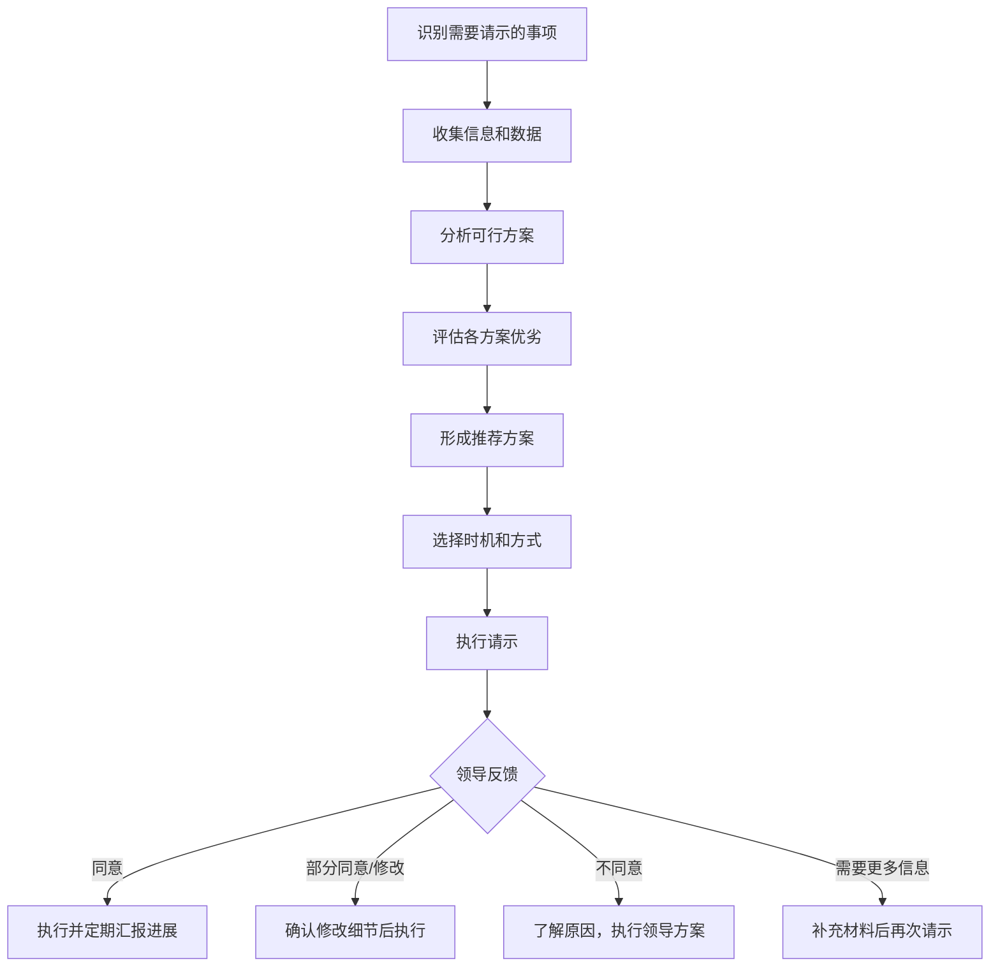
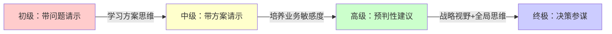

## 二、请示领导的技巧

请示是向上沟通中最具技术含量的场景。与汇报不同，汇报是告知，领导听完点点头就行；请示是决策，领导必须给出明确回应。一个请示质量的高低，直接决定了你能否高效获取资源、推动事情落地，也在潜移默化中塑造领导对你的专业判断。

很多职场人把请示当成"把问题扔给领导"，结果要么被领导反问"你的建议呢？"搞得尴尬，要么被领导认为"这点小事也要来问"而留下不好的印象。真正高水平的请示，是让领导感觉"这个人的思考很周全，我只需要做个选择题"，而不是"这个人在给我出问答题"。

### 2.1 请示与汇报的本质区别

很多人混淆"请示"和"汇报"，在错误的场景用了错误的方式，导致沟通效率低下甚至引起领导反感。两者的本质区别在于**决策权归属**。

| 维度 | 汇报 | 请示 |
|------|------|------|
| 核心目的 | 告知进展/结果 | 请求决策/授权 |
| 决策权 | 在自己手中 | 在领导手中 |
| 领导角色 | 知情者/听众 | 决策者/批准者 |
| 结束标志 | 领导了解了情况 | 领导做出了决定 |
| 后续行动 | 自己继续执行 | 等领导回复后再行动 |
| 典型句式 | "向您汇报……" | "请您决定/批准……" |

区分请示和汇报，可以避免两种致命错误：

**错误一：该汇报的变成了请示。** 把应该自己决策的小事推给领导，比如"领导，下周的部门聚餐选哪家餐厅？"这会让领导觉得你缺乏判断力，连基本的事务都要依赖上级。时间久了，领导会质疑你是否能承担更大的责任。

**错误二：该请示的变成了汇报。** 把需要领导知情或批准的大事自己悄悄处理了，比如擅自答应客户一个超出权限的折扣、私自调整项目方向。这比第一种错误更严重——它会直接破坏信任。领导会想："这么大的事你都不跟我说，你眼里还有我吗？"

**判断标准：** 当你需要领导的批准、资源、授权或决策时，用请示；当你只是让领导知道情况、不需要领导做任何事时，用汇报。如果拿不准，宁可多请示一次，也不要擅自做超出权限的决定。

### 2.2 请示的心理学基础

为什么有些人请示一次就能拿到批准，有些人反复被驳回？这背后有清晰的心理机制。

#### 2.2.1 领导做决策的认知负荷

领导每天要做大量决策，认知资源是有限的。心理学中的"决策疲劳"（Decision Fatigue）理论指出，人在连续做决策后，判断力会下降，倾向于选择"不改变现状"或"交给别人处理"。

这意味着什么？如果你的请示让领导需要从零开始思考、梳理信息、比较方案，领导会本能地感到疲惫和抵触。相反，如果你已经替领导完成了80%的思考工作，领导只需要在你准备好的选项中选一个，决策成本极低，批准的概率自然大幅提高。

#### 2.2.2 框架效应的运用

诺贝尔经济学奖得主卡尼曼提出的"框架效应"（Framing Effect）表明：同一个问题，用不同的方式呈现，会导致截然不同的决策结果。

举个例子：

> ❌ "领导，这个项目需要增加20万预算。"
> ✅ "领导，这个项目目前预算100万，如果追加20万（增加20%），可以将交付时间从6个月缩短到4个月，提前上线两个月可以多创造约60万的营收。追加的20万投入回报比是1:3。"

第二种说法不是在"要钱"，而是在帮领导做投资决策。框架从"支出"变成了"投资回报"，领导的决策心理完全不同。

#### 2.2.3 承诺一致性原则

社会心理学家罗伯特·西奥迪尼在《影响力》中提出的"承诺一致性"原则，也可以运用在请示场景中。如果你在请示之前，已经通过非正式的方式让领导表达过倾向性意见（比如在闲聊中提到"您之前说咱们今年要重点拓展华东市场"），那么在正式请示时引用这个前提，领导更容易做出一致性的决定。

### 2.3 请示的黄金法则

#### 法则一：带方案请示，而非带问题请示

这是请示最核心的原则，怎么强调都不过分。

❌ 错误示范：
> "领导，客户要求提前两周交付，怎么办？"

这种请示方式有三个问题：一是把决策压力完全推给了领导，领导需要替你思考；二是暴露了你遇到问题就向上推的习惯；三是浪费了领导的时间。

✅ 正确示范：
> "领导，客户要求提前两周交付。我评估了三种方案：
> - 方案一：增加两名开发人员，预算增加约15%（约3万元），可以按时交付，且不影响质量；
> - 方案二：砍掉两个低优先级功能（报表导出和数据对比），不影响预算，但需要与客户协商确认；
> - 方案三：增加一名开发人员+砍掉一个低优先级功能，预算增加8%，交付时间推迟一周。
>
> 我建议方案一。理由是：这个客户是我们的战略客户，今年续约金额预计80万，提前交付能大幅提升续约概率和客户满意度。追加的3万元投入产出比很高。请您决定。"

**对比分析：**

| 维度 | 带问题请示 | 带方案请示 |
|------|-----------|-----------|
| 领导的决策成本 | 高（需要从零思考） | 低（做选择题） |
| 展示的能力 | 执行力 | 思考力+执行力 |
| 领导的感受 | "你怎么什么都问我" | "这个人靠得住" |
| 决策效率 | 低（可能需要反复沟通） | 高（一次请示即可） |
| 推荐做法 | 绝对避免 | 始终如此 |

#### 法则二：给出明确的选项和推荐

不要问领导开放性问题（"您觉得怎么办？"），而是给出2-3个明确的选项，并说明你的推荐和理由。

**为什么是2-3个而不是更多？**

选项太少（只有1个），领导会觉得你在"走形式"——你已经决定了还来问我干嘛？选项太多（超过3个），领导会觉得你在回避判断，把分析工作推给上级。心理学中的"选择过载"（Choice Overload）效应也表明，选项过多反而会降低决策质量。

**最佳实践：3选1，有明确推荐。**

每个选项需要包含：
1. **方案描述**：具体怎么做
2. **优势**：能获得什么好处
3. **劣势**：需要付出什么代价
4. **适用条件**：在什么情况下这个方案最优

最后明确说出你的推荐和理由。即使领导最终选了其他方案，他也会欣赏你清晰的分析框架。

#### 法则三：说清楚决策的紧迫性

领导每天面对大量事务，如果你不明确说"什么时候之前需要决定"，你的请示很可能被压在待办事项的最底层。

❌ "领导，这个方案需要您审批一下。"
✅ "领导，这个方案需要您在本周三（6月26日）之前审批。因为供应商的报价有效期到6月28日，如果我们周三之前确认，周四下订单，可以赶上月底的批量采购优惠，预计节省约5万元。如果错过这个窗口，同样的物料需要多付8%的费用。"

**紧迫性表达的三要素：**
1. **具体截止时间**：不是"尽快"，而是"本周三下午3点前"
2. **延迟后果**：错过会导致什么损失
3. **不可替代性**：为什么不能晚一点

#### 法则四：尊重最终决策权

即使领导的决策与你的建议不同，也要尊重并执行。这是职场的基本规则。

**为什么？** 因为领导可能掌握着你不知道的信息——公司战略方向、预算限制、政治考量、高层博弈等。你觉得方案A最好，可能是因为你只看到了局部最优；领导选了方案B，可能是因为他看到了全局最优。

**正确的应对方式：**

1. **第一次不同意**：可以再次表达自己的看法，但措辞要柔和。"领导，我理解您的考虑。我补充一点信息供您参考：……"如果领导坚持，立刻接受并执行。

2. **执行中发现问题**：如果领导的决策确实有问题，不要阳奉阴违，而是在执行过程中及时反馈具体的数据和事实。"领导，按照方案B执行到第三周，我们发现了一个预期之外的问题：……建议我们是否需要调整？"

3. **事后复盘**：如果最终证明领导的决策是正确的，主动承认自己的局限性，这会让领导觉得你是一个善于学习的人。如果最终证明你的建议更好，也不要得意，而是在适当的时机客观复盘。

#### 法则五：选对请示的时机和方式

即使你的方案再完美，请示的时机和方式不对，效果也会大打折扣。

**时机选择：**

| 时机 | 适合请示的类型 | 不适合请示的类型 |
|------|--------------|----------------|
| 领导刚到公司/刚吃完午饭 | 简单审批、常规事务 | 复杂方案、敏感话题 |
| 领导心情好/项目取得进展时 | 需要投入资源的方案 | — |
| 领导压力大/刚被上级批评时 | — | 任何非紧急事项 |
| 周五下午 | — | 重要决策（领导急着下班） |
| 周一上午 | — | 复杂决策（领导在处理积压事务） |

**最佳请示时间：** 周二到周四的上午10:00-11:30，这是大多数领导精力最充沛、心态最开放的时间段。

**方式选择：**

| 请示方式 | 适用场景 | 注意事项 |
|---------|---------|---------|
| 面对面 | 重要决策、敏感话题、需要讨论的方案 | 提前预约，准备好材料 |
| 即时消息 | 简单审批、紧急但简短的事项 | 一条消息说清楚，不要刷屏 |
| 邮件 | 需要留痕的正式审批、跨部门协调 | 主题清晰，正文简洁，附件齐全 |
| 电话 | 紧急且重要的事项 | 先发消息确认领导是否方便接听 |

### 2.4 请示的完整流程模板

一个高质量的请示，可以遵循以下流程：

**请示沟通的完整话术模板：**

【背景】（1-2句话说清来龙去脉）
领导，关于[事项]，跟您汇报一下情况：[简要说明背景和当前状态]。

【问题/需求】（1句话说清楚你需要什么）
目前需要您[决定/批准/协调]的是：[具体事项]。

【方案分析】（2-3个方案，每个简明扼要）
我分析了以下方案：
- 方案一：[内容]，优势是[X]，劣势是[Y]；
- 方案二：[内容]，优势是[X]，劣势是[Y]；
- 方案三：[内容]，优势是[X]，劣势是[Y]。

【推荐】（明确推荐+理由）
我建议采用[方案X]，理由是[1、2、3]。

【时间要求】（什么时候之前需要结果）
这个决定需要在[具体时间]之前做出，因为[原因]。

【收尾】（把决策权交回领导）
请您决定。

**实际应用示例——技术选型请示：**

> 领导，关于新客户管理系统的后端技术选型，跟您汇报一下评估结果。
>
> 目前需要您决定的是采用哪种技术方案。我分析了三种方案：
>
> - 方案一：继续用现有的Java技术栈。优势是团队熟悉、维护成本低；劣势是开发速度较慢，预计需要4个月；
> - 方案二：采用Go语言重写。优势是性能提升约3倍、部署更轻量；劣势是团队需要学习，初期开发周期约5个月；
> - 方案三：核心模块用Java，新增模块用Go。优势是平衡了稳定性和性能；劣势是技术栈混合，后期维护复杂度增加。
>
> 我建议采用方案一。理由是：第一，我们今年的核心目标是快速上线，时间比性能更重要；第二，团队的Java经验丰富，出bug的概率最低；第三，后续性能问题可以通过加缓存和优化数据库来解决，不需要推倒重来。
>
> 这个决定需要在下周五（7月4日）之前做出，因为7月中旬要启动开发，需要提前一周做环境搭建和任务分配。
>
> 请您决定。

### 2.5 请示的常见场景与实操指南

#### 2.5.1 资源申请类请示

**场景：** 需要增加人员、预算、设备或其他资源。

**核心要点：** 用投资回报率（ROI）数据支撑你的需求，让领导感觉这是"投资"而不是"花钱"。

**实操模板：**

> 领导，关于[资源名称]的申请，跟您说明一下：
>
> **现状：** [当前情况，为什么现有资源不够]
> **需要：** [具体需要什么资源，数量和规格]
> **投入：** [需要多少成本]
> **产出：** [能带来什么收益，尽量量化]
> **不投入的后果：** [如果维持现状会怎样]
>
> 综合评估，投入[金额]，预计[时间]内可获得[收益]，投入产出比约为[比例]。请您审批。

**案例：**
> 领导，关于招聘一名高级测试工程师的申请，跟您说明一下。
>
> 现状：目前测试团队3人，负责5个产品的测试工作。本季度已出现两次线上bug，其中一个导致客户数据错误，花了3天修复，客户满意度下降了15%。
>
> 需要：招聘一名高级测试工程师（P6级别），月薪预算约2万元。
>
> 产出：预计可以将测试覆盖率从目前的65%提升到85%以上，减少70%的线上bug。按照历史数据，每次线上bug的平均修复成本（人力+客户赔付+商誉损失）约3万元，一年少出5次bug就能覆盖招聘成本。
>
> 不投入的后果：按照目前的趋势，下半年产品数量还要增加2个，如果不增加人手，测试覆盖率可能降到50%以下，线上事故风险显著增加。
>
> 请您审批。

#### 2.5.2 方案选择类请示

**场景：** 面对多个可行方案，需要领导拍板选择。

**核心要点：** 不超过3个选项，每个选项有清晰的优劣对比，给出明确推荐。

**对比表格是最佳呈现方式：**

| 维度 | 方案一：维持原价+延长维护 | 方案二：降价5%+缩减范围 | 方案三：降价3%+增加服务 |
|------|------------------------|----------------------|----------------------|
| 客户满意度 | 高（保住了完整功能） | 中（功能减少客户可能不满） | 高（价格降了服务还多了） |
| 利润影响 | 无影响 | 利润减少约8万/年 | 利润减少约5万/年 |
| 执行难度 | 低（不需要改合同范围） | 高（需要重新谈判范围） | 中（需要增加服务资源） |
| 长期价值 | 高（续约概率提升） | 低（客户可能流失） | 高（客户粘性增强） |
| 推荐 | ⭐ 推荐 | | |

#### 2.5.3 权限请求类请示

**场景：** 需要获得超出自己权限的授权，比如跨部门协调、客户谈判、合同签署等。

**核心要点：** 明确授权的边界——做什么、做到什么程度、什么情况下需要再次请示。

**常见错误：** 只说"领导，这个客户谈判能不能由我来负责？"而不说清楚授权范围。领导不知道你会不会一激动就答应客户不合理的要求，自然不敢轻易授权。

**正确做法：** 说清楚你的谈判底线和预案。
> 领导，下周与客户B的价格谈判，是否可以由我主导？我的谈判策略是：目标价下浮5%，底线是下浮10%，超过10%我会暂停谈判向您请示。如果客户提出其他附加条件（如延长账期、增加服务），我会记录下来，不在现场做承诺，回来跟您讨论后再回复。

#### 2.5.4 异常处理类请示

**场景：** 项目出现意外情况、重大bug、客户投诉升级等。

**核心要点：** 先控制损失再汇报，带着止损方案来请示，而不是空手来报灾。

**"先止血，再治病"原则：**

> 领导，紧急情况汇报：今天上午10点，生产环境的支付系统出现故障，约有200笔订单受到影响。
>
> **已采取的止血措施：** 我在10:15发现问题后，立刻联系运维团队将流量切换到备用系统，10:30恢复正常。受影响的200笔订单中，180笔已自动重试成功，剩余20笔需要人工处理。
>
> **根因分析：** 初步判断是数据库连接池配置不当导致的，技术团队正在修复。
>
> **需要您决定的是：** 那20笔失败订单的客户，是否需要给予一定的补偿（比如优惠券或免运费）？我建议对每笔订单补偿20元优惠券，总成本约400元，可以有效降低客户投诉风险。请您决定。

#### 2.5.5 流程变更类请示

**场景：** 需要调整现有工作流程、制度或规范。

**核心要点：** 用数据证明现有流程有问题，用对比证明新方案更优，用试点方案降低领导的风险感知。

> 领导，关于研发部代码审核流程的优化建议：
>
> **现状问题：** 目前代码审核依赖人工，平均每个PR审核耗时2.5天，导致版本发布周期偏长。过去三个月，有4次因为审核延迟导致上线延期。
>
> **建议方案：** 引入自动化代码审核工具（SonarQube），配合人工审核。自动化工具负责检查代码规范、安全漏洞、重复代码等机械性工作，人工审核负责业务逻辑和架构设计。
>
> **预期效果：** 审核时间从平均2.5天缩短到1天，发布周期缩短40%。工具年费约2万元。
>
> **风险控制：** 建议先在A项目试点一个月，评估效果后再决定是否全面推广。
>
> 请您决定。

### 2.6 请示中的常见误区

#### 误区一：只带问题，不带方案

**表现：** "领导，这个事情我不知道该怎么办，您看怎么办？"

**问题：** 把领导当成了你的"解题机器"。领导雇你来是解决问题的，不是帮你做作业的。

**纠正：** 每次请示之前，至少想出两个可行方案。即使方案不成熟，也比空手来好。领导会欣赏你的主动性，哪怕方案需要调整，也会在这个基础上给你指导。

#### 误区二：过度请示，大小事都要问

**表现：** 每个决策都要向领导确认，"领导，这个合同用A4纸打印还是A3纸？""领导，会议室订201还是303？"

**问题：** 领导会认为你缺乏独立判断能力，不敢把重要工作交给你。更糟糕的是，频繁的无意义请示会消耗领导的耐心，等到你真正需要请示重要事项时，领导可能已经对你产生了"这人又来问小事"的心理定式。

**纠正：** 建立自己的"决策边界"意识。在入职或换岗时，主动和领导确认："哪些事情我可以自行决定，哪些需要向您请示？"一般来说，常规性、低风险、有先例可循的事情可以自行决定；非常规、高风险、无先例、涉及较大资源投入的事情才需要请示。

#### 误区三：请示时隐瞒关键信息

**表现：** 只说对自己有利的信息，隐瞒不利因素。比如请示增加预算时只说收益不说风险，请示选择方案时只说优势不说劣势。

**问题：** 领导不是傻人。如果你的信息不完整，领导做出的决策可能有问题，事后追溯时你的信誉将严重受损。更严重的是，如果领导从其他渠道了解到你隐瞒了信息，会直接丧失对你的信任。

**纠正：** 完整呈现信息，包括不利因素。即使某些信息对你的方案不利，也要如实告知，并说明你的应对措施。"领导，方案一有一个风险是……我已经准备了应对预案：……"这样做反而会增加领导对你的信任。

#### 误区四：在公开场合请示敏感事项

**表现：** 在会议上、群聊中请示涉及人事变动、薪资调整、客户投诉等敏感话题。

**问题：** 领导在公开场合很难做出灵活的回应——同意了可能被其他人质疑偏心，不同意又显得不支持你的工作。更重要的是，敏感信息扩散可能引发不必要的猜测和传言。

**纠正：** 敏感事项一律私下请示。可以先在会上简要提及"这个问题我会后跟您单独汇报"，既表明你在跟进，又给领导留出了私下决策的空间。

#### 误区五：请示后不跟进

**表现：** 请示完就石沉大海，领导忘了批，你也不提醒，事情就一直卡着。

**问题：** 领导每天要处理大量事务，忘记一个请示是很正常的。如果你不跟进，事情就永远没有进展，最终责任还是在你。

**纠正：** 建立"请示跟进"机制。请示后记录在案，如果超过约定时间没有回复，礼貌地提醒一次。"领导，上周三跟您汇报的XX事项，不知道您是否已经有决定了？这个事情的时间窗口是本周五，如果您需要更多信息我可以补充。"

#### 误区六：用"走流程"绑架领导

**表现：** "领导，这个事情XX部门说必须您签字才能走流程。"

**问题：** 这种请示方式把责任推给了第三方（"XX部门说的"），让领导感觉被逼着做决定。而且，领导可能根本不需要亲自签字——也许是你没有搞清楚流程。

**纠正：** 请示时聚焦于事情本身的价值和必要性，而不是流程要求。"领导，这个采购申请金额超过了我的审批权限（5万元），需要您审批。我评估了供应商报价，选了性价比最高的，详细信息在附件中。"

### 2.7 不同领导风格的请示策略

不同的领导有不同的决策风格，用同样的方式请示不同类型的领导，效果可能天差地别。

#### 2.7.1 事必躬亲型领导

**特征：** 什么都要管，什么都要知道细节，决策速度慢但执行力强。

**请示策略：**
- 提供充分的细节和数据，不要怕信息太多
- 每个方案的优劣势要详细列出
- 准备好回答各种追问
- 请示后主动汇报执行进展，满足其掌控欲

**注意事项：** 不要觉得领导管得太细就心生抱怨。这类领导往往是因为之前被下属"坑过"，所以需要更多信息来建立信任。当你多次证明自己可靠后，领导会逐渐放权。

#### 2.7.2 结果导向型领导

**特征：** 只关心结果，不关心过程，决策快，喜欢简洁的沟通。

**请示策略：**
- 结论先行，第一句话就说清楚你要什么
- 方案控制在2个以内，不要啰嗦
- 用数据说话，少讲故事
- 直接说"我建议选X，因为Y"，不要绕弯子

**注意事项：** 不要浪费这类领导的时间。如果你的请示超过3分钟还没说到重点，领导已经开始不耐烦了。

#### 2.7.3 授权型领导

**特征：** 很少干预下属的工作，喜欢放权，只在关键节点出面。

**请示策略：**
- 平时少请示，只在真正需要领导级别决策时才来
- 请示时说明你已经做了哪些工作，为什么这个决策超出了你的权限
- 给出清晰的推荐，减少领导的思考量
- 请示后高质量地执行，证明领导的放权是正确的

**注意事项：** 不要因为领导放权就什么都不敢问。真正需要领导决定的事情（比如涉及大额预算、客户承诺、人事变动）一定要请示，否则出了问题后果更严重。

#### 2.7.4 谨慎保守型领导

**特征：** 决策慢，风险厌恶，喜欢稳妥，不喜欢冒险。

**请示策略：**
- 强调风险控制和稳妥性
- 提供"低风险方案"作为首选推荐
- 如果你的方案有风险，一定要附带详细的风控预案
- 不要催促领导做决定，给足决策时间

**注意事项：** 如果你认为需要冒一定的风险才能抓住机会，可以在请示中把"不行动的风险"也列出来。"领导，如果我们不抓住这个机会，竞争对手可能会先占位，届时我们的获客成本会增加约30%。"

### 2.8 请示后的执行与闭环

请示不是终点，拿到批复后如何执行、如何反馈，决定了你下一次请示的起点。

#### 2.8.1 确认理解一致

领导说"同意"之后，不要急着走。花30秒确认你们的理解是一致的。

> "领导，确认一下：按照方案一执行，增加两名开发人员，预算从项目储备金中支出，目标是在8月15日之前完成交付。对吗？"

这一步看似多余，实际非常重要。很多执行偏差都是因为在请示阶段双方的理解就不一致——你以为领导同意的是A，领导以为自己同意的是B。

#### 2.8.2 执行中主动汇报

拿到批复不代表就不用管领导了。在执行过程中，按照里程碑节点主动汇报进展。

- 关键节点完成后简要汇报："领导，方案一进展顺利，两名开发人员已到位，目前进度正常。"
- 出现偏差时及时预警："领导，方案一执行中遇到一个问题：……需要调整一下计划。"
- 完成后做最终汇报："领导，按照方案一执行的结果：项目提前3天交付，客户非常满意。"

这种"闭环式"的请示-执行-汇报模式，会让领导觉得你做事靠谱、值得信任，下次你再来请示时，领导会更快地做出决定。

#### 2.8.3 复盘与沉淀

每次重要的请示和执行完成后，花几分钟做个复盘：
- 这次请示的过程是否顺畅？哪些地方可以优化？
- 领导的决策和你的推荐是否一致？如果不一致，领导的考量是什么？
- 执行结果是否符合预期？方案分析中有哪些遗漏？

把这些思考记录下来，逐渐积累你对领导决策风格的理解、对业务风险的判断能力和对方案分析的全面性。这些都是职场中非常稀缺的高价值能力。

### 2.9 进阶：成为领导的"决策参谋"

当你掌握了请示的基本技巧后，可以向更高层次进阶——从"请示者"变成"决策参谋"。

**初级阶段：** 带着问题请示 → 领导觉得你"不太行"
**中级阶段：** 带着方案请示 → 领导觉得你"靠得住"
**高级阶段：** 在领导发现问题之前就预判并提出建议 → 领导觉得你"有远见"

**如何做到高级阶段？**

1. **培养业务敏感度：** 不要只关注自己手头的工作，要了解部门的整体目标、公司的战略方向、行业的变化趋势。这样你才能在问题出现之前就预判到风险。

2. **建立信息网络：** 与跨部门的同事保持良好的关系，了解其他团队的动态。很多时候，影响你工作的因素来自外部，提前获知信息就能提前应对。

3. **练习"向上思考"：** 站在领导的角度思考问题。如果你是领导，你最关心什么？你最担心什么？你的决策逻辑是什么？这种换位思考能力会让你的请示更加精准。

4. **提供"超预期"的分析：** 不要只分析领导要求的内容，还要分析领导可能没想到但很重要的话题。比如领导让你评估一个技术方案的成本，你除了算直接成本，还可以分析间接成本（培训、迁移、维护）和机会成本。

***
