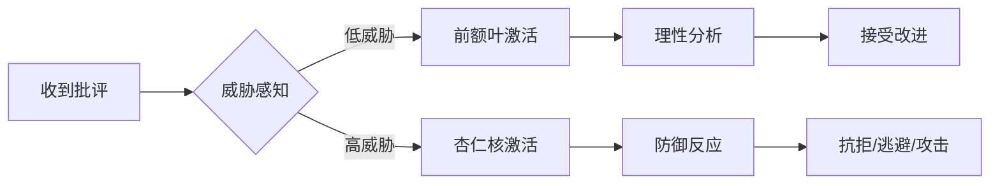
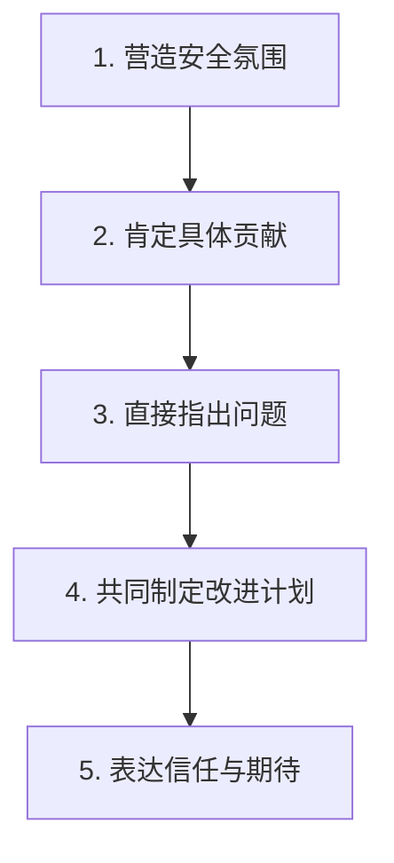
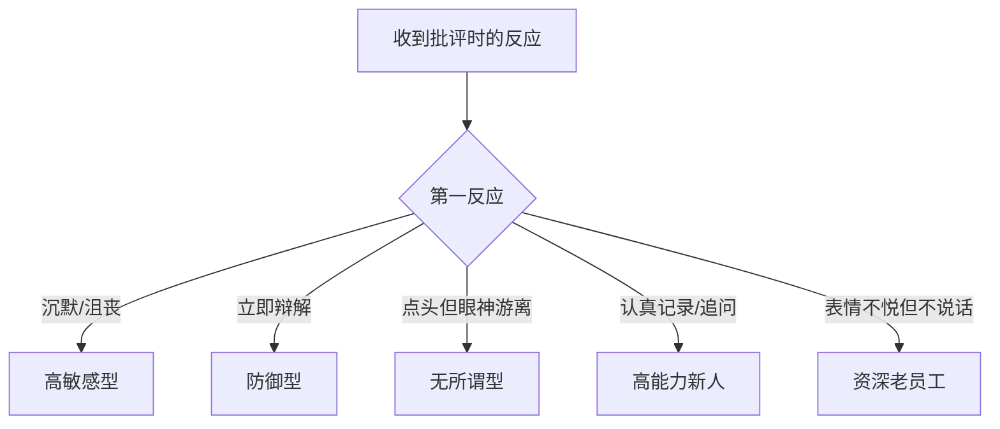
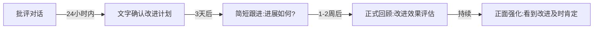

## 三、批评下属的技巧

批评下属是管理者最核心也最具挑战性的沟通能力。研究显示，**72%的员工认为管理者的反馈方式直接影响其工作投入度**（Gallup, 2023），而**65%的员工表示他们希望获得更多反馈，而非更少**（Harvard Business Review, 2022）。这组数据揭示了一个悖论：员工渴望反馈，但管理者却普遍回避批评——因为做得不好会适得其反。

本节将从"道法术器"四个层次，系统讲解如何让批评成为下属成长的催化剂，而非关系的破坏者。

### 3.1 批评的底层逻辑（道）

#### 3.1.1 为什么批评是管理者的必修课

批评的本质不是"指出错误"，而是"推动改变"。很多管理者陷入两个极端：

- **回避型**：怕得罪人，问题攒到最后爆发，下属错失改进时机
- **攻击型**：情绪化批评，伤害下属自尊，团队士气下降

真正有效的批评，需要同时激活下属的**认知系统**（理解问题）和**动机系统**（愿意改变），而非触发其**防御系统**（抗拒、否认、逃避）。

#### 3.1.2 批评的心理学基础

##### 大脑的威胁反应机制

神经科学研究表明，当人感受到批评威胁时，大脑的杏仁核会激活"战或逃"反应，前额叶皮层（负责理性思考）的功能被抑制。这意味着：**批评方式不当，下属根本听不进去内容，只记住了情绪**。

##### SCARF模型：五大心理需求

David Rock的SCARF模型指出，人在社交场景中有五个核心心理需求：

| 需求维度 | 含义 | 批评中的风险点 | 应对策略 |
|---------|------|--------------|---------|
| **S**tatus（地位） | 感觉被尊重和认可 | 批评让人觉得"被看低" | 先肯定能力，再谈问题 |
| **C**ertainty（确定性） | 对未来的预期清晰 | 不知道批评会导致什么后果 | 明确改进方向和标准 |
| **A**utonomy（自主性） | 感觉有选择权 | 被强制要求改变 | 邀请下属参与制定改进方案 |
| **R**elatedness（归属感） | 感觉被接纳和信任 | 批评让人觉得"被排斥" | 表达对下属的持续信任 |
| **F**airness（公平感） | 感觉被公正对待 | 觉得批评不公平或双重标准 | 用事实和数据说话 |

**关键洞察**：每一次批评，本质上都是在管理下属的SCARF感受。做得好，下属会感激你的坦诚；做得差，哪怕你说的都对，下属也会抗拒。

#### 3.1.3 批评与反馈的区别

很多管理者把"批评"等同于"负面反馈"，但两者有本质区别：

| 维度 | 批评（传统） | 反馈（现代） |
|------|------------|------------|
| 目的 | 指出错误，要求改正 | 促进成长，推动改进 |
| 方向 | 单向（上级→下级） | 双向（对话式） |
| 关注点 | 过去的错误 | 未来的行为 |
| 情绪 | 常带有指责感 | 聚焦事实和影响 |
| 结果 | 下属被动接受或抗拒 | 下属主动思考和行动 |

> **核心原则**：本书所讲的"批评"，本质上是建设性反馈——既要指出问题，更要推动改变。

### 3.2 批评的核心方法（法）

#### 3.2.1 SBI反馈模型——用事实说话

SBI（Situation-Behavior-Impact）模型是Center for Creative Leadership开发的经典反馈框架，也是本节推荐的基础方法。

##### 模型拆解

- **S（Situation）情境**：具体的时间、地点、场景，让对方知道你指的是哪件事
- **B（Behavior）行为**：描述可观察的具体行为，而非主观评价或人格标签
- **I（Impact）影响**：说明该行为产生的具体影响（对团队、客户、项目、对方自身）

##### 完整示例对比

**❌ 错误的批评方式：**

> "你这个人做事太不靠谱了！上次那个报告写得乱七八糟！你到底有没有用心？"

**✅ SBI模型批评：**

> "小王，关于上周五提交给客户的季度报告（S），我发现里面的数据有三处计算错误，格式也不符合公司的标准模板（B）。这导致客户对我们团队的专业性产生了质疑，我不得不花两个小时重新修改并向客户道歉（I）。"

**分析**：错误版本包含人格标签（"不靠谱"）、主观评价（"乱七八糟"）、反问句（"有没有用心"），每一项都会触发下属的防御反应。SBI版本全部是事实，下属无法反驳事实，只能面对问题。

##### 进阶：SBI+模型

在SBI基础上增加两个要素，形成SBI+：

- **+ I（Invitation）邀请**：邀请对方分享看法或提出改进方案
- **+ F（Future）未来**：共同讨论未来如何避免类似问题

**完整示例：**

> "小王，关于上周五提交给客户的季度报告（S），我发现里面的数据有三处计算错误，格式也不符合公司的标准模板（B）。这导致客户对我们团队的专业性产生了质疑，我不得不花两个小时重新修改并向客户道歉（I）。你当时是怎么处理这份报告的？有什么困难吗？（I）我们一起想想，后续怎么避免这类问题。（F）"

#### 3.2.2 改进版"三明治"法则

传统的三明治法则是"表扬→批评→表扬"，但研究发现这个方法有两个致命缺陷：

1. **信号模糊**：下属不确定你是在表扬还是批评，只记住两头的表扬
2. **信任损耗**：下属会预判"又要先夸我再骂我了"，对表扬产生怀疑

##### 改进版五步法

**详细操作指南：**

**第一步：营造安全氛围**
- 目的：降低威胁感，让下属进入可接受状态
- 示例："小王，我找你是想聊聊最近的工作情况，有做得好的地方，也有一些需要改进的地方。"
- 注意：不要用"我对你很失望"开头，这会直接触发防御

**第二步：肯定具体贡献**
- 目的：满足Status需求，让下属知道你看到了他的价值
- 示例："你在XX项目中的表现很好，特别是YY方面，客户反馈很积极。"
- 注意：必须是真实的、具体的肯定，而非泛泛的"你做得不错"

**第三步：直接指出问题**
- 目的：清晰传达问题，不留模糊空间
- 示例："但是，在ZZ方面，我观察到了一些需要改进的地方……"
- 注意：使用SBI模型，聚焦事实，避免人格化批评

**第四步：共同制定改进计划**
- 目的：满足Autonomy需求，让下属有参与感和掌控感
- 示例："我们一起看看，接下来可以怎样改进？你觉得需要哪些支持？"
- 注意：不是管理者单方面下达指令，而是共同讨论

**第五步：表达信任与期待**
- 目的：重建Relatedness需求，让下属知道这次批评不会改变你对他的看法
- 示例："我对你的能力很有信心，相信你一定能改进。需要什么支持随时告诉我。"
- 注意：必须是真诚的，否则会适得其反

#### 3.2.3 GROW模型——用于能力发展类批评

当问题根源是能力不足而非态度问题时，GROW模型比SBI更适用：

| 步骤 | 含义 | 示例问题 |
|------|------|---------|
| **G**oal（目标） | 明确期望达到的标准 | "你觉得这个报告应该达到什么标准？" |
| **R**eality（现状） | 了解当前实际情况 | "现在的情况是怎样的？有哪些困难？" |
| **O**ptions（选择） | 探索可能的改进方案 | "有哪些方法可以改善？" |
| **W**ill（意愿） | 确定行动计划和承诺 | "你打算怎么做？需要我提供什么支持？" |

**适用场景**：下属有意愿但能力不足，需要帮助其找到成长路径。

### 3.3 批评的实战技巧（术）

#### 3.3.1 因人而异：针对不同类型下属的策略

不同性格、不同经验水平的下属，对批评的接受方式截然不同。一刀切的批评方式必然效果不佳。

##### 员工类型与应对策略

| 员工类型 | 特征 | 批评风险 | 推荐策略 | 关键话术 |
|---------|------|---------|---------|---------|
| **高敏感型** | 自尊心强，容易情绪化 | 批评后可能消沉或离职 | 轻度暗示 + 私下沟通 | "我注意到一个细节，想和你探讨一下……" |
| **防御型** | 立即辩解，推卸责任 | 陷入争论，无法推进 | 先倾听，再用事实引导 | "我理解你的考虑，但数据显示……" |
| **无所谓型** | 表面接受，实际不改 | 批评无效，问题反复 | 明确后果 + 记录存档 | "这是第三次出现同样问题，我们需要制定明确的改进计划" |
| **高能力新人** | 能力强但经验不足 | 打击积极性 | 框架化反馈 + 赋予挑战 | "以你的能力，这个标准其实可以更高" |
| **资深老员工** | 经验丰富但可能固化 | 触发"资格感"防御 | 尊重 + 数据说话 | "张哥，您经验比我丰富，但这个数据确实有问题，想请教您的看法" |

##### 识别员工类型的关键信号

#### 3.3.2 时机选择：什么时候批评最有效

批评的时机往往比内容更重要。选错时机，再好的话术也白费。

##### 最佳时机矩阵

| 时机 | 适用场景 | 优势 | 风险 |
|------|---------|------|------|
| **问题发生后24小时内** | 明显的工作失误 | 记忆清晰，因果关系明确 | 双方可能情绪未平复 |
| **一对一会议中** | 需要深入讨论的问题 | 私密安全，可以充分交流 | 间隔可能太长 |
| **周报/月报后** | 周期性表现问题 | 有数据支撑，显得客观 | 可能被认为"秋后算账" |
| **项目复盘时** | 团队共同的问题 | 可以借机引导团队学习 | 下属可能觉得在公开批评 |

##### 绝对不能批评的时机

- **公开场合**：除非是团队共性问题的善意提醒，否则永远私下批评
- **下属情绪低落时**：如刚经历家庭变故、身体不适等
- **你自己的情绪不稳定时**：带着怒气的批评100%会变形
- **会议刚结束时**：下属刚经历高强度讨论，认知资源不足
- **下班前/周末前**：下属无法立即行动，反而带着负面情绪离开

#### 3.3.3 情绪管理：批评前的自我检查

管理者在批评前必须完成以下自检清单：

**批评前自检清单：**

- [ ] 我是否已经冷静下来？（愤怒指数≤3/10）
- [ ] 我是否掌握了足够的事实？（不是猜测或听说）
- [ ] 我是否了解了下属的视角？（可能有我不知道的原因）
- [ ] 我的批评目的是什么？（推动改进，而非发泄情绪）
- [ ] 我是否准备好给出具体的改进建议？
- [ ] 我选择的时机和场合是否合适？

> **黄金法则**：如果你需要深呼吸才能平静下来，说明你还没准备好批评。等一等，24小时后再说。

#### 3.3.4 语言技巧：措辞的微妙差异

同样的意思，不同的措辞会产生截然不同的效果：

| 场景 | ❌ 低效措辞 | ✅ 高效措辞 |
|------|-----------|-----------|
| 指出错误 | "你这里做错了" | "这里和我们的标准有差距" |
| 质疑能力 | "你到底会不会做？" | "这个任务的难点在哪里？需要什么支持？" |
| 表达失望 | "我对你很失望" | "这次的结果和我的预期有差距，我们聊聊原因" |
| 要求改进 | "你必须改" | "我建议我们可以尝试……你觉得呢？" |
| 处理重复问题 | "又犯了！" | "我注意到这是第三次出现类似情况，我们需要从根本上解决" |
| 结束对话 | "别再犯了" | "我相信下次你会做得更好，有问题随时找我" |

### 3.4 批评的工具与模板（器）

#### 3.4.1 反馈记录模板

专业的管理者应该建立反馈记录，既是对下属负责，也是对管理行为的自我监督。

**反馈记录表模板：**

| 字段 | 内容 |
|------|------|
| 日期 | 2024-XX-XX |
| 下属姓名 | 张三 |
| 反馈类型 | □ 正面反馈 □ 改进反馈 □ 发展建议 |
| 情境（S） | 具体描述时间、地点、场景 |
| 行为（B） | 具体描述观察到的行为 |
| 影响（I） | 具体描述产生的影响 |
| 下属回应 | 下属当时的反应和解释 |
| 改进计划 | 双方达成的改进方案 |
| 跟进日期 | 2024-XX-XX |
| 跟进结果 | 改进情况评估 |

#### 3.4.2 批评对话脚本框架

**结构化批评对话流程：**

1. 开场（30秒）
   "小王，有个事情想和你聊聊，方便吗？"

2. 情境描述（1分钟）
   "上周三下午的客户演示会上……"

3. 行为描述（1分钟）
   "我注意到你在回答客户技术问题时，有三处数据引用不准确……"

4. 影响说明（30秒）
   "这导致客户对我们的专业度产生了疑虑，后续沟通成本增加了……"

5. 倾听回应（2-3分钟）
   "你当时是怎么考虑的？有什么困难吗？"

6. 共同讨论（3-5分钟）
   "我们一起想想，怎么避免类似情况？"

7. 达成共识（1分钟）
   "那我们就按这个方案来，下周三我再和你跟进一下。"

8. 结束（30秒）
   "你的能力我是认可的，这次只是一个小插曲。加油！"

#### 3.4.3 远程/数字化场景的批评技巧

远程办公场景下，批评的难度显著增加，因为缺少面部表情、肢体语言等非语言信息。

##### 远程批评的特殊挑战

| 挑战 | 原因 | 应对方案 |
|------|------|---------|
| 文字信息容易被误读 | 缺少语气和表情 | 重要批评必须语音/视频，绝不文字 |
| 时差导致延迟反馈 | 问题发生和反馈间隔过长 | 异步反馈 + 约定同步沟通时间 |
| 屏幕疲劳影响接受度 | 长时间视频会议后的认知疲劳 | 批评对话不超过15分钟 |
| 缺少私下空间 | 同住家人可能在旁边 | 提前确认对方是否有隐私空间 |

##### 远程批评的最佳实践

1. **视频优先**：必须看到对方的面部表情，判断其情绪状态
2. **开启摄像头**：管理者先开，营造对等氛围
3. **提前预约**："有个事情想和你视频聊15分钟，今天下午方便吗？"——不要突然发起视频
4. **确认环境**："你现在方便说话吗？旁边有没有人？"
5. **留出沉默空间**：远程对话中，沉默比面对面更尴尬，但不要急于填补，给对方思考时间
6. **会后文字确认**：通话结束后，发一条简短的文字消息确认改进计划，避免理解偏差

#### 3.4.4 常见错误与纠正方案

以下是管理者在批评下属时最常见的错误，以及对应的纠正方案：

| 常见错误 | 为什么是错的 | 正确做法 |
|---------|------------|---------|
| **情绪化批评** | 下属记住的是你的情绪，而非问题 | 愤怒时暂停，冷静后再谈 |
| **公开批评** | 伤害自尊，破坏信任 | 永远私下一对一沟通 |
| **人格化批评** | "你这个人不行"会让下属放弃改变 | 聚焦行为和结果，而非人格 |
| **堆积式批评** | 积攒到一起爆发，下属觉得被"算总账" | 发现问题及时反馈 |
| **模糊批评** | "你最近状态不好"——下属不知道具体要改什么 | 使用SBI模型，给出具体事实 |
| **只批评不指导** | 下属知道错了但不知道怎么改 | 每次批评都要有改进方向 |
| **公开表扬后私下批评** | 三明治法的变体，下属会质疑所有表扬 | 表扬和批评分开，各自独立 |
| **比较式批评** | "你看看人家小李"——激发嫉妒而非动力 | 聚焦对方自身的行为和标准 |
| **威胁式批评** | "再这样就走人"——破坏心理安全感 | 说明后果但保持尊重 |
| **忽视文化差异** | 不同文化背景的人对批评的接受度不同 | 了解下属的文化背景，调整方式 |

#### 3.4.5 高级技巧：面向资深管理者的进阶内容

##### 技巧一：预批评（Pre-feedback）

在问题尚未发生时，通过设定预期来预防问题：

> "这次项目很关键，客户对细节要求很高。我知道你有能力做好，我们一起把质量检查流程再过一遍。"

**原理**：这满足了Certainty需求（明确标准）和Relatedness需求（表达信任），比事后批评更有效。

##### 技巧二：自批评开场

先承认自己的不足，降低下属的防御：

> "这个项目延期，我也有责任——我在项目初期没有给你足够的资源支持。但我也注意到，在执行层面有一些可以改进的地方……"

**注意**：自批评必须是真实的，否则会被下属看穿，反而损害信任。

##### 技巧三：提问式批评

用问题引导下属自己发现问题，而非直接指出：

> "你回顾一下这次客户演示，如果重新做一次，你会在哪些地方做不同的选择？"

**优势**：下属自己得出的结论，接受度远高于管理者强加的结论。

##### 技巧四：360度反馈整合

将管理者的批评与其他来源的反馈整合，让下属看到问题的全景：

| 反馈来源 | 反馈内容 | 整合方式 |
|---------|---------|---------|
| 上级（你） | 直接观察到的行为问题 | 主反馈 |
| 同级同事 | 协作中的配合问题 | 交叉验证 |
| 下属本人 | 自我评估 | 发现认知差距 |
| 客户/合作方 | 外部视角的评价 | 补充证据 |

##### 技巧五：建立团队反馈文化

最高境界不是管理者会批评，而是团队形成了互相反馈的文化：

1. **示范**：管理者主动邀请下属给自己反馈
2. **培训**：教会团队成员使用SBI模型
3. **制度化**：在项目复盘中加入"反馈环节"
4. **保护**：建立反馈安全机制，防止反馈变成攻击

#### 3.4.6 批评后的跟进与闭环

批评不是对话结束就完了，后续跟进决定了批评是否真正产生效果。

##### 跟进时间表

##### 跟进的关键原则

1. **不要只盯问题**：看到改进要及时肯定，否则下属觉得"改不改都一样被挑刺"
2. **记录改进轨迹**：用反馈记录表跟踪，为绩效评估提供依据
3. **调整预期**：如果下属确实在改进，不要因为一次小反复就全盘否定
4. **升级机制**：如果多次反馈无改善，需要升级为正式的绩效改进计划（PIP）

### 3.5 实战案例分析

#### 3.5.1 案例一：技术骨干的代码质量问题

**背景**：小李是团队的技术骨干，代码能力很强，但最近几次提交的代码测试覆盖率不足，导致线上bug增加。

**❌ 常见错误处理：**

> "小李，你最近代码质量下降了，测试覆盖率这么低，你是不是在偷懒？"

**✅ 正确处理（SBI+）：**

> "小李，我看了最近三次代码提交的记录（S），测试覆盖率从之前的85%降到了60%，有两次合并后出现了线上bug（B）。这导致运维团队需要紧急修复，整体发布节奏也受到了影响（I）。你最近是不是在同时处理太多任务？我们一起看看怎么调整。（I）后续我们约定一个测试覆盖率的最低标准，你觉得80%合适吗？（F）"

**跟进**：一周后确认覆盖率恢复，两周后正式回顾，肯定改进。

#### 3.5.2 案例二：新员工的汇报质量问题

**背景**：小陈是入职3个月的新员工，周报内容空洞，缺乏数据支撑。

**❌ 常见错误处理：**

> "你这周报写的是什么？完全没有重点！"

**✅ 正确处理（GROW模型）：**

> "小陈，我们聊聊周报的事。你觉得一份好的周报应该包含什么内容？（G）你现在写周报时，主要的困难是什么？（R）你有没有看过团队里其他人的周报？觉得谁的写得好？可以参考一下。（O）那我们约定一个模板，下周你按照这个格式来写，我再给你反馈。（W）"

**跟进**：提供周报模板，下周给予具体反馈，逐步放手。

#### 3.5.3 案例三：远程员工的工作效率问题

**背景**：小赵是远程员工，最近响应速度变慢，多次错过deadline。

**❌ 常见错误处理：**

> 微信消息："你最近怎么回事？每次都要催才交？"

**✅ 正确处理：**

> 提前预约视频通话，确认隐私环境后：
> "小赵，最近几个任务的交付时间都比预期晚了1-2天（S），比如上周的方案和这周一的数据报告（B）。这导致下游同事的工作被影响，整体项目进度有风险（I）。你最近在家办公有没有什么困难？时间管理上需要什么支持？（I）我们一起制定一个任务管理方案，确保后续按时交付。（F）"

**跟进**：建立每日站会或异步打卡机制，两周后评估改善情况。

### 3.6 批评能力自评量表

管理者可以使用以下量表定期自评批评能力：

| 评估维度 | 1分（很少） | 3分（有时） | 5分（经常） |
|---------|-----------|-----------|-----------|
| 批评前是否冷静自检 | 直接开怼 | 偶尔冷静 | 每次都自检 |
| 是否使用事实而非评价 | 常用"你这个人" | 偶尔用事实 | 始终聚焦行为 |
| 是否给予改进方向 | 只说问题 | 偶尔给建议 | 每次都有方案 |
| 是否跟进改进情况 | 说完就忘 | 偶尔跟进 | 系统性跟进 |
| 是否因人调整方式 | 一刀切 | 偶尔调整 | 根据类型定制 |
| 下属接受度如何 | 常有抵触 | 偶尔抵触 | 大多接受并改进 |

**评分标准**：24-30分：优秀；18-23分：良好；12-17分：需要改进；<12分：急需系统学习。

### 3.7 本节核心要点回顾

1. **道**：批评的本质是推动改变，而非发泄情绪；理解大脑的威胁反应机制和SCARF模型，是做好批评的心理学基础
2. **法**：掌握SBI/SBI+、改进版三明治法、GROW模型三大框架，应对不同场景
3. **术**：因人而异、把握时机、管理情绪、注意措辞，是批评的四大实战技巧
4. **器**：反馈记录表、对话脚本、自评量表、跟进时间表，是将批评标准化的工具

> **最后的提醒**：没有完美的批评技巧，只有真诚的管理者。技巧是工具，真诚是底色。当你真心希望下属成长时，即使措辞不够完美，下属也能感受到你的善意。

***
