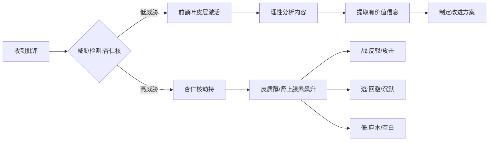
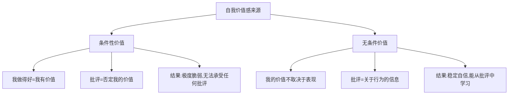
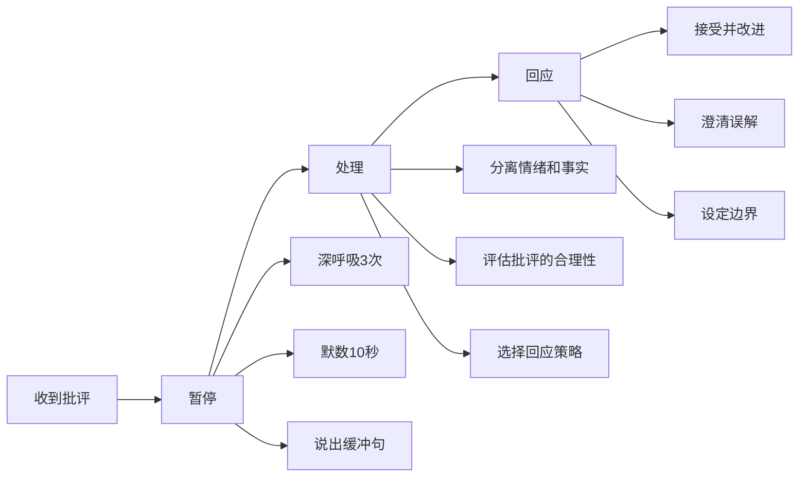
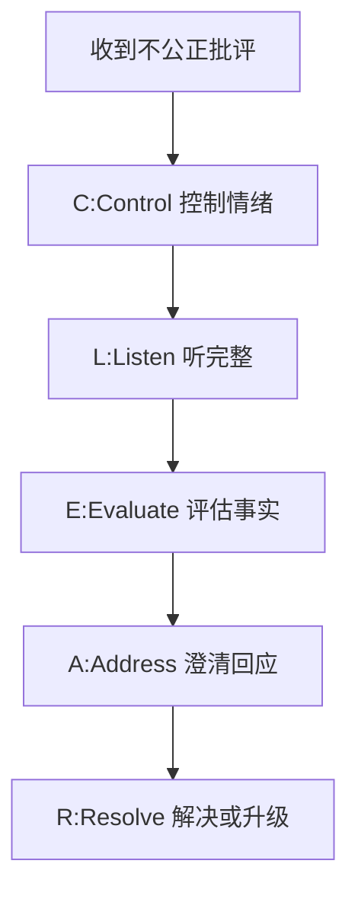
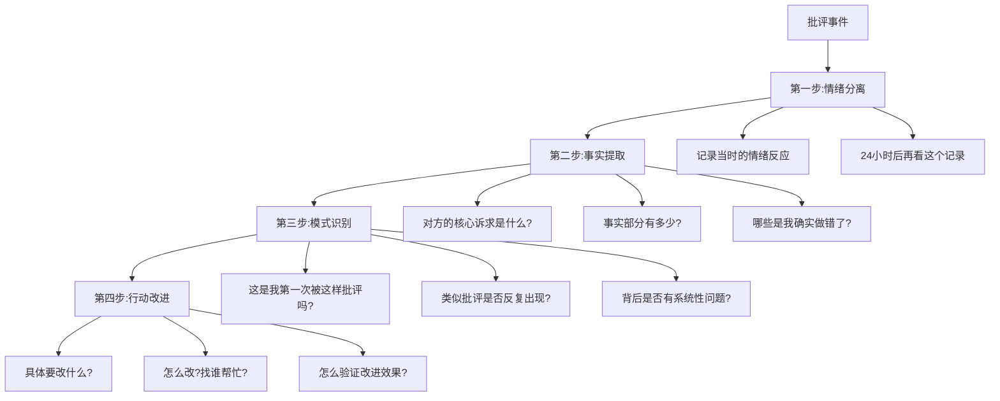
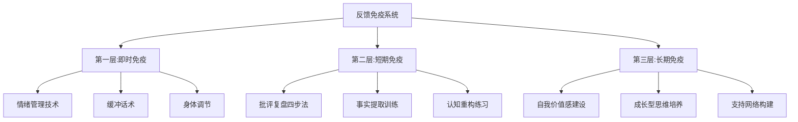

## 四、接受批评的技巧

职场中，比"会批评人"更难的能力是"会接受批评"。Gallup 2023年的调研显示，**能够积极接受反馈的员工，其绩效提升速度是拒绝反馈者的2.4倍**。然而现实中，大多数人在收到批评的第一秒就进入了防御模式——大脑还没来得及分析内容，情绪系统已经拉响了警报。

本节从"道法术器"四个层次，系统讲解如何将批评从"令人痛苦的攻击"转化为"推动成长的礼物"。

### 4.1 被批评时的心理机制（道）

#### 4.1.1 大脑的威胁反应：为什么批评让人痛苦

当人接收到批评信息时，大脑的处理路径并非"理性分析→做出回应"，而是"威胁检测→情绪反应→理性介入（如果还有机会的话）"。

神经科学研究表明，批评会激活大脑的**前扣带回皮层（ACC）**——这个区域与身体疼痛共享神经通路。换句话说，**被批评时大脑的反应和被打一拳在神经层面高度相似**。这就解释了为什么"忠言逆耳"不是矫情，而是生理事实。

##### 三种防御反应模式

| 模式 | 表现 | 内心独白 | 后果 |
|------|------|----------|------|
| **战（Fight）** | 立即辩解、反驳、攻击对方 | "你凭什么这么说我？" | 激化冲突，损害关系 |
| **逃（Flight）** | 沉默点头、敷衍应承、事后回避 | "好好好你说得对行了吧" | 表面和谐，实际无效 |
| **僵（Freeze）** | 大脑空白、无法思考、情绪崩溃 | "我不知道该说什么……" | 错失沟通机会，留下创伤 |

**关键认知**：这三种反应都是正常的生理机制，不是你的"性格缺陷"。但认识到它们的存在，是学会超越它们的第一步。

#### 4.1.2 自我价值感与批评承受力

一个人对批评的承受力，与其**自我价值感的结构**密切相关：

**条件性价值感**的典型表现：
- 被批评后，不是想"这个问题怎么改"，而是想"我是不是很差劲"
- 把"我做的事"和"我这个人"混为一谈
- 需要持续的外部认可来维持自我感觉
- 一次批评可以抵消十次表扬

**无条件价值感**的核心特征：
- "我的价值是内在的，不取决于别人怎么评价我"
- "批评是关于我的某个行为的信息，不是对我整个人的审判"
- "我可以同时承认错误和肯定自己的价值"

> **心理学家Carl Rogers的观点**：当一个人能够将"自我价值"与"行为表现"分离时，他才真正具备了从批评中学习的能力。这不是说对批评麻木，而是说有能力在情绪波动中保持核心自我稳定。

#### 4.1.3 批评≠否定：认知重构的核心逻辑

接受批评最关键的思维转变是**将"被攻击"的心态重构为"获得信息"的心态**。

| 原始认知 | 重构后认知 |
|----------|-----------|
| "他在否定我" | "他在描述一个行为及其影响" |
| "他觉得我不行" | "他指出了一个可以改进的点" |
| "他在针对我" | "他可能在帮我避免更大的问题" |
| "我必须证明自己没错" | "我需要理解他的视角，再做判断" |
| "承认错误=软弱" | "承认错误=自信和成熟" |

这种认知重构不是"阿Q精神胜利法"，而是一种**元认知能力**——在情绪反应发生的同时，保持一个观察者视角，审视自己的思维过程。

#### 4.1.4 批评的四种真实来源

不是所有批评都出于善意，但也不是所有批评都出于恶意。准确识别批评者的动机，是正确回应的前提：

| 来源类型 | 动机 | 特征 | 应对策略 |
|----------|------|------|----------|
| **善意建设型** | 希望你改进和成长 | 聚焦具体行为，提供改进方向，语气温和 | 全面接受，认真落实 |
| **客观反馈型** | 基于事实和数据的判断 | 不带情绪，有据可查，对事不对人 | 理性分析，提取信息 |
| **情绪宣泄型** | 对方自身压力/不满的转移 | 措辞激烈，人身攻击，缺乏具体事实 | 过滤情绪，找到核心信息 |
| **恶意攻击型** | 打压、控制、竞争目的 | 无中生有，公开羞辱，持续针对 | 设定边界，必要时反击 |

**区分方法**：问自己三个问题——
1. 这个批评指向的是**具体行为**还是**我的人格**？（行为→更可能是善意，人格→更可能是恶意）
2. 批评者是否提供了**改进方向**？（有→建设型，没有→可能是情绪宣泄）
3. 如果我把情绪剥离，**事实部分**是否成立？（成立→接受事实，不成立→可能有误解或恶意）

### 4.2 接受批评的核心方法（法）

#### 4.2.1 LEARN模型——系统化接受批评

LEARN模型是接受批评的基础框架，五个步骤环环相扣，缺一不可。

##### L — Listen（倾听）

**核心原则**：听完，全部听完，不打断。

倾听看似简单，但在批评场景中极其困难。因为当大脑进入防御模式时，你听到的不是对方的完整表述，而是被恐惧筛选后的碎片。你会自动捕捉"关键词"（如"问题""错误""不好"），而忽略上下文和具体细节。

**倾听的三个层次：**

| 层次 | 表现 | 效果 |
|------|------|------|
| **听声音** | 听到了对方在说话，但内心在准备反驳 | 只听到触发情绪的关键词 |
| **听内容** | 努力理解对方在说什么 | 能抓住核心信息 |
| **听意图** | 理解对方为什么说这些，想要什么结果 | 完整理解，为有效回应奠基 |

**实操技巧：**
- **身体前倾**：物理姿态会影响心理状态，前倾代表"我在认真听"
- **双手放下**：抱胸是防御姿态，放下双手降低自身的防御感
- **眼神接触**：看着对方的眼睛（或眉心），表示"我没有逃避"
- **心里默念**："他在给我信息，不是在攻击我"
- **不急于辩解**：即使你100%不同意，也先听完

##### E — Empathize（共情）

**核心原则**：理解对方的感受和立场，即使你不同意他的观点。

共情不是"认输"，而是"站在对方的角度看问题"。很多时候，批评者的愤怒和不满并非针对你个人，而是因为他们承受了某种压力——客户的投诉、上级的问责、项目的风险。

**共情的话术模板：**
- "我理解您的担心……"
- "站在您的角度，确实会觉得……"
- "我能感受到这件事对您的影响……"
- "如果我是您，看到这个结果可能也会……"

**共情的边界**：共情对方的感受，不代表接受对方的所有判断。你可以说"我理解您的不满"，而不必说"您说得全对"。

##### A — Acknowledge（承认）

**核心原则**：如果批评有道理，坦诚承认；如果有误解，先承认部分事实再澄清。

承认错误是整个LEARN模型中最难的一步，因为它直接挑战了人的自我保护本能。但恰恰是这一步，决定了批评对话的走向——是变成建设性的双向沟通，还是变成防御性的互相消耗。

**承认的三个层次：**

| 层次 | 话术 | 适用场景 |
|------|------|----------|
| **承认事实** | "您说得对，报告里确实有三处数据错误" | 事实明确，无法否认 |
| **承认影响** | "这件事确实给团队带来了额外工作量" | 影响客观存在 |
| **承认责任** | "这是我的疏忽，我应该在提交前多检查一遍" | 自己确实有责任 |

**注意**：承认不等于全盘认错。你可以说"数据确实有误"而不必说"我整个报告都做得很差"。精确的承认比笼统的认错更有价值。

##### R — Respond（回应）

**核心原则**：冷静、理性地回应，必要时澄清误解，但不以辩解为主。

如果批评存在误解，你有权澄清事实。但澄清的方式决定了效果——用事实说话 vs 用情绪反驳，效果天差地别。

**澄清误解的公式：承认感受 + 补充事实 + 共同确认**

> "我理解您为什么会这么认为（承认感受）。不过当时的情况是……（补充事实）。您看这个理解是否准确？（共同确认）"

**绝对避免的回应方式：**
- "但是……"（"但是"前面的承认会被抵消）
- "你也有问题……"（转移焦点，激化冲突）
- "你根本不懂……"（否定对方的资格）
- "随便你怎么想……"（放弃沟通，伤害关系）

##### N — Next Steps（下一步）

**核心原则**：将批评转化为具体的行动计划，用行动证明你的态度。

批评的价值不在于对话本身，而在于对话之后的行为改变。如果你听完、共情、承认、回应了，但事后没有任何改变，那这次批评就是完全浪费的。

**行动计划的模板：**
- "接下来我打算……（具体行动）"
- "我会在……之前完成……（时间节点）"
- "如果遇到困难，我会……（预案）"
- "到时候能否请您再帮我看看？（闭环机制）"

##### LEARN模型完整示例

**场景**：领导在周会上指出你的项目进度滞后。

**❌ 错误回应：**

> "这个不能全怪我啊，需求一直在变，而且其他部门配合也不到位……"
> （效果：领导觉得你在推卸责任，更加不满）

**✅ LEARN模型回应：**

> **L**：认真听完领导的批评，不打断。
>
> **E**："我理解您的担心，项目进度确实关系到整个季度目标。"
>
> **A**："您说得对，这个项目的进度比计划慢了一周，这其中有我的责任——我在任务分解时低估了联调的复杂度。"
>
> **R**："不过我也想补充一个情况：中间有一次需求变更，导致前端需要返工三天。这部分时间我没有在计划中预留，这是我的失误。"
>
> **N**："接下来我打算重新梳理剩余任务的优先级，把联调和测试并行推进，争取在下周五前追回进度。我会每天更新进度看板，有风险及时同步。"

#### 4.2.2 "暂停—处理—回应"三阶段法

LEARN模型适用于你能冷静应对的场景。但当批评来得突然、措辞激烈、或者戳中你的痛点时，你可能根本来不及执行LEARN——因为情绪系统已经"劫持"了你的大脑。

这时候需要一个更底层的框架：**暂停—处理—回应**。

**暂停阶段的缓冲句**（给自己争取时间）：
- "让我想一想……"
- "您说得这点很重要，我需要消化一下。"
- "我能不能先确认一下我的理解是否正确？"
- "这件事对我也很重要，容我认真想想怎么回应。"

**处理阶段的自问清单**：
1. 对方的核心诉求是什么？（要我改什么？）
2. 事实部分是否准确？（哪些是我确实做得不好的？）
3. 情绪部分有多少？（对方的愤怒中，有多少是合理的压力释放？）
4. 我的最佳回应是什么？（接受/澄清/搁置/升级？）

#### 4.2.3 三明治接收法——主动寻找批评中的价值

大多数批评都像一个"三明治"：外层是情绪，中间是信息，底层是动机。

| 层次 | 内容 | 处理方式 |
|------|------|----------|
| **外层：情绪** | 对方的愤怒、失望、不满 | 过滤掉，不让它影响你的判断 |
| **中间：信息** | 具体的问题描述、事实、数据 | 提取出来，认真分析 |
| **底层：动机** | 对方为什么说这些？想要什么？ | 理解动机，找到回应方向 |

**实操方法**：

收到批评后，在心里（或纸上）做一次"三层拆解"——

> **原始批评**："你这个方案太不专业了，逻辑混乱，客户根本看不懂！"
>
> **外层情绪**：对方很不满，可能承受了来自客户的压力 → 过滤
> **中间信息**：方案的逻辑不够清晰，客户理解有困难 → 提取
> **底层动机**：希望方案质量提升，维护客户关系 → 理解

拆解之后，你会发现真正需要回应的只有中间那层信息。情绪和动机都可以暂时放下，专注于"方案逻辑需要改进"这个核心问题。

### 4.3 接受批评的实战技巧（术）

#### 4.3.1 情绪管理：批评中的即时调节技术

当你感受到批评带来的情绪冲击时，以下技术可以帮助你在几秒到几分钟内恢复平静：

**技术一：4-7-8呼吸法**

| 步骤 | 操作 | 时间 |
|------|------|------|
| 1 | 用鼻子缓慢吸气 | 4秒 |
| 2 | 屏住呼吸 | 7秒 |
| 3 | 用嘴缓慢呼气 | 8秒 |
| 4 | 重复3-4个循环 | 约1分钟 |

**原理**：延长呼气时间会激活副交感神经系统，降低心率和皮质醇水平，帮助大脑从"战或逃"模式切换回"休息和消化"模式。

**技术二：认知标签法**

当情绪涌上来时，给它贴个标签："我现在感到愤怒/委屈/羞耻。"

研究表明，**仅仅是命名情绪就能降低杏仁核的活跃度**——这个过程在心理学中被称为"affect labeling"。你不是在压抑情绪，而是在用语言"框定"它，让它从失控的状态变成可观察的对象。

**技术三：物理锚点法**

选择一个身体感觉作为"锚点"——比如双脚踩在地面上的感觉、手指按压桌面的触感。当情绪冲击来临时，把注意力转移到这个锚点上。

**原理**：身体感觉是"当下"的，而情绪往往是对"过去"（被批评的记忆）或"未来"（后果的恐惧）的反应。把注意力拉回"当下"，可以打破情绪的反刍循环。

**技术四：场景切换法**

如果批评发生在会议上，请求："这个问题很重要，我能不能会后和您单独聊？"这不是逃避，而是给自己争取处理情绪的时间，也为更充分的沟通创造条件。

#### 4.3.2 身体语言：接受批评时的正确姿态

非语言信号不仅影响别人对你的印象，也会反过来影响你自己的心理状态。

| 维度 | ❌ 防御姿态 | ✅ 开放姿态 |
|------|-----------|-----------|
| 眼神 | 躲闪、翻白眼、盯着地面 | 保持适度眼神接触 |
| 面部 | 皱眉、撇嘴、冷笑 | 平和表情，适度点头 |
| 手臂 | 抱胸、攥拳、手指指人 | 双手自然放在桌上或膝盖上 |
| 身体 | 后仰、转向门口、晃腿 | 身体微微前倾，面向对方 |
| 声音 | 音调升高、语速加快、声音变大 | 保持平稳语调，适当放慢语速 |

**心理学原理**：Amy Cuddy的研究表明，身体姿态会反过来影响心理状态——开放的姿态不仅让别人觉得你更自信和可沟通，也会让你自己的皮质醇（压力激素）水平下降，睾酮（自信激素）水平上升。这不是"装"，而是通过身体引导心理。

#### 4.3.3 高频场景应对话术

以下是职场中最常见的批评场景，以及经过验证的高效回应话术：

##### 场景一：领导当众指出你的问题

**情境**：周会上，领导说"这个数据明显有问题，你怎么连基本的校验都不做？"

| 步骤 | 话术 | 说明 |
|------|------|------|
| 暂停 | （深呼吸，3秒沉默） | 不要立即反驳 |
| 承认 | "您说得对，这个数据确实有错误" | 不回避事实 |
| 补充 | "会后我立即核查修正，今天下班前给您更新版" | 给出行动方案 |
| 收尾 | "后续我会增加交叉校验环节，避免再出这类问题" | 展示改进意识 |

**注意**：当众批评时，不要展开详细讨论或争论细节。简洁承认 + 承诺改进，会后再深入沟通。

##### 场景二：同事在协作中批评你的方案

**情境**：跨部门会议上，同事说"你们这个方案完全没考虑我们的实际情况"

| 步骤 | 话术 |
|------|------|
| 共情 | "我理解您的顾虑，业务侧确实有很多我们不太了解的细节" |
| 请教 | "您能具体说说哪些地方和实际情况有冲突吗？" |
| 记录 | （认真记录，表示重视） |
| 协商 | "我们能不能会后详细对一下？确保方案充分考虑业务侧的需求" |

##### 场景三：下属通过反馈表达不满

**情境**：下属在一对一中说"我觉得您上次的决策有问题，导致我们做了很多无用功"

| 步骤 | 话术 |
|------|------|
| 倾听 | "你说，我听着" |
| 共情 | "做了无用功确实让人沮丧，我能理解" |
| 追问 | "你能具体说说是哪个决策、哪些环节的无用功吗？" |
| 反思 | "你说得对，当时我确实没有充分征求你们的意见" |
| 行动 | "后续重大决策我会先开一个方案讨论会，听听大家的想法" |

##### 场景四：客户投诉你的服务/产品

**情境**：客户说"你们的产品太差了，完全不值这个价"

| 步骤 | 话术 |
|------|------|
| 共情 | "我能理解您的不满，花了钱却没有得到预期的体验" |
| 确认 | "您能具体说说是哪些方面没有达到您的期望吗？" |
| 解决 | "针对您提到的XX问题，我们可以……" |
| 补偿 | "为了弥补这次的体验，我们可以为您提供……" |

##### 场景五：来自前辈/导师的批评

**情境**：师傅说"你现在做事太急躁了，只追求速度不追求质量"

| 步骤 | 话术 |
|------|------|
| 感谢 | "谢谢师傅指出这个问题，我自己可能没意识到" |
| 承认 | "确实最近赶进度，有些环节做得粗糙了" |
| 请教 | "您觉得我现在最需要在哪方面慢下来？" |
| 承诺 | "我会调整节奏，下周先把手头这个模块重新过一遍质量" |

#### 4.3.4 处理不公正批评的策略

不是所有批评都是公正的。面对基于误解、偏见、信息不对称甚至恶意的批评，"全盘接受"不是正确策略——你需要**既保护自己，又不失风度**。

##### 不公正批评的分类

| 类型 | 特征 | 例子 |
|------|------|------|
| **信息不对称** | 批评者不了解完整情况 | "你这个月迟到三次了"（实际只有一次，另外两次是外勤） |
| **归因偏差** | 把系统问题归咎于个人 | "项目延期都是你的责任"（实际是多部门配合问题） |
| **以偏概全** | 用一个错误否定整体 | "你上次那个报告写得不好，你的能力不行" |
| **双重标准** | 对不同人使用不同标准 | 同样的错误，别人没事，你就被批评 |
| **恶意攻击** | 打压、竞争、人身攻击 | "就你这水平还来做这个项目？" |

##### 处理策略：CLEAR模型

**C — Control（控制情绪）**

不公正的批评比公正的批评更容易触发情绪反应——因为"被冤枉"的感受比"被指出错误"更强烈。这时候情绪管理尤其重要。

**L — Listen（听完）**

即使你觉得批评不对，也先听完。打断只会让对方更加坚持自己的判断。

**E — Evaluate（评估事实）**

在心里快速评估：批评中哪些是事实？哪些是误解？哪些是偏见？

**A — Address（澄清回应）**

**回应公式：承认感受 + 呈现事实 + 提供证据 + 邀请确认**

> "我理解您为什么会这么想（承认感受）。不过当时的情况是……（呈现事实）。您可以看一下这个记录/邮件/数据（提供证据）。您看是否和您了解到的不太一样？（邀请确认）"

**关键措辞对比：**

| ❌ 低效措辞 | ✅ 高效措辞 |
|------------|-----------|
| "您搞错了" | "可能有些信息我们理解不一致" |
| "您根本不了解情况" | "有些背景信息可能没有同步到您这边" |
| "这不公平" | "我想补充一些您可能不知道的情况" |
| "您在针对我" | "我想确保您有完整的信息来做判断" |

**R — Resolve（解决或升级）**

- 如果澄清后对方接受 → 感谢对方的理解，问题解决
- 如果对方坚持不公判断 → 不必当场争论，"我理解您的看法，这个问题我希望能找个时间和您再详细讨论一下"
- 如果涉及严重不公 → 记录证据，寻求HR或更高管理层介入

#### 4.3.5 面对公开批评的特殊处理

公开批评是职场中最难处理的场景——它同时涉及你的面子、你的形象、以及与批评者的关系。

##### 公开批评的应对原则

1. **不激化**：绝不在公开场合与批评者争论。即使你是对的，公开争论的赢家也是输家
2. **简洁回应**：承认 + 承诺跟进，不展开讨论
3. **会后沟通**：找机会与批评者私下深入交流
4. **修复形象**：通过后续行动而非当场辩解来修复印象

##### 公开批评的话术模板

> "感谢您指出这个问题。这方面确实有需要改进的地方，我会尽快处理，稍后和您详细沟通。"

这句话的精妙之处在于：
- "感谢"——展示格局和成熟
- "确实有需要改进"——承认问题但不全盘否定自己
- "尽快处理"——承诺行动
- "稍后详细沟通"——把深入讨论转移到私下场景

#### 4.3.6 批评中的提问技巧

接受批评不是单向的"挨训"。通过恰当的提问，你可以将批评转化为有价值的对话。

| 提问类型 | 示例 | 目的 |
|----------|------|------|
| **澄清性提问** | "您能具体说说是哪个环节出了问题吗？" | 获取具体信息，避免笼统批评 |
| **标准性提问** | "您觉得这个应该达到什么标准？" | 明确期望，避免"我觉得好你觉得不好" |
| **原因性提问** | "您觉得这个问题的根本原因是什么？" | 深入问题本质，找到真正改进点 |
| **方案性提问** | "您觉得怎么做会更好？" | 获取具体改进方向 |
| **预防性提问** | "后续怎样才能避免再次出现？" | 从单次修复升级到系统预防 |

**提问的注意事项**：
- 提问的语气必须是"求教"而非"质疑"——"您能说说具体是哪里"而非"你说具体点啊"
- 不要连续提问超过三个，否则对方会觉得你在"审问"他
- 先承认再提问——"您说得对，这方面确实有问题。您觉得怎样改进比较好？"

### 4.4 从批评中成长的系统方法（器）

#### 4.4.1 批评复盘四步法

每一次批评都是一次学习机会，但前提是你要有意识地"复盘"，而不是让批评的情绪随时间消散后就什么都不剩。

**第一步：情绪分离**

批评发生后的24小时内，先记录下自己的情绪反应（愤怒、委屈、羞耻、焦虑等），但不做任何判断和决定。24小时后重新看这些记录，你会发现自己对事件的感知发生了显著变化。

**第二步：事实提取**

把批评中的情绪性表达全部剥离，只留下事实和信息：
- "你做事太不靠谱了" → 剥离 → 留下的信息是"对方对我近期的工作质量不满"
- "你到底有没有用心" → 剥离 → 留下的信息是"对方期望看到更高的投入度"

**第三步：模式识别**

问自己：这是我第一次收到类似的批评吗？
- 如果是第一次 → 可能是偶发问题，改进即可
- 如果不是 → 背后可能有系统性问题，需要深入反思

| 反复出现的批评 | 可能的深层原因 |
|---------------|---------------|
| "你总是不及时回复" | 时间管理或优先级设置有问题 |
| "你的报告不够详细" | 对"详细"的标准理解不一致 |
| "你做事太慢了" | 可能是追求完美导致的效率问题 |
| "你沟通不够主动" | 工作习惯或性格内向导致 |

**第四步：行动改进**

制定SMART改进计划：
- **S**pecific：具体改什么？（如"每天下班前主动汇报进度"）
- **M**easurable：怎么衡量改进了？（如"连续两周每天主动汇报"）
- **A**chievable：能做到吗？（不要设定不切实际的目标）
- **R**elevant：和批评的问题直接相关吗？
- **T**ime-bound：多长时间内完成改进？

#### 4.4.2 批评日志模板

建立"批评日志"是将零散的批评转化为系统性成长的有效工具。

┌─────────────────────────────────────────────────────────────┐
│                     批评日志记录表                           │
├──────────────┬──────────────────────────────────────────────┤
│ 日期         │ 2024-XX-XX                                   │
├──────────────┼──────────────────────────────────────────────┤
│ 批评者       │ 直属领导/同事/客户/下属                       │
├──────────────┼──────────────────────────────────────────────┤
│ 场景         │ 周会/一对一/邮件/客户现场                      │
├──────────────┼──────────────────────────────────────────────┤
│ 原始批评内容 │ （完整记录，包括原话）                         │
├──────────────┼──────────────────────────────────────────────┤
│ 情绪反应     │ （当时的感受：愤怒/委屈/羞耻……）              │
├──────────────┼──────────────────────────────────────────────┤
│ 事实提取     │ （剥离情绪后的核心信息）                       │
├──────────────┼──────────────────────────────────────────────┤
│ 批评合理性   │ □完全合理 □部分合理 □基于误解 □不公正        │
├──────────────┼──────────────────────────────────────────────┤
│ 我的回应     │ （当时是怎么回应的）                           │
├──────────────┼──────────────────────────────────────────────┤
│ 改进计划     │ （具体要做什么改变）                           │
├──────────────┼──────────────────────────────────────────────┤
│ 改进结果     │ （一周/一个月后回顾填写）                      │
├──────────────┼──────────────────────────────────────────────┤
│ 反思收获     │ （这次批评教会了我什么）                       │
└──────────────┴──────────────────────────────────────────────┘

**使用建议**：
- 每次收到批评后的24小时内填写
- 每月回顾一次，寻找模式
- 每季度做一次总结，评估成长
- 如果某类批评反复出现，需要制定专项改进计划

#### 4.4.3 自我评估量表：你的批评承受力如何

使用以下量表定期评估自己接受批评的能力：

| 评估维度 | 1分（几乎不会） | 3分（偶尔） | 5分（总是） |
|----------|----------------|------------|------------|
| 收到批评时能控制情绪 | 立即情绪爆发 | 需要几分钟冷静 | 能保持平静倾听 |
| 能听完完整批评再回应 | 经常打断反驳 | 大多数时候能听完 | 总是先听完 |
| 能区分情绪和事实 | 完全被情绪主导 | 有时能分开 | 能清晰拆解 |
| 能坦诚承认自己的错误 | 阶段性否认或辩解 | 有时能承认 | 对就是对错就是错 |
| 能从批评中提取有价值的信息 | 觉得批评都是攻击 | 有时能找到有用信息 | 每次都有收获 |
| 会根据批评做出实际改变 | 听完就忘 | 偶尔改 | 系统性改进 |
| 能处理不公正的批评而不失控 | 情绪崩溃或激烈反击 | 需要很长时间消化 | 冷静澄清或放下 |
| 会主动寻求反馈 | 害怕听到批评 | 偶尔主动问 | 定期寻求反馈 |

**评分标准**：
- **33-40分**：你已经具备了成熟的批评接受能力，继续保持
- **25-32分**：不错，但某些场景下仍有提升空间
- **17-24分**：需要系统性训练，建议从情绪管理开始
- **<17分**：建议从认知重构开始，可能需要专业心理辅导帮助建立自我价值感

#### 4.4.4 主动寻求反馈：从被动接受到主动出击

最高段位的批评接受能力，不是"能忍住不发火"，而是**主动向别人寻求批评**。

##### 主动寻求反馈的四个时机

| 时机 | 问什么 | 为什么重要 |
|------|--------|-----------|
| **项目完成后** | "这个项目我哪些地方做得好？哪些可以改进？" | 及时复盘，趁记忆清晰 |
| **新任务开始前** | "基于上次的经验，您觉得我这次应该注意什么？" | 提前设定期望，预防问题 |
| **定期一对一中** | "最近有没有什么地方您觉得我需要改进的？" | 建立持续反馈的通道 |
| **晋升/考核前** | "您觉得我距离下一个级别还差什么？" | 获得清晰的成长方向 |

##### 主动寻求反馈的话术

**向领导寻求：**
> "领导，我最近想在XX方面提升一下，您觉得我目前做得怎么样？有哪些需要改进的地方？"

**向同事寻求：**
> "这次合作，你觉得我在配合上有什么可以做得更好的地方？不用客气，直说就行。"

**向下属寻求：**
> "我作为你们的leader，你们觉得有哪些地方我可以做得更好？匿名问卷也行，你们怎么方便怎么来。"

**关键原则**：寻求反馈时，必须表现出真诚的态度。如果你问完之后立即辩解，或者以后再也不问了，别人以后就不会再给你真实反馈了。

### 4.5 案例分析

#### 4.5.1 案例一：技术评审中的严厉批评

**背景**：小王是一名工作两年的后端开发工程师，在一次代码评审中，架构师当着全组人的面说："你这段代码完全不合格，设计模式用错了，性能也有问题。写代码之前有没有看过公司的编码规范？"

**小王的第一反应**：脸上火辣辣的，心跳加速，想立即反驳"你行你上啊"。

**❌ 如果按本能反应**：
> "我觉得这段代码没什么问题啊，功能都实现了。而且编码规范里也没说不能这样做……"
> （结果：和架构师在会上争论起来，其他同事尴尬沉默，事后小王被贴上"不服管教"的标签）

**✅ 实际采用的LEARN策略**：

> **L（倾听）**：深呼吸，双手放在桌上，认真听完架构师的全部意见。
>
> **E（共情）**："我理解您的标准很高，代码质量确实对团队很重要。"
>
> **A（承认）**："您说得对，这段代码在设计模式的选择上确实有问题，我应该在写之前多研究一下。性能方面我也没有做充分的测试。"
>
> **R（回应）**："不过我想确认一下，您觉得这个场景用什么设计模式更合适？我想趁这次机会彻底搞清楚。"
>
> **N（下一步）**："我今天回去重新看一下编码规范，把这段代码重构一遍，明天再请您帮我看一下。"

**后续**：小王会后单独找架构师请教，架构师反而态度好了很多，花了一个小时给他讲解设计模式的选择逻辑。小王后来在日志中写道："那次评审让我学到的东西比之前一个月学的都多。如果当时我选择反驳，这些都不会发生。"

#### 4.5.2 案例二：绩效面谈中的系统性批评

**背景**：小李是市场部的策划专员，年度绩效面谈中，领导说："你这一年整体表现中等偏下。方案创意不够突出，执行细节经常出错，和销售部门的配合也不够好。"

**小李的第一反应**：非常委屈——"我加班最多，做的事最多，怎么就中等偏下了？"

**❌ 如果按本能反应**：
> "我觉得我这一年做得挺好的啊，XX活动不是我一个人撑起来的吗？加班加到几点您知道吗？"
> （结果：领导觉得小李不能接受批评，绩效评分可能更低）

**✅ 实际采用的策略**：

> **暂停**："您说的这些对我很重要，我需要认真消化一下。能不能让我先记录一下？"
>
> **24小时后的回应**（约了第二天的一对一）：
>
> "领导，昨天您说的那些话我回去认真想了一夜。您提到的三个问题，我想逐个和您确认一下我的理解和改进方向。
>
> 关于方案创意——我理解您的期望是不只是完成任务，而是要有亮点。这个确实是我的短板，我计划下季度研究10个行业标杆案例，提升自己的创意能力。
>
> 关于执行细节——您能具体说说是哪几次出了问题吗？我想针对性地改进。
>
> 关于和销售部的配合——这个我也感觉到了，您觉得问题主要出在哪个环节？是沟通频率不够还是配合方式有问题？"

**后续**：领导对小李的第二反应非常满意——"这才像一个成熟的职场人"。两人逐项讨论了改进计划，小李第二年的绩效提升到了"优秀"。

#### 4.5.3 案例三：面对不公正批评的处理

**背景**：小张负责的项目延期了一周。在项目复盘会上，项目经理说："延期完全是开发团队的责任，尤其是小张，项目管理能力太差了。"

**实际情况**：延期的真正原因是产品需求在开发中途变更了两次，而需求变更的审批人正是项目经理自己。

**❌ 如果按本能反应**：
> "需求改了两次都是你批的，现在把锅甩给我？"
> （结果：公开冲突，两人关系彻底破裂，小张被贴上"不好合作"的标签）

**✅ 实际采用的CLEAR策略**：

> **Control**：深呼吸，告诉自己"不要在会上吵"
>
> **Listen**：听完项目经理的全部发言
>
> **回应（简洁）**："项目延期确实影响了整体计划，我有需要改进的地方。具体的责任划分和改进方案，我建议我们私下详细讨论，今天先聚焦在怎么把后续进度赶回来。"
>
> **会后（私下找项目经理）**：
> "张经理，关于项目延期这件事，我想和您对一下时间线。第一次需求变更是X月X日，您当时批准的；第二次是X月X日，新增了两个功能模块。这两次变更增加了大约5个工作日的开发量。我不是要追究谁的责任，但如果复盘不还原真实原因，后续类似问题还是会发生的。您看这个理解是否准确？"
>
> **项目经理的回应**："你说得对，需求变更确实影响了进度。下次我们在变更审批时要把工期影响评估也加上。"

**关键点**：
- 不在公开场合争论，保护双方的面子
- 私下沟通时用事实和数据说话，不带情绪
- 聚焦"解决问题"而非"追究责任"
- 结果是推动了流程改进，而不是关系破裂

### 4.6 常见误区与纠正

| 误区 | 为什么是错的 | 正确做法 |
|------|------------|----------|
| **全盘接受所有批评** | 不分青红皂白地认错，会让你失去判断力，也可能助长不公正的批评 | 区分合理批评和不公正批评，选择性回应 |
| **表面接受实际不改** | 最损耗信任的行为——对方会觉得你"态度好但不靠谱" | 如果接受了批评，就一定要有行动 |
| **当场激烈辩解** | 在情绪高峰时辩解，100%会变形——措辞伤人、逻辑混乱 | 先暂停，24小时后再深入沟通 |
| **事后反复反刍** | 一次批评在脑海中回放100遍，每次都在强化负面情绪 | 记录下来，提取信息，然后有意识地放下 |
| **把批评等同于人身攻击** | "你报告有错误"≠"你这个人不行"，混为一谈会导致过度防御 | 学会分离"行为批评"和"人格攻击" |
| **寻求所有人的认可** | 不可能让所有人满意，追求100%好评会让你丧失主见 | 建立内在标准，关注关键利益方的反馈 |
| **用道歉代替行动** | 反复说"对不起"但不改变，道歉就变成了逃避责任的工具 | 少说"对不起"，多说"我接下来会……" |
| **独自消化所有批评** | 长期积压的情绪会以更猛烈的方式爆发 | 找信任的人倾诉，必要时寻求专业帮助 |

### 4.7 进阶内容：批评接受的高级能力

#### 4.7.1 建立"反馈免疫系统"

长期来看，你需要建立一个"反馈免疫系统"——不是对批评麻木，而是能够高效处理批评信息而不被其情绪副作用长期影响。

**三层免疫结构：**

#### 4.7.2 从"能接受"到"善利用"——批评的战略价值

顶级职场人不只是"能忍住批评"，而是能把批评变成战略资源：

1. **用批评校准认知盲区**：别人看到你看不到的问题，这是最宝贵的"免费咨询"
2. **用批评建立信任**：坦诚接受批评的人，反而更容易获得他人的信任和尊重
3. **用批评展示格局**：面对批评的回应方式，是领导力的直接体现
4. **用批评推动改进**：把批评转化为系统性改进的动力源

#### 4.7.3 文化差异与批评接受

不同文化背景下，批评的表达方式和接受期待差异巨大：

| 文化维度 | 低语境文化（如美国、德国） | 高语境文化（如中国、日本） |
|----------|------------------------|------------------------|
| 批评方式 | 直接、明确、对事不对人 | 间接、含蓄、可能通过暗示 |
| 接受期待 | 当场讨论，达成共识 | 先接受，私下再沟通 |
| 面子因素 | 相对次要 | 非常重要 |
| 公开批评 | 相对可接受 | 应尽量避免 |

**在中国职场的特殊注意事项**：
- 领导说"你再想想"可能意味着"你的方案不行"
- "还可以"可能意味着"不满意但不想直说"
- 公开批评可能是一种"杀鸡儆猴"的管理手段
- "给你提个建议"通常是真批评，不是真建议

#### 4.7.4 数字化时代的批评接受

现代职场中，批评的渠道越来越多样化——邮件、IM消息、项目管理工具的评论、匿名反馈系统——每种渠道都有其特殊性。

| 渠道 | 特殊挑战 | 应对策略 |
|------|----------|----------|
| **邮件批评** | 缺少语气信息，容易误读程度 | 回复前先和对方口头确认理解 |
| **微信/IM批评** | 文字简短，容易被过度解读 | 重要批评转为电话或面谈 |
| **匿名反馈** | 无法确认来源和动机 | 聚焦信息本身，忽略猜测来源 |
| **公开群聊批评** | 面子损失，围观压力 | 简短回应 + 私下沟通 |
| **会议录音回放** | 被逐字审视的压力 | 把注意力放在改进而非辩解 |

### 4.8 本节核心要点

1. **道**：批评之所以痛苦，是因为大脑的威胁反应机制将它等同于身体攻击；将自我价值与行为表现分离，是从根本上提升批评承受力的关键
2. **法**：LEARN模型（倾听→共情→承认→回应→下一步）是接受批评的基础框架；"暂停—处理—回应"三阶段法适用于情绪冲击强烈的场景
3. **术**：4-7-8呼吸法、认知标签法、身体调节法是即时情绪管理的三大核心技术；高频场景的话术模板可以直接使用
4. **器**：批评日志、复盘四步法、自我评估量表是将批评转化为成长的系统工具；主动寻求反馈是从被动接受到主动出击的进阶能力

> **最后的话**：接受批评不是"忍气吞声"，也不是"逆来顺受"。真正的接受批评能力，是一种建立在强大自我价值感基础上的开放心态——你知道自己是谁、值多少，所以别人的批评不会动摇你的根基，反而会成为你成长的养料。**一个能坦然接受批评的人，比一个从不犯错的人更值得信赖。**

***
