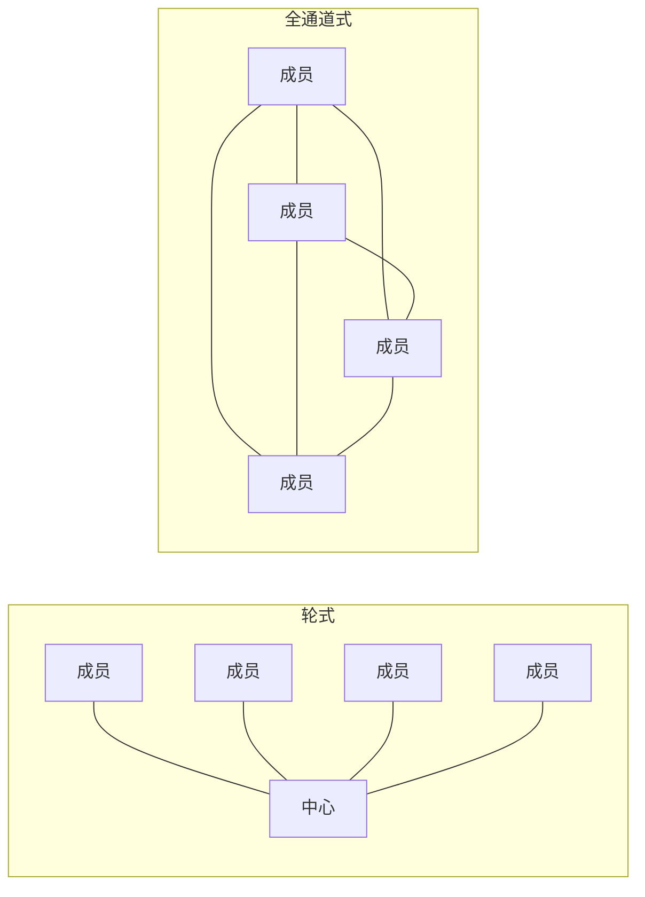
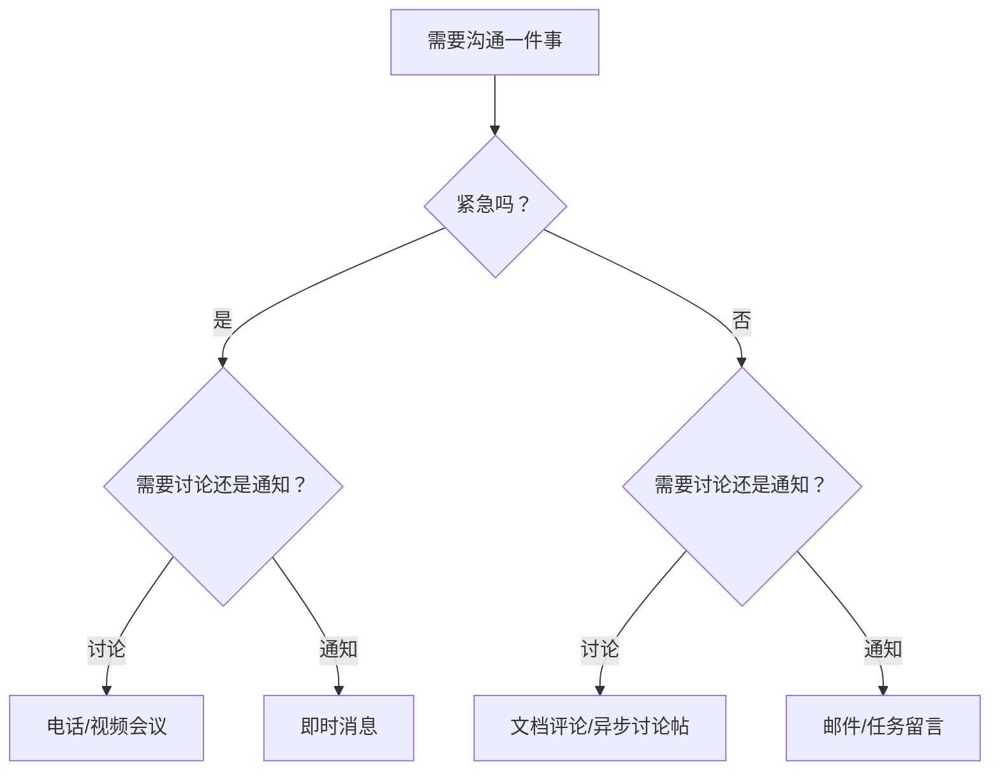
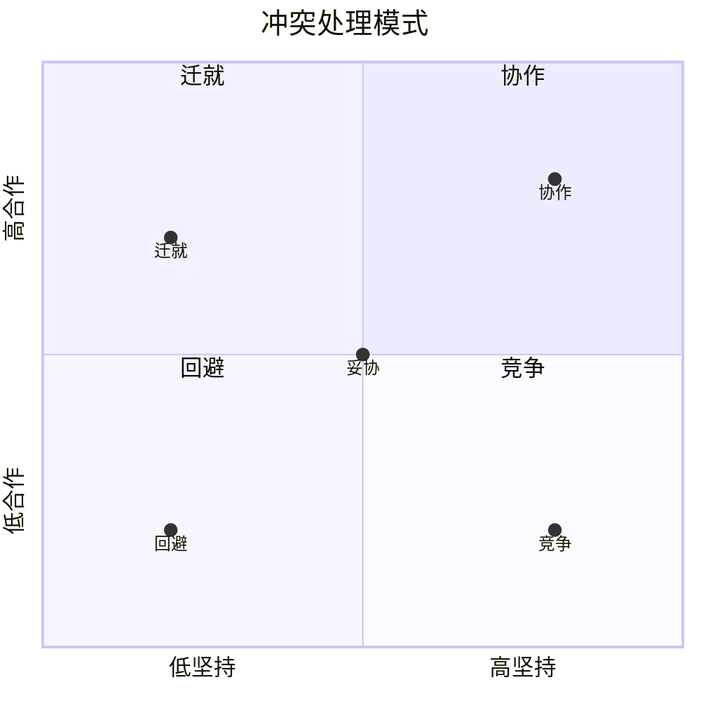

## 五、团队协作中的沟通技巧

团队协作的本质不是一群人凑在一起干活，而是一群人通过有效的信息交换实现"1+1>2"的协同效应。哈佛商学院的一项研究表明，高效团队与低效团队之间的核心差异，70%可以归因于沟通模式的不同——而非个体能力的差距。本章将从团队沟通的底层原理出发，系统讲解会议沟通、异步协作、冲突处理、信息流转等关键场景的实战技巧，帮助你成为团队中那个"让协作变顺畅"的人。

### 5.1 团队沟通的理论基础

#### 5.1.1 为什么团队沟通如此重要

在讨论技巧之前，先理解团队沟通的底层逻辑。

**信息瀑布效应**：团队中的一条关键信息，如果传递不到位，会像多米诺骨牌一样引发连锁问题。产品经理没有把需求变更同步给后端，后端按旧方案开发了三天，前端按新方案等了三天——一个人的一次信息遗漏，浪费了三个工种共计九天的工作量。

**社会惰化效应（Social Loafing）**：当团队成员不清楚彼此在做什么时，个体的努力程度会下降。心理学家Ringelmann的拔河实验证明，8人团队中每个人的实际出力只有单独拔河时的一半。透明的沟通让每个人的贡献可见，是抵抗社会惰化最有效的手段。

**团队心智模型（Team Mental Model）**：高效团队的成员对"我们在做什么、为什么做、怎么做"有高度一致的理解。这种一致性不是靠默契产生的，而是靠持续、高质量的沟通建立的。

#### 5.1.2 团队沟通的四个基本原则

**原则一：透明共享**

信息不对称是团队协作最大的敌人。一个成员掌握了关键信息却不分享，轻则导致重复劳动，重则导致决策失误。

透明共享的具体做法：
- 工作进展定期同步，不等别人来问
- 遇到问题第一时间暴露，不藏着掖着
- 决策过程和依据公开，不搞"黑箱操作"
- 建立公共信息池（Wiki、共享文档），让信息有固定的归属地

反面案例：某团队的技术负责人在代码评审中发现了一个架构隐患，但他认为"这个问题我自己能搞定"，没有告知团队。两周后这个隐患在生产环境爆发，团队花了三天排查，最后发现当初如果及时沟通，30分钟就能修复。

**原则二：主动沟通**

"等别人来问"意味着你把沟通的主动权交给了别人，也让别人承担了信息缺失的风险。

主动沟通的三个层次：
- **被动层**：别人问了才说（最差）
- **响应层**：遇到变化时及时通知（及格）
- **预判层**：预见到可能影响他人的信息，提前同步（优秀）

实操建议：每天下班前花2分钟，想想"今天我做的事情中，有哪些可能影响到其他人？"如果有，立刻发一条消息或更新任务状态。

**原则三：尊重差异**

团队成员有不同的性格、技能和工作风格。内向的人可能不善于在会议上发言，但他们可能有深思熟虑的见解；新员工可能缺乏经验，但他们可能带来新鲜的视角。

尊重差异的沟通策略：
- 为不同性格的人提供不同的表达渠道（口头、文字、匿名反馈）
- 在会议中主动邀请安静的成员发言："小王，这个问题你怎么看？"
- 不要因为一个人表达方式不流畅就否定其观点的价值
- 警惕"近因效应"——最近发言的人的观点权重不应该更高

**原则四：建设性冲突**

健康的团队需要适度的冲突——不是人身攻击，而是对观点和方案的争论。没有冲突的团队往往不是真正的和谐，而是一群人为了避免冲突而放弃了独立思考。

Google的"亚里士福克斯项目"（Project Aristotle）研究发现，高效团队的第一个特征就是"心理安全感"——成员敢于提出不同意见而不担心被惩罚。

建设性冲突的规则：
- 对事不对人：批评方案，不批评提出方案的人
- 用数据说话：分歧靠证据解决，不靠嗓门大小
- 设定时间边界：争论超过15分钟没有结论，升级到决策者
- 冲突后修复关系：争论结束后，主动表达对对方的尊重

### 5.2 团队沟通的模式与结构

#### 5.2.1 信息流转模式

不同的团队结构适合不同的信息流转模式：

| 模式 | 结构 | 优点 | 缺点 | 适用场景 |
|------|------|------|------|----------|
| 轮式（Wheel） | 所有信息经过中心节点 | 决策快、信息一致 | 中心节点瓶颈、成员被动 | 小型执行团队 |
| 链式（Chain） | 信息逐级传递 | 层级清晰 | 传递损耗大、速度慢 | 传统科层制组织 |
| 全通道式（All-channel） | 所有人自由交流 | 信息充分、参与度高 | 效率低、容易混乱 | 创意团队、初创团队 |
| 网状式（Mesh） | 关键节点互联 | 平衡效率和参与度 | 需要明确的沟通协议 | 大多数现代团队 |



**实践建议**：大多数团队应该采用"网状式"——日常信息通过固定渠道（站会、任务板）流转，深度讨论通过小范围会议或群聊进行，重大决策通过全员会议确认。

#### 5.2.2 同步沟通 vs 异步沟通

这是团队沟通中最重要的一对概念，也是最容易被混淆的。

**同步沟通**：双方同时在场，实时交流（面对面、电话、视频会议、即时消息）。

适用场景：
- 需要快速达成共识的决策
- 情绪敏感的话题（批评、绩效反馈）
- 头脑风暴和创意讨论
- 紧急问题的处理

**异步沟通**：一方发出信息，另一方在方便时回复（邮件、文档评论、任务留言）。

适用场景：
- 信息通报和状态更新
- 需要深思熟虑的技术方案评审
- 跨时区团队的日常协作
- 需要留痕的重要决策

**选择原则**：能用异步解决的，不要用同步。同步沟通的最大成本不是会议时间本身，而是"上下文切换"——一个开发者被打断后需要23分钟才能恢复到之前的专注状态（加州大学欧文分校研究数据）。

决策树：



### 5.3 会议沟通的实战技巧

会议是团队沟通中最昂贵的形式——一个8人参加的1小时会议，消耗的是8小时的人力成本。如果会议没有产出明确的价值，那就是在烧钱。

#### 5.3.1 站会（Daily Standup）

**目的**：同步进展、暴露障碍、协调当日工作。不是汇报会，不是讨论会。

**标准格式**：每人回答三个问题，总时长控制在15分钟以内。
- 昨天完成了什么？
- 今天计划做什么？
- 遇到了什么障碍？

**每人发言不超过2分钟**。如果一个问题需要超过2分钟的讨论，记录下来，会后拉上相关人员单独讨论——这叫"停车场机制"（Parking Lot）。

**站会的常见错误与纠正**：

| 错误做法 | 正确做法 |
|----------|----------|
| 变成向领导汇报 | 面向团队成员同步，不是向上汇报 |
| 详细描述技术细节 | 只说结论和影响，细节会后讨论 |
| 一个人说太久 | 计时器控制，超时提醒 |
| 没有障碍也要硬编 | "没有障碍"是完全可以的正常回答 |
| 只读Jira任务列表 | 用自己的话总结，不要念流水账 |
| 站会后没有跟进 | 障碍项必须有人跟进并在次日站会更新 |

**远程站会的特殊技巧**：
- 使用Slack/飞书的Standup Bot收集文字回复，再开会讨论障碍项
- 开摄像头，保持面对面的感觉
- 按固定顺序发言，避免"谁先说"的尴尬沉默
- 用共享看板（Jira、Trello、飞书多维表格）作为视觉辅助

#### 5.3.2 周会（Weekly Meeting）

**目的**：回顾本周成果、规划下周重点、讨论需要团队共识的议题。

**时长**：30-60分钟，不超过60分钟。

**标准议程模板**：

1. 本周亮点回顾（5分钟）
   - 各模块负责人用1-2句话总结关键成果
2. 关键指标Review（5分钟）
   - 核心数据的变化趋势
3. 重点议题讨论（20-30分钟）
   - 提前收集的1-3个需要团队讨论的议题
4. 下周重点确认（5分钟）
   - 明确下周的3个最重要目标
5. 公告与反馈（5分钟）
   - 团队层面的通知、流程变更等

**关键原则**：
- 提前24小时发送议程，参会者提前准备
- 工作汇报通过周报异步完成，周会上只讨论需要集体智慧的问题
- 指定会议记录人，会后30分钟内发出会议纪要
- 每个议题有明确的结论或下一步行动（Owner + Deadline）

#### 5.3.3 回顾会（Retrospective）

**目的**：复盘过去一个迭代/项目周期的得失，持续改进团队协作方式。

**经典格式——"帆船回顾法"**：
- **风（推动我们前进的因素）**：哪些做法帮助了我们？
- **锚（拖慢我们的因素）**：哪些问题阻碍了我们？
- **礁石（未来的风险）**：有哪些潜在问题需要注意？
- **宝藏（值得保持的好做法）**：有哪些值得固化的好习惯？

**操作步骤**：
1. 用便签或在线白板，每人独立写下各分类的观察（5分钟）
2. 分类汇总，找出被提及最多的议题（5分钟）
3. 对Top 3议题进行讨论，制定改进措施（20分钟）
4. 每个改进措施指定Owner和验收标准（5分钟）
5. 上次回顾的改进措施完成情况Review（5分钟）

**注意事项**：
- 回顾会是"对事不对人"的安全空间，严禁秋后算账
- 不要只追求数量，每次落实1-2个改进措施比列出10个但一个不执行强得多
- 轮流主持，培养每个人的引导能力

#### 5.3.4 头脑风暴会

**目的**：发散思维，产生尽可能多的创意和方案。

**规则**：
- **不评判**：在创意产生阶段，任何批评都是毒药。"这个想法不现实"这句话会杀死后面九个可能的好想法
- **求数量**：目标是数量而非质量，30个烂点子里往往藏着3个金点子
- **搭便车**：鼓励在别人的想法上延伸，"你说的这个让我想到……"
- **可视化**：把所有想法写在白板/便签上，让创意可见

**标准流程**：
1. 明确问题定义（5分钟）——确保所有人理解同一个问题
2. 独立发散（5分钟）——每人先独立写下自己的想法
3. 轮流分享（10分钟）——每人轮流说，其他人只记录不评判
4. 分组整理（10分钟）——将相似的想法归类
5. 投票筛选（5分钟）——每人3票，投给最看好的方案
6. 深入讨论（15分钟）——对票数最高的2-3个方案进行可行性讨论

#### 5.3.5 决策会议

**目的**：在多个备选方案中做出团队共识的决策。

**决策方法对比**：

| 方法 | 适用场景 | 优点 | 缺点 |
|------|----------|------|------|
| 共识决策 | 重大决策、需要全员支持 | 买入度高、执行阻力小 | 耗时长、可能妥协 |
| 多数投票 | 一般性决策 | 快速、公平 | 少数派可能不满 |
| 专家决策 | 技术性强的决策 | 专业度高 | 可能忽视其他视角 |
| 负责人决策 | 时间紧迫的决策 | 最快 | 可能考虑不周 |

**DACI决策框架**（来自Intuit）：
- **Driver（推动者）**：负责推动决策过程，收集信息，组织讨论
- **Approver（审批者）**：有最终决策权的人（通常1人）
- **Contributors（贡献者）**：提供输入和建议的人
- **Informed（知会者）**：需要知道决策结果但不参与决策的人

明确这四个角色，可以避免"所有人都在讨论但没有人做决定"的困境。

### 5.4 异步协作的沟通技巧

在远程办公和分布式团队成为常态的今天，异步协作能力已经从"加分项"变成了"必备技能"。

#### 5.4.1 文档驱动协作

**核心理念**：重要的信息写下来，而不是说出来。

文档驱动协作的优势：
- **可追溯**：决策的上下文、依据、参与者都有记录
- **可搜索**：新成员可以通过搜索快速了解历史决策
- **可异步**：不同时区的成员可以在自己的工作时间阅读和回复
- **更深入**：文字表达迫使作者更深入地思考

**必须文档化的事项**：
- 技术方案和架构决策（ADR, Architecture Decision Records）
- 会议纪要和决策结论
- 项目计划和里程碑
- 流程规范和操作手册
- 问题排查和解决方案（事后复盘报告）

**ADR模板示例**：

```markdown
# ADR-001: 选择PostgreSQL作为主数据库

## 状态
已通过（2024-01-15）

## 背景
项目需要一个关系型数据库来存储核心业务数据。
候选方案：PostgreSQL、MySQL、TiDB。

## 决策
选择PostgreSQL 16。

## 理由
1. JSONB支持满足我们的灵活数据模型需求
2. 窗口函数和CTE支持复杂查询
3. 团队有3年以上PostgreSQL运维经验
4. 社区活跃，文档完善

## 后果
- 需要招聘熟悉PostgreSQL的DBA
- 现有MySQL的缓存层需要适配
- 分片方案需要后续评估
```

#### 5.4.2 消息沟通的规范

**即时消息（Slack/飞书/钉钉）的使用规范**：

发送消息前的检查清单：
- 这件事需要即时回复吗？如果不需要，用邮件或文档评论
- 我把背景信息说清楚了吗？不要发"在吗？"然后等人回复
- 我的问题具体吗？"这个接口有问题"远不如"用户登录接口返回500，错误日志见附件"
- 我有没有提供足够的上下文？不要假设对方知道你在说什么

**消息的"倒金字塔"结构**：
【结论/请求】一句话说清楚你要什么
【背景】为什么需要做这件事
【详情】具体的信息、数据、截图
【下一步】建议对方做什么

坏例子：
> "在吗？那个功能有个问题，你看一下？"

好例子：
> "【需要确认】用户注册接口的短信验证码有效期应该是多少？
> 【背景】当前代码里设的是5分钟，但PRD写的是10分钟。
> 【详情】代码位置：src/auth/sms.go:45，PRD链接：xxx
> 【下一步】请确认正确的有效期，我来修改代码。"

#### 5.4.3 跨时区协作

当团队成员分布在不同时区时，沟通的复杂度成倍增加。

**核心原则：写给未来的自己**

每一条异步消息都应该假设对方会在8小时后才看到，而且没有任何上下文。因此：
- 完整描述问题，不要省略"你懂的"
- 附上所有相关的链接、截图、日志
- 明确说明期望的回复时间和行动项

**时区重叠窗口管理**：

| 团队分布 | 重叠窗口建议 | 会议安排策略 |
|----------|-------------|-------------|
| 中国+美西 | 北京时间9-11am / PST 5-7pm | 关键会议安排在重叠窗口 |
| 中国+欧洲 | 北京时间3-5pm / CET 9-11am | 交替安排在双方的上午 |
| 全球分布 | 找到最大公约数窗口 | 会议轮流在不友好的时间开 |

**轮流"牺牲"原则**：如果团队需要在非工作时间开会，不要总是让同一个时区的人牺牲。制定轮换表，让大家公平地承担不便。

### 5.5 跨职能团队的沟通

#### 5.5.1 跨职能沟通的挑战

在产品开发团队中，产品经理、设计师、开发者、测试工程师使用不同的"语言"，关注不同的维度：

| 角色 | 关注维度 | 典型语言 | 沟通偏好 |
|------|----------|----------|----------|
| 产品经理 | 用户价值、业务目标 | "用户需要""业务指标" | 用户故事、PRD文档 |
| 设计师 | 用户体验、视觉一致性 | "交互流程""设计规范" | 原型图、设计稿 |
| 开发工程师 | 技术可行性、系统性能 | "实现成本""技术债务" | 技术方案、接口文档 |
| 测试工程师 | 质量保证、边界条件 | "测试用例""回归风险" | 测试报告、缺陷列表 |

**跨职能沟通的核心原则**：用对方听得懂的语言说对方关心的事。

- 对产品经理说：不要讲技术细节，讲对用户体验和交付时间的影响
- 对设计师说：不要讲代码实现，讲视觉还原的可行性和约束条件
- 对开发工程师说：不要讲业务愿景，讲具体的功能需求和验收标准
- 对测试工程师说：不要讲"应该没问题"，讲变更范围和可能的影响面

#### 5.5.2 需求沟通的实战技巧

需求沟通是跨职能团队中最高频、也最容易出问题的场景。

**需求评审会的沟通清单**：

产品经理在评审前应该准备：
- [ ] 需求文档至少提前24小时发给参会者
- [ ] 文档包含用户故事、验收标准、优先级
- [ ] 关键交互用原型或流程图展示
- [ ] 明确标注哪些是确定的，哪些还需要讨论

开发团队在评审中应该做到：
- [ ] 提前阅读文档，带着问题来开会
- [ ] 对不清晰的地方用"5W1H"追问：谁(Who)在什么场景(When/Where)下，要做什么(What)，为什么要做(Why)，怎么做(How)
- [ ] 当场确认工作量估算和排期
- [ ] 对技术风险和依赖项进行识别

**需求变更的沟通协议**：

需求变更是软件开发的常态，关键是如何管理变更：

变更请求模板：
──────────────
变更内容：[具体描述变更了什么]
变更原因：[为什么要变更]
影响范围：[影响哪些功能/模块/团队]
时间影响：[对交付时间的影响，增加多少工作量]
风险评估：[变更可能引入的风险]
建议方案：[推荐的处理方式]
──────────────

**变更沟通的"三不"原则**：
- **不私下变更**：任何需求变更必须通知到所有相关方
- **不口头变更**：变更必须有书面记录（邮件、任务系统）
- **不无限接受**：变更需要评估影响，必要时调整排期或砍掉其他需求

#### 5.5.3 技术方案评审的沟通技巧

技术方案评审是开发团队最重要的沟通场景之一。

**方案文档的标准结构**：
1. 背景与目标：为什么要做，要解决什么问题
2. 方案概述：一句话说清楚方案的核心思路
3. 详细设计：架构图、接口定义、数据模型
4. 备选方案对比：考虑过哪些方案，为什么选了这个
5. 风险与应对：可能出问题的地方和应对策略
6. 排期与里程碑：分几个阶段，每个阶段的交付物

**评审中的沟通技巧**：
- 先理解再质疑：在提出反对意见之前，先用自己的话复述方案，确认你理解了
- 提问而非否定：用"如果遇到XX情况怎么处理？"代替"这个方案不行"
- 提供替代方案：指出问题的同时，给出你认为更好的方向
- 区分"必须改"和"建议改"：标注你的反馈是阻塞性的还是优化性的

### 5.6 团队冲突的沟通处理

冲突是团队协作中不可避免的。关键不是消除冲突，而是学会建设性地处理冲突。

#### 5.6.1 冲突的类型与识别

| 冲突类型 | 表现 | 影响 | 处理策略 |
|----------|------|------|----------|
| 任务冲突 | 对工作内容和目标的分歧 | 适度时有益，过度时有害 | 用数据和事实引导讨论 |
| 流程冲突 | 对工作方式和职责分工的分歧 | 影响执行效率 | 明确流程和责任边界 |
| 关系冲突 | 人际间的敌意和不信任 | 破坏性最大 | 及时介入，必要时调解 |

**识别冲突升级的信号**：
- 从"我不同意这个方案"变成"你总是这样"
- 从讨论变成沉默——成员不再表达意见，选择"心理离职"
- 从会议上的争论变成会后的抱怨和站队
- 信息开始选择性传递——有人在传递信息时"夹带私货"

#### 5.6.2 冲突处理的Thomas-Kilmann模型

Kenneth Thomas和Ralph Kilmann提出了五种冲突处理模式：



| 模式 | 适用场景 | 不适用场景 |
|------|----------|------------|
| **协作**（双赢） | 问题很重要，双方利益都重要 | 时间紧迫时 |
| **妥协**（各退一步） | 双方势均力敌，需要快速达成一致 | 涉及原则性问题时 |
| **竞争**（坚持己见） | 紧急决策、涉及核心原则 | 日常协作中的小事 |
| **迁就**（让步） | 对方更重要，或维护关系优先 | 自己的观点确实正确时 |
| **回避**（暂时搁置） | 问题不重要，或需要冷静期 | 问题必须解决时 |

**实际应用**：大多数团队冲突应该以"协作"模式为目标，即找到同时满足双方核心诉求的方案。当时间不允许深度协同时，"妥协"是次优选择。"竞争"和"迁就"都是一方牺牲，长期使用会积累不满。

#### 5.6.3 冲突沟通的实操框架——DESC法

当需要直接面对冲突时，使用DESC四步法：

**D - Describe（描述事实）**
客观描述发生了什么，不加评判。
> "在昨天的需求评审会上，你在我说完方案之前就打断了我，说'这个方案不行'。"

**E - Express（表达感受）**
用"我"开头表达你的感受，而不是用"你"开头指责对方。
> "我感到自己的专业判断没有被尊重。"（√）
> "你太不尊重人了。"（×）

**S - Specify（提出请求）**
具体说明你希望对方怎么做。
> "我希望在讨论技术方案时，每个人都能先把方案听完再提意见。"

**C - Consequence（说明后果）**
说明这样做对双方的好处。
> "这样我们能更全面地评估方案，也能让每个人感到被尊重，讨论的质量会更高。"

#### 5.6.4 作为第三方调解冲突

当你是团队领导或被请求调解时：

**调解的五步流程**：
1. **分别了解**：先单独和冲突双方谈话，了解各自的诉求和感受
2. **找到共识**：识别双方的共同目标（通常都是"把项目做好"）
3. **组织对话**：安排三方会谈，设定规则（不打断、不人身攻击）
4. **引导表达**：用DESC框架引导双方表达，确保双方都被听到
5. **达成协议**：推动双方形成具体的、可执行的共识方案

**调解者的注意事项**：
- 保持中立，不站队
- 关注事实而非感受（但要承认感受的存在）
- 不要急于给建议，先让双方充分表达
- 聚焦未来而非纠缠过去

### 5.7 团队沟通的工具与实践

#### 5.7.1 沟通工具矩阵

不同场景需要不同的工具，选错工具会增加沟通成本。

| 场景 | 推荐工具 | 不推荐工具 | 原因 |
|------|----------|------------|------|
| 紧急问题 | 电话/即时消息 | 邮件 | 邮件响应慢 |
| 技术讨论 | 群聊/文档评论 | 会议 | 可异步、可追溯 |
| 方案评审 | 会议+文档 | 纯群聊 | 需要深度讨论 |
| 状态同步 | 任务板/站会 | 长邮件 | 可视化、高效 |
| 知识沉淀 | Wiki/文档系统 | 群聊记录 | 可搜索、可维护 |
| 正式通知 | 邮件 | 即时消息 | 需要留痕和确认 |

#### 5.7.2 信息看板（Information Radiator）

信息看板的核心理念：让信息主动"辐射"给团队成员，而不是让人去找信息。

**看板设计原则**：
- 信息应该一眼可见，不需要点开链接或搜索
- 状态应该实时更新，过期的信息比没有信息更糟糕
- 关键指标应该有颜色编码（红/黄/绿）
- 看板应该放在团队高频经过的地方（物理或虚拟）

**任务看板的标准列**：

| 待办(Backlog) | 进行中(In Progress) | 评审中(In Review) | 已完成(Done) |
|:-------------:|:-------------------:|:-----------------:|:------------:|
| 任务卡片       | 任务卡片            | 任务卡片          | 任务卡片      |
| 任务卡片       | 任务卡片            |                   | 任务卡片      |
| ...           |                     |                   |              |

每张任务卡片应包含：任务名称、负责人、截止日期、优先级标签。

#### 5.7.3 团队沟通协议（Team Communication Agreement）

高效团队通常会制定一份明确的沟通协议，让所有人对沟通方式有共同的预期。

**沟通协议模板**：

```markdown
# 团队沟通协议

## 响应时间约定
- 即时消息：工作时间内4小时内回复
- 邮件：24小时内回复（至少确认收到）
- 紧急问题：电话联系，15分钟内回复
- @提及：当天内回复

## 会议规范
- 所有会议必须有议程，提前24小时发送
- 会议必须有记录，会后30分钟内发出
- 超过5人的会议需要主持人
- "无议程不开会，无记录不算开过会"

## 文档规范
- 重要决策必须有书面记录
- 文档存放在团队Wiki，不存放在个人空间
- 文档有Owner，定期review和更新

## 反馈规范
- 反馈及时，不在心里积攒
- 正面反馈公开说，改进反馈私下说
- 用"我观察到.../我建议..."而非"你总是..."
```

### 5.8 团队沟通中的常见误区

#### 误区一：过度沟通 = 好沟通

**现象**：每天站会+日会+周会+各种群聊，团队成员花40%的时间在"沟通"上，实际工作时间被严重压缩。

**真相**：沟通的质量远比数量重要。高效团队的沟通特征是"精准"——在正确的时间，通过正确的渠道，传递正确的信息给正确的人。

**纠正方法**：
- 审视每个会议的必要性，能用异步方式解决的不开会
- 减少"全员"会议，只拉必要的人参加
- 设定"免打扰时间"，保护深度工作的窗口

#### 误区二：和谐 = 高效

**现象**：会议上没有人提出反对意见，所有人都说"同意"，看起来一团和气。

**真相**：这往往不是真正的共识，而是"群体思维"（Groupthink）。心理学家Irving Janis研究发现，高度凝聚的团队反而更容易做出糟糕的决策，因为成员为了维护和谐而压制了自己的异议。

**纠正方法**：
- 指定"魔鬼代言人"角色，专门负责提出反对意见
- 领导者最后发言，避免影响其他人的表态
- 匿名收集反馈，降低表达异见的心理成本

#### 误区三：工具能解决沟通问题

**现象**：团队沟通不顺畅，于是引入更多工具——飞书、Slack、钉钉、企业微信同时用。

**真相**：工具只是载体，沟通问题的根源通常是流程和习惯。工具越多，信息越分散，反而增加了沟通成本。

**纠正方法**：
- 统一主沟通渠道，每种类型的信息有且只有一个"单一事实来源"
- 制定清晰的工具使用规范（什么场景用什么工具）
- 定期清理和整合工具，减少不必要的渠道

#### 误区四：会议纪要 = 会议记录

**现象**：有人把会议中说的每一句话都记下来，发了一篇3000字的"会议纪要"，但没人看。

**真相**：会议纪要的价值不在于记录"说了什么"，而在于记录"决定了什么"和"接下来做什么"。

**纠正方法**：会议纪要只包含三个核心要素——
1. **决策结论**：会上做了什么决定
2. **行动项**：谁(Who)在什么时候(When)之前做什么(What)
3. **待解决问题**：有哪些问题需要后续跟进

#### 误区五：远程沟通和面对面沟通是一回事

**现象**：把面对面的沟通习惯直接搬到线上，结果发现效果大打折扣。

**真相**：远程沟通丢失了大量非语言信息（表情、语气、肢体语言），信息传递的效率只有面对面沟通的约30%。

**纠正方法**：
- 重要讨论开视频，不开纯音频
- 文字沟通时多用表情符号传递语气（但注意专业场合的分寸）
- 复杂信息用文档而非长消息传递
- 定期安排线下见面或线上非正式交流，建立信任基础

### 5.9 不同团队规模的沟通策略

#### 5.9.1 小型团队（2-8人）

**特点**：沟通路径少，信息传播快，但容易过度依赖非正式沟通。

**策略**：
- 保持每日站会，但可以更短（5-10分钟）
- 使用一个主群聊即可，不需要分频道
- 鼓励非正式沟通（一起吃饭、茶歇聊天），这是小团队的优势
- 但关键决策仍然需要书面记录——小团队最容易犯的错误就是"口头约定"

#### 5.9.2 中型团队（8-30人）

**特点**：信息传播开始出现衰减，"我不知道这件事"成为常见抱怨。

**策略**：
- 引入分层沟通结构：小组周会 + 全体周会
- 建立信息看板，让项目状态透明可见
- 指定信息联络人（Liaison），负责跨小组的信息同步
- 开始需要文档化——口头传承在这个规模已经不可靠

#### 5.9.3 大型团队（30人以上）

**特点**：信息孤岛开始形成，跨团队协作成本急剧上升。

**策略**：
- 建立正式的沟通流程和模板
- 设置全职的项目经理或Scrum Master负责协调
- 使用RACI矩阵明确每个决策的角色分工
- 定期举办All-Hands会议，确保信息自上而下和自下而上都能流通
- 投资内部知识管理系统（Confluence、飞书文档等）

### 5.10 团队沟通能力的持续提升

#### 5.10.1 团队沟通健康度评估

定期评估团队的沟通健康度，可以及早发现问题。

**评估维度与指标**：

| 维度 | 评估问题 | 评分标准（1-5分） |
|------|----------|-------------------|
| 信息透明度 | 团队成员是否能方便地获取所需信息？ | 1=信息严重不透明，5=所有信息触手可及 |
| 反馈文化 | 团队成员是否敢于提出不同意见？ | 1=沉默是金，5=畅所欲言 |
| 会议效率 | 会议是否有明确的产出和行动项？ | 1=纯属浪费时间，5=每次都有明确结论 |
| 冲突处理 | 团队分歧是否能建设性地解决？ | 1=回避或人身攻击，5=理性讨论达成共识 |
| 异步协作 | 团队在非同步场景下的协作效率如何？ | 1=必须当面才能沟通，5=异步沟通高效顺畅 |

**评估方法**：每季度进行一次匿名问卷，收集团队成员的评分和具体反馈。跟踪趋势比单次分数更有意义。

#### 5.10.2 团队沟通的持续改进

**改进循环**：
1. **度量**：用上述评估维度定期度量
2. **分析**：找出得分最低的维度，深入分析原因
3. **实验**：针对问题设计改进实验（如"接下来两周，所有技术讨论先写文档再开会讨论"）
4. **回顾**：实验结束后评估效果，有效的固化为团队规范，无效的调整或放弃

**个人层面的提升**：
- 每次重要沟通后花2分钟复盘：什么做得好？什么可以改进？
- 主动寻求反馈："上次的方案评审，我的表达清楚吗？有什么建议？"
- 学习并练习结构化表达（金字塔原理、MECE法则等）
- 阅读团队沟通相关的经典书籍：《Crucial Conversations》《The Five Dysfunctions of a Team》《Nonviolent Communication》

#### 5.10.3 打造团队沟通文化

沟通技巧可以学习，但沟通文化需要培养。以下是可以从小处着手的文化建设：

**从你开始**：
- 每次沟通前想一想"对方需要知道什么"而非"我想说什么"
- 遇到沟通问题先反思自己的表达，而非抱怨别人听不懂
- 主动分享信息，即使没人要求你这样做
- 在团队中做"沟通榜样"——你的行为会影响周围的人

**团队仪式**：
- 每月一次的"沟通回顾"：回顾本月沟通中做得好的和需要改进的
- "感谢时刻"：在站会或周会开始时，每人说一件感谢团队成员的事
- "轮岗体验"：让团队成员体验其他角色的工作，增进跨职能理解

团队沟通不是天赋，而是技能。技能意味着可以通过刻意练习来提升。从今天开始，选择本章中的一两个技巧，在你的团队中实践。当你感受到沟通变得顺畅时，你会发现，团队协作的质量和效率会有质的飞跃。
