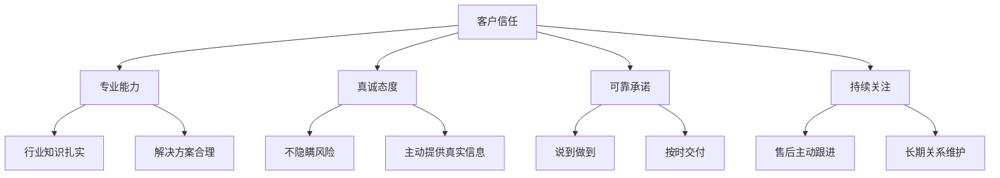
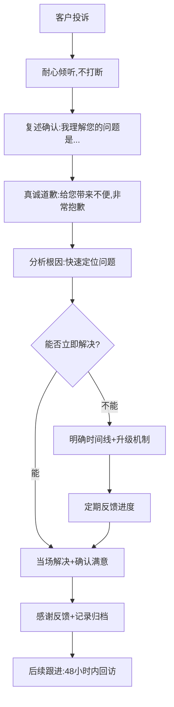
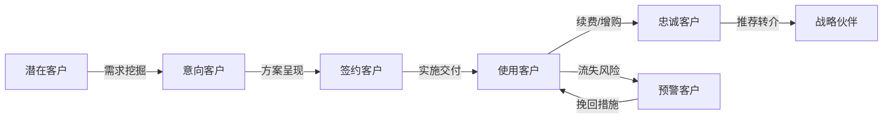

## 六、客户沟通的技巧

客户沟通是职场沟通中最具挑战性的领域之一。与内部沟通不同，客户没有义务理解你的处境、术语或流程——**你必须主动跨越信息鸿沟，用客户听得懂的语言建立信任、解决问题、创造价值**。本章从底层逻辑到高级策略，系统构建客户沟通的完整能力体系。

### 6.1 客户沟通的底层逻辑

#### 6.1.1 客户沟通与内部沟通的本质差异

内部沟通发生在"同一屋檐下"——同事共享组织文化、行业知识、工作流程，很多背景信息无需赘述。客户沟通则是"跨文化对话"——客户可能对你的产品、行业、技术完全陌生，双方的信息不对称天然存在。

| 维度 | 内部沟通 | 客户沟通 |
|------|----------|----------|
| 信息基线 | 共享组织背景和术语 | 信息不对称，需要主动解释 |
| 信任基础 | 组织关系自带信任 | 信任需要从零建立 |
| 容错空间 | 同事之间允许犯错和修正 | 客户的耐心有限，第一印象决定成败 |
| 沟通目标 | 推进协作、解决问题 | 满足需求、建立长期关系 |
| 情绪管理 | 职业化要求，但可直接表达 | 必须以客户情绪为中心 |
| 反馈周期 | 日常互动，反馈即时 | 单次接触可能决定整个客户关系走向 |

理解这种差异是所有客户沟通技巧的前提。你不能假设客户知道你在说什么，也不能假设客户会给你第二次机会。

#### 6.1.2 客户沟通的三个核心原则

**原则一：以客户为中心，而非以产品为中心**

很多销售和技术人员犯的第一个错误就是急于介绍自己的产品有多好。客户真正关心的是"你能解决我的什么问题"。沟通的起点永远是客户的需求和痛点，而不是你的功能列表。

**原则二：信任是沟通的货币**

客户购买的不仅是产品，更是对你的信任。信任由四个要素构成：

**原则三：情绪先于逻辑**

当客户带着不满或焦虑来沟通时，先处理情绪，再处理问题。哈佛商学院的研究表明，客户对服务的满意度有70%取决于"被尊重和被倾听的感觉"，而非问题本身是否完美解决。

#### 6.1.3 客户沟通的类型矩阵

不同场景下，客户沟通的策略截然不同：

| 场景 | 核心目标 | 关键策略 | 常见陷阱 |
|------|----------|----------|----------|
| 首次接触 | 建立信任、了解需求 | 多问少说、展示专业性 | 急于推销、信息过载 |
| 需求挖掘 | 深入理解真实需求 | 结构化提问、积极倾听 | 只听表面需求、跳过深挖 |
| 方案呈现 | 说服客户接受方案 | 数据支撑、案例佐证 | 功能堆砌、忽略ROI |
| 投诉处理 | 化解负面情绪、挽回信任 | 先情绪后问题、快速响应 | 推卸责任、反应迟缓 |
| 谈判协商 | 达成双赢协议 | 锚定效应、让步策略 | 零和思维、过早让步 |
| 售后跟进 | 维系关系、挖掘新机会 | 定期触达、价值输出 | 签单后消失、只在需要时联系 |

### 6.2 客户需求挖掘：SPIN提问法

很多客户沟通失败的根源在于：你以为你知道客户要什么，但你其实不知道。SPIN提问法是由尼尔·拉克汉姆（Neil Rackham）在《SPIN Selling》中提出的结构化提问框架，帮助销售人员从表面需求深入到真实痛点。

#### 6.2.1 SPIN四步提问

| 步骤 | 英文 | 目的 | 示例 |
|------|------|------|------|
| S | Situation（背景问题） | 了解客户现状 | "您目前使用的系统是什么架构？团队规模多大？" |
| P | Problem（难点问题） | 发现客户的痛点 | "目前的系统在高峰期有没有遇到性能瓶颈？" |
| I | Implication（暗示问题） | 放大痛点的影响 | "如果系统宕机2小时，对您的业务收入影响大概是多少？" |
| N | Need-payoff（需求-效益问题） | 让客户自己说出需求 | "如果有一个方案能将宕机时间缩短到5分钟以内，对您的业务意味着什么？" |

#### 6.2.2 提问的节奏控制

提问不是审讯，而是一场有节奏的对话。关键技巧：

1. **开场用开放式问题**：让客户多说，你多听。"您能跟我聊聊目前遇到的最大挑战是什么吗？"
2. **中期用引导式问题**：逐步聚焦。"您提到效率问题，能具体说说是哪个环节效率最低吗？"
3. **收尾用确认式问题**：锁定需求。"所以我理解您的核心需求是X和Y，对吗？"
4. **全程用追问深挖**：不满足于表面答案。"您说的这个问题，之前尝试过哪些解决办法？效果如何？"

#### 6.2.3 倾听的三个层次

需求挖掘不仅靠"问"，更靠"听"。

- **第一层：听事实**——客户说了什么内容，哪些数据、哪些需求
- **第二层：听情绪**——客户说这些话时的情绪状态，是焦虑、不满还是期待
- **第三层：听潜台词**——客户没有说出口的话。"预算有限"可能意味着"我需要更强的ROI论证"；"领导还在考虑"可能意味着"我需要帮我说服领导的材料"

实操技巧：在客户说完后，停顿2-3秒再回应。这个短暂的沉默会让客户觉得你在认真思考他说的话，同时也给客户补充更多信息的机会。

### 6.3 PREP法则：结构化表达你的观点

当你需要向客户表达观点、提出建议或回应质疑时，PREP法则提供了一个清晰的表达框架。

#### 6.3.1 PREP的四步结构

- **P（Point）观点**：先说结论或建议，开门见山
- **R（Reason）原因**：解释为什么，给出逻辑支撑
- **E（Example）例证**：用案例、数据或故事增强说服力
- **P（Point）重申**：再次强调核心观点，形成闭环

#### 6.3.2 PREP实战示例

**场景：向客户推荐企业版方案**

> "我建议您选择企业版方案（P），因为它包含7×24小时技术支持和定制化服务，能确保您的系统稳定运行（R）。目前我们有300多家类似规模的企业客户在使用这个方案，其中包括XX和YY等行业领先企业。上个季度某客户从标准版升级到企业版后，系统故障响应时间从平均4小时缩短到15分钟（E）。综合考虑您的业务连续性需求和预算，企业版方案是性价比最高的选择（P）。"

**场景：回应客户对价格的质疑**

> "我们的方案定价确实比竞品高20%（P），因为我们的服务包含实施部署、数据迁移和三个月的驻场支持，这些在竞品中是需要额外付费的（R）。如果把这些隐性成本加上，我们的总拥有成本实际上低15%。去年某客户做了同样的对比测算，最终选择了我们（E）。建议您做一个总拥有成本的对比分析，您会发现我们的方案性价比更高（P）。"

#### 6.3.3 PREP的变体应用

PREP不是死板的模板，你可以根据场景灵活调整：

- **PREP+R（风险）**：在推荐方案时，主动提及风险并给出应对措施，增加可信度
- **PREP+C（对比）**：在方案对比时，加入与竞品或替代方案的对比分析
- **PRES（Point-Reason-Example-Summarize+Action）**：在需要客户行动时，最后加上明确的行动呼吁

### 6.4 处理客户投诉：LAST原则

投诉处理是客户沟通中最考验功力的环节。处理得好，投诉客户会变成最忠诚的客户；处理不好，一个投诉可能引发连锁反应。

#### 6.4.1 LAST四步法

- **L（Listen）倾听**：认真听完客户的投诉，不打断、不辩解、不急于解释
- **A（Apologize）道歉**：真诚地为客户的不良体验道歉，承认问题的存在
- **S（Solve）解决**：提出具体的、可执行的解决方案，给出明确的时间线
- **T（Thank）感谢**：感谢客户的反馈，强调这有助于改进服务

#### 6.4.2 投诉处理的完整流程

#### 6.4.3 投诉处理中的关键话术

**倾听阶段：**
- "请您详细说一下发生了什么，我认真记录。"
- "我理解这件事给您带来了很大的困扰。"（先共情，不急于解释）

**道歉阶段：**
- "对于这次的体验，我代表团队向您真诚道歉。"（承担责任，不推给"系统"或"其他部门"）
- 避免说："对不起，但是……"——"但是"会抵消道歉的诚意

**解决阶段：**
- "针对这个问题，我可以为您提供以下方案……您看哪个更合适？"（给选择，而非单方面决定）
- "这个问题我会在24小时内给您一个明确的解决方案，过程中有任何进展我会第一时间通知您。"

**感谢阶段：**
- "感谢您把这个问题反馈给我们，这对我们改进服务非常有价值。"
- "您的意见我们已经记录并提交给产品团队，后续改进后我会第一时间通知您。"

#### 6.4.4 处理不同类型投诉的策略

| 投诉类型 | 客户心理 | 应对策略 | 注意事项 |
|----------|----------|----------|----------|
| 产品质量问题 | 感觉被骗、失望 | 快速更换/退款+额外补偿 | 补偿要超出预期 |
| 服务态度问题 | 感觉不被尊重 | 真诚道歉+相关人员处理+反馈结果 | 不要为员工辩解 |
| 流程繁琐问题 | 感觉被折腾 | 简化流程+专人代办 | 当场解决，不要让客户重复操作 |
| 等待时间过长 | 焦虑、不耐烦 | 致歉+说明原因+加速处理 | 持续更新进度，不要让客户被动等待 |
| 承诺未兑现 | 信任崩塌 | 承认错误+补偿+新的承诺+严格兑现 | 这是最严重的投诉类型，必须高层介入 |

### 6.5 客户沟通中的禁忌

以下是客户沟通中必须避免的行为，每一条都可能直接摧毁客户关系。

#### 6.5.1 绝对不能做的事

**禁忌一：推卸责任**
即使问题确实不是你个人造成的，也不要在客户面前推卸给其他部门或同事。客户不在乎是哪个环节出了问题，他只在乎问题能不能被解决。"这不是我负责的"是客户关系的死亡判决。

**正确做法**："这个问题我来帮您协调解决。"——先承接，再内部推动。

**禁忌二：过度承诺**
承诺你能做到的，做到你承诺的。过度承诺或许能赢得短期好感，但兑现不了的承诺会彻底摧毁信任。客户会记住你说的每一句话，尤其是你做不到的那些。

**正确做法**：承诺时留出余量。"我们预计3个工作日内完成"比"明天就能搞定"更专业。

**禁忌三：使用行话和技术术语**
客户可能不懂什么是"容器化部署"、"微服务架构"或"SLA 99.9%"。用客户能理解的语言沟通，是专业能力的体现，而非降低标准。

**正确做法**：用类比解释。"容器化部署就像把您的应用打包成标准化的集装箱，可以快速搬运到任何服务器上。"

**禁忌四：与客户争辩**
与客户争赢了道理，却失去了客户。即使客户的观点有误，也不要用"您错了"来纠正。

**正确做法**："您说的有道理，我理解您的考虑。同时我想补充一个信息，您看是否有帮助……"

**禁忌五：签单后消失**
很多销售人员在签单后就不再主动联系客户，只有在续费或追加销售时才出现。这种行为会让客户感觉自己只是"钱包"而非"合作伙伴"。

**正确做法**：建立定期触达机制——产品更新通知、使用技巧分享、季度回顾会议、行业趋势分享。

#### 6.5.2 隐性禁忌：容易忽视的沟通雷区

- **过度使用"我"**："我觉得"、"我认为"、"我们公司"——客户想听的是"您"的视角
- **打断客户**：即使你已经知道客户要说什么，也要等他说完
- **过早谈价格**：在客户还没有感知到价值之前就报价，等于把沟通变成比价
- **承诺后不确认**：口头承诺不落文字，后续扯皮风险极高
- **忽略非决策者**：只关注老板，忽略实际使用者和影响者，会导致方案落地困难

### 6.6 不同客户类型的沟通策略

客户千差万别，用同一种方式沟通所有客户是低效的。掌握客户类型识别和差异化沟通策略，是客户沟通高手的必备能力。

#### 6.6.1 客户类型识别矩阵

| 类型 | 特征 | 沟通风格偏好 | 沟通策略 |
|------|------|-------------|----------|
| 分析型 | 注重数据、逻辑、细节 | 书面报告、数据图表 | 提供详细数据和对比分析，不要催促决策 |
| 驱动型 | 目标导向、果断、时间紧迫 | 简洁汇报、直奔主题 | 30秒内说清价值，给出明确的ROI |
| 表达型 | 热情、爱聊天、重视关系 | 面对面、故事化表达 | 先建立关系再谈业务，多用案例和故事 |
| 和蔼型 | 温和、避免冲突、决策谨慎 | 温和耐心、提供安全感 | 不要施压，提供试用期、退款保证等降低风险 |

#### 6.6.2 识别客户类型的快速方法

观察客户的行为信号：

- **邮件风格**：简短直接→驱动型；详细附数据→分析型；语气亲切→表达型/和蔼型
- **会议表现**：频繁看表→驱动型；问很多细节问题→分析型；聊很多题外话→表达型
- **决策速度**：当场拍板→驱动型；需要多轮讨论→分析型/和蔼型；需要参考他人意见→和蔼型

#### 6.6.3 难缠客户应对指南

**"永远不满意"型客户**
特征：无论你做什么，对方总能找到问题。
策略：设定明确的期望值和验收标准，在项目开始前书面确认。每次交付时附上对照检查清单。

**"沉默不语"型客户**
特征：很少主动反馈，你不确定他是否满意。
策略：主动定期触达，用封闭式问题引导反馈。"上周部署的功能，您团队的使用频率大概是？"比"您觉得怎么样？"更容易获得有效反馈。

**"事事都要插手"型客户**
特征：对每个细节都要参与决策，微管理倾向明显。
策略：建立详细的项目计划和汇报机制，让客户感到"掌控感"。同时在非关键环节给客户决策权，把精力集中在真正重要的问题上。

**"价格敏感"型客户**
特征：对价格极度敏感，总是拿竞品比价。
策略：不要直接降价，而是增加价值感知。制作详细的TCO（总拥有成本）对比表，把隐性成本显性化。

### 6.7 客户沟通中的非语言信号

面对面沟通或视频会议中，非语言信号占信息传递的55%以上（梅拉比安法则）。忽视非语言信号，等于放弃了大量沟通信息。

#### 6.7.1 你需要观察的客户非语言信号

| 信号 | 可能的含义 | 你的应对 |
|------|-----------|----------|
| 身体前倾、频繁点头 | 兴趣浓厚、认同 | 加快速度，深入细节 |
| 身体后仰、双臂交叉 | 防御、不认同 | 暂停陈述，改为提问 |
| 频繁看手机/手表 | 不耐烦、时间紧迫 | 压缩内容，直奔核心价值 |
| 眉头紧皱 | 困惑或不认同 | 停下来确认理解："我是否解释清楚了？" |
| 长时间沉默 | 思考或犹豫 | 给对方时间，不要急于填补沉默 |
| 语速突然加快 | 焦虑或兴奋 | 匹配对方语速，探测原因 |

#### 6.7.2 你自己的非语言管理

- **眼神接触**：保持60-70%的时间有眼神接触，过多会有压迫感，过少会显得不自信
- **手势**：适度的手势增强表达力，但避免过多小动作（转笔、摸鼻子）
- **坐姿**：微微前倾表示关注，后仰表示放松自信，避免瘫坐或僵硬
- **语调**：重要内容放慢语速、降低音调，增强权威感；轻松内容可以加快节奏

### 6.8 客户邮件与消息写作

在数字化时代，大量客户沟通通过邮件和即时消息进行。文字沟通缺乏语气和表情辅助，稍有不慎就会产生误解。

#### 6.8.1 客户邮件的黄金结构

主题行：[具体事项] + [时间节点] + [需要行动]
  例：关于Q3系统升级方案——请于本周五前确认

正文结构：
1. 开头：一句话说明邮件目的
2. 正文：分点陈述，每个要点不超过3行
3. 结尾：明确的行动呼吁 + 时间节点
4. 签名：姓名 + 职位 + 联系方式

#### 6.8.2 客户消息的注意事项

| 做法 | 推荐 | 避免 |
|------|------|------|
| 回复时效 | 工作时间2小时内回复 | 隔天才回复 |
| 语气 | 专业友好、适度正式 | 过于随意（"好的哈""收到嘞"） |
| 长度 | 一条消息解决一个问题 | 大段文字堆砌 |
| 附件 | 命名规范、格式通用 | 发送无命名的"新建文档1" |
| 表情符号 | B2C可适度使用 | B2B场景慎用 |

#### 6.8.3 高难度邮件模板

**延迟交付通知：**

> 主题：关于XX项目交付时间调整说明——新交付日期：X月X日
>
> XX您好，
>
> 非常抱歉通知您，由于[具体原因，不要笼统说"内部原因"]，XX项目的交付时间需要从原定的X月X日调整至X月X日。
>
> 为确保交付质量不受影响，我们已采取以下措施：
> 1. [措施1]
> 2. [措施2]
>
> 对此次延期给您带来的不便，我代表团队深表歉意。如您有任何疑问或需要进一步沟通，请随时联系我。

**价格调整通知：**

> 主题：关于XX服务续费价格调整通知
>
> XX您好，
>
> 感谢您一直以来对XX服务的信任与支持。
>
> 由于[原材料成本上涨/服务内容升级]，自X月X日起，XX服务的续费价格将从XX元调整至XX元。
>
> 为感谢您的长期支持，我们为老客户特别提供了以下优惠方案：
> 1. 在X月X日前续费，可享受当前价格锁定一年
> 2. 选择两年期合同，享受X%折扣
>
> 如有任何疑问，欢迎随时联系我详细沟通。

### 6.9 客户关系的长期经营

签单只是客户关系的起点，而非终点。长期客户的价值是新客户的5-25倍（贝恩咨询数据），维护老客户的成本仅为开发新客户的1/5。

#### 6.9.1 客户生命周期管理

#### 6.9.2 定期触达机制

| 频率 | 触达方式 | 内容 | 目的 |
|------|----------|------|------|
| 每周 | 使用数据报告 | 使用量、活跃度、关键指标 | 让客户看到价值 |
| 每月 | 月度回顾邮件 | 本月亮点、问题改进、下月计划 | 展示持续关注 |
| 每季度 | 季度业务回顾会议 | 业务成果、ROI分析、优化建议 | 深化战略关系 |
| 每年 | 年度总结+续约规划 | 全年成果、来年规划、优惠方案 | 锁定长期合作 |

#### 6.9.3 客户流失预警信号

当出现以下信号时，需要立即启动客户关怀流程：

- 使用量持续下降（连续2周下降超过30%）
- 回复消息的频率和速度明显降低
- 开始询问竞品信息或合同终止条款
- 关键对接人变更
- 客户公司发生重大组织调整

**挽回策略**：不要等到续费前才联系。发现预警信号后，48小时内安排一次"非销售目的"的沟通——了解客户近况、分享行业洞察、主动提供帮助。

### 6.10 客户沟通的进阶能力

#### 6.10.1 向上沟通：帮助客户内部推销你的方案

很多时候，你的对接人认同你的方案，但他需要向他的领导汇报和审批。如果你能帮助他"内部推销"，成交概率会大幅提升。

具体做法：
- 提供一份精简的"领导汇报版"方案（1页PPT，核心价值+ROI+对比）
- 预判领导可能的质疑，帮对接人准备好回答话术
- 提供其他同级别客户的成功案例和背书

#### 6.10.2 多方利益相关者管理

B2B场景中，一个采购决策往往涉及多个角色：

| 角色 | 关注点 | 沟通重点 |
|------|--------|----------|
| 决策者（老板/CXO） | ROI、战略匹配、风险 | 高层汇报、行业趋势、竞争格局 |
| 影响者（技术/业务负责人） | 功能、性能、集成 | 技术方案、Demo、PoC验证 |
| 使用者（一线员工） | 易用性、培训、日常体验 | 产品试用、培训计划、使用手册 |
| 采购/财务 | 价格、付款条件、合规 | 报价单、合同条款、资质证书 |

针对不同角色准备不同的沟通材料和话术，而不是用同一份PPT面对所有人。

#### 6.10.3 危机沟通：当事情严重出错时

当客户遭遇重大事故（数据泄露、系统长时间宕机、重大功能缺陷）时，沟通策略完全不同：

1. **第一时间响应**（15分钟内）：确认收到问题，正在紧急处理
2. **透明通报**：每隔30分钟-1小时更新一次处理进展，即使没有实质性进展也要告知"仍在处理中"
3. **高层介入**：重大事故必须有对应级别的负责人出面沟通，而非一线客服
4. **根因分析报告**：事故解决后48小时内提供完整的根因分析和改进计划
5. **补偿方案**：根据影响程度提供合理的补偿（服务延期、费用减免等），主动提出而非等客户要求

### 6.11 客户沟通常见误区与纠正

| 误区 | 为什么是错的 | 正确做法 |
|------|-------------|----------|
| "客户永远是对的" | 无原则迁就会导致不合理需求膨胀 | 尊重客户感受，但用专业判断引导决策 |
| "多联系客户就是好的" | 无效触达是骚扰 | 每次触达都要提供价值，而非刷存在感 |
| "签单后就轻松了" | 售后期是客户价值实现的关键阶段 | 实施交付比销售阶段更需要专业沟通 |
| "客户投诉是坏事" | 投诉是改进的机会，沉默的不满更危险 | 96%的不满意客户不会投诉，他们直接离开 |
| "把所有功能都展示给客户" | 信息过载会让客户迷失 | 只展示与客户需求相关的功能，其他功能在需要时再介绍 |
| "用最低价赢客户" | 价格战没有赢家 | 用价值赢客户，而非用低价 |

### 6.12 客户沟通能力自检清单

每次重要客户沟通后，用以下清单复盘：

- [ ] 我是否在前30秒内说清了核心价值/目的？
- [ ] 我是否用客户的语言而非行话在沟通？
- [ ] 我是否真正倾听了客户的需求，还是只在等客户说完后推销？
- [ ] 我是否处理了客户的情绪，还是只关注了问题本身？
- [ ] 我的承诺是否在能力范围内，并且有明确的时间线？
- [ ] 我是否记录了沟通要点并书面确认？
- [ ] 我是否有后续行动计划和跟进时间表？
- [ ] 我是否识别了客户的沟通类型并调整了沟通策略？

持续用这个清单自检，客户沟通能力会在3-6个月内有显著提升。
