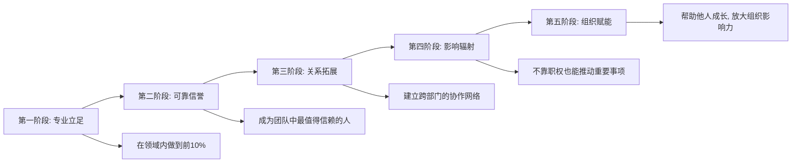

## 七、职场沟通的进阶能力

前六节覆盖了职场沟通的基础场景——汇报、请示、批评、接受批评、团队协作、客户沟通。这些是"术"的层面，解决的是"具体场景怎么说话"的问题。本节进入"道"的层面：**如何在组织中建立持久的沟通影响力，让自己说的话有分量、被重视、能推动事情**。

这是从"会说话"到"说话管用"的跨越。很多人掌握了汇报技巧、学会了反馈模型，但在组织中依然缺乏话语权——说话没人听、建议不被采纳、推动不了跨部门项目。问题不在于表达能力不够，而在于缺乏进阶的沟通能力：向上管理、影响力构建、组织政治智慧、战略说服。

### 7.1 向上管理：从被动执行到主动协作

#### 7.1.1 向上管理的本质

向上管理（Managing Up）不是"管理你的领导"，更不是阿谀奉承。它的准确定义是：**主动适应领导的工作风格和决策偏好，建立高效的双向协作关系，使双方都能更好地完成工作目标**。

哈佛商学院教授约翰·加巴罗（John Gabarro）和约翰·科特（John Kotter）在经典论文《Managing Your Boss》中指出：向上管理是一种互利行为——你帮助领导成功，领导也会帮助你成功。这不是零和博弈，而是正和博弈。

很多人对向上管理存在误解：

| 误解 | 事实 |
|------|------|
| 向上管理就是拍马屁 | 向上管理的核心是降低协作成本、提高工作效率 |
| 领导应该主动了解我 | 信息传递是下属的责任，领导没有义务揣测你的想法 |
| 做好工作就够了 | 做好工作是基础，让领导知道你做好了是能力 |
| 向上管理是操纵 | 向上管理建立在真诚和互利的基础上，操纵终将反噬 |
| 只有大公司才需要 | 任何有层级关系的组织都需要向上管理 |

#### 7.1.2 了解你的领导：四维画像法

向上管理的第一步是深入了解你的领导。不是去窥探隐私，而是观察工作层面的行为模式。用以下四个维度构建领导画像：

**维度一：信息接收偏好**

不同的领导对信息的接收方式有截然不同的偏好。用错方式，信息再重要也可能被忽略。

| 类型 | 特征 | 应对策略 |
|------|------|----------|
| 阅读型 | 喜欢先看书面材料，再讨论 | 重要事项先发邮件/文档，面谈时引用文档要点 |
| 听觉型 | 喜欢面对面或电话沟通 | 先口头汇报，再补书面记录 |
| 视觉型 | 喜欢图表、流程图、数据看板 | 用可视化方式呈现信息，减少纯文字 |
| 综合型 | 需要多种方式配合 | 提供书面摘要+口头讲解+数据图表 |

判断方法：观察领导平时如何处理信息——他是先看报告再开会，还是先听汇报再看材料？他回复邮件快还是喜欢当面说？他在会议上是盯着PPT还是闭眼听？

**维度二：决策风格**

领导的决策风格直接影响你应该如何"喂"信息。

| 决策风格 | 特征 | 你的策略 |
|----------|------|----------|
| 数据驱动型 | 重视数据、报表、事实依据 | 准备充分的数据支撑，用数字说话 |
| 直觉导向型 | 依靠经验和感觉快速决策 | 提供关键信息即可，不要信息过载 |
| 共识型 | 喜欢听取多方意见再决定 | 提前与相关方沟通，形成初步共识后再汇报 |
| 分析型 | 需要全面信息和多种方案对比 | 提供完整的分析报告，包含利弊对比 |
| 授权型 | 倾向于让下属自行决定 | 明确决策边界，在边界内自主行动，超出边界才请示 |

**维度三：关注指标**

每个领导都有自己的"北极星指标"——他最关心什么。找到它，你的沟通就有了靶心。

- 有的领导关注**效率**：事情能不能更快完成？流程能不能优化？
- 有的领导关注**质量**：产出是否达标？客户是否满意？
- 有的领导关注**成本**：预算是否可控？资源是否浪费？
- 有的领导关注**创新**：有没有新思路？能不能突破现状？
- 有的领导关注**风险**：有什么潜在问题？最坏情况是什么？

判断方法：回顾领导过去半年在会议上反复强调的主题、审批时最容易通过和最容易驳回的请求类型、绩效考核中权重最高的指标。

**维度四：沟通频率和时机**

| 领导类型 | 偏好频率 | 最佳时机 |
|----------|----------|----------|
| 高频监控型 | 每天简要汇报 | 每天固定时间，简短即可 |
| 定期检查型 | 每周一次结构化汇报 | 周一上午或周五下午 |
| 按需型 | 有重要事项才汇报 | 事项发生的第一时间 |
| 被动型 | 不主动问就不汇报 | 主动设定固定汇报节奏，培养领导的预期 |

关键原则：**宁可多报不漏报，但要控制每次的信息量**。领导最怕的不是你汇报太多，而是关键时刻信息缺失。

#### 7.1.3 向上管理的五个核心策略

**策略一：管理领导的预期**

预期管理是向上管理中最被低估的能力。很多职场困境的根源不是做得不好，而是领导的预期与你的交付之间存在落差。

预期管理的关键动作：

1. **接任务时确认预期**：不要假设领导的期望。接到任务时主动确认："您期望达到什么效果？""什么时间节点需要看到结果？""有没有优先级需要我注意的？"
2. **过程中校准预期**：如果发现目标可能无法按时达成，不要等到最后一刻才说。提前预警："目前进展是X，预计完成时间会比原计划晚3天，原因是Y。我有两个补救方案……"
3. **交付时管理预期**：如果结果有不完美的地方，提前说明而非让领导自己发现。"这次的方案在A方面达到了预期，B方面因为客观原因还有差距，下一步我计划……"

**策略二：提供解决方案而非抛出问题**

这是区分"执行者"和"思考者"的关键标志。领导每天面对无数问题，他需要的不是再多一个问题，而是一个可以快速决策的方案。

框架：**问题 + 方案 + 推荐 + 理由**

❌ "领导，项目进度可能延期，怎么办？"

✅ "领导，项目进度可能延期一周（问题）。
    我想到两个方案：方案A是增加2名人手，
    预计可以追回进度，但成本增加15%；
    方案B是砍掉X功能，保证核心功能按时上线
    （方案）。
    我建议方案B（推荐），因为X功能的用户使用率
    只有8%，可以在下个版本补上（理由）。"

**策略三：适应而非改变**

很多新人犯的第一个错误是试图改变领导的工作方式。"领导应该用项目管理工具""领导不应该在周末发消息"——这些想法或许正确，但改变上级是极其困难且高风险的。

正确的做法是**先适应，建立信任，再通过自己的专业表现逐步影响**。当领导看到你总能用他习惯的方式高效协作时，他自然会更愿意听取你的建议。

**策略四：建立"信任账户"**

把与领导的关系想象成一个银行账户：

- **存款行为**：按时交付、主动预警风险、帮领导解决棘手问题、在公开场合支持领导的决策、提供有价值的信息和建议
- **取款行为**：请求资源、要求特殊待遇、提出不同意见、要求更多自主权

规则：先大量存款，再适度取款。当信任账户余额充足时，你的建议更容易被采纳，你的请求更容易被批准。

**策略五：了解领导的压力和目标**

你的领导也有他的领导、他的KPI、他的压力。理解这一点，你就能从更高的视角理解他的决策。

- 他为什么在这个项目上特别着急？可能是因为他的领导在盯着。
- 他为什么不愿意批准你的方案？可能是因为预算已经被其他项目占用了。
- 他为什么突然改变优先级？可能是因为公司战略方向调整了。

当你理解了领导的处境，你的沟通就会从"我要什么"变成"我们怎样一起解决问题"。

#### 7.1.4 向上管理的常见场景与话术

**场景一：领导布置了不合理的任务**

❌ "这个时间太紧了，根本做不完。"
✅ "我理解这个任务的紧迫性。按照目前的资源和优先级，
    我预计需要X天完成。如果必须在Y天内交付，
    我建议可以先完成核心功能A和B，
    C功能放到第二阶段。您看这个节奏可以吗？"

**场景二：领导的决策你觉得有问题**

❌ "我觉得这个方案不行。"
✅ "这个方案的大方向我认同。我有一个补充想法：
    在执行层面，如果我们在X环节加入Y步骤，
    可能会降低Z风险。这是我基于之前项目经验的判断，
    您觉得是否有必要考虑？"

**场景三：需要向领导争取资源**

❌ "人手不够，再给我加两个人。"
✅ "目前团队承担了3个并行项目，人均工作量已经
    超过正常水平的140%。如果要保证Q3的交付质量，
    我建议增加1名中级工程师和1名实习生，
    预计可以提升30%的产出效率。
    这是详细的工作量分析和资源规划……"

### 7.2 影响力的构建：不靠职位也能推动事情

#### 7.2.1 影响力的本质

在组织中，真正的影响力不完全来自职位和权力。一个没有管理权限的资深工程师，可能比一个新上任的总监更有话语权。一个普通产品经理，可能比技术副总更能推动跨部门协作。

影响力的本质是：**别人愿意听你的、信你的、跟你走**。这不是命令能做到的，而是需要长期积累。

约翰·科特（John Kotter）在《权力与影响力》中将组织中的影响力来源分为三类：

| 影响力来源 | 具体内容 | 特点 |
|-----------|---------|------|
| 组织权力 | 职位、头衔、审批权限 | 来得快去得快，离开职位就消失 |
| 专家权力 | 专业能力、行业知识、解决问题的能力 | 持久且可迁移，但需要时间积累 |
| 参照权力 | 人格魅力、信任关系、口碑声誉 | 最强大但也最难建立 |

职场沟通的进阶目标，就是从依赖组织权力（如果你有的话），转向建立专家权力和参照权力。

#### 7.2.2 影响力的五根支柱

**支柱一：专业能力——让人信服的根基**

专业能力是影响力的第一支柱，没有专业能力的影响力是空中楼阁。

如何建立专业影响力：

1. **在一个领域做到前10%**：不要什么都懂一点，要在某个领域成为公认的专家。当人们遇到这个领域的问题时，第一个想到你。
2. **用成果说话**：专业能力不是自封的，需要通过持续的高质量交付来证明。每一个成功项目、每一次问题解决、每一份高质量报告，都是你专业能力的证据。
3. **分享知识**：通过内部培训、技术分享、文档沉淀等方式，让你的专业能力被更多人看到和受益。知识的分享不会削弱你的专业地位，反而会强化它。
4. **保持学习**：行业在变化，技术在更新，你的专业能力也需要持续进化。停滞不前的"专家"很快会被超越。

**支柱二：可靠性——说到做到的信任基石**

可靠性是所有信任的基础。一个总是按时交付、说到做到的人，即使能力不是最强的，也会获得很高的信任度。

可靠性的关键指标：

| 指标 | 具体表现 | 反面 |
|------|---------|------|
| 交付一致性 | 承诺的 deadline 几乎都能达到 | 经常延期，找各种理由 |
| 质量稳定性 | 产出质量稳定在较高水平 | 忽好忽坏，让人无法预期 |
| 信息透明度 | 遇到问题主动汇报，不隐瞒 | 报喜不报忧，问题到最后一刻才暴露 |
| 言行一致 | 说到做到，承诺了就兑现 | 嘴上答应，实际做不到 |

建立可靠性的方法：**承诺时留余量，执行时打提前量**。如果你估计需要5天，承诺7天；如果你承诺7天，第5天就交付。这样的"超预期"交付会逐步建立你的信誉。

**支柱三：关系网络——信息和资源的高速公路**

在组织中，很多工作的推进依赖于跨部门、跨层级的协作。一个拥有广泛关系网络的人，能更快地获取信息、调用资源、解决问题。

关系网络的构建策略：

1. **主动帮助他人**：这是建立关系最有效的方式。帮同事解决一个技术问题、帮其他部门对接一个资源、给新人分享一份有用的工作指南——这些"顺手之劳"会在未来以意想不到的方式回报你。
2. **参与跨部门项目**：这是拓展关系网络的最佳机会。在项目中展现你的能力和合作精神，项目结束后你就多了一批了解你、信任你的同事。
3. **维护弱关系**：社会学家马克·格兰诺维特（Mark Granovetter）的研究表明，"弱关系"（不那么亲密但保持联系的人）在信息获取和机会发现方面比"强关系"更有价值。定期与不同部门的同事保持联系，哪怕只是偶尔的闲聊。
4. **成为信息枢纽**：当你成为不同团队之间的信息连接点时，你的影响力自然增长。但这需要你主动分享信息，而非囤积信息。

**支柱四：利他精神——长期主义的影响力投资**

利他精神不是"老好人"心态，而是一种长期主义的影响力投资。真正的利他是：在不损害自身核心利益的前提下，主动为他人创造价值。

利他精神的三个层次：

- **初级：响应式帮助**——别人找你帮忙时积极响应
- **中级：主动式帮助**——发现别人可能需要帮助时主动提供
- **高级：系统性帮助**——建立机制让帮助规模化（如编写知识库、建立工作流程、培养新人）

注意：利他不等于无底线的付出。你需要在帮助他人的同时保护自己的核心工作不受影响。合理设置边界，是健康利他的前提。

**支柱五：表达能力——让影响力被看见**

再强的专业能力、再好的关系网络，如果无法有效表达，影响力也会大打折扣。表达能力是影响力传播的载体。

提升表达影响力的关键：

1. **学会讲故事**：数据和逻辑说服人的理性，故事打动人的情感。在汇报中加入适当的案例和故事，能让你的观点更加深入人心。
2. **结构化表达**：金字塔原理、PREP法则等结构化表达工具，能让你的观点更清晰、更有说服力。
3. **视觉化呈现**：学会用图表、流程图、对比表等视觉工具增强表达效果。人脑处理视觉信息的速度是文字的6万倍。
4. **控制节奏**：重要的观点要放慢速度、加重语气；过渡性内容可以快速带过。有节奏的表达比均匀输出更有吸引力。

#### 7.2.3 影响力的进阶：非职权领导力

当你没有任何正式权力却能推动事情时，你就具备了非职权领导力（Leadership Without Authority）。这是职场中最有价值的能力之一。

非职权领导力的核心方法：

**方法一：以愿景驱动**

人们不会被你的权力驱动，但会被一个有意义的目标驱动。当你能清晰地描述"为什么这件事重要""做成之后会怎样"时，你就具备了愿景驱动力。

❌ "这个项目需要你们部门配合，领导已经批了。"
✅ "这个项目如果做成，能帮你们部门减少40%的重复工作。
    上个月你们团队加班最多的那个报表流程，
    正好在我们的优化范围内。"

**方法二：以共识推进**

在推动跨部门协作时，不要一开始就要求对方做什么。先花时间了解对方的需求和顾虑，找到双方的共同利益点，然后从共同利益出发提出方案。

步骤：
1. 了解对方的KPI和当前痛点
2. 找到你的项目与对方利益的交集
3. 从对方的利益角度阐述合作价值
4. 征求对方对方案的意见，让对方有参与感
5. 形成书面共识，明确各方的责任和收益

**方法三：以专业赢得话语权**

在关键决策中，如果你能提供别人没有的专业见解，你的话语权自然提升。这需要你在平时积累深度的专业知识，并在关键时刻果断表达。

关键场景：
- 技术选型讨论中，你能分析不同方案的长期维护成本
- 产品方向讨论中，你能提供竞品分析和用户数据
- 项目风险评估中，你能基于历史经验指出潜在问题

### 7.3 组织政治的智慧：看清规则，保护自己

#### 7.3.1 正视组织政治的存在

每个组织都存在政治——不同的人有不同的利益诉求，这些诉求之间存在竞争和博弈。这不是贬义词，而是组织运行的客观现实。

彼得·德鲁克（Peter Drucker）说过："组织存在的目的，就是让平凡的人做出不平凡的事。"而组织政治，就是在这个过程中不同利益方的博弈与平衡。

回避组织政治的人，往往成为政治的牺牲品。不是因为你参与了政治，而是因为你没有意识到政治的存在，结果在不知不觉中触碰了他人的利益。

#### 7.3.2 组织权力地图的绘制

要有效应对组织政治，首先要理解组织的权力结构。这不是看组织架构图那么简单——架构图反映的是正式权力，而真正影响决策的往往是非正式权力。

绘制权力地图时，关注以下维度：

| 维度 | 观察要点 |
|------|---------|
| 正式权力 | 职位高低、管辖范围、审批权限 |
| 信息权力 | 谁掌握关键信息？谁是信息枢纽？ |
| 专家权力 | 谁在关键领域有不可替代的专业能力？ |
| 关系权力 | 谁与高层有密切关系？谁在各部门有广泛人脉？ |
| 资源权力 | 谁控制预算、人力、技术资源？ |
| 否决权力 | 谁虽然不能推动事情，但能阻止事情？ |

在日常工作中有意识地观察：谁的意见在会议上最有分量？哪些人在非正式场合（午餐、茶歇）的对话中能影响决策？遇到争议时，最终谁的意见会被采纳？

#### 7.3.3 组织政治的四条生存法则

**法则一：保持中立，不轻易站队**

在组织中的派系斗争中，过早站队是最危险的行为。一旦你所在的"队伍"失势，你也会被牵连。

保持中立的策略：
- 与各方都保持良好的工作关系
- 在派系争论中不发表倾向性意见
- 用"我关注的是工作目标"来回应站队压力
- 如果被迫表态，表达对事不对人的立场

例外情况：当公司的核心价值观受到挑战时（如数据造假、违法违规），你应该站在正义的一方，而非保持中立。

**法则二：重要的沟通留有书面记录**

这是保护自己的最基本措施。口头承诺、电话沟通、走廊对话，如果没有书面记录，一旦出现争议，你将处于被动。

具体做法：
- 重要的口头沟通后，发一封确认邮件："根据我们刚才的讨论，确认以下要点……"
- 会议结束后，发送会议纪要，明确决议事项和责任人
- 微信/即时通讯中的重要沟通，定期导出备份
- 涉及权限、预算、承诺的关键事项，务必有书面审批

邮件确认模板：

主题：【确认】关于XX事项的沟通要点

XX您好，

根据今天下午的沟通，确认以下要点：
1. ……（具体内容）
2. ……（具体内容）
3. 各方责任人及时间节点：……

如有理解偏差，请回复指正。

谢谢！

**法则三：远离是非，不传播八卦**

办公室八卦是职场中最常见的"政治陷阱"。参与八卦看似能获取信息、拉近关系，但实际上：
- 你说的每一句话都可能被转述、被曲解
- 你一旦被贴上"八卦传播者"的标签，信任度会大幅下降
- 八卦中的信息往往真假混杂，用错误信息做决策会带来灾难

应对策略：
- 当别人向你传播八卦时，礼貌地不参与："这个我不太了解，不太方便评价。"
- 不要转发任何未经证实的信息
- 如果八卦涉及你本人，直接找当事人核实，不要通过第三方

**法则四：专注于价值创造**

这是最根本的法则。无论组织政治如何变化，持续创造价值的人永远不会被淘汰。

组织政治中最大的误区是把精力花在"经营关系"上而忽略了本职工作。关系固然重要，但关系是锦上添花，不是雪中送炭。当你的专业能力足够强、产出足够好时，即使你在政治上不够"灵活"，组织也需要你。

#### 7.3.4 职场沟通中的自我保护

在复杂的组织环境中，学会保护自己是进阶能力的重要组成部分。

**保护策略一：模糊指令要确认**

领导给了一个模糊的指令，你凭自己的理解去执行，结果与领导的预期不符——这是职场中最常见的"背锅"场景。

确认模板：
"领导，为了确保我理解正确，我确认一下：
您希望我做X，在Y时间之前完成，
重点关注Z方面，对吗？
还有什么需要我特别注意的？"

**保护策略二：承诺前评估可行性**

不要为了表现积极而轻易承诺做不到的事情。"没问题"三个字一旦出口，就是你的责任。

评估框架：
- 我是否有足够的资源（时间、人力、权限）完成这件事？
- 有哪些不确定因素可能影响结果？
- 如果出现意外，我有什么备选方案？
- 这个承诺是否会影响我其他工作的交付？

如果不确定，可以说："这个事情我需要评估一下可行性，明天给你答复。"这比草率承诺后做不到要好得多。

**保护策略三：功劳的合理表达**

你做了很多工作，但领导不知道——这不是领导的问题，是你的问题。适度、合理地展示自己的贡献是必要的。

正确的方式：
- 在项目汇报中客观陈述自己承担的工作和成果
- 在团队分享中介绍自己的方法论和经验
- 通过书面记录（周报、月报）让领导了解你的工作量

错误的方式：
- 在公开场合抢同事的功劳
- 夸大自己的贡献、淡化他人的付出
- 频繁地向领导"邀功"

### 7.4 战略说服：让重要决策者采纳你的方案

#### 7.4.1 说服的底层逻辑

说服不是"说赢别人"，而是**帮助对方做出一个对他自己也有利的决定**。亚里士多德在两千多年前就提出了说服的三要素：

| 要素 | 含义 | 职场应用 |
|------|------|----------|
| Ethos（品格） | 说话者的可信度 | 你的专业背景、过往成绩、为人信誉 |
| Pathos（情感） | 引发听众的情感共鸣 | 理解对方的痛点、恐惧、渴望 |
| Logos（逻辑） | 论证的逻辑性 | 数据、案例、推理链条 |

真正有效的说服需要三者兼备。只有数据没有情感，是冰冷的报告；只有情感没有数据，是空洞的煽情；有数据有情感但说话者不可信，是徒劳。

#### 7.4.2 战略说服的五步法

**第一步：识别决策者的真实需求**

决策者说出来的需求和真实需求往往不同。一个说"我要一个更快的系统"的领导，真实需求可能是"我要在季度汇报中展示技术团队的成果"。

识别真实需求的方法：
- 多问"为什么"——不是质疑，而是理解背后的动机
- 观察决策者在其他事情上的行为模式
- 了解决策者面临的外部压力和约束条件

**第二步：构建你的论证结构**

一个有说服力的论证结构：

1. 问题定义：我们面临什么问题？（引起关注）
2. 影响分析：如果不解决，会有什么后果？（制造紧迫感）
3. 方案呈现：我建议怎么做？（提供出路）
4. 收益说明：这样做会带来什么好处？（利益驱动）
5. 风险管控：可能的风险是什么？如何应对？（消除顾虑）
6. 行动请求：需要您做什么决定？（明确诉求）

**第三步：选择合适的沟通渠道**

| 方案类型 | 推荐渠道 | 原因 |
|---------|---------|------|
| 小型决策 | 即时消息或邮件 | 快速决策，不值得开会 |
| 中型决策 | 一对一沟通 | 可以充分讨论，避免公开压力 |
| 重大决策 | 正式会议+会前预沟通 | 需要多方参与，会前争取关键支持 |
| 敏感决策 | 非正式场合（午餐、散步） | 降低对抗性，给双方留余地 |

**第四步：会前预沟通**

在正式会议中提出重大方案是最容易失败的方式——因为你无法控制会议中的变量（反对者的情绪、突发的质疑、时间的限制）。

会前预沟通的策略：
1. 提前与关键决策者一对一沟通，了解他们的顾虑
2. 根据反馈修改方案，解决已知的反对意见
3. 争取关键人物的初步支持
4. 在正式会议上，这些支持者会成为你的"盟友"

**第五步：处理反对意见**

面对反对意见时，最常见的错误是立即反驳。这会激发对方的防御心理，让讨论变成争论。

正确的处理方式：

1. **倾听完整**：让对方把话说完，不要打断
2. **确认理解**："你的意思是不是说……？"确保你正确理解了对方的顾虑
3. **认可合理部分**："你说的X方面确实值得考虑"——先认可再回应
4. **提供证据**：用数据、案例或类比回应对方的顾虑
5. **保留弹性**：如果对方的意见确实有道理，愿意调整方案

❌ "你说的不对，数据明明显示……"
✅ "你提的这个风险我之前也考虑过。
    根据我们之前三个项目的数据，
    这个风险的发生概率大约是15%，
    即使发生，我们也有预案B可以应对。
    当然，如果你觉得15%的风险还是太高，
    我们可以在方案中加入更多的缓冲措施。"

### 7.5 跨层级沟通的进阶技巧

#### 7.5.1 越级沟通的艺术

越级沟通是职场中的高风险行为——处理得好，能加速信息传递和问题解决；处理不好，会让你的直属领导感到被架空。

越级沟通的原则：

| 情况 | 是否越级 | 注意事项 |
|------|---------|----------|
| 直属领导明确授权 | 可以 | 保留授权记录 |
| 直属领导长期不在 | 可以 | 事后及时汇报 |
| 涉及直属领导的重大问题 | 谨慎 | 先尝试直接沟通，无果后再越级 |
| 日常工作事务 | 不可以 | 这是越级的大忌 |
| 想绕过领导直接邀功 | 绝对不可以 | 后果极其严重 |

如果必须越级沟通：
1. 提前告知直属领导（除非越级的原因就是直属领导本身）
2. 在越级沟通中保持客观，不要贬低直属领导
3. 沟通后及时向直属领导同步结果

#### 7.5.2 与高层沟通的精要

与高层（比你高两级以上的领导）沟通时，你需要切换到完全不同的模式：

| 维度 | 与直属领导沟通 | 与高层沟通 |
|------|--------------|-----------|
| 信息密度 | 可以适当详细 | 必须极度精炼 |
| 关注点 | 执行层面的细节 | 战略层面的影响 |
| 时间 | 可以用10-15分钟 | 通常只有2-3分钟 |
| 语言 | 部门内部的术语 | 高层能理解的业务语言 |
| 目标 | 推进具体工作 | 传递关键信号、争取支持 |

与高层沟通的"电梯汇报"法则：假设你只有30秒——你会说什么？把这30秒的内容作为开场白，如果高层感兴趣，他会给你更多时间展开。

### 7.6 进阶能力的常见误区

**误区一：把向上管理等同于讨好**

向上管理的核心是建立高效的协作关系，不是无原则地迎合。一味讨好会让你失去专业判断力，最终被领导和同事看轻。

**误区二：过于注重关系经营而忽视本职工作**

关系网络和影响力都建立在专业能力的基础上。没有硬实力支撑的"人脉"是脆弱的——人们愿意和你吃饭，但不会在关键时刻信任你。

**误区三：回避所有冲突**

"好好先生"不是影响力强的表现。在原则性问题上敢于表达不同意见，反而会赢得尊重。关键在于表达方式——对事不对人、有理有据、提出建设性方案。

**误区四：过度解读组织政治**

把所有事情都看成政治斗争，会让你变得多疑和焦虑。大多数时候，同事的行为是出于工作需要，而非政治算计。不要在没有证据的情况下恶意揣测他人的动机。

**误区五：在不合适的时机展现影响力**

在领导已经做了决定之后还在公开场合提反对意见、在同事面前炫耀自己与高层的关系、在团队遇到困难时只顾展示自己的能力——这些都是在错误的时机展现影响力，效果适得其反。

### 7.7 从进阶到精通：影响力的长期修炼

影响力不是一朝一夕能建立的，它需要长期的、系统的修炼。以下是一个影响力发展的阶段性路线图：

**第一阶段（0-2年）：专业立足**——在自己的领域做到足够专业，让人信服。

**第二阶段（2-4年）：可靠信誉**——通过持续的高质量交付建立"靠谱"的标签。

**第三阶段（3-5年）：关系拓展**——主动拓展跨部门、跨层级的关系网络。

**第四阶段（4-7年）：影响辐射**——在关键决策中发挥影响力，推动重要事项。

**第五阶段（5年+）：组织赋能**——帮助他人成长，通过赋能他人来放大自己的影响力。

每个阶段不是严格按时间划分的，而是按能力积累的程度。有人可能在第一阶段就停留很久，有人可能快速跨越。关键是不要跳级——没有专业能力支撑的影响力是虚假的繁荣。

### 7.8 本节小结

| 进阶能力 | 核心要点 | 关键行动 |
|----------|---------|---------|
| 向上管理 | 主动适应领导风格，建立双向协作 | 四维画像法、预期管理、信任账户 |
| 影响力构建 | 不靠职位也能推动事情 | 五根支柱：专业、可靠、关系、利他、表达 |
| 组织政治智慧 | 看清规则，保护自己 | 绘制权力地图、保持中立、留书面记录 |
| 战略说服 | 帮助决策者做出对他有利的决定 | 五步法、会前预沟通、处理反对意见 |
| 跨层级沟通 | 根据层级切换沟通模式 | 电梯汇报法则、精炼信息 |

进阶能力的核心不是"术"的堆砌，而是"道"的领悟：**在组织中，最有力量的沟通不是你说得多漂亮，而是你做的事情让人信服、你的人品让人信赖、你的格局让人追随**。
