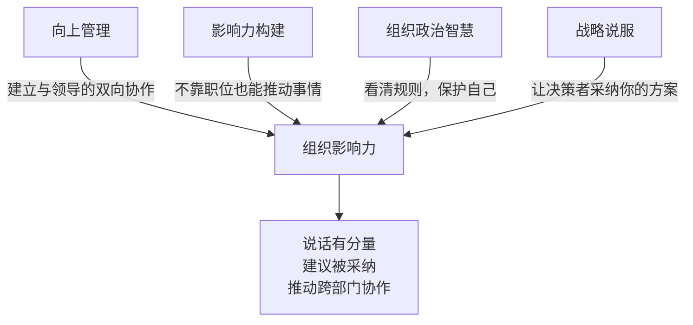
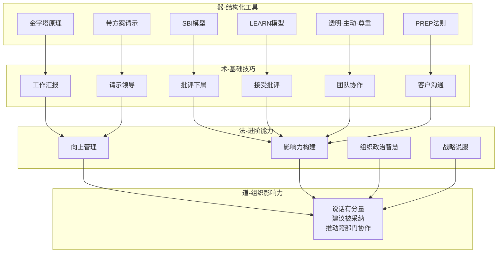

## 小结：职场沟通核心技巧全景图

本节不是简单的内容回顾，而是将前七节的分散知识点整合为一个**可执行的沟通能力体系**。如果你只有时间读一节，读这节就够了——它浓缩了从基础汇报到进阶影响力的核心方法论，并提供了诊断工具、行动路线和常见陷阱，帮助你把"知道"变成"做到"。

### 一、六大基础场景的核心模型速查

职场沟通的六大基础场景各有其专属的结构化模型。这些模型不是"花架子"，而是经过大量实践验证的思维框架——它们的作用是**降低你的认知负荷**，让你在高压环境下依然能清晰、有条理地表达。

| 场景 | 核心模型 | 一句话要诀 | 关键原则 |
|------|----------|-----------|----------|
| 工作汇报 | 金字塔原理（结论先行） | 先说结果，再说过程 | 领导的时间比你的表达欲更值钱 |
| 请示领导 | 带方案请示（方案+推荐+理由） | 不要问"怎么办"，要问"A和B您选哪个" | 让领导做选择题，不做填空题 |
| 批评下属 | SBI模型（情境-行为-影响） | 对事不对人，具体不笼统 | 批评的目的是改进，不是发泄 |
| 接受批评 | LEARN模型（倾听-同理-澄清-行动-感谢） | 先接住，再消化，后行动 | 批评是免费的成长反馈 |
| 团队协作 | 透明-主动-尊重三原则 | 信息不孤岛，主动不被动 | 协作效率 = 信息对称度 × 信任度 |
| 客户沟通 | PREP法则（观点-理由-案例-重申） | 客户导向，而非产品导向 | 站在客户的价值链上说话 |

#### 1.1 模型详解与对比

**金字塔原理 vs PREP法则**

这两个模型都强调"结论先行"，但适用场景不同：

- **金字塔原理**适用于**信息量大、层次复杂**的汇报场景。核心逻辑是"以上统下"——用结论统领论据，用论据支撑结论。典型场景：项目周报、季度汇报、方案评审。
- **PREP法则**适用于**需要快速说服**的沟通场景。核心逻辑是"观点驱动"——先亮观点，再用理由和案例强化。典型场景：客户提案、会议发言、邮件沟通。

选择标准：信息复杂度高用金字塔，说服目标明确用PREP。

**SBI模型 vs LEARN模型**

这两个模型分别对应"给出反馈"和"接收反馈"，构成一个完整的反馈闭环：

- **SBI模型**（Situation-Behavior-Impact）的精髓在于**具体化**。"你上次开会迟到"不如"周二的项目评审会你迟到了15分钟（S-B），导致客户对我们的专业度产生了疑虑（I）"。具体化让批评从"人身攻击"变成了"事实陈述"。
- **LEARN模型**（Listen-Empathize-Ask-Respond-Notify）的精髓在于**去防御化**。人在被批评时的本能反应是辩解或反击，LEARN模型通过"先倾听、再同理"的步骤，帮你绕过情绪反应，直接进入问题解决模式。

两者的关系：一个高效的团队，既需要成员能用SBI模型给出高质量反馈，也需要成员能用LEARN模型接住反馈。

**带方案请示 vs 直接请示**

很多人的请示是"甩问题"——把决策压力全部推给领导。带方案请示的本质是**替领导分担决策成本**：

❌ 直接请示："领导，项目延期了，怎么办？"
   → 领导需要：了解情况 → 分析原因 → 想方案 → 做决策（四步）

✅ 带方案请示："领导，项目可能延期一周。方案A是加人追进度（成本+15%），
   方案B是砍低优先级功能（用户影响<5%）。我建议B，因为……"
   → 领导需要：确认信息 → 选择方案（两步）

带方案请示不是"越权"，而是"赋能"——你帮领导节省了思考时间，领导会更信任你的判断力。

### 二、进阶能力：从"会说话"到"说话管用"

基础技巧解决的是"具体场景怎么说话"的问题，进阶能力解决的是**"如何在组织中建立持久的沟通影响力"**。这是从"术"到"道"的跨越。

#### 2.1 四大进阶能力的关系

这四大能力不是孤立的，而是一个递进系统：

1. **向上管理**是基础——先管理好与直属领导的关系，才有资格谈影响力
2. **影响力构建**是核心——用专业、可靠、关系、利他、表达五根支柱支撑话语权
3. **组织政治智慧**是保护层——看清利益格局，避免踩坑，保护自己的成果不被窃取
4. **战略说服**是输出端——把前三者积累的能力转化为实际的决策影响力

#### 2.2 关键工具与框架

**向上管理四维画像**

了解领导不是"拍马屁"，而是降低协作成本。四个维度：

| 维度 | 观察要点 | 应用策略 |
|------|---------|---------|
| 信息接收偏好 | 先看报告还是先听汇报？回邮件快还是喜欢当面说？ | 用领导习惯的方式传递信息 |
| 决策风格 | 数据驱动、直觉导向、共识型、分析型、授权型？ | 用对应的"喂"信息方式 |
| 关注指标 | 效率、质量、成本、创新、风险？ | 用领导的"北极星"对齐你的汇报 |
| 沟通频率 | 高频监控、定期检查、按需汇报？ | 匹配领导的节奏，宁多不漏 |

**影响力五根支柱**

| 支柱 | 核心逻辑 | 关键行动 |
|------|---------|---------|
| 专业能力 | 让人信服的根基 | 在一个领域做到前10%，用成果说话 |
| 可靠性 | 说到做到的信任基石 | 承诺时留余量，执行时打提前量 |
| 关系网络 | 信息和资源的高速公路 | 主动帮助他人，维护弱关系 |
| 利他精神 | 长期主义的影响力投资 | 从响应式帮助升级到系统性帮助 |
| 表达能力 | 让影响力被看见 | 学会讲故事，结构化表达，视觉化呈现 |

**战略说服五步法**

1. 识别决策者的真实需求（多问"为什么"）
2. 构建论证结构（问题→影响→方案→收益→风险→请求）
3. 选择合适的沟通渠道（小决策用消息，大决策先预沟通）
4. 会前预沟通（争取关键支持者，控制会议变量）
5. 处理反对意见（倾听→确认→认可→证据→弹性）

#### 2.3 组织政治的四条生存法则

| 法则 | 核心逻辑 | 关键动作 |
|------|---------|---------|
| 保持中立 | 过早站队是最大的风险 | 与各方保持良好工作关系，用"我关注的是工作目标"回应站队压力 |
| 留书面记录 | 口头承诺无凭无据，争议时百口莫辩 | 重要沟通后发确认邮件，会议后发纪要 |
| 远离八卦 | 传播八卦 = 降低自己的信任度 | 礼貌不参与，不转发未经证实的信息 |
| 专注价值创造 | 持续创造价值的人永远不会被淘汰 | 关系是锦上添花，硬实力才是雪中送炭 |

### 三、沟通能力自诊：你的薄弱环节在哪里？

大多数人不是"不会沟通"，而是**在某些特定场景下有短板**。以下诊断表帮你快速定位需要重点提升的方向。

#### 3.1 六大场景自评量表

对每个场景，根据自己的实际情况打分（1=经常出问题，5=游刃有余）：

| 场景 | 自评项 | 1分表现 | 5分表现 |
|------|--------|---------|---------|
| 工作汇报 | 结论是否先行？ | 汇报时先讲过程细节，领导听完还不知道结果 | 开口30秒内说清核心结论 |
| 工作汇报 | 是否有数据支撑？ | "我觉得挺好的""进度还行" | "完成率87%，较上周提升12个百分点" |
| 请示领导 | 是否带方案？ | "领导，这个怎么办？" | "领导，我建议方案A，理由是……" |
| 请示领导 | 是否区分请示和汇报？ | 把所有事情都堆在一起说 | 请示事项单独拎出来，明确需要领导做什么决定 |
| 批评下属 | 是否具体到行为？ | "你最近态度有问题" | "周三的客户会议你没有提前准备资料" |
| 批评下属 | 是否对事不对人？ | "你这个人就是不靠谱" | "这次的交付质量没有达到标准" |
| 接受批评 | 第一反应是什么？ | 立即辩解、反驳、找借口 | 先听完，说"谢谢你的反馈" |
| 接受批评 | 是否有后续行动？ | 听完就忘，下次继续犯 | 24小时内制定改进计划并反馈 |
| 团队协作 | 信息是否透明？ | 自己知道的信息不主动分享 | 重要信息第一时间同步给相关人 |
| 客户沟通 | 是否站在客户角度？ | 一直在说自己的产品多好 | 先理解客户的痛点，再匹配解决方案 |

**评分解读**：
- **35-50分**：沟通能力扎实，可以进入进阶修炼
- **25-34分**：基础能力中等，建议重点突破2-3个薄弱场景
- **15-24分**：基础能力需要系统提升，建议从工作汇报和请示领导开始
- **15分以下**：建议从最基础的结构化表达开始练习

#### 3.2 进阶能力自评

| 能力 | 自评项 | 初级表现 | 高级表现 |
|------|--------|---------|---------|
| 向上管理 | 是否了解领导的决策风格？ | 从没想过这个问题 | 能根据领导风格调整沟通方式 |
| 影响力 | 非职权推动能力 | 只能在自己职责范围内做事 | 能推动跨部门协作 |
| 组织智慧 | 是否有书面记录习惯 | 全靠口头沟通 | 重要事项都有邮件确认 |
| 战略说服 | 会前预沟通 | 从不做会前沟通 | 重大提案前已争取到关键支持 |

### 四、分阶段行动计划：从入门到精通

沟通能力的提升不是一蹴而就的。以下是一个可执行的分阶段路线图：

#### 4.1 第一阶段：建立结构化表达习惯（1-4周）

**目标**：让结构化表达成为本能反应，而非刻意为之。

**每日练习**：
- **晨会汇报**：用金字塔原理组织今天的计划——先说今天要完成的核心目标（结论），再说具体事项（论据）
- **邮件撰写**：每封邮件检查是否"结论先行"——把结论放在第一句话，细节放在后面
- **请示练习**：每次向领导请示前，先在纸上写下"我的方案是___，理由是___"

**周度复盘**：
- 每周五花15分钟回顾本周的沟通表现
- 记录一次"做得好"和一次"可以改进"的沟通场景
- 分析：用了哪个模型？效果如何？下次怎么优化？

#### 4.2 第二阶段：掌握反馈与协作技巧（5-8周）

**目标**：能熟练运用SBI/LEARN模型处理反馈场景，团队协作中做到透明主动。

**练习重点**：
- **给反馈练习**：本周至少用SBI模型给一位同事/下属一次反馈
- **接反馈练习**：下次收到批评时，刻意用LEARN模型的五步法回应
- **协作习惯**：每天主动同步一次项目信息给相关人，即使没人问

**关键指标**：
- 反馈是否具体到可观察的行为？
- 收到批评后的第一反应是否从"辩解"变成了"倾听"？
- 团队信息不对称导致的问题是否减少？

#### 4.3 第三阶段：修炼向上管理能力（9-16周）

**目标**：建立与领导的高效协作关系，掌握"信任账户"的运作逻辑。

**练习重点**：
- **四维画像**：用一周时间观察并记录领导的信息接收偏好、决策风格、关注指标、沟通频率
- **预期管理**：下次接任务时，主动确认领导的预期；发现偏差时提前预警
- **信任存款**：主动做三件"超出职责范围但对团队有价值"的事情

**关键指标**：
- 领导是否更主动地征求你的意见？
- 你提交的方案被采纳的比例是否提升？
- 与领导的沟通是否更顺畅、更高效？

#### 4.4 第四阶段：构建影响力与战略说服（17周+）

**目标**：不靠职位也能推动重要事项，在关键决策中发挥影响力。

**练习重点**：
- **关系网络**：每月主动与一位跨部门同事建立工作关系
- **专业影响力**：在某个领域成为公认的"专家"——写文档、做分享、解决问题
- **战略说服**：下次需要推动重要事项时，完整执行五步法

**长期修炼**：
- 影响力的五根支柱需要同步建设，不能偏废
- 专业能力是根基，没有硬实力支撑的影响力是虚假的繁荣
- 利他精神是长期主义的投资——今天帮别人，明天别人帮你

### 五、高频踩坑清单：这些错误你一定见过

| 错误类型 | 典型表现 | 为什么是错的 | 正确做法 |
|---------|---------|-------------|---------|
| 汇报没有结论 | 花10分钟讲过程，最后才说结果 | 领导注意力有限，前面铺垫太长会失去关注 | 结论放第一句，细节按需展开 |
| 请示甩问题 | "领导，这个怎么办？" | 把决策压力全部推给领导，消耗领导的信任 | 带方案请示，给选项和推荐 |
| 批评人身攻击 | "你这个人就是粗心" | 触发防御心理，对方不会改，只会恨你 | 用SBI模型，对事不对人 |
| 接受批评立即辩解 | "不是我的问题，是因为……" | 让给你反馈的人觉得"说了也白说"，以后不再给你反馈 | 先听完、先感谢、先消化，再行动 |
| 团队协作信息孤岛 | 知道重要信息不主动分享 | 导致其他人重复工作或做出错误决策 | 重要信息第一时间同步 |
| 客户沟通自说自话 | 一直在讲产品功能 | 客户关心的是"你能解决我的什么问题" | 先理解痛点，再匹配方案 |
| 向上管理 = 讨好 | 无原则迎合领导 | 失去专业判断力，被领导和同事看轻 | 用专业能力和可靠交付赢得信任 |
| 组织政治过度解读 | 把所有事都看成政治斗争 | 变得多疑焦虑，影响正常工作关系 | 大多数行为是工作需要，不要恶意揣测 |
| 回避所有冲突 | 做"好好先生"，从不表达不同意见 | 在原则性问题上不敢表态，反而失去尊重 | 对事不对人、有理有据、提建设性方案 |
| 影响力错误时机展现 | 领导已做决定后公开反对 | 让领导下不来台，损害双方关系 | 私下沟通，或在决策前充分表达意见 |

### 六、核心技巧与进阶能力的整合框架

基础技巧和进阶能力不是割裂的，而是一个**从"术"到"道"的递进体系**：

**器**（工具层）：金字塔原理、SBI、LEARN、PREP等结构化模型——降低认知负荷，让你在高压下依然能清晰表达。

**术**（技巧层）：六大基础场景的具体操作方法——解决"这个场景怎么说话"的问题。

**法**（能力层）：向上管理、影响力构建、组织政治智慧、战略说服——解决"如何让说话管用"的问题。

**道**（影响力层）：在组织中建立持久的沟通影响力——说话有分量、建议被采纳、能推动重要事项。

### 七、最后的话

沟通能力的提升没有捷径，但有方法。以下三句话，值得反复提醒自己：

**第一句：结构化不是套路化。** 学习金字塔原理、SBI模型、PREP法则，不是让你变成一个"说话模板机器"，而是帮你在压力下依然能保持清晰的思维。当你把这些模型内化成本能后，你就不再需要刻意"套模板"——你的表达自然就是结构化的。

**第二句：沟通的本质是降低协作成本。** 无论是工作汇报、请示领导、批评下属还是客户沟通，所有沟通技巧的终极目标都是一样的——让信息更准确地传递，让决策更高效地做出，让协作更顺畅地进行。如果你的"沟通技巧"增加了协作成本（比如过度包装、避重就轻），那就是方向错了。

**第三句：最好的沟通是让人觉得"和你合作很舒服"。** 所有技巧和模型，最终都要服务于一个目标：让与你沟通的人感到被尊重、被理解、被支持。当你的领导觉得"和你沟通最省心"，当你的下属觉得"从你这里得到的反馈最有价值"，当你的客户觉得"你最懂我的需求"——你就真正掌握了职场沟通的核心技巧。

选择本节的一个行动建议，从今天开始执行。不需要完美，只需要开始。
