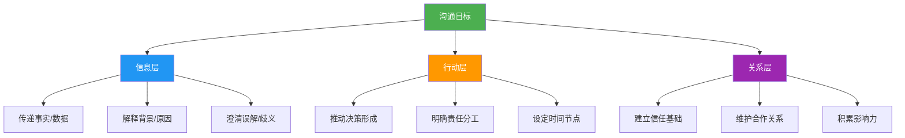
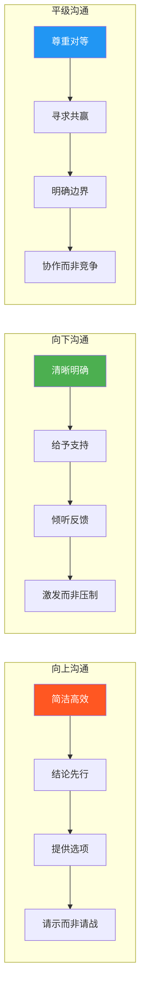
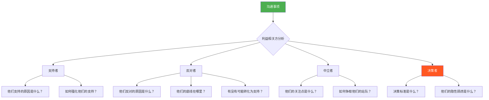
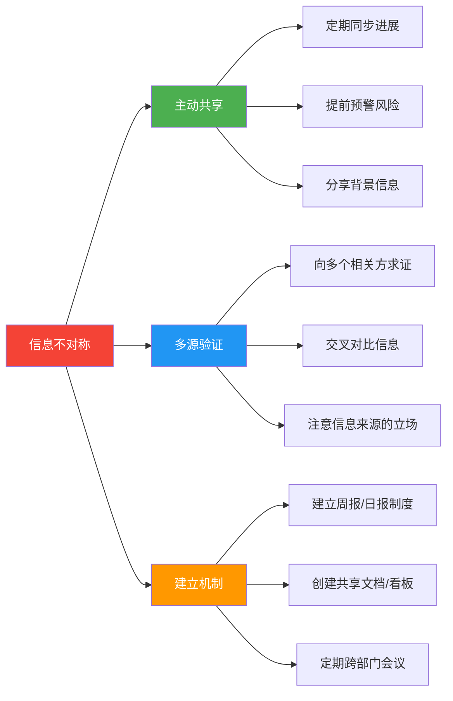
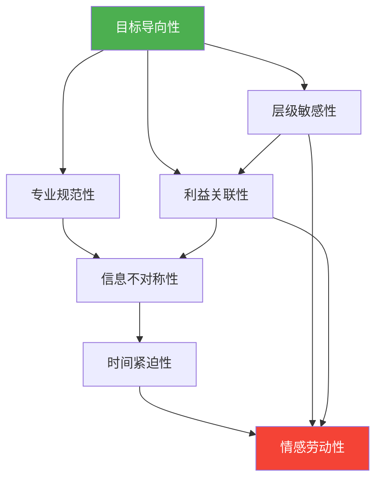

## 一、职场沟通的独特属性

职场沟通与日常沟通的根本差异，不在于"说话技巧"的高低，而在于它嵌入了一个充满权力结构、利益博弈和时间约束的组织系统。理解这些独特属性，是从"会说话"迈向"会沟通"的第一步。本节系统梳理职场沟通的七大核心属性，为后续章节的方法论和实操技巧奠定理论基础。

### 1.1 目标导向性

#### 为什么目标导向是第一属性

哈佛商学院教授约翰·科特（John Kotter）在《领导变革》中指出：组织中80%的沟通失败，根源不在表达能力，而在目标模糊。职场沟通的本质是**达成工作目标的工具**，而非社交本身。

这一点与日常沟通形成鲜明对比：

| 维度 | 日常沟通 | 职场沟通 |
|------|----------|----------|
| 核心目的 | 关系维护、情感交流 | 达成工作目标、推动事务 |
| 话题走向 | 自由发散，允许闲聊 | 聚焦主题，控制边界 |
| 时间约束 | 宽松，可随时延续 | 严格，需要效率 |
| 成果衡量 | 主观感受（开心、亲近） | 客观产出（决策、行动项） |
| 失败成本 | 低（下次再聊） | 高（错过窗口、资源浪费） |

#### 目标导向的三层结构

职场沟通的目标并非单一的"把话说清楚"，而是包含三个递进层次：

**信息层**是基础——确保对方准确理解你传达的内容。**行动层**是核心——推动事情往预期方向发展。**关系层**是隐性目标——每次沟通都在塑造你在组织中的形象和影响力。

很多职场新人只关注信息层，认为"说清楚就行了"。但真正的高手在开口之前，就已经想清楚了三个问题：我要让对方知道什么？我要让对方做什么？这次沟通之后，我们的关系会变成什么样？

#### 实操：沟通前的"一句话测试"

管理咨询顾问常用的自我检验方法：**在发起任何沟通之前，用一句话说清楚这次沟通的目的。**如果说不出来，说明你还没准备好。

具体操作：

1. **写下目的**：用"通过这次[沟通形式]，我希望[达成什么]，对方需要[做什么/知道什么]"的句式
2. **验证可衡量**：目的是具体的还是模糊的？"让领导了解情况"是模糊的，"让领导批准50万预算"是具体的
3. **评估可行性**：在当前条件下，这个目标是否现实？如果不现实，调整目标再沟通

**案例**：某互联网公司产品经理需要推动技术团队排期开发一个新功能。如果目标是"让技术团队支持我的需求"，这个目标太模糊。如果目标是"在本周五前获得技术团队的排期承诺：新功能在Q2第一周上线"，这个目标就具备了可衡量性和时间约束。

#### 常见误区

- **误区一：把"汇报"当目标**。"向领导汇报项目进展"不是目标，"让领导决策是否追加预算"才是目标
- **误区二：目标过多**。一次沟通承载3个以上目标，成功率会大幅下降。目标越聚焦，沟通越高效
- **误区三：只关注自己的目标**。忽略了对方的目标，沟通就变成了单方面输出。双赢思维是目标导向的高级形态

### 1.2 层级敏感性

#### 权力距离与沟通风格

荷兰社会心理学家吉尔特·霍夫斯泰德（Geert Hofstede）提出的"权力距离"（Power Distance Index, PDI）理论，是理解层级敏感性的核心框架。权力距离衡量的是一个组织或文化中，权力分配不平等被接受的程度。

| 权力距离 | 典型场景 | 沟通特征 | 典型表现 |
|----------|----------|----------|----------|
| 高权力距离 | 传统央企、日韩企业、政府机关 | 下对上恭敬谨慎，上对下单向指令 | 称呼用职位头衔，会议中下属等待上级先发言 |
| 中等权力距离 | 大型民企、合资企业 | 有一定层级意识但允许适度表达 | 称呼视关系亲疏，可以私下提意见但需注意场合 |
| 低权力距离 | 互联网公司、硅谷文化、扁平化团队 | 直接平等，鼓励质疑和挑战 | 直呼其名，会议中任何人可以打断任何人 |

#### 三个方向的沟通策略

**向上沟通**的核心原则是"让领导做选择题，而不是填空题"。领导的时间是最稀缺的资源，你的职责是降低他的决策成本。汇报时采用"结论→原因→方案"的金字塔结构，准备好2-3个备选方案并附上你的推荐。

**向下沟通**的核心原则是"明确期望，提供支持"。下属需要知道三件事：你要我做什么？做到什么标准？遇到困难找谁？很多管理者的沟通问题在于"只布置任务，不提供资源"。

**平级沟通**的核心原则是"尊重边界，创造价值"。同事之间没有直接的权力关系，沟通的基础是互惠。请求协助时要说明"这件事对你有什么好处"，而不是"领导让我找你配合"。

#### 面子工程：中国职场的隐性规则

在中国职场中，"面子"是层级敏感性中最微妙的维度。费孝通在《乡土中国》中提出的"差序格局"理论，至今仍深刻影响着中国人的社交逻辑。在职场中，这意味着：

- **给上级留面子**：不在公开场合质疑领导决策，有异议私下沟通。用"我有一个补充想法"替代"我觉得这个方案有问题"
- **给下属留台阶**：批评对事不对人，不在第三方面前训斥。用"这个方案的数据部分需要加强"替代"你怎么连这个都做不好"
- **给同事留余地**：跨部门协作中，对方没完成承诺时先私聊了解原因，而不是直接抄送其领导

**案例**：某公司周会上，技术负责人当众指出产品经理的方案"完全不考虑技术可行性"，产品经理当场反驳"你根本不懂业务需求"。双方在团队面前激烈争吵，最终两个部门的关系恶化，项目延期3个月。如果技术负责人会后私聊，用"我理解你的业务诉求，技术上有一些约束想和你一起想想怎么解决"的方式，结果会完全不同。

### 1.3 专业规范性

#### 职场沟通的规范体系

专业规范性不是"装腔作势"，而是降低沟通成本、减少误解的制度保障。它包含四个维度：

**语言的专业性**：使用准确的行业术语，避免模糊表达。"尽快完成"不如"本周五下班前"；"效果不太好"不如"转化率从3.2%下降到2.1%"。数据比形容词更有说服力。

**格式的规范性**：每种沟通形式都有其约定俗成的格式规范。邮件需要有清晰的主题行、收件人/抄送人区分、正文结构和签名；报告需要有摘要、正文、附录；会议需要有议程、纪要和行动项。这些格式不是形式主义，而是帮助信息高效传递的载体。

**时间的效率性**：尊重他人的时间是职场沟通的基本礼貌。Amazon的"六页备忘录"制度要求会议前30分钟沉默阅读，用文字替代PPT演示，本质上就是在追求信息密度的最大化。

**记录的可追溯性**：口头承诺容易被遗忘或被选择性记忆。重要的沟通结论必须以书面形式确认——邮件、会议纪要、工作群消息。这不是"不信任"，而是"保护双方"。

#### 不同沟通形式的规范速查

| 沟通形式 | 核心规范 | 常见违规 | 纠正方法 |
|----------|----------|----------|----------|
| 邮件 | 主题明确、结构清晰、行动项突出 | 主题模糊如"关于一些事情" | 主题行包含：[类型]主题+关键信息 |
| 即时消息 | 简洁直接、分条陈述、避免长语音 | 连发10条短消息轰炸对方 | 合并为1-2条结构化消息 |
| 会议 | 有议程、有时间控制、有纪要和行动项 | 无议程自由讨论超时 | 会前发议程，会中计时，会后发纪要 |
| 电话 | 先确认对方是否方便，控制时长 | 上来就说事情不管对方状态 | 开头先问"现在方便讲几分钟电话吗？" |
| 面谈 | 预约时间、准备充分、记录要点 | 未经预约直接找人 | 提前沟通目的和预计时长 |

#### 数字时代的沟通规范演变

传统职场沟通规范正在被数字化工具重塑。Slack、飞书、钉钉等即时通讯工具模糊了工作与生活的边界，也创造了新的沟通规范：

- **消息已读回执**：已读不回复在某些组织中被视为不礼貌行为
- **表情符号的使用**：👍在年轻一代中是积极回应，在某些传统行业中可能被视为敷衍
- **消息响应时间**：即时消息期望的响应时间远短于邮件，但不意味着需要秒回
- **群聊中的沉默**：在工作群里长期不回复可能被解读为不参与、不关心

### 1.4 利益关联性

#### 利益图谱：看清沟通背后的博弈

职场沟通之所以复杂，根本原因在于它嵌入了一个多方利益交织的系统。每一次看似简单的沟通，背后都可能牵动不同利益相关方的诉求。

理解利益关联性，需要掌握"利益相关方分析"的方法：

#### 利益识别的四个层次

| 层次 | 内容 | 识别方法 | 沟通策略 |
|------|------|----------|----------|
| 显性利益 | 资源、预算、人力、晋升机会 | 直接观察其诉求表达 | 满足或替代 |
| 隐性利益 | 面子、权力、安全感、控制欲 | 观察行为模式和情绪反应 | 给予尊重和认可 |
| 结构性利益 | 部门KPI、组织架构、汇报关系 | 分析组织结构和考核体系 | 对齐目标和激励 |
| 关系性利益 | 派系、同盟、历史恩怨 | 通过信息网络了解人际脉络 | 避免踩雷，借力打力 |

**案例**：某公司推动数字化转型，需要各部门配合使用新的CRM系统。销售部门口头支持但实际抵制。表面原因是"系统不好用"（显性利益），实际原因是销售担心客户数据透明化后自己的"议价空间"被压缩（隐性利益），更深层原因是销售总监的考核指标与新系统的数据口径不匹配（结构性利益）。如果只解决"系统不好用"的问题，永远无法推动落地。必须同时调整考核指标，让销售总监成为转型的受益者而非受害者。

#### 共赢思维的实践框架

共赢不是"各退一步"的妥协，而是找到"共同利益的交集"。具体操作：

1. **画出利益地图**：列出所有相关方及其显性、隐性利益
2. **找到交集**：哪些利益是所有人都认可的？（如公司整体业绩增长）
3. **设计交换方案**：用你掌握的资源满足对方的次要诉求，换取对方支持你的核心诉求
4. **包装沟通话术**：将你的方案包装成"对大家都好"的提案，而非"我的要求"

### 1.5 时间紧迫性

#### 职场沟通的时间约束

与日常沟通可以"慢慢聊"不同，职场沟通天然受到时间压力的约束。项目有deadline，决策有窗口期，机会稍纵即逝。这种时间紧迫性深刻影响着沟通的方式和质量。

时间紧迫性带来三个挑战：

- **信息压缩**：需要在更短时间内传达更多信息，这要求极高的信息组织能力
- **决策加速**：不允许反复讨论和犹豫不决，需要快速达成共识
- **容错降低**：时间紧张时犯错的代价更大，因为没有时间修正

#### 不同时间压力下的沟通策略

| 时间压力 | 典型场景 | 沟通策略 | 注意事项 |
|----------|----------|----------|----------|
| 极高（<30分钟） | 线上故障、突发危机 | 电话/当面，只说关键事实和行动项 | 先止血后复盘，不追究责任 |
| 高（1-3天） | 紧急项目、临时需求 | 邮件+即时消息双通道，结构化信息 | 明确优先级，避免所有事情都"紧急" |
| 中（1-2周） | 正常项目推进 | 会议+文档，充分讨论后决策 | 保持信息同步，避免信息孤岛 |
| 低（>1个月） | 战略规划、年度目标 | 书面报告+多轮讨论 | 深思熟虑，但避免过度分析导致决策瘫痪 |

#### 实操：紧急情况下的沟通模板

当时间极度紧迫时（如线上故障），使用以下结构化模板：

【紧急】[问题描述]
影响范围：[哪些用户/功能受影响]
发生时间：[具体时间]
当前状态：[已知信息]
已采取行动：[做了什么]
需要协助：[需要谁做什么]
预计恢复时间：[预估]

这个模板的价值在于：即使在混乱中，也能确保关键信息不遗漏。接收方不需要追问就能快速判断情况并采取行动。

### 1.6 信息不对称性

#### 为什么信息不对称是职场沟通的核心难题

组织中的信息分布从来不是均匀的。领导掌握战略信息但不了解执行细节，下属了解一线情况但不知道全局背景，跨部门之间更是存在严重的信息壁垒。这种信息不对称是大多数职场沟通障碍的根本原因。

信息不对称导致的典型问题：

- **决策偏差**：领导基于不完整的信息做出错误决策，因为下属"报喜不报忧"
- **重复劳动**：两个部门不知道对方已经在做同样的事情
- **信任危机**：一方发现另一方隐瞒了关键信息，信任基础崩塌
- **责任推诿**：出了问题后各方都说"我不知道这个情况"

#### 减少信息不对称的策略

**主动共享**是减少信息不对称最有效的手段。不要等到别人来问你才说，主动告知进展、风险和变化。一个简单的"这个事情有变化，提前和你说一下"，可以避免大量的后续误解。

**多源验证**是应对信息不对称的防御手段。不要只听一方之言，尤其是涉及利益冲突时。同一个事件，向3个不同的人了解情况，你会发现事实远比任何单一方描述的更复杂。

**建立机制**是从制度层面减少信息不对称。周报、日报、共享看板、跨部门例会——这些制度的本质都是在打破信息壁垒。

### 1.7 情感劳动性

#### 职场中的情绪管理

社会学家阿利·霍赫希尔德（Arlie Hochschild）在1983年提出"情感劳动"（Emotional Labor）概念：职场人不仅付出体力和脑力，还需要付出情绪劳动——管理自己的情绪表达以符合职业要求。

情感劳动在职场沟通中的体现：

- **压抑真实情绪**：对不合理的需求保持微笑，对挑衅保持克制
- **表演积极情绪**：在不想开会时表现出热情，在疲惫时表现出专注
- **管理他人情绪**：安抚愤怒的客户，激励低落的团队，缓解紧张的会议气氛

#### 情感劳动的代价与应对

长期的高情感劳动会导致"情绪耗竭"（Emotional Exhaustion），这是职业倦怠的核心表现之一。研究表明，需要高度情感劳动的职业（如客户服务、销售、管理）的离职率和心理健康问题发生率显著高于其他职业。

应对策略：

1. **识别情感劳动**：意识到"管理情绪"也是一份工作，它消耗的能量不亚于解决问题
2. **设置情绪边界**：工作时间内管理情绪，但下班后允许自己真实表达
3. **寻找情绪出口**：找到健康的情绪释放方式（运动、社交、兴趣爱好）
4. **降低无效情感劳动**：不是所有情绪都需要管理，对不合理的要求可以合理拒绝
5. **寻求支持**：与信任的同事、朋友或专业心理咨询师交流

**案例**：某公司客户经理每天需要处理大量客户投诉，始终保持专业和耐心。半年后出现严重失眠和焦虑症状。医生诊断为"职业倦怠"，建议她与上级沟通调整工作内容。她最终将部分投诉处理工作分配给团队，自己专注于维护核心客户，情感劳动负担显著降低。

### 1.8 属性间的系统关联

这七大属性并非孤立存在，而是相互交织、共同作用的系统：

理解这种系统关联，才能在实际沟通中做到"既见树木，又见森林"。例如：

- 目标导向性要求你"推动决策"，但层级敏感性要求你"不能越级汇报"——如何在组织框架内推动事情？
- 利益关联性要求你"理解各方诉求"，但信息不对称让你"看不到全貌"——如何在信息不完整的情况下做出判断？
- 时间紧迫性要求你"快速行动"，但专业规范性要求你"流程到位"——如何在效率和规范之间取得平衡？

这些张力没有标准答案，但意识到它们的存在，本身就是成熟职场沟通者的标志。

### 1.9 自我诊断：你处于哪个阶段

| 阶段 | 特征 | 典型表现 | 提升方向 |
|------|------|----------|----------|
| 初级 | 只关注信息传递 | "我把该说的说了" | 理解目标导向，开始关注沟通效果 |
| 中级 | 关注沟通策略 | "我针对不同人调整说法" | 掌握利益分析，学会共赢思维 |
| 高级 | 系统性思考 | "我考虑了所有相关方和约束条件" | 建立信息网络，减少信息不对称 |
| 专家 | 自然而然 | "我下意识就能做出正确的沟通判断" | 传授经验，培养团队沟通文化 |

### 1.10 小结

职场沟通的独特属性，本质上是组织环境对沟通行为的约束和塑造。目标导向性定义了沟通的目的，层级敏感性规定了沟通的规则，专业规范性提供了沟通的标准，利益关联性揭示了沟通的博弈，时间紧迫性施加了沟通的压力，信息不对称性制造了沟通的障碍，情感劳动性消耗了沟通的能量。

理解这些属性，不是为了让自己变得更加"圆滑世故"，而是为了在复杂的组织环境中更有效地达成目标、保护自己、帮助他人。下一节将深入探讨职场中最核心的沟通关系——上下级沟通。
