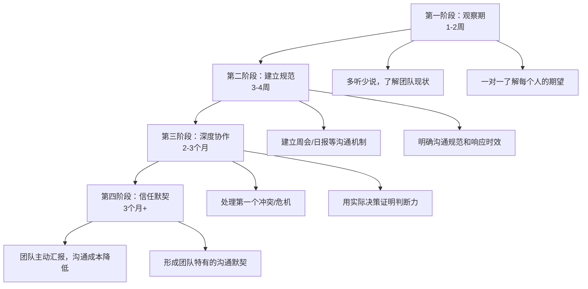

## 二、上下级沟通

上下级沟通是职场中最核心、最频繁、也最容易出问题的沟通类型。盖洛普（Gallup）2023年《全球职场状况报告》显示，75%的员工离职原因与直接上级的关系有关，而非薪酬或工作内容。关系质量的核心，就是沟通质量。更深层的数据是：上下级沟通质量每提升一个标准差，团队绩效平均提升25%，员工敬业度提升30%（来源：Google Project Aristotle研究）。

### 2.1 向上沟通：与领导的艺术

向上沟通（Upward Communication）是指下属向上级传递信息、汇报工作、提出建议的过程。它是职场沟通中最具挑战性的类型之一。

**向上沟通为什么难？**

向上沟通之所以困难，根源在于四个结构性矛盾：

- **信息不对称**：领导掌握着你不知道的战略信息、组织政治和决策背景，你需要在不完全了解全局的情况下做出恰当的沟通判断。
- **权力不对等**：领导对你有考核权、晋升权和资源分配权，这使得向上沟通天然带有一定的压力和紧张感。
- **期望差异**：领导期望你简洁、高效、提供解决方案；而你可能倾向于详细解释过程、强调困难、寻求指导。
- **注意力稀缺**：哈佛商学院研究显示，中层管理者平均每天处理74条信息，高层管理者超过100条。你的汇报只是领导信息洪流中的一条。

**向上沟通的五大核心原则：**

**原则一：结论先行——金字塔原理的职场应用**

先说结果和结论，再说过程和细节。领导的时间是稀缺资源，他们需要快速获取关键信息。这背后的心理学原理是"首因效应"——人们对最先接收到的信息印象最深、记忆最牢。

具体操作方法：采用麦肯锡经典的"金字塔结构"——先抛出核心观点（塔尖），再用2-3个支撑论据（塔身），最后补充细节数据（塔基）。例如：

- ❌ 错误示范："我们这周做了用户调研，发了500份问卷，回收了380份，然后做了数据分析，发现……"
- ✅ 正确示范："用户满意度提升了15%。核心原因是优化了售后服务流程，具体体现在三个方面：响应时间缩短了40%，首次解决率提高了20%，客户投诉率下降了35%。"

**原则二：带着方案请示——不把问题原封不动地抛给领导**

遇到问题需要请示时，至少准备两个可行方案并说明推荐理由，而不是把问题原封不动地抛给领导。这是从"问题搬运工"到"解决方案提供者"的关键转变。

方案汇报模板：

| 要素 | 说明 | 示例 |
|------|------|------|
| 问题定义 | 一句话说清楚发生了什么 | "客户A要求提前两周交付，否则取消订单" |
| 方案一 | 最稳妥的选择 | "加班赶工，预计增加成本8万，但能保住订单" |
| 方案二 | 最优但有风险 | "协调B项目的资源，可能影响B交付3天" |
| 推荐方案 | 明确你的建议及理由 | "建议选方案二，因为B客户弹性更大" |
| 需要的支持 | 你需要领导做什么 | "需要您协调B项目经理同意资源调配" |

**原则三：管理预期——坏消息要早说**

对于可能延期或出现问题的工作，提前预警，而不是等到最后一刻才汇报。管理学中有一个"好消息慢报，坏消息快报"原则——好消息可以留到周报里慢慢说，坏消息必须第一时间传达。

预警的黄金时间点：
- 发现问题的当天：评估影响范围
- 第二天上午：带着初步方案汇报
- 后续每天：更新进展直到解决

预警话术模板："领导，向您同步一个风险：[具体问题]，目前影响评估是[具体影响]，我的应对方案是[具体方案]，预计[时间节点]可以解决。如果情况有变化我会及时更新。"

**原则四：学会"翻译"——把专业语言转化为商业价值**

将你的专业术语翻译成领导能理解的商业语言。这不只是换个说法，而是一种思维方式的转换——从技术思维切换到商业思维。

| 专业语言 | 商业翻译 |
|----------|----------|
| 我们用微服务架构重构了单体应用 | 这项技术升级将帮助我们降低30%的运营成本 |
| 做了A/B测试 | 通过对比实验验证了新方案能提升转化率12% |
| 需要增加2名后端开发 | 增加2名开发可以让项目提前3周上线，多赚取约50万收入 |
| 技术债务太多 | 如果不投入时间修复，未来6个月的开发效率会下降40% |

**原则五：把握时机——选择正确的沟通窗口**

选择领导相对空闲、心情较好的时候进行重要沟通，避免在领导焦头烂额时提出复杂问题。这不是"拍马屁"，而是尊重对方的认知资源。

最佳时机判断：
- **周一上午**：领导制定本周计划，适合汇报需要决策的事项
- **周三/周四**：一周中段，领导对项目进展有感知，适合更新状态
- **周五下午**：适合汇报成果和好消息，让领导带着好心情结束一周
- **避免的时间**：周一早晨（被会议填满）、下班前30分钟（心不在焉）、领导刚开完高压会议后

---

### 2.2 向下沟通：管理的桥梁

向下沟通（Downward Communication）是指上级向下属传达指令、分配任务、提供反馈的过程。有效的向下沟通是团队高效运作的基础。

**向下沟通的核心原则：**

**原则一：清晰具体——用SMART框架下达指令**

避免模糊指令如"尽快完成""好好做"，而是明确时间节点、质量标准和验收条件。模糊指令是团队效率的最大杀手——盖洛普研究显示，只有50%的员工"完全理解"上级对自己的工作期望。

| 模糊指令 | SMART化指令 |
|----------|------------|
| "尽快完成这个报告" | "周五下午3点前提交报告，需要包含Q1-Q3的数据对比，至少覆盖5个核心指标" |
| "好好做这个客户" | "每周至少跟进客户A两次，本月目标是签约年度框架协议，预算范围在50-80万" |
| "这个事情很重要" | "这是CEO直接关注的项目，直接影响我们部门Q4的KPI评分，优先级为P0" |

**原则二：解释"为什么"——意义感是内在动机的源泉**

不仅仅告诉下属做什么，还要解释为什么做。理解了工作意义的员工，其主动性和创造力远高于只知道执行命令的员工。心理学家Adam Grant的研究表明，当员工理解工作的意义时，他们的工作投入度提升40%，离职意愿降低35%。

三层次"为什么"：
1. **任务层面**："这个报告是给董事会看的，直接影响明年的预算审批"
2. **团队层面**："做好这个项目能让团队在公司内部获得更高的影响力"
3. **个人层面**："这个项目是你展示独立负责能力的好机会，对你明年的晋升很重要"

**原则三：双向互动——向下沟通不是单向广播**

向下沟通不是单向的命令传达，而是双向的信息交流。鼓励下属提问、反馈和建议。具体做法：

- **任务布置后**：问"你对这个任务有什么疑问？"而不是"听明白了吗？"
- **定期一对一**：每周至少一次15-30分钟的一对一沟通，让下属有固定的反馈渠道
- **匿名反馈机制**：对于敏感话题，提供匿名反馈渠道（如匿名问卷、意见箱）
- **主动征询意见**："关于这个方案，你有什么不同看法？"——这句话能让沉默的下属开口

**原则四：因人而异——情境领导力模型**

对经验丰富、自驱力强的员工，可以给予更大的自主空间；对新手或信心不足的员工，则需要更详细的指导和更多的鼓励。这是管理学大师Paul Hersey和Ken Blanchard提出的情境领导力模型（Situational Leadership）的核心思想。

| 员工类型 | 能力水平 | 意愿水平 | 领导风格 | 具体做法 |
|----------|----------|----------|----------|----------|
| 新手（D1） | 低 | 高 | 指令型 | 详细指导，明确每一步，高频检查 |
| 学习者（D2） | 中低 | 低 | 教练型 | 解释原因，多鼓励，允许犯错 |
| 执行者（D3） | 中高 | 不稳定 | 支持型 | 参与决策，多倾听，少干预细节 |
| 专家（D4） | 高 | 高 | 授权型 | 明确目标后放手，定期汇报即可 |

**原则五：及时反馈——用SBI模型做有效反馈**

对下属的工作成果给予及时、具体的反馈，无论是表扬还是批评，都应该在事件发生后尽快进行。延迟的反馈会失去行为修正的最佳窗口期。

SBI反馈模型（Situation-Behavior-Impact）：

| 要素 | 说明 | 正面反馈示例 | 改进反馈示例 |
|------|------|-------------|-------------|
| Situation（情境） | 描述具体场景 | "昨天客户演示会上" | "昨天客户演示会上" |
| Behavior（行为） | 描述观察到的行为 | "你用数据可视化的方式展示方案，客户非常认可" | "你在回答客户技术问题时用了太多专业术语" |
| Impact（影响） | 说明行为产生的影响 | "客户当场决定签约，这是本季度最大的单子" | "客户看起来有些困惑，后来问了好几个澄清问题" |

**正面反馈的正确方式：**
- 公开表扬：在团队会议上表扬具体贡献
- 及时反馈：事情发生后24小时内
- 具体而非笼统："你处理客户投诉的方式很专业"比"做得好"有效10倍

**改进反馈的正确方式：**
- 私下沟通：永远不要在公开场合批评
- 对事不对人："这个方案的市场分析不够充分"比"你的分析能力不行"更有效
- 给出改进方向：不要只说"不行"，要说"怎样才行"

---

### 2.3 跨越层级的沟通策略

**2.3.1 越级沟通的风险与应对**

越级沟通（Skip-level Communication）是指跳过直接上级与更高层级领导沟通，或跳过下属直接与其下属沟通。这是职场中最敏感的沟通类型之一。

**越级沟通的三大风险：**
1. **破坏信任链**：直接上级会感到被架空，信任受损
2. **信息失真**：高层领导不了解一线细节，可能做出错误判断
3. **政治信号**：在组织中会被解读为"站队"或"越级告状"

**如何安全地越级沟通：**
- **被动越级**（高层主动找你）：如实汇报，但事后务必告知直接上级
- **主动越级**（你主动找高层）：仅限于直接上级无法解决或直接上级本身是问题的情况
- **越级前的准备**：确保你的信息准确、客观，不带有个人情绪

**2.3.2 新任管理者如何建立沟通权威**

从执行者晋升为管理者，最大的挑战之一就是建立沟通权威。权威不是职位给的，而是通过一次次高质量的沟通积累出来的。

建立沟通权威的四个阶段：

**2.3.3 如何向上管理你的领导**

向上管理（Managing Up）不是操控领导，而是主动适应领导的沟通风格和决策习惯，让双方的合作更高效。

**识别领导的沟通风格：**

| 风格类型 | 特征 | 识别信号 | 应对策略 |
|----------|------|----------|----------|
| 分析型 | 注重数据和逻辑 | 经常问"数据来源是什么？" | 汇报前准备充分的数据支撑 |
| 表达型 | 注重愿景和大局 | 喜欢讲大方向，不关注细节 | 先讲全局影响，再补充细节 |
| 友善型 | 注重关系和和谐 | 关心团队情绪，避免冲突 | 先建立关系，再谈工作 |
| 驱动型 | 注重结果和效率 | 开门见山，时间观念强 | 结论先行，不绕弯子 |

---

### 2.4 上下级沟通中的信任建设

信任是上下级沟通的基石。没有信任，再好的沟通技巧也只是空中楼阁。

**信任的两个维度：**

从下属的角度，信任领导意味着：相信领导会公平对待自己、相信领导会为自己争取利益、相信领导有能力带领团队走向成功。建立这种信任需要领导做到言行一致、公正透明、关心下属成长。

从领导的角度，信任下属意味着：相信下属会按时高质量完成任务、相信下属会如实汇报情况、相信下属不会在背后损害团队利益。建立这种信任需要下属做到诚实守信、主动汇报、勇于担当。

**信任的建立与破坏——非对称性规律：**

信任的建立是一个长期过程，需要在每一次沟通中积累；信任的破坏却可能在一瞬间完成——一次欺骗、一次背刺、一次严重的失职，都可能让长期积累的信任毁于一旦。这种非对称性可以用一个公式来理解：

> 信任建立 = Σ（每一次兑现承诺 × 时间）
> 信任破坏 = 一次严重背信 × 杠杆系数

这意味着你需要用10次以上的持续兑现才能弥补1次严重失信。因此，最高效的信任建设策略不是"做了多少对的事"，而是"避免做错任何一件关键的事"。

**信任建设的具体行动清单：**

| 角色 | 高信任行为 | 低信任行为（必须避免） |
|------|-----------|----------------------|
| 下属 | 主动汇报进展和风险 | 问题藏到瞒不住才说 |
| 下属 | 承认错误并提出补救方案 | 推卸责任或找借口 |
| 下属 | 言行一致，承诺了就做到 | 随意承诺，经常食言 |
| 领导 | 公开表扬，私下批评 | 当众批评下属 |
| 领导 | 为下属争取资源和机会 | 抢下属功劳 |
| 领导 | 信守承诺，不朝令夕改 | 随意改变已定的决策 |

---

### 2.5 常见误区与纠正方法

**误区一：向上沟通 = 拍马屁**

很多技术人员鄙视向上沟通，认为这是"拍马屁"。实际上，向上沟通是一种专业能力——你需要准确地让决策者理解你的工作价值，这和写代码、做设计一样重要。一个无法向上沟通的工程师，就像一个不会展示作品的画家——再好的能力，不被看见就等于不存在。

**纠正方法**：把向上沟通看作"信息传递"而非"讨好"。你的目标是让领导获得做决策所需的信息，而不是奉承。

**误区二：向下沟通 = 下达命令**

一些管理者认为"我说了，他们就得听"。但强制执行的效率远低于自愿执行。研究显示，员工对"理解并认同"的任务执行力是"被迫执行"的3倍。

**纠正方法**：从"命令者"转变为"影响者"。每次下达任务前，花30秒解释"为什么"，这30秒的投资能节省你后续30分钟的催促。

**误区三：反馈只在年度考核时做**

很多管理者把反馈留到年度考核，结果员工收到反馈时已经错过了行为修正的最佳时机，而且积压的反馈会让考核对话变成"批斗大会"。

**纠正方法**：建立"即时反馈"习惯——好的行为当场表扬，问题行为24小时内私下沟通。每周至少给每个下属一次具体反馈。

**误区四：用文字替代面对面沟通**

在即时通讯工具普及的今天，很多上下级沟通变成了打字。但文字无法传递语气、表情和情绪，容易造成误解。研究表明，文字沟通的误解率是面对面沟通的4倍。

**纠正方法**：重要事项（任务分配、绩效反馈、冲突解决）必须面对面或视频沟通；日常事务性信息可以用文字。记住一个判断标准："如果这条消息被截图发到公司群里，会不会有问题？"——如果会，就面对面说。

**误区五：回避冲突**

很多上下级关系中，双方都在回避冲突，结果问题像滚雪球一样越滚越大。回避冲突不会消除冲突，只会让冲突以更激烈的方式爆发。

**纠正方法**：把冲突看作"信息差异的暴露"而非"人身攻击"。当出现分歧时，用"我观察到……我担心……我希望……"的句式表达，而不是"你总是……你从来不……"。

---

### 2.6 特殊场景的沟通策略

**2.6.1 绩效面谈中的上下级沟通**

绩效面谈是上下级沟通中最紧张的场景之一。对管理者而言，如何传达负面评价而不伤害关系是一门艺术；对员工而言，如何为自己争取合理评价也需要策略。

**管理者的绩效面谈框架：**
1. **暖场（2分钟）**：轻松话题，缓解紧张
2. **员工自评（5分钟）**：先让员工说自己怎么看
3. **肯定成绩（5分钟）**：具体说明哪些做得好
4. **指出改进点（10分钟）**：用SBI模型，对事不对人
5. **制定发展计划（5分钟）**：下一步怎么做
6. **收尾（3分钟）**：总结要点，确认理解

**员工的绩效面谈策略：**
- **提前准备**：整理过去一个周期的成果数据、关键贡献、成长记录
- **主动自评**：不要等领导说，先表达你的自我认知
- **接受反馈**：即使不同意，先倾听再回应，不要当场反驳
- **争取资源**：用具体目标换资源——"如果我能完成X，是否可以争取Y？"

**2.6.2 远程/混合办公中的上下级沟通**

远程办公模式下，上下级沟通面临独特挑战：缺少非正式交流机会、时区差异、沟通异步化。Buffer公司2024年远程工作报告显示，远程员工中38%认为"与上级的沟通质量下降"是最大痛点。

**远程沟通的四项原则：**

| 原则 | 具体做法 |
|------|----------|
| 增加沟通频率 | 远程环境下，主动同步的频率应该是线下的1.5-2倍 |
| 偏好同步沟通 | 重要事项用视频会议，不要依赖文字消息 |
| 建立非正式渠道 | 每周一次15分钟的"虚拟咖啡"，聊工作以外的话题 |
| 文档化一切 | 会议纪要、决策记录、任务分配全部书面化 |

**2.6.3 跨文化上下级沟通**

在国际化职场中，上下级沟通还受到文化差异的影响。霍夫斯泰德（Hofstede）文化维度理论指出，不同文化在"权力距离"（Power Distance）上的差异会显著影响上下级沟通方式。

| 文化类型 | 权力距离 | 上下级沟通特征 | 应对策略 |
|----------|----------|---------------|----------|
| 高权力距离（中国、日本、韩国） | 下属不太敢直接表达异议 | 意见分歧时先私下沟通，给领导"面子" | 用"建议"而非"反对"的措辞 |
| 低权力距离（美国、北欧、荷兰） | 下属可以直接挑战上级 | 鼓励在会议上直接表达不同意见 | 准备好数据支撑你的观点 |

---

### 2.7 上下级沟通的进阶技巧

**2.7.1 如何在组织变革期沟通**

组织变革（裁员、重组、战略转型）是上下级沟通最困难的时期。员工焦虑、信任脆弱、信息混乱。

**变革期沟通的五要五不要：**

| 要做 | 不要做 |
|------|--------|
| 要频繁沟通，哪怕没有新消息 | 不要沉默，沉默会被解读为"隐瞒" |
| 要承认不确定性 | 不要假装一切尽在掌握 |
| 要解释决策背后的逻辑 | 不要只宣布结果不解释原因 |
| 要给员工表达情绪的空间 | 不要要求员工"不要担心" |
| 要提供明确的下一步 | 不要只说"等通知" |

**2.7.2 如何与不同代际的下属沟通**

职场中越来越多地出现四代同堂的情况：60后、70后、80后、90后、00后。每一代人的成长环境不同，沟通偏好也不同。

| 代际 | 沟通偏好 | 反馈方式 | 激励因素 |
|------|----------|----------|----------|
| 70后/80初 | 正式会议、邮件 | 一对一私下反馈 | 职位晋升、稳定性 |
| 85后/90后 | 即时通讯、灵活 | 期待频繁认可 | 成长机会、工作意义 |
| 95后/00后 | 短视频、表情包 | 期待即时反馈 | 自主权、工作体验 |

**2.7.3 非正式沟通的力量**

正式沟通（会议、邮件、汇报）只占上下级沟通的20%，真正决定关系质量的是80%的非正式沟通——电梯里的寒暄、午餐时的闲聊、茶水间的偶遇。

非正式沟通的价值：
- **建立人格连接**：让上下级关系从"职位关系"升级为"人与人的关系"
- **获取真实信息**：员工在正式场合不会说的话，在非正式场合可能自然流露
- **降低沟通成本**：有了非正式沟通的基础，正式沟通会更顺畅

**如何创造非正式沟通机会：**
- 每月至少一次与下属的午餐/咖啡
- 会议前5分钟聊几句非工作话题
- 记住下属的重要日子（生日、入职周年）
- 分享自己的工作经历和职业困惑（适度的脆弱性）

---

### 2.8 本节核心要点总结

| 维度 | 向上沟通 | 向下沟通 |
|------|----------|----------|
| 核心目标 | 让领导获取决策信息 | 让下属明确目标和方向 |
| 关键原则 | 结论先行、带着方案、管理预期 | 清晰具体、解释为什么、双向互动 |
| 常见错误 | 把问题抛给领导、不说"翻译" | 模糊指令、只给任务不给意义 |
| 信任基础 | 诚实守信、主动汇报 | 公平透明、关心成长 |
| 进阶能力 | 向上管理、识别领导风格 | 情境领导、SBI反馈 |

**一句话记住本节核心：向上沟通是"管理你的领导"，向下沟通是"服务你的团队"——两者的本质都是"站在对方的角度，用对方能接受的方式，传递对方需要的信息"。**
