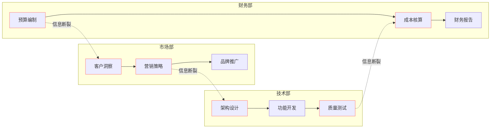
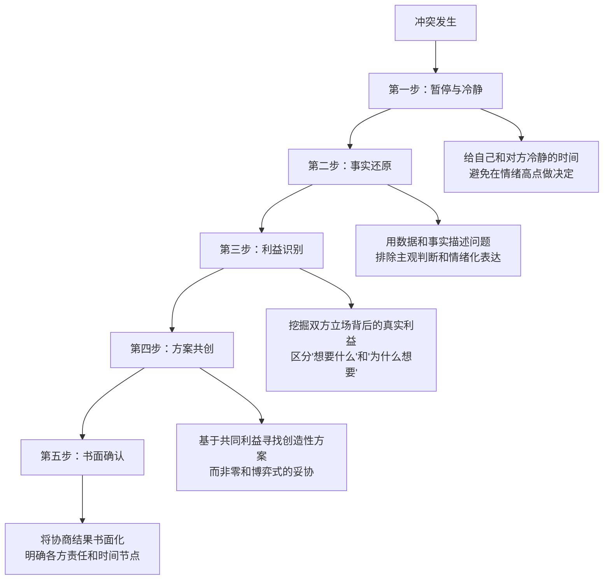

## 三、跨部门沟通

跨部门沟通（Cross-functional Communication）是组织中不同部门之间为达成共同目标而进行的信息交换与协作过程。哈佛商学院教授约翰·科特（John Kotter）在《领导变革》中指出：**组织中70%以上的跨部门协作失败，根源不是技术能力不足，而是沟通与协调的崩溃。** 麦肯锡2022年的研究进一步证实，高效跨部门协作的组织，其新产品上市速度比竞争对手快20%，员工满意度高出35%。

如果说上下级沟通是"纵向的权力之舞"，那么跨部门沟通就是"横向的利益博弈"。它没有明确的权力链可以依赖，没有统一的KPI可以牵引，甚至没有共同的日常空间来培养默契。正因如此，跨部门沟通是职场沟通中最具挑战性、也最能体现一个人综合沟通能力的场景。

### 3.1 跨部门沟通的本质：为什么它比上下级沟通更难

#### 3.1.1 结构性障碍：组织设计的"先天缺陷"

现代企业按照职能划分部门，这种设计在提高专业效率的同时，天然制造了部门之间的壁垒。杰弗里·莱弗（Jeffrey Liker）在《丰田模式》中将这种现象称为"烟囱效应"（Silo Effect）——每个部门像一根独立的烟囱，内部信息流通顺畅，但烟囱之间的横向连接极其薄弱。

这种结构性障碍具体表现为四个维度：

**目标差异。** 每个部门有自己的KPI体系，而这些KPI之间经常存在天然矛盾。市场部追求用户增长，需要快速迭代、大胆尝试；技术部追求系统稳定，需要谨慎变更、充分测试；财务部追求成本控制，要求严格预算审批。当市场部要求"两周内上线新功能"，技术部评估需要六周，财务部质疑额外加班费用——三方都有道理，但立场截然不同。这种目标冲突不是任何人"不配合"造成的，而是组织设计的必然产物。

**信息孤岛。** 各部门掌握着不同的信息资产，且缺乏系统化的共享机制。Salesforce的调研显示，86%的高管认为跨部门协作失败的主要原因是信息不流通。市场部掌握客户需求和竞争动态，技术部掌握系统能力和开发进度，财务部掌握成本结构和资源约束，人力资源部掌握组织能力和人员状况。每个部门都在用不完整的信息拼图做决策，结果自然南辕北辙。

**评价体系割裂。** 你对本部门同事的表现有直接评价权（360度评估、绩效打分），但对跨部门协作方的表现几乎没有影响力。这意味着跨部门协作中的"搭便车"行为——拖延、敷衍、推诿——缺乏有效的制约机制。一个技术经理可以要求本团队成员加班赶进度，但无法要求配合的市场部同事同样投入。

**时区与节奏差异。** 不同部门的工作节奏和优先级排序完全不同。销售部以季度为周期冲刺业绩，产品部以版本迭代为周期规划功能，财务部以月度为周期关账结算。当你急需对方配合时，可能恰好撞上对方的"季末冲刺"或"月度关账"——对方不是不愿意帮你，而是确实分身乏术。

#### 3.1.2 心理学障碍：社会认同与群体偏见

跨部门沟通的困难不仅是结构性的，更是心理性的。社会心理学中的"社会认同理论"（Social Identity Theory，Henri Tajfel，1979）揭示了一个深刻的人类倾向：人们会自动将自己归入某个社会群体（内群体），并对该群体产生积极评价，同时对外群体产生消极评价或偏见。

在组织中，这种心理机制表现为：

- **"我们vs他们"心态**：市场部的人私下吐槽"技术部的人就知道推脱"，技术部的人抱怨"市场部整天提不合理需求"。这种标签化一旦形成，就会通过"确认偏误"不断自我强化——你更容易注意到对方"不配合"的证据，而忽略对方"积极配合"的时刻。

- **归因偏差**：当本部门延误时，倾向于归因于外部因素（"其他部门配合不到位"）；当其他部门延误时，倾向于归因于内部因素（"他们效率太低"）。心理学称之为"基本归因错误"（Fundamental Attribution Error），它让跨部门之间的相互指责成为常态。

- **刻板印象固化**：随着工作年限增长，对其他部门的刻板印象会越来越固化。"销售部就是会忽悠"、"技术部就是不懂业务"、"财务部就是抠门"——这些标签虽然有时包含部分事实，但一旦成为预设判断，就会严重阻碍真诚的跨部门沟通。

#### 3.1.3 权力障碍：横向影响力比纵向领导力更稀缺

在上下级关系中，你至少拥有制度性权力——考核权、晋升权、资源分配权。但在跨部门关系中，**你对协作方没有任何制度性权力**。你不能命令其他部门的人做事，不能考核他们的表现，不能决定他们的奖金。你唯一能依赖的，是影响力——说服力、专业信誉、关系积累和互惠交换。

这对很多习惯了"权力驱动"管理方式的人来说是巨大的挑战。一个在自己部门雷厉风行的经理，可能在跨部门项目中举步维艰，因为他缺少了最重要的工具——权力。正如沃伦·本尼斯（Warren Bennis）所说：**"领导力的本质是影响力，而非权力。跨部门协作是检验这一命题的终极考场。"**

### 3.2 跨部门沟通的核心策略

理解了跨部门沟通为什么难之后，接下来需要掌握系统的应对策略。以下六种策略构成一个完整的跨部门沟通能力体系，从基础的关系建设到高级的政治智慧，层层递进。

#### 3.2.1 策略一：建立关系账户——在需要之前投资

斯蒂芬·柯维（Stephen Covey）在《高效能人士的七个习惯》中提出了"情感账户"（Emotional Bank Account）概念：人际关系就像银行账户，你需要先存款（信任、帮助、尊重），才能在需要时取款（请求支持、要求配合）。跨部门沟通尤其如此——如果你平时从未与其他部门建立关系，临时找上门要求配合，对方的第一反应必然是"你是谁？凭什么？"

**具体存款方式：**

| 存款类型 | 具体行为 | 频率建议 | 效果评估 |
|---------|---------|---------|---------|
| 信息分享 | 主动分享对对方有价值的信息（行业动态、客户反馈、竞品情报） | 每周至少1次 | 对方开始主动向你分享信息 |
| 小忙互帮 | 在对方需要时提供力所能及的帮助（分享资料、介绍人脉、技术支持） | 机会出现时立即行动 | 对方在你需要时也愿意帮忙 |
| 公开认可 | 在正式场合（会议、邮件）认可其他部门的贡献和专业性 | 每月至少1次 | 对方对你产生好感和信任 |
| 私下关心 | 关注对方的工作压力和困难，表达理解和支持 | 适度、自然 | 对方把你视为"自己人" |
| 跨部门社交 | 参与公司活动、午餐、团建等非正式社交场合 | 持续参与 | 建立个人层面的连接 |

**关键原则：** 存款必须是真诚的，而非刻意的讨好。如果你的每一次"帮忙"都带着明显的功利目的，对方会迅速察觉并产生反感。真正有效的关系投资，是在对方需要帮助时自然而然地伸出援手，而非带着计算器衡量"这次帮忙能换来什么回报"。

#### 3.2.2 策略二：翻译语言——用对方的框架说话

每个部门都有自己的"方言"——术语、关注点、思维方式和价值判断标准。跨部门沟通中最常见的错误，就是用自己的"方言"与对方交流。市场部对技术部说"这个功能很简单"，技术部听到的是"你不专业"；技术部对市场部说"这个需求不合理"，市场部听到的是"你不配合"。

**语言翻译的关键在于找到"共同语言"：**

- **对市场/销售部门沟通**：聚焦客户价值、市场份额、竞争态势、收入增长。用"这个方案能帮我们多拿下多少客户"替代"这个技术方案更优雅"。
- **对技术部门沟通**：聚焦技术可行性、实现成本、系统稳定性、技术债务。用"这个需求的优先级高于X，可以延后X的排期"替代"客户急着要，你们赶紧做"。
- **对财务部门沟通**：聚焦投资回报率、成本效益、预算合规、风险控制。用"这个项目的预期ROI是150%，回收期8个月"替代"这个项目对公司很重要"。
- **对人力资源部门沟通**：聚焦人才发展、组织效能、员工满意度、合规风险。用"这个方案能降低该岗位30%的离职率"替代"我们需要加薪留人"。

**实操框架：需求翻译四步法**

第一步：用本部门的语言明确需求（我要什么）
第二步：识别对方部门的核心关注点（对方在乎什么）
第三步：将需求转化为对方关注的价值（这对对方有什么好处）
第四步：用对方的语言重新表达（对方能听懂的方式说出来）

**示例：**

原始表达（市场部→技术部）：
"我们需要在两周内上线用户积分功能，客户催得很急。"

翻译后：
"我们分析了过去三个月的用户流失数据，发现30%的用户在注册后7天内流失。
如果能在这7天内通过积分体系提供正向激励，预计可以将7日留存率从45%提升到58%。
基于MVP版本的最小开发量评估，核心功能（积分获取+兑换）是否有可能在两周内完成？
非核心功能（排行榜、积分商城）可以放到下一迭代。"

#### 3.2.3 策略三：用数据建立共识——从主观争论到客观对话

跨部门冲突的本质，往往是不同主观判断之间的碰撞。市场部认为"客户急需这个功能"，技术部认为"系统承受不了频繁变更"——双方都是基于自己的经验和直觉在下判断，没有共同的事实基础。数据是打破主观争论的最有力武器。

**数据驱动的跨部门沟通三原则：**

**原则一：用数据定义问题，而非用情绪渲染问题。** 不要说"客户都快被逼疯了"，而要说"过去30天内，客服收到关于该功能的投诉工单共127张，环比增长89%，占总工单量的23%"。数据让问题从"你的情绪"变成"我们的事实"。

**原则二：用数据量化收益，而非用形容词夸大收益。** 不要说"这个功能非常重要"，而要说"根据A/B测试数据，该功能上线后预计月活提升12%，对应季度收入增加约180万元"。当收益可以用数字衡量时，资源分配的决策就有了客观依据。

**原则三：用数据追踪进度，而非用承诺担保进度。** 不要说"我们会尽快完成"，而要说"当前完成度40%，按照历史迭代速度，预计还需要3个sprint（6周），最快交付日期是8月15日"。数据化的进度追踪比口头承诺更可信，也更容易管理期望。

#### 3.2.4 策略四：尊重专业边界——提需求而非下指令

跨部门沟通中最容易犯的错误之一，就是越界指导其他部门的工作方式。你可以说"我需要在下周五之前拿到这个报告"，但不应该说"你应该用Excel而不是Python来处理这个数据"。每个部门对自己的专业领域拥有判断权和决策权，越界指导会被视为不尊重和不信任。

**需求表达的"三层结构"：**

第一层：业务背景（为什么需要）
  → "我们的客户调研显示，60%的用户在注册流程中因页面加载过慢而放弃"

第二层：期望结果（需要什么）
  → "我们需要将注册页面的加载时间从4.5秒缩短到2秒以内"

第三层：约束条件（附加信息）
  → "希望在Q3上线，预算上限10万元，需要保证现有用户不受影响"

不要说的第四层：执行方式（不应该涉及）
  → ✗ "你们应该用CDN加速，把图片压缩一下，再上个缓存"

为什么第四层不应该说？因为：第一，你的技术判断可能是错的；第二，即使你判断正确，越界指导也会伤害对方的专业自尊心；第三，当你的"建议"出了问题，责任归属会变得模糊——"当初是你说要这样做的"。

#### 3.2.5 策略五：建立正式协作机制——用制度替代人情

对于长期或复杂的跨部门协作项目，仅靠个人关系和临时沟通是远远不够的。你需要建立正式的协作机制，用制度和流程来保障沟通的效率和质量。

**跨部门协作机制的五个核心要素：**

| 要素 | 说明 | 具体做法 |
|------|------|---------|
| 联络人制度 | 每个参与部门指定一名固定联络人 | 明确联络人的职责：信息传递、进度同步、问题升级 |
| 定期沟通机制 | 按项目节奏设定固定的沟通时间 | 项目启动期每日站会，执行期每周例会，收尾期每日同步 |
| 共享信息平台 | 建立跨部门可访问的信息共享空间 | 使用项目管理工具（如飞书项目、Jira）记录所有需求、进度和决策 |
| 决策升级路径 | 明确不同级别问题的决策和升级规则 | 一般问题联络人协商，重大分歧升级到部门负责人，战略争议升级到分管高管 |
| 书面确认制度 | 所有重要决策和变更必须书面记录并确认 | 会议后24小时内发送会议纪要，需求变更必须有书面审批 |

#### 3.2.6 策略六：借力而非硬推——善用组织政治智慧

组织政治（Organizational Politics）是职场中不可回避的现实。它不一定是负面的——在资源有限、目标多元的组织中，政治本质上是利益协调的机制。在跨部门沟通中，善用组织政治智慧，意味着你知道何时借力、向谁借力、如何借力。

**三种借力方式：**

**向上借力。** 当你的跨部门请求被忽视或拒绝时，不要自己反复纠缠，而是通过你的上级与对方的上级沟通。这不是"打小报告"，而是利用组织的正式权力结构来推动决策。关键技巧：让上级介入前，确保你已经做了充分的沟通尝试，并准备好完整的问题描述和建议方案，而不是只抛出一个"他们不配合"。

**盟友借力。** 在组织中寻找与你目标一致的盟友——可能是其他部门中与你有相似诉求的人，也可能是对你有好感的跨部门同事。当多个声音指向同一个方向时，推动变革的力量会成倍增加。

**高层愿景借力。** 将你的跨部门诉求与公司的战略目标、高管的关注重点绑定。当你能证明"做这件事对CEO关注的战略目标有直接贡献"时，跨部门配合的阻力会显著降低。这不是投机取巧，而是让正确的事情获得应有的重视。

### 3.3 跨部门冲突的处理框架

跨部门冲突在所难免。冲突本身不是问题——适度的冲突甚至能激发更好的方案。真正的问题是冲突处理不当导致关系破裂、项目停滞。以下是一个经过验证的五步冲突处理框架。

#### 3.3.1 五步冲突处理模型

**第一步：暂停与冷静。** 冲突发生时，双方的情绪水平通常都很高。此时进行的任何沟通都容易升级为争吵。最明智的做法是按下暂停键："我理解你对这个问题很关注，我也一样。我建议我们都先冷静一下，明天上午10点我们再坐下来详细讨论，可以吗？"暂停不是逃避，而是为了更有效地解决问题。

**第二步：事实还原。** 冷静之后，回到客观事实。把冲突的来龙去脉用时间线的方式梳理出来：什么时间、什么人、做了什么决定、导致了什么结果。注意区分事实和判断——"需求在3月5日变更了三次"是事实，"你们反复折腾我们"是判断。

**第三步：利益识别。** 冲突的表面是立场之争（"我要A方案"vs"我要B方案"），但立场背后是利益之争。用"为什么"来挖掘立场背后的利益：你坚持A方案的原因是什么？是因为技术风险低，还是因为开发成本小，还是因为与现有系统的兼容性好？当双方都清楚对方的真实利益时，往往能找到兼顾各方的第三种方案。

**第四步：方案共创。** 基于对双方利益的理解，一起寻找创造性方案。关键心态：这不是"你赢我输"的零和博弈，而是"我们共同面对一个问题"的协作。问一个有力的问题："在满足双方核心利益的前提下，有没有我们都没想过的第三种方案？"

**第五步：书面确认。** 达成共识后，24小时内将协商结果书面化。内容包括：共识内容、各方责任、时间节点、验收标准、异常处理机制。书面确认不是"不信任"的体现，而是专业协作的基本规范。人类的记忆是不可靠的，口头承诺在三周后可能被完全遗忘或被不同的人记住不同的版本。

#### 3.3.2 冲突升级时的应对策略

当双方无法自行解决冲突时，需要考虑升级处理。但升级是一把双刃剑——用得好能解决问题，用不好会激化矛盾。

**升级的正确时机：**

- 双方已经充分沟通，但仍然存在根本性分歧
- 问题涉及的资源或决策权限超出双方的能力范围
- 冲突已经影响到项目的关键时间节点
- 一方的行为已经严重违反了协作协议

**升级的错误时机：**

- 双方尚未进行充分沟通就直接越级上报
- 只是对方没有立即满足你的要求就去"告状"
- 想借上级的权力来压服对方

**升级的正确方式：**

向你的上级汇报时，使用以下结构：

1. 背景："我们在XX项目中与YY部门合作，目前遇到了一个需要协调的问题。"
2. 已尝试的努力："我们已经进行了3次沟通，尝试了A方案和B方案，
   但因为ZZ原因（资源限制/目标冲突/权限不足）无法达成一致。"
3. 双方立场："我方的考虑是...，对方的考虑是...，双方都有合理之处。"
4. 建议方案："我建议可以这样解决...，或者那样解决...，
   想请您帮忙协调/决策。"
5. 风险提示："如果这个问题不能在X日前解决，可能导致..."

### 3.4 跨部门沟通的实操工具箱

#### 3.4.1 跨部门项目沟通计划模板

在启动任何跨部门项目时，花30分钟制定一份沟通计划，可以避免后续80%的沟通问题。

【跨部门项目沟通计划】

项目名称：____________________
项目负责人：__________________
起止日期：____________________

一、参与部门与联络人
| 部门 | 联络人 | 角色 | 联系方式 |
|------|--------|------|----------|
| ___ | ___ | ___ | ___ |

二、沟通频率与方式
| 沟通类型 | 频率 | 参与人 | 形式 | 输出物 |
|---------|------|--------|------|--------|
| 进度同步 | 每周一 | 全体联络人 | 线上会议 | 会议纪要 |
| 问题协调 | 按需 | 相关方 | 即时通讯/电话 | 问题记录 |
| 里程碑评审 | 按节点 | 全体+上级 | 正式会议 | 评审报告 |

三、信息共享机制
- 项目文档存放位置：____
- 进度看板地址：____
- 重要通知发布渠道：____

四、决策与升级机制
- 一般问题：联络人之间协商解决（24小时内响应）
- 重大分歧：升级到部门负责人（48小时内决策）
- 战略争议：提交分管高管裁决（当周内处理）

五、风险预警机制
- 进度偏差超过3天：黄色预警，联络人同步
- 进度偏差超过1周：红色预警，升级到部门负责人
- 关键资源缺失：立即通知项目负责人

#### 3.4.2 跨部门邮件/消息模板

**初次请求协作：**

主题：【协作请求】XX项目——关于YY方面需要贵部门支持

XX部门负责人/同事，你好：

我们正在推进XX项目（背景简述：一句话说明项目目标和意义）。

在YY环节，需要贵部门在以下方面提供支持：
1. 具体需求描述（做什么、为什么需要）
2. 期望交付物和时间（需要什么、什么时候需要）
3. 对贵部门的价值（这件事对你们的好处）

我们已经完成了前期的ZZ工作，附件是相关材料供参考。
如果方便，希望这周能安排15分钟简短沟通，对齐一下细节。

感谢支持！

**进度同步：**

主题：【周报】XX项目第N周进度同步（跨部门）

各位同事：

本周项目进度如下：

✅ 已完成：
- 事项A（负责部门：XX，完成日期：MM/DD）
- 事项B（负责部门：YY，完成日期：MM/DD）

🔄 进行中：
- 事项C（负责部门：ZZ，进度60%，预计MM/DD完成）
- 事项D（负责部门：XX，进度30%，需要YY部门在MM/DD前提供数据支持）

⚠️ 风险项：
- 事项E可能延期，原因：____，建议应对方案：____

📋 下周计划：
- 事项F（负责部门：YY，MM/DD前完成）
- 事项G（负责部门：ZZ，MM/DD前完成）

如有问题或建议，请在本群/邮件中回复。

#### 3.4.3 跨部门需求优先级协商框架

当多个部门同时向技术/产品部门提需求时，需要一个客观的优先级排序框架，避免"谁嗓门大谁优先"的混乱局面。

| 评估维度 | 权重 | 评分标准（1-5分） |
|---------|------|------------------|
| 战略对齐度 | 30% | 与公司年度战略目标的关联程度 |
| 用户/客户影响面 | 25% | 影响的用户数量和影响程度 |
| 收入/成本影响 | 20% | 预期收入增长或成本节约金额 |
| 紧迫度 | 15% | 不做会导致的损失大小和时间敏感性 |
| 实现复杂度 | 10% | 开发工作量（反向计分：越简单分数越高） |

**协商流程：**

1. 各需求方填写标准化的需求描述表（包含上述维度的自评）
2. 跨部门需求评审会（每月一次），各方陈述需求价值
3. 由产品/项目管理角色基于框架评分，给出排序建议
4. 排序结果由各方确认，如有争议提交上级裁决
5. 最终排期结果书面通知所有相关方

### 3.5 跨部门沟通的常见陷阱

#### 陷阱一："找人不如找系统"

很多人在跨部门协作中遇到困难时，第一反应是建立更多的流程、系统和制度。流程当然重要，但过度依赖流程会导致"官僚化"——每个需求都要走审批、每个变更都要开评审会、每个决策都要层层签字。当流程变成目的而非手段时，跨部门沟通的效率会急剧下降。

**纠正方法：** 流程应该服务于沟通，而非替代沟通。保持"重关系、轻流程"的原则——在信任度高的协作关系中，流程可以简化；在信任度低的初期阶段，流程可以适当严格。随着关系的成熟，逐步减少不必要的流程环节。

#### 陷阱二："他们应该知道"

跨部门沟通中最危险的假设是"对方应该知道我的需求/困难/期望"。你可能觉得你的需求已经表达得很清楚了，但对方可能完全没有接收到同样的信息。人类有"知识的诅咒"（Curse of Knowledge）——当你对一件事非常了解时，你会不自觉地假设别人也了解同样的信息。

**纠正方法：** 永远不要假设对方"应该知道"。重要的信息，用书面方式明确传递；关键的期望，当面确认对方是否理解；复杂的项目，用共享文档确保所有人看到的是同一个版本的信息。

#### 陷阱三："先发制人式指责"

当跨部门合作出现问题时，很多人的第一反应是抢先指出对方的问题，试图在"追责"中占据有利位置。这种"先发制人"策略看似保护了自己，实际上严重破坏了跨部门信任。对方会把精力从解决问题转移到自我辩护上，沟通的焦点从"怎么解决"变成"谁的错"。

**纠正方法：** 采用"先解决、后复盘"的原则。问题发生时，首先聚焦于"如何弥补和止损"，而不是"谁应该为此负责"。当问题解决后，在复盘环节客观分析原因，目的是改进流程而非追责。这种做法会让你在跨部门协作中建立"靠谱"的口碑。

#### 陷阱四："会议依赖症"

跨部门项目遇到问题就开会，这几乎成了组织本能。但很多时候，一个15分钟的电话、一条结构化的消息，甚至一份清晰的文档，都比一个30分钟的会议更有效。过度开会不仅浪费时间，还会让参与者产生"开会疲劳"，降低每次会议的投入度和效率。

**纠正方法：** 开会前先问三个问题：这个问题能用一封邮件/一条消息解决吗？必须所有人都到场才能讨论吗？会议结束后会有明确的行动项吗？如果三个问题中有两个答案是"否"，就不需要开会。

#### 陷阱五："过度承诺换取配合"

为了让其他部门配合自己的项目，有些人会过度承诺——承诺更高的优先级、更多的资源支持、更快的交付速度。短期来看，这种方式确实能获得配合；但长期来看，当承诺无法兑现时，你的信用就会破产。在跨部门协作中，信用是最宝贵的资产。

**纠正方法：** 宁可少承诺、多交付，也不要多承诺、少交付。如果对方的需求超出了你能承诺的范围，坦诚地说"这个时间点我无法保证，但我可以做到的是...，我们可以一起看看有没有替代方案"。坦诚的拒绝比虚伪的承诺更受尊重。

### 3.6 跨部门沟通能力的进阶修炼

#### 3.6.1 从"部门代言人"到"组织协作者"的角色转变

跨部门沟通能力的最高境界，是完成一次角色转变——从"本部门利益的代言人"转变为"组织整体价值的协作者"。这不是要求你放弃本部门的利益，而是在维护本部门利益的同时，具备全局视角。

具体表现为：

- **能用对方的语言描述自己的需求**（而非只有本部门的术语）
- **能理解对方部门的业务逻辑和KPI压力**（而非只关注自己的目标）
- **能在方案设计阶段就考虑跨部门影响**（而非在执行阶段才找人配合）
- **能主动识别并推动解决跨部门的系统性问题**（而非只解决自己面对的个案）

#### 3.6.2 构建跨部门影响力网络

一个跨部门沟通高手，通常在组织中拥有广泛的人脉网络。这个网络不是靠社交活动建立的表面关系，而是基于实际协作中积累的专业信任。

**网络构建策略：**

- **纵向扩展**：不仅与平级同事建立关系，也与对方部门的上级和下级建立连接。当你需要推动一件事时，如果你在对方部门从上到下都有信任关系，阻力会小得多。
- **横向扩展**：不仅与经常协作的部门建立关系，也与偶尔交集的部门保持基本的了解和互动。组织中的机会往往来自意想不到的角落。
- **深度积累**：在几个关键部门建立深度信任关系，成为这些部门遇到跨部门问题时第一个想到的人。"有问题找XX"是一种极高的跨部门影响力标志。

#### 3.6.3 数字化时代的跨部门沟通新挑战

远程办公和混合办公模式的普及，给跨部门沟通带来了新的挑战。缺少了茶水间偶遇和午餐闲聊等非正式沟通渠道，跨部门关系的维护变得更加困难。

**应对策略：**

- **主动制造"偶遇"**：在远程环境下，主动发起非正式的跨部门线上交流（如虚拟咖啡聊天、跨部门知识分享会）
- **过度沟通原则**：远程环境下，信息传递的损耗比面对面更高。重要的跨部门信息，宁可多说一遍也不要假设对方已经收到
- **可视化进度**：使用共享看板让所有跨部门协作者实时看到项目进度，减少因信息不对称导致的焦虑和误解
- **录制关键决策**：重要的跨部门会议录制或详细记录，方便未能参会的人员回看，也避免"我当时不是这么说的"之类的争议

***

> **本节要点回顾：** 跨部门沟通的核心挑战来自结构性障碍（目标差异、信息孤岛、评价割裂）、心理学障碍（群体偏见、归因偏差）和权力障碍（缺乏制度性权力）。应对策略包括建立关系账户、翻译语言、用数据说话、尊重专业边界、建立正式机制和善用组织政治。处理冲突时，遵循"暂停→事实→利益→共创→确认"的五步框架。最终目标是从"部门代言人"成长为"组织协作者"。
