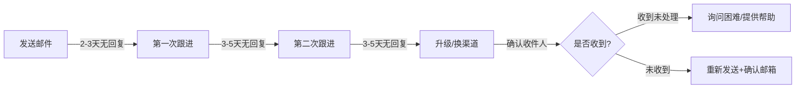

## 五、邮件沟通

在即时通讯工具泛滥的时代，电子邮件依然是职场沟通的"硬通货"。它不只是信息传递的载体，更是专业形象的展示窗口、决策链条的法律凭证、跨组织协作的基础设施。掌握邮件沟通的艺术，是每一个职场人从新手走向成熟的必修课。

### 5.1 邮件在职场沟通中的战略地位

#### 5.1.1 为什么邮件不可替代

很多职场新人认为邮件已经"过时"，微信、钉钉、Slack 才是主流。这种认知是危险的。邮件之所以不可替代，源于四个核心属性：

**正式性与法律效力**：在劳动纠纷、合同争议、知识产权诉讼中，电子邮件是法院认可的书面证据。2020年《中华人民共和国民法典》明确了电子数据作为证据的法律地位。一封措辞严谨的邮件，在关键时刻比口头承诺有力得多。

**可追溯性**：邮件服务器会保留完整的发送、接收、阅读记录。当你需要证明"我在某月某日已经通知过你"时，邮件的时间戳和送达回执是最可靠的证据。

**异步性**：与即时通讯不同，邮件给双方留出了思考和准备的空间。你可以在自己最清醒的时间段处理邮件，而不是被弹窗消息打断思路。这种"延迟回复"不是效率低下，而是深思熟虑。

**跨组织兼容性**：微信只能加微信好友，钉钉需要同一个组织。但邮件地址是互联网的通用标识——无论对方用 Gmail、Outlook 还是企业邮箱，都能无障碍沟通。这是邮件作为"互联网基础设施"的独特优势。

#### 5.1.2 邮件 vs 即时通讯：何时该用邮件

| 场景 | 推荐渠道 | 原因 |
|------|----------|------|
| 紧急且简单的事务 | 即时通讯 | 需要即时反馈 |
| 正式的工作汇报 | 邮件 | 需要留痕和正式记录 |
| 项目需求确认 | 邮件 | 需要双方确认的书面依据 |
| 日常闲聊 | 即时通讯 | 轻松随意 |
| 跨部门/跨公司协作 | 邮件 | 正式且通用 |
| 会议纪要分发 | 邮件 | 需要存档和回溯 |
| 催办/提醒 | 先即时通讯，后邮件确认 | 即时通讯催促，邮件留痕 |
| 负面反馈/绩效沟通 | 先当面/电话，后邮件确认 | 避免文字误解，邮件作为记录 |

**判断口诀**：如果这件事将来可能需要"翻旧账"，就用邮件；如果这件事说完就忘，用即时通讯。

### 5.2 邮件的解剖学：结构与组件

一封专业邮件由以下组件构成，每个组件都有其特定的功能和规范：

┌─────────────────────────────────────────────┐
│  收件人（To）：必须回复的人                    │
│  抄送（CC）：需要知晓的人                      │
│  密送（BCC）：隐藏的收件人                     │
│  主题（Subject）：一句话概括核心诉求            │
├─────────────────────────────────────────────┤
│  称呼（Greeting）                             │
│  正文开头：目的/背景                           │
│  正文主体：详细内容/数据/论据                   │
│  正文结尾：行动要求/截止时间                    │
│  签名档（Signature）                           │
├─────────────────────────────────────────────┤
│  附件（Attachment）                            │
│  免责声明（Disclaimer）                        │
└─────────────────────────────────────────────┘

#### 5.2.1 收件人（To）、抄送（CC）与密送（BCC）

这三个字段的使用远比大多数人以为的复杂：

**收件人（To）**：邮件的直接责任人，需要对该邮件做出回应或采取行动。一封邮件的 To 字段不宜超过 5 人——如果需要更多人行动，说明邮件主题不够聚焦，应该拆分。

**抄送（CC）**：Carbon Copy 的缩写。CC 的含义是"我让你知道这件事，但不需要你做任何事"。CC 的常见用途包括：
- 上级审批：CC 你的直属领导，让 TA 知道你在推进工作
- 跨部门知会：CC 相关部门的接口人，避免信息孤岛
- 存档备查：CC 行政或项目管理岗位，便于归档

**密送（BCC）**：Blind Carbon Copy。BCC 收件人能看到邮件内容，但其他收件人不知道 TA 的存在。使用场景：
- 群发通知：避免泄露所有收件人的邮箱地址
- 向上级"悄悄"汇报：谨慎使用，过度使用会破坏信任
- 保护隐私：向大量外部人员发送时，BCC 是基本礼仪

**致命错误**：把应该放在 To 的人放到了 CC 里——对方会认为不需要回复你，导致事情悬而未决。反过来，把不该回复的人放在 To 里——对方会觉得被强迫参与。

#### 5.2.2 主题行：决定邮件命运的第一印象

主题行是邮件中最重要的一行文字。数据显示，47% 的收件人仅凭主题行决定是否打开邮件，69% 的人会根据主题行判断是否是垃圾邮件。

**主题行的黄金公式**：

【标签/类型】核心内容 — 行动要求/时间约束

**优秀主题行范例**：

| 类型 | 差 | 好 |
|------|-----|-----|
| 请求审批 | 请审批 | 【审批】Q3市场预算方案（¥85万）- 周五前 |
| 会议邀请 | 明天开会 | 【会议邀请】产品评审会 6/25 14:00-15:30 3号会议室 |
| 进度汇报 | 项目进展 | 【周报】智能客服项目 Week 24 — 测试阶段启动 |
| 问题求助 | 帮忙看看 | 【求助】生产环境数据库连接超时 — 影响线上订单 |
| 跟进提醒 | 跟进一下 | 【跟进】合同审批流程 — 已等待3天待你确认 |
| 信息分享 | 转发给你 | 【FYI】竞品分析报告 — Q2行业动态速览 |
| 感谢致谢 | 谢谢 | 【感谢】项目上线成功 — 感谢各位支持 |
| 紧急事务 | 紧急！！！ | 【紧急】服务器宕机 — 线上支付中断需立即处理 |

**主题行的禁忌**：
- 不使用全部大写字母（视觉上像在尖叫）
- 不使用过多感叹号（一个足够，零个更好）
- 不写"无主题"或留空（收件人无法筛选和检索）
- 不在主题行写完整封邮件内容（过长的主题行会被截断）
- 不使用模糊词汇如"一些事情""重要通知"（什么事情？什么通知？）

### 5.3 正文撰写的系统方法

#### 5.3.1 开头：30秒法则

收件人平均花 11 秒 阅读一封商务邮件。你的开头必须在 30 秒内让对方明白三件事：你是谁、你要什么、为什么找我。

**结构化开头模板**：

[称呼],

我是[公司/部门]的[姓名]，[与你的关系/如何认识]。

写这封邮件是为了[具体目的]。

**反面教材**：
> 尊敬的领导您好，冒昧打扰，不好意思在这个百忙之中打扰您，我是一个小小的实习生，不知道能不能占用您一点宝贵的时间……

这段话花了 50 个字还没说清要干什么。礼貌是必要的，但过度的谦卑会浪费对方的时间，也会削弱你的专业形象。

**正面范例**：
> 王经理您好，我是市场部的张明。关于上周提到的Q3推广方案，我已整理出初稿，想请您审阅并给出反馈。

两句话，33个字，信息量完整。

#### 5.3.2 主体：金字塔原理

邮件正文应遵循麦肯锡的金字塔原理——结论先行，然后展开论据：

结论/请求（第一段）
├── 理由/背景 1
│   └── 支撑数据/证据
├── 理由/背景 2
│   └── 支撑数据/证据
└── 理由/背景 3
    └── 支撑数据/证据

**为什么结论先行**：大多数商务人士会先快速扫描邮件，只有在看到关键信息后才会决定是否仔细阅读。如果你把结论放在最后一段，忙碌的收件人可能根本看不到。

**正文组织的实用技巧**：
- 每个段落只讨论一个主题
- 使用编号（1、2、3）而非项目符号（·），因为编号更便于引用和讨论
- 涉及多个行动项时，标注负责人和截止日期
- 需要对方决策的事项，给出明确的选项（A方案/B方案）而非开放式提问
- 数据和日期加粗，方便快速定位

**正面范例**：
> 需要您在本周五（6/27）前确认以下两个事项：
>
> 1. **预算方案选择**：A方案（¥85万，覆盖3个渠道）或B方案（¥120万，覆盖5个渠道），详见附件PPT第3-5页
> 2. **供应商确认**：倾向选择"智远科技"还是"创想传媒"？（报价对比见附件第8页）

#### 5.3.3 结尾：明确行动号召

邮件结尾是行动发生的地方。模糊的结尾等于没有结尾。

**糟糕的结尾**：
> 如有问题请随时联系我。

这句话听起来很礼貌，但实际上什么也没说。对方有问题联系你，没问题呢？什么都不做？你需要明确告诉对方"现在需要做什么"。

**优秀的结尾**：
> 请在本周五（6/27）17:00前：
> 1. 回复邮件确认选择 A 或 B 方案
> 2. 如有疑问，可直接回复本邮件或拨打我的分机 8234
>
> 超过截止日期未回复，我将默认采用 A 方案推进。

这个结尾包含了：具体的行动、明确的截止时间、沟通渠道、以及"不回复的后果"——这最后一项往往是最有效的催办手段。

#### 5.3.4 称呼与签名档

**称呼规范**：

| 场景 | 称呼方式 | 示例 |
|------|----------|------|
| 内部同事 | 姓名 + 职位/通用称呼 | 张明经理、李工、王姐 |
| 外部客户 | 姓 + 职位 | 王总、李经理、陈博士 |
| 不确定对方身份 | 通用称呼 | 您好、各位同事 |
| 多人群发 | 团队/部门名称 | 产品部各位同事 |
| 高层领导 | 姓 + 职位全称 | 王副总裁、李首席技术官 |

**签名档模板**：
——
张明 | 高级产品经理
XX科技有限公司 · 产品部
手机：138-0000-0000
邮箱：zhangming@xxtech.com
企业微信：zhangming_xx

签名档应包含：姓名、职位、公司、联系方式。不建议放置公司 logo 图片（增加邮件体积，部分客户端不显示）、励志语录（不专业）、过多的社交媒体链接（干扰信息）。

### 5.4 十二类常见职场邮件模板

#### 5.4.1 工作请求邮件

**适用场景**：请求资源、请求协助、请求审批

主题：【请求】需要产品部协助完成用户调研 — 6/30前

李经理您好，

我是市场部的张明。我们正在进行Q3用户增长策略的制定，
需要产品部协助完成一次用户深度访谈（预计10人，每人30分钟）。

具体请求如下：
1. 提供最近30天活跃用户的联系方式（脱敏后）
2. 安排1名产品经理参与访谈提纲设计
3. 访谈时间窗口：7/1 - 7/10

预计产品部投入工时：约8小时。
如需部门领导审批，我可以同步发送正式邮件。

请在6/30前确认是否可以支持，如有困难请告知，
我可以调整方案或寻求其他资源。

张明

#### 5.4.2 进度汇报邮件

**适用场景**：周报、项目阶段汇报、里程碑更新

主题：【周报】智能客服项目 Week 24（6/17-6/21）

各位好，

本周进展如下：

一、已完成
1. 知识库训练完成，准确率从 72% 提升至 89%
2. 与客服团队完成第一轮 UAT 测试，收集反馈 47 条
3. 修复了 3 个高优先级 Bug（详见 Jira: CS-123/124/125）

二、进行中
1. 多轮对话功能开发（进度 60%，预计下周三完成）
2. 第二轮 UAT 测试准备（测试用例编写中）

三、风险与阻塞
1. 【风险】第三方 NLP 接口响应时间超出 SLA（平均 2.3s，
   要求 <1s），已联系供应商，预计下周二给出优化方案
2. 【阻塞】生产环境部署需要运维团队审批，已提交工单
   （OPS-456），等待处理

四、下周计划
1. 完成多轮对话功能并提交测试
2. 启动第二轮 UAT
3. 跟进生产环境部署审批

需要决策：是否在7月1日按计划进入灰度发布？
如需调整时间线，请在本周三前反馈。

张明

#### 5.4.3 跟进/催办邮件

**适用场景**：对方未回复、审批超时、交付物延迟

**跟进节奏建议**：
- 第一次跟进：原邮件发出后 2-3 个工作日
- 第二次跟进：第一次跟进后 3-5 个工作日
- 第三次跟进：升级（抄送上级或换渠道沟通）

主题：【跟进】合同审批流程 — 已等待3个工作日

王经理您好，

我于6月20日发送了XX项目的合同审批邮件（见下方原邮件），
目前尚未收到您的反馈。

理解您工作繁忙，特此跟进：
- 如已审批：请忽略本邮件，我会在系统中确认
- 如需要修改：请指出具体条款，我当天调整
- 如需要讨论：我随时可以约15分钟电话沟通

合同签署的截止日期为6月30日，如6/28前无法完成审批，
可能影响项目启动时间。

如有困难请告知，我可以协调延期。

张明

**跟进邮件的关键技巧**：
- 引用原邮件（方便对方快速回顾上下文）
- 给出明确的选项（而非开放式提问）
- 说明不回复的后果（温和但清晰）
- 提供替代沟通渠道（电话/当面）
- 不要表现出不耐烦或指责

#### 5.4.4 会议邀请邮件

主题：【会议邀请】产品评审会 6/25（周二）14:00-15:30

各位好，

邀请大家参加 Q3 产品规划评审会：

时间：2026年6月25日（周二）14:00-15:30
地点：总部3楼 · 3号会议室（线上参会请使用腾讯会议：xxx）
参会人：产品部、技术部、市场部相关负责人

议程：
1. 14:00-14:15 Q2 产品回顾（张明）
2. 14:15-14:45 Q3 产品路线图讨论（李华）
3. 14:45-15:15 技术可行性评估（王强）
4. 15:15-15:30 决议与行动项（全体）

会前准备：
- 请阅读附件《Q3产品规划草案》（共12页，预计阅读时间15分钟）
- 技术部请提前评估方案的技术可行性和工期

请在6月24日17:00前确认是否可以出席。
如无法出席，请指派代表参加。

张明

#### 5.4.5 介绍/引荐邮件

主题：【引荐】张明（XX科技）↔ 李华（YY传媒）— 商务合作对接

张明、李华，

好东西要分享——我来介绍一下：

张明是我之前在XX科技的同事，目前负责智能客服产品线，
最近在寻找市场推广合作伙伴。

李华是YY传媒的商务总监，专注于ToB领域的数字营销，
服务过多家SaaS企业。

我感觉你们在业务上有很好的互补性，所以牵个线。
具体聊什么、怎么合作，你们直接沟通就好。

张明的联系方式：138-0000-0000 / zhangming@xxtech.com
李华的联系方式：139-0000-0000 / lihua@yymedia.com

祝合作愉快！

王强

**引荐邮件的黄金法则**：介绍双方时，要说明"为什么他们应该认识彼此"，而不仅仅是"这是张三，这是李四"。给双方一个对话的起点。

#### 5.4.6 感谢邮件

主题：【感谢】项目上线成功 — 感谢各位的支持

各位同事，

智能客服项目于今日（6/24）正式上线，首日服务用户 12,000+，
自动解决率达到 85%，超出预期目标（80%）。

这个成果离不开每一位参与者：

- 产品部：李华带领团队完成了高质量的需求定义
- 技术部：王强团队在最后两周冲刺，连续加班保障按时交付
- 测试部：赵敏团队发现并跟踪了 47 个 Bug，确保上线质量
- 客服部：孙丽团队配合完成了 3 轮 UAT 测试
- 运维部：周磊团队保障了生产环境的平稳部署

特别感谢张明（PM）的全程协调和推进。

项目的成功是团队协作的结果。接下来我们还有优化迭代的
工作要做，期待继续合作！

王强

**感谢邮件的要点**：具体列出每个人的贡献（而非笼统说"感谢大家"），让被感谢的人感到自己的付出被看见了。

#### 5.4.7 道歉/纠错邮件

主题：【道歉】报表数据错误 — 已修正并提交新版本

各位好，

我在6月23日发送的《Q2销售数据报表》中发现了一个错误：
华东区的销售金额列使用了未更新的汇率（旧汇率6.8），
导致金额偏低约 12%。

现已修正并重新提交（见附件"Q2销售数据报表_v2.xlsx"）。
正确的华东区销售总额为 ¥2,340万（原报表显示 ¥2,089万）。

错误原因：汇率数据源在6月20日更新，但我使用的是6月15日
的缓存版本。

改进措施：
1. 已建立数据核验检查清单，避免类似错误
2. 今后涉及汇率的报表将标注数据源和时间戳

对此造成的困扰深表歉意。如有疑问请随时联系我。

张明

**道歉邮件的结构**：承认错误 → 说明影响 → 给出修正 → 分析原因 → 提出改进。不要找借口，不要推卸责任，不要过度自我贬低。

#### 5.4.8 跨部门协作邮件

主题：【协作】需要技术部协助评估API改造方案 — 请于7/1前反馈

王经理您好，

市场部正在推进"智能推荐"项目，其中涉及用户画像数据的
实时调用。我已整理了初步的技术需求（见附件），需要技术部
从以下维度进行评估：

1. 可行性：现有架构是否支持？需要多大改造？
2. 工期：预计开发和测试需要多长时间？
3. 资源：需要多少人力投入？是否有排期冲突？
4. 风险：可能的技术风险和应对方案

附件中包含了详细的PRD文档和竞品技术分析。
如有不清楚的地方，我可以约时间当面讲解。

请在7月1日前反馈评估结果，以便市场部调整Q3推广计划。

张明

#### 5.4.9 离职告别邮件

主题：【告别】张明 — 最后一天6/30

各位同事，

今天是我在XX科技的最后一天。在此工作了3年，
从一个产品助理成长为高级产品经理，这段经历弥足珍贵。

感谢：
- 王总在职业发展上给予的指导和机会
- 产品部的每一位战友，我们一起交付了7个产品版本
- 跨部门协作中遇到的每一位优秀同事

我的工作交接：
- XX产品线：已交接给李华（lihua@xxtech.com）
- YY项目：已交接给王强（wangqiang@xxtech.com）
- 所有文档和资料已上传至共享盘"张明-交接"文件夹

离开公司，但不离开大家。
我的个人微信：zhangming_personal
个人邮箱：zhangming@gmail.com

祝公司越来越好，祝各位前程似锦！

张明

#### 5.4.10 通知/公告邮件

主题：【通知】公司年度体检安排 — 7月1日-7月15日

各位同事，

2026年度员工体检安排如下：

体检时间：7月1日 - 7月15日（工作日）
体检机构：XX体检中心（中关村店）
体检套餐：标准套餐A + 可选加项（见附件说明）

预约方式：
1. 登录公司HR系统 → 福利中心 → 体检预约
2. 选择日期和时间段
3. 确认后系统自动发送体检通知单

注意事项：
- 请提前预约，热门时段（周一/周二上午）可能满额
- 体检前一天请清淡饮食，体检当日空腹
- 如需加项，费用由个人承担（可使用医保个人账户）
- 体检报告将在体检后5个工作日在HR系统中查看

如有疑问请联系HR赵敏（分机：8888）。

行政部

#### 5.4.11 致歉/冲突解决邮件

主题：【致歉】关于上周会议中的沟通方式 — 想跟您聊聊

李经理您好，

上周五的产品评审会上，我在讨论方案时语气过于强硬，
没有充分听取您和团队的意见，这是我的问题。

我重新思考了您提出的数据驱动方案，确实有其合理性：
- 用户留存数据更有说服力
- 技术实现更可控
- 风险更低

我想约您这周聊一下，看看能不能找到一个融合双方思路的
方案。您周三下午有空吗？

再次为上周的态度道歉。合作比对错更重要。

张明

#### 5.4.12 冷邮件/陌生开发邮件

**适用场景**：首次联系潜在客户、合作伙伴、行业前辈

主题：XX科技 x YY传媒 — ToB数字营销合作机会

李华您好，

我是XX科技的张明，负责智能客服产品线。

关注到YY传媒最近为"智联招聘"做的数字营销案例，
获客成本降低了35%，这个成绩非常亮眼。

我们正在寻找ToB领域的营销合作伙伴，有几个方面
可能有合作空间：

1. 智能客服产品的市场推广（我们有成熟产品，缺渠道）
2. 联合内容营销（技术+营销的组合拳）
3. 客户案例共建（互相背书）

不确定是否合适，想花15分钟电话沟通一下。
您看本周四或周五哪个时间段方便？

如果方向不对，也欢迎推荐合适的合作伙伴。

张明

**冷邮件的要诀**：
- 表明你做了功课（了解对方的业务/案例）
- 说明价值而非需求（"我们能给你什么"而非"我需要什么"）
- 提出具体的、低成本的下一步（15分钟电话，而非"深入合作"）
- 给对方拒绝的空间（降低心理负担）

### 5.5 邮件回复的艺术

#### 5.5.1 回复时效

| 邮件类型 | 建议回复时间 | 说明 |
|----------|-------------|------|
| 紧急事务 | 2小时内 | 如无法立即处理，先回复"已收到，正在处理" |
| 普通工作邮件 | 24小时内 | 即使无法完整回复，也应先确认收到 |
| 信息知会（FYI） | 不强制回复 | 但"已阅"的简短回复是好习惯 |
| 审批请求 | 48小时内 | 超时未回复，发送者有权升级 |
| 外部客户邮件 | 4小时内 | 客户等待成本高于内部邮件 |
| 跨时区邮件 | 对方工作时间内 | 注意时区换算 |

**"先确认，后处理"原则**：如果一封邮件需要较长时间处理（如查阅资料、咨询他人），先回复一封简短的确认邮件：

> 已收到，这个问题需要咨询技术团队，预计明天下午前给您答复。

这比让对方等了三天才回复一个完整答案要好得多——因为对方在等待的过程中是焦虑的。

#### 5.5.2 "回复所有人"的使用规范

"回复所有人"是一个容易被滥用的功能。以下是判断标准：

**应该回复所有人**：
- 你的回复对所有收件人都有价值（如补充信息、纠正错误）
- 会议相关的讨论（所有人需要知道讨论进展）
- 项目协作中的信息同步

**不应该回复所有人**：
- 仅回复发件人的个人意见（如"同意"、"收到"）
- 包含只对发件人有意义的信息
- 表达感谢（"谢谢"不需要所有人看到）

**一个简单的测试**：如果把你的回复单独发给发件人，其他收件人会不会觉得少了什么？如果不会，就不要回复所有人。

#### 5.5.3 转发邮件的注意事项

转发邮件时，务必检查以下内容：
- 原邮件链中是否包含敏感信息（薪资、客户数据、内部评估）
- 原邮件中是否有人说了不该对外说的话
- 原邮件的收件人列表中是否有人不适合看到转发内容
- 是否需要添加上下文说明（不要让收件人自己猜测为什么收到这封邮件）

**转发模板**：
李经理您好，

转发这封邮件是因为[原因]。
[你的补充说明或需要对方关注的重点]。

原邮件的关键信息摘要：
- [要点1]
- [要点2]

请查看，如有疑问请联系我。

### 5.6 邮件跟进的系统方法

#### 5.6.1 跟进节奏矩阵

#### 5.6.2 每次跟进的变化策略

重复发送同一封邮件是无效的跟进。每次跟进都应该有所变化：

- **第一次跟进**：简短提醒，引用原邮件，询问是否需要补充信息
- **第二次跟进**：换个角度或提供新的信息/价值，降低对方处理的门槛
- **第三次跟进**：升级——抄送上级、换渠道（电话/当面）、或明确最后期限

**跟进邮件的语气控制**：
- 不要表现出不耐烦（"我已经发了三次了"）
- 不要威胁（"如果你不回复我就……"）
- 不要过度道歉（"非常抱歉再次打扰您"说一次就够了）
- 保持专业、友善、但坚定

#### 5.6.3 催办的高级技巧

**截止日期催办**：在截止日期前 1-2 天发送提醒，而非截止日期当天。
> 温馨提醒：合同审批的截止日期是明天（6/28），目前流程状态为"待您审批"。

**后果催办**：说明不回复会导致什么后果，但语气要客观。
> 如6月30日前未收到确认，将按照默认方案A推进。

**替代方案催办**：如果对方确实忙，提供替代方案。
> 如果本周无法审批，是否可以先审批第1-3条，第4-5条下周再处理？

### 5.7 敏感邮件的处理策略

#### 5.7.1 负面反馈邮件

**原则**：先口头沟通，再邮件确认。邮件不是传达坏消息的第一渠道。

如果必须通过邮件传达负面反馈，使用"SBI模型"：
- **Situation（情境）**：具体的场景和时间
- **Behavior（行为）**：观察到的客观行为（非主观评价）
- **Impact（影响）**：该行为造成的影响

**反面教材**：
> 你的工作态度有问题，最近总是迟到，团队意见很大。

**正面范例**：
> 上周（6/17-6/21），你在周一、周三、周五的站会都迟到了10-15分钟（S）。
> 这导致团队等待你汇报进度，每次站会延长了约10分钟（B）。
> 一周累计浪费了团队约30分钟的集体时间，也影响了后续会议的节奏（I）。
>
> 我理解你可能有个人情况，想了解一下是否遇到了什么困难？
> 我们可以一起找到解决方案。

#### 5.7.2 争议性话题邮件

- 使用客观、中立的措辞，避免情绪化词汇
- 引用数据和事实，而非个人感受
- 给出多个选项，而非单一立场
- 明确标注"个人观点"或"部门立场"

#### 5.7.3 重要决策邮件

对于重要决策的邮件，确保：
- 所有决策相关方都在收件人列表中
- 决策的背景、选项、推荐方案都清晰呈现
- 明确标注"需要在X日期前回复确认"
- 设置"未回复视为默认同意"的规则（并在邮件中声明）
- 保留邮件回执或阅读确认

#### 5.7.4 跨文化邮件沟通

与不同文化背景的人邮件沟通时，需要注意：

| 文化背景 | 邮件风格 | 注意事项 |
|----------|----------|----------|
| 美国 | 直接、简洁、结果导向 | 不需要过多寒暄，直接说事 |
| 日本 | 礼貌、间接、重视关系 | 开头需要较长的寒暄，避免直接拒绝 |
| 德国 | 严谨、正式、重视细节 | 数据和逻辑很重要，不要夸大 |
| 英国 | 含蓄、礼貌、善用委婉语 | "interesting"可能意味着"不同意" |
| 中东 | 重视关系和信任 | 先建立关系再谈业务 |
| 印度 | 礼貌但可能过于承诺 | 需要具体确认交付时间和标准 |

**跨文化邮件的通用建议**：
- 使用简单、清晰的英语，避免俚语和文化特定的表达
- 时间日期使用 ISO 格式（2026-06-24）或明确标注时区
- 避免假设对方了解你公司的内部术语或缩写
- 对不确定的文化规范，宁可过于正式也不要过于随意

### 5.8 邮件安全与合规

#### 5.8.1 邮件安全的基本准则

- **不通过邮件发送敏感数据**：密码、银行卡号、身份证号等应使用加密渠道
- **警惕钓鱼邮件**：检查发件人地址是否真实（而非显示名称），不点击可疑链接
- **慎用自动转发**：公司邮件不应自动转发到个人邮箱（违反信息安全政策）
- **加密重要邮件**：涉及商业机密的邮件应使用 S/MIME 或 PGP 加密
- **定期清理邮件**：过期的敏感邮件应按规定归档或销毁

#### 5.8.2 法律合规注意事项

- 邮件可以作为法律证据，措辞要严谨
- 不要在邮件中做出无法兑现的承诺
- 涉及合同条款的确认，务必使用书面邮件而非口头沟通
- 商业邮件的保存期限应符合公司合规要求（通常 3-7 年）
- 不要发送或转发可能构成骚扰、歧视或诽谤的内容

#### 5.8.3 邮件签名中的免责声明

很多公司会在邮件末尾添加法律免责声明，例如：
> 本邮件及其附件仅供指定收件人使用，可能包含机密信息。
> 如果您不是指定收件人，请立即删除并通知发件人。

这类声明在部分司法管辖区具有法律效力。即使你觉得它"看起来很多余"，也不要删除公司统一配置的免责声明。

### 5.9 邮件效率管理

#### 5.9.1 收件箱管理策略

**处理邮件的 4D 原则**：
- **Delete（删除）**：不需要的邮件，立即删除
- **Do（执行）**：2分钟内能处理完的，立即执行
- **Delegate（委托）**：应该由他人处理的，立即转发
- **Defer（延迟）**：需要较长时间处理的，标记后放入待办

**文件夹/标签体系建议**：
收件箱（Inbox）—— 只放未处理的邮件
├── @Action —— 需要我行动的
├── @Waiting —— 我在等待他人回复的
├── @Read —— 需要仔细阅读的
├── 归档（Archive）—— 已处理完毕
└── 参考（Reference）—— 需要长期保留的

#### 5.9.2 减少邮件量的方法

- **减少不必要的抄送**：不要"以防万一"抄送一堆人
- **用即时通讯处理简单事务**：不要把所有沟通都升级为邮件
- **设置邮件规则**：自动分类低优先级邮件（如通知、订阅）
- **批量处理邮件**：每天设定 2-3 个固定时段处理邮件，而非实时响应
- **退订不需要的订阅**：定期清理 Newsletter 和营销邮件

#### 5.9.3 邮件写作的效率工具

| 工具类型 | 推荐工具 | 用途 |
|----------|----------|------|
| 模板管理 | Gmail 模板 / Outlook 快速部件 | 保存常用邮件模板 |
| 语法检查 | Grammarly / 秘塔写作猫 | 检查拼写和语法 |
| 安排发送 | Boomerang / 邮件定时发送 | 在对方工作时间发送 |
| 邮件追踪 | Mailtrack / HubSpot | 追踪邮件是否被打开 |
| 日程安排 | Calendly / 腾讯日历 | 在邮件中嵌入预约链接 |
| AI 辅助 | ChatGPT / 文心一言 | 帮助润色和优化邮件 |

### 5.10 常见错误与纠正

#### 5.10.1 致命错误 Top 10

| 错误 | 后果 | 纠正方法 |
|------|------|----------|
| 收件人/抄送搞错 | 信息泄露或无人响应 | 发送前逐个检查收件人 |
| 忘记添加附件 | 专业形象受损 | 使用"先写附件，再写正文"的习惯 |
| 发送未完成的邮件 | 造成误解 | 使用"延迟发送"规则（如延迟1分钟） |
| 情绪化措辞 | 破坏关系 | 写完后存为草稿，过几小时再审视 |
| 回复所有人（不该回的） | 污染他人收件箱 | 养成检查"回复"vs"回复所有人"的习惯 |
| 全大写字母 | 读起来像在尖叫 | 自检是否有全大写的单词 |
| 主题行模糊 | 邮件被忽略或延迟打开 | 使用"【标签】核心内容—行动要求"格式 |
| 不回复/延迟回复 | 事情卡住 | 设置24小时回复提醒 |
| 使用过多感叹号 | 显得不专业 | 一封邮件最多一个感叹号 |
| 过度使用"紧急"标签 | 狼来了效应 | 只在真正紧急时标注 |

#### 5.10.2 语气问题的自查清单

邮件的语气是最容易出问题的地方——文字缺少语调，同样的内容可以被理解为友善、中性或敌意。

**自查方法**：把邮件大声朗读出来。如果朗读时感觉语气不对，收件人读起来也会感觉不对。

**容易引起误解的表达**：

| 问题表达 | 可能的误解 | 更好的表达 |
|----------|-----------|-----------|
| "你没有回复我的邮件" | 指责 | "想确认您是否收到了我的邮件" |
| "这是常识" | 轻蔑 | "这方面的常规做法是……" |
| "你应该知道……" | 居高临下 | "供参考，……" |
| "Per my last email" | 被动攻击 | "补充一下我之前提到的……" |
| "请尽快回复" | 催促/威胁 | "如能在本周五前回复，我将不胜感激" |
| "我不确定你是否理解了" | 否定对方能力 | "我再说明一下，确保表述清楚" |

### 5.11 邮件沟通的进阶技巧

#### 5.11.1 用邮件建立个人品牌

每一封邮件都是你个人品牌的展示。长期来看，以下习惯会让你在同事和客户心中建立"靠谱"的印象：

- **始终在承诺的时间内回复**——如果说了"明天下午前回复"，就一定做到
- **邮件格式始终整洁**——排版混乱的邮件会让人怀疑你的工作质量
- **回复邮件时引用关键信息**——不要让对方翻邮件链找上下文
- **主动同步进展**——不要等别人来问，定期发送进度更新
- **邮件标题始终清晰**——让收件人在搜索时能快速找到你的邮件

#### 5.11.2 邮件中的信息架构设计

当邮件内容较多时，使用信息架构的设计思维来组织内容：

层次1：执行摘要（1-2句话，给忙碌的高管看）
层次2：关键要点（3-5个编号要点，给有时间看的人）
层次3：详细内容（附件/链接，给需要深入了解的人）

这种"渐进式信息披露"确保不同阅读习惯的人都能快速获取所需信息。

#### 5.11.3 邮件中的数据呈现

数据不要直接堆砌在正文中。使用以下方法：

- **对比法**：本月增长 23%（上月为 15%）
- **可视化**：附件中包含图表，正文中引用关键数据
- **换算**：节约成本 ¥50万，相当于招聘2名初级工程师的年薪
- **趋势**：连续3个季度增长，Q1 → Q2 → Q3 分别为 10%、18%、23%

#### 5.11.4 管理邮件中的期望

在邮件中管理期望是一种高级技巧：

- **承诺少，交付多**：说"周三前回复"，周二就回复
- **明确标注不确定性**：这个数据还在核实中，最终版本可能有 ±5% 的偏差
- **提前预警风险**：目前进展顺利，但第三方接口存在不确定性，建议预留缓冲时间
- **设置合理的响应预期**：由于涉及多个部门确认，预计需要 5 个工作日给出答复

### 5.12 邮件沟通的自我检查框架

每次发送重要邮件前，用以下框架进行自检：

**C-H-E-C-K 框架**：
- **C — Clarity（清晰度）**：收件人能否在30秒内理解邮件的核心诉求？
- **H — Honesty（诚实度）**：邮件内容是否真实、准确、不夸大？
- **E — Etiquette（礼仪度）**：语气、称呼、格式是否得体？
- **C — Completeness（完整度）**：是否包含所有必要的信息和附件？
- **K — Kindness（善意度）**：是否考虑了收件人的感受和处境？

如果五个维度都通过，点击发送。如果有任何一个维度存疑，存为草稿，稍后再审视。
