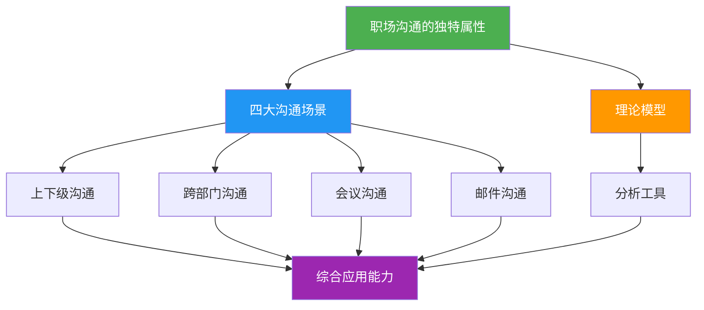
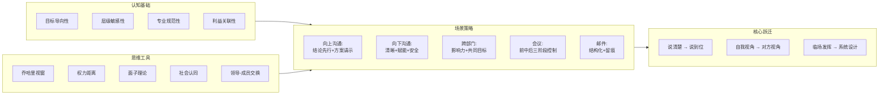

## 理论基础·小结：构建你的职场沟通认知框架

### 一、为什么需要一个系统化的认知框架

大多数人在职场沟通中犯的错误，根源不在"嘴上功夫"，而在"脑中框架"。没有框架的人遇到沟通问题，只能靠直觉反应和经验试错；有框架的人则能快速定位问题本质，选择恰当策略，预判对方反应，从而在每一次关键沟通中占据主动。

本节对"理论基础"板块的全部内容做一次系统性回顾和升华。这不是简单的重复，而是一次从"分散知识"到"整体认知"的跃迁——帮你把六个子节中零散的概念、模型和方法，编织成一张可操作的知识网络。

### 二、六大理论模块的核心要义

#### 2.1 职场沟通的独特属性——理解"游戏规则"

职场沟通不是"会说话"的升级版，而是一个嵌入组织系统中的结构化行为。它的四大独特属性决定了你在职场中的沟通策略必须有别于日常生活：

| 属性 | 核心含义 | 对沟通策略的影响 |
|------|----------|------------------|
| **目标导向性** | 每次沟通都应推动工作进展 | 沟通前必须明确"一句话目标"，沟通后必须确认成果 |
| **层级敏感性** | 权力结构决定了信息流向和表达方式 | 对上、对下、平级采用完全不同的沟通策略 |
| **专业规范性** | 口头承诺也是承诺，文字记录具有法律效力 | 措辞、格式、时效都是专业度的体现 |
| **利益关联性** | 涉及多方利益博弈 | 沟通前问自己"对方为什么要在乎"，找到利益支点 |

这四个属性是"底层操作系统"。无论你是做工作汇报、跨部门协调、主持会议还是写邮件，这四条规则始终适用。忘记任何一条，都可能导致沟通失败。

#### 2.2 上下级沟通——权力关系中的信息流动

上下级沟通的核心难点在于四个结构性矛盾：**信息不对称**（领导掌握你不知道的战略信息）、**权力不对等**（领导对你有考核权）、**期望差异**（领导要简洁高效，你可能想详细解释）、**注意力稀缺**（中层管理者日均处理74条信息）。

向上沟通的五大原则构成了一个完整的策略体系：

1. **结论先行**——金字塔原理的应用，先说结果再说过程，利用首因效应强化关键信息
2. **带着方案请示**——从"问题搬运工"转变为"解决方案提供者"，至少准备两个方案
3. **管理预期**——坏消息要早说，遵循"好消息慢报，坏消息快报"原则
4. **学会"翻译"**——把专业语言转化为商业价值，从技术思维切换到商业思维
5. **读懂潜台词**——理解领导话语背后的真实意图，注意非语言信号

向下沟通则需要解决"如何让下属愿意做、能做好、主动做"的问题，核心在于清晰度、赋能和心理安全感。

#### 2.3 跨部门沟通——横向协作的利益博弈

如果说上下级沟通是"纵向的权力之舞"，跨部门沟通就是"横向的利益博弈"。它没有明确的权力链可以依赖，没有统一的KPI牵引，甚至没有共同的日常空间培养默契。

跨部门沟通的四大结构性障碍——目标差异、信息孤岛、评价体系割裂、时区与节奏差异——不是任何人"不配合"造成的，而是组织设计的必然产物。理解这一点，才能从"对方怎么这么不配合"的抱怨模式，切换到"如何在约束条件下找到共赢点"的解决模式。

应对策略的核心逻辑是：**用影响力替代命令权**。具体路径包括建立关系账户、找到共同目标、用数据说话、借助高层背书等。社会认同理论告诉我们，人们天然偏好内群体，打破部门壁垒需要主动建设"跨部门认同"。

#### 2.4 会议沟通——最昂贵的沟通形式

会议之所以低效，根本原因不在于"开会太多"，而在于"没有认真对待"。一个10人1小时的会议，直接人力成本就是2000元，加上23分钟/人的深度工作切换成本，实际代价远超账面。

会议沟通的核心框架是"会前-会中-会后"三阶段控制：

- **会前**：70%的会议质量在开会前就已决定。议程设计、参会人筛选、背景材料分发是关键
- **会中**：角色分工（主持人、计时员、记录员、决策者）确保运转顺畅。每个议题有明确目标和时间边界
- **会后**：会议纪要只记录三样东西——决策了什么、谁负责什么、待解决什么。没有跟进的会议等于没开

选择正确的会议类型（决策会、同步会、头脑风暴会、问题分析会等）比提高会议技巧更重要。不是所有事情都需要开会——信息单向传达用邮件，异步可解决的用文档评论。

#### 2.5 邮件沟通——职场的"硬通货"

邮件之所以不可替代，在于四个核心属性：**正式性与法律效力**（法院认可的书面证据）、**可追溯性**（完整的时间戳和送达记录）、**异步性**（给双方留出思考空间）、**跨组织兼容性**（互联网的通用标识）。

邮件沟通的策略框架包括：主题行精准（一句话概括核心诉求）、正文结构化（金字塔原理）、收件人策略（To/CC/BCC的正确使用）、时机选择（发送时间和回复策略）。一个判断口诀：如果这件事将来可能需要"翻旧账"，就用邮件；如果说完就忘，用即时通讯。

#### 2.6 理论模型——思维工具箱

六个理论模型不是学术装饰品，而是帮你"看透沟通本质"的思维工具：

| 模型 | 核心功能 | 适用场景 |
|------|----------|----------|
| **乔哈里视窗** | 管理信息透明度 | 建立信任、获取反馈、发现盲区 |
| **沟通轮盘** | 分析沟通要素 | 诊断沟通失败的环节 |
| **权力距离理论** | 理解层级敏感性 | 跨文化/跨层级沟通策略设计 |
| **组织沟通网络** | 选择信息传递路径 | 正式/非正式沟通渠道选择 |
| **面子理论** | 管理社交形象 | 批评、拒绝、冲突场景 |
| **领导-成员交换理论** | 理解圈层效应 | 向上管理、团队融入 |

这些模型的价值在于：当你遇到一个沟通难题时，可以从不同模型的视角去分析，找到问题的多个维度，而不是只看到表面现象。

### 三、理论之间的内在联系

六个子节的内容不是孤立的知识点，而是一个层层递进的认知体系：

**第一层：认知层（独特属性）。** 它回答的是"职场沟通是什么"的问题。理解目标导向性、层级敏感性、专业规范性和利益关联性，就建立了正确的认知前提。

**第二层：场景层（四大沟通类型）。** 它回答的是"在哪里用"的问题。上下级、跨部门、会议、邮件是职场沟通的四大核心场景，每个场景有独特的挑战和策略。

**第三层：工具层（理论模型）。** 它回答的是"用什么思维工具分析"的问题。乔哈里视窗、权力距离、面子理论等提供了分析沟通问题的多元视角。

**第四层：应用层（综合能力）。** 当你能在正确场景中调用正确策略，并用理论模型诊断问题时，就形成了真正的职场沟通能力。

### 四、关键认知跃迁

在结束理论基础板块之前，有必要强调三个最重要的认知跃迁：

**跃迁一：从"说清楚"到"说到位"。** 多数人认为沟通的目标是"把话说清楚"。但职场沟通的真正目标是"让对方做出你期望的行为"。信息传递只是手段，推动行动才是目的。这就要求你在开口之前，不仅要想"我要说什么"，更要想"我要让对方做什么"。

**跃迁二：从"自我视角"到"对方视角"。** 沟通失败最常见的原因是"只从自己的角度出发"。你觉得自己说得很有道理，但对方没有理由在乎。切换到对方视角后，你会发现沟通的支点不在于"我有什么"，而在于"对方需要什么"。这就是利益关联性属性的核心要义。

**跃迁三：从"临场发挥"到"系统设计"。** 优秀的沟通者不是"反应快"或"口才好"，而是在开口之前就已经完成了系统化的设计——目标是什么、策略是什么、对方可能的反应是什么、备选方案是什么。这种"设计思维"才是沟通能力的核心竞争力。

### 五、从理论到实践的桥梁

理论的价值在于指导实践。以下是将本板块理论转化为行动的四步法：

**第一步：建立"沟通前检查清单"。** 每次重要沟通前，花2分钟回答以下问题：
- 这次沟通的目标是什么？（一句话能说清楚吗？）
- 对方是谁？他在意什么？（利益支点在哪里？）
- 我应该用什么渠道？（邮件、会议、即时通讯、面谈？）
- 对方可能的反应是什么？我的备选方案是什么？

**第二步：选择合适的理论模型分析。** 遇到沟通困境时，不要凭直觉判断，而是调用理论模型：
- 感觉对方不信任你？→ 用乔哈里视窗分析信息透明度
- 跨部门协作推不动？→ 用社会认同理论分析群体偏见
- 不知道该不该直接说？→ 用面子理论评估风险收益
- 领导总是不采纳你的建议？→ 用权力距离理论调整策略

**第三步：刻意练习核心场景。** 选择你最常面对的1-2个场景，按照本板块提供的策略框架反复练习：
- 每周做一次"结论先行"的工作汇报
- 每次会议前准备一份标准化议程
- 每封重要邮件发出前检查"金字塔结构"

**第四步：复盘与迭代。** 每次重要沟通后花3分钟复盘：
- 目标达成了吗？如果没有，差距在哪里？
- 对方的反应和我预判的一致吗？如果不一致，是哪个环节出了问题？
- 下次遇到类似场景，我会怎么做？

### 六、知识图谱：一张图看完整个理论体系

### 七、一句话总结

职场沟通的理论基础可以浓缩为一句话：**理解规则（四大属性）、掌握场景（四大类型）、善用工具（六个模型）、实现跃迁（三个转变）。** 当你把这四件事内化为本能反应时，你就拥有了职场沟通的"底层操作系统"——不再依赖天赋和运气，而是有章法、有策略地应对每一个沟通挑战。

在接下来的"核心技巧"板块中，我们将把这些理论框架转化为可操作的具体技巧，覆盖工作汇报、请示领导、批评下属、接受批评、团队协作、客户沟通和进阶能力七个维度。理论是地图，技巧是路线——有了地图，路线才有意义。
