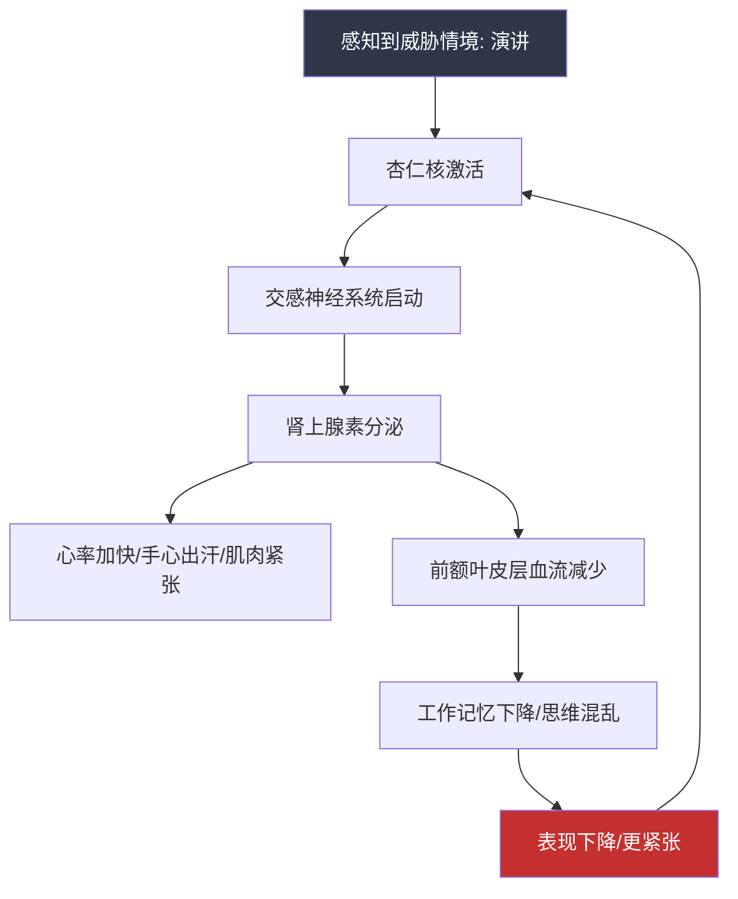

# 第六章 演讲表达

## 为什么演讲表达是沟通能力的终极考验

演讲不是"会说话"的升级版，而是一场精心设计的**单向信息博弈**。与日常对话不同，演讲者必须在没有即时反馈纠正的情况下，独自完成信息编码、情绪传递和行动号召的全部过程。这意味着演讲综合了本书前面所有章节的核心能力——倾听（理解观众需求）、逻辑表达（结构化信息传递）、非语言沟通（肢体语言与声音控制）、情感共鸣（故事与共情）——并将它们推向极致。

### 演讲能力的战略价值

从职业发展角度看，演讲能力的投资回报率极高：

| 场景 | 演讲能力的作用 | 缺乏演讲能力的代价 |
|------|--------------|------------------|
| 技术方案评审 | 清晰呈现方案价值，获得资源支持 | 好方案被埋没，项目被搁置 |
| 融资路演 | 3分钟讲清商业逻辑，赢得投资人信任 | 融资失败率提高60%以上 |
| 团队管理 | 激发团队士气，统一目标方向 | 有想法推不动，执行力打折 |
| 行业会议 | 建立个人品牌，拓展人脉资源 | 错失职业上升的关键杠杆 |
| 危机处理 | 稳定人心，掌控局面 | 信息失控，局势恶化 |

哈佛商学院的一项追踪研究显示：在同等专业能力条件下，**演讲表达能力处于前25%的职场人，其晋升速度比后25%快2.4倍**。这不是因为"会说的人占便宜"，而是因为人类大脑天然更信任能够清晰表达的信号——进化心理学将其称为"表达力即能力"的认知偏差。

### 演讲恐惧的真相

公众演讲恐惧（Glossophobia）被列为人类最常见的社交恐惧，多项调查显示约75%的人存在不同程度的公众演讲焦虑。但这种恐惧的本质并非"害怕说话"，而是**对失控的恐惧**——害怕忘词、害怕被评判、害怕冷场、害怕暴露自己的不足。

神经科学研究揭示了演讲紧张的生理机制：



好消息是：这个循环可以被打破。本章的理论基础部分会系统讲解**认知重评、渐进暴露、注意力外移**三种经过验证的干预方法，而练习方法部分会给你一套从"安全环境"到"高压场景"的渐进训练路径。

## 本章知识体系全景图

本章遵循"道法术器"的完整知识框架：从认知层面理解演讲的本质规律，到方法层面掌握设计原则，再到技能层面训练具体技巧，最后在工具层面提供可复用的模板和清单。

```mermaid
graph TB
    subgraph 道：理解演讲本质
        T1[演讲类型学] --> T2[结构设计原理]
        T2 --> T3[紧张心理机制]
        T3 --> T4[准备流程框架]
    end
    
    subgraph 法：掌握核心方法
        M1[开场设计法] --> M2[内容组织法]
        M2 --> M3[故事讲述法]
        M3 --> M4[互动设计法]
        M4 --> M5[收尾设计法]
    end
    
    subgraph 术：实战场景训练
        S1[工作汇报] --> S2[产品发布]
        S2 --> S3[婚礼致辞]
        S3 --> S4[学术报告]
        S4 --> S5[面试自我介绍]
        S5 --> S6[团队激励]
        S6 --> S7[客户提案]
        S7 --> S8[即兴演讲]
    end
    
    subgraph 器：工具与体系
        W1[误区自查清单]
        W2[每日练习计划]
        W3[演讲模板库]
        W4[自我评估框架]
    end
    
    道 --> 法 --> 术 --> 器
    
    style 道 fill:#1a365d,color:#fff
    style 法 fill:#2c5282,color:#fff
    style 术 fill:#2b6cb0,color:#fff
    style 器 fill:#3182ce,color:#fff
```

### 各节内容详解

#### 第一节：理论基础——建立演讲的认知地图

理论基础不是"废话"，它是你每次面对新演讲场景时能够**快速设计出有效方案**的底层操作系统。没有理论框架的演讲者只能凭感觉"临场发挥"，而有理论框架的演讲者可以在10分钟内完成一个结构完整的演讲方案。

本节包含四个核心模块：

**模块一：演讲的类型学**——不同类型的演讲遵循完全不同的设计逻辑。信息型演讲的核心是"认知负荷管理"（一次只传递一个新概念），说服型演讲的核心是"阻力路径设计"（预见并化解反对意见），激励型演讲的核心是"情绪节奏控制"（制造张力再释放），娱乐型演讲的核心是"预期违背"（打破认知惯性制造惊喜）。你必须先判断自己面对的是哪种类型，才能选择正确的策略。

**模块二：演讲的结构设计**——结构是演讲的骨架。本节不只介绍常见的结构模式（总分总、问题-解决、时间线、PREP等），更重要的是教你**如何根据演讲目标和观众特征选择最优结构**。比如，面对持怀疑态度的管理层，"问题-解决方案-收益"结构远比"总分总"更有效；面对需要技术细节的工程师团队，"原理-实现-验证"结构比时间线结构更能建立信任。

**模块三：演讲紧张心理**——本节将紧张分为三个层次：生理性紧张（心跳加速、手抖）、认知性紧张（思维混乱、忘词）和行为性紧张（语速过快、回避眼神），并针对每一层提供具体干预手段。你不需要"克服"紧张——适度紧张反而能提升表现——你需要的是**将紧张控制在"最佳唤醒区间"**。

**模块四：演讲准备流程**——从接到演讲邀请到走上讲台的完整准备清单，包括：观众画像分析（他们是谁？知道什么？想要什么？）、演讲目标定义（你想让观众听完后做什么？）、内容筛选矩阵（什么该讲什么不该讲）、时间分配方案、设备检查清单、应急预案设计。

#### 第二节：核心技巧——掌握五个关键时刻

一场演讲中，观众的注意力并非均匀分布。心理学中的**"首因效应"和"近因效应"**决定了开场和收尾是两个注意力峰值，而中间部分则需要主动设计"注意力锚点"来防止走神。本节的五个技巧恰好对应了这五个关键时刻：

| 关键时刻 | 核心目标 | 关键技巧 |
|---------|---------|---------|
| 开场（前60秒） | 建立信任、制造期待 | 冲击性事实、悬念提问、故事切入、类比破冰 |
| 内容组织 | 让观众跟上你的逻辑 | 三的法则、递进结构、信号词、视觉锚点 |
| 故事讲述 | 将抽象概念变得可感知 | 英雄之旅、冲突-转折-启示、感官细节、对话还原 |
| 互动设计 | 让观众从被动听众变成参与者 | 提问设计、举手投票、小组讨论、实时演示 |
| 收尾（最后60秒） | 强化记忆、驱动行动 | 首尾呼应、行动号召、金句收束、开放性问题 |

每个技巧都不是孤立的——开场决定了观众是否愿意听下去，内容组织决定了观众能否跟上你的逻辑，故事决定了观众是否被打动，互动决定了观众是否参与其中，收尾决定了观众离开时带走什么。它们环环相扣，共同构成一个完整的演讲体验设计。

#### 第三节：实战案例——八个高频场景的完整拆解

理论和技巧的价值最终要在真实场景中兑现。本节选取了**8个覆盖90%职场和生活场景的演讲类型**，每个场景都包含：

- **场景画像**：典型的观众是谁？他们的核心诉求是什么？时间约束是什么？
- **结构模板**：可以直接套用的演讲框架
- **语言范例**：经过优化的表达方式（对比"普通版"和"优化版"）
- **常见翻车点**：这个场景最容易犯的错误
- **应对策略**：遇到突发情况怎么办

#### 第四节：常见误区——用别人的教训加速自己的成长

本节系统梳理了**10个最常见的演讲误区**，每一个误区都遵循"现象描述→原因分析→正确做法→对比案例"的结构。比如：

- **误区：PPT内容越多越专业**——真相是PPT是演讲的辅助工具，不是提词器。乔布斯的iPhone发布会PPT平均每页只有3.4个词。
- **误区：背稿=准备充分**——真相是逐字背诵会让你的演讲听起来像机器人，而且一旦忘词就会全线崩溃。正确的方法是记住"结构骨架+关键句子"，其余内容用关键词引导。
- **误区：语速快=效率高**——真相是语速超过每分钟180字时，观众的理解率会急剧下降。重要的信息需要停顿来"留白"。

#### 第五节：练习方法——从今天开始的可执行计划

知道和做到之间隔着一条巨大的鸿沟，这条鸿沟只能靠**刻意练习**来填平。本节提供：

- **每日15分钟微练习**：声音热身、即兴表达、镜前演练
- **每周1次完整演练**：选择一个场景，完成从准备到演讲的完整流程
- **月度复盘框架**：录音回听、观众反馈分析、进步追踪
- **进阶挑战清单**：从录制视频回看到参加Toastmasters，从线上演讲到线下千人会场

## 知识点覆盖度自检

本章覆盖的演讲表达知识域：

| 知识维度 | 核心知识点 | 本章覆盖 |
|---------|-----------|---------|
| 演讲类型 | 信息型/说服型/激励型/娱乐型/学术型/即兴型 | ✅ |
| 结构设计 | 总分总/问题-解决/时间线/PREP/SCQA/叙事弧 | ✅ |
| 心理机制 | 杏仁核劫持/最佳唤醒理论/自我效能感/注意力衰减 | ✅ |
| 准备流程 | 观众分析/目标设定/内容筛选/时间管理/排练方法 | ✅ |
| 开场设计 | 注意力捕获/信任建立/期待制造/破冰策略 | ✅ |
| 内容组织 | 逻辑递进/认知负荷管理/信号词/过渡技巧 | ✅ |
| 故事讲述 | 故事结构/冲突设计/感官细节/情感共鸣 | ✅ |
| 互动设计 | 提问技巧/参与式活动/能量管理/冷场应对 | ✅ |
| 收尾设计 | 记忆锚点/行动号召/首尾呼应/留白艺术 | ✅ |
| 声音运用 | 语速/语调/停顿/音量/节奏/咬字 | ✅ |
| 肢体语言 | 站姿/手势/眼神/移动/面部表情/空间使用 | ✅ |
| PPT设计 | 视觉原则/信息密度/动画节奏/配色方案 | ✅ |
| 实战场景 | 工作汇报/产品发布/婚礼/学术/面试/激励/提案/即兴 | ✅ |
| 误区纠正 | 10个高频误区的诊断与修正 | ✅ |
| 练习体系 | 每日/每周/每月计划，从入门到进阶的阶梯 | ✅ |
| 深度拓展 | 演讲史/神经科学/文化差异/数字时代新挑战 | ✅ |

## 学习路径建议

不同基础的读者可以选择不同的学习路径：

### 零基础路径（预计8-10小时）

从未做过正式演讲，或每次演讲都极度紧张。

理论基础（精读）→ 核心技巧（精读+笔记）→ 常见误区（自查）→
练习方法（制定计划）→ 实战案例：工作汇报/面试自我介绍（重点练习）
→ 本章小结

### 有经验路径（预计5-6小时）

做过多次演讲，但效果不稳定，想找系统方法提升。

理论基础（速读，重点看结构设计和紧张心理）→ 核心技巧（对照自查）→
实战案例（选择自己最常用的2-3个场景精读）→ 常见误区（排除盲区）→
练习方法（制定进阶计划）→ 深度拓展（选读）→ 本章小结

### 高手路径（预计3-4小时）

已有丰富演讲经验，追求精进和体系化。

理论基础（快速过一遍，补充知识体系中的空白）→ 常见误区（查漏补缺）→
深度拓展（精读）→ 实战案例：即兴演讲/产品发布（挑战高难度场景）→
练习方法（设计自己的持续提升方案）→ 本章小结

## 与其他章节的关联

演讲表达不是一个孤立的技能，它与本书其他章节形成紧密的知识网络：

- **第四章 倾听**：好的演讲者首先是好的倾听者。只有深度理解观众的需求、疑虑和期望，才能设计出真正打动人心的内容。
- **第五章 表达基础**：清晰的逻辑表达、精准的用词、恰当的节奏——这些基础能力是演讲表达的地基。
- **第三章 非语言沟通**：演讲中55%的信息通过肢体语言传递，38%通过声音特质传递，只有7%通过语言内容传递（梅拉宾法则）。非语言沟通章节的知识在演讲场景中被成倍放大。
- **第八章 谈判**：说服型演讲本质上是一场"一对多的谈判"，谈判中的利益分析、异议处理、让步策略在演讲中同样适用。

---

> **关键词**：演讲表达、公众演讲、演讲结构、演讲技巧、演讲恐惧、故事讲述、互动技巧、即兴演讲、演讲准备、刻意练习
>
> **本章总字数**：约30,000字
>
> **建议学习时间**：5-10小时（因基础而异，含练习时间）
>
> **前置知识**：建议先学习前面章节中关于倾听、表达基础、非语言沟通的相关内容。如果时间紧张，至少完成第五章（表达基础）的学习后再进入本章。
