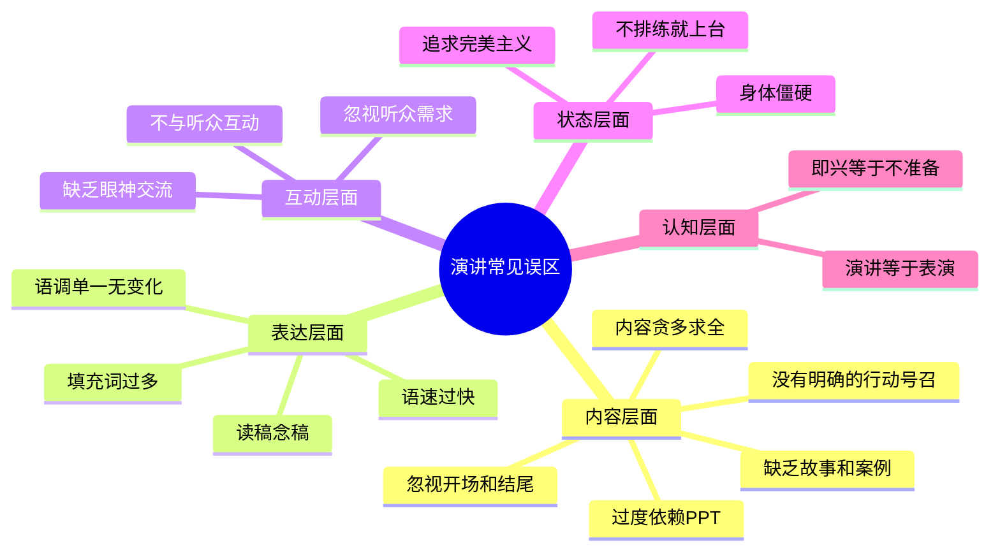
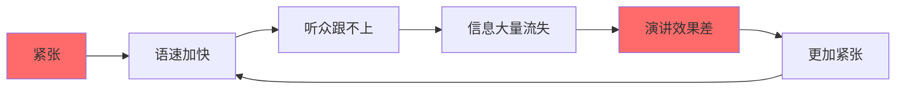
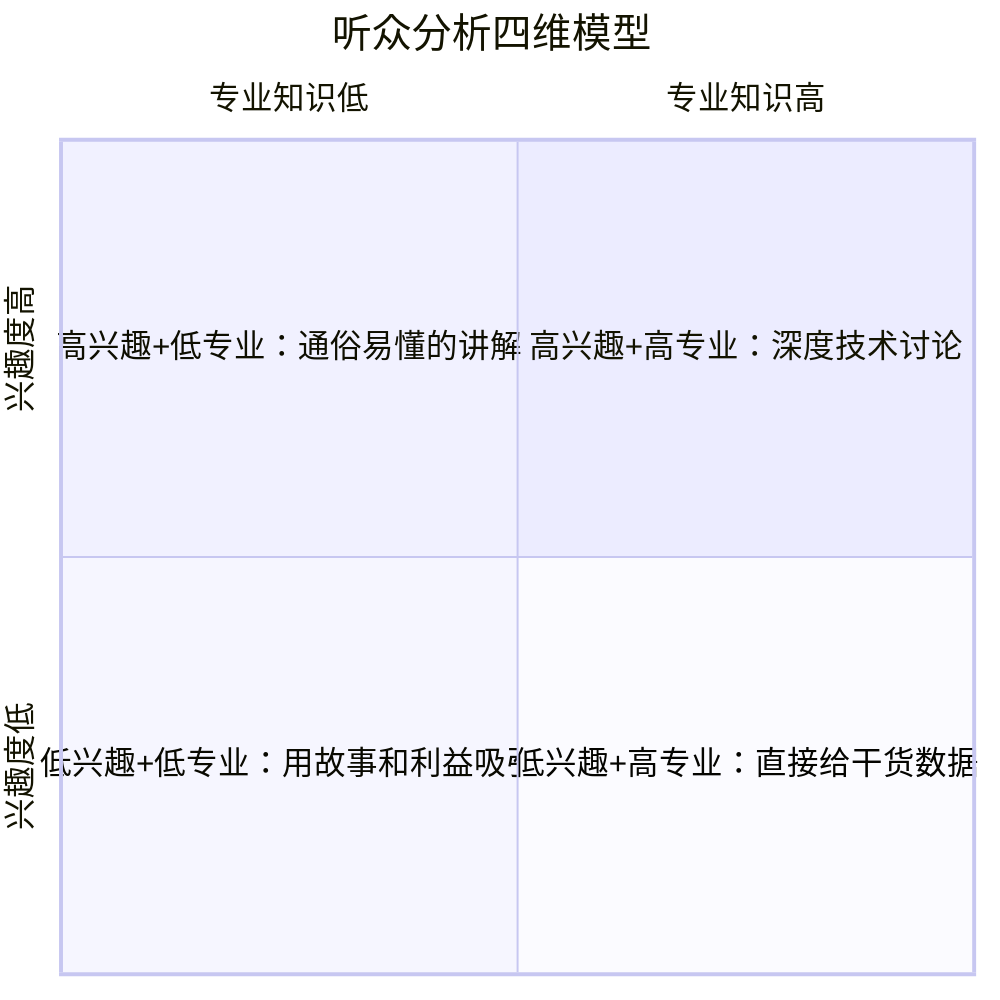
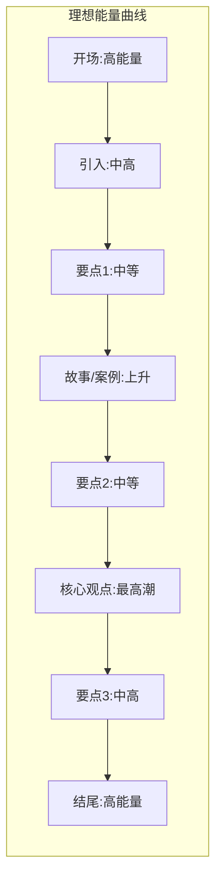

# 第六章 演讲表达 —— 常见误区

## 引言

演讲能力的提升有两条路径：一是学习正确的方法，二是识别并纠正错误的习惯。后者往往见效更快——因为你不需要学习新技能，只需要停止做错误的事。

本章系统梳理了演讲中最常见的十五个误区。每个误区不仅解释"为什么错"，还提供具体的纠正方案和练习方法。这些误区有的来自错误的认知，有的来自不良的习惯，有的来自对他人演讲的不当模仿。识别并纠正这些误区，是提升演讲水平最快的捷径。



---

## 误区一：过度依赖PPT

### 典型表现

- PPT上密密麻麻全是文字，演讲者在台上逐页朗读
- 没有PPT就不知道怎么开口，完全依赖幻灯片提示
- 花大量时间制作精美的动画和模板，却忽略了演讲内容本身
- PPT成为主角，演讲者沦为"人肉翻页器"
- 一页PPT塞了200字，字号小到后排根本看不清

### 心理学原理

认知负荷理论（Cognitive Load Theory）解释了为什么读PPT是灾难性的。人的工作记忆一次只能处理4±1个信息组块。当PPT上出现大段文字时，听众的视觉通道被文字占据，听觉通道被迫关闭——这叫"通道冲突效应"（Modality Effect）。Richard Mayer的多媒体学习研究证实：当视觉呈现文字、听觉也呈现相同文字时，学习效果反而比只用听觉更差，因为听众在"读"和"听"之间来回切换，两个都做不好。

更深层的问题是控制权的转移。当PPT成为信息主体时，听众的注意力从你身上转移到了屏幕上。你变成了屏幕的"配音员"，而不是舞台的主角。一旦听众发现"我自己看PPT就行了"，他们就会开始玩手机。

### 正确做法

**PPT设计原则：**

- **一页一要点**：每张幻灯片只传达一个核心信息，用一个关键词或一张图表达
- **6×6法则**：每页不超过6行文字，每行不超过6个词
- **图片优先**：能用图片表达的绝不用文字，能用图表的绝不用列表
- **字体够大**：标题至少44号，正文至少28号，确保最后排也能看清
- **留白**：页面至少保留40%的空白区域，给视觉以呼吸空间

**演讲者与PPT的关系：**

- **你是主角，PPT是配角**：如果去掉PPT你讲不了，说明你还没有真正掌握内容
- **PPT是给听众看的，不是给你看的**：提示内容放在"演讲者备注"里，不要放在幻灯片上
- **准备一个无PPT版本**：万一设备故障、投影仪坏了、电脑死机，你依然能完整地演讲
- **先写演讲稿，再做PPT**：顺序不要搞反——先想清楚要说什么，再用PPT辅助视觉呈现

**高级技巧：**

- **黑屏技巧**：讲到关键故事或重要观点时，按"B"键让屏幕变黑，把所有注意力拉回你身上
- **空白页策略**：在PPT中插入纯黑或纯白幻灯片，专门用于不需要视觉辅助的段落
- **后置PPT**：先不放标题页，直接用一个问题或故事开场，PPT在第30秒之后才出现

### 自测标准

问自己一个问题：如果你的PPT突然打不开，你能用白板或口头方式完成80%的演讲内容吗？如果答案是否，你对PPT的依赖程度已经过高了。

---

## 误区二：语速过快

### 典型表现

- 因为紧张导致语速飙升，自己完全意识不到
- 试图在有限时间内塞入更多内容，用速度换时间
- 没有任何停顿，一口气讲到底，中间不换气
- 听众跟不上节奏，关键信息大量流失
- 讲完之后自己气喘吁吁，听众一脸茫然

### 为什么语速过快是致命的

语速过快的根源是紧张。当人处于压力状态时，交感神经系统被激活，呼吸变浅变快，语速随之加快。这是进化遗留的"战或逃"反应——在原始环境中，快速说话意味着"有危险，快行动"。但在演讲场景中，它传递的信号是"我不自信，我想赶紧结束"。

从信息处理角度看，正常语速是每分钟150-180个汉字。当语速超过每分钟220字时，听众的理解率会急剧下降。更关键的是，听众需要"认知加工时间"来理解你的话——没有停顿的连续输出，就像往已经满了的杯子里继续倒水，多出来的全部溢出。



### 语速控制的三层方法

**第一层：意识层——知道自己快了**

- **录音回放**：这是最有效的自我诊断工具。用手机录下自己的练习，回放时你会发现语速比想象中快50%以上
- **计时对比**：准备一段300字的文稿，正常朗读应该在1分30秒左右。如果你用了不到1分钟，说明语速过快
- **找一个听众反馈者**：让朋友在你练习时举手示意"太快了"

**第二层：技巧层——有意识地控制**

- **停顿标记法**：在演讲稿上用"/"标注短停顿（1秒），用"//"标注长停顿（2-3秒）。每个要点前后都要有停顿
- **句号呼吸法**：每到句号就深吸一口气。呼吸自然会拖慢语速
- **关键词强调法**：在重要词汇前故意停顿0.5秒，然后用稍慢的语速说出关键词
- **段落分隔法**：每讲完一个段落，停下来扫视一下听众，再开始下一段

**第三层：心态层——从根源解决**

- **接受"慢"**：在演讲中，慢=自信=权威。想想国家领导人、CEO的公开讲话，语速都偏慢
- **重新定义时间压力**：宁可少讲一个要点，也不要把三个要点都讲得飞快。少即是多
- **提前消除时间焦虑**：如果担心超时，就提前删减内容，而不是加快语速

### 停顿的艺术

停顿是演讲中最被低估的武器。丘吉尔是公认的演讲大师，他的演讲中停顿比例远高于普通演讲者。奥巴马的演讲平均每句话后有0.8秒的停顿，这让他的话语充满力量。

**停顿的五种用法：**

| 停顿类型 | 时长 | 使用场景 | 效果 |
|---------|------|---------|------|
| 强调停顿 | 2-3秒 | 关键信息说出之后 | 让信息"落地"，给听众消化时间 |
| 悬念停顿 | 3-5秒 | 提出问题之后、揭晓答案之前 | 制造期待感，抓住注意力 |
| 转折停顿 | 1-2秒 | "但是""然而"之前 | 提示听众"重点来了" |
| 情感停顿 | 2-4秒 | 讲完一个感人故事后 | 让情感自然发酵 |
| 互动停顿 | 1-3秒 | 提问之后 | 给听众回应的时间 |

**丘吉尔的经典案例**：1940年他发表"我们将在海滩上战斗"的演讲时，在"我们永不投降"这句话之前，停顿了整整5秒。全场屏息凝神，然后爆发出雷鸣般的掌声。如果他一口气读完这段话，效果会大打折扣。

---

## 误区三：忽视听众需求

### 典型表现

- 只关注"我要讲什么"，不关注"听众需要什么"
- 使用听众不理解的专业术语和行业黑话
- 讲的内容与听众的实际场景完全脱节
- 不关注听众的反应，自顾自地讲完整场
- 用同一套内容面对所有听众，不做任何调整

### 为什么这是根本性错误

演讲的本质是"服务听众"，而不是"展示自己"。这个认知错误是所有其他误区的根源。很多演讲者把准备时间的90%花在"我要讲什么"上，只有10%花在"听众是谁"上。这个比例应该反过来。

从传播学角度看，有效的沟通需要满足"信息-接收者匹配"原则。同样的内容，对不同背景的听众需要完全不同的包装方式。对工程师讲商业模式的底层逻辑，对投资人讲代码实现的技术细节——都是在浪费所有人的时间。

### 听众分析的四维模型

在准备演讲之前，从四个维度分析你的听众：



**维度一：知识水平**

- 他们对这个话题了解多少？
- 需要解释基础概念还是直接进入深度讨论？
- 有哪些术语需要提前定义？

**维度二：核心需求**

- 他们来听这个演讲的目的是什么？
- 他们面临什么问题需要解决？
- 他们希望带走什么？

**维度三：决策角色**

- 他们是最终决策者还是执行者？
- 他们关心战略层面还是操作层面？
- 他们需要说服谁？

**维度四：场景约束**

- 这是正式场合还是非正式场合？
- 时间有多少？他们的注意力耐受度如何？
- 之前有没有人讲过类似的内容？

### 以听众为中心的演讲设计

**准备阶段：**

- **做一个简单的问卷**：如果可能，在演讲前收集听众的3-5个最关心的问题
- **了解听众的"痛点词汇"**：用他们日常使用的语言，而不是你的专业术语
- **预判"这和我有什么关系"**：为每个要点准备一个"对听众的价值说明"

**演讲过程中：**

- **多用"你"和"我们"**，少用"我"：让听众感到被关注而非被说教
- **每隔3-5分钟做一次"价值锚定"**："这个对你们来说意味着……""在你们的场景中，可以这样用……"
- **关注听众的非语言信号**：如果他们开始看手机、交头接耳、眼神涣散，说明你需要立即调整策略
- **实时回应**："我注意到有人在点头/皱眉，让我解释得更清楚一些"

**调整策略的应急方案：**

| 信号 | 可能原因 | 应对策略 |
|------|---------|---------|
| 多人看手机 | 内容无吸引力或太简单 | 立即插入一个互动问题或惊人数据 |
| 交头接耳 | 在讨论你的内容（好事）或在聊天（坏事） | 暂停，邀请他们分享讨论内容 |
| 眉头紧锁 | 没听懂 | 用一个类比重新解释 |
| 身体后仰 | 不认同或感到无聊 | 直接问"有人有不同看法吗？" |
| 频繁点头 | 认同，继续当前节奏 | 加快节奏，进入下一个要点 |

---

## 误区四：缺乏眼神交流

### 典型表现

- 全程盯着PPT、笔记本电脑或提词器
- 看天花板、地板或后墙，就是不看人
- 只看某一个人或某个方向（通常是朋友或领导所在的位置）
- 用快速的"扫视"代替真正的"注视"——眼睛在移动但没有聚焦
- 戴着有色眼镜或低头看稿，刻意回避眼神接触

### 神经科学依据

眼神交流不是"礼仪"问题，而是大脑层面的信息传递机制。牛津大学的研究发现，当演讲者与听众有直接的眼神接触时，听众大脑中的"社会认知网络"（包括颞顶联合区和内侧前额叶皮层）会被显著激活。这意味着眼神接触能让听众更深入地处理你说的内容。

更直接的证据是"眼神接触效应"：当两个人对视时，双方大脑中的镜像神经元系统会被同步激活，产生"神经耦合"效应。翻译成白话就是——眼神交流能让听众的大脑和你的大脑"同步"，你说什么他们更容易理解、更容易记住、更容易被说服。

反面数据同样说明问题：研究显示，缺乏眼神交流的演讲者被听众评价为"不自信""不真诚""不专业"的概率比有充分眼神交流的演讲者高3倍。

### 眼神交流的系统方法

**基础技巧：三角注视法**

将听众席分为左、中、右三个区域。在每个区域中选一个具体的人，注视3-5秒，然后自然地转向下一个区域的下一个人。形成一个缓慢的"Z"字形或三角形移动路径。

**进阶技巧：分层注视法**

在大场地中，不仅要注意左右分区，还要注意前后分区：
- **前排**：最容易建立连接，但也最容易给前排造成压力
- **中排**：最佳注视区域，兼顾前后
- **后排**：容易被忽视，但后排听众特别感激被"看到"

**高级技巧：情绪呼应法**

- 讲到令人兴奋的内容时，注视那些看起来最有活力的听众，形成正反馈
- 讲到需要思考的内容时，注视那些看起来在认真思考的听众
- 讲到需要支持的内容时，注视那些一直在点头的听众

**不同场景的眼神策略：**

| 场景 | 策略 | 要点 |
|------|------|------|
| 小型会议（10人以下） | 每个人都要照顾到 | 在每个人脸上停留3-5秒 |
| 中型演讲（50-200人） | 三角分区注视 | 每个区域选1-2个"锚点人物" |
| 大型演讲（500人以上） | 扫视+定点结合 | 大部分时间扫视全场，关键信息时定点注视 |
| 线上演讲 | 看摄像头而非屏幕 | 看摄像头=看听众的眼睛 |
| 有提词器 | 自然切换 | 提词器在摄像头附近，看提词时保持"看镜头"的感觉 |

**常见错误纠正：**

- ❌ 快速扫视全场——像雷达一样扫来扫去，没有真正的连接。✅ 缓慢移动，在每个人脸上"停留"几秒
- ❌ 只看"友善的面孔"——你只看对你点头的人，忽略了其他人。✅ 特意照顾那些看起来不太投入的听众
- ❌ 盯着稿子念——完全放弃眼神交流。✅ 只看一眼稿子就抬头，用记忆而不是阅读来推进

---

## 误区五：使用过多填充词

### 典型表现

- 频繁使用"嗯"、"啊"、"那个"、"就是说"、"然后"、"对吧"、"你知道"、"基本上"
- 每句话之间甚至每半句话都有填充词
- 填充词严重影响语言的流畅度和专业感
- 自己完全意识不到，直到听录音才发现

### 填充词的认知机制

填充词的产生有两个主要原因：

**原因一：思维速度跟不上嘴巴。** 你的嘴巴在说当前这句话时，大脑已经在组织下一句话了。当下一句话还没准备好，嘴巴就会发出一个"占位音"——这就是填充词。这说明你的语速超过了你的思维处理速度。

**原因二：对"沉默"的恐惧。** 很多人觉得说话时出现沉默是"尴尬"的，所以用填充词来填补空白。但在演讲中，沉默不是尴尬，而是力量。

### 填充词的量化标准

| 频率（次/分钟） | 等级 | 影响 |
|----------------|------|------|
| 0-2次 | 优秀 | 不影响演讲效果，听起来自然 |
| 3-5次 | 合格 | 轻微影响，但大部分听众不会在意 |
| 6-10次 | 需改进 | 开始影响专业感和信息传递 |
| 10次以上 | 严重 | 听众注意力会转移到填充词上，内容被忽略 |

### 系统性消除填充词的四步法

**第一步：觉知——知道自己用了多少**

用手机录下自己5分钟的演讲练习，逐字记录所有填充词。大多数人第一次听录音时会震惊——"我真的说了这么多'嗯'吗？"觉知是改变的第一步。

**第二步：替代——用停顿取代填充词**

当你想说"嗯"的时候，改为沉默1秒。刚开始会觉得很奇怪，好像"卡壳"了，但对听众来说，这1秒的沉默听起来比"嗯"舒服得多。记住：听众感知到的沉默长度，只有你自己感知到的一半。

**第三步：降速——从根本上解决问题**

放慢语速是减少填充词最有效的方法。当你的语速适中时，大脑有足够的时间组织下一句话，就不需要用填充词来"争取时间"了。

**第四步：深练——对高频场景做专项训练**

填充词不是均匀分布的。你可能在开头、转折、举例等特定位置更容易出现填充词。找到你的"高频填充词位置"，对这些段落做反复练习，直到流畅为止。

**重要提醒**：不要追求完全零填充词。研究表明，每分钟1-2个填充词反而会让演讲听起来更自然、更亲切。关键不是消除所有填充词，而是消除那些"无意识的、高频的、影响理解的"填充词。

---

## 误区六：身体僵硬不动

### 典型表现

- 站在原地一动不动，像一根柱子
- 双手紧紧抓住讲台边缘、交叉在胸前或插在口袋里
- 身体重心不稳定，左右摇晃或前后晃动
- 面无表情，从头到尾一个表情
- 整个身体语言传递"我很害怕，我想离开这里"的信号

### 肢体语言的科学基础

Albert Mehrabian的研究（虽然常被误读）揭示了一个重要事实：在情感和态度的传递中，肢体语言占55%，语调占38%，而文字内容只占7%。虽然这个比例在不同类型的沟通中有变化，但核心结论不变——你的身体在"说话"，而且说得比你的嘴巴多。

从进化角度看，人类在语言出现之前的数百万年里，完全依靠肢体语言进行沟通。我们的大脑至今仍保留着对肢体信号的高度敏感性。当一个演讲者身体僵硬时，听众的镜像神经元会"复现"这种紧张状态，导致听众自己也感到不舒服。

### 解决身体僵硬的系统方案

**第一层：基础站姿**

- **双脚与肩同宽**：稳定的根基是自然移动的前提
- **重心均匀分布**：不要偏向任何一侧
- **膝盖微弯**：不要锁死膝盖，保持弹性
- **肩膀放松下沉**：紧张时肩膀会不自觉上耸
- **双手自然下垂或放在身前**：不要插口袋、不要抱胸、不要抓讲台

**第二层：有意义的移动**

身体移动必须与内容配合，否则就是"乱动"。移动的每一步都应该有目的：

- **话题切换时移动**：从一个要点讲到另一个要点时，从舞台一侧走到另一侧
- **讲述时间线时移动**：讲过去时站在左边，讲现在时站在中间，讲未来时走到右边
- **强调重点时靠近听众**：向前走一步，进入听众的"亲密距离"
- **提问时后退一步**：给听众思考的空间

**第三层：手势的运用**

手势是上半身最重要的表达工具。好的手势遵循三个原则：

1. **手势在"黄金三角区"**：腰部到肩部之间、身体两侧一臂距离内
2. **手势与内容匹配**：说"增长"时手势向上，说"范围"时手势向两侧展开
3. **手势有"收"有"放"**：不是一直在比划，而是在关键词时展开，说完就收回

**手势的实用模板：**

| 表达意图 | 手势 | 说明 |
|---------|------|------|
| 列举要点 | 伸出手指（一、二、三） | 帮助听众跟上你的逻辑 |
| 大小/程度 | 双手比划大小 | 让抽象概念具象化 |
| 对比 | 双手分别代表两侧 | "一方面……另一方面" |
| 强调 | 握拳或手掌向下按 | 传递力量感和确定性 |
| 包容/邀请 | 双手向外展开 | "我们一起来看" |
| 拒绝/否定 | 手掌向外推出 | "这不可接受" |

**第四层：面部表情**

面部表情是肢体语言中最容易被忽视也最容易改善的部分：

- **微笑**：开场时微笑是最简单的破冰方式，不需要刻意大笑，嘴角微微上扬即可
- **表情与内容同步**：讲到严肃话题时表情凝重，讲到轻松话题时表情放松
- **眉毛**：微微扬眉表示"你猜怎么着？"，皱眉表示"这很严重"
- **避免面瘫**：如果你的面部表情5分钟没有变化，听众会觉得你在念稿

---

## 误区七：内容贪多求全

### 典型表现

- 试图在15分钟内讲完所有相关内容
- PPT有50页，每页都塞满信息
- 从A讲到Z，面面俱到，没有重点
- 演讲结束后，听众完全不知道核心观点是什么
- "这个也重要，那个也不能少"——什么都想要，什么都说不清

### 认知科学解释

"少即是多"在演讲中不仅是一句口号，更是有科学依据的结论。认知心理学中的"米勒定律"（Miller's Law）指出，人的短期记忆容量为7±2个信息组块。在演讲场景中，由于听众同时在处理视觉、听觉、情感等多通道信息，实际能记住的内容更少——通常只有3-5个要点。

更关键的是"序列位置效应"（Serial Position Effect）：人们对序列开头和结尾的信息记忆最深，中间的信息最容易遗忘。如果你有10个要点，听众最可能记住的只有第1、第2个和最后1个。

### 做减法的决策框架

```mermaid
flowchart TD
    A[列出所有想讲的内容] --> B{这个要点对核心信息有直接支撑吗?}
    B -->|没有| C[删除]
    B -->|有| D{听众能在一个要点中记住这个吗?}
    D -->|不能| E[合并到其他要点中]
    D -->|能| F{时间允许完整展开吗?]
    F -->|不允许| G[放到"补充材料"中]
    F -->|允许| H[保留]
```

**"电梯测试"法**：假设你只有30秒（电梯从1楼到10楼的时间）来表达你的核心观点，你会说什么？这就是你的核心信息。其他所有内容都应该为这个核心信息服务。

**"三层蛋糕"结构**：

- **第一层（必讲）**：1个核心信息 + 3个支撑要点——即使时间被砍半，这些内容也必须保留
- **第二层（应讲）**：每个要点的案例和数据——完整版演讲时需要
- **第三层（可讲）**：补充信息、延伸阅读——只在时间充裕或Q&A环节使用

**帕斯卡的智慧**："我没有时间写一封短信，所以写了一封长信。"精简比堆砌更难，也更有效。一个20分钟的精彩演讲，比一个60分钟的平庸演讲更能打动人心。

### 时间分配的经验法则

| 演讲总时长 | 开场 | 主体要点数 | 每个要点时长 | 结尾 |
|-----------|------|-----------|-------------|------|
| 5分钟 | 30秒 | 1-2个 | 1.5-2分钟 | 30秒 |
| 15分钟 | 1-2分钟 | 3个 | 3-4分钟 | 1-2分钟 |
| 30分钟 | 2-3分钟 | 3-4个 | 5-7分钟 | 2-3分钟 |
| 60分钟 | 3-5分钟 | 4-5个 | 8-10分钟 | 3-5分钟 |

---

## 误区八：忽视开场和结尾

### 典型表现

- 开场平淡无奇："大家好，我是XXX，今天我来讲一下……"
- 结尾草率："时间差不多了，我就讲到这里，谢谢大家"
- 没有为开场和结尾做专门的设计和排练
- 把所有精力放在中间内容上，首尾只是"走过场"
- 开场直接进入技术细节，没有任何铺垫

### 首因效应与近因效应

心理学中的"首因效应"（Primacy Effect）和"近因效应"（Recency Effect）共同决定了听众对演讲的记忆结构。首因效应是指人们对最先接收到的信息印象最深；近因效应是指人们对最后接收到的信息记忆最牢。

这意味着开场和结尾是整场演讲中"含金量"最高的部分。数据显示，演讲的开场和结尾通常只占总时间的10-15%，但对听众记忆的影响超过50%。一个平淡的开场意味着你从一开始就失去了听众的注意力，而一个草率的结尾意味着你前面所有的努力都在最后打了折扣。

### 开场设计：前30秒定生死

听众给你"证明这场演讲值得听"的时间窗口只有30秒。如果前30秒你没有抓住他们的注意力，后面再精彩也很难完全挽回。

**七种高效开场方式：**

1. **惊人数据**："每年有300万吨塑料流入海洋——相当于每分钟倒一辆垃圾车的塑料进去"
2. **悬念问题**："如果我告诉你，你每天做的一个习惯正在悄悄毁掉你的职业生涯，你信吗？"
3. **个人故事**："三年前的一个深夜，我站在公司天台上，手机里是一封辞职信的草稿……"
4. **反常识观点**："大多数人都认为勤奋是成功的关键——但我今天要告诉你，勤奋可能正在害你"
5. **现场互动**："在座有多少人今天早上花了超过30分钟在手机上？请举手。"
6. **引用名言**：选择与主题相关且有冲击力的名言
7. **视觉冲击**：展示一张震撼的图片或一段短视频，无需任何语言

### 结尾设计：最后30秒决定行动

结尾的目的是让听众"带走"一个清晰的信息，并知道下一步该做什么。

**六种有力的收尾方式：**

1. **行动号召**：明确告诉听众听完之后应该做什么——"从今天开始，每天花10分钟练习……"
2. **首尾呼应**：回到开场的故事或问题，形成闭环——"还记得我提到的那个在天台上的夜晚吗？后来……"
3. **有力金句**：用一句精炼的话概括整场演讲的核心——"记住：不是因为完美才开始，而是因为开始了才完美"
4. **未来愿景**：描绘一个令人向往的画面——"想象一下，三年后的你……"
5. **挑战听众**：给听众一个具体的挑战——"我挑战你们，在72小时内完成……"
6. **开放问题**：留下一个值得深思的问题——"如果今天是你最后一次演讲，你会说什么？"

**绝对不要这样结尾：**

- ❌ "时间不够了，后面的内容我就不讲了"
- ❌ "我也不知道该说什么了，就这样吧"
- ❌ "有什么问题吗？"（然后沉默30秒，没人提问，尴尬收场）
- ❌ 忽然说"谢谢大家"然后快速走下台

---

## 误区九：不排练就上台

### 典型表现

- "我没时间排练，到时候临场发挥吧"
- 只在脑子里"想"了一遍，没有真正开口说
- 第一次完整地讲出来是在正式场合
- 排练时只是默读PPT，没有模拟真实场景
- 觉得排练会让自己"不自然"，所以选择不排练

### "临场发挥"是最大的谎言

"临场发挥"是演讲中最大的自欺欺人。你以为的"即兴"，在高手那里是"准备充分后的自然流露"。TED演讲者平均排练次数超过10次，有些甚至排练50次以上。马丁·路德·金的"我有一个梦想"不是即兴发挥——他已经在不同场合讲过类似的内容数十次。乔布斯的每一场苹果发布会，都经过至少两周的全彩排。

不排练就上台的直接后果是：语无伦次、超时、遗漏关键内容、技术故障时手足无措、紧张程度倍增。更重要的是，不排练意味着你无法发现内容本身的逻辑问题——有些段落写在纸上看起来没问题，但说出来才发现不通顺。

### 科学排练的五轮法

**第一轮：内容确认（独自进行）**

- 出声朗读完整内容，不做任何修改
- 目的：发现"写得出来但说不出来"的句子，标记不通顺的地方
- 时长：按正常语速计算总时长

**第二轮：结构调整（独自进行）**

- 根据第一轮发现的问题调整内容
- 精简冗余部分，补充不足的部分
- 重新安排段落顺序，确保逻辑流畅

**第三轮：节奏打磨（独自进行）**

- 重点关注语速、停顿、强调
- 在关键位置加入停顿标记
- 练习过渡语和转折语

**第四轮：模拟演练（有人观看）**

- 找2-3个朋友或同事做听众
- 完整地讲一遍，包括PPT操作
- 请求具体反馈：哪里听不懂？哪里觉得无聊？哪里最打动人？

**第五轮：压力测试（模拟真实场景）**

- 在实际演讲场地排练（如果可能）
- 穿正式演讲时要穿的衣服
- 测试所有技术设备（投影、话筒、翻页器）
- 练习"意外应对"：忘词怎么办？PPT打不开怎么办？有人提问刁钻问题怎么办？

### 排练的常见误区

| 误区 | 为什么是误区 | 正确做法 |
|------|-------------|---------|
| 只默读不出声 | 默读和出声说是两种完全不同的体验 | 必须出声，最好站着 |
| 排练时不计时 | 不知道实际时长，容易超时 | 每次排练都计时 |
| 只排练一次 | 一次排练只能发现内容问题，不能打磨表达 | 至少三次，最好是五次 |
| 排练时追求完美 | 每次都想"完美地讲完"，反而浪费时间 | 排练中犯错是好事，可以针对性改进 |
| 不录像 | 无法客观看到自己的表现 | 至少录一次完整排练 |

---

## 误区十：追求完美主义

### 典型表现

- 害怕犯错，导致过度紧张，紧张又导致更容易犯错
- 一个小小的口误就影响了整场演讲的状态
- 花过多时间打磨每一个细节，反而忽略了整体效果
- 因为害怕不完美而迟迟不敢上台
- 一直在"准备"，永远觉得"还没准备好"

### 完美主义的心理陷阱

完美主义表面上是"追求高标准"，实际上是一种深层的恐惧——害怕被评判、害怕失败、害怕暴露自己的不完美。这种恐惧会触发"回避行为"：要么无限期推迟演讲，要么在台上过度紧张。

心理学家Carol Dweck的"成长型思维"理论指出，完美主义者持有的是"固定型思维"——他们认为能力是固定的，一次失败就意味着"我不行"。而成长型思维者会把每次失败看作学习机会——"这次没讲好，下次改进"。

TED演讲教练Chris Anderson说过："观众不期待完美，他们期待真实。"一个从容地从错误中恢复的演讲者，比一个"完美"但冰冷的演讲者更有感染力。

### 从完美主义到"足够好"的转变

**认知重构：**

- ❌ "我必须完美" → ✅ "我必须真实"
- ❌ "犯错说明我不行" → ✅ "犯错说明我在挑战自己"
- ❌ "听众会评判我的每个错误" → ✅ "听众关注的是信息，不是我的表现"
- ❌ "我还没准备好" → ✅ "我永远不会'完全准备好'，现在就是最好的时机"

**失误后的即时恢复策略：**

| 失误类型 | 恢复话术 | 心态 |
|---------|---------|------|
| 忘词 | "让我换个方式来说这个重要的点" | 不要道歉，自然过渡 |
| 口误 | 微笑纠正，"不对，应该是……" | 幽默化解，不要反复道歉 |
| PPT故障 | "正好，我们不用看屏幕了，让我直接跟你们说" | 转化为展示自信的机会 |
| 超时 | 快速跳到结尾，不要仓促收场 | 宁可少讲一个要点 |
| 听众提问答不上来 | "这个问题很好，我需要想一想，会后我们可以深入讨论" | 承认不知道比胡说更专业 |

**80分法则**：追求80分而不是100分。当你把目标从"完美"降到"足够好"时，压力骤减，反而更容易进入"心流状态"，表现自然更好。研究显示，适度的焦虑水平（不是零焦虑）对应最佳表现——这就是"耶克斯-多德森定律"。

---

## 误区十一：全程读稿或背稿

### 典型表现

- 把演讲稿打印出来，逐字逐句地念
- 眼睛始终盯着稿子，偶尔抬头看一眼听众
- 背诵了全文，一旦忘一个词就全线崩溃
- 语调平淡，像在朗读课文而不是在演讲

### 为什么读稿和背稿都是误区

**读稿的问题**：当你低头读稿时，你与听众之间的"能量连接"被切断了。听众会觉得自己在听一篇"朗读"而不是一场"对话"。更糟糕的是，读稿会让语调变得单调，因为你的注意力在文字上，不在情感表达上。

**背稿的问题**：背稿比读稿更危险。第一，你的大脑在忙于"回忆下一句是什么"，而不是"表达这个观点"，导致语调机械。第二，一旦忘词，没有备选方案，容易全面崩溃。第三，背稿的"完美"反而不如灵活表达的"自然"更有说服力。

### 正确的做法：提纲式演讲

最好的方式是基于提纲而非逐字稿来演讲。提纲只包含关键词和逻辑结构，具体内容由你在现场用自然语言组织。

**提纲的制作方法：**

1. 写出完整的演讲稿（作为思考和准备的工具）
2. 从中提炼出关键词提纲——每个段落只保留3-5个关键词
3. 用提纲排练，每次用不同的措辞来表达相同的意思
4. 最终版本只带提纲上台

**提纲模板示例：**

一、开场：[惊人数据] 300万吨塑料/年
二、故事：[个人经历] 海滩清理那天
三、要点1：[问题定义] 三大来源
四、要点2：[解决方案] 个人行动清单
五、要点3：[社会层面] 政策+企业
六、结尾：[行动号召] 72小时挑战

**特殊情况的处理：**

- **正式发布会/国际场合**：可以使用提词器，但要练习"看提词器"的自然感
- **数据密集型演讲**：关键数据写在卡片上，其他内容用提纲
- **法律/医疗等严谨场合**：关键措辞需要精确，可以用逐字稿，但要学会"读"得像在"说"

---

## 误区十二：语调单一无变化

### 典型表现

- 从头到尾用同一个音量、同一个语速、同一个语调
- 像机器人一样"念"完所有内容
- 听众听到第5分钟就开始犯困
- 所有内容听起来同样重要，结果没有一个真正重要

### 语调是信息的"调味料"

如果内容是一道菜，语调就是调味料。同样的食材，没有调味和精心调味的差别是巨大的。研究表明，语调变化是维持听众注意力的最重要因素之一。大脑对"可预测的刺激"会产生习惯化——如果你的语调从头到尾一个样，大脑在3-5分钟后就会开始"屏蔽"你的声音。

### 语调变化的四个维度

**音量变化**：

- 重要内容时提高音量——让听众精神一振
- 讲到私密或感人的内容时降低音量——听众会不自觉地前倾身体
- 突然的音量变化（提高或降低）是最有效的注意力唤醒工具

**语速变化**：

- 讲到紧张、紧急的内容时加快语速——营造紧迫感
- 讲到重要结论时放慢语速——每个字都砸进听众心里
- 讲到复杂概念时用中等偏慢的语速——给听众理解的时间

**音高变化**：

- 提问时语调上扬
- 做结论时语调下沉
- 列举时用平缓的语调
- 强调时用有力量的降调

**节奏变化**：

- 连续短句——营造紧张感和力量感："我们必须行动。立刻。现在。不是明天。"
- 长句+短句交替——形成节奏感，避免单调
- 排比句——层层递进，力量叠加

---

## 误区十三：不与听众互动

### 典型表现

- 全程自说自话，从头到尾没有一次互动
- 台上一个人讲45分钟，听众只是被动接收
- 不提问题，不搞活动，不回应听众
- 把演讲当作"信息灌输"而不是"对话"

### 互动的心理学价值

从学习科学角度看，被动听讲的信息留存率只有5-10%，而讨论和实践的留存率可以达到50-75%。互动不仅能提高信息留存，还能打破"台上台下"的心理距离，让听众从"旁观者"变成"参与者"。

当听众参与互动时，他们的大脑从"被动接收模式"切换到"主动处理模式"，注意力和投入度都会显著提升。更重要的是，互动能让你实时了解听众的状态，及时调整演讲策略。

### 互动的方式库

**低门槛互动（不需要听众开口）：**

- **举手投票**："有多少人遇到过这种情况？请举手"
- **内心回答**："在心里想一个答案——你上一次公开发言是什么时候？"
- **点头/摇头**："同意的请点头"
- **手势回应**："如果1分是完全不同意，5分是完全同意，用手势告诉我你的分数"

**中等门槛互动（需要听众开口）：**

- **邻座讨论**："花30秒和旁边的人讨论一下这个问题"
- **关键词接龙**："用一个词形容你现在的感受"
- **快速问答**：向特定听众提出简单的问题

**高门槛互动（需要听众深度参与）：**

- **现场投票/问答**：使用工具（如微信扫码投票、Mentimeter等）
- **案例分析**：给听众一个场景，让他们分组讨论
- **角色扮演**：让听众模拟特定场景

**互动的时机安排：**

| 时间点 | 互动类型 | 目的 |
|-------|---------|------|
| 开场后2分钟 | 举手投票 | 破冰，了解听众背景 |
| 每10-15分钟 | 简单互动 | 唤醒注意力 |
| 讲完一个要点后 | 提问 | 检验理解程度 |
| 中间偏后 | 邻座讨论 | 打破疲劳，重新激活 |
| 结尾前 | 行动承诺 | 促进后续行动 |

---

## 误区十四：忽视演讲的"能量曲线"

### 典型表现

- 演讲的能量从头到尾是"一条直线"——不高不低，不好不坏
- 最有激情的内容放在中间最不起眼的位置
- 没有"高潮点"，整场演讲平平淡淡
- 开场和结尾的能量水平与中间一样

### 能量曲线的设计

好的演讲应该像一首交响乐——有起伏、有高潮、有低谷、有爆发。如果你的演讲是一条平线，听众的大脑会进入"习惯化"状态，注意力持续下降。



**能量管理的方法：**

- **开场高能量**：用最强的方式开场——一个震撼的数据、一个有力的故事
- **中间有起伏**：不要一个节奏走到底，用故事、互动、数据来制造"波峰"
- **核心观点前制造"谷底"**：在抛出核心观点之前，先降低能量（放慢语速、降低音量），然后突然爆发——对比效果会让核心观点更加震撼
- **结尾高能量**：用最有力量的方式收尾，让听众带着行动的冲动离开

---

## 误区十五：不做演讲后的复盘

### 典型表现

- 演讲结束就结束了，不做任何反思
- 不收集听众的反馈
- 不知道自己的演讲效果如何
- 同样的错误犯了一次又一次
- 靠"感觉"来判断自己的表现

### 为什么复盘是进步的加速器

没有复盘的演讲，就像没有复盘的比赛——你可能赢了，但不知道为什么赢；你可能输了，但不知道为什么输。复盘能把你从"经验积累"升级为"能力积累"——同样是100场演讲，做过复盘的人和没做过复盘的人，水平差距会越来越大。

### 复盘的系统方法

**第一步：收集数据**

- 录像：至少回看关键片段，关注自己的语言、语速、姿态、表情
- 听众反馈：演讲后通过问卷或直接询问收集反馈
- 自己的感受：记录演讲过程中自己的感受——哪里紧张？哪里得意？哪里卡壳？

**第二步：分析复盘**

问自己五个问题：

1. **什么效果好？**——找到亮点，下次继续保持
2. **什么效果不好？**——找到问题，下次针对性改进
3. **听众最关注什么？**——了解听众的真实需求
4. **我的时间控制如何？**——超时还是提前结束？
5. **如果重新讲一次，我会改什么？**——这是最有价值的反思

**第三步：制定改进计划**

每次演讲只选1-2个改进点。不要试图一次改所有问题——聚焦于最重要的1-2个，下一次演讲时刻意练习。进步就是这样一点一点积累的。

---

## 误区总览表

| 序号 | 误区 | 核心问题 | 纠正方向 | 难度 |
|------|------|---------|---------|------|
| 1 | 过度依赖PPT | PPT成为主角 | 你是主角，PPT是配角 | ★★☆ |
| 2 | 语速过快 | 信息传递效率低 | 放慢语速，善用停顿 | ★★☆ |
| 3 | 忽视听众需求 | 自说自话 | 以听众为中心设计内容 | ★★★ |
| 4 | 缺乏眼神交流 | 无法建立连接 | 温和而自信的分区注视 | ★★☆ |
| 5 | 填充词过多 | 降低专业感 | 用停顿代替填充词 | ★★☆ |
| 6 | 身体僵硬 | 传递不自信信号 | 适度移动，有意义的手势 | ★★☆ |
| 7 | 内容贪多 | 什么都记不住 | 少即是多，聚焦核心 | ★★★ |
| 8 | 忽视首尾 | 浪费最强记忆点 | 专门设计开场和结尾 | ★★☆ |
| 9 | 不排练 | 临场发挥是谎言 | 至少排练3次，最好是5次 | ★☆☆ |
| 10 | 追求完美 | 阻碍进步和行动 | 接受不完美，关注整体 | ★★★ |
| 11 | 读稿背稿 | 失去自然感和连接 | 提纲式演讲 | ★★☆ |
| 12 | 语调单一 | 听众迅速疲劳 | 音量/语速/音高/节奏变化 | ★★★ |
| 13 | 不做互动 | 听众被动接收 | 多层次互动设计 | ★★☆ |
| 14 | 忽视能量曲线 | 演讲平淡无味 | 设计起伏和高潮点 | ★★★ |
| 15 | 不做复盘 | 同样的错误反复犯 | 系统化的三步复盘法 | ★☆☆ |

---

## 综合自查清单

在下次演讲前，用以下清单逐项自查。每回答一个"否"，就对照上文的纠正方案进行改进。

**内容准备：**
- [ ] 我是否有一个清晰的核心信息？如果只能说一句话，是什么？
- [ ] 我的内容是否经过"减法"处理？有没有可以删掉的部分？
- [ ] 我的开场是否在30秒内能抓住注意力？
- [ ] 我的结尾是否包含明确的行动号召？
- [ ] 我是否准备了不依赖PPT的版本？

**听众关系：**
- [ ] 我是否了解听众的背景、需求和期望？
- [ ] 我的内容是否与听众的实际场景相关？
- [ ] 我是否设计了至少2次互动机会？
- [ ] 我是否准备了回应听众冷淡/走神的策略？

**表达技巧：**
- [ ] 我的语速是否在每分钟150-180字之间？
- [ ] 我是否在关键位置标注了停顿？
- [ ] 我是否有意识地控制了填充词？
- [ ] 我的语调是否有足够的变化？

**身体语言：**
- [ ] 我是否有眼神交流的计划？（分区/注视时长）
- [ ] 我的站姿是否稳定而自然？
- [ ] 我是否准备了2-3个与内容配合的手势？
- [ ] 我的面部表情是否与内容同步？

**排练与复盘：**
- [ ] 我是否进行了至少3次出声排练？
- [ ] 我是否在排练中计时？
- [ ] 我是否录了至少一次排练的视频？
- [ ] 我是否有复盘和改进的计划？

如果以上20个问题中有5个以上回答"否"，你需要重新审视你的演讲准备。不必一次改完所有问题——先从最影响效果的2-3个开始，逐一改进。

---

## 进阶：误区背后的深层模式

如果你已经避免了以上所有误区，恭喜你——你已经超过了90%的演讲者。但如果你想继续精进，需要理解这些误区背后的三个深层模式：

**模式一：自我中心 vs. 听众中心。** 误区1、3、7、13的根源都是同一个——太关注"我要表达什么"，而不是"听众需要听到什么"。最高级的演讲者会把自己完全"清空"，成为一个为听众服务的"通道"。

**模式二：控制欲 vs. 信任感。** 误区9、10、11的根源是对"失控"的恐惧——怕忘词、怕犯错、怕意外。真正的高手不是"控制一切"，而是"信任自己的能力"——他们知道自己有能力应对任何突发状况，所以不需要把每个细节都控制住。

**模式三：表演意识 vs. 真实连接。** 误区6、12的深层问题是把演讲当作"表演"。最好的演讲不是表演，而是"一个人对一群人说真话"。当你放下表演的面具，真实地与听众交流时，所有的技巧都会自然地流露出来。
