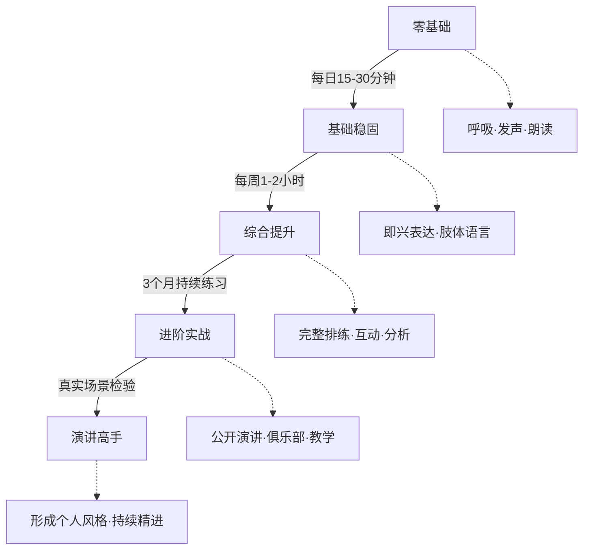
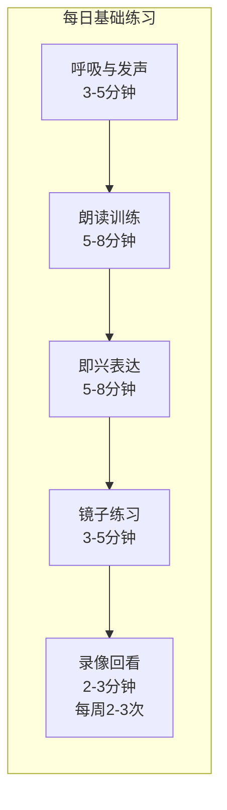
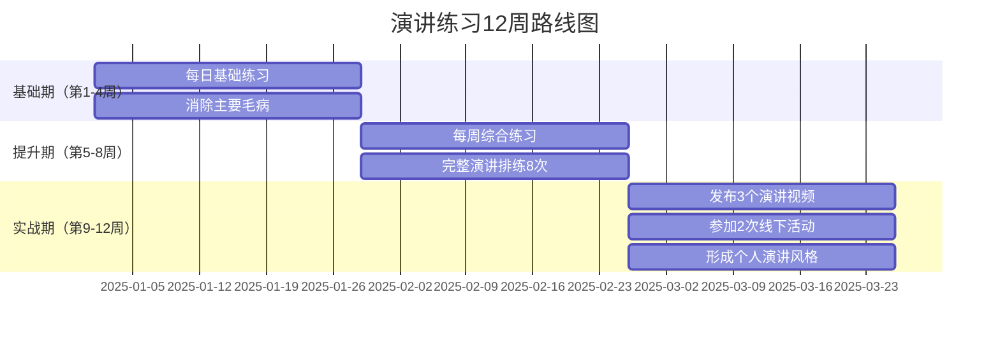

# 第六章 演讲表达 —— 练习方法

## 引言

演讲是一项技能，不是天赋。认知科学家安德斯·埃里克森（Anders Ericsson）用三十年研究证明：任何领域的顶尖表现，都源于长期的"刻意练习"（Deliberate Practice）。科比·布莱恩特凌晨四点训练，不是因为他热爱早起，而是因为他理解一个事实——**重复不等于进步，有目的的重复才是**。

大多数人的演讲练习停留在"随便讲讲"的层面：对着镜子说几句，或者在开会前匆匆过一遍稿子。这种练习能让你"不怯场"，但无法让你"出彩"。真正的进步需要三个条件：

1. **明确的目标**——每次练习解决一个具体问题（语速、手势、逻辑结构等）
2. **即时的反馈**——通过录像、听众反馈或自我评估发现问题
3. **持续的修正**——根据反馈调整，进入下一轮练习

本节提供一套从零基础到高手的完整练习体系。它不是一份"参考清单"，而是一个可执行的训练课程——每天15-30分钟的基础训练，每周1-2小时的综合训练，加上进阶实战和专业评估。坚持三个月，你将获得可量化的进步。



***

## 一、刻意练习的科学原理

在进入具体练习方法之前，理解"为什么这样练有效"至关重要。盲目练习和科学练习的差距，不是10%-20%，而是数倍。

### 1.1 什么是刻意练习

刻意练习不同于普通练习。普通练习是"做你已经会做的事"，刻意练习是"做你还不太会做的事"。两者的核心区别：

| 维度 | 普通练习 | 刻意练习 |
|------|----------|----------|
| 目标 | 模糊（"练演讲"） | 明确（"消除填充词"） |
| 难度 | 舒适区（已经会的） | 学习区（稍微超出能力的） |
| 反馈 | 延迟或缺失 | 即时且具体 |
| 注意力 | 可以走神 | 必须全神贯注 |
| 修正 | 无意识重复 | 有意识调整 |
| 效果 | 维持现有水平 | 提升到新水平 |

演讲练习中，刻意练习的具体含义是：**每次练习聚焦于一个可观察、可衡量的技能点，通过录像或反馈获得即时信息，然后有针对性地调整**。比如，不是"练10分钟演讲"，而是"练10分钟，专门消除'然后'这个口头禅，录像后统计出现次数"。

### 1.2 神经可塑性与肌肉记忆

为什么反复练习能让演讲变得"自然"？答案在大脑的神经可塑性（Neuroplasticity）。

当你第一次练习一个手势时，大脑需要消耗大量认知资源来"想"该怎么做。但当你重复100次之后，负责这个动作的神经通路被反复强化，髓鞘（myelin）增厚，信号传导速度提升，这个动作就变成了"自动驾驶"——你不需要再"想"，它会自然发生。

这个过程需要两个条件：

- **足够的重复次数**：研究显示，将一项技能从"有意识"转化为"无意识"，通常需要数百到数千次重复。演讲中的手势、语调控制、站姿等，至少需要连续练习21-30天才能初步固化。
- **足够的专注度**：边玩手机边朗读的效果远不如全神贯注地朗读。大脑只强化被激活的神经通路——走神时激活的是"走神通路"，不是"演讲通路"。

这意味着：**每天15分钟的高质量练习，胜过周末3小时的低质量练习**。频率比时长更重要。

### 1.3 学习曲线与高原期

演讲能力的提升不是线性的，而是呈"阶梯形"：


- **快速进步期**（通常在前2-4周）：从零开始学任何新技能，进步都会很快。你会觉得"每天都在变好"。
- **高原期**（通常在1-3个月之间）：进步变慢甚至停滞。你觉得自己"练了很久但没有变化"。这是最危险的阶段——大多数人在这里放弃。
- **突破**：坚持练习的人会突然发现"好像开窍了"。之前刻意控制的东西变成了本能。

**应对高原期的方法**：
- 换一个练习重点（从语速练习切换到手势练习）
- 增加难度（从2分钟演讲增加到5分钟，从对着镜子改为对着真人）
- 回看一个月前的录像，对比现在——你可能比自己以为的进步更大
- 记住：**高原期是突破的前兆，不是放弃的理由**

***

## 二、基础练习：每日训练（15-30分钟）

基础练习是所有演讲能力的地基。就像运动员每天要做基础体能训练一样，演讲者每天需要打磨呼吸、发声、语感、肢体这几个基本功。



### 2.1 呼吸与发声练习（3-5分钟）

**为什么这是第一个练习？**

大多数演讲问题——声音小、语速快、上气不接下气、紧张到声音发抖——根源都在呼吸。呼吸是演讲的"引擎"，引擎不稳，车身必然摇晃。

#### 2.1.1 腹式呼吸训练

胸式呼吸（浅呼吸）是大多数人的默认模式，但演讲需要腹式呼吸（深呼吸）：

- **胸式呼吸**：吸气时肩膀上抬，胸腔扩张。特点：呼吸浅、换气快、声音不稳定。紧张时更容易切换到胸式呼吸，形成恶性循环。
- **腹式呼吸**：吸气时腹部膨胀，横膈膜下降。特点：呼吸深、气息足、声音稳定。这是播音员、歌手、演讲者的标准呼吸方式。

**训练方法**：

1. 仰卧在床上或沙发上，双手放在腹部
2. 用鼻子缓慢吸气4秒，感受腹部像气球一样膨胀
3. 用嘴缓慢呼气6秒，感受腹部自然收缩
4. 重复10次为一组，每天练习2-3组

**站立练习**（进阶）：
1. 双脚与肩同宽，一只手放在腹部
2. 吸气时腹部向前推出，呼气时腹部收回
3. 逐渐过渡到自然站立时也能保持腹式呼吸

**常见错误**：
- 吸气时耸肩——说明仍在用胸式呼吸，把注意力放在腹部的起伏上
- 呼气太快——呼气时间应该是吸气的1.5倍以上
- 练习时憋气——如果感到头晕，说明过度呼吸，放慢节奏

#### 2.1.2 气息控制训练

有了好的呼吸基础，接下来训练气息的持久力和控制力：

**长音训练**：
1. 深吸一口气（腹式呼吸）
2. 用"丝——"（s音）的声音尽量长时间地呼出
3. 初学者目标：15秒以上。中级目标：25秒以上。高级目标：35秒以上
4. 每天练习5次，记录每次的秒数

**气息分段**：
1. 深吸一口气
2. 分4段呼出，每段之间停顿1秒："丝——停——丝——停——丝——停——丝——"
3. 再练习分6段、8段呼出
4. 这个练习训练你在演讲中"偷气"的能力——在句间停顿时快速补充气息

**弹跳气息**：
1. 深吸一口气
2. 用短促有力的"嘶！嘶！嘶！嘶！"连续呼出，像打机关枪一样
3. 每次弹跳后腹部会有自然的回收动作
4. 这个练习训练腹部肌肉的爆发力，让你的重音更有力量

#### 2.1.3 共鸣与声音美化

好的声音不是靠"喊"出来的，而是靠共鸣腔体的共振放大出来的：

**胸腔共鸣**（低音区，给人稳重感）：
1. 闭嘴，用"嗯——"的低音哼鸣
2. 把手放在胸口，感受振动
3. 逐渐降低音高，直到感受到明显的胸腔振动
4. 用这个位置说："大家好，今天很高兴来到这里。"

**口腔共鸣**（中音区，最常用的共鸣区）：
1. 张嘴，用"啊——"的声音练习
2. 想象声音从口腔中央向四面八方扩散
3. 感受硬腭（口腔上壁前部）的振动
4. 用饱满的声音依次发出"a-o-e-i-u-ü"，每个音持续3秒

**头腔共鸣**（高音区，给人明亮感）：
1. 用"嗯——"的高音哼鸣
2. 感受眉心和鼻腔的振动
3. 不要挤压喉咙来达到高音——应该用气息支撑

**音量控制练习**：
1. 选一句话，如"今天的天气真好"
2. 分别用耳语音量、正常音量、演讲音量、最大音量朗读
3. 感受不同音量下腹部用力的差异
4. 演讲中最常用的不是最大音量，而是"有控制的变化"——重点处加大，过渡处降低

#### 2.1.4 语调与节奏训练

平铺直叙是演讲的大忌。语调变化让语言有"旋律感"，节奏变化让语言有"呼吸感"。

**升调与降调练习**：

| 句子 | 升调含义 | 降调含义 |
|------|----------|----------|
| 你好 | 疑问/打招呼 | 确认/冷淡 |
| 真的吗 | 疑问/惊讶 | 不信/反讽 |
| 太好了 | 真诚的兴奋 | 敷衍/讽刺 |
| 我知道了 | 追问（还有呢？） | 结束对话 |

**节奏变化练习**：
1. 选一段话，标记出：重要词语（加粗/放慢）、过渡词语（加快）、停顿处（空行）
2. 按照标记朗读，感受"快-慢-停"的节奏
3. 关键原则：**重要内容放慢速度，过渡性内容加快速度，重要信息前故意停顿1-2秒**

**中文绕口令训练**（提升口腔肌肉灵活性）：

初级：
- 八百标兵奔北坡，炮兵并排北边跑。炮兵怕把标兵碰，标兵怕碰炮兵炮。
- 四是四，十是十，十四是十四，四十是四十。

中级：
- 黑化肥发灰，灰化肥发黑。黑化肥发灰会挥发，灰化肥挥发会发黑。
- 牛郎恋刘娘，刘娘念牛郎。牛郎年年恋刘娘，刘娘年年念牛郎。

高级：
- 打南边来了个喇嘛，手里提拉着五斤鳎目；打北边来了个哑巴，腰里别着个喇叭。南边提拉着鳎目的喇嘛要拿鳎目换北边别喇叭哑巴的喇叭。哑巴不愿拿喇叭换喇嘛的鳎目，喇嘛非要换别喇叭哑巴的喇叭。喇嘛抡起鳎目抽了别喇叭哑巴一鳎目，哑巴摘下喇叭打了提拉着鳎目的喇嘛一喇叭。

**练习要点**：先慢后快，宁可慢而清晰，不要快而含糊。每个字的声母、韵母、声调都要发到位。

***

### 2.2 朗读训练（5-8分钟）

朗读是连接"发声"和"表达"的桥梁。它训练的不是"读"的能力，而是"把文字转化为有感染力的口语"的能力。

#### 2.2.1 朗读的基本方法

1. **选材**：选择一篇500-800字的优质文章。初期推荐新闻评论（逻辑清晰、语言规范），中期推荐散文（语言优美、节奏丰富），后期推荐演讲稿（口语化、互动感强）。
2. **默读理解**：先默读一遍，理解文章的主旨、结构和情感基调。不理解内容的朗读只是"念字"。
3. **标注重点**：用铅笔标记——重音词（下划线）、停顿处（斜杠/）、语调变化（箭头↑↓）
4. **大声朗读**：站着朗读，声音足够大（能被3米外的人听清），注意之前标注的符号
5. **录音回放**：用手机录音，回放时对照原文，找出读错、读破、读漏的地方
6. **再次朗读**：针对发现的问题重新朗读同一段落

#### 2.2.2 朗读的进阶练习

**情感朗读法**：
选择同一篇文章，分别用以下情感朗读，感受语调、语速、音量的变化：
- 严肃正式（像在做工作报告）
- 轻松愉快（像在跟朋友聊天）
- 激动慷慨（像在做战前动员）
- 沉思内省（像在深夜自言自语）
- 幽默调侃（像在讲段子）

这个练习让你理解：**同一句话，换一种情感，效果完全不同**。演讲中，你需要根据内容的情感基调切换表达方式。

**模仿朗读法**：
1. 选择一段优秀演讲的音频（推荐TED中文演讲或央视纪录片旁白）
2. 先听3遍，感受演讲者的语速、停顿、重音、语调
3. 逐句跟读，尽量模仿每一个细节
4. 整段跟读，尽量同步
5. 脱稿朗读同一段内容，融入自己的理解

模仿不是为了变成别人，而是为了"下载"优秀演讲者的表达模式到你的大脑中。

#### 2.2.3 推荐朗读素材

| 素材类型 | 推荐来源 | 训练目标 |
|----------|----------|----------|
| 新闻评论 | 人民日报评论员文章、新华社社论 | 严谨逻辑、规范表达 |
| TED演讲文稿 | TED官网中文演讲稿 | 口语化表达、故事讲述 |
| 经典散文 | 朱自清《背影》、余光中《乡愁》 | 语言美感、情感节奏 |
| 古诗词 | 李白《将进酒》、苏轼《念奴娇》 | 声韵气势、情感张力 |
| 辩论稿 | 《奇葩说》经典辩论片段 | 快速反应、逻辑交锋 |
| 商业演讲 | 乔布斯产品发布会、雷军年度演讲 | 说服力、节奏控制 |

***

### 2.3 即兴表达练习（5-8分钟）

即兴表达是检验"真实水平"的试金石。有稿演讲可以靠准备掩盖能力不足，即兴演讲则赤裸裸地暴露你的思维速度、逻辑组织和语言表达能力。

#### 2.3.1 PREP结构速练法

PREP是最实用的即兴表达框架：

- **P**oint（观点）：先说你的核心观点
- **R**eason（理由）：给出支持观点的理由
- **E**xample（案例）：用具体的例子证明
- **P**oint（重申）：再次强调核心观点

**练习步骤**：
1. 随机选择一个话题（见下方话题表）
2. 给自己30秒准备时间（只在脑中想，不写下来）
3. 计时1-2分钟，用PREP结构表达
4. 录音回放，检查：观点是否清晰？理由是否充分？案例是否具体？结构是否完整？

#### 2.3.2 三个关键词法

这个练习训练你的联想能力和逻辑串联能力：
1. 随机选择三个不相关的词（如"雨天""咖啡""旅行"）
2. 用1分钟时间，将这三个词串联成一个有逻辑的故事或观点
3. 示例："雨天让我想到旅行中最难忘的经历——在巴黎的一家小咖啡馆，外面下着大雨，我喝着咖啡，看着窗外的行人，突然意识到：**最好的旅行不是去多远的地方，而是在一个陌生的角落找到内心的平静**。就像好的咖啡，不在于多贵，而在于那个下雨天刚好需要它。"

#### 2.3.3 电梯演讲法

这个练习训练你的"浓缩表达"能力——在极短时间内传达核心信息：
1. 选择一个你熟悉的项目、产品或观点
2. 假设你只有60秒，在电梯里遇到一位重要人物
3. 你需要在这60秒内：说明白它是什么、为什么重要、需要对方做什么
4. 录音并严格计时，超时就重来

#### 2.3.4 每日话题表

| 日期 | 话题 | 练习重点 | PREP提示 |
|------|------|----------|----------|
| 周一 | 描述你最近读的一本书 | 信息组织 | 观点：这本书值不值得读 |
| 周二 | 你对远程办公的看法 | 观点表达 | 理由：效率/生活/成本 |
| 周三 | 讲述你最难忘的一次旅行 | 故事讲述 | 案例：具体的场景描写 |
| 周四 | 如果你有100万会怎么用 | 逻辑推理 | 结构：分配方案+理由 |
| 周五 | 向5岁小孩解释什么是互联网 | 通俗表达 | 类比：用孩子能理解的比喻 |
| 周六 | 你认为AI会取代人类工作吗 | 辩证思维 | 正反两面论证 |
| 周日 | 分享一个你从失败中学到的教训 | 真诚表达 | 情感：脆弱但有力量 |

#### 2.3.5 即兴话题库（50题）

按难度分级，初学者从L1开始，逐步挑战更高难度：

**L1·描述类**（训练信息组织）：
1. 你最喜欢的季节及原因
2. 描述你理想中的居住环境
3. 你手机里最常用的一个App
4. 你家乡最特别的一个地方
5. 你童年最难忘的一个玩具

**L2·观点类**（训练论证能力）：
6. 健康和财富哪个更重要
7. 年轻人应该冒险还是求稳
8. 社交媒体对人际关系的影响是好是坏
9. 996工作制是否合理
10. 你如何看待"内卷"

**L3·故事类**（训练叙事能力）：
11. 你最后悔的一个决定
12. 你最敬佩的一个人
13. 你最难忘的一次失败
14. 你学过的最重要的一课
15. 你人生中最大的转折点

**L4·抽象类**（训练抽象思维和比喻能力）：
16. 如何定义成功
17. 你认为什么是真正的自由
18. 如果可以穿越时空，你最想去哪里
19. 科技让生活更美好了吗
20. 你认为人类存在的意义是什么

**L5·挑战类**（训练极限表达）：
21. 用60秒说服我买一瓶水
22. 用三个词总结你的人生哲学，然后解释
23. 如果你是CEO，上任第一天说什么
24. 为"失败"写一段颁奖词
25. 用一个故事证明"坚持"的价值

（更多话题可自行补充，覆盖生活、工作、社会、哲学等多个维度。建议每周从不同难度级别中各选1-2题练习。）

***

### 2.4 镜子练习（3-5分钟）

镜子是你最诚实的听众。它不会客气，不会走神，不会给你虚假的掌声——它只是忠实地展示你此刻的样子。

#### 2.4.1 基础站姿训练

好的演讲从好的站姿开始。站姿传递的不仅是"形象"，更是"气场"。

**标准演讲站姿**：
1. 双脚与肩同宽（或略宽），不要并拢也不要过度分开
2. 重心均匀分布在双脚上（不要偏向一侧）
3. 膝盖微微放松，不要锁死（锁死膝盖会导致身体轻微摇晃）
4. 骨盆中立位（不要撅屁股也不要过度前倾）
5. 脊柱自然延伸，头顶像有根线向上拉
6. 双肩放松下沉（不要耸肩）
7. 下巴微收（不要仰头也不要低头）

**镜子检查清单**：
- [ ] 双脚位置是否正确？
- [ ] 身体重心是否稳定？
- [ ] 肩膀是否放松？
- [ ] 头部是否正直？
- [ ] 整体姿态是否看起来自信而不僵硬？

#### 2.4.2 手势练习

手势是演讲中被低估最多的元素。研究表明，恰当的手势能让听众对演讲者的信任度提升约20%。

**有效手势的特征**：
- 开放性：手掌朝上或朝外（传递坦诚、邀请的信号）
- 有目的：每个手势都在强化你说的内容
- 在"核心区域"活动：腰部到肩部之间的空间（太低没力量，太高显得紧张）
- 干净利落：做完手势自然收回，不要悬在半空

**镜子手势练习**：

1. **数字手势**：说"第一"时伸出食指，说"第二"时伸出两根手指……练习到手势和语言同步
2. **对比手势**：说"一方面……另一方面"时，左手伸出、右手伸出，形成空间对比
3. **强调手势**：说"这一点非常重要"时，一只手有力地向下切
4. **邀请手势**：说"大家想想看"时，双手掌心向上微微前伸
5. **拒绝手势**：说"绝不是这样"时，手掌向外推出

**需要避免的手势**：
- 双手交叉抱胸（防御姿态）
- 双手插兜（随意、不尊重）
- 手指指人（攻击性）
- 双手在身前交握（紧张信号）
- 反复摸脸、摸头发、摸衣服（不安信号）
- 双手背在身后（过于正式、有距离感）
- 无意识地转笔、玩戒指（分散注意力）

#### 2.4.3 眼神练习

在镜子前练习"看"听众——不是扫视，而是"连接"：

1. **三点注视法**：想象镜子中有三个点（左、中、右），每讲完一个要点，目光移到一个点上，停留2-3秒
2. **缓慢移动**：目光从左到右的移动要慢——大约3-5秒扫过全场。太快显得紧张，太慢显得呆滞
3. **不要"虚看"**：眼睛要"聚焦"在具体的点上，而不是茫然地看向前方。即使面前没有人，也要练习"看到"具体的听众

#### 2.4.4 面部表情练习

表情要与内容匹配。对着镜子练习以下情景：

- 开场微笑：嘴角自然上扬，眼睛微弯（不是露齿笑，是自然的友善）
- 讲严肃话题：眉头微蹙，嘴角平直（不是皱眉苦脸，是认真和专注）
- 讲幽默内容：微笑+眨眼或微微歪头（给听众"这是一个玩笑"的信号）
- 讲感人故事：眼神柔和，嘴角微微下垂（不要刻意做出悲伤的表情，自然就好）
- 结尾呼吁：坚定的眼神+微微点头（传递信心和确认）

***

### 2.5 录像回看（每周2-3次，每次5分钟）

录像回看是提升演讲能力最有效的单项练习，没有之一。原因很简单：**你以为的自己，和实际的自己，差距往往大得惊人**。

#### 2.5.1 为什么要录像

人类在说话时无法客观地评估自己。你听到的自己的声音是通过骨传导传来的，比别人听到的更低沉、更浑厚。你以为自己语速适中，实际可能太快。你以为自己站得很稳，实际可能在轻微摇晃。

录像消除了这种"自我滤镜"。它像一面时间的镜子，让你以听众的视角审视自己。

#### 2.5.2 录像评估维度

回看录像时，按以下四个维度逐项检查：

| 维度 | 检查项 | 常见问题 |
|------|--------|----------|
| **内容** | 逻辑是否清晰？重点是否突出？有没有跑题？ | 结构松散、重点不明确、信息过载 |
| **语言** | 语速是否合适？是否有填充词（然后、就是、嗯）？发音是否清晰？ | 语速过快、填充词过多、含糊不清 |
| **肢体** | 姿态是否自然？手势是否得体？眼神是否到位？ | 僵硬不动、小动作过多、不敢看镜头 |
| **声音** | 音量是否足够？语调是否有变化？是否有力量感？ | 声音单调、音量过小、气息不稳 |

#### 2.5.3 如何克服"看自己的不适感"

大多数人第一次看自己的录像时都会感到尴尬——"我的声音怎么这样？""我怎么这么紧张？""我的表情好奇怪。"

这种不适感是正常的，而且是**成长的信号**——说明你开始意识到之前没注意到的问题。应对方法：
1. 第一次只看"做得好的地方"，建立信心
2. 第二次只找"一个最大的改进点"，不要同时关注太多问题
3. 把录像想象成"看别人"——拉开心理距离
4. 每周对比，看到进步就给自己正反馈

#### 2.5.4 进阶：对比分析法

连续录像同一话题3次，然后把3段录像并排对比：
- 第1次：原始状态，不做任何调整
- 第2次：针对第1次发现的问题做改进
- 第3次：在第2次基础上继续优化

这种对比让你清楚地看到"调整前后的差异"，是最直观的学习方式。

***

## 三、综合练习：每周训练（1-2小时）

每日练习解决"单项技能"，每周练习解决"综合运用"。就像运动员每天练体能、每周打比赛一样——单项能力要转化为综合能力，必须在"准实战"环境中整合。

### 3.1 完整演讲排练（每周1次，30-45分钟）

#### 3.1.1 排练的标准流程

1. **选题**：从下方主题表中选择本周的主题，或使用你工作中的真实演讲场景
2. **准备**（15分钟）：写出演讲大纲（不是逐字稿），设计开场和结尾，确定3个核心要点
3. **第一次排练**：站立演讲，使用计时器，如果有PPT就使用PPT，全程录像
4. **自我评估**（10分钟）：回放录像，对照评估清单打分，记录3个优点和3个改进点
5. **修改与第二次排练**：针对改进点调整后重新排练，再次录像
6. **对比分析**：对比两次录像，确认改进效果

#### 3.1.2 八周主题轮换表

| 周次 | 主题 | 练习重点 | 时长建议 |
|------|------|----------|----------|
| 第1周 | 我的职业故事 | 故事讲述、个人品牌 | 5分钟 |
| 第2周 | 我推荐的一本书 | 信息组织、说服力 | 5分钟 |
| 第3周 | 如何提升工作效率 | 结构化表达、数据支撑 | 7分钟 |
| 第4周 | 我的人生转折点 | 情感表达、共鸣技巧 | 7分钟 |
| 第5周 | 对某个社会现象的看法 | 论证能力、辩证思维 | 8分钟 |
| 第6周 | 如果我是CEO | 战略思维、愿景表达 | 8分钟 |
| 第7周 | 我学到的最重要的一课 | 故事+启示、深度表达 | 10分钟 |
| 第8周 | 给年轻人的三个建议 | 综合运用、个人风格 | 10分钟 |

#### 3.1.3 排练的"版本意识"

专业演讲者排练一个演讲至少5次以上。每次排练是一个"版本"：
- **V1（粗糙版）**：只关注内容和结构是否完整，不追求完美
- **V2（优化版）**：调整逻辑漏洞、补充案例、优化表达
- **V3（打磨版）**：优化语速、停顿、重音、手势
- **V4（流畅版）**：减少填充词，提升连贯性
- **V5（彩排版）**：完全模拟正式演讲环境（包括着装、场地、道具）

大多数人只做到V1就觉得自己"准备好了"。区别在于：V1的演讲是"能听"的，V5的演讲是"精彩"的。

***

### 3.2 模拟互动练习（每周1次，20-30分钟）

真正的演讲不是独白，而是对话。你需要练习在演讲中与听众互动、应对提问、处理突发状况。

#### 3.2.1 有听众的练习

1. 找一个朋友、家人或同事作为"听众"（不需要是演讲专家）
2. 做一个5-10分钟的演讲
3. 约定：听众可以在过程中随时举手提问或提出质疑
4. 练习以下互动技能：
   - **接住问题**：不打断思路，用"这是个好问题"赢得思考时间
   - **确认问题**：用自己的话复述问题，确保理解正确
   - **回答并回到主题**：回答完问题后，用"这也正好引出我要讲的下一点"自然过渡
   - **应对挑战性问题**：不回避、不防御，用"我理解你的担忧"先共情再回答

#### 3.2.2 没有听众的替代方案

| 方案 | 操作方法 | 效果 |
|------|----------|------|
| AI对话 | 用ChatGPT等工具模拟听众提问，让它针对你的演讲内容生成5个问题，然后口头回答 | 训练应对随机问题的能力 |
| 镜子问答 | 镜子前演讲时，左手举起"提问"，右手"回答"，模拟Q&A环节 | 训练角色切换和思维转换 |
| 录音辩论 | 就一个争议话题，先录2分钟正方观点，再录2分钟反方观点 | 训练多角度思考和表达 |
| 社交媒体 | 在朋友圈或知乎分享观点，认真回应不同意见 | 训练文字和口头的论证能力 |

***

### 3.3 优秀演讲分析（每周1次，20-30分钟）

"读万卷书不如行万里路"在演讲领域应该改为"练百次不如看高手讲一次"。分析优秀演讲是"偷师"最高效的方式。

#### 3.3.1 分析的正确姿势

不要"看热闹"式地观看——要"拆解"式地分析：

1. **第一遍：正常观看**，感受整体效果，记录"你被打动了哪个瞬间"
2. **第二遍：暂停分析**，每2分钟暂停一次，记录：
   - 开场方式是什么？为什么在30秒内抓住了你？
   - 使用了什么结构？总分总？时间线？问题-方案？
   - 用了哪些故事和案例？为什么有效？
   - 哪里有互动技巧？（提问、停顿、目光接触）
   - 肢体语言有哪些亮点？（手势、移动、站姿）
   - 声音变化如何？（语速、音量、语调、停顿）
   - 结尾方式是什么？为什么印象深刻？
3. **做笔记**：记录3-5个值得学习的技巧
4. **模仿练习**：选择其中一个技巧，在自己的下次练习中应用

#### 3.3.2 推荐演讲清单

| 演讲者 | 演讲主题 | 学习重点 | 平台 |
|--------|----------|----------|------|
| Simon Sinek | How Great Leaders Inspire Action | 结构设计、黄金圈法则 | TED |
| Brené Brown | The Power of Vulnerability | 故事讲述、情感共鸣 | TED |
| Steve Jobs | 2005 Stanford Commencement | 开场、三段式结构、收尾 | YouTube |
| Ken Robinson | Do Schools Kill Creativity | 幽默、互动、节奏控制 | TED |
| Amy Cuddy | Your Body Language May Shape Who You Are | 个人故事、科学传播 | TED |
| 马云 | 杭州师范大学毕业演讲 | 故事性、接地气、幽默感 | B站 |
| 罗翔 | 法律演讲系列 | 深入浅出、人文关怀 | B站 |
| 雷军 | 小米年度发布会 | 产品展示、用户视角、节奏控制 | B站 |
| 董宇辉 | 东方甄选直播 | 即兴表达、知识储备、情感连接 | 抖音 |
| 蔡康永 | 《说话之道》系列分享 | 情商表达、故事技巧 | YouTube |

#### 3.3.3 深度拆解示例

以Steve Jobs 2005年斯坦福大学毕业演讲为例：

**开场拆解**（前60秒）：
> "I am honored to be with you today at your commencement from one of the finest universities in the world. I never graduated from college. Truth be told, this is the closest I've ever gotten to a college graduation."

- **技巧1**：先赞美听众（斯坦福是世界最好的大学之一）——建立好感
- **技巧2**：制造反差（我没毕业）——制造悬念和好奇心
- **技巧3**：幽默自嘲（这是我离大学毕业最近的一次）——拉近距离

**结构拆解**：
整篇演讲用"三个故事"结构，每个故事有清晰的"起因-经过-转折-启示"。这种结构的优势：简单（听众容易跟）、有力（三个故事比三个道理更打动人）、个人化（建立情感连接）。

**收尾拆解**：
> "Stay Hungry. Stay Foolish."

- 用一句简洁有力的格言收尾，容易记住、容易传播。这是演讲收尾的黄金法则：**最后一句话应该是你整篇演讲的"浓缩精华"**。

***

### 3.4 即兴演讲训练（每周1次，15-20分钟）

即兴演讲的能力直接决定了你在日常工作中的表达质量——会议发言、电梯偶遇、临时汇报，都是即兴场景。

#### 3.4.1 话题卡片法

1. 准备10张卡片，每张写一个话题（从即兴话题库中选取）
2. 打乱后随机抽取一张
3. 看到话题后**立刻开始**，不要超过5秒思考时间
4. 讲1-2分钟，录音
5. 回放评估：结构是否清晰？有没有"嗯、然后、就是"等填充词？是否在规定时间内讲完了核心内容？

#### 3.4.2 接龙练习法

适合2-4人小组练习：
1. 第一个人抽到话题，讲1分钟
2. 第二个人必须在第一个人的基础上继续讲1分钟（不能另起话题）
3. 第三个人继续接龙
4. 这个练习训练你的**倾听能力**和**衔接能力**——演讲不是"到我了我就讲自己的"，而是"基于前面的内容做增量表达"

#### 3.4.3 限制条件练习法

给自己设定约束条件，在约束中练习创造力：
- "只用三个要点，每个要点不超过15秒"
- "必须包含一个个人故事"
- "必须在90秒内完成"
- "不能用任何数字，只能用比喻"
- "必须以一个问题开场"

***

### 3.5 反思与改进日志（每周1次，10-15分钟）

没有反思的练习是"闷头跑步"——你在动，但不知道方向对不对。每周花15分钟反思，相当于给你的练习装上GPS。

#### 3.5.1 周反思模板

```markdown
## 本周演讲练习反思

### 练习完成情况
- 朗读练习：___/7 天
- 即兴练习：___/7 天
- 镜子练习：___/7 天
- 呼吸发声：___/7 天
- 录像回看：___次
- 完整排练：___次
- 互动练习：___次

### 本周最大进步
（描述本周在哪个方面有明显提升，用具体例子说明）

### 本周发现的问题
（描述本周练习中发现的最突出的问题，分析原因）

### 下周改进重点
（确定1-2个重点改进方向，写明具体的改进行动）

### 本周优秀演讲学习笔记
（记录本周分析的优秀演讲中学到的3个技巧）

### 下周练习话题
- 即兴话题1：___
- 即兴话题2：___
- 完整排练主题：___
```

#### 3.5.2 月度检查点

每月最后一天，做一次全面回顾：

1. **量化统计**：本月练习了多少天？（目标：25天以上）做了多少次完整排练？（目标：4次以上）
2. **能力自评**（1-10分）：语速控制___、逻辑结构___、肢体语言___、声音表现___、即兴能力___、互动能力___
3. **最大进步**：本月最明显的提升是什么？
4. **最大瓶颈**：本月最大的挑战是什么？
5. **下月计划**：下月的1-2个重点改进方向

**进阶做法**：每月录一次5分钟的标准演讲（同一个话题），存档。三个月后对比三个月的录像，你会看到显著的进步。

***

## 四、进阶练习：实战检验

当基础和综合练习持续三个月后，你需要在真实环境中检验和提升。教室里学会的游泳和大海里学会的游泳，是两种完全不同的能力。

### 4.1 录制演讲视频发布

**为什么有效**：公开发布给你"真实的观众"和"真实的评价"——不是朋友的鼓励性好评，而是陌生人的真诚反馈。

**操作步骤**：
1. 选择一个你有信心的话题
2. 写出大纲（不是逐字稿），准备2-3次排练
3. 用手机录制5-10分钟的演讲视频
4. 发布到B站、抖音、微信视频号或小红书
5. 用标题吸引目标观众（如"3分钟教你XXX"）
6. 认真阅读评论，提取有价值的反馈

**注意事项**：
- 不要追求完美才发布。第一个视频一定是"不完美"的，但"发出来了"比"还在准备"重要一万倍
- 前10个视频关注"完成"而不是"完美"
- 从评论中分辨：情绪性批评忽略，具体性反馈采纳

### 4.2 参加演讲俱乐部

| 组织 | 特点 | 适合人群 | 费用 |
|------|------|----------|------|
| Toastmasters（头马） | 全球最大的演讲训练组织，有完善的评估体系和晋升路径 | 想要系统提升的人 | 会费（半年约500-800元） |
| 各地线下读书会 | 环境轻松，门槛低 | 想先试试水的人 | 通常免费或很低 |
| 企业内部演讲培训 | 与工作场景直接相关 | 职场人士 | 通常公司承担 |
| 即兴演讲俱乐部 | 专门训练即兴表达 | 想提升临场反应的人 | 因地而异 |

**Toastmasters的标准练习流程**：
1. 备稿演讲（Prepared Speech）：按教材完成5-7分钟的定题演讲
2. 即兴演讲（Table Topics）：随机抽题，1-2分钟即兴表达
3. 评估（Evaluation）：每位演讲者获得一位评估员的书面+口头反馈
4. 角色扮演：担任主持人、计时员、语法观察员等角色，全方位锻炼

### 4.3 主动争取演讲机会

能力是"用出来的"，不是"等出来的"：

- **公司内部**：会议中主动发言、申请做项目汇报、组织团队分享会
- **行业活动**：申请行业峰会的闪电演讲（Lightning Talk，通常5分钟）、在技术社区做分享
- **社区/公益**：在社区活动中做志愿者演讲、在学校做职业分享
- **线上平台**：在播客做嘉宾、在直播间做主题分享

**争取机会的技巧**：
- 先从小场景开始（3分钟的分享），逐步升级到大场景（30分钟的主题演讲）
- 准备一个"随时可用"的5分钟演讲（你的专业领域或个人故事），遇到机会随时能上
- 主动联系活动组织者，表达分享意愿。大多数活动都需要演讲者，你主动联系反而帮了他们的忙

### 4.4 教授他人

"教是最好的学"不是鸡汤，是认知科学的结论——费曼学习法的核心原理。当你能够教会一个完全不懂的人时，你对这个知识的掌握程度达到了90%以上。

**如何开始教别人**：
1. 在团队内做一次15分钟的知识分享
2. 写一篇关于你擅长领域的教程文章
3. 录一个教学视频发布到网上
4. 一对一辅导一个想提升演讲能力的朋友
5. 在演讲俱乐部担任评估员，点评别人的演讲

***

## 五、心理建设：克服演讲焦虑

再多的技术练习，如果心理关过不去，都白费。这一节解决"会练但上台就崩"的问题。

### 5.1 理解紧张的本质

紧张不是你的敌人，它是你的身体在"准备战斗"。肾上腺素分泌加速、心跳加快、手心出汗——这些生理反应和运动员上场前的反应完全一样。

**关键认知转变**：
- ❌ "我太紧张了，我肯定讲不好" → ✅ "我的身体已经准备好迎接挑战了"
- ❌ "所有人都在看我的缺点" → ✅ "所有人都在等待从我这里获得价值"
- ❌ "忘词了就完蛋了" → ✅ "没有人知道我原计划说什么，忘词只有我知道"

### 5.2 上台前的5分钟

| 时间 | 动作 | 原理 |
|------|------|------|
| 上台前5分钟 | 找一个安静的地方，做5次腹式呼吸 | 激活副交感神经，降低应激反应 |
| 上台前4分钟 | 双脚站立，感受脚掌与地面的接触 | "接地"练习，增加安全感和稳定感 |
| 上台前3分钟 | 微笑（即使不想笑也要做），回忆一件开心的事 | 微笑能触发面部反馈效应，实际改善情绪 |
| 上台前2分钟 | 默念开场白的前三句话 | 确保开头流畅，建立信心 |
| 上台前1分钟 | 慢慢喝一小口水 | 润喉，同时给自己一个"准备好了"的仪式感 |

### 5.3 可视化练习

运动员在比赛前会做"心理演练"——在脑中完整地想象自己完美完成动作的画面。演讲者同样可以这样做：

1. 闭上眼睛
2. 想象自己站在讲台上，灯光打在身上
3. 想象听众的面孔——他们在微笑，在点头
4. 想象自己用自信的声音说出开场白
5. 想象自己在讲到精彩处，听众鼓掌
6. 想象自己用有力的结尾收束，全场掌声

研究表明，心理演练能激活与实际执行相同的神经通路。每天花3分钟做这个练习，上台时你会觉得"好像已经讲过一遍了"。

### 5.4 紧张时的应急处理

如果在演讲中突然感到紧张加剧：

1. **暂停**：停下来，喝一口水。听众会认为你是在"故意停顿"制造悬念
2. **呼吸**：在喝水的瞬间做一次深呼吸，让横膈膜下降
3. **接地**：双脚用力踩地面，感受支撑力
4. **连接**：找到一位面带微笑的听众，对他/她说话——把"面对一群人"变成"面对一个人"
5. **继续**：从你记得的下一个要点开始继续。没有人知道你漏掉了什么

***

## 六、不同场景的专项练习

通用的演讲练习打好基础，但不同的演讲场景有不同的技巧要求。以下是常见场景的专项练习指导。

### 6.1 工作汇报（3-5分钟）

**特点**：时间短、信息密度高、需要结论先行

**练习重点**：
- 金字塔结构：结论→原因→数据→建议。永远先说结论
- 数据说话：每个观点至少有一个数据或具体案例支撑
- 时间控制：3分钟汇报练习计时精确到秒

**练习方法**：
1. 选一个你最近的工作项目
2. 用3分钟时间向"领导"汇报：做了什么、结果如何、下一步计划
3. 录像回放，检查：是否先说了结论？是否用了数据？是否超时？

### 6.2 产品/方案展示（10-15分钟）

**特点**：需要说服力、视觉辅助、互动

**练习重点**：
- 讲故事而非念PPT：每页PPT对应一个故事或场景
- 利益导向：始终围绕"这对听众有什么好处"
- 互动设计：每5分钟设计一个互动点（提问、投票、小实验）

**练习方法**：
1. 准备一份5页的PPT
2. 排练时不看PPT内容（只看图片提示），用自己的话讲
3. 计时15分钟，确保不超时
4. 请人扮演"挑剔的客户"提3个尖锐问题

### 6.3 面试自我介绍（1-2分钟）

**特点**：极度浓缩、需要差异化、第一印象决定一切

**练习重点**：
- 黄金公式：我是谁 + 我做过什么（一个亮点故事） + 我为什么适合
- 具体化：不说"我有丰富经验"，说"我在3年内将团队人效提升了40%"
- 收尾有力：用一句话说明为什么你对这个机会特别感兴趣

**练习方法**：
1. 写出2分钟的自我介绍
2. 压缩到1分钟（去掉所有不必要的话）
3. 进一步压缩到30秒（只留最核心的信息）
4. 对着镜子练习，直到能在任何情况下流畅说出

### 6.4 婚礼/庆典致辞（3-5分钟）

**特点**：情感表达为主、需要真诚、幽默感加分

**练习重点**：
- 故事选择：一个具体的小故事比一百句赞美更打动人
- 情感节奏：先轻松（引人入胜）→ 深情（情感升华）→ 欢乐（收尾祝福）
- 幽默分寸：可以自嘲，不要嘲别人。可以讲趣事，不要揭隐私

**练习方法**：
1. 写出你和新人之间最难忘的一个故事
2. 用三段式组织：引入故事→故事本身→故事的意义+祝福
3. 对着朋友练习，请他们指出"哪里被打动了"和"哪里走神了"

***

## 七、练习工具箱

### 7.1 录音工具

| 工具 | 平台 | 特点 | 推荐用途 |
|------|------|------|----------|
| 手机自带录音 | iOS/Android | 简单方便 | 日常朗读、即兴练习录音 |
| 喜马拉雅 | iOS/Android | 可发布、有社区 | 录制完整演讲、获取听众反馈 |
| Otter.ai | iOS/Android/Web | 自动转文字、可搜索 | 分析口头禅、统计语速 |
| 讯飞听见 | iOS/Android/Web | 中文转写准确率高 | 中文演讲的文字分析 |

### 7.2 录像工具

| 工具 | 推荐用途 |
|------|----------|
| 手机自带相机 | 日常录像练习（架在三脚架上，距离1.5-2米） |
| 笔记本电脑摄像头 | 线上会议的自我模拟 |
| 投影仪+幕布 | 模拟正式演讲环境 |

### 7.3 计时工具

- 手机计时器（最简单）
- 演讲计时App（如Speech Timer，可设置不同阶段的提醒时间）
- 沙漏（物理工具，视觉效果好，不会因为看手机分心）

### 7.4 AI辅助练习

利用AI工具提升练习效率：
- **ChatGPT/文心一言**：让它扮演听众提问，或帮你修改演讲稿
- **Otter.ai**：转写你的录音，自动统计填充词次数和语速
- **Descript**：视频/音频编辑工具，可以自动删除"嗯""呃"等填充词
- **Grammarly（英文演讲）**：检查用词准确性和表达多样性

### 7.5 打卡与追踪

- **习惯打卡App**：如"小日常""Habitica"，记录每日练习完成情况
- **表格追踪**：用Google Sheets或Excel创建练习追踪表，记录每日练习类型和时长
- **社群互助**：找一个"练习伙伴"或加入练习群组，互相打卡监督

***

## 八、练习计划模板

### 8.1 每日计划（15-30分钟）

| 时间段 | 练习内容 | 时长 | 备注 |
|--------|----------|------|------|
| 早晨起床后 | 呼吸与发声练习 | 3分钟 | 在洗漱前完成，建立习惯触发器 |
| 早晨洗漱后 | 朗读训练 | 5分钟 | 大声朗读，不影响家人的前提下 |
| 通勤/午休 | 即兴表达练习 | 5分钟 | 可以在脑中默练，不一定出声 |
| 晚饭后 | 镜子练习 | 5分钟 | 关注手势和表情 |
| 每周2-3次 | 录像回看 | 5分钟 | 回看当天或近期的练习录像 |

### 8.2 每周计划（1-2小时）

| 日期 | 练习内容 | 时长 | 周期 |
|------|----------|------|------|
| 周三晚上 | 完整演讲排练 | 30-45分钟 | 每周1次 |
| 周五晚上 | 优秀演讲分析 | 20-30分钟 | 每周1次 |
| 周六下午 | 即兴演讲训练 | 15-20分钟 | 每周1次 |
| 周六/周日 | 模拟互动练习 | 20-30分钟 | 每周1次 |
| 周日晚上 | 反思与改进日志 | 10-15分钟 | 每周1次 |

### 8.3 12周进阶路线图



**第1-4周（基础期）目标**：
- 建立每日练习习惯（连续打卡25天以上）
- 消除最突出的1-2个问题（如语速过快、填充词过多）
- 能用PREP结构做1分钟即兴表达

**第5-8周（提升期）目标**：
- 能完成5-7分钟的完整演讲
- 肢体语言和声音表现有明显改善
- 能在互动练习中应对基本的Q&A

**第9-12周（实战期）目标**：
- 在真实场景中完成至少2次公开演讲
- 收到外部反馈并做针对性改进
- 形成初步的个人演讲风格

***

## 九、练习中的常见问题

### Q1：我没有练习的场所怎么办？

**真实情况**：场所从来不是瓶颈，意识才是。

- **卧室**：关门后就是你的私人练习室。不需要大空间，站直能伸展手臂就够了
- **车内**：停车后在车里练习发声和朗读。车内的隔音效果很好
- **散步时**：在人少的路上练习即兴表达（出声的或默练的都可以）
- **厕所**：隔音好、镜子齐全，是绝佳的练习场所
- **会议室**：提前到公司，在空会议室里练习
- **线上**：腾讯会议/Zoom里开一个只有自己的会议，练习对着摄像头演讲

### Q2：坚持不下来怎么办？

**根本原因分析**：大多数人坚持不下来不是因为"意志力不够"，而是因为练习设计有问题。

**解决方案**：
1. **降低启动成本**：从最小的行动开始——每天只做5分钟朗读。不需要"进入状态"，不需要"准备材料"，拿起手机打开一篇文章就开始
2. **绑定习惯触发器**：把练习和一个已有的稳定习惯绑定。比如"每天刷完牙后做3分钟发声练习"——刷牙是触发器，发声练习是新习惯
3. **找练习伙伴**：两个人互相监督的坚持率是独自练习的3倍以上。可以是同事、朋友或网上的练习伙伴
4. **记录连续天数**：用打卡App记录"连续练习天数"。心理学中的"连续性效应"会让你"不想中断"——断了就像"亏了"
5. **设定里程碑奖励**：连续7天——买一本好书；连续30天——请自己吃顿好的；连续90天——给自己买个想要的东西
6. **降低完美标准**：某天太累就只做3分钟呼吸练习，也算完成。"最低标准"比"跳过一天"好一百倍

### Q3：练习了很久但没有明显进步怎么办？

**可能原因及对策**：

| 可能原因 | 诊断方法 | 对策 |
|----------|----------|------|
| 只在舒适区重复 | 回顾练习内容，是否一直做同样的事 | 增加难度，挑战不熟悉的练习类型 |
| 缺乏反馈 | 从未录像或从未获取外部反馈 | 增加录像频率，主动寻求他人评价 |
| 练习太分散 | 每天什么都练一点，没有重点 | 每周聚焦1-2个重点，深度突破 |
| 目标不具体 | "练演讲"太模糊 | 设定具体目标，如"消除口头禅" |
| 高原期 | 坚持2个月以上但感觉停滞 | 换练习重点，增加难度，耐心等待突破 |
| 只练不思 | 每天做练习但不回顾反思 | 增加反思日志，分析具体问题 |

**最有效的诊断方法**：对比一个月前和现在的录像。如果你觉得"没进步"但录像显示有改善，说明你只是在高原期。如果录像确实没有变化，说明需要调整练习方法。

### Q4：我性格内向，能成为好的演讲者吗？

**答案是：绝对可以，而且内向者有独特优势。**

内向不是缺陷，是一种能量管理方式。内向者在演讲中的优势：

- **深度思考**：内向者倾向于深入思考问题，这让你的演讲更有深度和洞察力
- **善于倾听**：你能更好地观察和理解听众的反应，及时调整
- **真诚表达**：不浮夸的风格反而更容易赢得信任
- **充分准备**：内向者通常准备更充分，这让你的演讲更扎实
- **故事力量**：内向者更善于观察生活细节，讲故事更细腻

历史上很多伟大的演讲者都是内向者：
- **比尔·盖茨**：典型的内向者，但他的TED演讲简洁有力、数据充实
- **沃伦·巴菲特**：年轻时极度害羞，通过刻意练习成为优秀的公众演讲者
- **奥巴马**：自称内向者，但准备极其充分，演讲极具感染力
- **苏珊·凯恩**（《安静》作者）：TED演讲"内向的力量"观看量超过4000万

**内向者的专属练习建议**：
- 练习前做更长时间的准备和排练（内向者的优势在于准备充分）
- 选择"深度分享"而非"广泛互动"的演讲风格
- 利用你的观察力——演讲前花时间了解听众，演讲中密切观察反应
- 给自己安排"充电时间"——演讲前的独处和安静，演讲后的休息

### Q5：如何在忙碌中挤出练习时间？

**核心原则**：不是找时间，是"嵌入"时间。

| 场景 | 可做的练习 | 时长 |
|------|----------|------|
| 起床刷牙 | 发声练习（哼鸣、元音） | 3分钟 |
| 通勤路上 | 默练即兴表达（在脑中组织语言） | 10分钟 |
| 午休前 | 朗读一篇短文（手机上） | 5分钟 |
| 开会前 | 腹式呼吸练习 | 2分钟 |
| 洗澡时 | 大声朗读/唱歌（练气息和声音） | 10分钟 |
| 睡前 | 回顾今天的表达（哪些说得好，哪些可以改进） | 3分钟 |
| 周末 | 完整排练+录像回看 | 30-45分钟 |

### Q6：看自己的录像太尴尬了，怎么办？

**真相**：每个人第一次看自己的录像都觉得尴尬。这不是你的问题，是大脑的"自我认知偏差"在作怪——你脑中的"自己"比录像中的"自己"好看、流畅、自信得多。

**脱敏方法**：
1. 先只看静音版本（只看画面，不听声音）——降低一个感官的冲击
2. 再只听音频版本（不看画面）——只关注语言表达
3. 最后看完整视频——两个感官同时接受
4. 第一次只找一个优点（"我的站姿还不错"），不找任何缺点
5. 第二次只找一个改进点
6. 从第三次开始正常评估

**关键认知**：听众看你的感受，和你看自己的感受，完全不同。你觉得尴尬的地方，听众可能根本没注意到。

***

## 本节小结

本节提供了一套完整的演讲练习体系：

**一、理论基础**（为什么这样练）：刻意练习原理、神经可塑性、学习曲线与高原期——理解原理让你练得更聪明。

**二、每日基础练习**（每天15-30分钟）：
- 呼吸与发声：腹式呼吸、气息控制、共鸣训练、语调节奏
- 朗读训练：标准方法、情感朗读、模仿朗读
- 即兴表达：PREP结构、关键词法、电梯演讲
- 镜子练习：站姿、手势、眼神、表情
- 录像回看：四维评估法、克服不适感

**三、每周综合练习**（每周1-2小时）：
- 完整排练：版本意识、八周主题轮换
- 模拟互动：有听众/无听众的练习方案
- 优秀演讲分析：拆解方法、推荐清单、深度示例
- 即兴训练：卡片法、接龙法、限制条件法
- 反思日志：周反思模板、月度检查点

**四、进阶实战**：发布视频、参加俱乐部、争取机会、教授他人

**五、心理建设**：理解紧张本质、上台前5分钟准备、可视化练习、应急处理

**六、场景专项**：工作汇报、方案展示、面试自我介绍、婚礼致辞

**七、工具箱**：录音/录像/计时工具、AI辅助、打卡追踪

**八、计划模板**：每日/每周计划、12周进阶路线图

**九、常见问题**：场所、坚持、进步、内向、时间、心理6大问题的深度解答

记住三个核心原则：

1. **每天15分钟的坚持，胜过偶尔一次3小时的突击。** 频率比时长重要。
2. **录像回看是最有效的单项练习。** 你以为的自己和实际的自己差距很大，录像消除这种偏差。
3. **进步是阶梯形的，不是线性的。** 高原期是突破的前兆，不是放弃的理由。

从今天开始，选择一项最简单的练习——每天朗读5分钟。连续21天，你就已经迈出了成为优秀演讲者的第一步。
