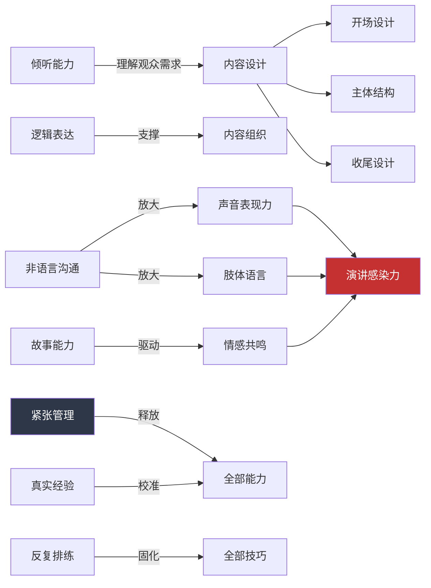
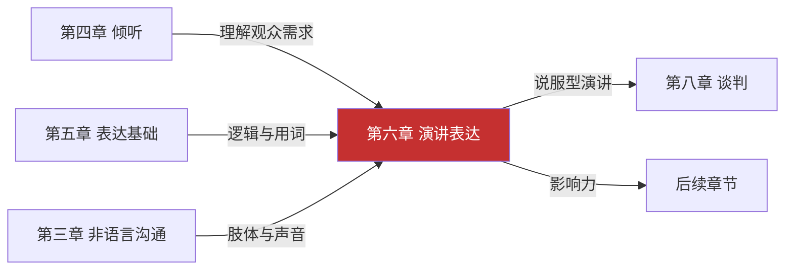

# 第六章 演讲表达 —— 本章小结

本章从"道法术器"四个层面系统构建了演讲表达的完整知识体系。本小结不是简单的要点罗列，而是一张**可反复查阅的能力地图**——它帮你把散落在各节中的知识点串联成网，把理论转化为可执行的行动方案，并提供一套自评工具来追踪你的成长。

## 知识体系全景：四个层次如何贯通

演讲表达的知识体系遵循"道法术器"的递进逻辑。理解这个框架的价值在于：当你面对任何演讲场景时，你可以从上到下逐层决策——先判断类型（道），再选择方法（法），然后调用技巧（术），最后借助工具（器）。

```mermaid
graph TB
    subgraph 道：理解本质规律
        A1[演讲类型学：信息/说服/激励/娱乐] --> A2[结构设计原理：骨架决定成败]
        A2 --> A3[紧张心理机制：杏仁核劫持与最佳唤醒]
        A3 --> A4[准备流程框架：80%成功来自准备]
    end

    subgraph 法：掌握核心方法
        B1[开场设计：黄金30秒信任建立] --> B2[内容组织：三点法则与金字塔原理]
        B2 --> B3[故事讲述：STAR与英雄之旅]
        B3 --> B4[互动设计：双向交流十法]
        B4 --> B5[收尾设计：峰终定律与行动号召]
    end

    subgraph 术：实战场景应用
        C1[工作汇报] --> C2[产品发布]
        C2 --> C3[婚礼致辞]
        C3 --> C4[学术报告]
        C4 --> C5[面试自我介绍]
        C5 --> C6[团队激励]
        C6 --> C7[客户提案]
        C7 --> C8[即兴演讲]
    end

    subgraph 器：工具与持续精进
        D1[误区自查清单] --> D2[每日/每周/每月练习体系]
        D2 --> D3[演讲模板库]
        D3 --> D4[能力自评框架]
    end

    A1 --> B1
    B1 --> C1
    C1 --> D1

    style A1 fill:#1a365d,color:#fff
    style B1 fill:#2c5282,color:#fff
    style C1 fill:#2b6cb0,color:#fff
    style D1 fill:#3182ce,color:#fff
```

### 道：理解演讲的本质规律

本章的理论基础部分建立了四个核心认知：

**第一，演讲是有类型的，不同类型需要不同策略。** 信息型演讲的核心是"认知负荷管理"——人的工作记忆一次只能处理4±1个信息块，所以每次只传递一个新概念，用已知解释未知。说服型演讲的核心是"阻力路径设计"——提前预见反对意见并逐个化解，而不是期望听众一次性接受你的全部观点。激励型演讲的核心是"情绪节奏控制"——先制造张力（揭示问题/危机），再释放张力（给出希望/路径），张弛有度才能驱动行动。娱乐型演讲的核心是"预期违背"——打破听众的认知惯性制造惊喜感。

**第二，结构是演讲的骨架，骨架不对内容再好也散。** 五种常用结构各有最佳适用场景：经典三段式最通用，PREP最适合即兴和短发言，问题-解决结构最适合说服型演讲，时间线结构最适合项目汇报，Monroe激励序列最适合推动行动。选择结构的决策逻辑不是"我喜欢哪种"，而是"我的观众需要什么"。

**第三，紧张不是缺陷，是可以管理的能量。** 杏仁核劫持导致的生理反应（心跳加速、手心出汗、思维混乱）是进化赋予的正常反应。有效的管理策略分三层：生理层（深呼吸、肌肉放松、提前到场地熟悉环境）、认知层（将"紧张"重新解读为"兴奋"、聚焦观众需求而非自我表现）、行为层（充分排练形成肌肉记忆、逐步脱敏从安全环境过渡到高压场景）。

**第四，准备决定一切。** 七个阶段的准备流程——明确目标与受众分析→确定核心信息与结构→内容研究与素材收集→撰写演讲稿→设计视觉辅助→反复排练→演讲当天准备——覆盖了从接到任务到走上讲台的完整链条。80%的演讲成功在上台前就已经决定了。

### 法：掌握五个关键时刻

一场演讲中，观众的注意力并非均匀分布。首因效应和近因效应决定了开场和收尾是两个注意力峰值，中间部分则需要主动设计"注意力锚点"来防止走神。五个关键时刻环环相扣：

| 关键时刻 | 核心目标 | 核心方法 | 常见错误 |
|---------|---------|---------|---------|
| 开场（前60秒） | 建立信任、制造期待 | 七种开场方式：惊人事实、提问、故事、引用、悬念、幽默、场景描绘 | 以道歉开场、念PPT标题、说"我没什么准备" |
| 内容组织 | 让观众跟上逻辑 | 三点法则、金字塔原理、信号词标记、过渡句连接 | 信息堆砌、逻辑跳跃、贪多求全 |
| 故事讲述 | 将抽象概念变得可感知 | STAR模型、英雄之旅、感官细节、对话还原、情感共鸣 | 故事与主题脱节、细节过多或过少、没有启示 |
| 互动设计 | 让观众从被动听众变参与者 | 提问、举手投票、思考暂停、现场演示、小组讨论等十种方式 | 互动流于形式、冷场不处理、节奏失控 |
| 收尾（最后60秒） | 强化记忆、驱动行动 | 总结回顾、行动号召、首尾呼应、金句结尾、愿景描绘、问题留白 | 突然结束、说"我讲完了"、没有明确的收束信号 |

**关键洞察**：这五个时刻不是独立的技巧，而是一条体验链。开场决定了观众是否愿意听下去，内容组织决定了观众能否跟上你的逻辑，故事决定了观众是否被打动，互动决定了观众是否参与其中，收尾决定了观众离开时带走什么。链条中最薄弱的环节决定了整场演讲的上限。

### 术：八个场景的决策矩阵

本章实战案例部分覆盖了8个高频场景。面对真实演讲任务时，你可以用下面的决策矩阵快速匹配场景、结构和关键策略：

| 场景 | 推荐结构 | 核心策略 | 时间建议 | 最大挑战 |
|------|---------|---------|---------|---------|
| 工作汇报 | 总分总 + 数据驱动 | 先说结论再展开，用数据代替形容词 | 5-15分钟 | 领导注意力有限，必须精炼 |
| 产品发布 | 问题-解决 + 愿景描绘 | 先制造需求感再呈现解决方案 | 15-45分钟 | 克服"这跟我有什么关系"的质疑 |
| 婚礼致辞 | 故事线 + 情感递进 | 用具体故事代替抽象祝福 | 3-5分钟 | 情感真挚而不煽情 |
| 学术报告 | IMRAD结构 | 数据说话，图表先行 | 15-30分钟 | 在专业性和可理解性之间平衡 |
| 面试自我介绍 | 现在-过去-未来 | 用成果而非职责来描述经历 | 1-3分钟 | 在短时间内建立差异化印象 |
| 团队激励 | 共情-现实-愿景-行动 | 先共情再给方向 | 5-20分钟 | 空洞口号适得其反 |
| 客户提案 | 理解-方案-价值-信任 | 先证明你理解对方的问题 | 10-30分钟 | 从"推销"转为"解决问题" |
| 即兴演讲 | PREP万能框架 | 30秒内确定核心观点 | 1-5分钟 | 没有准备时间，需要框架思维 |

### 器：工具箱速查

**误区自查清单**——每次演讲前用这10条审视自己：

| 序号 | 误区 | 自查问题 | 纠正方向 |
|------|------|---------|---------|
| 1 | 过度依赖PPT | 如果关掉PPT，我的演讲还能独立成立吗？ | PPT是辅助，不是提词器；每页不超过3个核心信息 |
| 2 | 语速过快 | 我是否在重要信息处留了停顿？ | 关键信息前停顿1-2秒，让观众有时间消化 |
| 3 | 忽视听众需求 | 这段内容对观众有什么价值？ | 每5分钟设一个"跟我有关"的锚点 |
| 4 | 缺乏眼神交流 | 我是否覆盖了全场各个区域？ | 每个区域停留3-5秒，像和一个人对话 |
| 5 | 填充词过多 | "然后""就是说""对吧"出现了多少次？ | 用停顿代替填充词，停顿比填充词更有力量 |
| 6 | 身体僵硬 | 我的手放在哪里？身体是否在晃动？ | 开放姿态，手势自然配合内容，适度移动 |
| 7 | 内容贪多 | 如果只能让观众记住一件事，是什么？ | 用"删减测试"：删掉一段后演讲是否更清晰？删掉它 |
| 8 | 忽视首尾 | 开场30秒和结尾60秒是否精心设计？ | 先写开场和收尾，再填充中间内容 |
| 9 | 不排练就上台 | 我是否至少完整排练过3遍？ | 至少1遍出声、1遍计时、1遍录像回看 |
| 10 | 追求完美主义 | 我是否因为"还没准备好"而推迟？ | 完成胜过完美；80分的演讲比永远不开讲有价值 |

**练习体系**——从今天开始的分阶段计划：

| 阶段 | 频率 | 内容 | 目标 |
|------|------|------|------|
| 每日练习（15-30分钟） | 每天 | 朗读训练、即兴表达、镜子练习、呼吸发声、录像回看 | 基础技能的肌肉记忆 |
| 每周练习（1-2小时） | 每周1次 | 完整排练、互动练习、优秀演讲分析、即兴训练、反思日志 | 综合能力的系统提升 |
| 月度复盘（1次/月） | 每月 | 录音回听对比、观众反馈分析、进步追踪、目标调整 | 发现盲区、调整方向 |
| 进阶挑战（季度） | 每季度 | Toastmasters、线上演讲、线下分享、千人会场 | 突破舒适区、积累真实经验 |

## 演讲能力自评表

在学完本章后、开始练习之前，先用下面的自评表建立你的能力基线。诚实评估，1分=完全不会，5分=熟练掌握。这个基线将帮助你在3个月后看到真实的进步。

### 基础能力（道）

| 能力项 | 1 | 2 | 3 | 4 | 5 | 说明 |
|-------|---|---|---|---|---|------|
| 能区分四种演讲类型并选择对应策略 | □ | □ | □ | □ | □ | 信息型、说服型、激励型、娱乐型 |
| 能根据场景选择合适的结构模型 | □ | □ | □ | □ | □ | PREP、问题-解决、时间线、Monroe序列等 |
| 能科学管理演讲紧张 | □ | □ | □ | □ | □ | 认知重构、身体调节、逐步脱敏 |
| 能完成系统化的演讲准备流程 | □ | □ | □ | □ | □ | 七阶段准备，从目标分析到当天检查 |

### 核心技巧（法）

| 能力项 | 1 | 2 | 3 | 4 | 5 | 说明 |
|-------|---|---|---|---|---|------|
| 能设计有效的开场 | □ | □ | □ | □ | □ | 30秒内建立信任、制造期待 |
| 能用逻辑清晰的方式组织内容 | □ | □ | □ | □ | □ | 三点法则、金字塔原理、过渡技巧 |
| 能用故事打动听众 | □ | □ | □ | □ | □ | STAR模型、感官细节、情感共鸣 |
| 能有效与听众互动 | □ | □ | □ | □ | □ | 提问、投票、演示等多种互动方式 |
| 能设计有力的收尾 | □ | □ | □ | □ | □ | 行动号召、首尾呼应、金句收束 |

### 呈现能力（术）

| 能力项 | 1 | 2 | 3 | 4 | 5 | 说明 |
|-------|---|---|---|---|---|------|
| 声音表现力（语速、语调、停顿、音量） | □ | □ | □ | □ | □ | 声音是演讲的第一乐器 |
| 肢体语言（站姿、手势、眼神、移动） | □ | □ | □ | □ | □ | 55%的信息通过肢体传递 |
| 视觉辅助设计（PPT等） | □ | □ | □ | □ | □ | 简洁、有视觉冲击力、配合节奏 |
| 应变能力（冷场、忘词、设备故障） | □ | □ | □ | □ | □ | 有预案、能临场调整 |

**使用方法**：
1. 现在完成评估，记录总分（满分50分）
2. 标记最薄弱的3项作为优先提升方向
3. 3个月后重新评估，对比进步幅度
4. 分数低于2的能力项需要重点投入练习时间

**能力等级参考**：
- **15-25分**：初学者——重点学习理论基础，从每日朗读和镜前练习开始
- **26-35分**：进阶者——重点打磨核心技巧，每周完成一次完整排练
- **36-45分**：熟练者——重点突破呈现能力，争取更多真实演讲机会
- **46-50分**：高手——重点形成个人风格，向专业演讲者标准看齐

## 核心能力之间的关联网络

演讲能力不是一堆独立技巧的集合，而是一个相互强化的能力网络。理解这个网络有助于你找到最高效的提升杠杆。



**关键发现**：紧张管理是整个网络的"解锁器"——如果紧张没有被管理好，其他所有能力都无法正常发挥。这就是为什么本章将紧张心理放在理论基础的核心位置，而不是作为一个附带话题。另一个关键杠杆是"反复排练"——排练不仅固化技巧，更重要的是降低认知负荷，让你在台上能释放出更多注意力来关注观众反应和临场调整。

## 能力成长路线图

从零基础到演讲高手，你需要经历四个阶段。每个阶段都有明确的目标、关键动作和里程碑。

```mermaid
graph TB
    subgraph 第一阶段：敢讲[1-2个月]
        E1[克服恐惧，完成第一次完整演讲]
        E1a[每日朗读5分钟] --> E1
        E1b[镜前练习表情手势] --> E1
        E1c[录1段3分钟视频回看] --> E1
    end

    subgraph 第二阶段：能讲[2-4个月]
        E2[掌握基本结构，演讲逻辑清晰]
        E2a[每周1次完整排练] --> E2
        E2b[学习5种结构模型] --> E2
        E2c[练习3种以上开场方式] --> E2
    end

    subgraph 第三阶段：会讲[4-8个月]
        E3[灵活运用技巧，能应对不同场景]
        E3a[参加Toastmasters或演讲社团] --> E3
        E3b[挑战3种以上不同场景] --> E3
        E3c[学习优秀演讲者的视频] --> E3
    end

    subgraph 第四阶段：善讲[8个月以上]
        E4[形成个人风格，演讲成为影响力杠杆]
        E4a[千人会场实战经验] --> E4
        E4b[建立个人演讲模板库] --> E4
        E4c[能即兴应对任何话题] --> E4
    end

    E1 --> E2 --> E3 --> E4

    style E1 fill:#c53030,color:#fff
    style E2 fill:#d69e2e,color:#fff
    style E3 fill:#38a169,color:#fff
    style E4 fill:#3182ce,color:#fff
```

**各阶段关键指标**：

| 阶段 | 时长 | 核心目标 | 完成标志 | 常见卡点 |
|------|------|---------|---------|---------|
| 敢讲 | 1-2个月 | 消除恐惧，建立基本信心 | 完成1次3分钟以上的完整演讲 | "我还没准备好"的完美主义陷阱 |
| 能讲 | 2-4个月 | 掌握结构化表达 | 任意给定主题10分钟内设计出完整演讲框架 | 结构生硬，缺乏灵活性 |
| 会讲 | 4-8个月 | 灵活运用技巧适应不同场景 | 能在同一周内完成工作汇报和婚礼致辞两种截然不同的演讲 | 技巧痕迹过重，不够自然 |
| 善讲 | 8个月以上 | 形成个人风格 | 即兴演讲也能条理清晰、感染力强 | 停滞在"不错"而不再精进 |

## 跨章节知识连接

演讲表达不是一个孤立的技能。它是本书前面所有章节知识的综合应用，也是后续章节的基础：



- **第四章 倾听** → 演讲的观众分析能力。好的演讲者首先是好的倾听者——只有深度理解观众的需求、疑虑和期望，才能设计出真正打动人心的内容。
- **第五章 表达基础** → 演讲的逻辑与用词地基。清晰的逻辑表达、精准的用词、恰当的节奏，这些基础能力在演讲中被放大为结构化叙事。
- **第三章 非语言沟通** → 演讲的呈现放大器。梅拉宾法则指出55%的信息通过肢体语言传递、38%通过声音特质传递，只有7%通过语言内容传递。在一对多的演讲场景中，这个比例甚至更加极端。
- **第八章 谈判** ← 演讲的说服型延伸。说服型演讲本质上是"一对多的谈判"，谈判中的利益分析、异议处理、让步策略在演讲中同样适用。

## 行动建议：从知道到做到

学完本章后，知识会快速遗忘。以下行动计划基于"间隔重复"和"渐进暴露"的学习科学原理设计，帮助你把知识转化为能力。

### 第一周：建立基线

1. **今天**：完成上面的自评表，记录你的能力基线分数
2. **今天**：开始每日朗读5分钟的习惯（选择一段你喜欢的文字，大声朗读）
3. **本周内**：用手机录一段3分钟的自我介绍视频，回放观看——你看到的第一个问题就是你的首要改进方向

### 第一个月：打基础

4. **第1-2周**：每天对着镜子练习5分钟，专注眼神交流和自然手势
5. **第3-4周**：学习并练习3种不同的开场方式（推荐：提问、故事、惊人事实）
6. **每周末**：完成1次10分钟的完整排练，用手机录像，回看分析

### 第二到三个月：实战突破

7. **第5-8周**：争取1次真实的演讲机会（团队会议发言、分享会、读书会、朋友聚会的祝酒词）
8. **每次演讲后**：用本章的误区自查清单复盘，记录做得好的3点和需要改进的3点
9. **第9-12周**：挑战1个你不熟悉的场景类型（比如一直做工作汇报，试试婚礼致辞）

### 持续精进

10. **每月**：重做一次自评表，对比上月分数
11. **每季度**：争取1次更大的演讲机会（公司年会、行业分享、线上直播）
12. **半年后**：回顾你的演讲视频合集，你会惊讶于自己的进步

**关键原则**：每天15分钟的坚持，胜过偶尔一次3小时的突击。演讲是一项运动技能，和游泳、骑车一样，必须通过重复练习形成肌肉记忆，光靠"理解"是学不会的。

## 最后的话

演讲不是天赋，而是技能。每一位优秀的演讲者，都曾是紧张到发抖的初学者。区别在于，他们没有停留在恐惧中，而是选择了面对、学习和练习。

神经科学告诉我们，人的大脑具有高度可塑性——每一次练习都在强化神经通路，每一次上台都在扩大你的舒适区。今天你觉得站在10个人面前讲话很紧张，三个月后你会发现50个人的场合也不过如此。这不是因为你"变勇敢"了，而是因为你的大脑已经被训练得能够处理这种场景了。

丘吉尔说过："勇气不是没有恐惧，而是在恐惧面前依然前行。"演讲也是如此——不是等到不紧张了才去讲，而是在紧张中坚持讲下去，直到紧张成为你表演的燃料。

从今天开始，让你的声音被听见。

***

> **下一章预告**：第七章将探讨职场沟通中的另一个重要场景——会议与谈判中的表达技巧。届时你会发现，本章学习的说服型演讲结构、互动技巧和故事讲述能力，在谈判场景中同样发挥着关键作用。
